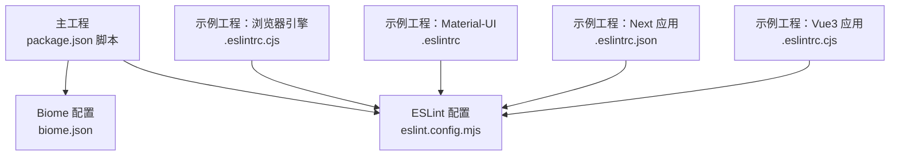
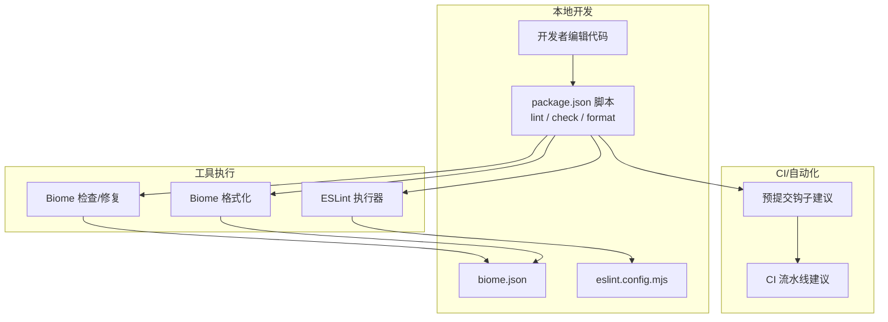
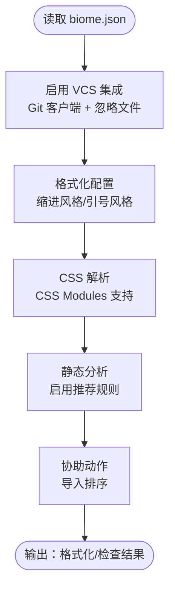
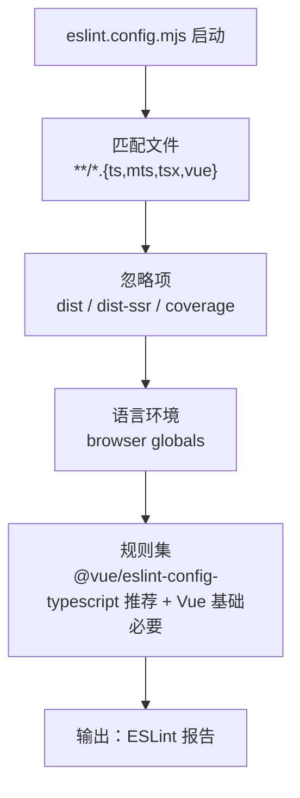
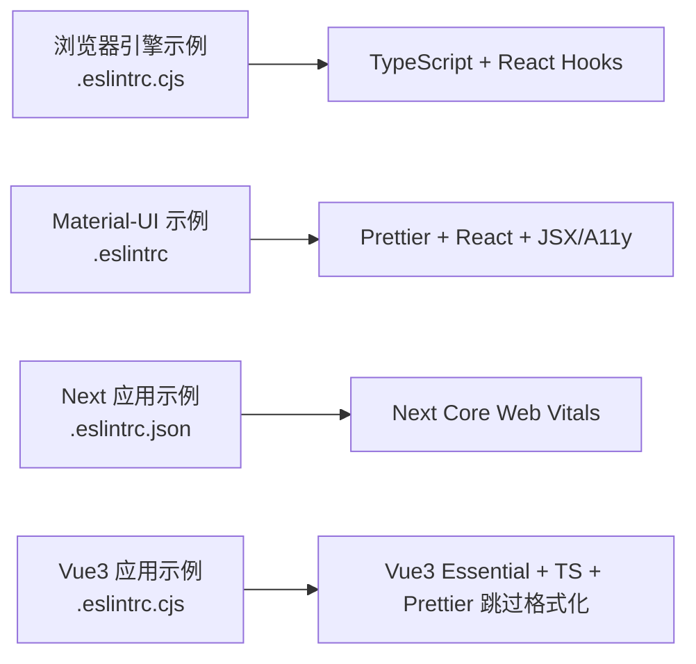
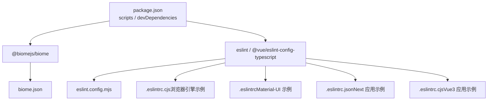

# 代码质量工具

<cite>
**本文引用的文件**
- [biome.json](file://biome.json)
- [eslint.config.mjs](file://eslint.config.mjs)
- [package.json](file://package.json)
- [.eslintrc.cjs（浏览器引擎示例）](file://examples/engine-browser-examples/.eslintrc.cjs)
- [.eslintrc（Material-UI 示例）](file://examples/material-ui-demo/.eslintrc)
- [.eslintrc.json（Next 应用示例）](file://examples/next-app/.eslintrc.json)
- [.eslintrc.cjs（Vue3 应用示例）](file://examples/vue3-app/.eslintrc.cjs)
</cite>

## 目录
1. [简介](#简介)
2. [项目结构](#项目结构)
3. [核心组件](#核心组件)
4. [架构总览](#架构总览)
5. [详细组件分析](#详细组件分析)
6. [依赖关系分析](#依赖关系分析)
7. [性能考量](#性能考量)
8. [故障排查指南](#故障排查指南)
9. [结论](#结论)
10. [附录](#附录)

## 简介
本指南聚焦于本仓库中代码质量工具的配置与实践，系统解析 Biome 与 ESLint 的配置文件及其作用机制，阐述代码格式化、静态分析与错误检测的工作原理；并结合项目脚本与多示例工程的 ESLint 配置，给出团队统一代码规范与开发体验的落地建议，覆盖 VSCode 集成与 IDE 优化、自动化检查流程与预提交钩子配置思路，帮助开发团队建立一致的代码质量与效率保障体系。

## 项目结构
本仓库采用“主工程 + 多示例工程”的组织方式，主工程使用 Biome 进行格式化与静态分析，同时通过 ESLint 配置实现对 TypeScript/Vue/Next 等场景的统一校验；各示例工程提供不同框架下的 ESLint 配置范式，便于团队在多技术栈下复用与对齐。

**图表来源**
- [package.json](file://package.json#L6-L12)
- [biome.json](file://biome.json#L1-L35)
- [eslint.config.mjs](file://eslint.config.mjs#L1-L24)
- [.eslintrc.cjs（浏览器引擎示例）](file://examples/engine-browser-examples/.eslintrc.cjs#L1-L19)
- [.eslintrc（Material-UI 示例）](file://examples/material-ui-demo/.eslintrc#L1-L90)
- [.eslintrc.json（Next 应用示例）](file://examples/next-app/.eslintrc.json#L1-L7)
- [.eslintrc.cjs（Vue3 应用示例）](file://examples/vue3-app/.eslintrc.cjs#L1-L16)

**章节来源**
- [package.json](file://package.json#L6-L12)
- [biome.json](file://biome.json#L1-L35)
- [eslint.config.mjs](file://eslint.config.mjs#L1-L24)

## 核心组件
- Biome：负责格式化与静态分析，通过配置文件启用推荐规则、VCS 集成、CSS Modules 解析等能力，并由主工程脚本统一触发。
- ESLint：通过 flat 配置集中管理多语言与多框架的规则集，覆盖 TS、TSX、Vue 文件，结合全局忽略项与浏览器环境变量，形成统一的静态分析入口。
- 示例工程 ESLint：提供不同框架（React/Next/Vue/Material-UI）的规则实践，便于团队在多技术栈下对齐风格与约束。

**章节来源**
- [biome.json](file://biome.json#L10-L33)
- [eslint.config.mjs](file://eslint.config.mjs#L14-L23)
- [.eslintrc.cjs（浏览器引擎示例）](file://examples/engine-browser-examples/.eslintrc.cjs#L1-L19)
- [.eslintrc（Material-UI 示例）](file://examples/material-ui-demo/.eslintrc#L1-L90)
- [.eslintrc.json（Next 应用示例）](file://examples/next-app/.eslintrc.json#L1-L7)
- [.eslintrc.cjs（Vue3 应用示例）](file://examples/vue3-app/.eslintrc.cjs#L1-L16)

## 架构总览
下图展示主工程如何通过脚本串联 Biome 与 ESLint，形成“格式化 → 检查 → 修复”的质量控制闭环，并在 CI 中可扩展为预提交钩子与流水线任务。

**图表来源**
- [package.json](file://package.json#L6-L12)
- [biome.json](file://biome.json#L1-L35)
- [eslint.config.mjs](file://eslint.config.mjs#L1-L24)

## 详细组件分析

### Biome 配置分析
- VCS 集成：启用 Git 客户端、基于 .gitignore 的忽略策略，确保仅对受控变更进行检查。
- 格式化：统一缩进风格为空格；JavaScript 字符串引号风格为单引号；CSS 解析支持 CSS Modules。
- 静态分析：开启 linter 并启用推荐规则集，保证基础质量门槛。
- 协助功能：开启导入排序动作，提升开发时自动整理导入的效率。

**图表来源**
- [biome.json](file://biome.json#L10-L33)

**章节来源**
- [biome.json](file://biome.json#L1-L35)

### ESLint 配置分析（主工程）
- 配置类型：采用 ESLint flat 配置，集中定义文件匹配、忽略项、语言环境与规则组合。
- 文件范围：针对 TS、MTS、TSX、Vue 文件进行统一校验。
- 规则来源：使用 @vue/eslint-config-typescript 的推荐配置，叠加 Vue 基础必要规则与浏览器环境全局变量。
- 忽略项：排除构建产物与覆盖率目录，避免误报与性能浪费。

**图表来源**
- [eslint.config.mjs](file://eslint.config.mjs#L14-L23)

**章节来源**
- [eslint.config.mjs](file://eslint.config.mjs#L1-L24)

### 示例工程 ESLint 配置对比
- 浏览器引擎示例：以 TypeScript 为主，启用 React Hooks 推荐规则与刷新插件，强调最小化规则集与可选修复。
- Material-UI 示例：引入 Prettier、React/JSX/A11y 等插件，规则较多且偏向严格，适合大型前端应用。
- Next 应用示例：基于 Next Core Web Vitals 规范，微调导出相关规则，适配现代 Next 开发体验。
- Vue3 应用示例：采用 Vue3 Essential 规则与 TypeScript 配置，结合 Prettier 跳过格式化，平衡风格与一致性。

**图表来源**
- [.eslintrc.cjs（浏览器引擎示例）](file://examples/engine-browser-examples/.eslintrc.cjs#L1-L19)
- [.eslintrc（Material-UI 示例）](file://examples/material-ui-demo/.eslintrc#L1-L90)
- [.eslintrc.json（Next 应用示例）](file://examples/next-app/.eslintrc.json#L1-L7)
- [.eslintrc.cjs（Vue3 应用示例）](file://examples/vue3-app/.eslintrc.cjs#L1-L16)

**章节来源**
- [.eslintrc.cjs（浏览器引擎示例）](file://examples/engine-browser-examples/.eslintrc.cjs#L1-L19)
- [.eslintrc（Material-UI 示例）](file://examples/material-ui-demo/.eslintrc#L1-L90)
- [.eslintrc.json（Next 应用示例）](file://examples/next-app/.eslintrc.json#L1-L7)
- [.eslintrc.cjs（Vue3 应用示例）](file://examples/vue3-app/.eslintrc.cjs#L1-L16)

## 依赖关系分析
- 主工程脚本：通过 npm/yarn/pnpm 脚本统一调度 Biome 与 ESLint，形成一致的本地与 CI 行为。
- 工具版本：Biome 与 ESLint 及其插件均在 devDependencies 中声明，确保团队成员安装一致版本。
- 配置耦合：主工程 ESLint 使用 @vue/eslint-config-typescript，与示例工程的 Vue 配置保持风格一致，降低迁移成本。

**图表来源**
- [package.json](file://package.json#L6-L43)
- [biome.json](file://biome.json#L1-L35)
- [eslint.config.mjs](file://eslint.config.mjs#L1-L24)
- [.eslintrc.cjs（浏览器引擎示例）](file://examples/engine-browser-examples/.eslintrc.cjs#L1-L19)
- [.eslintrc（Material-UI 示例）](file://examples/material-ui-demo/.eslintrc#L1-L90)
- [.eslintrc.json（Next 应用示例）](file://examples/next-app/.eslintrc.json#L1-L7)
- [.eslintrc.cjs（Vue3 应用示例）](file://examples/vue3-app/.eslintrc.cjs#L1-L16)

**章节来源**
- [package.json](file://package.json#L6-L43)

## 性能考量
- 忽略项：主工程 ESLint 明确忽略构建产物与覆盖率目录，减少扫描范围，提升执行速度。
- VCS 集成：Biome 启用 VCS 集成与忽略文件，仅对变更文件进行检查，降低全量扫描开销。
- 规则集：启用推荐规则集，兼顾质量与性能，避免过度严格的规则导致频繁失败与重试。

**章节来源**
- [eslint.config.mjs](file://eslint.config.mjs#L19-L23)
- [biome.json](file://biome.json#L10-L14)

## 故障排查指南
- ESLint 报错定位：优先检查文件匹配与忽略项是否覆盖到目标文件；确认语言环境与规则集是否正确加载。
- Biome 格式化冲突：若与 Prettier 或团队既有格式化工具冲突，可在 Biome 中调整格式化策略或在 CI 中选择单一工具链。
- 示例工程差异：不同示例工程的规则强度不同，建议在团队内统一采用主工程 ESLint 配置或示例工程中最接近团队风格的配置，并在 PR 审查中明确要求。

**章节来源**
- [eslint.config.mjs](file://eslint.config.mjs#L14-L23)
- [biome.json](file://biome.json#L15-L22)

## 结论
本仓库通过 Biome 与 ESLint 的协同配置，实现了跨框架、跨语言的一致性质量保障。主工程采用扁平化 ESLint 配置与推荐规则集，配合 Biome 的格式化与静态分析，形成高效的本地与 CI 流程。示例工程提供了多技术栈的规则实践参考，便于团队在多项目中快速对齐规范。建议团队在此基础上完善 VSCode 集成与预提交钩子，进一步固化质量门禁。

## 附录

### VSCode 集成与 IDE 优化建议
- 插件生态：安装 Biome 与 ESLint 官方插件，确保编辑器在保存/打开时自动执行格式化与检查。
- 设置联动：将编辑器的格式化委托给 Biome，同时在 ESLint 插件中启用“提示即修复”与“显示问题来源”，提升反馈效率。
- 工作区配置：在工作区设置中启用“将 ESLint 作为默认格式化程序”，并在保存时触发格式化，减少手动干预。
- 团队共享：将 VSCode 扩展清单与推荐设置纳入版本控制，确保新成员快速获得一致的开发体验。

### 自动化代码检查流程与预提交钩子
- 本地流程：在 package.json 中定义 lint、check、format 等脚本，开发人员在提交前先执行格式化与检查。
- 预提交钩子：使用如 Husky + lint-staged，在提交前仅对暂存文件执行 Biome 格式化与 ESLint 检查，失败则阻止提交。
- CI 流水线：在 CI 中增加“安装依赖 → 格式化检查 → 静态分析 → 构建预览”的步骤，确保合并前的质量门禁。
- 规则收敛：定期回顾与精简规则集，避免过度严格导致的提交阻塞与低效。