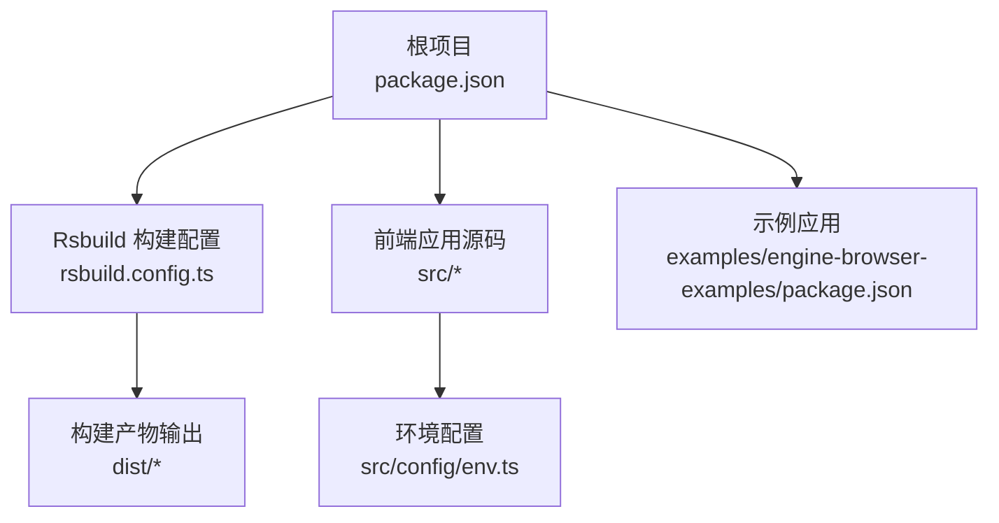
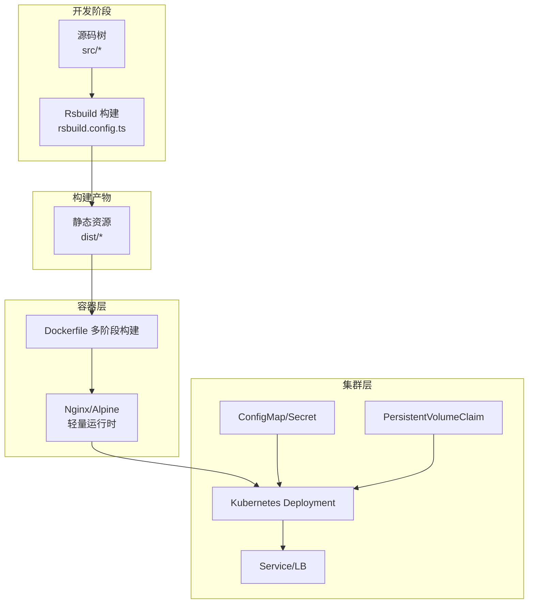
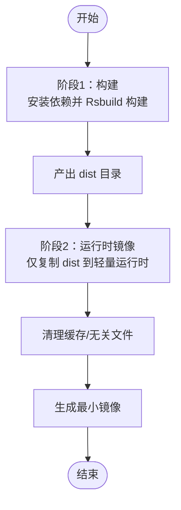
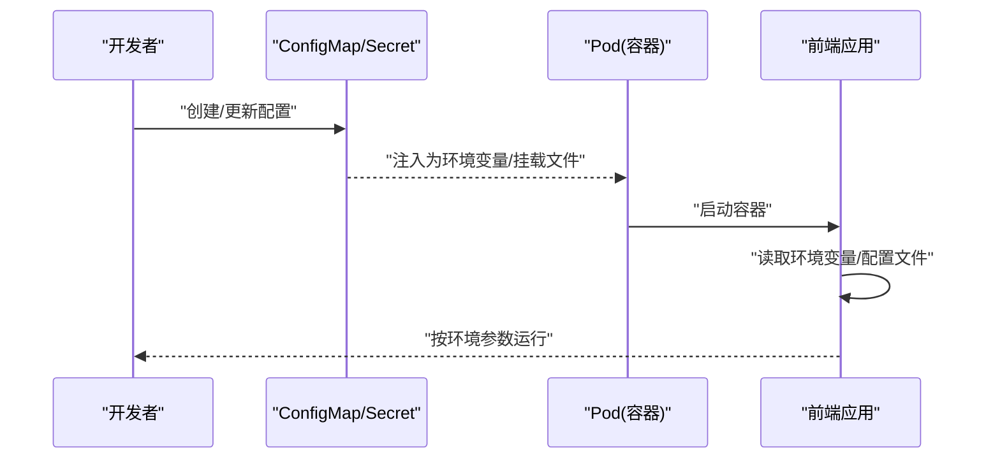
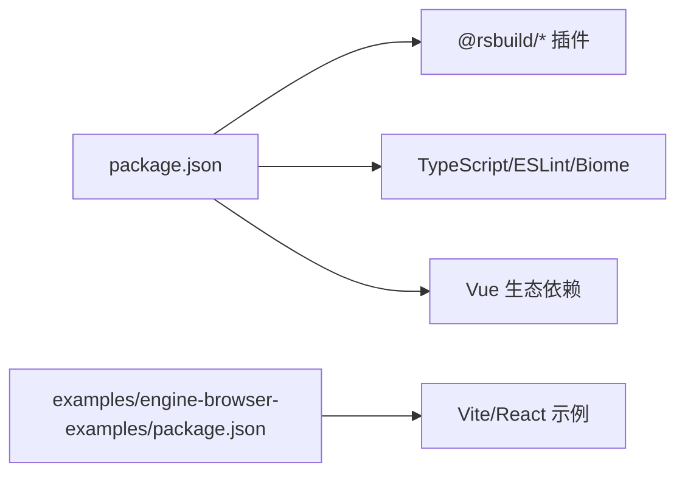

# 容器化部署

<cite>
**本文引用的文件**
- [package.json](file://package.json)
- [README.md](file://README.md)
- [rsbuild.config.ts](file://rsbuild.config.ts)
- [src/config/env.ts](file://src/config/env.ts)
- [src/env.d.ts](file://src/env.d.ts)
- [examples/engine-browser-examples/package.json](file://examples/engine-browser-examples/package.json)
</cite>

## 目录
1. [简介](#简介)
2. [项目结构](#项目结构)
3. [核心组件](#核心组件)
4. [架构总览](#架构总览)
5. [详细组件分析](#详细组件分析)
6. [依赖关系分析](#依赖关系分析)
7. [性能考虑](#性能考虑)
8. [故障排查指南](#故障排查指南)
9. [结论](#结论)
10. [附录](#附录)

## 简介
本方案面向使用 Rsbuild 构建的前端工程（如本仓库中的 Vue 应用），提供一套完整的容器化部署专业方案，涵盖：
- Docker 容器化配置与镜像构建策略
- 多阶段构建优化与镜像体积控制
- 容器编排与 Kubernetes 部署配置要点
- 环境变量管理、配置文件挂载与数据持久化方案
- 负载均衡、健康检查与自动扩缩容配置建议
- 容器安全最佳实践与监控告警设置
- 面向 DevOps 团队的完整落地指引

本方案以仓库现有构建配置与运行脚本为基础，结合容器化与 Kubernetes 实践，给出可直接落地的实施路径。

## 项目结构
该仓库采用多包结构与 Rsbuild 构建工具，核心前端应用位于根目录，示例应用位于 examples 目录。Rsbuild 配置集中于根目录的配置文件中，提供 Vue、JSX、Less 插件与别名等能力；环境变量通过 src/config/env.ts 统一管理。

图表来源
- [package.json](file://package.json#L1-L45)
- [rsbuild.config.ts](file://rsbuild.config.ts#L1-L30)
- [src/config/env.ts](file://src/config/env.ts#L1-L120)
- [examples/engine-browser-examples/package.json](file://examples/engine-browser-examples/package.json#L1-L39)

章节来源
- [package.json](file://package.json#L1-L45)
- [README.md](file://README.md#L1-L37)
- [rsbuild.config.ts](file://rsbuild.config.ts#L1-L30)
- [src/config/env.ts](file://src/config/env.ts#L1-L120)
- [examples/engine-browser-examples/package.json](file://examples/engine-browser-examples/package.json#L1-L39)

## 核心组件
- 构建系统与入口
  - Rsbuild 配置：启用 Vue、JSX、Less 插件，设置路径别名与开发服务器行为。
  - 构建脚本：提供 dev、build、preview 等命令，用于本地开发与生产构建。
- 运行时环境与配置
  - 环境配置模块：根据 MODE 自动选择开发/测试/生产环境，并导出基础 URL、超时、标题与 Mock 开关等。
  - 类型声明：为 Rsbuild 类型与 Vue 模块提供类型支持。
- 示例应用
  - 示例工程使用 Vite/React 技术栈，便于对比不同构建工具在容器化场景下的差异。

章节来源
- [rsbuild.config.ts](file://rsbuild.config.ts#L1-L30)
- [package.json](file://package.json#L6-L12)
- [src/config/env.ts](file://src/config/env.ts#L1-L120)
- [src/env.d.ts](file://src/env.d.ts#L1-L10)
- [examples/engine-browser-examples/package.json](file://examples/engine-browser-examples/package.json#L1-L39)

## 架构总览
下图展示从源码到容器镜像再到 Kubernetes 集群的整体流程，强调构建产物、运行时配置与外部依赖的关系。

图表来源
- [rsbuild.config.ts](file://rsbuild.config.ts#L1-L30)
- [package.json](file://package.json#L6-L12)
- [src/config/env.ts](file://src/config/env.ts#L31-L50)

## 详细组件分析

### Docker 容器化与镜像构建策略
- 基础镜像选择
  - 推荐使用精简的基础镜像（如 Nginx Alpine 或轻量 Linux 发行版），减少攻击面与镜像体积。
- 多阶段构建
  - 第一阶段：安装构建依赖并执行 Rsbuild 构建，生成 dist 目录。
  - 第二阶段：仅复制 dist 到最小化运行时镜像，不携带构建工具链，显著降低体积与风险。
- 镜像体积控制
  - 清理缓存与临时文件，避免将 node_modules 与构建日志打包进最终镜像。
  - 合理利用 .dockerignore，排除不必要的源码与日志。
- 运行时优化
  - 使用只读文件系统、禁用不必要的用户权限，启用非 root 用户运行。
  - 在容器内设置合理的 ulimit、进程数与内存限制，避免资源争用。

图表来源
- [rsbuild.config.ts](file://rsbuild.config.ts#L1-L30)
- [package.json](file://package.json#L6-L12)

章节来源
- [rsbuild.config.ts](file://rsbuild.config.ts#L1-L30)
- [package.json](file://package.json#L6-L12)

### 环境变量管理与配置挂载
- 环境变量注入
  - 将 API 基础地址、超时、标题与 Mock 开关等通过环境变量注入容器，避免硬编码。
  - 在 Kubernetes 中使用 ConfigMap/Secret 管理敏感与非敏感配置，通过环境变量或挂载为文件的方式注入。
- 配置文件挂载
  - 对于需要动态调整的配置（如主题、规则），可通过 ConfigMap 挂载为只读文件，应用启动时读取。
- 运行时切换
  - 借助现有环境配置模块，按 MODE 自动选择不同环境参数，确保开发/测试/生产一致性。

图表来源
- [src/config/env.ts](file://src/config/env.ts#L31-L50)

章节来源
- [src/config/env.ts](file://src/config/env.ts#L1-L120)

### 数据持久化方案
- 非持久化场景
  - 前端静态资源无需持久化，使用只读卷或临时存储即可。
- 可选持久化
  - 若需保存用户偏好、离线缓存或临时上传文件，可在 Pod 层面挂载 PVC，注意数据备份与权限控制。
- 最佳实践
  - 将写操作限制在最小必要范围，避免在容器内写入日志与缓存，统一由宿主机或云存储处理。

章节来源
- [src/config/env.ts](file://src/config/env.ts#L61-L89)

### 负载均衡、健康检查与自动扩缩容
- 负载均衡
  - 使用 Service 暴露应用，配合 Ingress 控制器实现外部流量分发与 TLS 终止。
- 健康检查
  - Liveness/Readiness 探针：基于静态资源可达性进行探测，确保容器健康与流量接入时机。
- 自动扩缩容
  - HPA：基于 CPU/内存或自定义指标进行弹性伸缩；VPA：优化资源配额。
  - PodDisruptionBudget：保障扩缩容过程中的可用性。

章节来源
- [rsbuild.config.ts](file://rsbuild.config.ts#L19-L23)

### 容器安全最佳实践
- 最小权限
  - 使用非 root 用户运行，禁用特权模式与 CAP_SYS_ADMIN。
- 只读根文件系统
  - 仅在必要时挂载写盘，避免容器内持久化敏感数据。
- 镜像安全
  - 使用可信基础镜像，定期扫描漏洞，固定镜像标签，启用 SBOM。
- 网络安全
  - 限制入站/出站流量，启用网络策略，TLS 终止与证书管理。

章节来源
- [package.json](file://package.json#L14-L26)

### 监控告警设置
- 指标采集
  - 容器级：CPU/内存/IO；应用级：页面加载时间、错误率、响应时间。
- 日志
  - 标准输出/错误输出统一收集，结合结构化日志与上下文追踪。
- 告警
  - 基于阈值与趋势的告警策略，区分严重/警告级别，联动通知渠道。

章节来源
- [README.md](file://README.md#L11-L29)

## 依赖关系分析
- 构建依赖
  - Rsbuild 与插件：Vue、JSX、Less 插件共同支撑前端构建。
  - 开发依赖：ESLint、Biome、TypeScript 等工具链保证代码质量与类型安全。
- 运行时依赖
  - Vue 生态与逻辑流相关库构成前端运行时。
- 示例应用
  - 示例工程采用 Vite/React 技术栈，便于横向对比不同构建工具在容器化场景下的差异。

图表来源
- [package.json](file://package.json#L14-L43)
- [examples/engine-browser-examples/package.json](file://examples/engine-browser-examples/package.json#L12-L36)

章节来源
- [package.json](file://package.json#L1-L45)
- [examples/engine-browser-examples/package.json](file://examples/engine-browser-examples/package.json#L1-L39)

## 性能考虑
- 构建性能
  - 启用增量构建与缓存，合理拆分包体，减少首屏加载时间。
- 运行性能
  - 使用 CDN 加速静态资源，开启 Gzip/Brotli 压缩，合理设置缓存头。
- 资源配额
  - 为容器设置合理的 requests/limits，避免资源争用导致抖动。

章节来源
- [rsbuild.config.ts](file://rsbuild.config.ts#L19-L23)
- [package.json](file://package.json#L28-L43)

## 故障排查指南
- 构建失败
  - 检查 Rsbuild 插件配置与别名设置，确认 Node 版本与依赖安装是否一致。
- 运行异常
  - 查看容器日志与探针状态，确认健康检查路径与返回码。
- 配置问题
  - 核对环境变量注入顺序与优先级，确认 ConfigMap/Secret 是否正确挂载。
- 性能问题
  - 分析静态资源体积与请求数，评估缓存策略与压缩效果。

章节来源
- [rsbuild.config.ts](file://rsbuild.config.ts#L19-L23)
- [src/config/env.ts](file://src/config/env.ts#L52-L56)
- [README.md](file://README.md#L11-L29)

## 结论
本方案以 Rsbuild 构建体系为基础，结合多阶段 Docker 构建与 Kubernetes 编排，提供了从镜像构建、配置管理、持久化、负载均衡、健康检查到安全与监控的全链路容器化部署方案。通过标准化流程与最佳实践，可有效提升交付效率与运行稳定性，满足生产环境的高可用与可观测性要求。

## 附录
- 快速参考
  - 构建命令：参见构建脚本与 Rsbuild 配置。
  - 环境变量：参见环境配置模块与注入方式。
  - 示例工程：参见示例应用的构建与运行方式。

章节来源
- [package.json](file://package.json#L6-L12)
- [rsbuild.config.ts](file://rsbuild.config.ts#L1-L30)
- [src/config/env.ts](file://src/config/env.ts#L1-L120)
- [examples/engine-browser-examples/package.json](file://examples/engine-browser-examples/package.json#L6-L11)