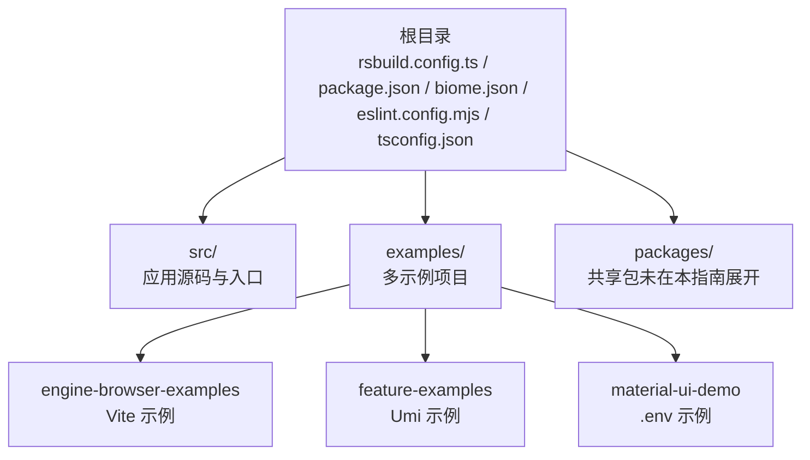
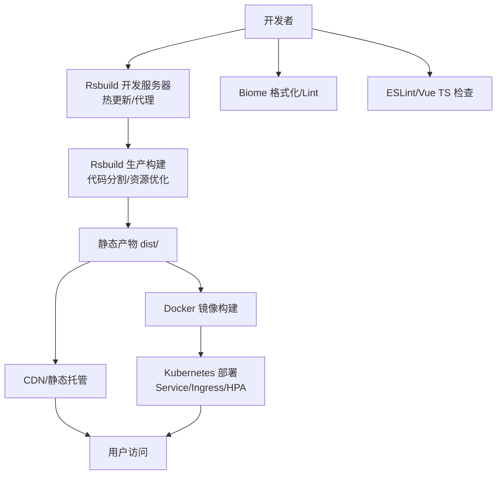
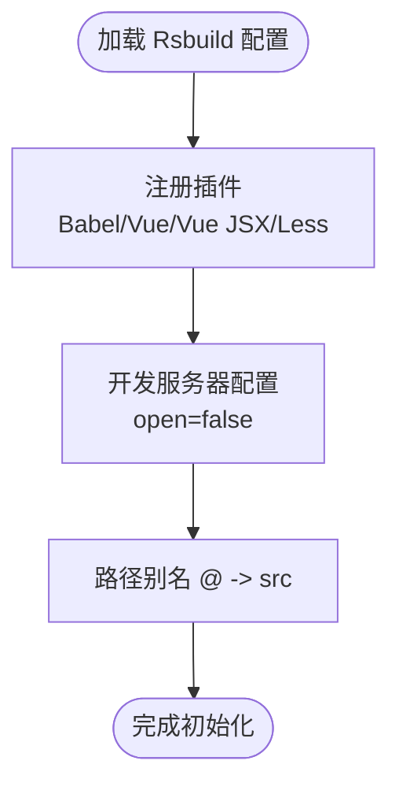
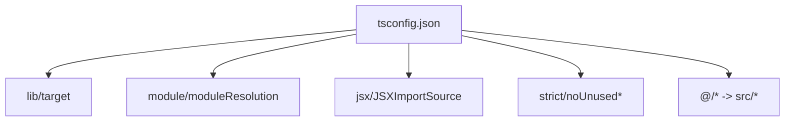
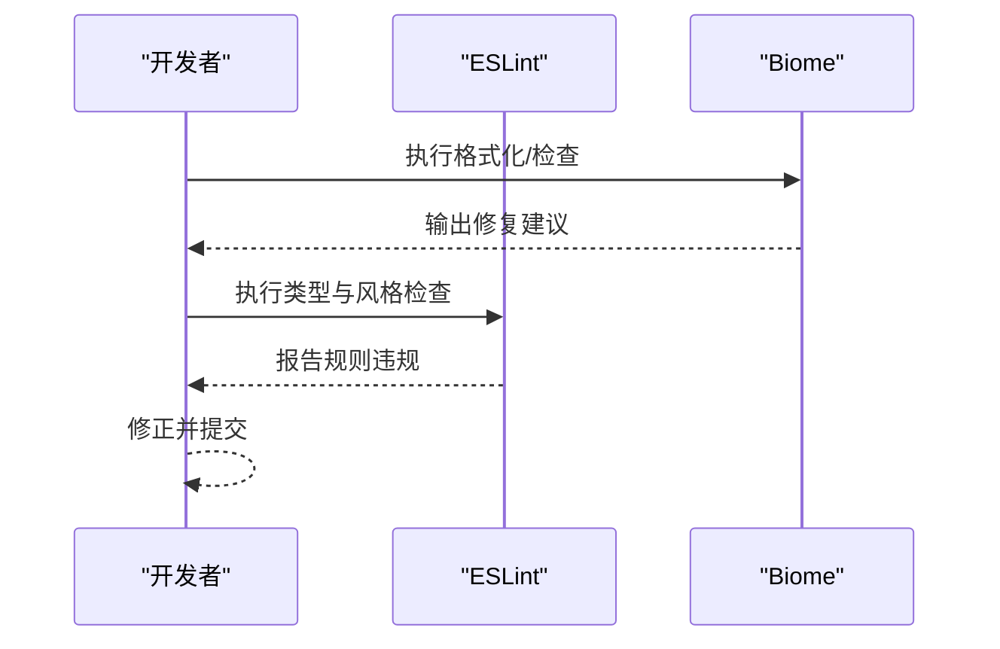
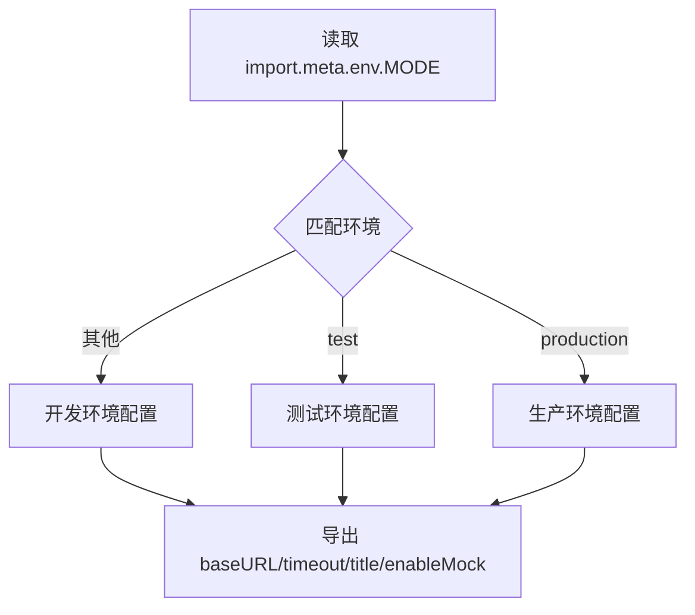
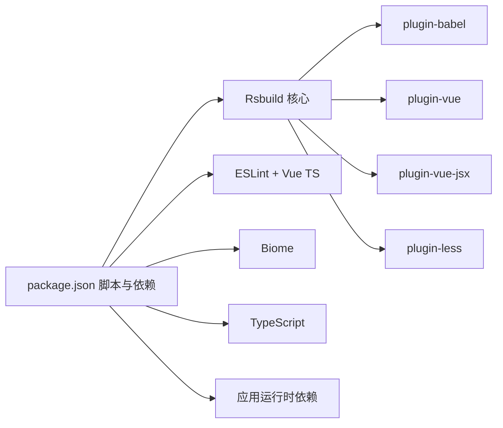

# 构建与部署

<cite>
**本文引用的文件**
- [rsbuild.config.ts](file://rsbuild.config.ts)
- [package.json](file://package.json)
- [biome.json](file://biome.json)
- [eslint.config.mjs](file://eslint.config.mjs)
- [tsconfig.json](file://tsconfig.json)
- [src/config/env.ts](file://src/config/env.ts)
- [examples/engine-browser-examples/package.json](file://examples/engine-browser-examples/package.json)
- [examples/feature-examples/package.json](file://examples/feature-examples/package.json)
- [examples/material-ui-demo/.env](file://examples/material-ui-demo/.env)
</cite>

## 目录
1. [简介](#简介)
2. [项目结构](#项目结构)
3. [核心组件](#核心组件)
4. [架构总览](#架构总览)
5. [详细组件分析](#详细组件分析)
6. [依赖关系分析](#依赖关系分析)
7. [性能考虑](#性能考虑)
8. [故障排查指南](#故障排查指南)
9. [结论](#结论)
10. [附录](#附录)

## 简介
本指南面向 DevOps 工程师与前端团队，系统梳理 Rsbuild 在本项目中的构建与部署实践，覆盖开发服务器、代码分割、资源优化、TypeScript 类型检查、ESLint/Biome 质量工具链、生产构建最佳实践、缓存与静态资源优化、容器化与 Kubernetes 部署、CI/CD 自动化以及多环境配置管理与安全加固建议。文档以仓库现有配置为基础，结合可扩展的工程化实践，帮助团队在保证质量与性能的前提下稳定交付。

## 项目结构
本仓库采用多包（monorepo）风格组织，根目录提供统一的 Rsbuild 构建配置与脚本，src 下为核心应用源码，examples 中包含多个示例子项目用于演示不同技术栈与构建方式。关键配置集中在根目录的构建与质量工具配置文件中，便于统一管理与跨项目复用。

图示来源
- [rsbuild.config.ts](file://rsbuild.config.ts#L1-L30)
- [package.json](file://package.json#L1-L45)
- [examples/engine-browser-examples/package.json](file://examples/engine-browser-examples/package.json#L1-L39)
- [examples/feature-examples/package.json](file://examples/feature-examples/package.json#L1-L29)
- [examples/material-ui-demo/.env](file://examples/material-ui-demo/.env#L1-L3)

章节来源
- [rsbuild.config.ts](file://rsbuild.config.ts#L1-L30)
- [package.json](file://package.json#L1-L45)

## 核心组件
- Rsbuild 构建配置：定义插件体系（Babel、Vue、Vue JSX、Less）、开发服务器与别名路径，支撑现代化前端工程化需求。
- 脚本与任务：通过 npm scripts 统一执行开发、构建、预览、格式化与质量检查，形成标准化流水线入口。
- 质量工具链：Biome 负责格式化与 Lint 规则，ESLint 与 Vue TypeScript 配置共同保障代码一致性与类型安全。
- TypeScript 配置：严格模式、模块解析策略、路径映射与 JSX 处理，确保类型检查与模块打包兼容性。
- 环境配置：基于 Rsbuild 的 import.meta.env 模式自动识别环境，集中管理 API 基址、超时、标题与 Mock 开关等。

章节来源
- [rsbuild.config.ts](file://rsbuild.config.ts#L10-L29)
- [package.json](file://package.json#L6-L12)
- [biome.json](file://biome.json#L1-L35)
- [eslint.config.mjs](file://eslint.config.mjs#L1-L24)
- [tsconfig.json](file://tsconfig.json#L1-L33)
- [src/config/env.ts](file://src/config/env.ts#L1-L120)

## 架构总览
下图展示从开发到生产的整体流程：开发者通过 Rsbuild 启动本地服务，进行编码与调试；质量工具在提交前或 CI 中执行；构建产物经优化后发布至静态托管或容器镜像；Kubernetes 进行编排与扩缩容，配合 Ingress/Service 实现流量接入与健康检查。

图示来源
- [rsbuild.config.ts](file://rsbuild.config.ts#L19-L23)
- [package.json](file://package.json#L6-L12)
- [biome.json](file://biome.json#L28-L33)
- [eslint.config.mjs](file://eslint.config.mjs#L14-L23)

## 详细组件分析

### Rsbuild 构建配置
- 插件体系
  - Babel：对 JSX/TSX 进行转译，适配目标运行时。
  - Vue：支持 .vue 单文件组件与模板编译。
  - Vue JSX：启用 Vue JSX 支持，满足混合场景。
  - Less：内置样式预处理能力，简化主题与样式管理。
- 开发服务器
  - 关闭自动打开浏览器，便于多终端协作与 CI 环境运行。
- 路径别名
  - 将 @ 映射到 src，提升导入可读性与维护性。

图示来源
- [rsbuild.config.ts](file://rsbuild.config.ts#L11-L28)

章节来源
- [rsbuild.config.ts](file://rsbuild.config.ts#L10-L29)

### TypeScript 配置与类型安全
- 编译选项
  - 目标与库：ES2020 + DOM，兼顾现代浏览器与运行时 API。
  - 模块解析：bundler 强制检测，避免隐式依赖与路径歧义。
  - JSX：preserve 交由上层工具处理，保持灵活性。
  - 严格模式：开启严格检查，减少潜在类型问题。
- 路径映射
  - 与 Rsbuild 别名一致，确保开发与构建一致的模块解析行为。

图示来源
- [tsconfig.json](file://tsconfig.json#L2-L32)

章节来源
- [tsconfig.json](file://tsconfig.json#L1-L33)

### ESLint 与 Biome 质量工具集成
- ESLint
  - 基于 Vue TypeScript 配置，启用 Vue 平台推荐规则与全局浏览器变量。
  - 忽略构建产物与覆盖率目录，聚焦源码质量。
- Biome
  - 启用 VCS 集成与 Git 忽略文件，自动组织导入。
  - 推荐规则集开启，统一格式化风格（单引号、空格缩进等）。
  - CSS Modules 解析开启，适配样式模块化。

图示来源
- [eslint.config.mjs](file://eslint.config.mjs#L14-L23)
- [biome.json](file://biome.json#L1-L35)

章节来源
- [eslint.config.mjs](file://eslint.config.mjs#L1-L24)
- [biome.json](file://biome.json#L1-L35)

### 环境配置与多环境管理
- 环境识别
  - 依据 Rsbuild 的 import.meta.env.MODE 自动判断 development/test/production。
- 环境配置项
  - baseURL：按环境指向不同 API 基址。
  - timeout：统一请求超时。
  - title：页面标题差异化。
  - enableMock：开发阶段可启用 Mock。
- Token 管理
  - 提供本地存储键值常量与增删改查方法，便于统一鉴权逻辑。
- 业务状态码
  - 预置常见业务与 HTTP 状态码映射，便于统一处理与提示。

图示来源
- [src/config/env.ts](file://src/config/env.ts#L10-L56)

章节来源
- [src/config/env.ts](file://src/config/env.ts#L1-L120)

### 生产构建最佳实践与性能优化
- 代码分割
  - 建议结合路由懒加载与动态 import，拆分首屏与功能模块，降低初始包体。
- 资源优化
  - 启用压缩与 Tree Shaking（Rsbuild 默认），移除未使用代码。
  - 图片与字体资源内联阈值与外部托管策略需结合 CDN 与缓存策略评估。
- 入口与 HTML
  - 使用 Rsbuild 的 HTML 模板注入与资源清单，确保缓存失效友好。
- Source Map
  - 生产环境谨慎开启，平衡可观测性与安全性。

说明：以上为通用优化建议，具体策略应结合实际业务与监控数据迭代。

### 缓存策略与静态资源优化
- 版本化与长缓存
  - 对静态资源采用内容哈希命名，结合 CDN 与浏览器缓存策略，提升二次加载性能。
- 资源预加载
  - 对关键字体与图标使用 preload/prefetch，缩短首屏渲染时间。
- 压缩与编码
  - 启用 Gzip/Brotli 压缩，优先使用 Brotli 以获得更高压缩比。

说明：本节为通用指导，具体实现需在构建与 CDN 层面落地。

### 容器化与 Kubernetes 部署
- Docker 镜像
  - 基于多阶段构建：构建阶段使用 Node + Rsbuild 产出静态产物；运行阶段使用 Nginx/Alpine 静态服务镜像，最小化镜像体积。
  - 将构建产物 dist/ 拷贝至 Nginx 默认站点目录，禁用目录浏览，仅暴露静态文件。
- Kubernetes
  - Deployment：设置副本数、就绪/存活探针，启用滚动更新。
  - Service：ClusterIP 暴露集群内访问。
  - Ingress：TLS 终止、限流与 WAF 建议前置，边缘路由统一管理域名与证书。
  - ConfigMap/Secret：敏感配置与环境变量通过 Secret 注入，避免硬编码。

说明：本节为通用工程化建议，部署细节需结合企业安全基线与合规要求定制。

### CI/CD 流水线与自动化部署
- 触发条件
  - 分支保护：主分支强制合并请求与 CI 通过；PR 自动触发质量检查与构建验证。
- 步骤建议
  - 安装依赖（pnpm/ci）→ 质量检查（Biome + ESLint）→ 类型检查（tsc）→ 构建（rsbuild build）→ 可选：单元测试 → 产物归档 → 部署（Docker 镜像 + Kubernetes）
- 缓存策略
  - 缓存依赖目录与构建缓存，缩短流水线时长。
- 安全扫描
  - 集成 SCA 与 SAST，阻断高危风险变更。

说明：本节为通用流水线设计建议，具体实现需结合企业 CI 平台与制品库策略。

## 依赖关系分析
- 构建与运行时
  - Rsbuild 作为核心构建引擎，依赖各插件完成语言与样式处理。
  - 应用运行时依赖 Vue 3、Vue Router、Axios 等生态库。
- 质量工具
  - Biome 与 ESLint 形成互补：Biome 负责格式化与快速修复，ESLint 提供更丰富的规则与 Vue 平台支持。
- TypeScript
  - 与 Rsbuild 插件协同，确保类型检查与模块解析一致性。

图示来源
- [package.json](file://package.json#L14-L43)
- [rsbuild.config.ts](file://rsbuild.config.ts#L11-L18)
- [eslint.config.mjs](file://eslint.config.mjs#L14-L23)
- [biome.json](file://biome.json#L28-L33)
- [tsconfig.json](file://tsconfig.json#L2-L32)

章节来源
- [package.json](file://package.json#L1-L45)
- [rsbuild.config.ts](file://rsbuild.config.ts#L1-L30)
- [eslint.config.mjs](file://eslint.config.mjs#L1-L24)
- [biome.json](file://biome.json#L1-L35)
- [tsconfig.json](file://tsconfig.json#L1-L33)

## 性能考虑
- 构建性能
  - 使用 pnpm 与构建缓存，减少重复安装与编译时间。
  - 合理拆分第三方库与业务代码，利用浏览器缓存。
- 运行性能
  - 首屏优化：路由懒加载、关键资源优先加载、骨架屏或占位符。
  - 网络优化：启用 HTTP/2 或 HTTP/3、CDN 加速、Gzip/Brotli 压缩。
- 监控与回滚
  - 建立构建与运行时指标（体积、首屏、TTFB、CLS），异常自动回滚。

## 故障排查指南
- 开发服务器无法启动
  - 检查端口占用与代理配置；确认 Rsbuild 插件是否正确安装与启用。
- 环境变量不生效
  - 确认使用 import.meta.env.* 访问；核对 MODE 与别名配置。
- 质量检查失败
  - Biome 优先修复格式问题；ESLint 逐条修正规则违规；必要时调整忽略规则。
- 构建产物异常
  - 清理构建缓存与 node_modules，重新安装依赖；检查 tsconfig 与插件配置一致性。

章节来源
- [rsbuild.config.ts](file://rsbuild.config.ts#L19-L23)
- [src/config/env.ts](file://src/config/env.ts#L10-L16)
- [eslint.config.mjs](file://eslint.config.mjs#L19-L23)
- [biome.json](file://biome.json#L10-L14)

## 结论
本指南基于 Rsbuild 与配套质量工具链，给出了从开发到生产的完整工程化路径。通过严格的环境管理、代码质量控制与性能优化策略，可在保证交付效率的同时提升系统的稳定性与可维护性。建议在实际落地中结合企业安全基线与监控体系，持续迭代与完善。

## 附录
- 示例项目参考
  - Vite 示例：展示了独立构建与预览脚本，可作为对比与迁移参考。
  - Umi 示例：演示了约定式路由与构建流程。
  - .env 示例：展示了环境变量的声明方式与 Source Map 控制。

章节来源
- [examples/engine-browser-examples/package.json](file://examples/engine-browser-examples/package.json#L6-L10)
- [examples/feature-examples/package.json](file://examples/feature-examples/package.json#L5-L11)
- [examples/material-ui-demo/.env](file://examples/material-ui-demo/.env#L1-L3)