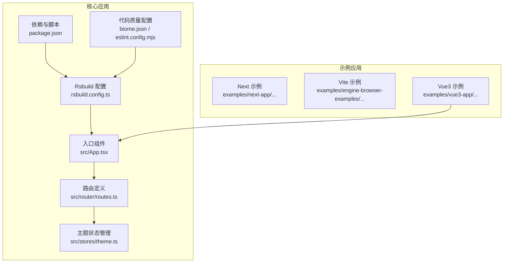
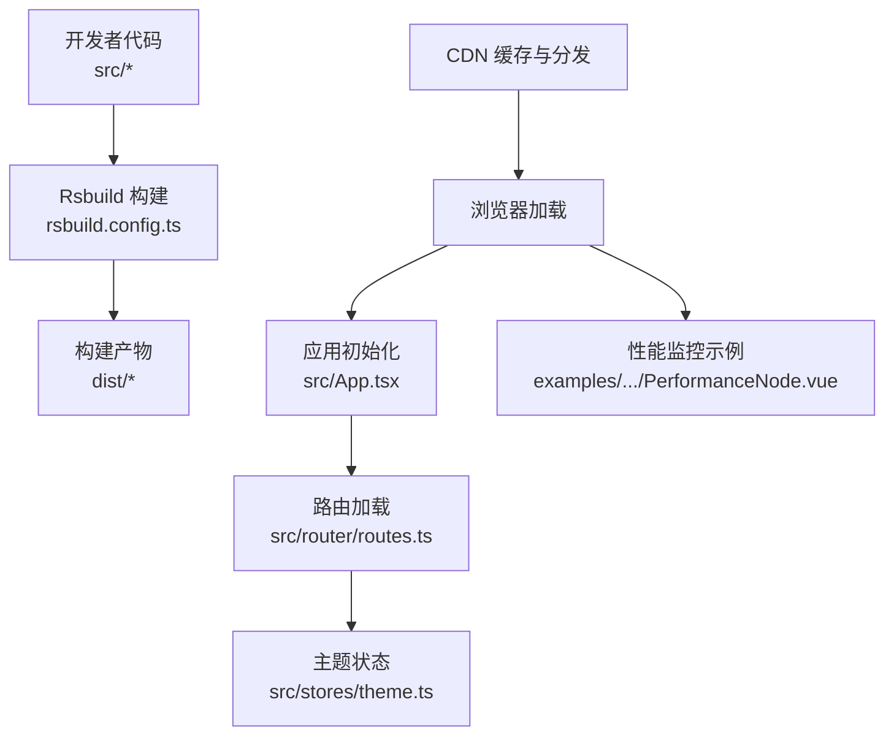
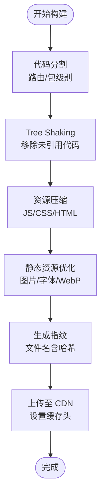
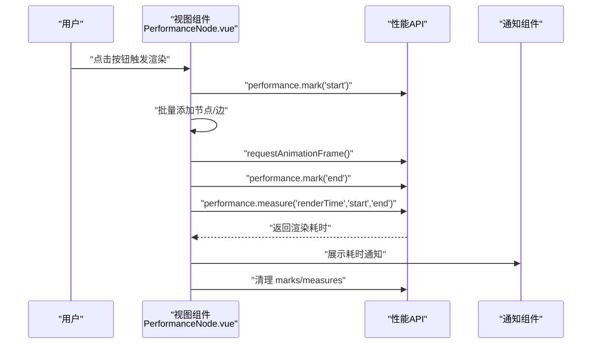
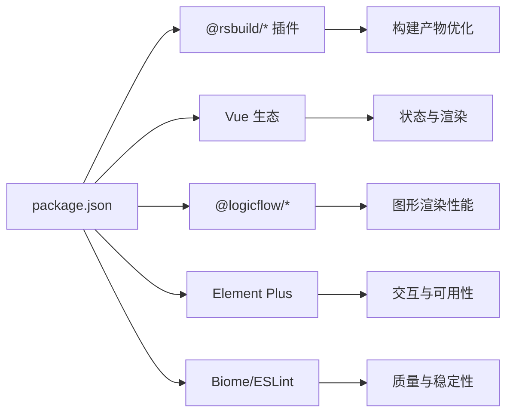

# 生产环境优化

<cite>
**本文引用的文件**
- [rsbuild.config.ts](file://rsbuild.config.ts)
- [package.json](file://package.json)
- [biome.json](file://biome.json)
- [eslint.config.mjs](file://eslint.config.mjs)
- [src/App.tsx](file://src/App.tsx)
- [src/router/routes.ts](file://src/router/routes.ts)
- [src/stores/theme.ts](file://src/stores/theme.ts)
- [examples/vue3-app/src/views/PerformanceNode.vue](file://examples/vue3-app/src/views/PerformanceNode.vue)
</cite>

## 目录
1. [引言](#引言)
2. [项目结构](#项目结构)
3. [核心组件](#核心组件)
4. [架构总览](#架构总览)
5. [详细组件分析](#详细组件分析)
6. [依赖分析](#依赖分析)
7. [性能考虑](#性能考虑)
8. [故障排查指南](#故障排查指南)
9. [结论](#结论)
10. [附录](#附录)

## 引言
本指南面向运维与前端工程团队，围绕该仓库中的 Vue 3 应用与 Rsbuild 构建体系，提供一套可落地的生产环境优化实践。内容涵盖构建产物优化（代码分割、Tree Shaking、资源压缩）、静态资源处理与缓存策略、CDN 集成、性能监控与分析、内存优化、渲染性能提升与用户体验优化，并给出不同部署环境下的策略差异与配置要点。

## 项目结构
该项目采用多包/多示例并存的组织方式，核心应用通过 Rsbuild 进行开发与构建；同时包含多个示例应用（如 Next/Vite/Vue3 等），便于对比不同构建器的优化策略与最佳实践。

- 核心应用位于根目录，使用 Rsbuild 作为构建工具，插件覆盖 Vue、Vue JSX、Less 与 Babel。
- 示例应用位于 examples 目录，包含 Next、Vite、Vue3 等不同生态的示例，便于横向对比与迁移。
- 性能测试与可视化示例位于 Vue3 示例中，可用于评估渲染性能与 DOM 数量增长对体验的影响。

图表来源
- [rsbuild.config.ts](file://rsbuild.config.ts#L1-L30)
- [package.json](file://package.json#L1-L45)
- [src/App.tsx](file://src/App.tsx#L1-L20)
- [src/router/routes.ts](file://src/router/routes.ts#L1-L215)
- [src/stores/theme.ts](file://src/stores/theme.ts#L1-L111)
- [examples/next-app/next.config.mjs](file://examples/next-app/next.config.mjs#L1-L5)
- [examples/engine-browser-examples/vite.config.ts](file://examples/engine-browser-examples/vite.config.ts#L1-L14)
- [examples/vue3-app/vite.config.ts](file://examples/vue3-app/vite.config.ts#L1-L15)

章节来源
- [rsbuild.config.ts](file://rsbuild.config.ts#L1-L30)
- [package.json](file://package.json#L1-L45)

## 核心组件
- 构建配置与插件：Rsbuild 配置启用 Vue、Vue JSX、Less、Babel 插件，设置路径别名与开发服务器参数。
- 代码质量：Biome 与 ESLint 配置统一格式化、导入排序与规则推荐，保障代码一致性与可维护性。
- 应用入口与布局：入口组件负责初始化主题状态，随后渲染基础布局。
- 路由与权限：采用动态路由与按需加载，结合常量路由与权限元信息，支持多级菜单与权限控制。
- 主题状态：Pinia Store 管理主题模式、系统跟随与持久化，监听系统主题变化并应用到 DOM。

章节来源
- [rsbuild.config.ts](file://rsbuild.config.ts#L10-L29)
- [biome.json](file://biome.json#L1-L35)
- [eslint.config.mjs](file://eslint.config.mjs#L1-L24)
- [src/App.tsx](file://src/App.tsx#L1-L20)
- [src/router/routes.ts](file://src/router/routes.ts#L1-L215)
- [src/stores/theme.ts](file://src/stores/theme.ts#L1-L111)

## 架构总览
下图展示从构建到运行的关键链路：开发者通过 Rsbuild 启动开发或打包，构建产物经 CDN 分发至浏览器，应用初始化后加载路由与状态，最终渲染页面。

图表来源
- [rsbuild.config.ts](file://rsbuild.config.ts#L10-L29)
- [src/App.tsx](file://src/App.tsx#L1-L20)
- [src/router/routes.ts](file://src/router/routes.ts#L1-L215)
- [src/stores/theme.ts](file://src/stores/theme.ts#L1-L111)
- [examples/vue3-app/src/views/PerformanceNode.vue](file://examples/vue3-app/src/views/PerformanceNode.vue#L1-L270)

## 详细组件分析

### 构建与优化策略
- 代码分割与懒加载
  - 使用路由级动态导入实现按需加载，减少首屏体积与初次渲染时间。
  - 可在 Rsbuild 中进一步配置 splitChunks、optimization.runtimeChunk 等以细化代码分割策略。
- Tree Shaking
  - 保持模块化与 ES Module 导出，避免副作用与默认导出引发的摇树失效。
  - 在 Rsbuild 中确保构建目标为现代浏览器，启用最小化与死代码移除。
- 资源压缩
  - JS/TS：启用压缩与作用域提升；CSS：启用压缩与去重；HTML：内联关键样式、压缩 HTML。
  - 图片与字体：开启压缩与格式优化（如 WebP），并配合 CDN 缓存头。
- 资源指纹与版本控制
  - 对输出文件启用长缓存的哈希命名，确保变更触发缓存失效。
- CDN 集成
  - 将静态资源托管于 CDN，设置合理的缓存策略与回源策略，利用边缘节点加速。
  - 对第三方依赖可考虑预热或独立域名，降低首字节时间。

图表来源
- [rsbuild.config.ts](file://rsbuild.config.ts#L10-L29)
- [package.json](file://package.json#L6-L12)

章节来源
- [src/router/routes.ts](file://src/router/routes.ts#L13-L14)
- [src/router/routes.ts](file://src/router/routes.ts#L45-L46)
- [src/router/routes.ts](file://src/router/routes.ts#L90-L91)
- [src/router/routes.ts](file://src/router/routes.ts#L100-L101)
- [src/router/routes.ts](file://src/router/routes.ts#L131-L132)
- [src/router/routes.ts](file://src/router/routes.ts#L149-L150)
- [src/router/routes.ts](file://src/router/routes.ts#L206-L213)

### 静态资源处理与缓存策略
- 静态资源分类
  - 入口 HTML：内联关键 CSS，异步加载非关键资源。
  - JS/CSS：启用压缩与去重，拆分为 vendor 与 app 两块，提升缓存命中率。
  - 图片与字体：优先使用现代格式（WebP/WOFF2），按尺寸与类型分别缓存。
- 缓存策略
  - 强缓存：带指纹的静态资源设置较长 max-age。
  - 协商缓存：未带指纹的资源（如 index.html）设置 ETag/Last-Modified。
  - CDN 回源：合理设置 TTL 与回源头，避免热点资源频繁回源。
- CDN 集成
  - 将 dist 目录托管至 CDN，配置边缘缓存与压缩开关。
  - 对第三方依赖可单独域名，避免 Cookie 带宽浪费。

章节来源
- [rsbuild.config.ts](file://rsbuild.config.ts#L10-L29)
- [package.json](file://package.json#L6-L12)

### 性能监控与分析
- 浏览器性能 API
  - 使用 performance.mark/measure 记录渲染阶段耗时，结合 PerformanceObserver 观测长任务。
  - 在示例中已演示基于 mark/measure 的渲染耗时统计与通知提示。
- 内存与 DOM 监控
  - 通过工具函数统计 DOM 元素总数，结合滚动与交互事件进行实时观测。
  - 在大规模节点场景下，建议限制一次性渲染数量并采用虚拟化/批处理策略。
- 用户体验指标
  - 关注 FCP/LCP/FID/CLS 等指标，结合埋点上报与告警阈值。

图表来源
- [examples/vue3-app/src/views/PerformanceNode.vue](file://examples/vue3-app/src/views/PerformanceNode.vue#L103-L151)
- [examples/vue3-app/src/views/PerformanceNode.vue](file://examples/vue3-app/src/views/PerformanceNode.vue#L244-L251)

章节来源
- [examples/vue3-app/src/views/PerformanceNode.vue](file://examples/vue3-app/src/views/PerformanceNode.vue#L1-L270)

### 内存优化与渲染性能提升
- 渲染优化
  - 批量更新：合并多次状态变更，减少重排与重绘。
  - 虚拟化：对超大列表采用虚拟滚动，仅渲染可视区域。
  - 节流与防抖：对高频事件（滚动/缩放）进行节流，降低主线程压力。
- 内存管理
  - 及时解绑事件监听与定时器，避免闭包持有导致的泄漏。
  - 大对象与数组及时释放引用，必要时使用 WeakMap/WeakSet。
  - 在示例中可通过“清空”按钮清理画布数据，验证内存回收效果。

章节来源
- [examples/vue3-app/src/views/PerformanceNode.vue](file://examples/vue3-app/src/views/PerformanceNode.vue#L155-L157)

### 用户体验优化技巧
- 首屏体验
  - 将关键路径资源内联，缩短首屏阻塞；非关键资源延迟加载。
  - 使用骨架屏或占位符，改善感知速度。
- 交互反馈
  - 加载状态与错误提示明确，避免长时间无响应。
  - 对长任务采用进度条或分步执行，保持界面可交互。
- 主题与无障碍
  - 主题切换即时生效并持久化，尊重系统偏好。
  - 提供高对比度与色盲友好模式，完善键盘导航。

章节来源
- [src/stores/theme.ts](file://src/stores/theme.ts#L44-L57)
- [src/stores/theme.ts](file://src/stores/theme.ts#L82-L93)

### 不同部署环境下的优化策略与配置差异
- 开发环境
  - 关闭压缩与指纹，启用 Source Map，便于调试。
  - 禁用 CDN 或使用本地镜像，提高迭代效率。
- 预发布/灰度环境
  - 开启压缩与指纹，模拟真实缓存行为。
  - 部分流量接入 CDN，验证缓存命中与回源情况。
- 生产环境
  - 启用强缓存与协商缓存，严格区分静态资源与接口缓存。
  - CDN 边缘节点开启压缩与安全防护，回源设置健康检查与降级策略。
  - 第三方依赖与核心业务代码分离，独立域名与缓存策略差异化。

章节来源
- [rsbuild.config.ts](file://rsbuild.config.ts#L19-L23)
- [package.json](file://package.json#L6-L12)

## 依赖分析
- 核心依赖
  - Vue 3、Vue Router、Pinia：提供响应式与状态管理能力。
  - LogicFlow：流程图渲染与交互，对 DOM 与渲染性能敏感。
  - Element Plus：UI 组件库，注意按需引入与主题定制。
- 开发依赖
  - Rsbuild 及其插件：构建与开发体验。
  - Biome/ESLint：代码质量与风格统一。
- 优化关联
  - 依赖体积直接影响首屏与缓存命中；建议对第三方库进行按需引入与版本升级。
  - 对 LogicFlow 等重型库，结合懒加载与分包策略，避免阻塞关键路径。

图表来源
- [package.json](file://package.json#L14-L43)
- [rsbuild.config.ts](file://rsbuild.config.ts#L11-L18)

章节来源
- [package.json](file://package.json#L14-L43)

## 性能考虑
- 构建期优化
  - 启用最小化与 Tree Shaking，拆分 vendor 与业务代码，提升缓存复用。
  - 对 CSS 与图片进行压缩与格式优化，减少传输体积。
- 运行期优化
  - 使用路由懒加载与组件级异步加载，降低首屏负担。
  - 对高频交互采用节流/防抖与虚拟化策略，避免主线程阻塞。
- 监控与告警
  - 建立端到端性能指标采集与可视化看板，设置阈值告警。
  - 结合用户行为与设备特征，制定差异化优化策略。

## 故障排查指南
- 构建失败或体积异常
  - 检查 Rsbuild 插件配置与最小化选项，确认第三方库是否正确摇树。
  - 对比不同环境的构建日志，定位新增依赖或配置变更。
- 首屏慢/白屏时间长
  - 检查关键资源是否内联与压缩，确认 CDN 缓存策略与回源配置。
  - 使用性能面板分析关键渲染路径，识别阻塞资源。
- 渲染卡顿与内存飙升
  - 在示例中验证大规模节点场景下的渲染耗时与 DOM 数量，逐步缩小问题范围。
  - 检查是否存在未释放的事件监听、定时器或大对象引用。
- 主题切换异常
  - 确认主题状态持久化与系统偏好监听逻辑正常，检查 DOM 类名切换顺序。

章节来源
- [examples/vue3-app/src/views/PerformanceNode.vue](file://examples/vue3-app/src/views/PerformanceNode.vue#L155-L157)
- [src/stores/theme.ts](file://src/stores/theme.ts#L82-L93)

## 结论
通过在构建期实施代码分割、Tree Shaking 与资源压缩，在运行期采用路由懒加载、虚拟化与节流策略，并结合 CDN 缓存与性能监控，可显著提升生产环境的加载速度、渲染性能与用户体验。针对不同部署环境制定差异化策略，持续观测关键指标并迭代优化，是保障系统稳定与高性能的关键。

## 附录
- 快速检查清单
  - 构建：已启用最小化与指纹；第三方库按需引入；CSS/图片已优化。
  - 缓存：静态资源强缓存；HTML 协商缓存；CDN TTL 合理。
  - 性能：关键路径资源内联；长任务观测与告警；渲染耗时监控。
  - 可用性：主题切换即时且持久；高对比度与无障碍支持；错误提示明确。
- 参考文件
  - [rsbuild.config.ts](file://rsbuild.config.ts#L1-L30)
  - [package.json](file://package.json#L1-L45)
  - [biome.json](file://biome.json#L1-L35)
  - [eslint.config.mjs](file://eslint.config.mjs#L1-L24)
  - [src/App.tsx](file://src/App.tsx#L1-L20)
  - [src/router/routes.ts](file://src/router/routes.ts#L1-L215)
  - [src/stores/theme.ts](file://src/stores/theme.ts#L1-L111)
  - [examples/vue3-app/src/views/PerformanceNode.vue](file://examples/vue3-app/src/views/PerformanceNode.vue#L1-L270)