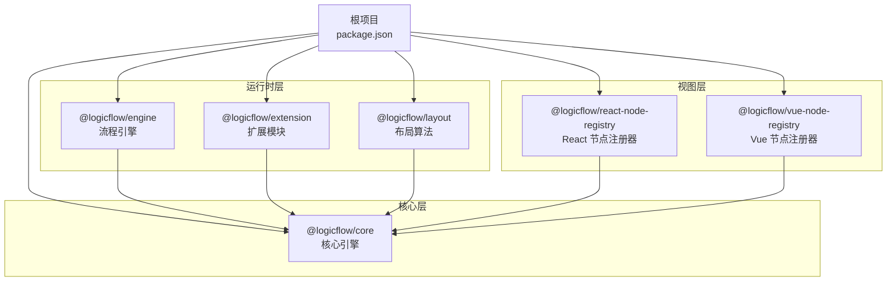
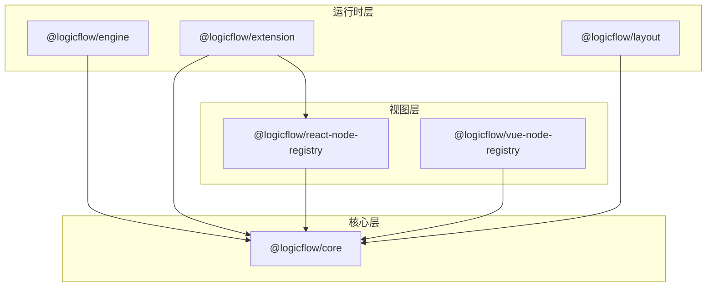
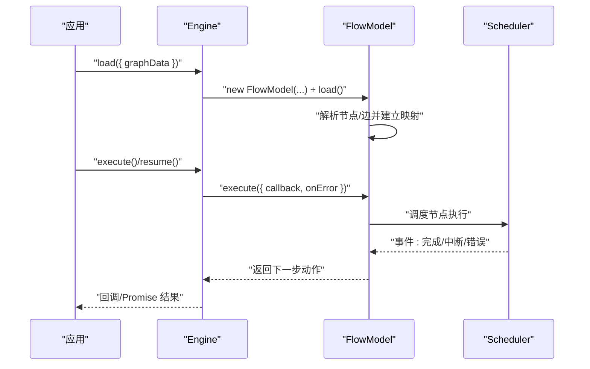
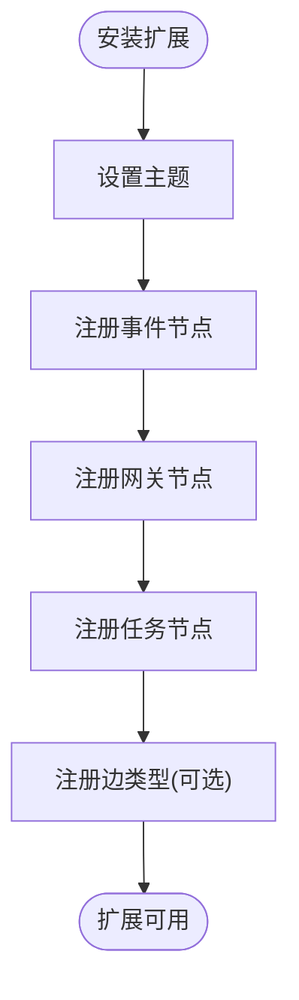
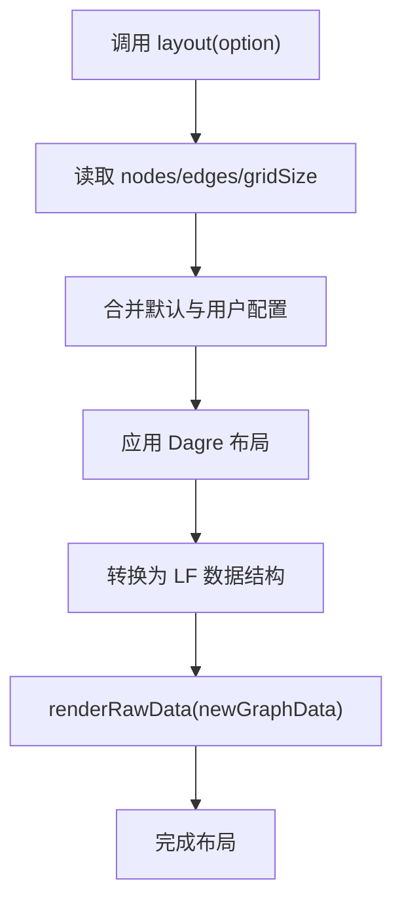
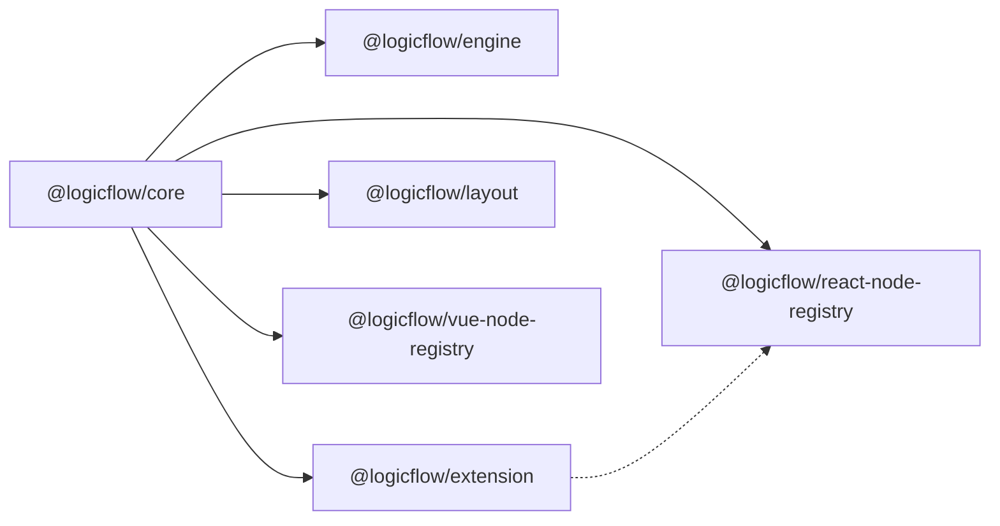

# 包结构与模块化

<cite>
**本文引用的文件**
- [根包配置](file://package.json)
- [核心包 package.json](file://packages/core/package.json)
- [引擎包 package.json](file://packages/engine/package.json)
- [扩展包 package.json](file://packages/extension/package.json)
- [布局包 package.json](file://packages/layout/package.json)
- [React 节点注册器 package.json](file://packages/react-node-registry/package.json)
- [Vue 节点注册器 package.json](file://packages/vue-node-registry/package.json)
- [核心包入口 index.ts](file://packages/core/src/index.ts)
- [引擎包入口 index.ts](file://packages/engine/src/index.ts)
- [扩展包入口 index.ts](file://packages/extension/src/index.ts)
- [布局包入口 index.ts](file://packages/layout/src/index.ts)
- [React 节点注册器入口 index.ts](file://packages/react-node-registry/src/index.ts)
- [Vue 节点注册器入口 index.ts](file://packages/vue-node-registry/src/index.ts)
- [引擎包 FlowModel.ts](file://packages/engine/src/FlowModel.ts)
- [扩展包 BPMN 入口 index.ts](file://packages/extension/src/bpmn/index.ts)
- [布局包 Dagre 插件 index.ts](file://packages/layout/src/dagre/index.ts)
</cite>

## 目录
1. [引言](#引言)
2. [项目结构](#项目结构)
3. [核心组件](#核心组件)
4. [架构总览](#架构总览)
5. [详细组件分析](#详细组件分析)
6. [依赖分析](#依赖分析)
7. [性能考虑](#性能考虑)
8. [故障排查指南](#故障排查指南)
9. [结论](#结论)
10. [附录](#附录)

## 引言
本文件系统性梳理 Rsbuild LogicFlow 项目的包结构与模块化设计，重点解析 Monorepo 架构的优势与组织策略，明确各核心包的职责边界：core（核心引擎）、engine（流程引擎）、extension（扩展模块）、layout（布局算法）、react-node-registry（React 节点注册器）、vue-node-registry（Vue 节点注册器）。同时阐述包间依赖关系与版本管理策略，总结模块化设计原则与接口抽象方式，并给出包结构图与依赖关系图，帮助开发者理解如何通过模块化提升开发效率与可维护性。

## 项目结构
Rsbuild LogicFlow 采用 Monorepo 结构，以 packages 目录为核心，按功能域拆分独立包，每个包拥有独立的构建脚本、类型声明与发布配置。根目录提供统一的构建与开发脚本，确保跨包的一致性与可维护性。

- 根包配置提供统一的构建命令与开发环境，依赖项中直接引入 @logicflow/* 官方包，体现对外部生态的集成。
- packages 目录下包含六个子包，分别承担不同职责，形成清晰的层次化结构。

图表来源
- [根包配置](file://package.json#L1-L45)
- [核心包 package.json](file://packages/core/package.json#L1-L57)
- [引擎包 package.json](file://packages/engine/package.json#L1-L50)
- [扩展包 package.json](file://packages/extension/package.json#L1-L61)
- [布局包 package.json](file://packages/layout/package.json#L1-L50)
- [React 节点注册器 package.json](file://packages/react-node-registry/package.json#L1-L48)
- [Vue 节点注册器 package.json](file://packages/vue-node-registry/package.json#L1-L56)

章节来源
- [根包配置](file://package.json#L1-L45)

## 核心组件
本节概述六大核心包的职责与定位，以及它们在整体架构中的角色。

- core（@logicflow/core）
  - 职责：提供基础的图模型、事件系统、工具集与视图框架，是所有上层能力的基础。
  - 关键点：导出 LogicFlow 主类与大量工具、常量、模型与视图模块，作为统一入口。
  
- engine（@logicflow/engine）
  - 职责：提供流程执行引擎，负责加载图数据、调度节点执行、记录执行过程与状态。
  - 关键点：包含 FlowModel、Scheduler、Recorder 等核心类，支持多实例、调试与恢复执行。
  
- extension（@logicflow/extension）
  - 职责：提供 BPMN、泳道、拖拽面板、菜单、高亮等扩展能力，增强交互与可视化。
  - 关键点：通过 LogicFlow 扩展机制安装插件，统一主题与节点注册。
  
- layout（@logicflow/layout）
  - 职责：提供自动化布局能力，如 Dagre、ELK 等，优化节点排列与连线路径。
  - 关键点：面向 core 的插件式布局实现，支持配置化与网格适配。
  
- react-node-registry（@logicflow/react-node-registry）
  - 职责：提供 React 组件节点的注册与渲染能力，桥接 React 生态与 LogicFlow。
  - 关键点：通过 peerDependencies 约束 @logicflow/core 与 React 版本。
  
- vue-node-registry（@logicflow/vue-node-registry）
  - 职责：提供 Vue 组件节点的注册与渲染能力，兼容 Vue 2/3 生态。
  - 关键点：通过 peerDependenciesMeta 标记 composition-api 为可选，增强兼容性。

章节来源
- [核心包入口 index.ts](file://packages/core/src/index.ts#L1-L27)
- [引擎包入口 index.ts](file://packages/engine/src/index.ts#L1-L301)
- [扩展包入口 index.ts](file://packages/extension/src/index.ts#L1-L48)
- [布局包入口 index.ts](file://packages/layout/src/index.ts#L1-L4)
- [React 节点注册器入口 index.ts](file://packages/react-node-registry/src/index.ts#L1-L6)
- [Vue 节点注册器入口 index.ts](file://packages/vue-node-registry/src/index.ts#L1-L5)

## 架构总览
下图展示了从核心到运行时再到视图层的完整架构，以及各包间的依赖关系与交互方式。

图表来源
- [核心包 package.json](file://packages/core/package.json#L1-L57)
- [引擎包 package.json](file://packages/engine/package.json#L1-L50)
- [扩展包 package.json](file://packages/extension/package.json#L1-L61)
- [布局包 package.json](file://packages/layout/package.json#L1-L50)
- [React 节点注册器 package.json](file://packages/react-node-registry/package.json#L1-L48)
- [Vue 节点注册器 package.json](file://packages/vue-node-registry/package.json#L1-L56)

## 详细组件分析

### 核心包（@logicflow/core）
- 设计要点
  - 以统一入口导出核心类与工具，便于按需引入与 Tree-shaking。
  - 内置观察者、虚拟 DOM 工具与事件系统，支撑上层交互。
- 接口抽象
  - 通过命名空间与常量定义统一的节点、边、事件类型，降低耦合。
- 复杂度与性能
  - 作为基础库，避免引入重型依赖；复杂逻辑下沉至 extension 与 layout。

章节来源
- [核心包入口 index.ts](file://packages/core/src/index.ts#L1-L27)

### 流程引擎（@logicflow/engine）
- 设计要点
  - Engine 类负责实例化、节点注册、流程加载与执行控制。
  - FlowModel 将图数据转换为节点配置图，维护执行队列与上下文。
  - Recorder 提供执行记录能力，支持调试与恢复。
- 执行流程
  - 加载图数据 → 构建节点映射 → 初始化调度器 → 执行/恢复 → 记录结果。
- 错误处理
  - 通过事件与回调区分完成、中断与错误状态，便于上层处理。

图表来源
- [引擎包入口 index.ts](file://packages/engine/src/index.ts#L1-L301)
- [引擎包 FlowModel.ts](file://packages/engine/src/FlowModel.ts#L1-L200)

章节来源
- [引擎包入口 index.ts](file://packages/engine/src/index.ts#L1-L301)
- [引擎包 FlowModel.ts](file://packages/engine/src/FlowModel.ts#L1-L200)

### 扩展模块（@logicflow/extension）
- 设计要点
  - 通过插件形式提供 BPMN、泳道、拖拽面板、菜单、快照等能力。
  - 与 core 解耦，仅通过注册机制接入。
- BPMN 示例
  - 定义主题与节点集合，install 时统一注册并设置默认边类型。

图表来源
- [扩展包 BPMN 入口 index.ts](file://packages/extension/src/bpmn/index.ts#L1-L61)

章节来源
- [扩展包入口 index.ts](file://packages/extension/src/index.ts#L1-L48)
- [扩展包 BPMN 入口 index.ts](file://packages/extension/src/bpmn/index.ts#L1-L61)

### 布局算法（@logicflow/layout）
- 设计要点
  - 以插件形式提供自动化布局，如 Dagre，适配网格与锚点策略。
- 数据流
  - 读取当前图数据 → 应用布局算法 → 转换为 LogicFlow 可渲染的数据结构 → 渲染更新。

图表来源
- [布局包 Dagre 插件 index.ts](file://packages/layout/src/dagre/index.ts#L1-L178)

章节来源
- [布局包入口 index.ts](file://packages/layout/src/index.ts#L1-L4)
- [布局包 Dagre 插件 index.ts](file://packages/layout/src/dagre/index.ts#L1-L178)

### React 节点注册器（@logicflow/react-node-registry）
- 设计要点
  - 提供 React 组件节点的注册、包装与传送门渲染，桥接 React 生态。
- 依赖约束
  - 通过 peerDependencies 明确对 @logicflow/core 与 React 的版本要求。

章节来源
- [React 节点注册器入口 index.ts](file://packages/react-node-registry/src/index.ts#L1-L6)
- [React 节点注册器 package.json](file://packages/react-node-registry/package.json#L1-L48)

### Vue 节点注册器（@logicflow/vue-node-registry）
- 设计要点
  - 提供 Vue 组件节点的注册与 Teleport 渲染，兼容 Vue 2/3。
- 兼容策略
  - composition-api 标记为可选，降低接入门槛。

章节来源
- [Vue 节点注册器入口 index.ts](file://packages/vue-node-registry/src/index.ts#L1-L5)
- [Vue 节点注册器 package.json](file://packages/vue-node-registry/package.json#L1-L56)

## 依赖分析
- 内部依赖
  - extension、layout、react-node-registry、vue-node-registry、engine 均依赖 core。
  - extension 依赖 react-node-registry（peer），体现视图层与扩展的协作。
- 版本管理
  - 顶层 package.json 引入官方 @logicflow/* 包，版本号与各子包保持一致或兼容。
  - 子包 package.json 中对 core 与 react/vue 的依赖使用 workspace:*，确保本地联调一致性。
- 外部依赖
  - core 依赖 mobx、preact、uuid 等；engine 依赖 uuid 与沙箱执行库；layout 依赖 dagre、elkjs；react/vnode 注册器依赖对应框架与类型。

图表来源
- [根包配置](file://package.json#L14-L26)
- [核心包 package.json](file://packages/core/package.json#L42-L51)
- [引擎包 package.json](file://packages/engine/package.json#L42-L44)
- [扩展包 package.json](file://packages/extension/package.json#L38-L53)
- [布局包 package.json](file://packages/layout/package.json#L41-L45)
- [React 节点注册器 package.json](file://packages/react-node-registry/package.json#L34-L45)
- [Vue 节点注册器 package.json](file://packages/vue-node-registry/package.json#L32-L45)

章节来源
- [根包配置](file://package.json#L14-L26)
- [核心包 package.json](file://packages/core/package.json#L42-L51)
- [引擎包 package.json](file://packages/engine/package.json#L42-L44)
- [扩展包 package.json](file://packages/extension/package.json#L38-L53)
- [布局包 package.json](file://packages/layout/package.json#L41-L45)
- [React 节点注册器 package.json](file://packages/react-node-registry/package.json#L34-L45)
- [Vue 节点注册器 package.json](file://packages/vue-node-registry/package.json#L32-L45)

## 性能考虑
- 模块化带来的 Tree-shaking 与按需加载，减少打包体积与运行时开销。
- 核心包保持轻量，复杂功能下沉至 extension 与 layout，避免核心热路径被阻塞。
- 布局算法与执行引擎通过事件驱动与异步回调解耦，提升响应性与可观测性。
- 建议在生产构建中开启压缩与最小化，结合 CDN 分发公共依赖，进一步优化首屏与二次加载体验。

## 故障排查指南
- 执行异常
  - 通过 Engine 的 onError 回调与事件监听区分“完成/中断/错误”，定位具体节点与动作。
  - 使用 Recorder 获取执行记录，核对 actionId 与节点状态。
- 布局失败
  - 检查节点尺寸与网格配置，确认 Dagre 输入数据是否完整。
  - 关注 convertLayoutDataToLf 的异常抛出，确保节点 ID 与数据结构一致。
- 视图层问题
  - React/Vue 注册器需满足 peerDependencies 版本要求，避免运行时类型不匹配。
  - 确保注册的节点类型与 core 的注册表一致，避免未识别类型警告。

章节来源
- [引擎包 FlowModel.ts](file://packages/engine/src/FlowModel.ts#L1-L200)
- [布局包 Dagre 插件 index.ts](file://packages/layout/src/dagre/index.ts#L137-L176)

## 结论
Rsbuild LogicFlow 通过清晰的 Monorepo 结构与模块化设计，实现了核心、运行时与视图层的职责分离与低耦合。core 提供统一抽象，engine 负责执行编排，extension 与 layout 丰富交互与可视化，react-node-registry 与 vue-node-registry 桥接前端框架生态。这种设计显著提升了开发效率与可维护性，便于团队协作与功能扩展。

## 附录
- 版本与发布
  - 各子包版本号保持同步或向后兼容，发布前确保依赖锁定与构建产物一致。
- 最佳实践
  - 优先在 extension 与 layout 中扩展功能，避免侵入 core。
  - 严格遵循 peerDependencies，确保运行时依赖版本正确。
  - 使用统一的构建脚本与类型检查，保障跨包一致性。