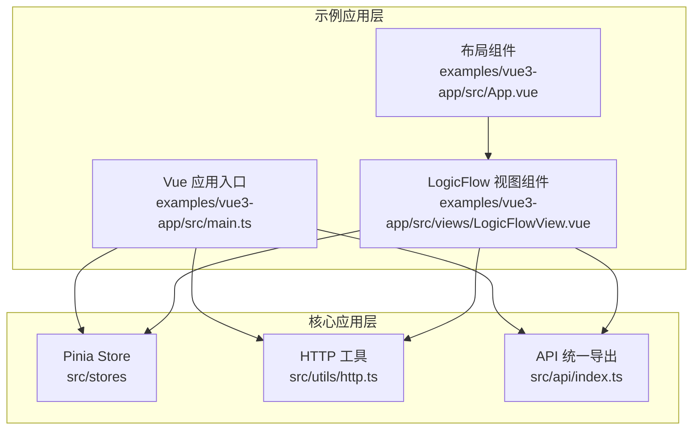
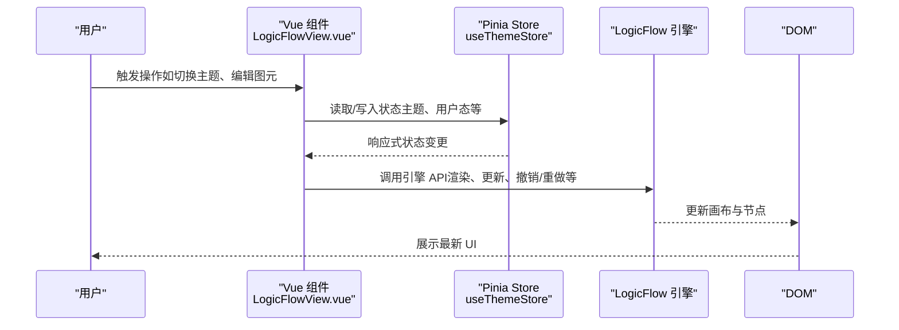
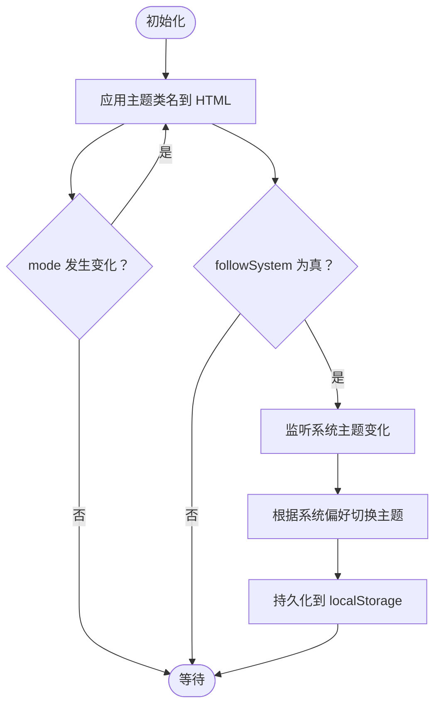
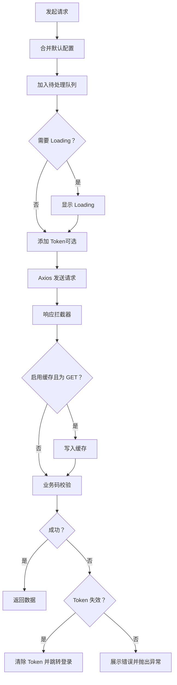
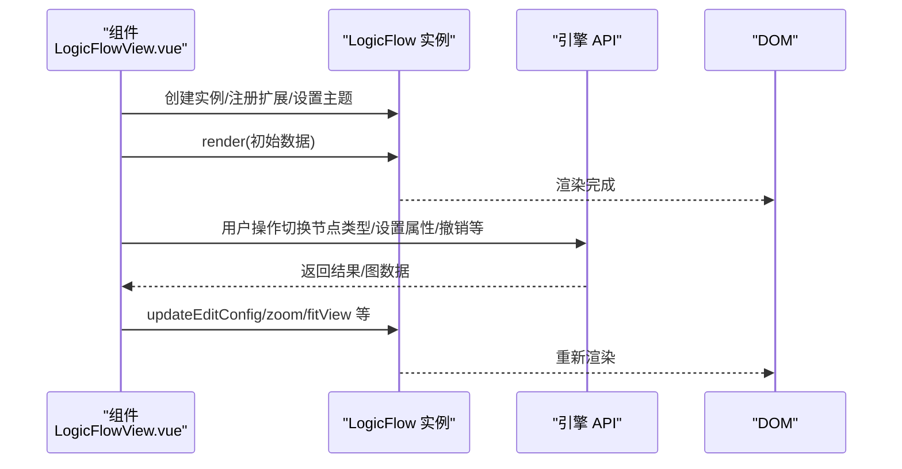
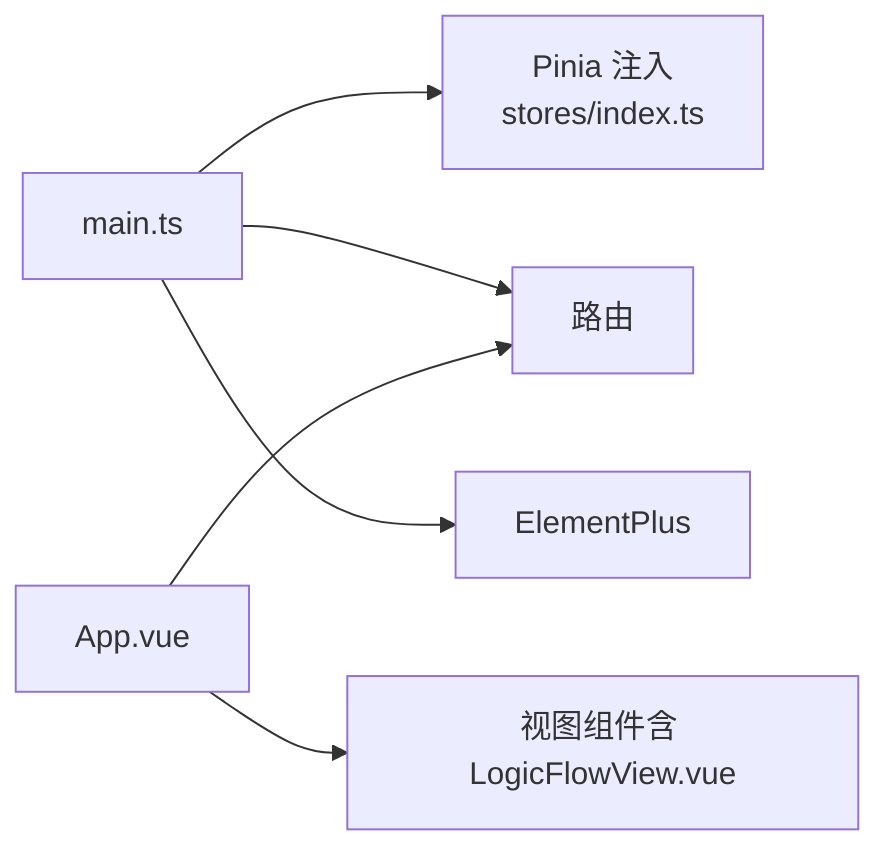
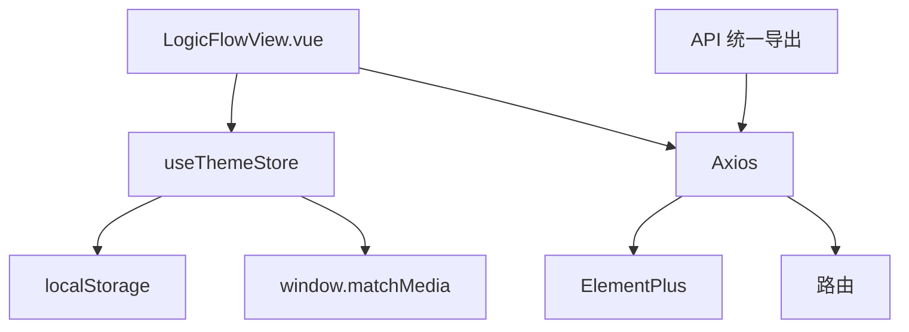

# 数据流与状态管理

<cite>
**本文引用的文件**
- [src/stores/index.ts](file://src/stores/index.ts)
- [src/stores/theme.ts](file://src/stores/theme.ts)
- [src/utils/http.ts](file://src/utils/http.ts)
- [src/api/index.ts](file://src/api/index.ts)
- [examples/vue3-app/src/views/LogicFlowView.vue](file://examples/vue3-app/src/views/LogicFlowView.vue)
- [examples/vue3-app/src/App.vue](file://examples/vue3-app/src/App.vue)
- [examples/vue3-app/src/main.ts](file://examples/vue3-app/src/main.ts)
</cite>

## 目录
1. [引言](#引言)
2. [项目结构](#项目结构)
3. [核心组件](#核心组件)
4. [架构总览](#架构总览)
5. [详细组件分析](#详细组件分析)
6. [依赖关系分析](#依赖关系分析)
7. [性能考量](#性能考量)
8. [故障排查指南](#故障排查指南)
9. [结论](#结论)
10. [附录](#附录)

## 引言
本文件围绕 Rsbuild LogicFlow 项目的“数据流与状态管理”进行系统化说明，重点覆盖以下方面：
- Pinia 状态管理的设计与实现
- 全局状态的组织结构与模块划分
- 数据流向：用户操作 → Vue 组件 → Pinia Store → LogicFlow 引擎 → DOM 渲染
- 状态持久化策略与本地存储机制
- 异步数据处理与 API 调用模式
- 主题状态、用户状态、流程图状态的管理策略
- 状态订阅与响应式更新机制
- 数据流图表与状态迁移图
- 最佳实践与性能优化建议

## 项目结构
本项目采用多示例工程与核心包分离的组织方式。与状态管理直接相关的关键位置包括：
- 核心应用层：src 目录下的 store（Pinia）、utils/http（HTTP 封装）、api（API 统一导出）
- 示例应用层：examples/vue3-app 中的 Vue3 应用，包含 LogicFlow 图编辑视图
- 引擎交互层：LogicFlowView.vue 通过 @logicflow/core 与引擎交互

**图表来源**
- [src/stores/index.ts](file://src/stores/index.ts#L1-L6)
- [src/stores/theme.ts](file://src/stores/theme.ts#L1-L111)
- [src/utils/http.ts](file://src/utils/http.ts#L1-L534)
- [src/api/index.ts](file://src/api/index.ts#L1-L17)
- [examples/vue3-app/src/main.ts](file://examples/vue3-app/src/main.ts#L1-L16)
- [examples/vue3-app/src/views/LogicFlowView.vue](file://examples/vue3-app/src/views/LogicFlowView.vue#L1-L537)
- [examples/vue3-app/src/App.vue](file://examples/vue3-app/src/App.vue#L1-L121)

**章节来源**
- [src/stores/index.ts](file://src/stores/index.ts#L1-L6)
- [src/stores/theme.ts](file://src/stores/theme.ts#L1-L111)
- [src/utils/http.ts](file://src/utils/http.ts#L1-L534)
- [src/api/index.ts](file://src/api/index.ts#L1-L17)
- [examples/vue3-app/src/main.ts](file://examples/vue3-app/src/main.ts#L1-L16)
- [examples/vue3-app/src/views/LogicFlowView.vue](file://examples/vue3-app/src/views/LogicFlowView.vue#L1-L537)
- [examples/vue3-app/src/App.vue](file://examples/vue3-app/src/App.vue#L1-L121)

## 核心组件
- Pinia Store（主题状态）：集中管理主题模式、深浅色切换、系统跟随等状态，并持久化到 localStorage
- HTTP 工具：基于 Axios 的统一请求封装，支持 Loading、错误提示、缓存、重复请求取消、重试等
- API 统一导出：聚合用户、仪表盘等接口，便于上层按需导入
- LogicFlow 视图组件：承载流程图渲染与交互，通过引擎 API 更新图数据并驱动 DOM

**章节来源**
- [src/stores/theme.ts](file://src/stores/theme.ts#L34-L110)
- [src/utils/http.ts](file://src/utils/http.ts#L179-L378)
- [src/api/index.ts](file://src/api/index.ts#L1-L17)
- [examples/vue3-app/src/views/LogicFlowView.vue](file://examples/vue3-app/src/views/LogicFlowView.vue#L1-L537)

## 架构总览
下图展示了从用户操作到 DOM 渲染的完整数据流路径，以及状态在各层之间的流转：

**图表来源**
- [examples/vue3-app/src/views/LogicFlowView.vue](file://examples/vue3-app/src/views/LogicFlowView.vue#L119-L254)
- [src/stores/theme.ts](file://src/stores/theme.ts#L66-L99)

## 详细组件分析

### Pinia 主题状态管理（useThemeStore）
- 设计要点
  - 使用组合式 Store（defineStore + 函数式返回值），以 ref 暴露响应式状态
  - 支持手动切换主题与“跟随系统”两种模式，系统偏好变更时可自动同步
  - 通过 DOM 类名切换实现主题样式生效，并维护 isDark 状态
  - 本地持久化：localStorage 键名固定，初始化时读取，变更时写回
- 状态字段
  - mode：当前主题模式（light/dark）
  - followSystem：是否跟随系统
  - isDark：是否深色主题（派生状态）
- 关键行为
  - setTheme：设置主题并持久化
  - toggleTheme：在 light/dark 间切换
  - setFollowSystem：开启/关闭跟随系统；开启时读取系统偏好并应用
  - initTheme：初始化 DOM 主题类名，并监听系统主题变化
- 响应式与副作用
  - 通过 watch 监听 mode，自动调用 applyTheme 更新 DOM
  - 通过 window.matchMedia 监听 prefers-color-scheme 变化

**图表来源**
- [src/stores/theme.ts](file://src/stores/theme.ts#L82-L99)
- [src/stores/theme.ts](file://src/stores/theme.ts#L66-L99)

**章节来源**
- [src/stores/theme.ts](file://src/stores/theme.ts#L34-L110)

### HTTP 工具与异步数据处理
- 统一封装
  - 基于 Axios 创建实例，内置请求/响应拦截器
  - 支持 Loading 管理、错误提示（带防抖）、缓存（Map + 过期时间）、重复请求取消
  - 支持重试（超时、网络错误、5xx 服务器错误）
- 方法族
  - request/get/post/put/delete/patch/upload/download 等
  - 工具函数：clearCache、cancelAllRequests
- 错误处理
  - 业务错误码分支处理（如 TOKEN_EXPIRED/TOKEN_INVALID）
  - HTTP 状态码映射与统一错误对象构造
  - 取消、超时、网络异常等场景的差异化处理与重试
- 与 API 层协作
  - API 统一导出模块按需引入 http 工具，形成清晰的调用边界

**图表来源**
- [src/utils/http.ts](file://src/utils/http.ts#L190-L361)
- [src/utils/http.ts](file://src/utils/http.ts#L366-L458)

**章节来源**
- [src/utils/http.ts](file://src/utils/http.ts#L1-L534)
- [src/api/index.ts](file://src/api/index.ts#L1-L17)

### LogicFlow 视图组件的数据流
- 初始化与渲染
  - 组件挂载时创建 LogicFlow 实例，注册节点/边扩展、主题、事件监听
  - 通过 render(data) 渲染初始图数据
- 用户交互与引擎更新
  - 通过按钮与拖拽面板触发引擎 API（如 setNodeType、setProperties、undo/redo、zoom、fitView 等）
  - 通过 getGraphData()/getGraphRawData() 获取/刷新数据，驱动视图更新
- 与状态管理的衔接
  - 主题状态可通过 useThemeStore 控制 DOM 类名，间接影响引擎主题渲染
  - 未来可扩展：将流程图状态（如当前选中元素、编辑配置、历史栈）纳入 Pinia，实现跨组件共享与持久化

**图表来源**
- [examples/vue3-app/src/views/LogicFlowView.vue](file://examples/vue3-app/src/views/LogicFlowView.vue#L119-L254)
- [examples/vue3-app/src/views/LogicFlowView.vue](file://examples/vue3-app/src/views/LogicFlowView.vue#L286-L355)

**章节来源**
- [examples/vue3-app/src/views/LogicFlowView.vue](file://examples/vue3-app/src/views/LogicFlowView.vue#L1-L537)

### 应用入口与路由集成
- 应用入口
  - main.ts 中创建 Vue 应用，安装 ElementPlus、路由与挂载
- 布局与导航
  - App.vue 提供菜单导航，指向不同视图（含 LogicFlow 视图）
- 与状态管理的集成
  - 在入口处注入 Pinia（通过 stores/index.ts 导出的 pinia 实例），使组件可使用 Store

**图表来源**
- [examples/vue3-app/src/main.ts](file://examples/vue3-app/src/main.ts#L1-L16)
- [examples/vue3-app/src/App.vue](file://examples/vue3-app/src/App.vue#L10-L44)
- [src/stores/index.ts](file://src/stores/index.ts#L1-L6)

**章节来源**
- [examples/vue3-app/src/main.ts](file://examples/vue3-app/src/main.ts#L1-L16)
- [examples/vue3-app/src/App.vue](file://examples/vue3-app/src/App.vue#L1-L121)
- [src/stores/index.ts](file://src/stores/index.ts#L1-L6)

## 依赖关系分析
- 组件对 Store 的依赖
  - LogicFlowView.vue 通过组合式 API 访问 useThemeStore 的状态与方法
- Store 对外部的依赖
  - useThemeStore 依赖 localStorage 与 window.matchMedia，用于持久化与系统主题监听
- HTTP 工具的依赖
  - Axios、ElementPlus（消息与 Loading）、路由（鉴权失败时跳转）
- API 导出层
  - 统一导出用户、仪表盘等接口，便于上层按需引入

**图表来源**
- [examples/vue3-app/src/views/LogicFlowView.vue](file://examples/vue3-app/src/views/LogicFlowView.vue#L1-L537)
- [src/stores/theme.ts](file://src/stores/theme.ts#L17-L32)
- [src/utils/http.ts](file://src/utils/http.ts#L1-L534)
- [src/api/index.ts](file://src/api/index.ts#L1-L17)

**章节来源**
- [examples/vue3-app/src/views/LogicFlowView.vue](file://examples/vue3-app/src/views/LogicFlowView.vue#L1-L537)
- [src/stores/theme.ts](file://src/stores/theme.ts#L1-L111)
- [src/utils/http.ts](file://src/utils/http.ts#L1-L534)
- [src/api/index.ts](file://src/api/index.ts#L1-L17)

## 性能考量
- 状态更新粒度
  - 将主题状态与流程图状态拆分管理，避免无关状态导致的不必要重渲染
- 引擎渲染优化
  - 批量更新：对多次图元属性修改，尽量合并为一次 setProperties 或一次 render
  - 合理使用 undo/redo 历史栈，避免频繁大图数据变更
- HTTP 请求优化
  - 启用缓存（GET 请求）与去重（重复请求取消），减少网络开销
  - Loading 防抖与统一管理，避免重复弹窗
  - 超时与重试策略：对临时性网络问题进行自动恢复
- DOM 与主题切换
  - 通过类名切换控制主题，避免全量样式重算
  - 系统主题监听仅在开启“跟随系统”时启用，降低监听成本

## 故障排查指南
- 主题不生效或切换异常
  - 检查 HTML 根节点类名是否正确切换（dark/light）
  - 确认 followSystem 状态与系统主题监听是否正常
  - 核对 localStorage 中的主题键值是否被意外清空或覆盖
- 流程图渲染异常
  - 确认 LogicFlow 实例已正确创建并注册扩展
  - 检查 getGraphData()/render() 调用时机与参数
- HTTP 请求失败
  - 查看业务码与 HTTP 状态码分支，确认是否触发了鉴权失效跳转
  - 检查 Loading、错误提示是否被正确显示与隐藏
  - 使用 clearCache/cancelAllRequests 进行清理与重试
- 重复请求与竞态
  - 若出现重复请求，检查 cancelDuplicate 与 pendingRequests 的处理逻辑

**章节来源**
- [src/stores/theme.ts](file://src/stores/theme.ts#L44-L99)
- [examples/vue3-app/src/views/LogicFlowView.vue](file://examples/vue3-app/src/views/LogicFlowView.vue#L119-L254)
- [src/utils/http.ts](file://src/utils/http.ts#L190-L361)

## 结论
本项目在状态管理层面采用 Pinia 的组合式 Store，实现了主题状态的本地持久化与系统跟随；在数据流层面，用户操作经由 Vue 组件、Pinia Store、LogicFlow 引擎最终驱动 DOM 渲染。HTTP 工具提供了完善的异步处理能力，涵盖缓存、去重、重试与错误处理。建议后续将流程图状态（如当前选中元素、编辑配置、历史栈）纳入 Pinia，以提升跨组件一致性与可维护性。

## 附录
- 状态管理最佳实践
  - 将 UI 状态与业务状态解耦，优先使用组合式 Store
  - 对高频更新的状态进行细粒度拆分，避免不必要的响应式开销
  - 对外部依赖（如 localStorage、window.matchMedia）进行条件判断与降级处理
- 性能优化建议
  - 对引擎 API 调用进行节流/防抖，批量提交状态变更
  - 合理使用缓存与去重，减少重复请求
  - 在大型流程图场景下，谨慎使用全量 render，优先局部更新