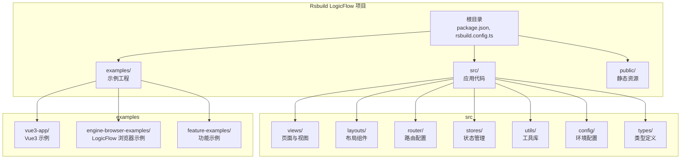
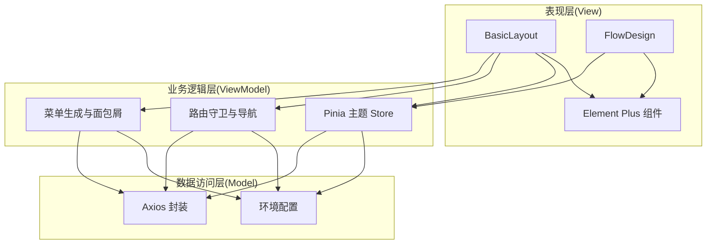
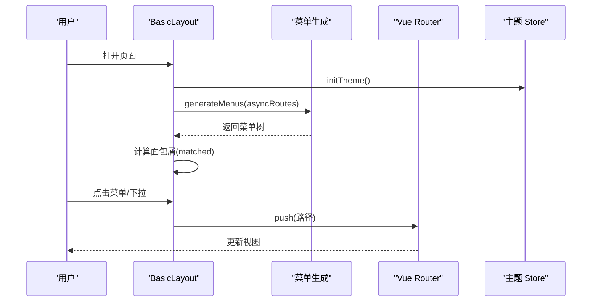
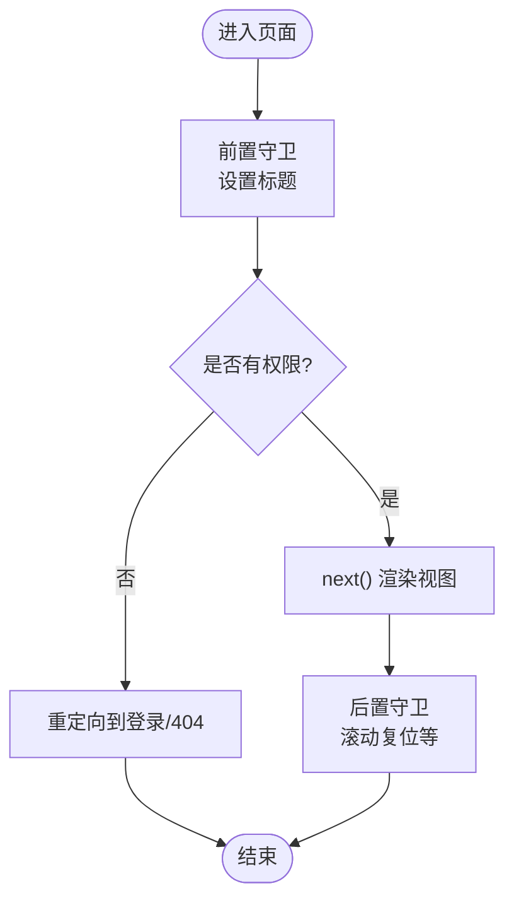
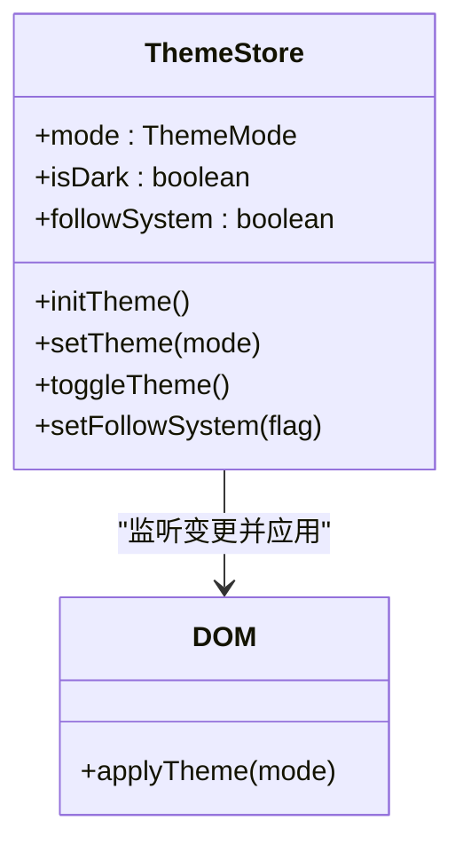
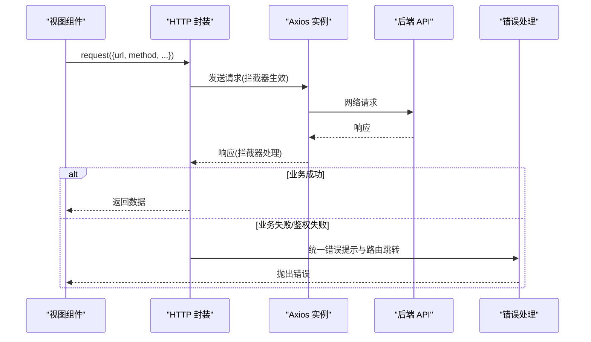
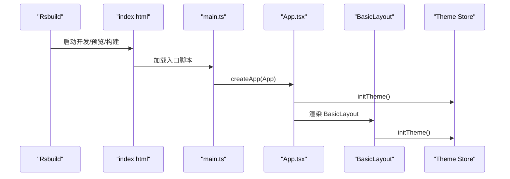
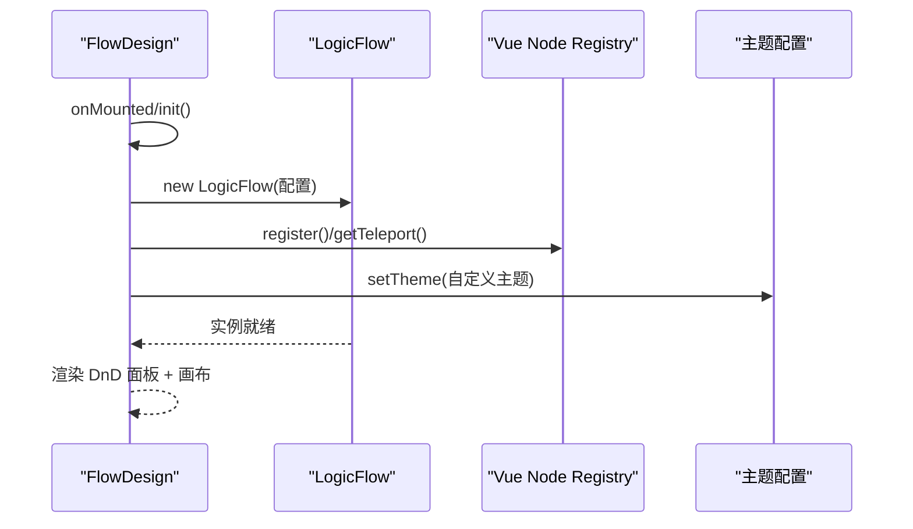
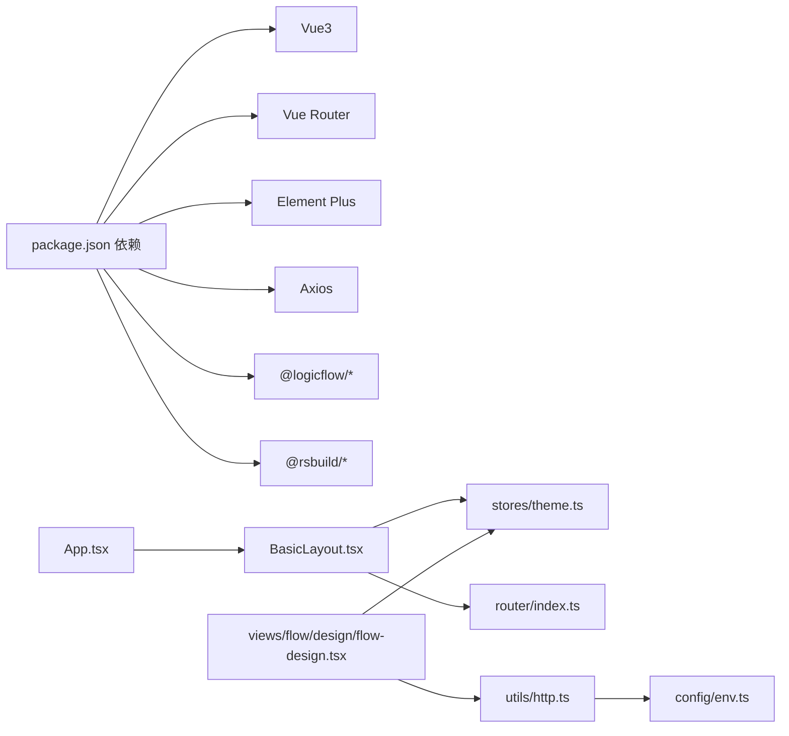

# 整体架构设计

<cite>
**本文引用的文件**
- [package.json](file://package.json)
- [rsbuild.config.ts](file://rsbuild.config.ts)
- [src/App.tsx](file://src/App.tsx)
- [src/layouts/BasicLayout.tsx](file://src/layouts/BasicLayout.tsx)
- [src/router/index.ts](file://src/router/index.ts)
- [src/router/routes.ts](file://src/router/routes.ts)
- [src/stores/index.ts](file://src/stores/index.ts)
- [src/stores/theme.ts](file://src/stores/theme.ts)
- [src/utils/http.ts](file://src/utils/http.ts)
- [src/views/flow/design/flow-design.tsx](file://src/views/flow/design/flow-design.tsx)
- [src/config/env.ts](file://src/config/env.ts)
- [examples/vue3-app/src/main.ts](file://examples/vue3-app/src/main.ts)
</cite>

## 目录
1. [引言](#引言)
2. [项目结构](#项目结构)
3. [核心组件](#核心组件)
4. [架构总览](#架构总览)
5. [详细组件分析](#详细组件分析)
6. [依赖分析](#依赖分析)
7. [性能考虑](#性能考虑)
8. [故障排查指南](#故障排查指南)
9. [结论](#结论)
10. [附录](#附录)

## 引言
本文件面向 Rsbuild LogicFlow 项目，提供整体架构设计说明。重点阐述分层架构（表现层、业务逻辑层、数据访问层）与 MVVM 在 Vue3 中的实现方式（Composition API、Pinia 状态管理、Vue Router 路由体系），并结合 Rsbuild 构建工具链对架构的影响，给出系统边界、外部依赖、组件交互流程与可扩展性设计原则。

## 项目结构
项目采用多示例工程组织：根目录包含主应用与多个示例工程，其中 examples/vue3-app 展示了标准 Vue3 + Rsbuild 的最小化启动流程；主应用位于 src 目录，包含布局、路由、状态、工具与视图模块。

**图表来源**
- [package.json](file://package.json#L1-L45)
- [rsbuild.config.ts](file://rsbuild.config.ts#L1-L30)

**章节来源**
- [package.json](file://package.json#L1-L45)
- [rsbuild.config.ts](file://rsbuild.config.ts#L1-L30)

## 核心组件
- 表现层（UI 层）
  - 布局组件：BasicLayout 提供侧边栏、面包屑、头部工具栏与内容区占位。
  - 视图组件：如 FlowDesign，承载具体业务视图并与 LogicFlow 图编辑引擎集成。
  - UI 组件库：Element Plus。
- 业务逻辑层（MVVM 中的 ViewModel/逻辑封装）
  - Composition API：在视图组件中通过 setup/响应式 API 组织交互逻辑。
  - Pinia Store：集中管理主题等全局状态。
  - 路由守卫：统一设置页面标题、控制导航。
- 数据访问层（HTTP 与环境配置）
  - Axios 封装：统一请求/响应拦截、错误处理、缓存与重试。
  - 环境配置：按 Rsbuild MODE 自动选择 baseURL、超时、Mock 开关等。

**章节来源**
- [src/layouts/BasicLayout.tsx](file://src/layouts/BasicLayout.tsx#L1-L146)
- [src/views/flow/design/flow-design.tsx](file://src/views/flow/design/flow-design.tsx#L1-L129)
- [src/stores/theme.ts](file://src/stores/theme.ts#L1-L111)
- [src/router/index.ts](file://src/router/index.ts#L1-L46)
- [src/utils/http.ts](file://src/utils/http.ts#L1-L534)
- [src/config/env.ts](file://src/config/env.ts#L1-L120)

## 架构总览
系统采用“表现层-业务逻辑层-数据访问层”的分层设计，并以 MVVM 模式在 Vue3 中落地：
- Model：Pinia Store（主题等状态）、Axios 实例与环境配置。
- View：BasicLayout、各页面视图（FlowDesign 等）。
- ViewModel：在组件 setup 中组合逻辑，配合路由守卫与工具函数。

**图表来源**
- [src/layouts/BasicLayout.tsx](file://src/layouts/BasicLayout.tsx#L1-L146)
- [src/views/flow/design/flow-design.tsx](file://src/views/flow/design/flow-design.tsx#L1-L129)
- [src/stores/theme.ts](file://src/stores/theme.ts#L1-L111)
- [src/router/index.ts](file://src/router/index.ts#L1-L46)
- [src/utils/http.ts](file://src/utils/http.ts#L1-L534)
- [src/config/env.ts](file://src/config/env.ts#L1-L120)

## 详细组件分析

### 布局与导航（BasicLayout）
- 职责
  - 管理侧边栏折叠、面包屑、用户下拉菜单。
  - 通过 generateMenus 将动态路由转换为菜单树。
  - 与主题 Store 协作，初始化并应用主题。
- 关键交互
  - 侧边栏折叠切换影响主内容区 margin-left。
  - 面包屑根据 matched 路由元信息生成。
  - 下拉菜单跳转至 profile/settings/logout。

**图表来源**
- [src/layouts/BasicLayout.tsx](file://src/layouts/BasicLayout.tsx#L1-L146)
- [src/router/routes.ts](file://src/router/routes.ts#L1-L215)
- [src/stores/theme.ts](file://src/stores/theme.ts#L1-L111)

**章节来源**
- [src/layouts/BasicLayout.tsx](file://src/layouts/BasicLayout.tsx#L1-L146)

### 路由系统与页面导航
- 设计
  - 常量路由（登录、404）与动态路由（带权限与元信息）分离。
  - 路由守卫统一设置页面标题，支持重置路由。
- 导航策略
  - 基于 createWebHistory 的前端路由。
  - 支持面包屑与多级菜单渲染。
  - 404 降级路由置于末尾。

**图表来源**
- [src/router/index.ts](file://src/router/index.ts#L1-L46)
- [src/router/routes.ts](file://src/router/routes.ts#L1-L215)

**章节来源**
- [src/router/index.ts](file://src/router/index.ts#L1-L46)
- [src/router/routes.ts](file://src/router/routes.ts#L1-L215)

### 状态管理（Pinia 主题 Store）
- 设计要点
  - 使用 ref 定义状态，watch 监听变更并应用到 DOM。
  - 支持跟随系统主题、手动切换、持久化存储。
  - 提供 initTheme、setTheme、toggleTheme 等方法。
- 与布局协作
  - App 与 BasicLayout 在挂载时调用 initTheme，确保主题一致。

**图表来源**
- [src/stores/theme.ts](file://src/stores/theme.ts#L1-L111)

**章节来源**
- [src/stores/theme.ts](file://src/stores/theme.ts#L1-L111)
- [src/App.tsx](file://src/App.tsx#L1-L20)
- [src/layouts/BasicLayout.tsx](file://src/layouts/BasicLayout.tsx#L1-L146)

### HTTP 与环境配置
- HTTP 封装
  - 请求拦截：合并默认配置、去重、Loading、注入 Token。
  - 响应拦截：缓存 GET、业务码校验、错误分类与提示、重试与取消。
  - 提供 get/post/put/delete/patch/upload/download 等方法。
- 环境配置
  - 基于 Rsbuild import.meta.env.MODE 自动选择 baseURL、超时、Mock。
  - 统一业务码与 HTTP 状态码映射。

**图表来源**
- [src/utils/http.ts](file://src/utils/http.ts#L1-L534)
- [src/config/env.ts](file://src/config/env.ts#L1-L120)

**章节来源**
- [src/utils/http.ts](file://src/utils/http.ts#L1-L534)
- [src/config/env.ts](file://src/config/env.ts#L1-L120)

### 应用启动流程与初始化
- Rsbuild 启动
  - dev/preview/build 由 Rsbuild 提供，插件启用 Vue、JSX、Less、Babel。
  - 别名 @ 指向 src，便于模块导入。
- 应用入口
  - 示例工程：createApp -> use(ElementPlus, router) -> mount。
  - 主应用：App 组件在 setup 中初始化主题，再渲染 BasicLayout。

**图表来源**
- [rsbuild.config.ts](file://rsbuild.config.ts#L1-L30)
- [examples/vue3-app/src/main.ts](file://examples/vue3-app/src/main.ts#L1-L16)
- [src/App.tsx](file://src/App.tsx#L1-L20)
- [src/layouts/BasicLayout.tsx](file://src/layouts/BasicLayout.tsx#L1-L146)
- [src/stores/theme.ts](file://src/stores/theme.ts#L1-L111)

**章节来源**
- [rsbuild.config.ts](file://rsbuild.config.ts#L1-L30)
- [examples/vue3-app/src/main.ts](file://examples/vue3-app/src/main.ts#L1-L16)
- [src/App.tsx](file://src/App.tsx#L1-L20)

### 业务视图与 LogicFlow 集成（FlowDesign）
- 设计
  - 在 setup 中初始化 LogicFlow，注册主题与节点，挂载到容器。
  - 通过 @logicflow/vue-node-registry 提供 Vue 节点渲染能力。
- 交互
  - 支持拖拽、连线、键盘快捷键、背景网格等。

**图表来源**
- [src/views/flow/design/flow-design.tsx](file://src/views/flow/design/flow-design.tsx#L1-L129)

**章节来源**
- [src/views/flow/design/flow-design.tsx](file://src/views/flow/design/flow-design.tsx#L1-L129)

## 依赖分析
- 内部依赖
  - App -> BasicLayout -> 菜单/面包屑/主题 Store。
  - 视图组件 -> HTTP 封装 -> 环境配置。
  - 路由 -> 路由守卫 -> 环境配置。
- 外部依赖
  - Vue3、Vue Router、Element Plus、Axios、@logicflow/* 生态。
  - Rsbuild 核心与插件（Vue、JSX、Less、Babel）。

**图表来源**
- [package.json](file://package.json#L1-L45)
- [src/App.tsx](file://src/App.tsx#L1-L20)
- [src/layouts/BasicLayout.tsx](file://src/layouts/BasicLayout.tsx#L1-L146)
- [src/stores/theme.ts](file://src/stores/theme.ts#L1-L111)
- [src/router/index.ts](file://src/router/index.ts#L1-L46)
- [src/views/flow/design/flow-design.tsx](file://src/views/flow/design/flow-design.tsx#L1-L129)
- [src/utils/http.ts](file://src/utils/http.ts#L1-L534)
- [src/config/env.ts](file://src/config/env.ts#L1-L120)

**章节来源**
- [package.json](file://package.json#L1-L45)

## 性能考虑
- 构建优化
  - Rsbuild 插件链启用 Vue/JSX/Less/Babel，提升编译效率与兼容性。
  - alias @ 指向 src，减少路径解析成本。
- 运行时优化
  - HTTP 层支持请求去重、Loading 防抖、缓存与重试，降低无效请求与 UI 卡顿。
  - 主题切换通过 DOM 类名切换，避免全量重绘。
- 可扩展建议
  - 对大视图组件（如 FlowDesign）可引入虚拟滚动与懒加载。
  - 对高频接口增加本地缓存策略与失效时间控制。

[本节为通用指导，无需列出章节来源]

## 故障排查指南
- 登录态失效
  - HTTP 响应拦截检测业务码，触发移除 Token 并跳转登录。
- 网络异常与超时
  - 区分超时与网络断开，支持可配置重试。
- 权限不足
  - 403 场景统一提示并记录错误类型。
- 请求去重
  - 通过 AbortController 取消重复请求，避免竞态。

**章节来源**
- [src/utils/http.ts](file://src/utils/http.ts#L1-L534)

## 结论
本项目以 Rsbuild 为构建基石，采用 Vue3 Composition API 与 Pinia 实现 MVVM 分层架构。通过统一的路由守卫、HTTP 封装与环境配置，形成清晰的系统边界与可扩展的模块化结构。FlowDesign 作为业务视图与 LogicFlow 的集成点，展示了表现层与引擎层的协作模式。未来可在视图懒加载、缓存策略与构建产物优化方面持续演进。

## 附录
- 构建工具对架构的影响
  - Rsbuild 插件链保证了 Vue/JSX/Less 的开箱即用，简化了构建配置，使架构更聚焦于业务与数据层。
- 系统边界
  - 内部：App、Layout、Router、Store、Utils、Views。
  - 外部：Element Plus、LogicFlow 生态、Axios、浏览器环境变量。

**章节来源**
- [rsbuild.config.ts](file://rsbuild.config.ts#L1-L30)
- [package.json](file://package.json#L1-L45)