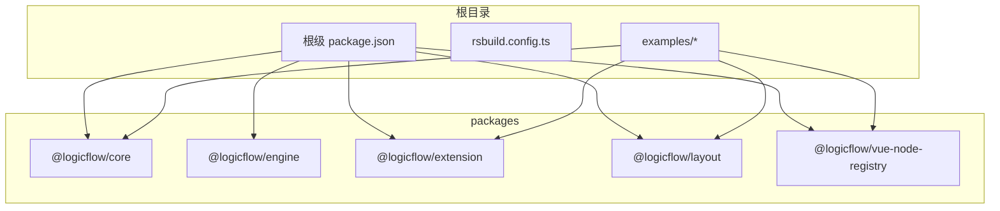
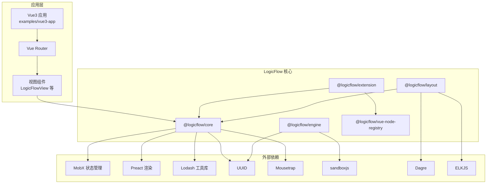
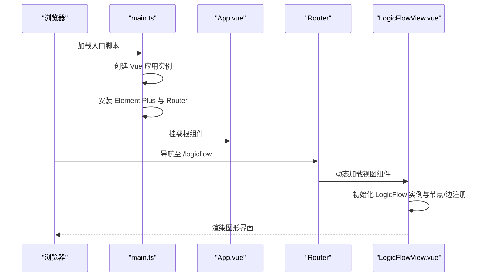
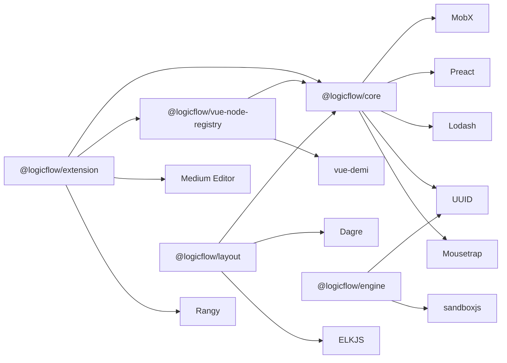
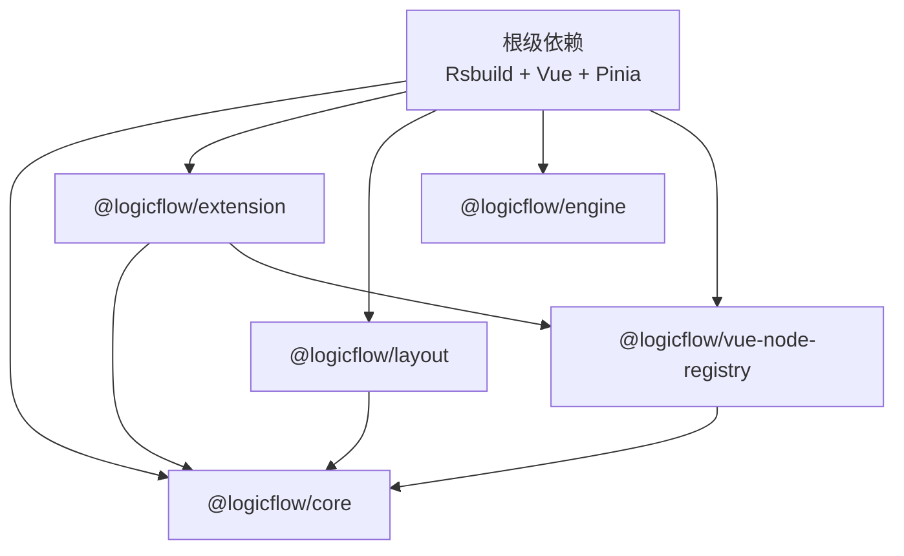

# 核心架构

<cite>
**本文引用的文件**
- [package.json](file://package.json)
- [rsbuild.config.ts](file://rsbuild.config.ts)
- [README.md](file://README.md)
- [packages/core/package.json](file://packages/core/package.json)
- [packages/engine/package.json](file://packages/engine/package.json)
- [packages/extension/package.json](file://packages/extension/package.json)
- [packages/layout/package.json](file://packages/layout/package.json)
- [packages/vue-node-registry/package.json](file://packages/vue-node-registry/package.json)
- [examples/vue3-app/src/main.ts](file://examples/vue3-app/src/main.ts)
- [examples/vue3-app/src/App.vue](file://examples/vue3-app/src/App.vue)
- [examples/vue3-app/src/router/index.ts](file://examples/vue3-app/src/router/index.ts)
</cite>

## 目录
1. [引言](#引言)
2. [项目结构](#项目结构)
3. [核心组件](#核心组件)
4. [架构总览](#架构总览)
5. [详细组件分析](#详细组件分析)
6. [依赖分析](#依赖分析)
7. [性能考虑](#性能考虑)
8. [故障排查指南](#故障排查指南)
9. [结论](#结论)
10. [附录](#附录)

## 引言
本文件面向架构师与高级开发者，系统阐述 Rsbuild LogicFlow 项目的整体架构设计与实现要点。项目采用 Monorepo 组织方式，围绕 LogicFlow 引擎构建核心能力，并通过扩展包与布局包增强图形编辑与渲染体验；同时提供 Vue3 集成示例，展示如何在现代前端工程中接入 LogicFlow 的核心能力。文档从分层架构、组件化与模块化策略出发，解析核心包之间的职责划分与依赖关系，给出系统边界与组件交互图，并讨论可扩展性与插件化设计的技术考量与权衡。

## 项目结构
项目采用 Monorepo 策略，根目录包含统一的构建配置与示例应用，核心逻辑位于 packages 子目录，示例应用位于 examples 子目录。构建工具使用 Rsbuild，结合 Vue、JSX、Babel 与 Less 插件，形成现代化的前端工程体系。

- 根级构建与脚本
  - 使用 Rsbuild 作为构建内核，启用 Vue、JSX、Babel、Less 插件，配置路径别名与开发服务器参数。
  - 提供 dev/build/preview/lint/format/check 等常用脚本，便于本地开发与质量控制。

- 包组织策略
  - packages 下按功能域拆分：core、engine、extension、layout、vue-node-registry 等，每个包独立维护版本与依赖。
  - 示例应用 examples 下提供多框架示例（如 Vue3、Next.js、Material-UI），用于演示不同场景下的集成方式。

- Monorepo 优势
  - 单仓库多包管理，降低重复依赖与跨包同步成本。
  - 统一构建与发布流程，提升协作效率。
  - 可针对特定包进行增量构建与测试，缩短反馈周期。

图表来源
- [package.json](file://package.json#L1-L45)
- [rsbuild.config.ts](file://rsbuild.config.ts#L1-L30)
- [packages/core/package.json](file://packages/core/package.json#L1-L57)
- [packages/engine/package.json](file://packages/engine/package.json#L1-L50)
- [packages/extension/package.json](file://packages/extension/package.json#L1-L61)
- [packages/layout/package.json](file://packages/layout/package.json#L1-L50)
- [packages/vue-node-registry/package.json](file://packages/vue-node-registry/package.json#L1-L56)

章节来源
- [README.md](file://README.md#L1-L37)
- [package.json](file://package.json#L1-L45)
- [rsbuild.config.ts](file://rsbuild.config.ts#L1-L30)

## 核心组件
本节聚焦于核心包及其职责边界，说明各包在整体架构中的定位与协作方式。

- @logicflow/core
  - 职责：提供 LogicFlow 的核心引擎能力，包括节点/边模型、交互事件、选择与变换、撤销重做等基础能力。
  - 依赖：MobX 状态管理、Preact 渲染、Lodash 工具库、UUID、Mousetrap 键盘快捷键等。
  - 输出：ESM/CJS/UMD 多格式产物，支持浏览器与 Node 环境。

- @logicflow/engine
  - 职责：为 JavaScript 流程执行提供运行时与沙箱能力，支持规则与脚本执行。
  - 依赖：UUID、sandboxjs 沙箱执行器。
  - 输出：ESM/CJS/UMD 多格式产物，提供浏览器端平台替换。

- @logicflow/extension
  - 职责：在 core 基础上提供丰富的扩展能力，如 BPMN 导入导出、高亮、缩略图、菜单、连线规则等。
  - 依赖：AntV 层次布局、Medium Editor、Rangy、Vanilla Picker 等第三方库。
  - 依赖约束：与 core、vue-node-registry 以 peerDependencies 形式声明，确保版本一致性。

- @logicflow/layout
  - 职责：提供多种自动布局算法（如 Dagre、ELK），辅助复杂图的可视化排版。
  - 依赖：Dagre、ELKJS，以及对 core 的 peer 依赖。

- @logicflow/vue-node-registry
  - 职责：为 LogicFlow 提供 Vue 组件节点注册与渲染能力，打通 Vue 生态。
  - 依赖：vue-demi、Lodash，对 Vue 版本与 composition-api 的 peer 依赖。

章节来源
- [packages/core/package.json](file://packages/core/package.json#L1-L57)
- [packages/engine/package.json](file://packages/engine/package.json#L1-L50)
- [packages/extension/package.json](file://packages/extension/package.json#L1-L61)
- [packages/layout/package.json](file://packages/layout/package.json#L1-L50)
- [packages/vue-node-registry/package.json](file://packages/vue-node-registry/package.json#L1-L56)

## 架构总览
下图展示了 Rsbuild 项目与 LogicFlow 各包之间的系统边界与交互关系。Vue3 应用通过路由与视图组件接入 LogicFlow 能力，核心引擎负责数据与状态管理，扩展包提供业务增强，布局包负责图形排版，Vue 节点注册器桥接 Vue 组件到 LogicFlow 节点系统。

图表来源
- [examples/vue3-app/src/router/index.ts](file://examples/vue3-app/src/router/index.ts#L1-L41)
- [examples/vue3-app/src/App.vue](file://examples/vue3-app/src/App.vue#L1-L121)
- [packages/core/package.json](file://packages/core/package.json#L42-L51)
- [packages/extension/package.json](file://packages/extension/package.json#L42-L53)
- [packages/layout/package.json](file://packages/layout/package.json#L41-L45)
- [packages/engine/package.json](file://packages/engine/package.json#L42-L45)
- [packages/vue-node-registry/package.json](file://packages/vue-node-registry/package.json#L32-L49)

## 详细组件分析

### Vue3 应用集成架构
Vue3 应用通过路由驱动视图切换，其中 LogicFlow 视图负责加载 LogicFlow 图编辑器。应用初始化时挂载 Element Plus 与路由插件，随后挂载根组件并进入页面生命周期。

图表来源
- [examples/vue3-app/src/main.ts](file://examples/vue3-app/src/main.ts#L1-L16)
- [examples/vue3-app/src/App.vue](file://examples/vue3-app/src/App.vue#L1-L121)
- [examples/vue3-app/src/router/index.ts](file://examples/vue3-app/src/router/index.ts#L1-L41)

章节来源
- [examples/vue3-app/src/main.ts](file://examples/vue3-app/src/main.ts#L1-L16)
- [examples/vue3-app/src/App.vue](file://examples/vue3-app/src/App.vue#L1-L121)
- [examples/vue3-app/src/router/index.ts](file://examples/vue3-app/src/router/index.ts#L1-L41)

### 数据流与状态管理（Pinia）
- 状态管理选型：项目依赖 Pinia，适合在 Vue3 场景下进行集中式状态管理。
- 数据流建议：
  - 应用层：通过路由与视图组件承载用户交互与页面状态。
  - 业务层：通过 Pinia 管理全局共享状态（如当前打开的画布、选中元素、主题设置等）。
  - 引擎层：LogicFlow 内部使用 MobX 进行状态管理，应用侧通过 Pinia 与之解耦，仅在需要时同步关键状态。
- 最佳实践：
  - 将 LogicFlow 的变更事件映射到 Pinia 动作，避免直接在组件中操作引擎内部状态。
  - 对于复杂状态（如历史记录、多画布切换），优先在应用层通过 Pinia 维护，减少引擎负担。

章节来源
- [package.json](file://package.json#L24-L24)

### 核心包职责与依赖关系
- @logicflow/core：提供基础引擎能力，是所有扩展与布局的基础。
- @logicflow/extension：在 core 上扩展业务能力，依赖 core 与 vue-node-registry。
- @logicflow/layout：提供自动布局算法，依赖 core 与第三方布局库。
- @logicflow/engine：提供流程执行能力，依赖 UUID 与 sandboxjs。
- @logicflow/vue-node-registry：提供 Vue 节点注册能力，依赖 vue-demi 与 core。

图表来源
- [packages/core/package.json](file://packages/core/package.json#L42-L51)
- [packages/extension/package.json](file://packages/extension/package.json#L42-L53)
- [packages/layout/package.json](file://packages/layout/package.json#L41-L45)
- [packages/engine/package.json](file://packages/engine/package.json#L42-L45)
- [packages/vue-node-registry/package.json](file://packages/vue-node-registry/package.json#L32-L49)

章节来源
- [packages/core/package.json](file://packages/core/package.json#L1-L57)
- [packages/extension/package.json](file://packages/extension/package.json#L1-L61)
- [packages/layout/package.json](file://packages/layout/package.json#L1-L50)
- [packages/engine/package.json](file://packages/engine/package.json#L1-L50)
- [packages/vue-node-registry/package.json](file://packages/vue-node-registry/package.json#L1-L56)

### 可扩展性与插件化设计
- 插件化边界
  - 节点/边注册：通过 vue-node-registry 将 Vue 组件注册为 LogicFlow 节点，实现 UI 与业务逻辑解耦。
  - 扩展能力：extension 提供菜单、高亮、缩略图、连线规则等扩展，遵循 core 的扩展接口。
  - 布局算法：layout 提供 DAG/ELK 等算法，可在导入或批量调整时调用。
- 技术权衡
  - 依赖体积与按需加载：通过 peerDependencies 与按需引入，避免重复打包与冗余依赖。
  - 平台适配：engine 提供浏览器平台替换，保证在不同运行环境的一致行为。
  - 渲染与状态：core 使用 MobX，extension 与 layout 在各自领域复用核心状态，避免状态分散。

章节来源
- [packages/extension/package.json](file://packages/extension/package.json#L38-L41)
- [packages/vue-node-registry/package.json](file://packages/vue-node-registry/package.json#L36-L45)
- [packages/engine/package.json](file://packages/engine/package.json#L8-L10)

## 依赖分析
- 根级依赖与构建
  - 根级 package.json 声明了 Rsbuild 插件与 Vue/Pinia/Vue Router 等运行时依赖，确保示例应用与构建链路一致。
  - rsbuild.config.ts 配置了 alias、插件与开发服务器参数，统一前端工程体验。
- 包间依赖
  - extension 与 layout 显式声明对 core 的 peerDependencies，确保版本一致性。
  - vue-node-registry 对 core 与 Vue 的 peerDependencies，保证在不同 Vue 版本下的兼容性。
  - engine 通过 browser 字段在构建时替换平台实现，适配浏览器环境。

图表来源
- [package.json](file://package.json#L14-L27)
- [rsbuild.config.ts](file://rsbuild.config.ts#L24-L28)
- [packages/extension/package.json](file://packages/extension/package.json#L38-L41)
- [packages/layout/package.json](file://packages/layout/package.json#L41-L42)
- [packages/vue-node-registry/package.json](file://packages/vue-node-registry/package.json#L36-L45)

章节来源
- [package.json](file://package.json#L1-L45)
- [rsbuild.config.ts](file://rsbuild.config.ts#L1-L30)
- [packages/extension/package.json](file://packages/extension/package.json#L1-L61)
- [packages/layout/package.json](file://packages/layout/package.json#L1-L50)
- [packages/vue-node-registry/package.json](file://packages/vue-node-registry/package.json#L1-L56)

## 性能考虑
- 按需加载与懒路由
  - 使用 Vue Router 的动态导入，延迟加载 LogicFlow 视图组件，减少首屏资源压力。
- 依赖精简与去重
  - 通过 peerDependencies 与 monorepo 结构，避免重复打包核心依赖。
- 渲染与状态
  - 将复杂状态交由应用层 Pinia 管理，引擎层专注数据与交互，降低不必要的重渲染。
- 布局与大图优化
  - 对于大规模图，优先使用 layout 的自动布局算法，并结合分页/虚拟化策略优化渲染性能。

章节来源
- [examples/vue3-app/src/router/index.ts](file://examples/vue3-app/src/router/index.ts#L12-L36)

## 故障排查指南
- 构建与启动
  - 若开发服务器无法打开或端口冲突，检查 rsbuild.config.ts 中的 server.open 与端口占用情况。
  - 若样式或图标异常，确认 Element Plus 与 LogicFlow 样式的引入顺序。
- 依赖问题
  - 若出现 extension 或 layout 的类型错误，检查 peerDependencies 是否满足 core 与 vue-node-registry 的版本要求。
  - 若浏览器环境报错，确认 engine 的 browser 字段是否正确替换平台实现。
- Vue 集成
  - 若 Vue 节点未渲染，检查 vue-node-registry 的安装与注册流程，确保在 LogicFlow 初始化前完成节点注册。

章节来源
- [rsbuild.config.ts](file://rsbuild.config.ts#L19-L28)
- [packages/extension/package.json](file://packages/extension/package.json#L38-L41)
- [packages/engine/package.json](file://packages/engine/package.json#L8-L10)
- [packages/vue-node-registry/package.json](file://packages/vue-node-registry/package.json#L36-L45)

## 结论
Rsbuild LogicFlow 项目通过清晰的 Monorepo 分层与模块化组织，实现了核心引擎、扩展能力、布局算法与 Vue 集成的解耦与协同。Vue3 应用通过路由与视图组件接入 LogicFlow，配合 Pinia 进行状态管理，既保证了开发体验，也兼顾了性能与可扩展性。未来可在以下方向持续演进：进一步细化插件边界、完善自动化测试与发布流程、探索更多布局与渲染方案的组合。

## 附录
- 快速开始
  - 安装依赖后，使用 pnpm run dev 启动开发服务器，默认访问地址见根级 README。
- 关键配置参考
  - Rsbuild 插件与别名配置，详见 rsbuild.config.ts。
  - 包级构建脚本与产物格式，详见各包 package.json。

章节来源
- [README.md](file://README.md#L11-L29)
- [rsbuild.config.ts](file://rsbuild.config.ts#L1-L30)
- [packages/core/package.json](file://packages/core/package.json#L16-L30)
- [packages/extension/package.json](file://packages/extension/package.json#L16-L30)
- [packages/layout/package.json](file://packages/layout/package.json#L16-L30)
- [packages/engine/package.json](file://packages/engine/package.json#L20-L34)
- [packages/vue-node-registry/package.json](file://packages/vue-node-registry/package.json#L16-L30)