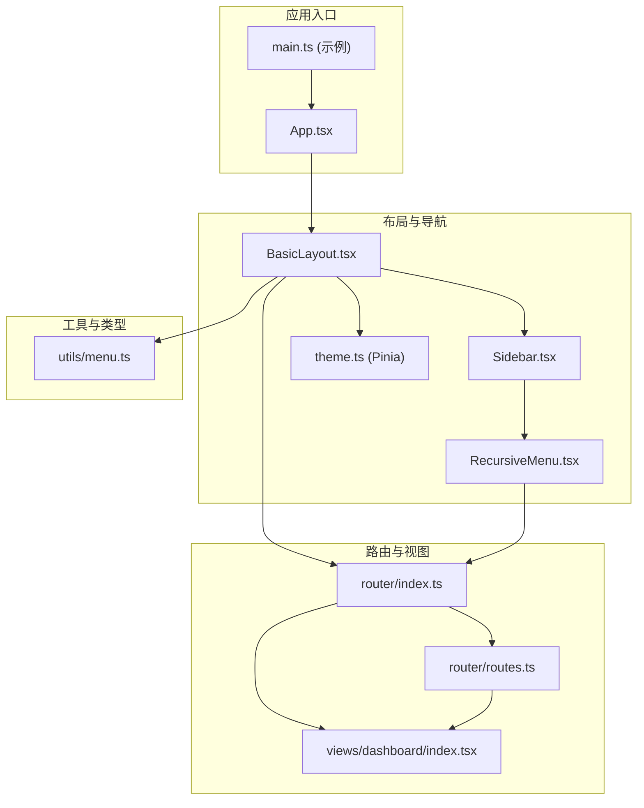
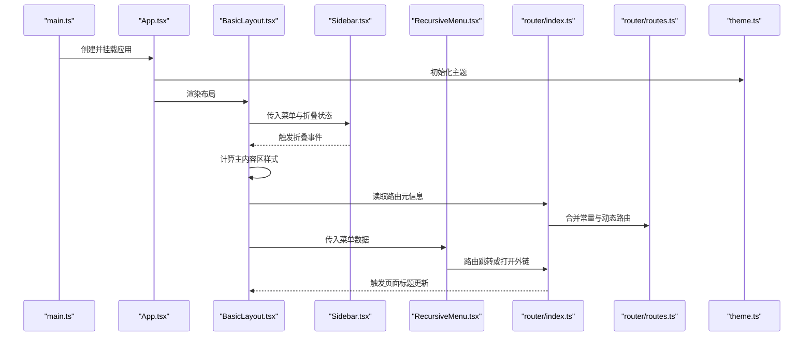
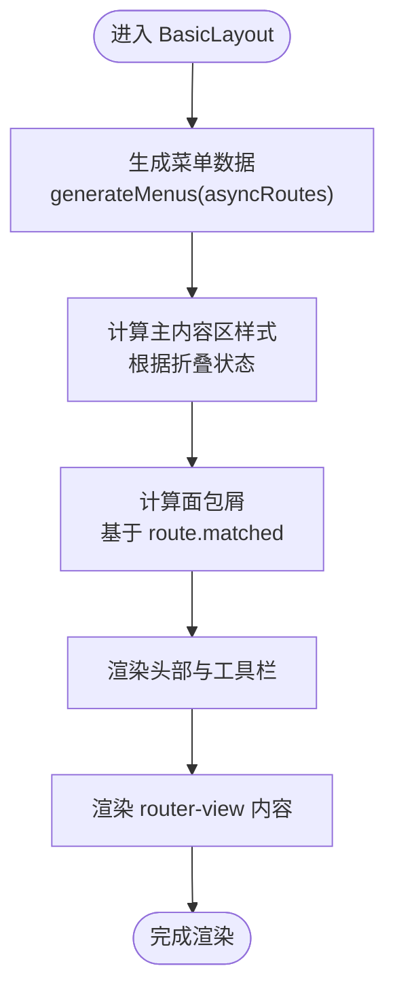
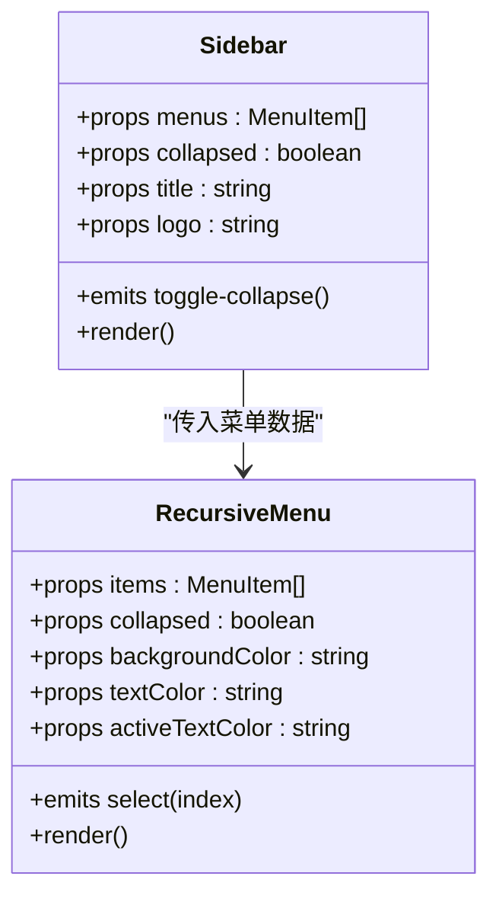
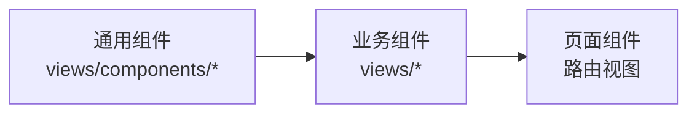
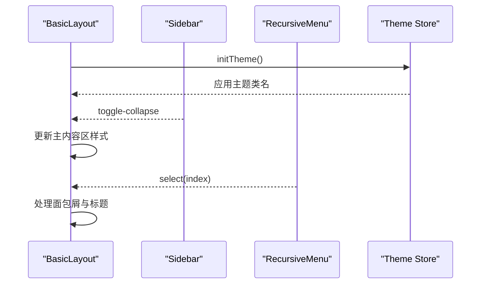
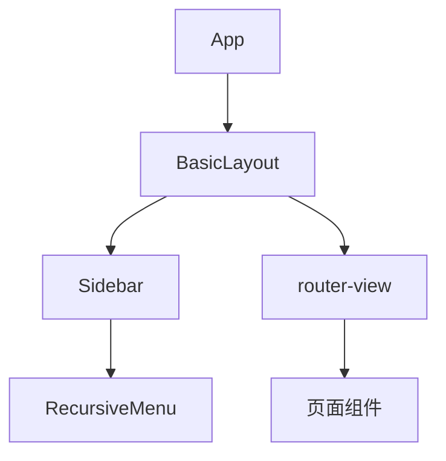
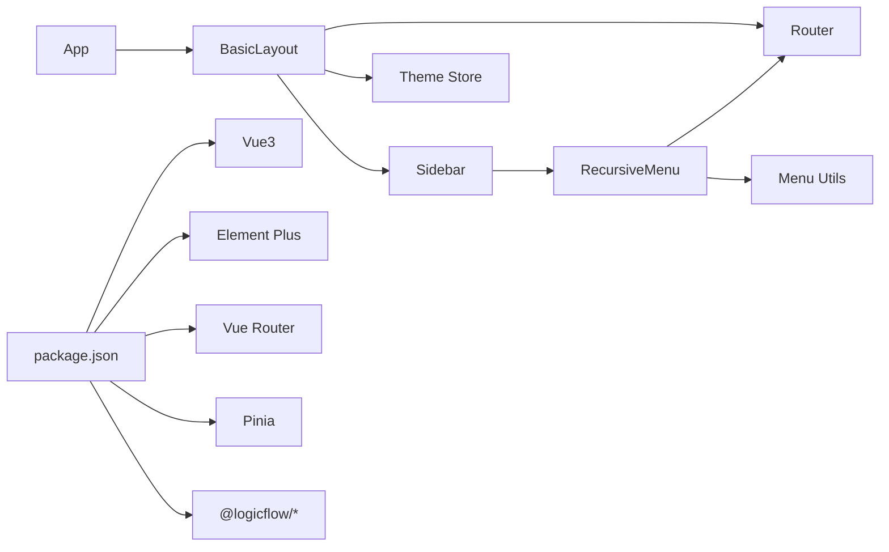

# 组件化架构

<cite>
**本文引用的文件**
- [src/layouts/BasicLayout.tsx](file://src/layouts/BasicLayout.tsx)
- [src/App.tsx](file://src/App.tsx)
- [src/router/index.ts](file://src/router/index.ts)
- [src/router/routes.ts](file://src/router/routes.ts)
- [src/stores/theme.ts](file://src/stores/theme.ts)
- [src/components/sidebar/Sidebar.tsx](file://src/components/sidebar/Sidebar.tsx)
- [src/components/menu/RecursiveMenu.tsx](file://src/components/menu/RecursiveMenu.tsx)
- [src/utils/menu.ts](file://src/utils/menu.ts)
- [src/views/dashboard/index.tsx](file://src/views/dashboard/index.tsx)
- [package.json](file://package.json)
- [examples/vue3-app/src/main.ts](file://examples/vue3-app/src/main.ts)
</cite>

## 目录
1. [引言](#引言)
2. [项目结构](#项目结构)
3. [核心组件](#核心组件)
4. [架构总览](#架构总览)
5. [组件详细分析](#组件详细分析)
6. [依赖关系分析](#依赖关系分析)
7. [性能考量](#性能考量)
8. [故障排查指南](#故障排查指南)
9. [结论](#结论)
10. [附录](#附录)

## 引言
本文件面向 Rsbuild LogicFlow 项目的前端组件化架构，聚焦 Vue3 组件化设计理念与实现策略，系统阐述布局组件 BasicLayout 的设计模式与复用机制；解析业务组件的分层结构（通用组件、业务组件、页面组件）；总结组件通信模式（props、events、provide/inject、Pinia Store）；说明组件生命周期管理与状态同步；归纳可复用组件的设计原则与封装策略；并给出组件树结构与渲染优化建议。文末提供组件关系图与通信流程图，以及开发规范与最佳实践。

## 项目结构
该项目采用“布局-路由-视图-组件-工具-状态”分层组织方式，核心入口通过 App 组件挂载 BasicLayout，BasicLayout 负责容器布局、面包屑、头部工具栏与主内容区，配合路由系统与 Pinia 状态管理，形成清晰的组件化体系。

**图表来源**
- [src/App.tsx](file://src/App.tsx#L1-L20)
- [src/layouts/BasicLayout.tsx](file://src/layouts/BasicLayout.tsx#L1-L146)
- [src/components/sidebar/Sidebar.tsx](file://src/components/sidebar/Sidebar.tsx#L1-L87)
- [src/components/menu/RecursiveMenu.tsx](file://src/components/menu/RecursiveMenu.tsx#L1-L171)
- [src/router/index.ts](file://src/router/index.ts#L1-L46)
- [src/router/routes.ts](file://src/router/routes.ts#L1-L215)
- [src/utils/menu.ts](file://src/utils/menu.ts#L1-L172)
- [src/stores/theme.ts](file://src/stores/theme.ts#L1-L111)
- [examples/vue3-app/src/main.ts](file://examples/vue3-app/src/main.ts#L1-L16)

**章节来源**
- [src/App.tsx](file://src/App.tsx#L1-L20)
- [src/layouts/BasicLayout.tsx](file://src/layouts/BasicLayout.tsx#L1-L146)
- [src/router/index.ts](file://src/router/index.ts#L1-L46)
- [src/router/routes.ts](file://src/router/routes.ts#L1-L215)
- [src/stores/theme.ts](file://src/stores/theme.ts#L1-L111)
- [src/components/sidebar/Sidebar.tsx](file://src/components/sidebar/Sidebar.tsx#L1-L87)
- [src/components/menu/RecursiveMenu.tsx](file://src/components/menu/RecursiveMenu.tsx#L1-L171)
- [src/utils/menu.ts](file://src/utils/menu.ts#L1-L172)
- [examples/vue3-app/src/main.ts](file://examples/vue3-app/src/main.ts#L1-L16)

## 核心组件
- 布局容器 BasicLayout：负责整体布局、侧边栏、面包屑、头部工具栏与主内容区，使用 Element Plus 容器组件与响应式样式控制侧边栏宽度与主内容区 margin。
- 侧边栏 Sidebar：接收菜单数据与折叠状态，渲染滚动容器与折叠按钮，并将折叠事件向上抛出。
- 递归菜单 RecursiveMenu：根据路由配置生成菜单树，支持图标、外链、多级子菜单、激活态与点击跳转。
- 主应用 App：初始化主题并挂载 BasicLayout。
- 路由系统：合并常量路由与动态路由，提供前置守卫设置标题与后置守卫扩展点。
- 主题状态 Store：基于 Pinia 的主题模式管理，支持本地持久化、系统跟随与 DOM 类名切换。

**章节来源**
- [src/layouts/BasicLayout.tsx](file://src/layouts/BasicLayout.tsx#L1-L146)
- [src/components/sidebar/Sidebar.tsx](file://src/components/sidebar/Sidebar.tsx#L1-L87)
- [src/components/menu/RecursiveMenu.tsx](file://src/components/menu/RecursiveMenu.tsx#L1-L171)
- [src/App.tsx](file://src/App.tsx#L1-L20)
- [src/router/index.ts](file://src/router/index.ts#L1-L46)
- [src/stores/theme.ts](file://src/stores/theme.ts#L1-L111)

## 架构总览
下图展示从应用入口到布局、路由、菜单与视图的交互关系，体现组件间的数据流与事件流。

**图表来源**
- [examples/vue3-app/src/main.ts](file://examples/vue3-app/src/main.ts#L1-L16)
- [src/App.tsx](file://src/App.tsx#L1-L20)
- [src/layouts/BasicLayout.tsx](file://src/layouts/BasicLayout.tsx#L1-L146)
- [src/components/sidebar/Sidebar.tsx](file://src/components/sidebar/Sidebar.tsx#L1-L87)
- [src/components/menu/RecursiveMenu.tsx](file://src/components/menu/RecursiveMenu.tsx#L1-L171)
- [src/router/index.ts](file://src/router/index.ts#L1-L46)
- [src/router/routes.ts](file://src/router/routes.ts#L1-L215)
- [src/stores/theme.ts](file://src/stores/theme.ts#L1-L111)

## 组件详细分析

### 布局组件 BasicLayout 设计与复用
- 设计理念
  - 使用组合式 API 与渲染函数，将布局拆分为侧边栏、头部、主内容区三部分，职责清晰。
  - 通过计算属性动态控制主内容区 margin，实现侧边栏折叠时的自适应布局。
  - 面包屑基于当前路由 matched 元信息生成，自动适配层级。
  - 头部右侧工具栏集成主题切换与用户下拉菜单，便于扩展。
- 复用机制
  - 通过 props 接收菜单数据与折叠状态，emit 事件与父组件解耦。
  - 与路由系统结合，无需在布局内硬编码菜单，提升可维护性。
  - 主题初始化在布局中统一触发，确保全局主题一致性。

**图表来源**
- [src/layouts/BasicLayout.tsx](file://src/layouts/BasicLayout.tsx#L1-L146)
- [src/utils/menu.ts](file://src/utils/menu.ts#L1-L172)
- [src/router/routes.ts](file://src/router/routes.ts#L1-L215)

**章节来源**
- [src/layouts/BasicLayout.tsx](file://src/layouts/BasicLayout.tsx#L1-L146)
- [src/utils/menu.ts](file://src/utils/menu.ts#L1-L172)

### 侧边栏 Sidebar 与递归菜单 RecursiveMenu
- Sidebar
  - 接收 menus、collapsed、title、logo 等 props，emit toggle-collapse 事件。
  - 根据 collapsed 动态计算宽度，渲染滚动容器与折叠按钮。
- RecursiveMenu
  - 根据路由配置递归渲染菜单树，支持外链、子菜单、图标、禁用项。
  - 通过 resolvePath 与 isExternalLink 处理路径与外链打开。
  - 基于 Element Plus 的 ElMenu/ElSubMenu/ElMenuItem 实现菜单交互。

**图表来源**
- [src/components/sidebar/Sidebar.tsx](file://src/components/sidebar/Sidebar.tsx#L1-L87)
- [src/components/menu/RecursiveMenu.tsx](file://src/components/menu/RecursiveMenu.tsx#L1-L171)

**章节来源**
- [src/components/sidebar/Sidebar.tsx](file://src/components/sidebar/Sidebar.tsx#L1-L87)
- [src/components/menu/RecursiveMenu.tsx](file://src/components/menu/RecursiveMenu.tsx#L1-L171)
- [src/utils/menu.ts](file://src/utils/menu.ts#L1-L172)

### 页面组件与业务组件分层
- 通用组件：如图标、基础卡片、按钮等，位于 views/components 下，作为业务复用的基础单元。
- 业务组件：如 Dashboard 页面，组合通用组件与业务数据，承担页面级展示与交互。
- 页面组件：路由直接映射的视图组件，如 dashboard、system、components、nested 等，负责页面级布局与数据加载。

**图表来源**
- [src/views/dashboard/index.tsx](file://src/views/dashboard/index.tsx#L1-L99)
- [src/router/routes.ts](file://src/router/routes.ts#L1-L215)

**章节来源**
- [src/views/dashboard/index.tsx](file://src/views/dashboard/index.tsx#L1-L99)
- [src/router/routes.ts](file://src/router/routes.ts#L1-L215)

### 组件通信模式
- Props：Sidebar 接收 menus/collapsed/title/logo；RecursiveMenu 接收 items/collapsed 等；BasicLayout 接收菜单与折叠状态。
- Events：Sidebar emit toggle-collapse；RecursiveMenu emit select；BasicLayout 处理下拉菜单命令。
- Provide/Inject：当前代码未使用，可在跨层级共享配置时引入。
- Pinia Store：useThemeStore 管理主题模式、跟随系统与 DOM 切换，全局一致的主题行为。

**图表来源**
- [src/layouts/BasicLayout.tsx](file://src/layouts/BasicLayout.tsx#L1-L146)
- [src/components/sidebar/Sidebar.tsx](file://src/components/sidebar/Sidebar.tsx#L1-L87)
- [src/components/menu/RecursiveMenu.tsx](file://src/components/menu/RecursiveMenu.tsx#L1-L171)
- [src/stores/theme.ts](file://src/stores/theme.ts#L1-L111)

**章节来源**
- [src/stores/theme.ts](file://src/stores/theme.ts#L1-L111)

### 生命周期管理与状态同步
- 初始化：App 与 BasicLayout 在 mounted 钩子中调用主题初始化，确保 DOM 已就绪。
- 状态同步：Pinia 中 watch 监听主题模式变化，实时应用到 HTML 类名，保证样式同步。
- 路由联动：路由前置守卫设置页面标题，后置守卫可用于进度条结束等扩展。

**章节来源**
- [src/App.tsx](file://src/App.tsx#L1-L20)
- [src/layouts/BasicLayout.tsx](file://src/layouts/BasicLayout.tsx#L1-L146)
- [src/stores/theme.ts](file://src/stores/theme.ts#L1-L111)
- [src/router/index.ts](file://src/router/index.ts#L1-L46)

### 可复用组件的设计原则与封装策略
- 单一职责：Sidebar 专注侧边栏渲染与折叠；RecursiveMenu 专注菜单树渲染与跳转。
- 明确接口：通过 props 明确输入，通过 emits 明确输出，避免隐式依赖。
- 可配置性：提供颜色、宽度、默认展开等参数，满足不同场景。
- 无副作用：菜单渲染不直接操作全局状态，仅通过 props 与事件与上层交互。
- 可测试性：将路径解析、外链判断等逻辑抽离为工具函数，便于单元测试。

**章节来源**
- [src/components/sidebar/Sidebar.tsx](file://src/components/sidebar/Sidebar.tsx#L1-L87)
- [src/components/menu/RecursiveMenu.tsx](file://src/components/menu/RecursiveMenu.tsx#L1-L171)
- [src/utils/menu.ts](file://src/utils/menu.ts#L1-L172)

### 组件树结构与渲染优化
- 组件树
  - App -> BasicLayout -> Sidebar -> RecursiveMenu
  - App -> BasicLayout -> router-view -> 页面组件
- 渲染优化建议
  - 菜单渲染：使用 key 基于唯一标识，减少不必要的重排。
  - 折叠动画：Element Plus 的 collapseTransition 可关闭过渡以降低复杂度。
  - 路由懒加载：页面组件采用动态导入，按需加载。
  - 主题切换：通过 DOM 类名切换，避免深层组件重复渲染。

**图表来源**
- [src/App.tsx](file://src/App.tsx#L1-L20)
- [src/layouts/BasicLayout.tsx](file://src/layouts/BasicLayout.tsx#L1-L146)
- [src/components/sidebar/Sidebar.tsx](file://src/components/sidebar/Sidebar.tsx#L1-L87)
- [src/components/menu/RecursiveMenu.tsx](file://src/components/menu/RecursiveMenu.tsx#L1-L171)

**章节来源**
- [src/App.tsx](file://src/App.tsx#L1-L20)
- [src/layouts/BasicLayout.tsx](file://src/layouts/BasicLayout.tsx#L1-L146)

## 依赖关系分析
- 组件依赖
  - BasicLayout 依赖 Sidebar、ThemeSwitch、路由与菜单工具。
  - Sidebar 依赖 RecursiveMenu 与 Element Plus 滚动容器。
  - RecursiveMenu 依赖路由与菜单工具函数。
- 外部依赖
  - Vue3、Element Plus、Vue Router、Pinia、@logicflow 系列库。
- 版本与插件
  - Rsbuild 构建链路包含 Vue、JSX、Less 插件，确保开发体验与产物质量。

**图表来源**
- [src/layouts/BasicLayout.tsx](file://src/layouts/BasicLayout.tsx#L1-L146)
- [src/components/sidebar/Sidebar.tsx](file://src/components/sidebar/Sidebar.tsx#L1-L87)
- [src/components/menu/RecursiveMenu.tsx](file://src/components/menu/RecursiveMenu.tsx#L1-L171)
- [src/router/index.ts](file://src/router/index.ts#L1-L46)
- [src/utils/menu.ts](file://src/utils/menu.ts#L1-L172)
- [src/stores/theme.ts](file://src/stores/theme.ts#L1-L111)
- [package.json](file://package.json#L1-L45)

**章节来源**
- [package.json](file://package.json#L1-L45)

## 性能考量
- 路由懒加载：页面组件使用动态导入，减少首屏体积。
- 菜单渲染：递归菜单按需渲染，避免一次性渲染大量节点。
- 主题切换：通过类名切换而非深层组件重渲染，降低开销。
- 滚动容器：侧边栏使用滚动条组件，避免自定义滚动导致的性能问题。
- 构建优化：Rsbuild 配合 Less 与 JSX 插件，提升编译效率与产物体积。

## 故障排查指南
- 面包屑不显示
  - 检查路由 meta.title 是否正确设置；确认 matched 数组非空。
- 菜单不显示或不跳转
  - 检查 generateMenus 输出是否为空；确认菜单项 path 与路由 path 对应。
- 侧边栏折叠无效
  - 检查 toggle-collapse 事件是否正确 emit；确认 BasicLayout 中 mainStyle 计算值。
- 主题不生效
  - 检查 ThemeSwitch 是否调用 store.initTheme；确认 DOM 类名切换逻辑。
- 外链无法打开
  - 检查 isExternalLink 判定与 resolvePath 拼接逻辑。

**章节来源**
- [src/layouts/BasicLayout.tsx](file://src/layouts/BasicLayout.tsx#L1-L146)
- [src/components/sidebar/Sidebar.tsx](file://src/components/sidebar/Sidebar.tsx#L1-L87)
- [src/components/menu/RecursiveMenu.tsx](file://src/components/menu/RecursiveMenu.tsx#L1-L171)
- [src/utils/menu.ts](file://src/utils/menu.ts#L1-L172)
- [src/stores/theme.ts](file://src/stores/theme.ts#L1-L111)

## 结论
该组件化架构以 BasicLayout 为核心容器，结合 Sidebar 与 RecursiveMenu 实现高内聚、低耦合的布局与导航体系；通过路由与工具函数解耦菜单生成与路径解析；借助 Pinia 主题状态实现全局一致的主题行为。整体设计遵循单一职责与明确接口原则，具备良好的可扩展性与可维护性。

## 附录
- 开发规范与最佳实践
  - 组件命名：采用 PascalCase，功能明确的目录结构。
  - Props 与 Events：保持单向数据流，避免跨层级直接修改状态。
  - 路由与菜单：通过 meta 控制可见性、排序与权限，菜单生成逻辑集中于工具函数。
  - 主题管理：统一在 Pinia 中管理，避免分散的状态变更。
  - 构建与插件：遵循 Rsbuild 配置，启用必要的 Vue/JSX/Less 支持。
  - 测试：对菜单工具函数与组件交互进行单元测试覆盖。