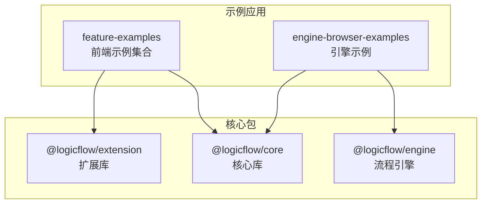
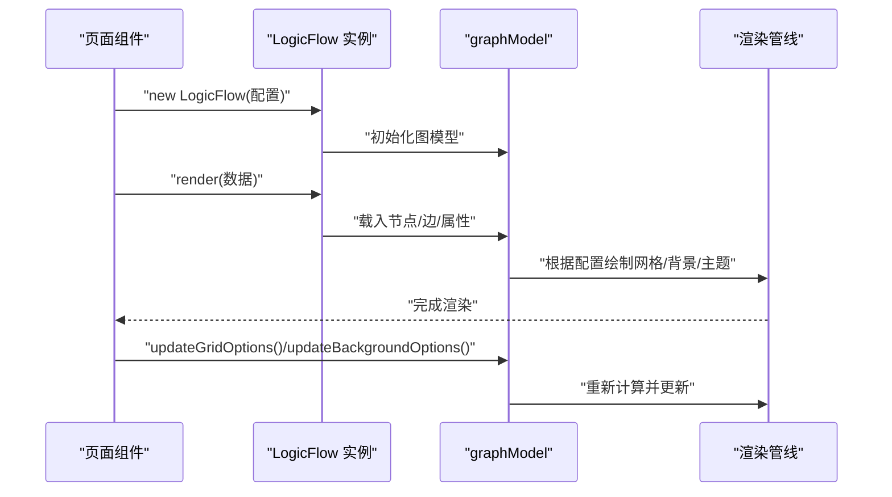
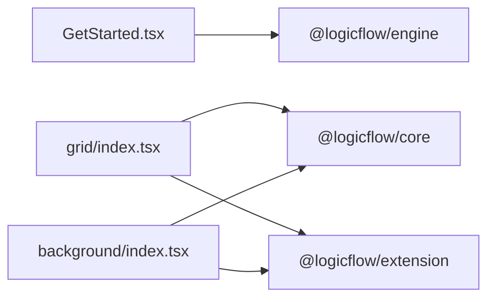
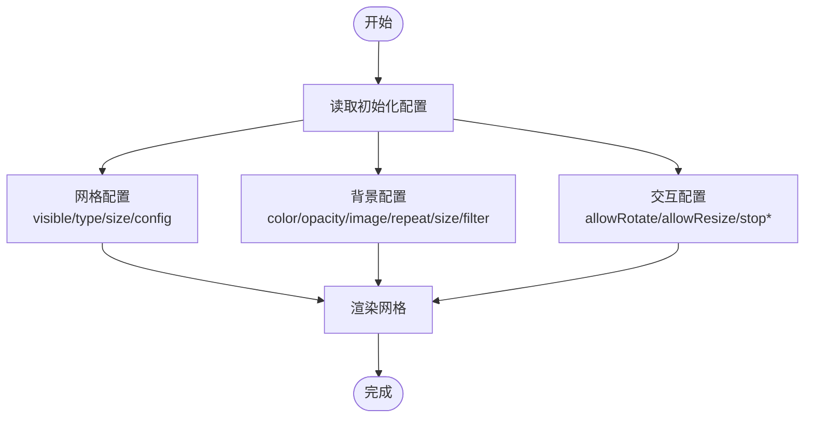

# LogicFlow 引擎配置

<cite>
**本文引用的文件**
- [GetStarted.tsx](file://examples/engine-browser-examples/src/pages/engine/GetStarted.tsx)
- [package.json](file://packages/engine/package.json)
- [config.ts](file://examples/feature-examples/src/pages/theme/config.ts)
- [grid/index.tsx](file://examples/feature-examples/src/pages/grid/index.tsx)
- [background/index.tsx](file://examples/feature-examples/src/pages/background/index.tsx)
</cite>

## 目录
1. [简介](#简介)
2. [项目结构](#项目结构)
3. [核心组件](#核心组件)
4. [架构总览](#架构总览)
5. [详细组件分析](#详细组件分析)
6. [依赖关系分析](#依赖关系分析)
7. [性能考量](#性能考量)
8. [故障排除指南](#故障排除指南)
9. [结论](#结论)
10. [附录](#附录)

## 简介
本文件系统化梳理 LogicFlow 引擎在浏览器环境中的配置与使用方式，重点覆盖以下方面：
- 引擎初始化参数与配置项
- 容器设置与视口控制
- 交互配置（多选、旋转、调整）
- 背景网格与画布背景
- 主题定制机制与字段体系
- 自定义 ID 生成器、边类型设置、文本编辑配置等高级能力
- 配置项之间的相互影响与性能权衡
- 常见场景配置示例与排障建议

## 项目结构
本仓库包含多个示例工程与核心包，其中与引擎配置直接相关的内容主要集中在 feature-examples 的页面示例中，以及 engine 包的元数据信息。下面给出与本文相关的文件定位与作用概览：

图表来源
- [grid/index.tsx](file://examples/feature-examples/src/pages/grid/index.tsx#L1-L220)
- [background/index.tsx](file://examples/feature-examples/src/pages/background/index.tsx#L1-L202)
- [GetStarted.tsx](file://examples/engine-browser-examples/src/pages/engine/GetStarted.tsx#L1-L70)
- [package.json](file://packages/engine/package.json#L1-L50)

章节来源
- [grid/index.tsx](file://examples/feature-examples/src/pages/grid/index.tsx#L1-L220)
- [background/index.tsx](file://examples/feature-examples/src/pages/background/index.tsx#L1-L202)
- [GetStarted.tsx](file://examples/engine-browser-examples/src/pages/engine/GetStarted.tsx#L1-L70)
- [package.json](file://packages/engine/package.json#L1-L50)

## 核心组件
- LogicFlow 引擎实例：通过构造函数传入配置对象进行初始化，随后加载图数据并渲染。
- 图模型（graphModel）：负责承载节点、边、网格、背景等状态，并提供更新接口。
- 主题与样式：通过 Options.style 或主题配置文件集中管理节点、边、文本等元素的视觉属性。
- 交互控制：允许旋转、调整大小、网格显示、滚动/缩放/移动等行为开关。

章节来源
- [grid/index.tsx](file://examples/feature-examples/src/pages/grid/index.tsx#L10-L44)
- [background/index.tsx](file://examples/feature-examples/src/pages/background/index.tsx#L10-L44)
- [config.ts](file://examples/feature-examples/src/pages/theme/config.ts#L135-L151)

## 架构总览
下图展示了从页面到引擎实例、再到图模型与渲染管线的整体关系，以及配置项如何影响渲染与交互。

图表来源
- [grid/index.tsx](file://examples/feature-examples/src/pages/grid/index.tsx#L120-L142)
- [background/index.tsx](file://examples/feature-examples/src/pages/background/index.tsx#L120-L138)
- [config.ts](file://examples/feature-examples/src/pages/theme/config.ts#L135-L151)

## 详细组件分析

### 引擎初始化与容器设置
- 容器：通过 container 指定挂载 DOM；可为字符串或 HTMLElement。
- 尺寸：width/height 控制画布尺寸。
- 视口：translateCenter 可将内容平移到画布中心。
- 示例路径：[grid/index.tsx](file://examples/feature-examples/src/pages/grid/index.tsx#L120-L142)，[background/index.tsx](file://examples/feature-examples/src/pages/background/index.tsx#L120-L138)

章节来源
- [grid/index.tsx](file://examples/feature-examples/src/pages/grid/index.tsx#L120-L142)
- [background/index.tsx](file://examples/feature-examples/src/pages/background/index.tsx#L120-L138)

### 交互配置（多选、旋转、调整）
- allowRotate：允许节点旋转。
- allowResize：允许节点调整大小。
- stopScrollGraph/stopZoomGraph/stopMoveGraph：分别控制滚动、缩放、平移行为。
- 示例路径：[grid/index.tsx](file://examples/feature-examples/src/pages/grid/index.tsx#L10-L44)

章节来源
- [grid/index.tsx](file://examples/feature-examples/src/pages/grid/index.tsx#L10-L44)

### 背景网格配置
- grid.size：网格间距。
- grid.visible：是否显示网格。
- grid.type：网格类型（点状/线状）。
- grid.config：网格样式细节（颜色、线宽等）。
- grid.majorBold：高级网格行为开关与参数。
- 动态更新：graphModel.updateGridOptions 支持运行时修改网格配置。
- 示例路径：[grid/index.tsx](file://examples/feature-examples/src/pages/grid/index.tsx#L133-L150)，[config.ts](file://examples/feature-examples/src/pages/theme/config.ts#L141-L150)

章节来源
- [grid/index.tsx](file://examples/feature-examples/src/pages/grid/index.tsx#L133-L150)
- [config.ts](file://examples/feature-examples/src/pages/theme/config.ts#L141-L150)

### 画布背景配置
- updateBackgroundOptions：支持设置背景颜色、透明度、背景图、重复方式、尺寸、滤镜等。
- 示例路径：[background/index.tsx](file://examples/feature-examples/src/pages/background/index.tsx#L140-L195)

章节来源
- [background/index.tsx](file://examples/feature-examples/src/pages/background/index.tsx#L140-L195)

### 主题定制机制与字段体系
- 主题字段分类：基础节点/边、画布背景、节点类型、边类型、文本、其他元素（锚点、箭头、对齐线、旋转/缩放控制点、轮廓、边动画等）。
- 字段类型：颜色、数字、布尔（以选择框呈现）、选择、文本等。
- 字段取值范围与默认值：如字体大小、透明度、网格大小、虚线样式、动画函数与方向等均有明确约束。
- 主题字段配置示例路径：[config.ts](file://examples/feature-examples/src/pages/theme/config.ts#L174-L410)，字段类型配置示例路径：[config.ts](file://examples/feature-examples/src/pages/theme/config.ts#L413-L642)

章节来源
- [config.ts](file://examples/feature-examples/src/pages/theme/config.ts#L174-L410)
- [config.ts](file://examples/feature-examples/src/pages/theme/config.ts#L413-L642)

### 自定义 ID 生成器
- 在当前示例中未直接展示自定义 ID 生成器的实现。通常可在业务层通过统一的 ID 工具函数生成唯一标识，再注入到节点/边的 id 字段中，确保全局唯一且可追踪。
- 注意：当使用引擎内置的 ID 生成策略时，需关注并发场景下的冲突风险；若需要强一致的 ID 规范，建议在应用层实现可插拔的 ID 生成器并在导入数据前预处理。

（本节为通用实践说明，不直接分析具体源码）

### 边类型设置与文本编辑配置
- 边类型：示例中使用折线（polyline），亦可配置为直线（line）、贝塞尔曲线（bezier）等。
- 文本编辑：节点/边文本可通过 properties.text 或节点的 text 字段设置；文本溢出模式、宽度、行高等均可通过主题字段进行精细化控制。
- 示例路径：[grid/index.tsx](file://examples/feature-examples/src/pages/grid/index.tsx#L98-L117)，[config.ts](file://examples/feature-examples/src/pages/theme/config.ts#L262-L287)

章节来源
- [grid/index.tsx](file://examples/feature-examples/src/pages/grid/index.tsx#L98-L117)
- [config.ts](file://examples/feature-examples/src/pages/theme/config.ts#L262-L287)

### 键盘快捷键与事件绑定
- 当前示例未直接展示键盘快捷键的配置。一般而言，LogicFlow 会提供事件钩子用于监听键盘/鼠标交互，可在初始化配置中注册回调或在实例上绑定事件处理器以实现快捷键功能。
- 建议：在业务层封装统一的快捷键映射表与事件分发器，避免与引擎内部事件耦合过深。

（本节为通用实践说明，不直接分析具体源码）

### 引擎执行与数据流（@logicflow/engine）
- 引擎包元信息：包含引擎名称、版本、入口文件、依赖（如 uuid、sandboxjs）等。
- 示例用法：通过 new Engine() 创建实例，load 注入流程数据，execute 执行，getExecutionRecord 获取执行记录。
- 示例路径：[GetStarted.tsx](file://examples/engine-browser-examples/src/pages/engine/GetStarted.tsx#L4-L61)，[package.json](file://packages/engine/package.json#L1-L50)

章节来源
- [GetStarted.tsx](file://examples/engine-browser-examples/src/pages/engine/GetStarted.tsx#L4-L61)
- [package.json](file://packages/engine/package.json#L1-L50)

## 依赖关系分析
- 引擎示例依赖 @logicflow/engine 进行流程执行。
- 功能示例依赖 @logicflow/core 与 @logicflow/extension 进行图形渲染与扩展能力。
- 样式依赖：示例中引入了核心与扩展的 CSS 文件以保证渲染一致性。

图表来源
- [GetStarted.tsx](file://examples/engine-browser-examples/src/pages/engine/GetStarted.tsx#L1-L2)
- [grid/index.tsx](file://examples/feature-examples/src/pages/grid/index.tsx#L1-L8)
- [background/index.tsx](file://examples/feature-examples/src/pages/background/index.tsx#L1-L8)
- [package.json](file://packages/engine/package.json#L1-L50)

章节来源
- [GetStarted.tsx](file://examples/engine-browser-examples/src/pages/engine/GetStarted.tsx#L1-L2)
- [grid/index.tsx](file://examples/feature-examples/src/pages/grid/index.tsx#L1-L8)
- [background/index.tsx](file://examples/feature-examples/src/pages/background/index.tsx#L1-L8)
- [package.json](file://packages/engine/package.json#L1-L50)

## 性能考量
- 网格与背景
  - 网格过大或过于复杂（如线状网格、高分辨率背景图）会增加渲染开销。建议按需开启网格与背景，并合理设置网格大小与线宽。
  - 背景图片建议使用压缩后的资源，并控制 repeat/size/filter 的使用频率。
- 交互与事件
  - 关闭不必要的交互（如 stopScrollGraph/stopZoomGraph/stopMoveGraph）可减少事件处理成本。
  - 大量节点/边时，建议延迟渲染或分批加载，避免一次性 render 导致卡顿。
- 主题与样式
  - 复杂的虚线样式、动画与滤镜会显著影响渲染性能。建议在保证可用性的前提下简化样式配置。
- 引擎执行
  - 流程执行涉及脚本沙箱与状态机，建议控制流程复杂度与循环深度，避免长时间阻塞主线程。

（本节为通用性能建议，不直接分析具体源码）

## 故障排除指南
- 网格不生效
  - 检查 grid.visible 是否为 true，grid.size 是否大于 0，type 是否正确设置。
  - 若使用动态更新，请确认调用了 graphModel.updateGridOptions 并传入正确的键值。
  - 参考路径：[grid/index.tsx](file://examples/feature-examples/src/pages/grid/index.tsx#L144-L150)
- 背景未显示或异常
  - 确认 updateBackgroundOptions 的参数是否完整（颜色、透明度、图片、重复方式、尺寸、滤镜）。
  - 检查背景图片 URL 是否有效，跨域与缓存问题可能导致图片不显示。
  - 参考路径：[background/index.tsx](file://examples/feature-examples/src/pages/background/index.tsx#L140-L195)
- 交互无效
  - 若无法拖拽/缩放/旋转，请检查 stopScrollGraph/stopZoomGraph/stopMoveGraph 与 allowRotate/allowResize 的组合是否符合预期。
  - 参考路径：[grid/index.tsx](file://examples/feature-examples/src/pages/grid/index.tsx#L10-L44)
- 主题字段取值错误
  - 数字类字段需满足最小/最大值与步进要求；颜色类字段应使用合法的颜色值；选择类字段需使用枚举值。
  - 参考路径：[config.ts](file://examples/feature-examples/src/pages/theme/config.ts#L413-L642)
- 引擎执行报错
  - 确认流程数据结构完整（nodes/edges/graphData/globalData），id 唯一且存在。
  - 检查条件表达式与脚本沙箱权限，避免非法操作导致执行中断。
  - 参考路径：[GetStarted.tsx](file://examples/engine-browser-examples/src/pages/engine/GetStarted.tsx#L9-L51)

章节来源
- [grid/index.tsx](file://examples/feature-examples/src/pages/grid/index.tsx#L144-L150)
- [background/index.tsx](file://examples/feature-examples/src/pages/background/index.tsx#L140-L195)
- [grid/index.tsx](file://examples/feature-examples/src/pages/grid/index.tsx#L10-L44)
- [config.ts](file://examples/feature-examples/src/pages/theme/config.ts#L413-L642)
- [GetStarted.tsx](file://examples/engine-browser-examples/src/pages/engine/GetStarted.tsx#L9-L51)

## 结论
本文基于仓库中的示例与配置文件，系统梳理了 LogicFlow 在浏览器环境中的配置要点与实践方法。通过容器设置、交互开关、网格与背景配置、主题字段体系以及引擎执行流程，可以构建出稳定、可维护且高性能的可视化流程图应用。建议在实际项目中结合业务需求，采用模块化的配置与主题管理，并在性能敏感场景下进行针对性优化。

（本节为总结性内容，不直接分析具体源码）

## 附录

### 常见配置场景与最佳实践
- 快速起步
  - 设置 container、width、height，调用 render 加载数据，必要时使用 translateCenter 居中。
  - 参考路径：[grid/index.tsx](file://examples/feature-examples/src/pages/grid/index.tsx#L120-L142)
- 开启网格与背景
  - grid.visible=true，grid.type='dot'/'mesh'，grid.size 合理设置；背景通过 updateBackgroundOptions 配置。
  - 参考路径：[grid/index.tsx](file://examples/feature-examples/src/pages/grid/index.tsx#L133-L150)，[background/index.tsx](file://examples/feature-examples/src/pages/background/index.tsx#L140-L195)
- 交互控制
  - 根据业务需要开启/关闭滚动、缩放、平移与旋转/调整，避免误操作。
  - 参考路径：[grid/index.tsx](file://examples/feature-examples/src/pages/grid/index.tsx#L10-L44)
- 主题定制
  - 使用主题字段配置表统一管理节点/边/文本样式，确保一致性与可维护性。
  - 参考路径：[config.ts](file://examples/feature-examples/src/pages/theme/config.ts#L174-L410)

### 配置项相互影响示意

图表来源
- [grid/index.tsx](file://examples/feature-examples/src/pages/grid/index.tsx#L10-L44)
- [background/index.tsx](file://examples/feature-examples/src/pages/background/index.tsx#L10-L44)
- [config.ts](file://examples/feature-examples/src/pages/theme/config.ts#L135-L151)