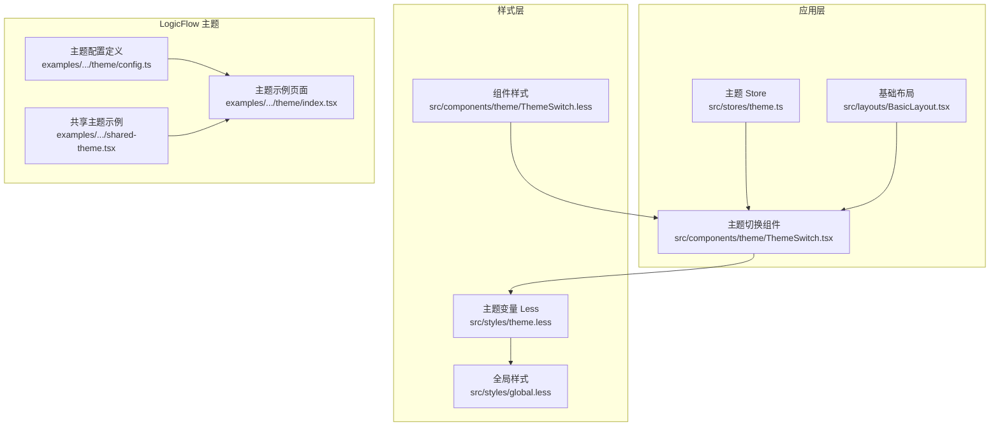
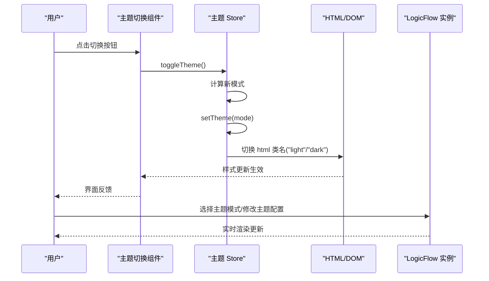
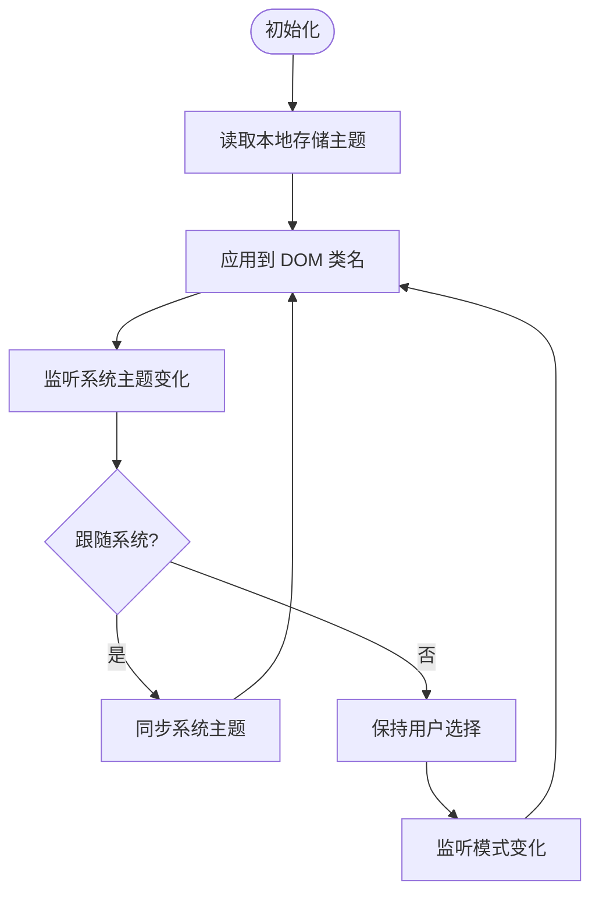
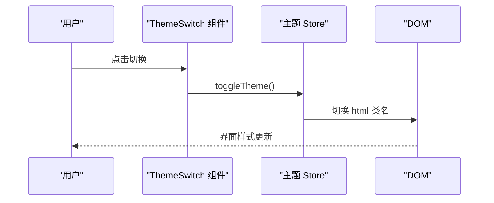
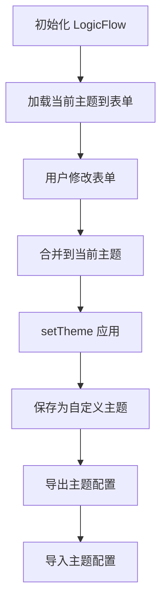
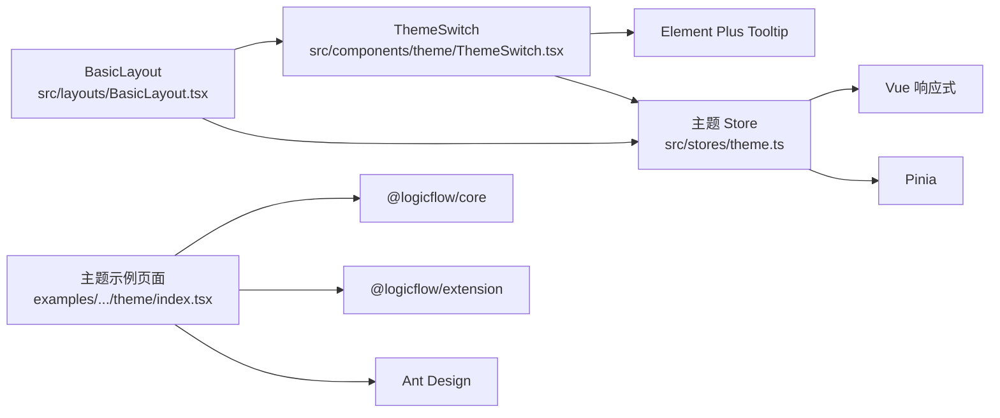

# 主题与样式系统

<cite>
**本文档引用的文件**
- [src/stores/theme.ts](file://src/stores/theme.ts)
- [src/styles/theme.less](file://src/styles/theme.less)
- [src/components/theme/ThemeSwitch.tsx](file://src/components/theme/ThemeSwitch.tsx)
- [src/components/theme/ThemeSwitch.less](file://src/components/theme/ThemeSwitch.less)
- [src/types/theme.ts](file://src/types/theme.ts)
- [src/layouts/BasicLayout.tsx](file://src/layouts/BasicLayout.tsx)
- [examples/feature-examples/src/pages/theme/config.ts](file://examples/feature-examples/src/pages/theme/config.ts)
- [examples/feature-examples/src/pages/theme/index.tsx](file://examples/feature-examples/src/pages/theme/index.tsx)
- [examples/feature-examples/src/pages/theme/shared-theme.tsx](file://examples/feature-examples/src/pages/theme/shared-theme.tsx)
- [examples/feature-examples/src/pages/theme/shared-theme.less](file://examples/feature-examples/src/pages/theme/shared-theme.less)
- [examples/feature-examples/src/pages/theme/index.less](file://examples/feature-examples/src/pages/theme/index.less)
- [src/styles/global.less](file://src/styles/global.less)
- [package.json](file://package.json)
</cite>

## 目录
1. [简介](#简介)
2. [项目结构](#项目结构)
3. [核心组件](#核心组件)
4. [架构总览](#架构总览)
5. [详细组件分析](#详细组件分析)
6. [依赖关系分析](#依赖关系分析)
7. [性能考量](#性能考量)
8. [故障排除指南](#故障排除指南)
9. [结论](#结论)
10. [附录](#附录)

## 简介
本文件系统性梳理 LogicFlow 主题与样式系统，涵盖主题定制机制、样式覆盖方法、颜色方案与字体设置、明暗主题切换原理与状态管理、样式变量与类名规范、主题开发指南、与 Element Plus 的集成方式，以及用户体验与无障碍访问建议。文档基于仓库中的实际代码进行分析，确保可操作性与可追溯性。

## 项目结构
主题与样式系统主要分布在以下模块：
- 应用层主题状态与切换：Pinia Store、主题开关组件、布局集成
- 样式层主题变量与全局样式：Less 变量、CSS 变量、全局容器样式
- LogicFlow 图编辑器主题：内置主题模式、动态主题配置、主题导入导出
- 组件库集成：Element Plus 的图标与 Tooltip



**图表来源**
- [src/stores/theme.ts](file://src/stores/theme.ts#L1-L111)
- [src/components/theme/ThemeSwitch.tsx](file://src/components/theme/ThemeSwitch.tsx#L1-L93)
- [src/layouts/BasicLayout.tsx](file://src/layouts/BasicLayout.tsx#L1-L146)
- [src/styles/theme.less](file://src/styles/theme.less#L1-L176)
- [src/styles/global.less](file://src/styles/global.less#L1-L4)
- [src/components/theme/ThemeSwitch.less](file://src/components/theme/ThemeSwitch.less#L1-L147)
- [examples/feature-examples/src/pages/theme/config.ts](file://examples/feature-examples/src/pages/theme/config.ts#L1-L645)
- [examples/feature-examples/src/pages/theme/index.tsx](file://examples/feature-examples/src/pages/theme/index.tsx#L1-L848)
- [examples/feature-examples/src/pages/theme/shared-theme.tsx](file://examples/feature-examples/src/pages/theme/shared-theme.tsx#L1-L304)

**章节来源**
- [src/stores/theme.ts](file://src/stores/theme.ts#L1-L111)
- [src/styles/theme.less](file://src/styles/theme.less#L1-L176)
- [src/components/theme/ThemeSwitch.tsx](file://src/components/theme/ThemeSwitch.tsx#L1-L93)
- [src/layouts/BasicLayout.tsx](file://src/layouts/BasicLayout.tsx#L1-L146)
- [examples/feature-examples/src/pages/theme/config.ts](file://examples/feature-examples/src/pages/theme/config.ts#L1-L645)
- [examples/feature-examples/src/pages/theme/index.tsx](file://examples/feature-examples/src/pages/theme/index.tsx#L1-L848)
- [examples/feature-examples/src/pages/theme/shared-theme.tsx](file://examples/feature-examples/src/pages/theme/shared-theme.tsx#L1-L304)
- [src/styles/global.less](file://src/styles/global.less#L1-L4)
- [src/components/theme/ThemeSwitch.less](file://src/components/theme/ThemeSwitch.less#L1-L147)

## 核心组件
- 主题 Store：负责主题模式持久化、系统偏好监听、DOM 类名切换与响应式状态
- 主题切换组件：基于 SVG 图标与 Element Plus Tooltip，提供明/暗切换交互
- 布局集成：在基础布局中初始化主题，统一挂载主题开关
- LogicFlow 主题系统：通过静态方法注册主题模式，支持导入导出与实时预览

**章节来源**
- [src/stores/theme.ts](file://src/stores/theme.ts#L34-L110)
- [src/components/theme/ThemeSwitch.tsx](file://src/components/theme/ThemeSwitch.tsx#L1-L93)
- [src/layouts/BasicLayout.tsx](file://src/layouts/BasicLayout.tsx#L68-L71)
- [examples/feature-examples/src/pages/theme/index.tsx](file://examples/feature-examples/src/pages/theme/index.tsx#L379-L518)

## 架构总览
主题系统采用“状态驱动 + CSS 变量 + 组件化”的三层架构：
- 状态层：Pinia Store 管理主题模式与跟随系统偏好
- 样式层：Less 定义 CSS 变量，按 :root.light/:root.dark 切换
- 交互层：组件触发状态变更，DOM 类名驱动样式切换；LogicFlow 通过 setTheme 动态应用主题



**图表来源**
- [src/components/theme/ThemeSwitch.tsx](file://src/components/theme/ThemeSwitch.tsx#L27-L29)
- [src/stores/theme.ts](file://src/stores/theme.ts#L59-L70)
- [examples/feature-examples/src/pages/theme/index.tsx](file://examples/feature-examples/src/pages/theme/index.tsx#L369-L445)

## 详细组件分析

### 主题状态与切换（Pinia Store）
- 持久化键名：本地存储键用于保存用户选择的主题模式
- 系统偏好：监听 prefers-color-scheme，支持跟随系统
- DOM 切换：通过为 html 添加/移除 "light"/"dark" 类名，驱动 Less 变量切换
- 响应式：watch 监听模式变化，确保样式即时更新



**图表来源**
- [src/stores/theme.ts](file://src/stores/theme.ts#L82-L94)
- [src/stores/theme.ts](file://src/stores/theme.ts#L72-L79)
- [src/stores/theme.ts](file://src/stores/theme.ts#L96-L99)

**章节来源**
- [src/stores/theme.ts](file://src/stores/theme.ts#L1-L111)

### 主题变量与样式覆盖（Less/CSS 变量）
- 主题色：以紫色系为主，提供多级浅色梯度
- 功能色：成功、警告、危险、信息色
- 深色主题默认：:root, :root.dark 定义变量
- 浅色主题：:root.light 定义变量
- 组件样式：主题开关组件使用 CSS 变量与条件类名实现深浅样式差异

```mermaid
classDiagram
class ThemeVars {
"+--bg-color"
"+--bg-color-page"
"+--text-color-primary"
"+--border-color"
"+--fill-color"
"+--color-primary"
"+--box-shadow"
"+--sidebar-bg-color"
"+--header-bg-color"
"+--card-bg-color"
"+--table-header-bg-color"
"+--input-bg-color"
"+--tabs-bg-color"
}
class DarkTheme {
"<< : root, : root.dark>>"
}
class LightTheme {
"<< : root.light>>"
}
ThemeVars <|-- DarkTheme
ThemeVars <|-- LightTheme
```

**图表来源**
- [src/styles/theme.less](file://src/styles/theme.less#L21-L97)
- [src/styles/theme.less](file://src/styles/theme.less#L100-L175)

**章节来源**
- [src/styles/theme.less](file://src/styles/theme.less#L1-L176)
- [src/components/theme/ThemeSwitch.less](file://src/components/theme/ThemeSwitch.less#L137-L147)

### 主题切换组件（ThemeSwitch）
- 属性：showTooltip、size（small/default/large）
- 交互：点击切换模式，配合 Element Plus Tooltip 提示
- 视觉：SVG 太阳/月亮图标，带动画；thumb 位置随模式变化
- 样式：深浅主题下轨道与阴影差异化



**图表来源**
- [src/components/theme/ThemeSwitch.tsx](file://src/components/theme/ThemeSwitch.tsx#L27-L29)
- [src/stores/theme.ts](file://src/stores/theme.ts#L44-L57)

**章节来源**
- [src/components/theme/ThemeSwitch.tsx](file://src/components/theme/ThemeSwitch.tsx#L1-L93)
- [src/components/theme/ThemeSwitch.less](file://src/components/theme/ThemeSwitch.less#L1-L147)

### 布局集成（BasicLayout）
- 在 mounted 生命周期调用 themeStore.initTheme()
- 在头部右侧工具栏集成 ThemeSwitch 组件
- 通过计算属性控制主内容区边距，保证侧边栏折叠不影响主题开关可视区域

**章节来源**
- [src/layouts/BasicLayout.tsx](file://src/layouts/BasicLayout.tsx#L68-L71)
- [src/layouts/BasicLayout.tsx](file://src/layouts/BasicLayout.tsx#L102-L103)

### LogicFlow 主题系统（示例页面）
- 主题配置定义：按基础、节点、边、文本、其他、画布分类，定义字段与类型
- 表单渲染：根据字段类型渲染颜色选择器、数字输入、下拉选择、文本输入
- 实时预览：表单值变化时合并到当前主题并调用 setTheme
- 自定义主题：将当前主题合并用户修改后保存为新主题模式
- 导入导出：支持 JSON 文件导入/导出主题配置



**图表来源**
- [examples/feature-examples/src/pages/theme/index.tsx](file://examples/feature-examples/src/pages/theme/index.tsx#L696-L736)
- [examples/feature-examples/src/pages/theme/index.tsx](file://examples/feature-examples/src/pages/theme/index.tsx#L223-L367)
- [examples/feature-examples/src/pages/theme/index.tsx](file://examples/feature-examples/src/pages/theme/index.tsx#L479-L518)
- [examples/feature-examples/src/pages/theme/index.tsx](file://examples/feature-examples/src/pages/theme/index.tsx#L521-L569)
- [examples/feature-examples/src/pages/theme/index.tsx](file://examples/feature-examples/src/pages/theme/index.tsx#L572-L649)

**章节来源**
- [examples/feature-examples/src/pages/theme/config.ts](file://examples/feature-examples/src/pages/theme/config.ts#L174-L410)
- [examples/feature-examples/src/pages/theme/index.tsx](file://examples/feature-examples/src/pages/theme/index.tsx#L1-L848)

### 共享主题示例（SharedThemeExample）
- 注册共享主题：通过静态方法 LogicFlow.addThemeMode('shared', sharedTheme)
- 同步切换：两个实例同时应用相同主题
- 导入导出：支持导出当前主题配置与导入外部主题文件

**章节来源**
- [examples/feature-examples/src/pages/theme/shared-theme.tsx](file://examples/feature-examples/src/pages/theme/shared-theme.tsx#L159-L184)
- [examples/feature-examples/src/pages/theme/shared-theme.tsx](file://examples/feature-examples/src/pages/theme/shared-theme.tsx#L186-L273)

### 类型与规范
- 主题模式类型：'dark' | 'light'
- 主题变量接口：覆盖背景、文字、边框、填充、功能色、阴影、侧边栏、头部、卡片、表格、输入框、标签页等 CSS 变量
- 全局容器样式：提供页面容器的尺寸规范

**章节来源**
- [src/types/theme.ts](file://src/types/theme.ts#L4-L9)
- [src/types/theme.ts](file://src/types/theme.ts#L31-L89)
- [src/styles/global.less](file://src/styles/global.less#L1-L4)

## 依赖关系分析
- 主题 Store 依赖 Vue 响应式与 Pinia
- 主题切换组件依赖 Element Plus Tooltip
- 布局集成依赖主题 Store 与 Element Plus 布局组件
- LogicFlow 主题示例依赖 @logicflow/core 与 @logicflow/extension



**图表来源**
- [src/stores/theme.ts](file://src/stores/theme.ts#L1-L3)
- [src/components/theme/ThemeSwitch.tsx](file://src/components/theme/ThemeSwitch.tsx#L4)
- [src/layouts/BasicLayout.tsx](file://src/layouts/BasicLayout.tsx#L1-L11)
- [examples/feature-examples/src/pages/theme/index.tsx](file://examples/feature-examples/src/pages/theme/index.tsx#L1-L27)
- [package.json](file://package.json#L14-L26)

**章节来源**
- [package.json](file://package.json#L14-L26)

## 性能考量
- 样式切换成本低：仅切换 html 类名，避免全量重绘
- 表单实时预览：使用防抖/节流可进一步优化复杂主题场景
- 主题持久化：本地存储读写开销小，注意避免频繁写入
- LogicFlow 主题应用：批量合并配置后再 setTheme，减少多次渲染

## 故障排除指南
- 主题未生效
  - 检查 html 是否包含 "light"/"dark" 类名
  - 确认 Less 变量已在对应伪类中定义
- 系统主题不同步
  - 确认 setFollowSystem 已开启
  - 检查浏览器媒体查询事件监听是否生效
- 主题切换组件无提示
  - 确认 Element Plus Tooltip 正常加载
- LogicFlow 主题导入失败
  - 检查 JSON 结构是否包含合法的 theme 对象
  - 确认 addThemeMode 方法可用

**章节来源**
- [src/stores/theme.ts](file://src/stores/theme.ts#L82-L94)
- [src/components/theme/ThemeSwitch.tsx](file://src/components/theme/ThemeSwitch.tsx#L78-L87)
- [examples/feature-examples/src/pages/theme/index.tsx](file://examples/feature-examples/src/pages/theme/index.tsx#L572-L649)

## 结论
该主题与样式系统通过 Pinia Store 管理状态、Less/CSS 变量驱动样式、组件化交互与 LogicFlow 主题 API 实现了完整的明暗主题体系。系统具备良好的扩展性与可维护性，适合在企业级前端工程中推广使用。

## 附录

### 主题开发指南
- 颜色体系设计
  - 建议以主色为基础，提供 3/5/7/8/9 级浅色梯度
  - 功能色与主色保持一致的视觉权重
- 组件样式定制
  - 优先使用 CSS 变量，避免硬编码颜色
  - 深浅主题下分别定义关键组件的差异化样式
- 响应式适配
  - 使用相对单位与媒体查询，确保在不同屏幕尺寸下的一致体验
- 与 Element Plus 集成
  - 使用 Element Plus 的 Tooltip/Select/Button 等组件提升交互质量
  - 注意图标与主题色的协调

### 明暗主题切换实现要点
- 状态管理：集中于 Pinia Store，避免分散状态
- DOM 切换：通过 html 类名切换，影响全局 Less 变量
- 系统偏好：监听媒体查询，支持跟随系统
- 用户偏好：本地存储持久化，初始化时恢复

### 样式变量、类名与内联样式的使用规范
- 样式变量：统一在 Less 中定义，按作用域命名（如 --sidebar-*）
- CSS 类名：组件级类名采用 BEM 风格，避免全局污染
- 内联样式：仅在必要时使用，优先通过类名与变量控制

### 无障碍访问考虑
- 对比度：深色模式下确保文本与背景对比度满足 WCAG AA
- 键盘导航：确保主题切换可通过键盘操作
- 屏幕阅读器：为切换按钮提供语义化标签与提示文案