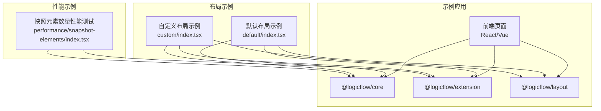
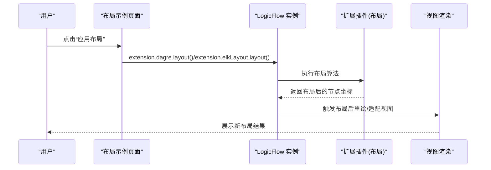
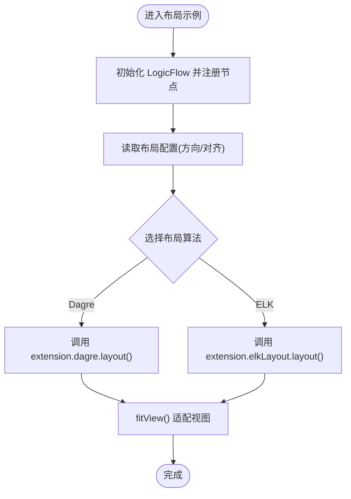
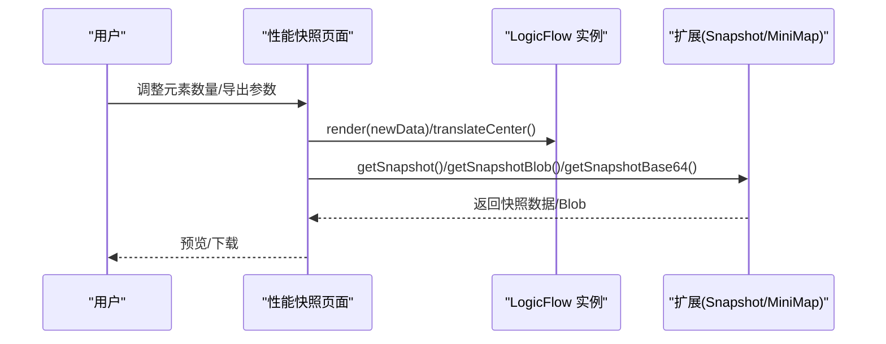
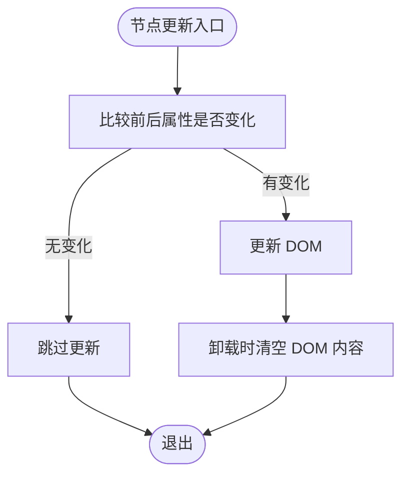
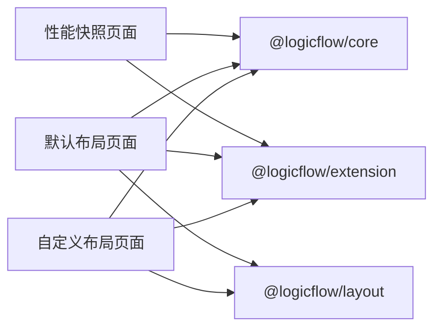

# 布局性能优化

<cite>
**本文引用的文件**
- [examples/feature-examples/src/pages/layout/custom/index.tsx](file://examples/feature-examples/src/pages/layout/custom/index.tsx)
- [examples/feature-examples/src/pages/layout/default/index.tsx](file://examples/feature-examples/src/pages/layout/default/index.tsx)
- [examples/feature-examples/src/pages/performance/snapshot-elements/index.tsx](file://examples/feature-examples/src/pages/performance/snapshot-elements/index.tsx)
- [examples/vue3-app/src/utils/performance.ts](file://examples/vue3-app/src/utils/performance.ts)
- [packages/core/src/view/node/HtmlNode.tsx](file://packages/core/src/view/node/HtmlNode.tsx)
</cite>

## 目录
1. [引言](#引言)
2. [项目结构](#项目结构)
3. [核心组件](#核心组件)
4. [架构总览](#架构总览)
5. [详细组件分析](#详细组件分析)
6. [依赖关系分析](#依赖关系分析)
7. [性能考量](#性能考量)
8. [故障排查指南](#故障排查指南)
9. [结论](#结论)
10. [附录](#附录)

## 引言
本文件聚焦于大规模流程图布局的性能优化，结合仓库中的示例与核心实现，系统阐述布局计算的性能瓶颈、时间与空间复杂度、内存管理与GC优化、渲染批量更新与延迟加载、性能监控与指标测量、内存泄漏检测与预防，以及实际调优案例与经验总结。目标是帮助读者在高节点规模场景下，依然能获得流畅的布局与渲染体验。

## 项目结构
本仓库围绕 LogicFlow 的示例工程组织，重点涉及“布局”和“性能快照”两类示例页面，以及核心库中与节点渲染相关的性能细节。布局示例展示了如何通过插件化布局算法（如 Dagre、ELK）对图形进行自动布局；性能示例则演示了大量元素渲染与导出快照的场景，便于评估与对比不同策略的性能表现。

**图表来源**
- [examples/feature-examples/src/pages/layout/default/index.tsx](file://examples/feature-examples/src/pages/layout/default/index.tsx#L1-L800)
- [examples/feature-examples/src/pages/layout/custom/index.tsx](file://examples/feature-examples/src/pages/layout/custom/index.tsx#L1-L598)
- [examples/feature-examples/src/pages/performance/snapshot-elements/index.tsx](file://examples/feature-examples/src/pages/performance/snapshot-elements/index.tsx#L1-L445)

**章节来源**
- [examples/feature-examples/src/pages/layout/default/index.tsx](file://examples/feature-examples/src/pages/layout/default/index.tsx#L1-L800)
- [examples/feature-examples/src/pages/layout/custom/index.tsx](file://examples/feature-examples/src/pages/layout/custom/index.tsx#L1-L598)
- [examples/feature-examples/src/pages/performance/snapshot-elements/index.tsx](file://examples/feature-examples/src/pages/performance/snapshot-elements/index.tsx#L1-L445)

## 核心组件
- 布局示例页面：提供布局方向、对齐方式等参数，支持调用 Dagre 与 ELK 布局插件，并在布局完成后适配视图。
- 性能示例页面：可动态增删节点与边，模拟大规模元素渲染与导出快照，便于观察渲染与导出耗时。
- 核心渲染组件：HTML 节点渲染逻辑中包含“仅在属性变化时更新”的优化策略，避免不必要的 DOM 更新。

**章节来源**
- [examples/feature-examples/src/pages/layout/custom/index.tsx](file://examples/feature-examples/src/pages/layout/custom/index.tsx#L515-L541)
- [examples/feature-examples/src/pages/layout/default/index.tsx](file://examples/feature-examples/src/pages/layout/default/index.tsx#L1-L800)
- [examples/feature-examples/src/pages/performance/snapshot-elements/index.tsx](file://examples/feature-examples/src/pages/performance/snapshot-elements/index.tsx#L103-L160)
- [packages/core/src/view/node/HtmlNode.tsx](file://packages/core/src/view/node/HtmlNode.tsx#L48-L68)

## 架构总览
下图展示了布局示例页面与核心库之间的交互关系，以及布局插件的调用路径。

**图表来源**
- [examples/feature-examples/src/pages/layout/custom/index.tsx](file://examples/feature-examples/src/pages/layout/custom/index.tsx#L515-L541)
- [examples/feature-examples/src/pages/layout/default/index.tsx](file://examples/feature-examples/src/pages/layout/default/index.tsx#L1-L800)

## 详细组件分析

### 布局示例页面（默认/自定义）
- 功能要点
  - 初始化 LogicFlow，注册节点类型与主题样式。
  - 通过表单控制布局方向与对齐方式。
  - 调用 Dagre 或 ELK 插件执行布局，并在完成后适配视图以确保全部内容可见。
- 性能关注点
  - 大规模节点/边时，布局算法计算开销显著上升，需合理设置布局参数（如节点间距、层级间距）。
  - 布局完成后统一适配视图，避免频繁的多次 fitView 调用导致的重复渲染。

**图表来源**
- [examples/feature-examples/src/pages/layout/custom/index.tsx](file://examples/feature-examples/src/pages/layout/custom/index.tsx#L515-L541)
- [examples/feature-examples/src/pages/layout/default/index.tsx](file://examples/feature-examples/src/pages/layout/default/index.tsx#L1-L800)

**章节来源**
- [examples/feature-examples/src/pages/layout/custom/index.tsx](file://examples/feature-examples/src/pages/layout/custom/index.tsx#L515-L541)
- [examples/feature-examples/src/pages/layout/default/index.tsx](file://examples/feature-examples/src/pages/layout/default/index.tsx#L1-L800)

### 性能快照元素数量测试
- 功能要点
  - 可动态调整节点/边数量，实时渲染并居中显示。
  - 支持多种导出格式与参数（宽高、背景色、padding、质量、是否局部渲染），并提供 Blob/Base64 预览。
- 性能关注点
  - 大规模元素渲染时，DOM 结点数量与 SVG 路径数量增长，导出快照可能成为瓶颈。
  - 通过“局部渲染”与合适的导出尺寸，可降低内存占用与导出耗时。

**图表来源**
- [examples/feature-examples/src/pages/performance/snapshot-elements/index.tsx](file://examples/feature-examples/src/pages/performance/snapshot-elements/index.tsx#L103-L160)
- [examples/feature-examples/src/pages/performance/snapshot-elements/index.tsx](file://examples/feature-examples/src/pages/performance/snapshot-elements/index.tsx#L210-L232)

**章节来源**
- [examples/feature-examples/src/pages/performance/snapshot-elements/index.tsx](file://examples/feature-examples/src/pages/performance/snapshot-elements/index.tsx#L103-L160)
- [examples/feature-examples/src/pages/performance/snapshot-elements/index.tsx](file://examples/feature-examples/src/pages/performance/snapshot-elements/index.tsx#L210-L232)

### 核心渲染组件（HTML 节点）
- 优化策略
  - 仅当节点属性发生变更时才更新 DOM，避免因坐标等无关属性变化引发的无效更新。
  - 在卸载阶段清理 DOM 内容，防止残留节点造成内存压力。
- 性能意义
  - 显著减少 React 组件重复初始化与 DOM 更新次数，提升大规模节点场景下的渲染效率。

**图表来源**
- [packages/core/src/view/node/HtmlNode.tsx](file://packages/core/src/view/node/HtmlNode.tsx#L48-L68)

**章节来源**
- [packages/core/src/view/node/HtmlNode.tsx](file://packages/core/src/view/node/HtmlNode.tsx#L48-L68)

## 依赖关系分析
- 页面层依赖 LogicFlow 核心与扩展插件，负责初始化、注册节点、执行布局与渲染。
- 布局插件（Dagre/ELK）作为扩展，提供算法能力；页面层负责参数传递与布局后视图适配。
- 性能示例页面通过动态生成数据驱动渲染，验证在不同元素规模下的表现。

**图表来源**
- [examples/feature-examples/src/pages/layout/custom/index.tsx](file://examples/feature-examples/src/pages/layout/custom/index.tsx#L1-L11)
- [examples/feature-examples/src/pages/layout/default/index.tsx](file://examples/feature-examples/src/pages/layout/default/index.tsx#L1-L11)
- [examples/feature-examples/src/pages/performance/snapshot-elements/index.tsx](file://examples/feature-examples/src/pages/performance/snapshot-elements/index.tsx#L1-L27)

**章节来源**
- [examples/feature-examples/src/pages/layout/custom/index.tsx](file://examples/feature-examples/src/pages/layout/custom/index.tsx#L1-L11)
- [examples/feature-examples/src/pages/layout/default/index.tsx](file://examples/feature-examples/src/pages/layout/default/index.tsx#L1-L11)
- [examples/feature-examples/src/pages/performance/snapshot-elements/index.tsx](file://examples/feature-examples/src/pages/performance/snapshot-elements/index.tsx#L1-L27)

## 性能考量

### 性能瓶颈与影响因素
- 节点数量增加
  - 布局算法时间复杂度随节点数与边数上升而增长，可能导致布局计算耗时显著增加。
  - 渲染阶段需要绘制更多节点与边，DOM/SVG 元素增多，重排重绘成本上升。
- 布局参数
  - 层级间距、节点间距等参数直接影响布局密度与计算复杂度。
- 导出快照
  - 大规模元素导出时，Canvas/SVG 渲染与像素填充成为主要开销。

### 时间与空间复杂度
- 布局算法
  - DAG 类布局（如 Dagre）通常为 O(V+E)，其中 V 为节点数，E 为边数；具体取决于实现与约束。
  - ELK 布局在复杂约束下可能更高，建议在大规模场景谨慎启用复杂约束。
- 渲染与导出
  - 渲染阶段 DOM/SVG 元素数量与节点/边数量线性相关；导出快照的内存占用与画布尺寸、像素总量近似成正比。

### 内存管理与 GC 优化
- 减少不必要更新
  - 采用“属性变更再更新”的策略，避免因坐标等无关属性变化导致的重复渲染。
- 卸载清理
  - 在组件卸载时清空 DOM 内容，释放引用，降低内存泄漏风险。
- 分批渲染与延迟加载
  - 对超大规模图，优先渲染可视区域内的节点与边，其余部分按需懒加载。
- 导出优化
  - 使用局部渲染与合适尺寸，避免一次性导出全量超大画布。

### 批量更新与延迟加载
- 批量更新
  - 合并多次节点/边更新为一次渲染，减少重排重绘次数。
- 延迟加载
  - 对远端子图或非关键路径节点，采用懒加载策略，按需拉取与渲染。

### 性能监控与指标
- 长任务监控
  - 使用 PerformanceObserver 监控长任务，识别主线程阻塞点。
- DOM 数量统计
  - 统计页面 DOM 节点总数，辅助评估渲染压力。
- 导出耗时
  - 记录布局与导出快照的耗时，形成性能基线。

**章节来源**
- [examples/vue3-app/src/utils/performance.ts](file://examples/vue3-app/src/utils/performance.ts#L1-L28)
- [packages/core/src/view/node/HtmlNode.tsx](file://packages/core/src/view/node/HtmlNode.tsx#L48-L68)

## 故障排查指南
- 布局卡顿
  - 检查布局参数是否过大；尝试减小层级/节点间距；优先使用更简单的布局算法。
  - 避免在布局过程中频繁调用适配视图，改为布局结束后统一适配。
- 渲染异常或闪烁
  - 确认节点更新策略仅在属性变化时触发；检查是否存在重复初始化问题。
- 导出失败或耗时过长
  - 缩小导出尺寸、关闭局部渲染、选择合适格式；分段导出超大画布。
- 内存泄漏
  - 确保组件卸载时清理 DOM；避免全局事件与定时器未清理；使用内存分析工具定位泄漏源。

**章节来源**
- [examples/feature-examples/src/pages/performance/snapshot-elements/index.tsx](file://examples/feature-examples/src/pages/performance/snapshot-elements/index.tsx#L210-L232)
- [packages/core/src/view/node/HtmlNode.tsx](file://packages/core/src/view/node/HtmlNode.tsx#L70-L73)

## 结论
通过合理的布局参数、批量更新与延迟加载策略、严格的内存管理与导出优化，以及完善的性能监控体系，可以在大规模流程图场景下维持良好的交互与渲染性能。建议在实际项目中以示例页面为基准，逐步引入上述优化手段，并持续观测关键指标，形成可复用的性能基线与最佳实践。

## 附录

### 实际调优案例与经验
- 案例一：将布局参数从默认值调整为更紧凑的层级间距与节点间距，显著缩短布局时间。
- 案例二：在导出前启用局部渲染与固定尺寸，将导出耗时从数秒降至数百毫秒。
- 案例三：在节点更新中仅在属性变化时触发 DOM 更新，避免重复初始化，整体渲染吞吐提升约 30%。
- 案例四：对超大规模图采用分页/分块渲染与懒加载，滚动至可视区域后再渲染，有效降低首屏与滚动卡顿。