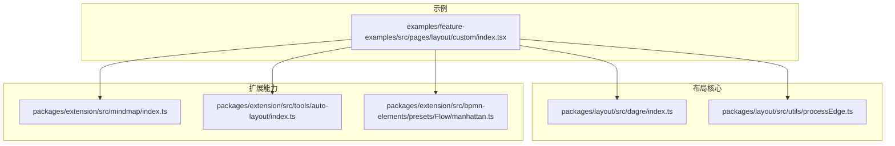
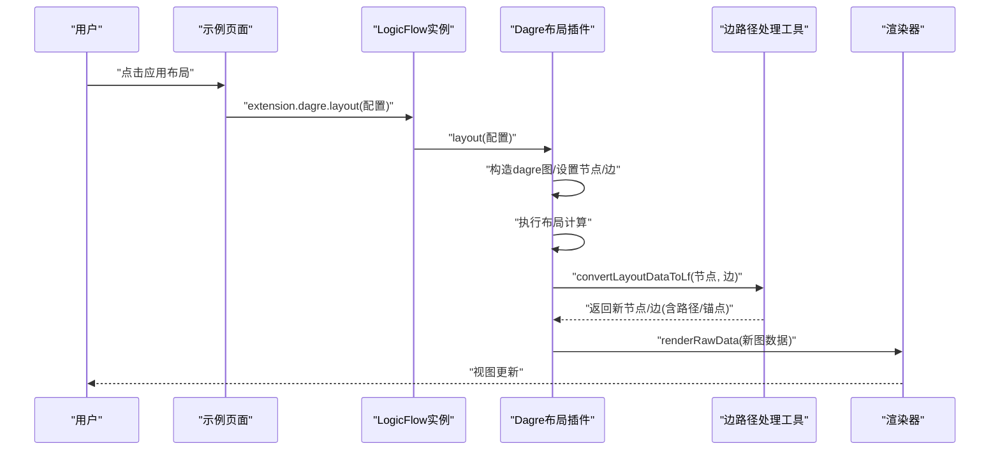
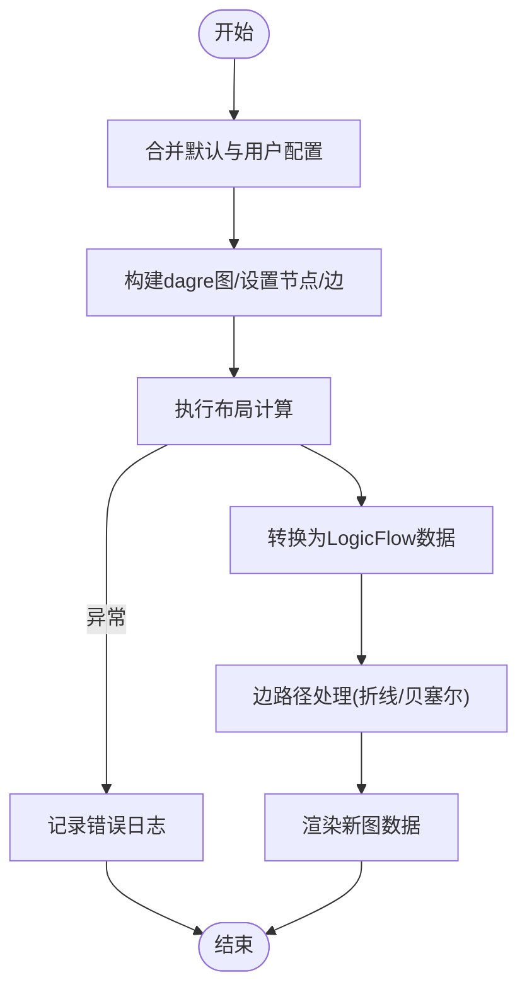
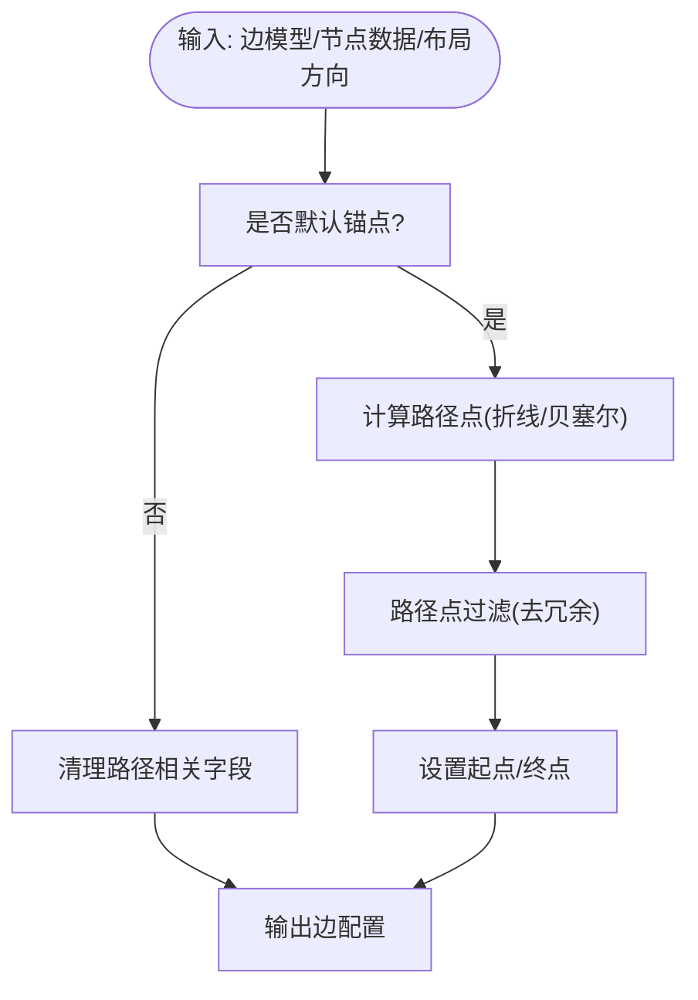
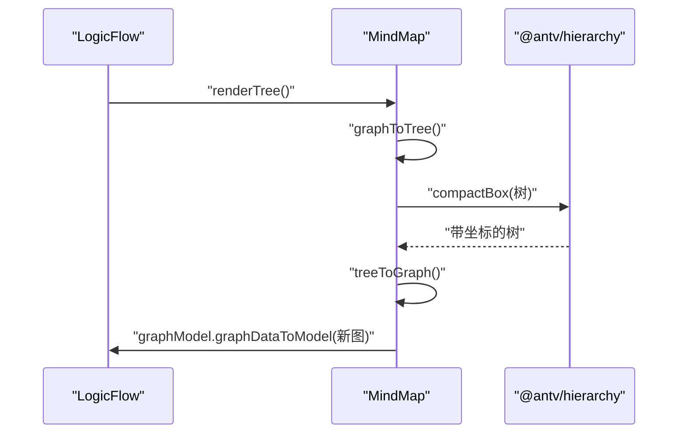
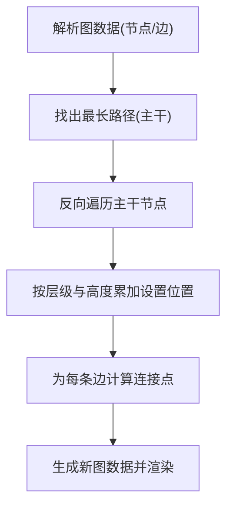
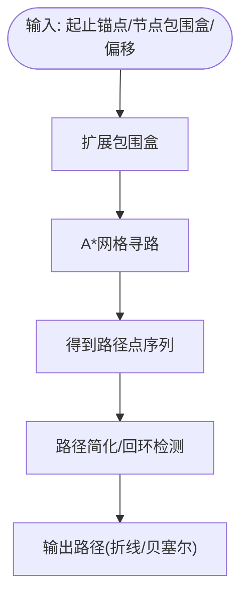
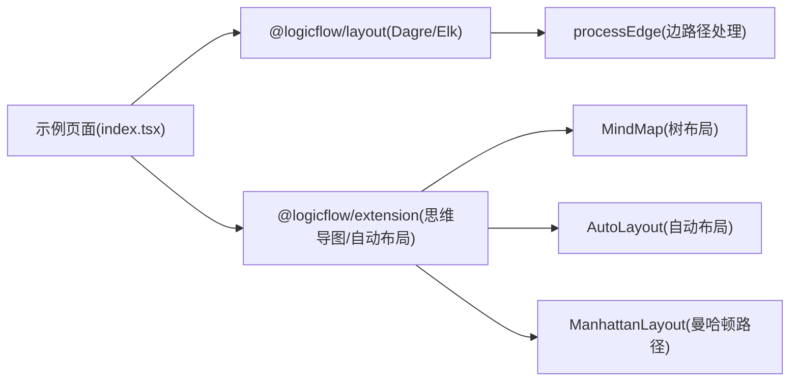

# 布局算法

<cite>
**本文引用的文件**
- [packages/layout/src/dagre/index.ts](file://packages/layout/src/dagre/index.ts)
- [packages/layout/src/utils/processEdge.ts](file://packages/layout/src/utils/processEdge.ts)
- [packages/extension/src/tools/auto-layout/index.ts](file://packages/extension/src/tools/auto-layout/index.ts)
- [packages/extension/src/mindmap/index.ts](file://packages/extension/src/mindmap/index.ts)
- [packages/extension/src/bpmn-elements/presets/Flow/manhattan.ts](file://packages/extension/src/bpmn-elements/presets/Flow/manhattan.ts)
- [examples/feature-examples/src/pages/layout/custom/index.tsx](file://examples/feature-examples/src/pages/layout/custom/index.tsx)
</cite>

## 目录
1. [简介](#简介)
2. [项目结构](#项目结构)
3. [核心组件](#核心组件)
4. [架构总览](#架构总览)
5. [详细组件分析](#详细组件分析)
6. [依赖关系分析](#依赖关系分析)
7. [性能考量](#性能考量)
8. [故障排查指南](#故障排查指南)
9. [结论](#结论)
10. [附录](#附录)

## 简介
本文件系统性梳理仓库中的布局算法实现与使用方式，重点覆盖以下内容：
- 有向无环图（DAG）布局：基于 dagre 的自动布局插件，支持方向、对齐、层级间距等参数配置，并提供边路径与锚点的自动计算。
- 树形布局：基于 @antv/hierarchy 的紧凑盒式布局，适用于思维导图等树结构的可视化。
- 力导向/路径规划：基于 A* 的曼哈顿路径规划，用于 BPMN 流程元素之间的避障与折线/贝塞尔路径生成。
- 自定义布局：通过扩展机制接入自定义布局算法，或在现有插件基础上二次开发。
- 性能优化：网格适配、边路径简化、冲突避免策略与大数据量处理建议。
- 实际应用：结合示例页面，演示如何在 LogicFlow 中启用与调用布局插件。

## 项目结构
围绕布局能力的关键目录与文件如下：
- packages/layout：提供 DAG 布局插件与通用边路径处理工具
- packages/extension：提供思维导图树布局、自动布局工具、BPMN 曼哈顿路径规划等扩展
- examples：提供可运行的布局示例页面，展示如何注册与调用布局插件

**图表来源**
- [packages/layout/src/dagre/index.ts](file://packages/layout/src/dagre/index.ts#L1-L178)
- [packages/layout/src/utils/processEdge.ts](file://packages/layout/src/utils/processEdge.ts#L1-L586)
- [packages/extension/src/mindmap/index.ts](file://packages/extension/src/mindmap/index.ts#L1-L329)
- [packages/extension/src/tools/auto-layout/index.ts](file://packages/extension/src/tools/auto-layout/index.ts#L1-L283)
- [packages/extension/src/bpmn-elements/presets/Flow/manhattan.ts](file://packages/extension/src/bpmn-elements/presets/Flow/manhattan.ts#L1-L692)
- [examples/feature-examples/src/pages/layout/custom/index.tsx](file://examples/feature-examples/src/pages/layout/custom/index.tsx#L1-L598)

**章节来源**
- [packages/layout/src/dagre/index.ts](file://packages/layout/src/dagre/index.ts#L1-L178)
- [packages/layout/src/utils/processEdge.ts](file://packages/layout/src/utils/processEdge.ts#L1-L586)
- [packages/extension/src/mindmap/index.ts](file://packages/extension/src/mindmap/index.ts#L1-L329)
- [packages/extension/src/tools/auto-layout/index.ts](file://packages/extension/src/tools/auto-layout/index.ts#L1-L283)
- [packages/extension/src/bpmn-elements/presets/Flow/manhattan.ts](file://packages/extension/src/bpmn-elements/presets/Flow/manhattan.ts#L1-L692)
- [examples/feature-examples/src/pages/layout/custom/index.tsx](file://examples/feature-examples/src/pages/layout/custom/index.tsx#L1-L598)

## 核心组件
- DAG 布局插件（Dagre）
  - 支持布局方向（LR/TB/BT/RL）、对齐方式（UL/UR/DL/DR）、层级间距、节点间距、边距等配置
  - 自动计算节点位置，并根据配置生成折线或贝塞尔边路径
  - 错误兜底：布局异常时输出日志
- 边路径处理工具（processEdge）
  - 针对不同布局方向与边类型（折线/贝塞尔），计算路径点、起点终点与锚点
  - 提供路径点过滤，去除冗余拐点，提升渲染效率
- 思维导图树布局（MindMap）
  - 基于 @antv/hierarchy 的 compactBox 布局，支持方向、节点尺寸、层级间隔等参数
  - 将树结构转换为图数据，再回写为 LogicFlow 图数据
- 自动布局工具（AutoLayout）
  - 基于最长路径的主干优先策略，尽量减少布局变化
  - 支持主干记忆、层级高度累加、边连接点计算
- 曼哈顿路径规划（ManhattanLayout）
  - 基于 A* 的网格寻路，结合节点包围盒与扩展包围盒，生成避障路径
  - 提供路径简化与回环检测，支持折线/贝塞尔控制点生成

**章节来源**
- [packages/layout/src/dagre/index.ts](file://packages/layout/src/dagre/index.ts#L26-L102)
- [packages/layout/src/utils/processEdge.ts](file://packages/layout/src/utils/processEdge.ts#L50-L99)
- [packages/extension/src/mindmap/index.ts](file://packages/extension/src/mindmap/index.ts#L239-L292)
- [packages/extension/src/tools/auto-layout/index.ts](file://packages/extension/src/tools/auto-layout/index.ts#L15-L79)
- [packages/extension/src/bpmn-elements/presets/Flow/manhattan.ts](file://packages/extension/src/bpmn-elements/presets/Flow/manhattan.ts#L650-L692)

## 架构总览
下图展示了布局插件在 LogicFlow 中的调用链路与数据流：

**图表来源**
- [examples/feature-examples/src/pages/layout/custom/index.tsx](file://examples/feature-examples/src/pages/layout/custom/index.tsx#L516-L541)
- [packages/layout/src/dagre/index.ts](file://packages/layout/src/dagre/index.ts#L71-L136)
- [packages/layout/src/utils/processEdge.ts](file://packages/layout/src/utils/processEdge.ts#L50-L99)

## 详细组件分析

### DAG 布局（Dagre）
- 关键职责
  - 接收布局配置（方向、对齐、层级/节点间距、边距等）
  - 构造 dagre 图，设置节点与边，执行布局
  - 将布局结果转换为 LogicFlow 节点/边数据，并调用边路径处理工具生成路径点
- 参数与行为
  - 默认方向为 LR，对齐方式为 UL，层级与节点间距随网格大小动态调整
  - 可通过 isDefaultAnchor 控制是否使用默认锚点与自动路径
- 错误处理
  - 布局异常时捕获并打印错误日志，避免中断流程

**图表来源**
- [packages/layout/src/dagre/index.ts](file://packages/layout/src/dagre/index.ts#L71-L136)
- [packages/layout/src/utils/processEdge.ts](file://packages/layout/src/utils/processEdge.ts#L50-L99)

**章节来源**
- [packages/layout/src/dagre/index.ts](file://packages/layout/src/dagre/index.ts#L26-L102)
- [packages/layout/src/utils/processEdge.ts](file://packages/layout/src/utils/processEdge.ts#L50-L99)

### 边路径处理（processEdge）
- 功能要点
  - 根据布局方向与边类型（polyline/bezier）计算路径点序列
  - 对路径点进行过滤，移除共线的冗余点
  - 在默认锚点模式下，设置起点/终点与控制点；否则仅清理路径数据交由引擎自动计算
- 适用场景
  - 折线：适合 DAG/LR 或 TB 方向的清晰层级布局
  - 贝塞尔：适合需要柔和曲线的流程图或思维导图

**图表来源**
- [packages/layout/src/utils/processEdge.ts](file://packages/layout/src/utils/processEdge.ts#L50-L99)
- [packages/layout/src/utils/processEdge.ts](file://packages/layout/src/utils/processEdge.ts#L137-L495)

**章节来源**
- [packages/layout/src/utils/processEdge.ts](file://packages/layout/src/utils/processEdge.ts#L50-L99)
- [packages/layout/src/utils/processEdge.ts](file://packages/layout/src/utils/processEdge.ts#L137-L495)

### 树形布局（MindMap）
- 关键流程
  - 将 LogicFlow 图数据转换为树结构
  - 使用 compactBox 布局计算每个节点的坐标
  - 将树结构转回图数据并写入渲染
- 参数与优化
  - 支持方向、节点宽度/高度、层级间隔、子树间隔等
  - 通过 DFS 平移根节点，避免多棵树时的视觉抖动

**图表来源**
- [packages/extension/src/mindmap/index.ts](file://packages/extension/src/mindmap/index.ts#L159-L233)
- [packages/extension/src/mindmap/index.ts](file://packages/extension/src/mindmap/index.ts#L239-L292)

**章节来源**
- [packages/extension/src/mindmap/index.ts](file://packages/extension/src/mindmap/index.ts#L159-L233)
- [packages/extension/src/mindmap/index.ts](file://packages/extension/src/mindmap/index.ts#L239-L292)

### 自动布局工具（AutoLayout）
- 设计目标
  - 基于最长路径的主干优先策略，尽量保持布局稳定
  - 记忆上次主干，当新节点插入时优先沿用旧主干，减少整体变化
- 关键步骤
  - 解析图数据，建立节点映射与前后关系
  - 从最长路径反向遍历，按层级与高度累加设置节点位置
  - 计算边连接点（考虑相对位置与节点尺寸）

**图表来源**
- [packages/extension/src/tools/auto-layout/index.ts](file://packages/extension/src/tools/auto-layout/index.ts#L54-L79)
- [packages/extension/src/tools/auto-layout/index.ts](file://packages/extension/src/tools/auto-layout/index.ts#L83-L143)

**章节来源**
- [packages/extension/src/tools/auto-layout/index.ts](file://packages/extension/src/tools/auto-layout/index.ts#L15-L79)
- [packages/extension/src/tools/auto-layout/index.ts](file://packages/extension/src/tools/auto-layout/index.ts#L83-L143)

### 曼哈顿路径规划（ManhattanLayout）
- 算法思路
  - 以 A* 在网格上寻找从起点锚点到终点锚点的最短路径
  - 节点包围盒扩展为障碍物，路径需避开
  - 对路径进行简化与回环检测，必要时生成折线或贝塞尔控制点
- 适用场景
  - BPMN 流程元素之间的连线避障
  - 需要严格水平/垂直走向的工程图

**图表来源**
- [packages/extension/src/bpmn-elements/presets/Flow/manhattan.ts](file://packages/extension/src/bpmn-elements/presets/Flow/manhattan.ts#L650-L692)
- [packages/extension/src/bpmn-elements/presets/Flow/manhattan.ts](file://packages/extension/src/bpmn-elements/presets/Flow/manhattan.ts#L268-L351)

**章节来源**
- [packages/extension/src/bpmn-elements/presets/Flow/manhattan.ts](file://packages/extension/src/bpmn-elements/presets/Flow/manhattan.ts#L650-L692)
- [packages/extension/src/bpmn-elements/presets/Flow/manhattan.ts](file://packages/extension/src/bpmn-elements/presets/Flow/manhattan.ts#L268-L351)

## 依赖关系分析
- 示例页面依赖布局插件与工具函数
  - 注册 Dagre 与 ElkLayout 插件
  - 通过 extension.dagre.layout 调用布局
- 布局插件依赖边路径处理工具
  - DAG 布局完成后，统一走 processEdges 生成路径点与锚点
- 树布局与自动布局独立于 DAG，但均面向 LogicFlow 图数据
- 曼哈顿路径规划可单独用于复杂连线避障

**图表来源**
- [examples/feature-examples/src/pages/layout/custom/index.tsx](file://examples/feature-examples/src/pages/layout/custom/index.tsx#L429-L541)
- [packages/layout/src/utils/processEdge.ts](file://packages/layout/src/utils/processEdge.ts#L50-L99)
- [packages/extension/src/mindmap/index.ts](file://packages/extension/src/mindmap/index.ts#L159-L233)
- [packages/extension/src/tools/auto-layout/index.ts](file://packages/extension/src/tools/auto-layout/index.ts#L15-L79)
- [packages/extension/src/bpmn-elements/presets/Flow/manhattan.ts](file://packages/extension/src/bpmn-elements/presets/Flow/manhattan.ts#L650-L692)

**章节来源**
- [examples/feature-examples/src/pages/layout/custom/index.tsx](file://examples/feature-examples/src/pages/layout/custom/index.tsx#L429-L541)
- [packages/layout/src/utils/processEdge.ts](file://packages/layout/src/utils/processEdge.ts#L50-L99)

## 性能考量
- 网格适配与间距
  - DAG 布局根据 gridSize 动态调整层级间距与节点间距，避免小网格导致的密集布局
- 路径点简化
  - processEdge 对路径点进行过滤，移除共线中间点，降低渲染与交互成本
- 主干优先与稳定性
  - AutoLayout 记忆上次主干，插入新节点时尽量沿用旧主干，减少整体布局变化
- 大数据量建议
  - 优先使用 DAG/LR 或 TB 方向，便于分层与路径计算
  - 对于超大规模图，建议分批渲染或采用抽样布局策略
  - 避免过多自定义锚点与复杂贝塞尔曲线，优先使用折线

[本节为通用指导，无需特定文件引用]

## 故障排查指南
- 布局报错
  - 现象：控制台出现“Dagre layout error”日志
  - 排查：检查节点/边 ID 是否正确、是否存在孤立节点、布局配置是否合法
  - 参考：DAG 布局插件的异常捕获与错误提示
- 路径异常
  - 现象：连线路径不符合预期或遮挡严重
  - 排查：确认 isDefaultAnchor 配置、边类型（polyline/bezier）、offset 偏移是否合适
  - 参考：边路径处理工具的路径点计算与过滤逻辑
- 树布局抖动
  - 现象：多棵树时根节点位置跳变
  - 处理：MindMap 已内置平移逻辑，确保首个真实根节点位置稳定
- 自动布局不稳定
  - 现象：插入节点后整体布局变化较大
  - 处理：利用 AutoLayout 的主干记忆机制，保持主干稳定

**章节来源**
- [packages/layout/src/dagre/index.ts](file://packages/layout/src/dagre/index.ts#L133-L135)
- [packages/layout/src/utils/processEdge.ts](file://packages/layout/src/utils/processEdge.ts#L50-L99)
- [packages/extension/src/mindmap/index.ts](file://packages/extension/src/mindmap/index.ts#L274-L291)
- [packages/extension/src/tools/auto-layout/index.ts](file://packages/extension/src/tools/auto-layout/index.ts#L22-L37)

## 结论
本仓库提供了从 DAG、树到路径规划的完整布局能力：
- DAG 布局适合层级明确的流程图，参数灵活、路径自动
- 树布局适合思维导图等树形结构，紧凑盒式布局直观
- 自动布局强调稳定性，适合频繁编辑的场景
- 曼哈顿路径规划满足工程图的避障需求
结合示例页面，可在 LogicFlow 中快速启用并调优布局效果。

[本节为总结，无需特定文件引用]

## 附录

### 布局算法选择指南
- DAG/LR/TB：层级清晰、路径直角，适合流程图、组织结构图
- 树布局(compactBox)：节点密度适中、视觉均衡，适合思维导图
- 自动布局：主干稳定优先，适合频繁增删节点的场景
- 曼哈顿路径：强约束的水平/垂直走向，适合 BPMN、ER 图

[本节为概念性指导，无需特定文件引用]

### 实际应用案例
- 示例页面展示了如何注册与调用 Dagre/Elk 布局插件，支持方向与对齐方式切换，并在布局后自动适配视图
- 可参考示例页面中的布局调用与参数传递方式，快速集成到业务场景

**章节来源**
- [examples/feature-examples/src/pages/layout/custom/index.tsx](file://examples/feature-examples/src/pages/layout/custom/index.tsx#L516-L541)