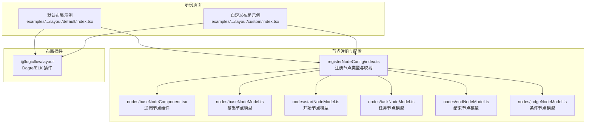
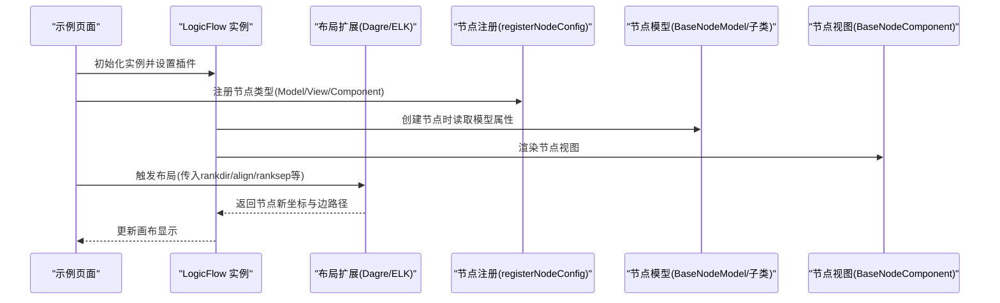
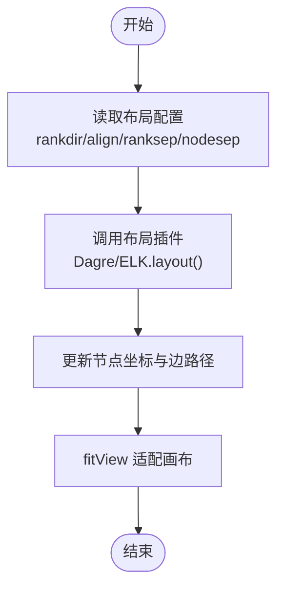
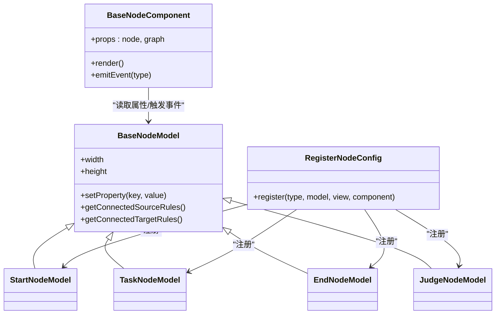
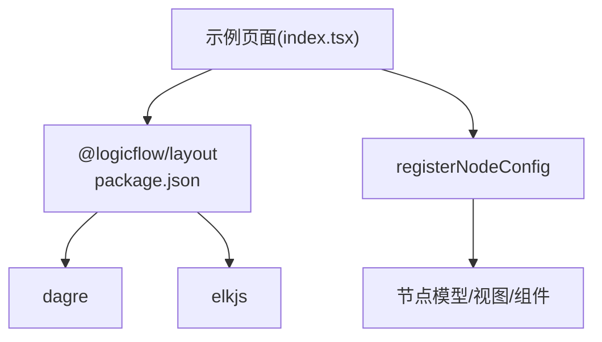

# 常用布局算法

<cite>
**本文引用的文件**
- [默认布局示例（index.tsx）](file://examples/feature-examples/src/pages/layout/default/index.tsx)
- [自定义布局示例（index.tsx）](file://examples/feature-examples/src/pages/layout/custom/index.tsx)
- [节点注册入口（registerNodeConfig/index.ts）](file://examples/feature-examples/src/pages/layout/custom/registerNodeConfig/index.ts)
- [基础节点组件（baseNodeComponent.tsx）](file://examples/feature-examples/src/pages/layout/custom/registerNodeConfig/nodes/baseNodeComponent.tsx)
- [基础节点模型（baseNodeModel.ts）](file://examples/feature-examples/src/pages/layout/custom/registerNodeConfig/nodes/baseNodeModel.ts)
- [开始节点模型（startNodeModel.ts）](file://examples/feature-examples/src/pages/layout/custom/registerNodeConfig/nodes/startNodeModel.ts)
- [任务节点模型（taskNodeModel.ts）](file://examples/feature-examples/src/pages/layout/custom/registerNodeConfig/nodes/taskNodeModel.ts)
- [结束节点模型（endNodeModel.ts）](file://examples/feature-examples/src/pages/layout/custom/registerNodeConfig/nodes/endNodeModel.ts)
- [条件节点模型（judgeNodeModel.ts）](file://examples/feature-examples/src/pages/layout/custom/registerNodeConfig/nodes/judgeNodeModel.ts)
- [布局包依赖（package.json）](file://packages/layout/package.json)
</cite>

## 目录
1. [简介](#简介)
2. [项目结构](#项目结构)
3. [核心组件](#核心组件)
4. [架构总览](#架构总览)
5. [详细组件分析](#详细组件分析)
6. [依赖分析](#依赖分析)
7. [性能考虑](#性能考虑)
8. [故障排查指南](#故障排查指南)
9. [结论](#结论)
10. [附录](#附录)

## 简介
本文件聚焦于 LogicFlow 在示例工程中的常用布局算法实践，系统讲解默认布局算法的工作原理与实现机制，剖析节点配置系统的架构（BaseNodeComponent、BaseNodeModel、BaseNodeView 的职责与协作），并结合 StartNode、TaskNode、EndNode、JudgeNode 等节点类型，说明其布局特点与适用场景。同时，文档覆盖节点模型的数据结构、状态管理与事件处理机制，节点视图的渲染逻辑与样式定制方法，并提供最佳实践、调试技巧与性能优化建议。

## 项目结构
该示例工程通过页面级示例演示两种布局策略：
- 默认布局示例：展示如何在现有节点数据基础上应用自动布局插件（Dagre/ELK）进行自动排版。
- 自定义布局示例：在默认布局基础上，进一步扩展节点类型与交互，演示更复杂的布局参数与事件处理。

图表来源
- [默认布局示例（index.tsx）](file://examples/feature-examples/src/pages/layout/default/index.tsx#L1-L977)
- [自定义布局示例（index.tsx）](file://examples/feature-examples/src/pages/layout/custom/index.tsx#L1-L598)
- [节点注册入口（registerNodeConfig/index.ts）](file://examples/feature-examples/src/pages/layout/custom/registerNodeConfig/index.ts#L1-L47)
- [布局包依赖（package.json）](file://packages/layout/package.json#L1-L50)

章节来源
- [默认布局示例（index.tsx）](file://examples/feature-examples/src/pages/layout/default/index.tsx#L1-L977)
- [自定义布局示例（index.tsx）](file://examples/feature-examples/src/pages/layout/custom/index.tsx#L1-L598)
- [节点注册入口（registerNodeConfig/index.ts）](file://examples/feature-examples/src/pages/layout/custom/registerNodeConfig/index.ts#L1-L47)
- [布局包依赖（package.json）](file://packages/layout/package.json#L1-L50)

## 核心组件
- 布局插件层
  - 使用 @logicflow/layout 提供的 Dagre 与 ELK 布局引擎，支持 rankdir（布局方向）、align（对齐方式）、ranksep（节点纵向间距）、nodesep（节点横向间距）等参数。
- 节点配置层
  - 通过 registerNodeConfig 将节点类型与对应的 Model/View/Component 绑定，形成统一的节点注册机制。
- 节点模型层
  - BaseNodeModel 定义通用属性与行为；各具体节点模型（Start/Task/End/Judge）在此基础上扩展尺寸、连线规则与业务属性。
- 节点视图层
  - BaseNodeComponent 负责渲染节点 UI、绑定交互事件与动态内容展示（如条件分支列表、任务内容等）。

章节来源
- [默认布局示例（index.tsx）](file://examples/feature-examples/src/pages/layout/default/index.tsx#L515-L527)
- [自定义布局示例（index.tsx）](file://examples/feature-examples/src/pages/layout/custom/index.tsx#L515-L541)
- [节点注册入口（registerNodeConfig/index.ts）](file://examples/feature-examples/src/pages/layout/custom/registerNodeConfig/index.ts#L9-L46)
- [基础节点组件（baseNodeComponent.tsx）](file://examples/feature-examples/src/pages/layout/custom/registerNodeConfig/nodes/baseNodeComponent.tsx#L1-L110)
- [基础节点模型（baseNodeModel.ts）](file://examples/feature-examples/src/pages/layout/custom/registerNodeConfig/nodes/baseNodeModel.ts#L1-L200)
- [开始节点模型（startNodeModel.ts）](file://examples/feature-examples/src/pages/layout/custom/registerNodeConfig/nodes/startNodeModel.ts#L1-L32)
- [任务节点模型（taskNodeModel.ts）](file://examples/feature-examples/src/pages/layout/custom/registerNodeConfig/nodes/taskNodeModel.ts#L1-L200)
- [结束节点模型（endNodeModel.ts）](file://examples/feature-examples/src/pages/layout/custom/registerNodeConfig/nodes/endNodeModel.ts#L1-L200)
- [条件节点模型（judgeNodeModel.ts）](file://examples/feature-examples/src/pages/layout/custom/registerNodeConfig/nodes/judgeNodeModel.ts#L1-L200)

## 架构总览
下图展示了从页面调用到布局执行再到节点渲染的整体流程：

图表来源
- [默认布局示例（index.tsx）](file://examples/feature-examples/src/pages/layout/default/index.tsx#L420-L527)
- [自定义布局示例（index.tsx）](file://examples/feature-examples/src/pages/layout/custom/index.tsx#L420-L541)
- [节点注册入口（registerNodeConfig/index.ts）](file://examples/feature-examples/src/pages/layout/custom/registerNodeConfig/index.ts#L9-L46)

## 详细组件分析

### 默认布局算法工作原理与实现机制
- 参数驱动
  - 支持 rankdir（LR/TB/BT/RL）、align（居中/UL/UR/DL/DR）、ranksep、nodesep、isDefaultAnchor 等参数。
- 执行流程
  - 页面通过按钮触发 applyLayout 或 applyElkLayout，调用 extension.dagre.layout 或 extension.elkLayout.layout，传入配置对象。
  - 布局完成后调用 fitView，确保画布适配可视区域。
- 数据输入输出
  - 输入为当前图数据（nodes/edges），输出为更新后的节点位置与边折线点集。

图表来源
- [默认布局示例（index.tsx）](file://examples/feature-examples/src/pages/layout/default/index.tsx#L515-L527)
- [自定义布局示例（index.tsx）](file://examples/feature-examples/src/pages/layout/custom/index.tsx#L515-L541)

章节来源
- [默认布局示例（index.tsx）](file://examples/feature-examples/src/pages/layout/default/index.tsx#L515-L527)
- [自定义布局示例（index.tsx）](file://examples/feature-examples/src/pages/layout/custom/index.tsx#L515-L541)

### 节点配置系统架构：职责分工与协作
- BaseNodeComponent
  - 职责：渲染节点 UI、绑定交互事件（复制、删除、复制 ID）、根据节点类型展示不同内容（分支列表、任务内容）。
  - 协作：通过 graph.eventCenter.emit 触发全局事件，由 LogicFlow 监听并执行相应操作。
- BaseNodeModel
  - 职责：定义节点通用属性（尺寸、锚点、连线规则等），提供 setProperty 等状态管理能力。
  - 协作：被具体节点模型继承，扩展特定业务规则与属性。
- BaseNodeView
  - 职责：负责节点的视觉呈现与交互反馈（样式、高亮、选中态等）。
  - 协作：与组件层配合，完成最终渲染。
- registerNodeConfig
  - 职责：集中注册节点类型，将 type 映射到对应的 model/view/component，形成统一的节点生态。

图表来源
- [基础节点组件（baseNodeComponent.tsx）](file://examples/feature-examples/src/pages/layout/custom/registerNodeConfig/nodes/baseNodeComponent.tsx#L1-L110)
- [基础节点模型（baseNodeModel.ts）](file://examples/feature-examples/src/pages/layout/custom/registerNodeConfig/nodes/baseNodeModel.ts#L1-L200)
- [开始节点模型（startNodeModel.ts）](file://examples/feature-examples/src/pages/layout/custom/registerNodeConfig/nodes/startNodeModel.ts#L1-L32)
- [任务节点模型（taskNodeModel.ts）](file://examples/feature-examples/src/pages/layout/custom/registerNodeConfig/nodes/taskNodeModel.ts#L1-L200)
- [结束节点模型（endNodeModel.ts）](file://examples/feature-examples/src/pages/layout/custom/registerNodeConfig/nodes/endNodeModel.ts#L1-L200)
- [条件节点模型（judgeNodeModel.ts）](file://examples/feature-examples/src/pages/layout/custom/registerNodeConfig/nodes/judgeNodeModel.ts#L1-L200)
- [节点注册入口（registerNodeConfig/index.ts）](file://examples/feature-examples/src/pages/layout/custom/registerNodeConfig/index.ts#L9-L46)

章节来源
- [基础节点组件（baseNodeComponent.tsx）](file://examples/feature-examples/src/pages/layout/custom/registerNodeConfig/nodes/baseNodeComponent.tsx#L1-L110)
- [基础节点模型（baseNodeModel.ts）](file://examples/feature-examples/src/pages/layout/custom/registerNodeConfig/nodes/baseNodeModel.ts#L1-L200)
- [节点注册入口（registerNodeConfig/index.ts）](file://examples/feature-examples/src/pages/layout/custom/registerNodeConfig/index.ts#L9-L46)

### 节点类型与布局特点
- StartNode
  - 特点：固定尺寸，作为流程起点，限制出边数量与禁止入边，避免环路或多重起点。
  - 布局影响：通常位于图的左侧或上方，便于后续节点按 rankdir 方向展开。
- TaskNode
  - 特点：固定尺寸，承载任务内容，适合在主干流程中串联多个步骤。
  - 布局影响：可作为 DAG 中的普通节点，受 ranksep/nodesep 控制间距。
- EndNode
  - 特点：固定尺寸，作为流程终点，禁止出边，仅允许入边。
  - 布局影响：通常位于图的右侧或下方，便于汇聚。
- JudgeNode
  - 特点：可变分支数量，每个分支对应一个锚点，适合条件分流。
  - 布局影响：分支较多时，建议增大 ranksep 以避免边交叉；可利用 align 对齐策略减少重叠。

章节来源
- [开始节点模型（startNodeModel.ts）](file://examples/feature-examples/src/pages/layout/custom/registerNodeConfig/nodes/startNodeModel.ts#L3-L31)
- [任务节点模型（taskNodeModel.ts）](file://examples/feature-examples/src/pages/layout/custom/registerNodeConfig/nodes/taskNodeModel.ts#L1-L200)
- [结束节点模型（endNodeModel.ts）](file://examples/feature-examples/src/pages/layout/custom/registerNodeConfig/nodes/endNodeModel.ts#L1-L200)
- [条件节点模型（judgeNodeModel.ts）](file://examples/feature-examples/src/pages/layout/custom/registerNodeConfig/nodes/judgeNodeModel.ts#L1-L200)

### 节点模型的数据结构、状态管理与事件处理
- 数据结构
  - properties.nodeName：节点名称
  - properties.nodeContent：任务节点内容
  - properties.branches：条件节点分支数组，包含 branchName、conditions、anchorId 等
- 状态管理
  - setProperty：统一的状态写入入口，保证视图与模型同步
  - BaseNodeModel 提供通用属性与规则扩展点
- 事件处理
  - BaseNodeComponent 通过 eventCenter.emit 触发 CopyNode/CopyId/DeleteNode 等事件
  - 示例页面监听事件并执行对应操作（克隆节点、复制 ID、删除节点）

章节来源
- [基础节点组件（baseNodeComponent.tsx）](file://examples/feature-examples/src/pages/layout/custom/registerNodeConfig/nodes/baseNodeComponent.tsx#L10-L24)
- [默认布局示例（index.tsx）](file://examples/feature-examples/src/pages/layout/default/index.tsx#L489-L508)
- [自定义布局示例（index.tsx）](file://examples/feature-examples/src/pages/layout/custom/index.tsx#L489-L508)

### 节点视图的渲染逻辑与样式定制
- 渲染逻辑
  - 根据节点类型渲染标题、分支列表、任务内容等
  - 通过 Popover 提供更多操作入口（复制、删除、复制 ID）
- 样式定制
  - 通过主题配置（setTheme）调整边样式（颜色、宽度）
  - 可结合 CSS 类名与 less 文件进行局部样式覆盖

章节来源
- [基础节点组件（baseNodeComponent.tsx）](file://examples/feature-examples/src/pages/layout/custom/registerNodeConfig/nodes/baseNodeComponent.tsx#L26-L107)
- [自定义布局示例（index.tsx）](file://examples/feature-examples/src/pages/layout/custom/index.tsx#L431-L436)

### 最佳实践
- 合理设置布局参数
  - 分支多的 JudgeNode 建议增大 ranksep，避免边交叉
  - 不同 rankdir 下优先保证主流程走向清晰
- 事件与状态解耦
  - 将 UI 交互（组件层）与业务状态（模型层）分离，通过统一的 setProperty 写入
- 可维护性
  - 将节点注册集中在 registerNodeConfig，便于扩展与复用
- 主题一致性
  - 使用 setTheme 集中管理边样式，保持整体风格一致

### 常见问题与解决方案
- 条件节点分支锚点不生效
  - 解决：克隆节点时需重新生成分支 anchorId，确保唯一性
- 连接规则冲突
  - 解决：StartNode/EndNode 严格限制入/出边数量，避免非法连接
- 边交叉严重
  - 解决：增大 ranksep/nodesep，或切换 rankdir/align

章节来源
- [自定义布局示例（index.tsx）](file://examples/feature-examples/src/pages/layout/custom/index.tsx#L489-L504)
- [开始节点模型（startNodeModel.ts）](file://examples/feature-examples/src/pages/layout/custom/registerNodeConfig/nodes/startNodeModel.ts#L8-L30)

## 依赖分析
- @logicflow/layout
  - 依赖 dagre 与 elkjs，提供 Dagre/ELK 布局能力
- 示例页面
  - 通过插件注册与布局调用，完成自动排版
- 节点生态
  - registerNodeConfig 将节点类型与模型/视图/组件绑定，形成可扩展的节点体系

图表来源
- [布局包依赖（package.json）](file://packages/layout/package.json#L41-L44)
- [默认布局示例（index.tsx）](file://examples/feature-examples/src/pages/layout/default/index.tsx#L429-L430)
- [自定义布局示例（index.tsx）](file://examples/feature-examples/src/pages/layout/custom/index.tsx#L429-L430)
- [节点注册入口（registerNodeConfig/index.ts）](file://examples/feature-examples/src/pages/layout/custom/registerNodeConfig/index.ts#L9-L46)

章节来源
- [布局包依赖（package.json）](file://packages/layout/package.json#L1-L50)
- [默认布局示例（index.tsx）](file://examples/feature-examples/src/pages/layout/default/index.tsx#L429-L430)
- [自定义布局示例（index.tsx）](file://examples/feature-examples/src/pages/layout/custom/index.tsx#L429-L430)
- [节点注册入口（registerNodeConfig/index.ts）](file://examples/feature-examples/src/pages/layout/custom/registerNodeConfig/index.ts#L9-L46)

## 性能考虑
- 大规模图布局
  - 适当增大 ranksep/nodesep，减少边重叠与重绘压力
  - 优先使用 fitView 缩放而非频繁重算布局
- 事件与状态
  - 避免在高频事件中直接修改大量节点状态，建议批量更新
- 样式与渲染
  - 使用 setTheme 统一边样式，减少重复计算
  - 控制分支数量，避免 JudgeNode 过度复杂导致布局计算开销上升

## 故障排查指南
- 布局无变化
  - 检查是否正确调用 extension.dagre.layout 或 extension.elkLayout.layout
  - 确认传入参数（rankdir/align/ranksep/nodesep）是否合理
- 节点无法连接
  - 查看 StartNode/EndNode 的连线规则，确认是否违反“仅出/仅入”限制
- 分支锚点异常
  - 克隆节点后需重新生成分支 anchorId，避免重复或冲突

章节来源
- [默认布局示例（index.tsx）](file://examples/feature-examples/src/pages/layout/default/index.tsx#L515-L527)
- [自定义布局示例（index.tsx）](file://examples/feature-examples/src/pages/layout/custom/index.tsx#L515-L541)
- [开始节点模型（startNodeModel.ts）](file://examples/feature-examples/src/pages/layout/custom/registerNodeConfig/nodes/startNodeModel.ts#L8-L30)
- [自定义布局示例（index.tsx）](file://examples/feature-examples/src/pages/layout/custom/index.tsx#L489-L504)

## 结论
本示例工程通过默认与自定义两种布局示例，完整展示了 LogicFlow 的自动布局能力与节点配置体系。基于 registerNodeConfig 的节点注册机制，结合 BaseNodeModel/BaseNodeView/BaseNodeComponent 的分层设计，既能满足快速布局需求，又具备良好的扩展性与可维护性。实践中应关注布局参数选择、事件与状态解耦以及样式统一，以获得稳定且高性能的可视化体验。

## 附录
- 快速定位
  - 默认布局示例：examples/feature-examples/src/pages/layout/default/index.tsx
  - 自定义布局示例：examples/feature-examples/src/pages/layout/custom/index.tsx
  - 节点注册入口：examples/feature-examples/src/pages/layout/custom/registerNodeConfig/index.ts
  - 节点组件与模型：examples/feature-examples/src/pages/layout/custom/registerNodeConfig/nodes/*