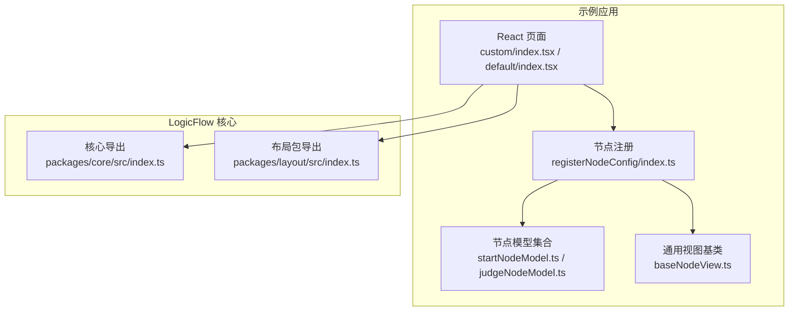
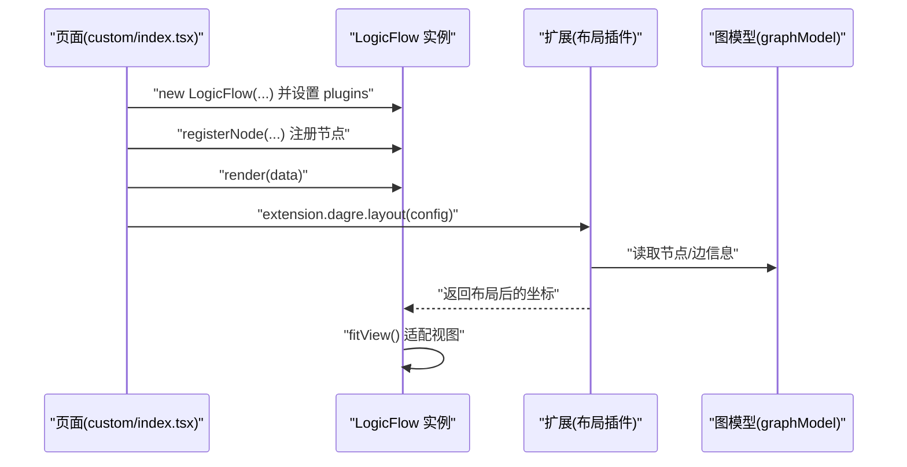
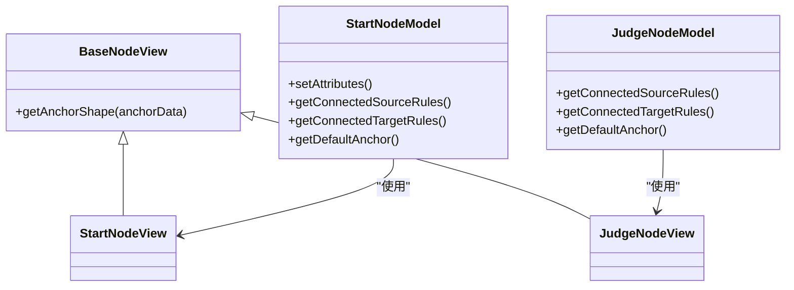
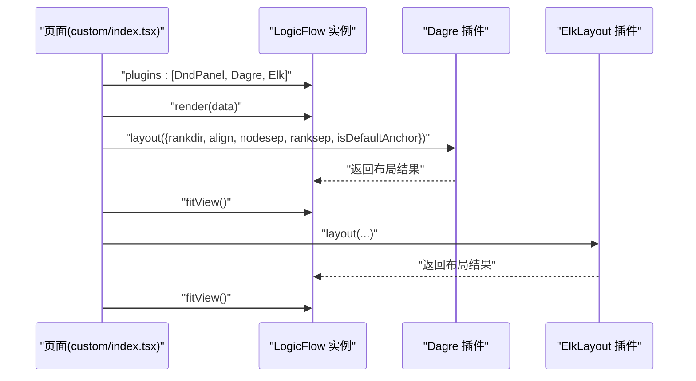
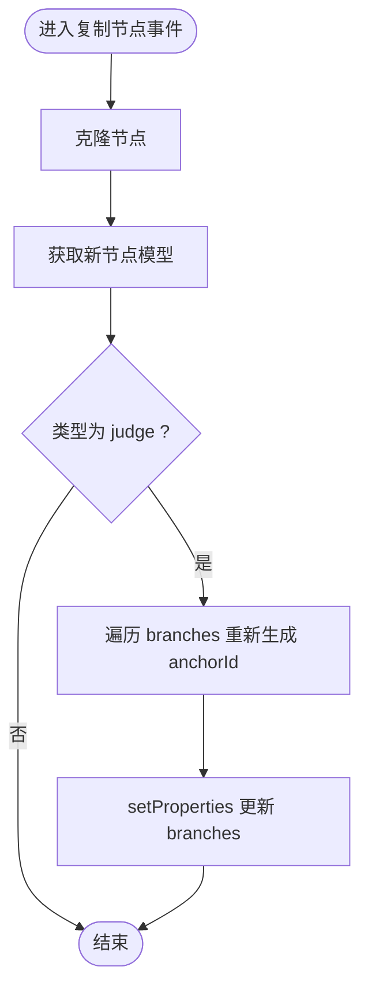
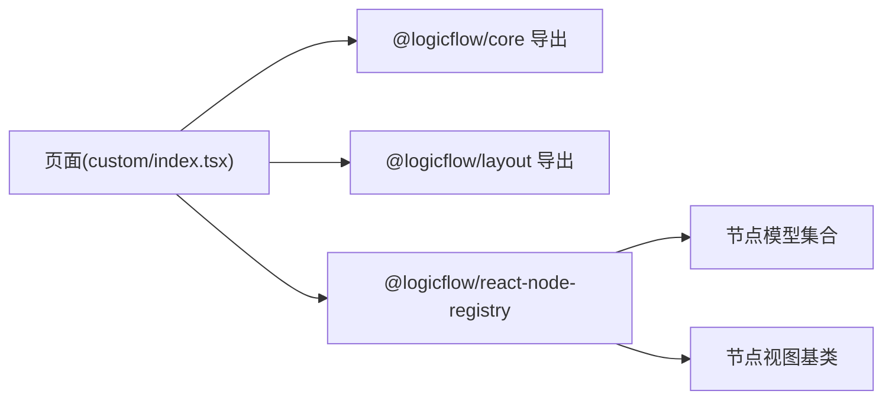

# 自定义布局开发

<cite>
**本文引用的文件**   
- [packages/layout/src/index.ts](file://packages/layout/src/index.ts)
- [examples/feature-examples/src/pages/layout/custom/index.tsx](file://examples/feature-examples/src/pages/layout/custom/index.tsx)
- [examples/feature-examples/src/pages/layout/default/index.tsx](file://examples/feature-examples/src/pages/layout/default/index.tsx)
- [examples/feature-examples/src/pages/layout/custom/registerNodeConfig/index.ts](file://examples/feature-examples/src/pages/layout/custom/registerNodeConfig/index.ts)
- [examples/feature-examples/src/pages/layout/custom/registerNodeConfig/nodes/baseNodeView.ts](file://examples/feature-examples/src/pages/layout/custom/registerNodeConfig/nodes/baseNodeView.ts)
- [examples/feature-examples/src/pages/layout/custom/registerNodeConfig/nodes/startNodeModel.ts](file://examples/feature-examples/src/pages/layout/custom/registerNodeConfig/nodes/startNodeModel.ts)
- [examples/feature-examples/src/pages/layout/custom/registerNodeConfig/nodes/judgeNodeModel.ts](file://examples/feature-examples/src/pages/layout/custom/registerNodeConfig/nodes/judgeNodeModel.ts)
- [packages/core/src/index.ts](file://packages/core/src/index.ts)
</cite>

## 目录
1. [简介](#简介)
2. [项目结构](#项目结构)
3. [核心组件](#核心组件)
4. [架构总览](#架构总览)
5. [组件详解](#组件详解)
6. [依赖关系分析](#依赖关系分析)
7. [性能考量](#性能考量)
8. [故障排查指南](#故障排查指南)
9. [结论](#结论)
10. [附录](#附录)

## 简介
本文件面向需要在 LogicFlow 中开发与集成自定义布局算法的工程师，系统讲解如何：
- 开发与注册自定义节点配置（组件、模型、视图）
- 遵循布局算法接口规范并实现可插拔布局
- 扩展节点数据模型与自定义属性
- 实现自定义视图渲染与样式定制
- 设计布局算法的测试与调试方法
- 评估与优化布局算法性能
- 提供完整开发案例与最佳实践

## 项目结构
本仓库采用多包结构，与布局相关的入口与示例主要位于 examples/feature-examples 下，核心库位于 packages/。与布局直接相关的关键位置如下：
- 布局导出入口：packages/layout/src/index.ts
- 自定义布局示例页面：examples/feature-examples/src/pages/layout/custom/index.tsx
- 默认布局示例页面：examples/feature-examples/src/pages/layout/default/index.tsx
- 自定义节点注册与模型/视图：examples/feature-examples/src/pages/layout/custom/registerNodeConfig/*

图表来源
- [examples/feature-examples/src/pages/layout/custom/index.tsx](file://examples/feature-examples/src/pages/layout/custom/index.tsx#L1-L598)
- [examples/feature-examples/src/pages/layout/default/index.tsx](file://examples/feature-examples/src/pages/layout/default/index.tsx#L1-L800)
- [examples/feature-examples/src/pages/layout/custom/registerNodeConfig/index.ts](file://examples/feature-examples/src/pages/layout/custom/registerNodeConfig/index.ts#L1-L47)
- [examples/feature-examples/src/pages/layout/custom/registerNodeConfig/nodes/baseNodeView.ts](file://examples/feature-examples/src/pages/layout/custom/registerNodeConfig/nodes/baseNodeView.ts#L1-L19)
- [examples/feature-examples/src/pages/layout/custom/registerNodeConfig/nodes/startNodeModel.ts](file://examples/feature-examples/src/pages/layout/custom/registerNodeConfig/nodes/startNodeModel.ts#L1-L42)
- [examples/feature-examples/src/pages/layout/custom/registerNodeConfig/nodes/judgeNodeModel.ts](file://examples/feature-examples/src/pages/layout/custom/registerNodeConfig/nodes/judgeNodeModel.ts#L1-L72)
- [packages/core/src/index.ts](file://packages/core/src/index.ts#L1-L27)
- [packages/layout/src/index.ts](file://packages/layout/src/index.ts#L1-L4)

章节来源
- [packages/layout/src/index.ts](file://packages/layout/src/index.ts#L1-L4)
- [examples/feature-examples/src/pages/layout/custom/index.tsx](file://examples/feature-examples/src/pages/layout/custom/index.tsx#L1-L598)
- [examples/feature-examples/src/pages/layout/default/index.tsx](file://examples/feature-examples/src/pages/layout/default/index.tsx#L1-L800)
- [examples/feature-examples/src/pages/layout/custom/registerNodeConfig/index.ts](file://examples/feature-examples/src/pages/layout/custom/registerNodeConfig/index.ts#L1-L47)
- [examples/feature-examples/src/pages/layout/custom/registerNodeConfig/nodes/baseNodeView.ts](file://examples/feature-examples/src/pages/layout/custom/registerNodeConfig/nodes/baseNodeView.ts#L1-L19)
- [examples/feature-examples/src/pages/layout/custom/registerNodeConfig/nodes/startNodeModel.ts](file://examples/feature-examples/src/pages/layout/custom/registerNodeConfig/nodes/startNodeModel.ts#L1-L42)
- [examples/feature-examples/src/pages/layout/custom/registerNodeConfig/nodes/judgeNodeModel.ts](file://examples/feature-examples/src/pages/layout/custom/registerNodeConfig/nodes/judgeNodeModel.ts#L1-L72)
- [packages/core/src/index.ts](file://packages/core/src/index.ts#L1-L27)

## 核心组件
- 布局算法导出：packages/layout/src/index.ts 暴露 dagre 与 elkLayout 的导出，便于在示例中按需引入与使用。
- 示例页面：custom/index.tsx 与 default/index.tsx 展示了如何初始化 LogicFlow、注册节点、启用布局插件，并通过按钮触发布局计算与适配视图。
- 节点注册：registerNodeConfig/index.ts 使用 @logicflow/react-node-registry 的 register 方法，将节点类型与对应的 model/view/component 绑定到实例。
- 节点模型：startNodeModel.ts 与 judgeNodeModel.ts 定义节点尺寸、锚点、连线规则等行为；这些是布局算法计算锚点与边路径的重要输入。
- 节点视图：baseNodeView.ts 提供锚点形状渲染，是视图层与布局交互的桥梁之一。

章节来源
- [packages/layout/src/index.ts](file://packages/layout/src/index.ts#L1-L4)
- [examples/feature-examples/src/pages/layout/custom/index.tsx](file://examples/feature-examples/src/pages/layout/custom/index.tsx#L1-L598)
- [examples/feature-examples/src/pages/layout/default/index.tsx](file://examples/feature-examples/src/pages/layout/default/index.tsx#L1-L800)
- [examples/feature-examples/src/pages/layout/custom/registerNodeConfig/index.ts](file://examples/feature-examples/src/pages/layout/custom/registerNodeConfig/index.ts#L1-L47)
- [examples/feature-examples/src/pages/layout/custom/registerNodeConfig/nodes/baseNodeView.ts](file://examples/feature-examples/src/pages/layout/custom/registerNodeConfig/nodes/baseNodeView.ts#L1-L19)
- [examples/feature-examples/src/pages/layout/custom/registerNodeConfig/nodes/startNodeModel.ts](file://examples/feature-examples/src/pages/layout/custom/registerNodeConfig/nodes/startNodeModel.ts#L1-L42)
- [examples/feature-examples/src/pages/layout/custom/registerNodeConfig/nodes/judgeNodeModel.ts](file://examples/feature-examples/src/pages/layout/custom/registerNodeConfig/nodes/judgeNodeModel.ts#L1-L72)

## 架构总览
下图展示了自定义布局在示例中的调用链路：页面初始化 LogicFlow 并注册节点；随后通过 extension.dagre 或 extension.elkLayout 调用布局算法；布局完成后适配视图并刷新。

图表来源
- [examples/feature-examples/src/pages/layout/custom/index.tsx](file://examples/feature-examples/src/pages/layout/custom/index.tsx#L411-L598)
- [examples/feature-examples/src/pages/layout/custom/registerNodeConfig/index.ts](file://examples/feature-examples/src/pages/layout/custom/registerNodeConfig/index.ts#L1-L47)

章节来源
- [examples/feature-examples/src/pages/layout/custom/index.tsx](file://examples/feature-examples/src/pages/layout/custom/index.tsx#L411-L598)

## 组件详解

### 自定义节点配置开发流程
- 节点组件（Component）：用于在视图层渲染节点内容，通常由 registerNodeConfig/index.ts 通过 register 绑定到类型。
- 节点模型（Model）：定义节点的几何尺寸、锚点、连线规则、默认属性等，是布局算法的输入基础。
- 节点视图（View）：负责锚点与图形的绘制，影响布局时的几何测量与连接点定位。

图表来源
- [examples/feature-examples/src/pages/layout/custom/registerNodeConfig/nodes/baseNodeView.ts](file://examples/feature-examples/src/pages/layout/custom/registerNodeConfig/nodes/baseNodeView.ts#L1-L19)
- [examples/feature-examples/src/pages/layout/custom/registerNodeConfig/nodes/startNodeModel.ts](file://examples/feature-examples/src/pages/layout/custom/registerNodeConfig/nodes/startNodeModel.ts#L1-L42)
- [examples/feature-examples/src/pages/layout/custom/registerNodeConfig/nodes/judgeNodeModel.ts](file://examples/feature-examples/src/pages/layout/custom/registerNodeConfig/nodes/judgeNodeModel.ts#L1-L72)

章节来源
- [examples/feature-examples/src/pages/layout/custom/registerNodeConfig/index.ts](file://examples/feature-examples/src/pages/layout/custom/registerNodeConfig/index.ts#L1-L47)
- [examples/feature-examples/src/pages/layout/custom/registerNodeConfig/nodes/baseNodeView.ts](file://examples/feature-examples/src/pages/layout/custom/registerNodeConfig/nodes/baseNodeView.ts#L1-L19)
- [examples/feature-examples/src/pages/layout/custom/registerNodeConfig/nodes/startNodeModel.ts](file://examples/feature-examples/src/pages/layout/custom/registerNodeConfig/nodes/startNodeModel.ts#L1-L42)
- [examples/feature-examples/src/pages/layout/custom/registerNodeConfig/nodes/judgeNodeModel.ts](file://examples/feature-examples/src/pages/layout/custom/registerNodeConfig/nodes/judgeNodeModel.ts#L1-L72)

### 自定义布局算法接口规范与实现要求
- 插件注册：在初始化 LogicFlow 时将布局插件加入 plugins 列表，示例中同时启用了 DndPanel、Dagre、ElkLayout。
- 布局调用：通过 lf.extension.dagre 或 lf.extension.elkLayout 调用 layout(config) 接口，传入 rankdir、align、nodesep、ranksep 等参数。
- 结果应用：布局完成后调用 fitView() 以适配画布显示。

图表来源
- [examples/feature-examples/src/pages/layout/custom/index.tsx](file://examples/feature-examples/src/pages/layout/custom/index.tsx#L411-L598)

章节来源
- [examples/feature-examples/src/pages/layout/custom/index.tsx](file://examples/feature-examples/src/pages/layout/custom/index.tsx#L411-L598)

### 节点数据模型扩展与自定义属性
- 在节点模型中通过 setAttributes 或 properties 字段扩展节点尺寸、文本、分支列表等自定义属性。
- 示例中 judge 节点的 properties.branches 会动态生成锚点 id，确保布局时锚点唯一且可追踪。
- 通过 cloneNode 与 setProperties 可在复制节点时重写分支锚点 id，保证布局一致性。

图表来源
- [examples/feature-examples/src/pages/layout/custom/index.tsx](file://examples/feature-examples/src/pages/layout/custom/index.tsx#L489-L504)

章节来源
- [examples/feature-examples/src/pages/layout/custom/index.tsx](file://examples/feature-examples/src/pages/layout/custom/index.tsx#L489-L504)
- [examples/feature-examples/src/pages/layout/custom/registerNodeConfig/nodes/judgeNodeModel.ts](file://examples/feature-examples/src/pages/layout/custom/registerNodeConfig/nodes/judgeNodeModel.ts#L47-L70)

### 自定义视图渲染与样式定制
- 锚点形状：BaseNodeView.getAnchorShape 可自定义锚点圆形样式与变换，影响布局时的连接点定位。
- 主题与样式：示例中通过 setTheme 设置边样式；也可通过 CSS 类名控制节点与锚点外观。

章节来源
- [examples/feature-examples/src/pages/layout/custom/registerNodeConfig/nodes/baseNodeView.ts](file://examples/feature-examples/src/pages/layout/custom/registerNodeConfig/nodes/baseNodeView.ts#L1-L19)
- [examples/feature-examples/src/pages/layout/custom/index.tsx](file://examples/feature-examples/src/pages/layout/custom/index.tsx#L431-L436)

### 布局算法测试与调试技巧
- 数据导出：getData 按钮通过 getGraphRawData 输出当前图数据，便于验证布局前后节点坐标变化。
- 事件监听：connection:not-allowed 可捕获并提示连接不被允许的原因；CopyId/CopyNode/DeleteNode 等事件可用于调试与复现问题。
- 参数可视化：通过下拉框切换 rankdir 与 align，观察布局方向与对齐效果。

章节来源
- [examples/feature-examples/src/pages/layout/custom/index.tsx](file://examples/feature-examples/src/pages/layout/custom/index.tsx#L474-L509)
- [examples/feature-examples/src/pages/layout/custom/index.tsx](file://examples/feature-examples/src/pages/layout/custom/index.tsx#L543-L553)

## 依赖关系分析
- 页面依赖 LogicFlow 核心与扩展包，示例中同时引入 @logicflow/layout 的导出以使用 Dagre 与 ElkLayout。
- 节点注册依赖 @logicflow/react-node-registry，将类型与 model/view/component 绑定。
- 核心导出统一了工具、常量、事件与视图/模型接口，为布局与节点开发提供一致的 API。

图表来源
- [examples/feature-examples/src/pages/layout/custom/index.tsx](file://examples/feature-examples/src/pages/layout/custom/index.tsx#L1-L11)
- [examples/feature-examples/src/pages/layout/custom/registerNodeConfig/index.ts](file://examples/feature-examples/src/pages/layout/custom/registerNodeConfig/index.ts#L1-L7)
- [packages/core/src/index.ts](file://packages/core/src/index.ts#L1-L27)
- [packages/layout/src/index.ts](file://packages/layout/src/index.ts#L1-L4)

章节来源
- [examples/feature-examples/src/pages/layout/custom/index.tsx](file://examples/feature-examples/src/pages/layout/custom/index.tsx#L1-L11)
- [examples/feature-examples/src/pages/layout/custom/registerNodeConfig/index.ts](file://examples/feature-examples/src/pages/layout/custom/registerNodeConfig/index.ts#L1-L7)
- [packages/core/src/index.ts](file://packages/core/src/index.ts#L1-L27)
- [packages/layout/src/index.ts](file://packages/layout/src/index.ts#L1-L4)

## 性能考量
- 布局参数调优：合理设置 nodesep 与 ranksep，避免节点过于拥挤导致边路径复杂度上升。
- 选择合适布局：Dagre 适合层级布局，Elk 支持更多算法族与约束，按场景选择可减少迭代次数。
- 大规模图优化：分批渲染、延迟布局、禁用动画、合并多次布局调用为一次等策略可降低抖动与卡顿。
- 渲染优化：锚点与边路径尽量保持简洁，避免过多折点与曲线，减少 DOM/Canvas 重绘。

## 故障排查指南
- 连接不被允许：监听 connection:not-allowed 事件，输出错误信息辅助定位连线规则问题。
- 复制节点异常：确认复制后是否更新了 judge 节点的分支锚点 id，避免重复或冲突。
- 布局后节点溢出：调用 fitView() 适配视图；若仍溢出，检查节点尺寸与布局参数。
- 样式不生效：核对主题设置与 CSS 类名，确保视图层锚点与节点样式正确挂载。

章节来源
- [examples/feature-examples/src/pages/layout/custom/index.tsx](file://examples/feature-examples/src/pages/layout/custom/index.tsx#L474-L509)
- [examples/feature-examples/src/pages/layout/custom/index.tsx](file://examples/feature-examples/src/pages/layout/custom/index.tsx#L516-L541)

## 结论
通过本指南，您可以在 LogicFlow 中完成自定义节点配置与布局算法的开发与集成。建议遵循“模型定义行为、视图负责渲染、页面统一调度”的分层设计，结合示例中的参数化布局与事件驱动调试机制，快速构建稳定高效的流程图布局体验。

## 附录
- 快速清单
  - 定义节点模型：尺寸、锚点、连线规则、默认属性
  - 定义节点视图：锚点与图形渲染
  - 注册节点：通过 register 将类型绑定到实例
  - 初始化布局插件：在 plugins 中启用 Dagre/Elk
  - 触发布局：调用 extension.*.layout(config)，随后 fitView()
  - 测试与调试：导出数据、监听事件、参数可视化