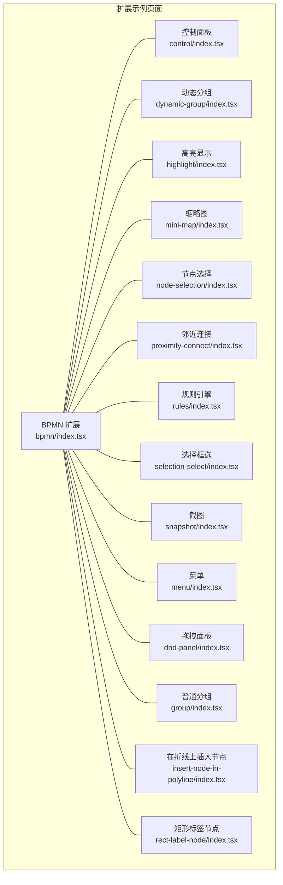
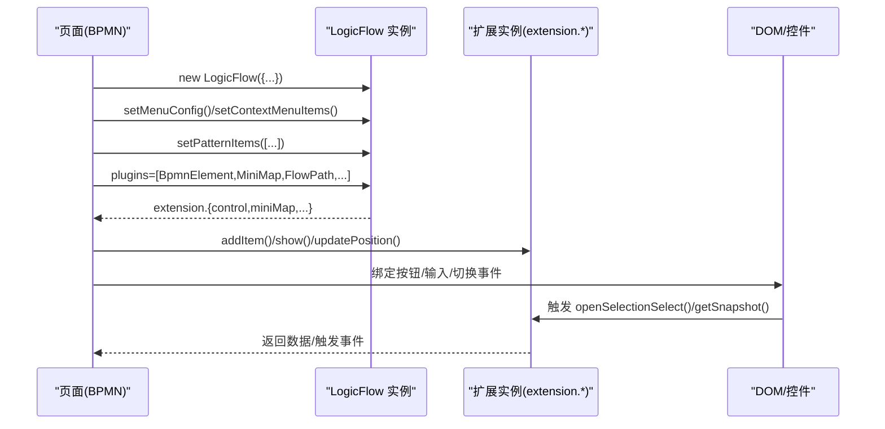
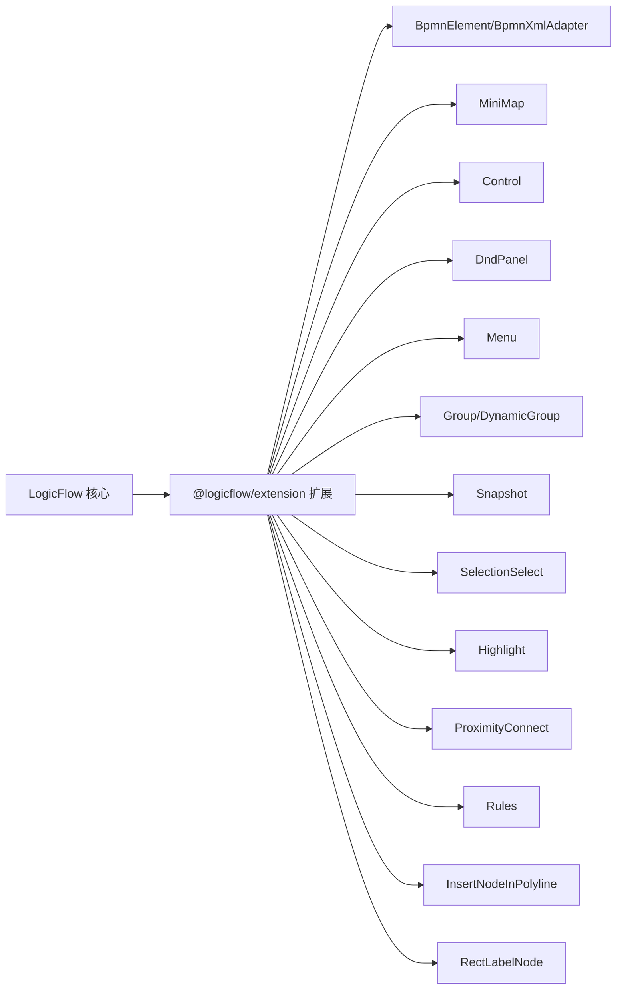

# 内置扩展功能

<cite>
**本文引用的文件**
- [examples/feature-examples/src/pages/extensions/bpmn/index.tsx](file://examples/feature-examples/src/pages/extensions/bpmn/index.tsx)
- [examples/feature-examples/src/pages/extensions/control/index.tsx](file://examples/feature-examples/src/pages/extensions/control/index.tsx)
- [examples/feature-examples/src/pages/extensions/dynamic-group/index.tsx](file://examples/feature-examples/src/pages/extensions/dynamic-group/index.tsx)
- [examples/feature-examples/src/pages/extensions/highlight/index.tsx](file://examples/feature-examples/src/pages/extensions/highlight/index.tsx)
- [examples/feature-examples/src/pages/extensions/mini-map/index.tsx](file://examples/feature-examples/src/pages/extensions/mini-map/index.tsx)
- [examples/feature-examples/src/pages/extensions/node-selection/index.tsx](file://examples/feature-examples/src/pages/extensions/node-selection/index.tsx)
- [examples/feature-examples/src/pages/extensions/proximity-connect/index.tsx](file://examples/feature-examples/src/pages/extensions/proximity-connect/index.tsx)
- [examples/feature-examples/src/pages/extensions/rules/index.tsx](file://examples/feature-examples/src/pages/extensions/rules/index.tsx)
- [examples/feature-examples/src/pages/extensions/selection-select/index.tsx](file://examples/feature-examples/src/pages/extensions/selection-select/index.tsx)
- [examples/feature-examples/src/pages/extensions/snapshot/index.tsx](file://examples/feature-examples/src/pages/extensions/snapshot/index.tsx)
- [examples/feature-examples/src/pages/extensions/menu/index.tsx](file://examples/feature-examples/src/pages/extensions/menu/index.tsx)
- [examples/feature-examples/src/pages/extensions/dnd-panel/index.tsx](file://examples/feature-examples/src/pages/extensions/dnd-panel/index.tsx)
- [examples/feature-examples/src/pages/extensions/group/index.tsx](file://examples/feature-examples/src/pages/extensions/group/index.tsx)
- [examples/feature-examples/src/pages/extensions/insert-node-in-polyline/index.tsx](file://examples/feature-examples/src/pages/extensions/insert-node-in-polyline/index.tsx)
- [examples/feature-examples/src/pages/extensions/rect-label-node/index.tsx](file://examples/feature-examples/src/pages/extensions/rect-label-node/index.tsx)
</cite>

## 目录
1. [简介](#简介)
2. [项目结构](#项目结构)
3. [核心组件](#核心组件)
4. [架构总览](#架构总览)
5. [详细组件分析](#详细组件分析)
6. [依赖分析](#依赖分析)
7. [性能考虑](#性能考虑)
8. [故障排查指南](#故障排查指南)
9. [结论](#结论)
10. [附录](#附录)

## 简介
本文件系统化梳理 LogicFlow 仓库中的“内置扩展功能”，围绕以下扩展进行深入解析：BPMN 扩展、控制面板、动态分组、高亮显示、缩略图、节点选择、邻近连接、规则引擎、选择框选、截图、菜单、拖拽面板、普通分组、在折线上插入节点、矩形标签节点等。内容涵盖：
- 每个扩展的职责、配置参数、使用方法与典型场景
- 代码级调用与事件流示意
- 扩展间的协作关系与组合使用建议
- 视觉效果与交互行为说明

## 项目结构
这些扩展示例集中位于 examples/feature-examples/src/pages/extensions/* 下，每个扩展一个独立页面，便于单独演示与调试。

**图表来源**
- [examples/feature-examples/src/pages/extensions/bpmn/index.tsx](file://examples/feature-examples/src/pages/extensions/bpmn/index.tsx#L30-L60)
- [examples/feature-examples/src/pages/extensions/control/index.tsx](file://examples/feature-examples/src/pages/extensions/control/index.tsx#L11-L42)
- [examples/feature-examples/src/pages/extensions/dynamic-group/index.tsx](file://examples/feature-examples/src/pages/extensions/dynamic-group/index.tsx#L19-L35)
- [examples/feature-examples/src/pages/extensions/highlight/index.tsx](file://examples/feature-examples/src/pages/extensions/highlight/index.tsx#L12-L23)
- [examples/feature-examples/src/pages/extensions/mini-map/index.tsx](file://examples/feature-examples/src/pages/extensions/mini-map/index.tsx#L11-L26)
- [examples/feature-examples/src/pages/extensions/node-selection/index.tsx](file://examples/feature-examples/src/pages/extensions/node-selection/index.tsx#L11-L45)
- [examples/feature-examples/src/pages/extensions/proximity-connect/index.tsx](file://examples/feature-examples/src/pages/extensions/proximity-connect/index.tsx#L23-L54)
- [examples/feature-examples/src/pages/extensions/rules/index.tsx](file://examples/feature-examples/src/pages/extensions/rules/index.tsx#L14-L19)
- [examples/feature-examples/src/pages/extensions/selection-select/index.tsx](file://examples/feature-examples/src/pages/extensions/selection-select/index.tsx#L11-L46)
- [examples/feature-examples/src/pages/extensions/snapshot/index.tsx](file://examples/feature-examples/src/pages/extensions/snapshot/index.tsx#L29-L61)
- [examples/feature-examples/src/pages/extensions/menu/index.tsx](file://examples/feature-examples/src/pages/extensions/menu/index.tsx#L14-L45)
- [examples/feature-examples/src/pages/extensions/dnd-panel/index.tsx](file://examples/feature-examples/src/pages/extensions/dnd-panel/index.tsx#L14-L45)
- [examples/feature-examples/src/pages/extensions/group/index.tsx](file://examples/feature-examples/src/pages/extensions/group/index.tsx#L19-L28)
- [examples/feature-examples/src/pages/extensions/insert-node-in-polyline/index.tsx](file://examples/feature-examples/src/pages/extensions/insert-node-in-polyline/index.tsx#L13-L18)
- [examples/feature-examples/src/pages/extensions/rect-label-node/index.tsx](file://examples/feature-examples/src/pages/extensions/rect-label-node/index.tsx#L9-L25)

**章节来源**
- [examples/feature-examples/src/pages/extensions/bpmn/index.tsx](file://examples/feature-examples/src/pages/extensions/bpmn/index.tsx#L30-L60)
- [examples/feature-examples/src/pages/extensions/control/index.tsx](file://examples/feature-examples/src/pages/extensions/control/index.tsx#L11-L42)
- [examples/feature-examples/src/pages/extensions/dynamic-group/index.tsx](file://examples/feature-examples/src/pages/extensions/dynamic-group/index.tsx#L19-L35)
- [examples/feature-examples/src/pages/extensions/highlight/index.tsx](file://examples/feature-examples/src/pages/extensions/highlight/index.tsx#L12-L23)
- [examples/feature-examples/src/pages/extensions/mini-map/index.tsx](file://examples/feature-examples/src/pages/extensions/mini-map/index.tsx#L11-L26)
- [examples/feature-examples/src/pages/extensions/node-selection/index.tsx](file://examples/feature-examples/src/pages/extensions/node-selection/index.tsx#L11-L45)
- [examples/feature-examples/src/pages/extensions/proximity-connect/index.tsx](file://examples/feature-examples/src/pages/extensions/proximity-connect/index.tsx#L23-L54)
- [examples/feature-examples/src/pages/extensions/rules/index.tsx](file://examples/feature-examples/src/pages/extensions/rules/index.tsx#L14-L19)
- [examples/feature-examples/src/pages/extensions/selection-select/index.tsx](file://examples/feature-examples/src/pages/extensions/selection-select/index.tsx#L11-L46)
- [examples/feature-examples/src/pages/extensions/snapshot/index.tsx](file://examples/feature-examples/src/pages/extensions/snapshot/index.tsx#L29-L61)
- [examples/feature-examples/src/pages/extensions/menu/index.tsx](file://examples/feature-examples/src/pages/extensions/menu/index.tsx#L14-L45)
- [examples/feature-examples/src/pages/extensions/dnd-panel/index.tsx](file://examples/feature-examples/src/pages/extensions/dnd-panel/index.tsx#L14-L45)
- [examples/feature-examples/src/pages/extensions/group/index.tsx](file://examples/feature-examples/src/pages/extensions/group/index.tsx#L19-L28)
- [examples/feature-examples/src/pages/extensions/insert-node-in-polyline/index.tsx](file://examples/feature-examples/src/pages/extensions/insert-node-in-polyline/index.tsx#L13-L18)
- [examples/feature-examples/src/pages/extensions/rect-label-node/index.tsx](file://examples/feature-examples/src/pages/extensions/rect-label-node/index.tsx#L9-L25)

## 核心组件
- LogicFlow 核心：负责画布初始化、渲染、事件与扩展实例访问
- @logicflow/extension 扩展集合：提供上述各内置扩展能力
- 页面级示例：每个扩展一个独立页面，演示配置、事件与交互

**章节来源**
- [examples/feature-examples/src/pages/extensions/bpmn/index.tsx](file://examples/feature-examples/src/pages/extensions/bpmn/index.tsx#L1-L28)
- [examples/feature-examples/src/pages/extensions/control/index.tsx](file://examples/feature-examples/src/pages/extensions/control/index.tsx#L1-L10)
- [examples/feature-examples/src/pages/extensions/mini-map/index.tsx](file://examples/feature-examples/src/pages/extensions/mini-map/index.tsx#L1-L9)

## 架构总览
下面以 BPMN 扩展为例，展示扩展在初始化时如何注册与协同工作：

**图表来源**
- [examples/feature-examples/src/pages/extensions/bpmn/index.tsx](file://examples/feature-examples/src/pages/extensions/bpmn/index.tsx#L30-L60)
- [examples/feature-examples/src/pages/extensions/bpmn/index.tsx](file://examples/feature-examples/src/pages/extensions/bpmn/index.tsx#L158-L231)
- [examples/feature-examples/src/pages/extensions/bpmn/index.tsx](file://examples/feature-examples/src/pages/extensions/bpmn/index.tsx#L183-L206)

## 详细组件分析

### BPMN 扩展
- 职责：提供 BPMN 节点类型、XML 导入导出、路径计算、自动布局、上下文菜单、控制栏集成、小地图联动等
- 关键配置
  - plugins：启用 BpmnElement、MiniMap、FlowPath、AutoLayout、DndPanel、Menu、ContextMenu、Group、Control、BpmnXmlAdapter、Snapshot、SelectionSelect
  - grid/snapline/keyboard 等基础画布配置
- 使用方法
  - 渲染 XML：render(xml)
  - 导出 XML：getGraphData() -> lfJson2Xml()
  - 计算路径：getPathes() / setRawPathes()
  - 自动布局：layout('bpmn:startEvent')
  - 控制栏按钮：addItem(...) 集成 miniMap 展示
- 典型场景
  - 与 BPMN 官方工具链互通（导出 XML 可在 demo.bpmn.io 使用）
  - 与小地图联动，实现导航定位
- 交互行为
  - 右键菜单按节点类型差异化显示
  - 支持框选、历史回退、截图导出

**章节来源**
- [examples/feature-examples/src/pages/extensions/bpmn/index.tsx](file://examples/feature-examples/src/pages/extensions/bpmn/index.tsx#L30-L60)
- [examples/feature-examples/src/pages/extensions/bpmn/index.tsx](file://examples/feature-examples/src/pages/extensions/bpmn/index.tsx#L131-L143)
- [examples/feature-examples/src/pages/extensions/bpmn/index.tsx](file://examples/feature-examples/src/pages/extensions/bpmn/index.tsx#L158-L231)
- [examples/feature-examples/src/pages/extensions/bpmn/index.tsx](file://examples/feature-examples/src/pages/extensions/bpmn/index.tsx#L233-L288)

### 控制面板（Control）
- 职责：提供常用画布操作按钮（缩放、平移、重置、清空历史等），可自定义按钮项
- 关键配置
  - plugins: [Control]
  - style：统一节点样式
- 使用方法
  - extension.control.addItem(...) 注册自定义按钮
  - 通过按钮回调执行 lf.history.undos = []
- 典型场景
  - 快速重置视图、清空历史记录
- 交互行为
  - 点击按钮触发对应逻辑，更新视图或状态

**章节来源**
- [examples/feature-examples/src/pages/extensions/control/index.tsx](file://examples/feature-examples/src/pages/extensions/control/index.tsx#L11-L42)
- [examples/feature-examples/src/pages/extensions/control/index.tsx](file://examples/feature-examples/src/pages/extensions/control/index.tsx#L98-L116)
- [examples/feature-examples/src/pages/extensions/control/index.tsx](file://examples/feature-examples/src/pages/extensions/control/index.tsx#L118-L133)

### 动态分组（DynamicGroup）
- 职责：支持运行时动态创建、折叠/展开、增删子节点、父子联动移动
- 关键配置
  - plugins: [DynamicGroup, Control, DndPanel, SelectionSelect]
  - properties：collapsible、width、height、radius、isCollapsed、children、transformWithContainer、isRestrict
- 使用方法
  - extension.control.addItem 注册“右移分组”“addChild”
  - addChild(id)、moveNode(id,dx,dy)
  - 监听 node:properties-change、dynamicGroup:collapse
- 典型场景
  - 流程图中临时聚合节点、可折叠容器
- 交互行为
  - 选中分组后可整体移动
  - 折叠/展开时触发事件并提示

**章节来源**
- [examples/feature-examples/src/pages/extensions/dynamic-group/index.tsx](file://examples/feature-examples/src/pages/extensions/dynamic-group/index.tsx#L19-L35)
- [examples/feature-examples/src/pages/extensions/dynamic-group/index.tsx](file://examples/feature-examples/src/pages/extensions/dynamic-group/index.tsx#L102-L140)
- [examples/feature-examples/src/pages/extensions/dynamic-group/index.tsx](file://examples/feature-examples/src/pages/extensions/dynamic-group/index.tsx#L294-L300)

### 高亮显示（Highlight）
- 职责：鼠标悬停高亮相关节点/边（单元素、邻居、全路径）
- 关键配置
  - plugins: [Highlight]
  - pluginsOptions.highlight.mode：path/single/neighbour
- 使用方法
  - extension.highlight.setMode(mode)
  - 监听 highlight:single / highlight:neighbours / highlight:path
- 典型场景
  - 流向追踪、关系可视化
- 交互行为
  - 悬停节点/边时即时高亮关联元素

**章节来源**
- [examples/feature-examples/src/pages/extensions/highlight/index.tsx](file://examples/feature-examples/src/pages/extensions/highlight/index.tsx#L12-L23)
- [examples/feature-examples/src/pages/extensions/highlight/index.tsx](file://examples/feature-examples/src/pages/extensions/highlight/index.tsx#L25-L57)

### 缩略图（MiniMap）
- 职责：提供主画布的小地图视图，支持显示/隐藏、位置更新、重置、边的显示开关
- 关键配置
  - plugins: [Control]（或直接 use(MiniMap)）
  - pluginsOptions.miniMap：header、尺寸、位置、是否显示边
- 使用方法
  - extension.miniMap.show()/hide()/reset()/updatePosition()/setShowEdge()
- 典型场景
  - 大图导航、快速定位
- 交互行为
  - 小地图与主画布联动，支持拖动定位

**章节来源**
- [examples/feature-examples/src/pages/extensions/mini-map/index.tsx](file://examples/feature-examples/src/pages/extensions/mini-map/index.tsx#L11-L26)
- [examples/feature-examples/src/pages/extensions/mini-map/index.tsx](file://examples/feature-examples/src/pages/extensions/mini-map/index.tsx#L74-L107)
- [examples/feature-examples/src/pages/extensions/mini-map/index.tsx](file://examples/feature-examples/src/pages/extensions/mini-map/index.tsx#L109-L141)

### 节点选择（NodeSelection）
- 职责：以专用节点承载一组被选中节点的集合，便于批量管理
- 关键配置
  - plugins: [NodeSelection]
  - properties：node_selection_ids、labelText、strokeColor、disabledDelete
- 使用方法
  - 创建 type=node-selection 的节点，设置 properties
  - 获取图数据时包含该节点
- 典型场景
  - 将一组节点抽象为“方案”或“分组”
- 交互行为
  - 与 Shift 多选配合，生成选择节点

**章节来源**
- [examples/feature-examples/src/pages/extensions/node-selection/index.tsx](file://examples/feature-examples/src/pages/extensions/node-selection/index.tsx#L11-L45)
- [examples/feature-examples/src/pages/extensions/node-selection/index.tsx](file://examples/feature-examples/src/pages/extensions/node-selection/index.tsx#L99-L116)

### 邻近连接（ProximityConnect）
- 职责：拖拽节点/锚点靠近时自动连接，支持阈值、方向、模式与虚拟边样式
- 关键配置
  - plugins: [ProximityConnect]
  - pluginsOptions.proximityConnect：enable、distance、reverseDirection、type
- 使用方法
  - extension.proximityConnect.setThresholdDistance()/setReverseDirection()/setEnable()/type/ setVirtualEdgeStyle()
- 典型场景
  - 快速连线、降低连线门槛
- 交互行为
  - 靠近阈值时显示虚拟边，释放后建立真实连接

**章节来源**
- [examples/feature-examples/src/pages/extensions/proximity-connect/index.tsx](file://examples/feature-examples/src/pages/extensions/proximity-connect/index.tsx#L23-L54)
- [examples/feature-examples/src/pages/extensions/proximity-connect/index.tsx](file://examples/feature-examples/src/pages/extensions/proximity-connect/index.tsx#L110-L156)
- [examples/feature-examples/src/pages/extensions/proximity-connect/index.tsx](file://examples/feature-examples/src/pages/extensions/proximity-connect/index.tsx#L146-L154)

### 规则引擎（Rules）
- 职责：通过注册节点类型与约束，禁止非法连接（如开始节点作为终点）
- 关键配置
  - 注册 Start/UserTask 等节点
  - 监听 connection:not-allowed 并提示
- 使用方法
  - lf.register(...) 注册节点
  - setPatternItems([...]) 绑定拖拽面板
- 典型场景
  - 工作流/流程建模的合法性约束
- 交互行为
  - 连线被阻止时弹出错误消息

**章节来源**
- [examples/feature-examples/src/pages/extensions/rules/index.tsx](file://examples/feature-examples/src/pages/extensions/rules/index.tsx#L14-L19)
- [examples/feature-examples/src/pages/extensions/rules/index.tsx](file://examples/feature-examples/src/pages/extensions/rules/index.tsx#L21-L50)
- [examples/feature-examples/src/pages/extensions/rules/index.tsx](file://examples/feature-examples/src/pages/extensions/rules/index.tsx#L33-L35)

### 选择框选（SelectionSelect）
- 职责：提供框选区域选择节点/边的能力，支持一次性框选与持续框选
- 关键配置
  - plugins: [SelectionSelect, DynamicGroup]
  - setSelectionSense(isWholeEdge, isWholeNode)
- 使用方法
  - openSelectionSelect()/closeSelectionSelect()
  - 监听 selection:selected-area 与 selection:selected
- 典型场景
  - 批量选择、区域选取
- 交互行为
  - 单次框选后自动关闭；持续框选可多次使用

**章节来源**
- [examples/feature-examples/src/pages/extensions/selection-select/index.tsx](file://examples/feature-examples/src/pages/extensions/selection-select/index.tsx#L11-L46)
- [examples/feature-examples/src/pages/extensions/selection-select/index.tsx](file://examples/feature-examples/src/pages/extensions/selection-select/index.tsx#L133-L159)
- [examples/feature-examples/src/pages/extensions/selection-select/index.tsx](file://examples/feature-examples/src/pages/extensions/selection-select/index.tsx#L169-L201)

### 截图（Snapshot）
- 职责：将画布导出为图片（png/jpeg/webp/gif/svg），支持局部渲染、背景色、内边距、质量、安全系数与自定义 CSS
- 关键配置
  - plugins: [Snapshot, DndPanel]
  - pluginsOptions.snapshot：useGlobalRules、customCssRules
- 使用方法
  - getSnapshot(fileName, options)/getSnapshotBlob()/getSnapshotBase64()
  - 更新 extension.snapshot 的样式控制参数
- 典型场景
  - 导出流程图、生成报告配图
- 交互行为
  - 支持预览（blob/base64）与下载

**章节来源**
- [examples/feature-examples/src/pages/extensions/snapshot/index.tsx](file://examples/feature-examples/src/pages/extensions/snapshot/index.tsx#L29-L61)
- [examples/feature-examples/src/pages/extensions/snapshot/index.tsx](file://examples/feature-examples/src/pages/extensions/snapshot/index.tsx#L96-L147)
- [examples/feature-examples/src/pages/extensions/snapshot/index.tsx](file://examples/feature-examples/src/pages/extensions/snapshot/index.tsx#L150-L180)
- [examples/feature-examples/src/pages/extensions/snapshot/index.tsx](file://examples/feature-examples/src/pages/extensions/snapshot/index.tsx#L182-L253)

### 菜单（Menu）
- 职责：为节点/边/图提供右键菜单，支持动态禁用/启用菜单项、切换静默模式
- 关键配置
  - plugins: [Menu]
  - addMenuConfig({ nodeMenu, edgeMenu, graphMenu })
- 使用方法
  - changeMenuItemDisableStatus(key, item, disabled)
  - updateEditConfig({ isSilentMode })
- 典型场景
  - 快捷操作、信息查看、添加节点
- 交互行为
  - 右键弹出菜单，回调中可读取节点/边/坐标信息

**章节来源**
- [examples/feature-examples/src/pages/extensions/menu/index.tsx](file://examples/feature-examples/src/pages/extensions/menu/index.tsx#L14-L45)
- [examples/feature-examples/src/pages/extensions/menu/index.tsx](file://examples/feature-examples/src/pages/extensions/menu/index.tsx#L108-L201)
- [examples/feature-examples/src/pages/extensions/menu/index.tsx](file://examples/feature-examples/src/pages/extensions/menu/index.tsx#L207-L214)

### 拖拽面板（DndPanel）
- 职责：提供可拖拽的节点素材面板，支持注册自定义节点与设置图标
- 关键配置
  - plugins: [DndPanel]
  - setPatternItems([...]) / register(...)
- 使用方法
  - setPatternItems([...]) 绑定面板项
  - register(...) 注册自定义节点
- 典型场景
  - 快速拖入节点、模板复用
- 交互行为
  - 拖拽到画布即创建节点

**章节来源**
- [examples/feature-examples/src/pages/extensions/dnd-panel/index.tsx](file://examples/feature-examples/src/pages/extensions/dnd-panel/index.tsx#L14-L45)
- [examples/feature-examples/src/pages/extensions/dnd-panel/index.tsx](file://examples/feature-examples/src/pages/extensions/dnd-panel/index.tsx#L47-L100)

### 普通分组（Group）
- 职责：提供基础分组能力（与动态分组对比），支持子节点、折叠/展开等
- 关键配置
  - plugins: [Group, Control, DndPanel, SelectionSelect]
  - setPatternItems([...]) / register(...)
- 使用方法
  - setPatternItems([...]) / register(...) 注册分组与子节点
- 典型场景
  - 结构化组织节点、简易容器
- 交互行为
  - 与 DndPanel、Control 协同使用

**章节来源**
- [examples/feature-examples/src/pages/extensions/group/index.tsx](file://examples/feature-examples/src/pages/extensions/group/index.tsx#L19-L28)
- [examples/feature-examples/src/pages/extensions/group/index.tsx](file://examples/feature-examples/src/pages/extensions/group/index.tsx#L77-L158)

### 在折线上插入节点（InsertNodeInPolyline）
- 职责：拖动节点到折线中间时自动插入为新节点，并调整边
- 关键配置
  - LogicFlow.use(InsertNodeInPolyline)
  - setPatternItems([...]) / register(...)
- 使用方法
  - 监听 connection:not-allowed 获取原因
- 典型场景
  - 流程细化、增加中间步骤
- 交互行为
  - 拖拽到边中间出现插入提示，释放后形成新节点

**章节来源**
- [examples/feature-examples/src/pages/extensions/insert-node-in-polyline/index.tsx](file://examples/feature-examples/src/pages/extensions/insert-node-in-polyline/index.tsx#L13-L18)
- [examples/feature-examples/src/pages/extensions/insert-node-in-polyline/index.tsx](file://examples/feature-examples/src/pages/extensions/insert-node-in-polyline/index.tsx#L20-L52)

### 矩形标签节点（RectLabelNode）
- 职责：带锚点的矩形标签节点，用于标注与文本展示
- 关键配置
  - plugins: [RectLabelNode]
  - 可结合 highlight 插件的模式
- 使用方法
  - 直接渲染 rect-label 类型节点
- 典型场景
  - 文本标注、说明文字
- 交互行为
  - 可拖拽、可调整大小

**章节来源**
- [examples/feature-examples/src/pages/extensions/rect-label-node/index.tsx](file://examples/feature-examples/src/pages/extensions/rect-label-node/index.tsx#L9-L25)
- [examples/feature-examples/src/pages/extensions/rect-label-node/index.tsx](file://examples/feature-examples/src/pages/extensions/rect-label-node/index.tsx#L27-L58)

## 依赖分析
- 扩展间耦合
  - BPMN 扩展同时依赖多个扩展（MiniMap、Control、DndPanel、Menu、ContextMenu、Group、BpmnXmlAdapter、Snapshot、SelectionSelect、AutoLayout、FlowPath），体现“组合拳”特性
  - Control 与 MiniMap 常配合使用，实现导航与操作入口
  - DndPanel 与 Menu/规则引擎配合，提供素材与合法性约束
  - SelectionSelect 与 DynamicGroup/Group 协同，支持复杂选择与分组
- 外部依赖
  - LogicFlow 核心库
  - Ant Design UI 组件库（按钮、表单、卡片等）

**图表来源**
- [examples/feature-examples/src/pages/extensions/bpmn/index.tsx](file://examples/feature-examples/src/pages/extensions/bpmn/index.tsx#L37-L50)
- [examples/feature-examples/src/pages/extensions/mini-map/index.tsx](file://examples/feature-examples/src/pages/extensions/mini-map/index.tsx#L82-L91)
- [examples/feature-examples/src/pages/extensions/dnd-panel/index.tsx](file://examples/feature-examples/src/pages/extensions/dnd-panel/index.tsx#L59-L60)
- [examples/feature-examples/src/pages/extensions/menu/index.tsx](file://examples/feature-examples/src/pages/extensions/menu/index.tsx#L133-L134)
- [examples/feature-examples/src/pages/extensions/snapshot/index.tsx](file://examples/feature-examples/src/pages/extensions/snapshot/index.tsx#L102-L103)
- [examples/feature-examples/src/pages/extensions/selection-select/index.tsx](file://examples/feature-examples/src/pages/extensions/selection-select/index.tsx#L141-L141)
- [examples/feature-examples/src/pages/extensions/highlight/index.tsx](file://examples/feature-examples/src/pages/extensions/highlight/index.tsx#L21-L21)
- [examples/feature-examples/src/pages/extensions/proximity-connect/index.tsx](file://examples/feature-examples/src/pages/extensions/proximity-connect/index.tsx#L131-L131)
- [examples/feature-examples/src/pages/extensions/rules/index.tsx](file://examples/feature-examples/src/pages/extensions/rules/index.tsx#L25-L25)
- [examples/feature-examples/src/pages/extensions/insert-node-in-polyline/index.tsx](file://examples/feature-examples/src/pages/extensions/insert-node-in-polyline/index.tsx#L24-L25)
- [examples/feature-examples/src/pages/extensions/rect-label-node/index.tsx](file://examples/feature-examples/src/pages/extensions/rect-label-node/index.tsx#L18-L18)

**章节来源**
- [examples/feature-examples/src/pages/extensions/bpmn/index.tsx](file://examples/feature-examples/src/pages/extensions/bpmn/index.tsx#L37-L50)
- [examples/feature-examples/src/pages/extensions/mini-map/index.tsx](file://examples/feature-examples/src/pages/extensions/mini-map/index.tsx#L82-L91)
- [examples/feature-examples/src/pages/extensions/dnd-panel/index.tsx](file://examples/feature-examples/src/pages/extensions/dnd-panel/index.tsx#L59-L60)
- [examples/feature-examples/src/pages/extensions/menu/index.tsx](file://examples/feature-examples/src/pages/extensions/menu/index.tsx#L133-L134)
- [examples/feature-examples/src/pages/extensions/snapshot/index.tsx](file://examples/feature-examples/src/pages/extensions/snapshot/index.tsx#L102-L103)
- [examples/feature-examples/src/pages/extensions/selection-select/index.tsx](file://examples/feature-examples/src/pages/extensions/selection-select/index.tsx#L141-L141)
- [examples/feature-examples/src/pages/extensions/highlight/index.tsx](file://examples/feature-examples/src/pages/extensions/highlight/index.tsx#L21-L21)
- [examples/feature-examples/src/pages/extensions/proximity-connect/index.tsx](file://examples/feature-examples/src/pages/extensions/proximity-connect/index.tsx#L131-L131)
- [examples/feature-examples/src/pages/extensions/rules/index.tsx](file://examples/feature-examples/src/pages/extensions/rules/index.tsx#L25-L25)
- [examples/feature-examples/src/pages/extensions/insert-node-in-polyline/index.tsx](file://examples/feature-examples/src/pages/extensions/insert-node-in-polyline/index.tsx#L24-L25)
- [examples/feature-examples/src/pages/extensions/rect-label-node/index.tsx](file://examples/feature-examples/src/pages/extensions/rect-label-node/index.tsx#L18-L18)

## 性能考虑
- 大图与小地图
  - MiniMap 默认显示边可能增加重绘开销，可通过 setShowEdge(false) 优化
  - 适当降低小地图尺寸与刷新频率
- 截图导出
  - 局部渲染 partial=true 可减少导出面积
  - 合理设置安全系数与边距，避免过度放大导致内存压力
- 高亮与邻近连接
  - 高亮模式选择 single/neighbour/path 影响计算复杂度，按需选择
  - ProximityConnect 的阈值与模式会影响频繁计算，建议在交互结束后恢复默认
- 分组与选择
  - 动态分组频繁增删子节点时，注意批量操作与事件监听数量，避免重复渲染

[本节为通用指导，无需特定文件引用]

## 故障排查指南
- 连线被阻止
  - 现象：connection:not-allowed 事件触发
  - 排查：检查规则注册与约束配置，确认节点类型与连接方向
  - 参考
    - [examples/feature-examples/src/pages/extensions/rules/index.tsx](file://examples/feature-examples/src/pages/extensions/rules/index.tsx#L33-L35)
- 小地图不显示或不可见
  - 现象：调用 show() 后无反应
  - 排查：确认 MiniMap 已注册，pluginsOptions 中已传入必要参数；检查 visible 状态与 DOM 定位
  - 参考
    - [examples/feature-examples/src/pages/extensions/mini-map/index.tsx](file://examples/feature-examples/src/pages/extensions/mini-map/index.tsx#L109-L141)
- 截图导出空白或尺寸异常
  - 现象：导出图片无内容或尺寸过小
  - 排查：检查 partial、width/height、padding、backgroundColor、safetyFactor/safetyMargin；确保节点已渲染完成
  - 参考
    - [examples/feature-examples/src/pages/extensions/snapshot/index.tsx](file://examples/feature-examples/src/pages/extensions/snapshot/index.tsx#L150-L180)
    - [examples/feature-examples/src/pages/extensions/snapshot/index.tsx](file://examples/feature-examples/src/pages/extensions/snapshot/index.tsx#L182-L253)
- 邻近连接无效
  - 现象：拖拽靠近无提示或未连线
  - 排查：确认 enable=true、阈值合理、模式匹配（node/anchor/default）、虚拟边样式可见
  - 参考
    - [examples/feature-examples/src/pages/extensions/proximity-connect/index.tsx](file://examples/feature-examples/src/pages/extensions/proximity-connect/index.tsx#L146-L154)
- 框选无法选择或立即关闭
  - 现象：单次框选后立即关闭或无法选中
  - 排查：确认 openSelectionSelect() 后监听 selection:selected 事件并及时 closeSelectionSelect()
  - 参考
    - [examples/feature-examples/src/pages/extensions/selection-select/index.tsx](file://examples/feature-examples/src/pages/extensions/selection-select/index.tsx#L169-L201)

**章节来源**
- [examples/feature-examples/src/pages/extensions/rules/index.tsx](file://examples/feature-examples/src/pages/extensions/rules/index.tsx#L33-L35)
- [examples/feature-examples/src/pages/extensions/mini-map/index.tsx](file://examples/feature-examples/src/pages/extensions/mini-map/index.tsx#L109-L141)
- [examples/feature-examples/src/pages/extensions/snapshot/index.tsx](file://examples/feature-examples/src/pages/extensions/snapshot/index.tsx#L150-L180)
- [examples/feature-examples/src/pages/extensions/snapshot/index.tsx](file://examples/feature-examples/src/pages/extensions/snapshot/index.tsx#L182-L253)
- [examples/feature-examples/src/pages/extensions/proximity-connect/index.tsx](file://examples/feature-examples/src/pages/extensions/proximity-connect/index.tsx#L146-L154)
- [examples/feature-examples/src/pages/extensions/selection-select/index.tsx](file://examples/feature-examples/src/pages/extensions/selection-select/index.tsx#L169-L201)

## 结论
LogicFlow 的内置扩展提供了从流程建模到交互体验的完整能力矩阵。通过组合使用 BPMN、控制面板、动态分组、高亮、小地图、节点选择、邻近连接、规则引擎、选择框选、截图、菜单、拖拽面板、普通分组、在折线上插入节点与矩形标签节点，可以快速搭建专业级流程图与图形编辑器。建议在实际项目中：
- 以业务需求为导向，按需启用扩展
- 注意扩展间的事件与状态协同（如小地图与控制栏、框选与分组）
- 对大图场景进行性能优化（MiniMap、Snapshot、Highlight、ProximityConnect）

[本节为总结性内容，无需特定文件引用]

## 附录
- 术语
  - 扩展：LogicFlow 的插件化能力模块，通过 plugins 或 use(...) 注册
  - 事件：如 selection:selected、highlight:path、connection:not-allowed 等
  - 属性：如 properties、pluginsOptions、style 等配置对象
- 快速索引
  - BPMN：XML 导入导出、路径、自动布局、菜单、小地图联动
  - Control：操作按钮、导航入口
  - DynamicGroup：动态容器、折叠/展开、子节点管理
  - Highlight：悬停高亮
  - MiniMap：小地图导航
  - NodeSelection：选择节点
  - ProximityConnect：邻近连接
  - Rules：连接规则
  - SelectionSelect：框选
  - Snapshot：截图导出
  - Menu：右键菜单
  - DndPanel：拖拽面板
  - Group：普通分组
  - InsertNodeInPolyline：在折线上插入节点
  - RectLabelNode：矩形标签节点

[本节为附录性内容，无需特定文件引用]