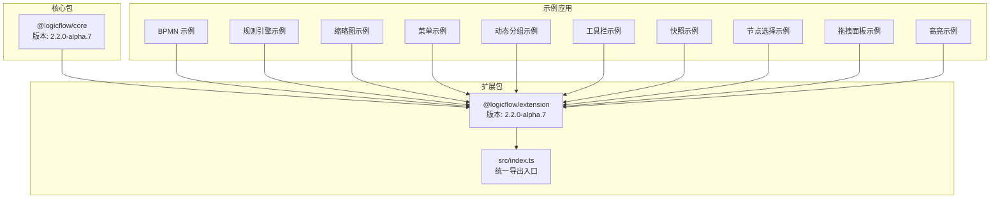
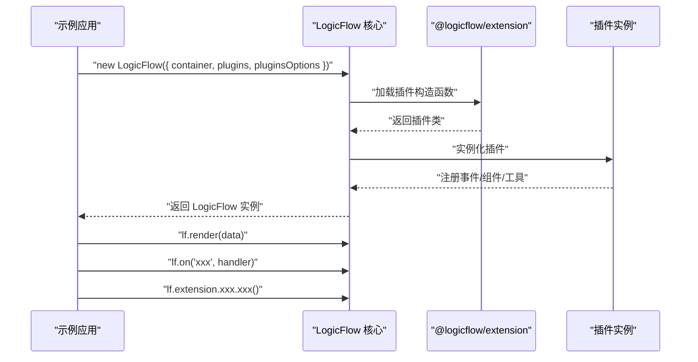
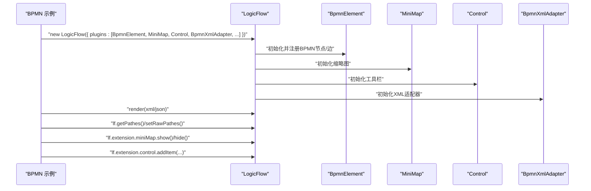
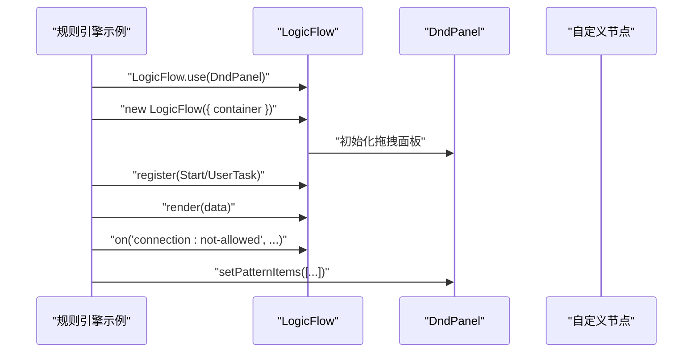
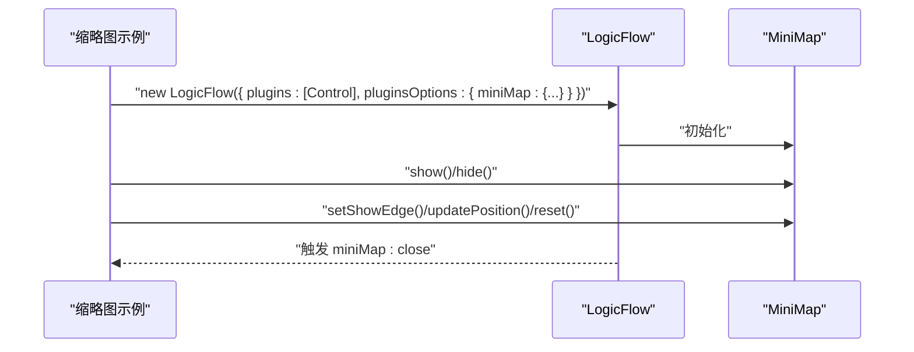
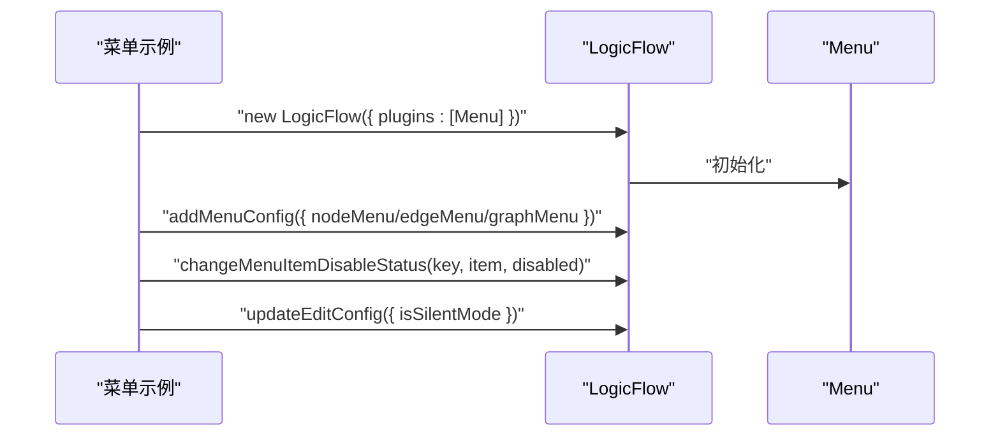
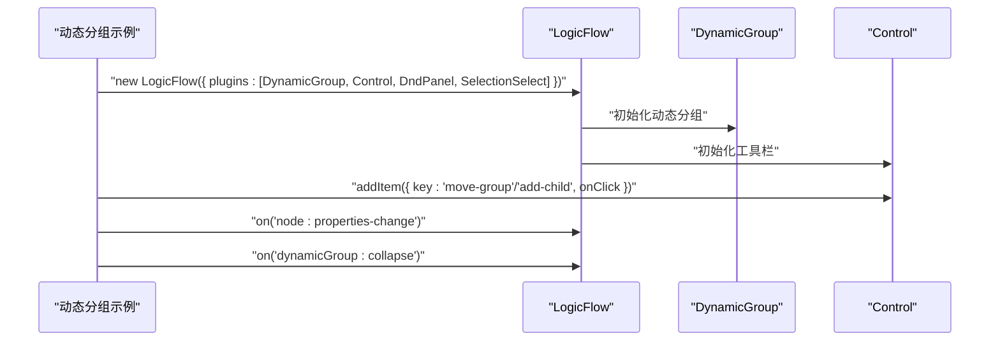
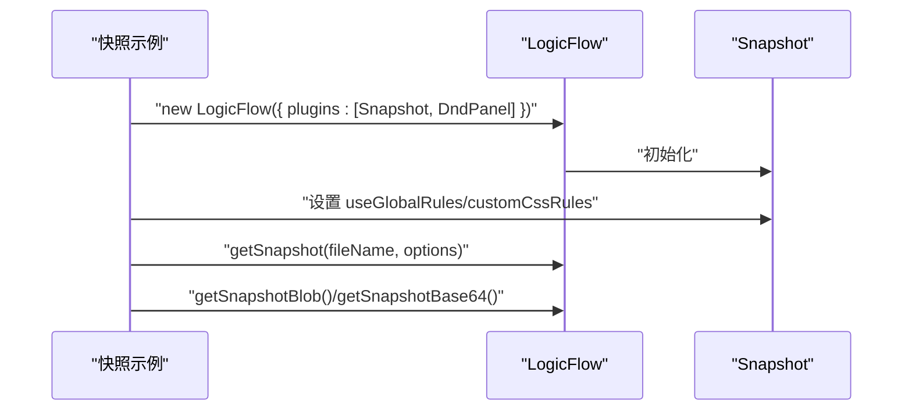
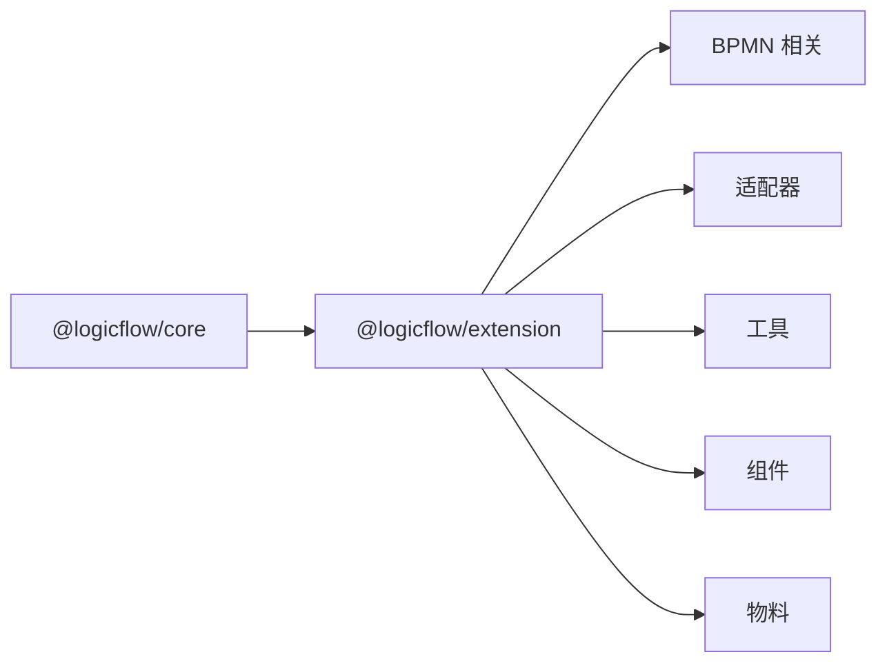

# 扩展插件系统

<cite>
**本文引用的文件**
- [packages/core/package.json](file://packages/core/package.json)
- [packages/extension/package.json](file://packages/extension/package.json)
- [packages/extension/src/index.ts](file://packages/extension/src/index.ts)
- [examples/feature-examples/src/pages/extensions/bpmn/index.tsx](file://examples/feature-examples/src/pages/extensions/bpmn/index.tsx)
- [examples/feature-examples/src/pages/extensions/rules/index.tsx](file://examples/feature-examples/src/pages/extensions/rules/index.tsx)
- [examples/feature-examples/src/pages/extensions/mini-map/index.tsx](file://examples/feature-examples/src/pages/extensions/mini-map/index.tsx)
- [examples/feature-examples/src/pages/extensions/menu/index.tsx](file://examples/feature-examples/src/pages/extensions/menu/index.tsx)
- [examples/feature-examples/src/pages/extensions/dynamic-group/index.tsx](file://examples/feature-examples/src/pages/extensions/dynamic-group/index.tsx)
- [examples/feature-examples/src/pages/extensions/control/index.tsx](file://examples/feature-examples/src/pages/extensions/control/index.tsx)
- [examples/feature-examples/src/pages/extensions/snapshot/index.tsx](file://examples/feature-examples/src/pages/extensions/snapshot/index.tsx)
- [examples/feature-examples/src/pages/extensions/node-selection/index.tsx](file://examples/feature-examples/src/pages/extensions/node-selection/index.tsx)
- [examples/feature-examples/src/pages/extensions/dnd-panel/index.tsx](file://examples/feature-examples/src/pages/extensions/dnd-panel/index.tsx)
- [examples/feature-examples/src/pages/extensions/highlight/index.tsx](file://examples/feature-examples/src/pages/extensions/highlight/index.tsx)
</cite>

## 目录
1. [简介](#简介)
2. [项目结构](#项目结构)
3. [核心组件](#核心组件)
4. [架构总览](#架构总览)
5. [详细组件分析](#详细组件分析)
6. [依赖分析](#依赖分析)
7. [性能考量](#性能考量)
8. [故障排查指南](#故障排查指南)
9. [结论](#结论)
10. [附录](#附录)

## 简介
本文件系统性梳理 LogicFlow 扩展插件体系，覆盖插件架构、内置扩展（BPMN、规则引擎、缩略图等）、自定义插件开发流程、生命周期与事件监听、状态同步机制、常用扩展开发指南（工具栏、右键菜单、快捷键）、插件间依赖与冲突处理，以及最佳实践与性能优化建议。目标是帮助开发者快速理解并高效扩展 LogicFlow。

## 项目结构
该项目采用多包工作区结构，核心与扩展分别位于 packages/core 与 packages/extension，示例在 examples/feature-examples 中演示各扩展的使用方式与 API 调用。

图表来源
- [packages/core/package.json](file://packages/core/package.json#L1-L57)
- [packages/extension/package.json](file://packages/extension/package.json#L1-L61)
- [packages/extension/src/index.ts](file://packages/extension/src/index.ts#L1-L48)

章节来源
- [packages/core/package.json](file://packages/core/package.json#L1-L57)
- [packages/extension/package.json](file://packages/extension/package.json#L1-L61)
- [packages/extension/src/index.ts](file://packages/extension/src/index.ts#L1-L48)

## 核心组件
- 核心框架：LogicFlow 核心提供画布、模型、事件、历史栈、键盘与编辑配置等基础能力。
- 扩展模块：@logicflow/extension 提供 BPMN、规则引擎、缩略图、菜单、拖拽面板、动态分组、工具栏、快照、高亮、节点选择等扩展。
- 统一导出：扩展包通过 src/index.ts 将各类插件集中导出，便于按需引入与组合使用。

章节来源
- [packages/extension/src/index.ts](file://packages/extension/src/index.ts#L1-L48)

## 架构总览
LogicFlow 插件系统遵循“核心 + 扩展”的分层设计。核心负责渲染与交互，扩展通过插件形式注入功能；示例应用展示如何在初始化时声明 plugins 与 pluginsOptions，并通过 extension 实例访问各扩展的能力。

图表来源
- [examples/feature-examples/src/pages/extensions/bpmn/index.tsx](file://examples/feature-examples/src/pages/extensions/bpmn/index.tsx#L30-L60)
- [examples/feature-examples/src/pages/extensions/mini-map/index.tsx](file://examples/feature-examples/src/pages/extensions/mini-map/index.tsx#L82-L98)
- [examples/feature-examples/src/pages/extensions/menu/index.tsx](file://examples/feature-examples/src/pages/extensions/menu/index.tsx#L122-L134)

## 详细组件分析

### BPMN 扩展
- 功能概述：提供 BPMN 元素适配、XML/JSON 转换、自动布局、流程路径计算、BPMN 工具栏按钮、缩略图、拖拽面板、上下文菜单、分组、选择框、截图等功能。
- 使用要点：
  - 在初始化选项中通过 plugins 数组启用所需插件。
  - 通过 lf.extension 访问 MiniMap、Control 等扩展实例。
  - 使用 lfXml2Json/lfJson2Xml 在 XML 与 LogicFlow 数据之间转换。
  - 使用 lf.getPathes()/setRawPathes() 获取/设置流程路径。
- 关键 API（示例）
  - 插件启用与配置：plugins 与 pluginsOptions
  - 上下文菜单：setMenuConfig()/setContextMenuItems()/setContextMenuByType()
  - 拖拽面板：setPatternItems()/setDndPanelItems()
  - 工具栏：control.addItem()
  - 缩略图：miniMap.show()/hide()/updatePosition()/reset()
  - 截图：getSnapshot()/getSnapshotBlob()/getSnapshotBase64()

图表来源
- [examples/feature-examples/src/pages/extensions/bpmn/index.tsx](file://examples/feature-examples/src/pages/extensions/bpmn/index.tsx#L30-L60)
- [examples/feature-examples/src/pages/extensions/bpmn/index.tsx](file://examples/feature-examples/src/pages/extensions/bpmn/index.tsx#L158-L231)
- [examples/feature-examples/src/pages/extensions/bpmn/index.tsx](file://examples/feature-examples/src/pages/extensions/bpmn/index.tsx#L183-L206)

章节来源
- [examples/feature-examples/src/pages/extensions/bpmn/index.tsx](file://examples/feature-examples/src/pages/extensions/bpmn/index.tsx#L1-L367)

### 规则引擎扩展
- 功能概述：通过注册自定义节点（如开始、用户任务），结合连接规则事件回调，实现连接合法性校验与提示。
- 使用要点：
  - 通过 LogicFlow.use(DndPanel) 注册拖拽面板。
  - 使用 lf.register() 注册节点。
  - 使用 lf.on('connection:not-allowed', ...) 监听连接规则事件。
  - 通过 dndPanel.setPatternItems() 配置拖拽物料。

图表来源
- [examples/feature-examples/src/pages/extensions/rules/index.tsx](file://examples/feature-examples/src/pages/extensions/rules/index.tsx#L24-L50)

章节来源
- [examples/feature-examples/src/pages/extensions/rules/index.tsx](file://examples/feature-examples/src/pages/extensions/rules/index.tsx#L1-L59)

### 缩略图（MiniMap）扩展
- 功能概述：在主画布外提供可交互的小地图，支持显示/隐藏、切换显示连线、定位与重置主画布视图。
- 使用要点：
  - 通过 plugins 与 pluginsOptions 配置 MiniMap。
  - 通过 lf.extension.miniMap 访问实例方法：show()/hide()/setShowEdge()/updatePosition()/reset()。
  - 监听 miniMap:close 事件进行状态同步。

图表来源
- [examples/feature-examples/src/pages/extensions/mini-map/index.tsx](file://examples/feature-examples/src/pages/extensions/mini-map/index.tsx#L82-L107)
- [examples/feature-examples/src/pages/extensions/mini-map/index.tsx](file://examples/feature-examples/src/pages/extensions/mini-map/index.tsx#L111-L132)

章节来源
- [examples/feature-examples/src/pages/extensions/mini-map/index.tsx](file://examples/feature-examples/src/pages/extensions/mini-map/index.tsx#L1-L201)

### 右键菜单（ContextMenu）与菜单（Menu）扩展
- 功能概述：为节点、边、图提供上下文菜单与静态菜单项，支持禁用/启用菜单项、切换静默模式、在图空白处添加节点等。
- 使用要点：
  - addMenuConfig() 配置 nodeMenu/edgeMenu/graphMenu。
  - changeMenuItemDisableStatus() 动态控制菜单项可用性。
  - updateEditConfig({ isSilentMode }) 控制交互行为。

图表来源
- [examples/feature-examples/src/pages/extensions/menu/index.tsx](file://examples/feature-examples/src/pages/extensions/menu/index.tsx#L122-L201)

章节来源
- [examples/feature-examples/src/pages/extensions/menu/index.tsx](file://examples/feature-examples/src/pages/extensions/menu/index.tsx#L1-L253)

### 动态分组（DynamicGroup）扩展
- 功能概述：支持嵌套分组、折叠/展开、父子节点增删、属性变更事件监听、导出/导入图数据。
- 使用要点：
  - 通过 plugins 启用 DynamicGroup。
  - 通过 control.addItem() 添加移动分组/添加子节点等工具。
  - 监听 node:properties-change 与 dynamicGroup:collapse 事件。

图表来源
- [examples/feature-examples/src/pages/extensions/dynamic-group/index.tsx](file://examples/feature-examples/src/pages/extensions/dynamic-group/index.tsx#L102-L140)
- [examples/feature-examples/src/pages/extensions/dynamic-group/index.tsx](file://examples/feature-examples/src/pages/extensions/dynamic-group/index.tsx#L294-L300)

章节来源
- [examples/feature-examples/src/pages/extensions/dynamic-group/index.tsx](file://examples/feature-examples/src/pages/extensions/dynamic-group/index.tsx#L1-L393)

### 工具栏（Control）扩展
- 功能概述：提供常用操作按钮（如清空历史），可扩展自定义按钮并通过 addItem 注入。
- 使用要点：
  - 通过 plugins 启用 Control。
  - 通过 lf.extension.control 访问实例并调用 addItem()。

章节来源
- [examples/feature-examples/src/pages/extensions/control/index.tsx](file://examples/feature-examples/src/pages/extensions/control/index.tsx#L98-L116)

### 快照（Snapshot）扩展
- 功能概述：将画布导出为图片（PNG/JPEG/WebP/GIF/SVG），支持自定义尺寸、背景色、padding、质量、安全系数与边距、局部渲染、注入全局样式等。
- 使用要点：
  - 通过 plugins 启用 Snapshot。
  - 通过 lf.extension.snapshot 访问实例并设置 useGlobalRules/customCssRules。
  - 调用 getSnapshot()/getSnapshotBlob()/getSnapshotBase64()。

图表来源
- [examples/feature-examples/src/pages/extensions/snapshot/index.tsx](file://examples/feature-examples/src/pages/extensions/snapshot/index.tsx#L96-L147)
- [examples/feature-examples/src/pages/extensions/snapshot/index.tsx](file://examples/feature-examples/src/pages/extensions/snapshot/index.tsx#L135-L170)

章节来源
- [examples/feature-examples/src/pages/extensions/snapshot/index.tsx](file://examples/feature-examples/src/pages/extensions/snapshot/index.tsx#L1-L401)

### 节点选择（NodeSelection）扩展
- 功能概述：通过专用节点类型实现一组节点的选择框，支持配置选中节点 ID 列表、标签文本、描边颜色等。
- 使用要点：
  - 通过 plugins 启用 NodeSelection。
  - 在数据中配置 properties.node_selection_ids 等属性。

章节来源
- [examples/feature-examples/src/pages/extensions/node-selection/index.tsx](file://examples/feature-examples/src/pages/extensions/node-selection/index.tsx#L99-L116)

### 拖拽面板（DndPanel）扩展
- 功能概述：提供可拖拽节点物料面板，支持注册自定义节点与设置物料列表。
- 使用要点：
  - 通过 plugins 启用 DndPanel。
  - 使用 lf.register() 注册节点，lf.setPatternItems() 设置物料。

章节来源
- [examples/feature-examples/src/pages/extensions/dnd-panel/index.tsx](file://examples/feature-examples/src/pages/extensions/dnd-panel/index.tsx#L47-L100)

### 高亮（Highlight）扩展
- 功能概述：鼠标悬停高亮相关节点/边，支持三种模式：全路径、单元素、相邻元素。
- 使用要点：
  - 通过 plugins 与 pluginsOptions 启用并设置模式。
  - 监听 highlight:single/highlight:neighbours/highlight:path 事件。

章节来源
- [examples/feature-examples/src/pages/extensions/highlight/index.tsx](file://examples/feature-examples/src/pages/extensions/highlight/index.tsx#L25-L57)

## 依赖分析
- 核心与扩展的版本关系：扩展包 @logicflow/extension 通过 peerDependencies 与 @logicflow/core 保持一致版本，确保 API 兼容。
- 统一导出：扩展包通过 src/index.ts 将 BPMN、适配器、工具、组件、物料等模块集中导出，便于示例按需引入。
- 插件依赖与冲突：
  - 插件启用顺序影响初始化行为，应根据功能需求合理排序。
  - 某些扩展（如缩略图、工具栏）可通过 extension 实例互相协作（例如 Control 与 MiniMap 的联动）。
  - 若同时启用多个选择/框选类扩展，需注意交互冲突并明确主控扩展。

图表来源
- [packages/extension/package.json](file://packages/extension/package.json#L38-L53)
- [packages/extension/src/index.ts](file://packages/extension/src/index.ts#L1-L48)

章节来源
- [packages/extension/package.json](file://packages/extension/package.json#L1-L61)
- [packages/extension/src/index.ts](file://packages/extension/src/index.ts#L1-L48)

## 性能考量
- 渲染与事件
  - 合理使用 isSilentMode 与 stop*Graph 配置减少不必要的重绘与交互开销。
  - 对高频事件（如鼠标移动）进行节流/防抖处理，避免频繁触发。
- 大数据量场景
  - 使用局部导出（partial）与安全系数/边距参数控制快照尺寸，避免内存峰值过高。
  - 分批渲染与懒加载节点/边，必要时启用虚拟滚动或裁剪策略。
- 插件组合
  - 避免同时启用过多重型扩展（如高亮、缩略图、快照），在移动端或低端设备上谨慎组合。
  - 对缩略图与高亮等实时渲染组件，按需启用并在不需要时及时隐藏。

## 故障排查指南
- 插件未生效
  - 确认已在 plugins 中正确启用插件，并检查 pluginsOptions 参数是否传入。
  - 检查扩展实例访问：通过 lf.extension.<pluginName> 获取实例并调用方法。
- 事件未触发
  - 确认事件监听在 render 之前或之后的合适时机绑定。
  - 对于特定扩展事件（如 miniMap:close、dynamicGroup:collapse），检查扩展是否已初始化。
- 数据转换异常
  - 使用 lfXml2Json/lfJson2Xml 前先校验输入格式，确保 XML/JSON 结构完整。
- 快照导出失败
  - 检查 fileType、backgroundColor、partial、width/height、padding、quality、safetyFactor、safetyMargin 等参数是否合理。
  - 对复杂 HTML 节点，确保 customCssRules 正确注入全局样式。

章节来源
- [examples/feature-examples/src/pages/extensions/bpmn/index.tsx](file://examples/feature-examples/src/pages/extensions/bpmn/index.tsx#L158-L231)
- [examples/feature-examples/src/pages/extensions/mini-map/index.tsx](file://examples/feature-examples/src/pages/extensions/mini-map/index.tsx#L100-L102)
- [examples/feature-examples/src/pages/extensions/snapshot/index.tsx](file://examples/feature-examples/src/pages/extensions/snapshot/index.tsx#L150-L170)

## 结论
LogicFlow 的扩展插件体系以清晰的分层与统一导出为核心，配合丰富的内置扩展，能够满足从 BPMN 流程建模到交互增强、可视化导出等多样化需求。通过合理的插件组合、事件监听与状态同步，开发者可以构建高性能、可维护的流程图应用。

## 附录
- 常用扩展开发清单
  - 工具栏插件：通过 Control.addItem 注入自定义按钮，实现业务快捷操作。
  - 右键菜单：通过 Menu/ContextMenu 配置不同对象的菜单项，支持动态禁用与回调。
  - 快捷键：结合核心键盘配置与 Mousetrap，实现全局快捷键。
  - 拖拽面板：通过 DndPanel.setPatternItems 注入物料，结合 register 注册自定义节点。
  - 高亮：根据 hover 元素高亮路径/邻居/单元素，提升可读性。
  - 缩略图：提供主画布视图映射，支持交互定位与重置。
  - 快照：按需导出 PNG/JPEG/WebP/GIF/SVG，支持样式注入与局部渲染。
- 最佳实践
  - 明确插件职责边界，避免重复功能。
  - 使用 extension 实例进行细粒度控制，避免直接操作 DOM。
  - 对复杂交互进行事件解耦与状态归一化。
  - 在移动端优先启用轻量级扩展，降低资源消耗。