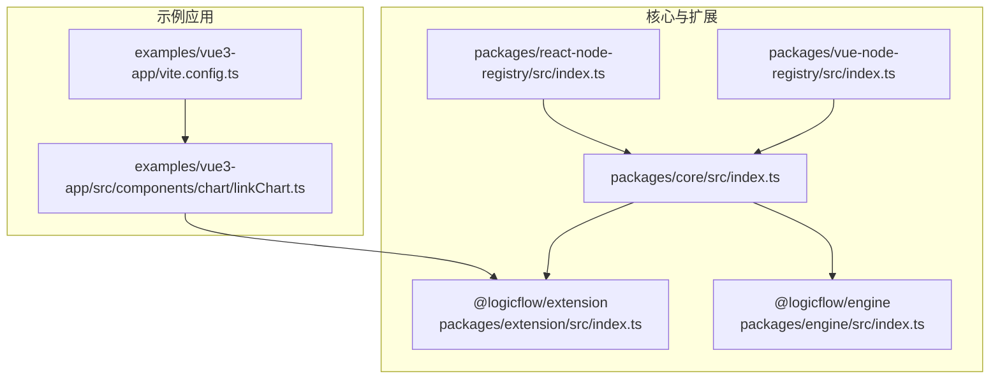
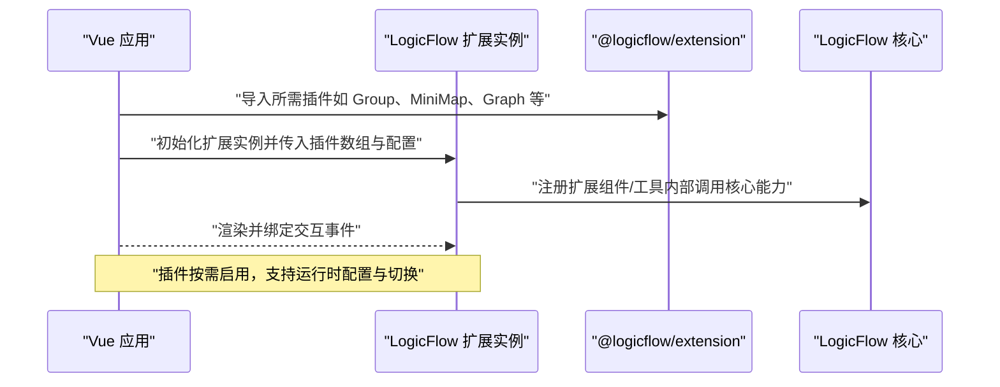
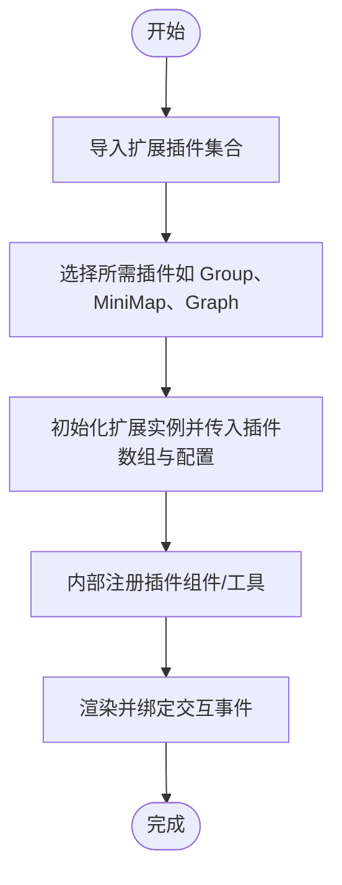
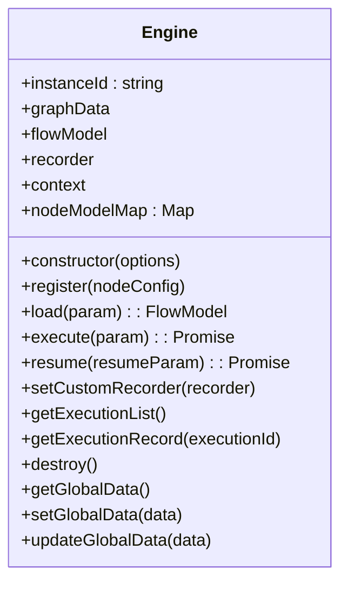
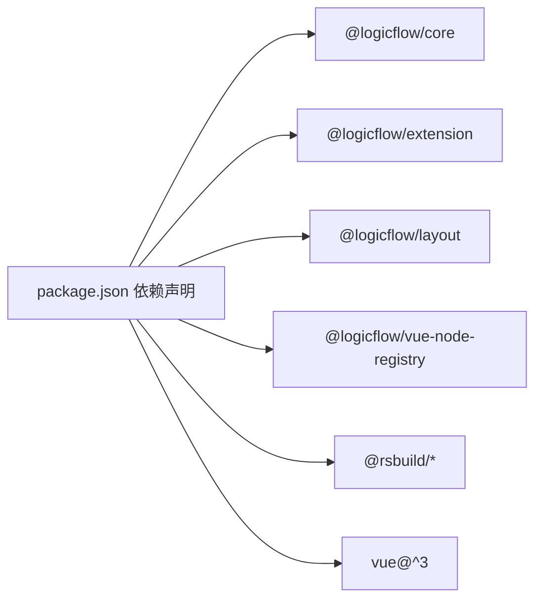

# 插件集成与配置

<cite>
**本文引用的文件**
- [package.json](file://package.json)
- [README.md](file://README.md)
- [packages/core/src/index.ts](file://packages/core/src/index.ts)
- [packages/extension/src/index.ts](file://packages/extension/src/index.ts)
- [packages/engine/src/index.ts](file://packages/engine/src/index.ts)
- [packages/react-node-registry/src/index.ts](file://packages/react-node-registry/src/index.ts)
- [packages/vue-node-registry/src/index.ts](file://packages/vue-node-registry/src/index.ts)
- [examples/vue3-app/src/components/chart/linkChart.ts](file://examples/vue3-app/src/components/chart/linkChart.ts)
- [examples/vue3-app/src/components/chart/graph.ts](file://examples/vue3-app/src/components/chart/graph.ts)
- [examples/vue3-app/src/components/chart/nodes/index.ts](file://examples/vue3-app/src/components/chart/nodes/index.ts)
- [examples/vue3-app/src/components/chart/nodes/FirstGroup.ts](file://examples/vue3-app/src/components/chart/nodes/FirstGroup.ts)
- [examples/vue3-app/src/components/chart/nodes/LandingGroup.ts](file://examples/vue3-app/src/components/chart/nodes/LandingGroup.ts)
- [examples/vue3-app/src/components/chart/nodes/MiddleGroup.ts](file://examples/vue3-app/src/components/chart/nodes/MiddleGroup.ts)
- [examples/vue3-app/vite.config.ts](file://examples/vue3-app/vite.config.ts)
- [flow-docs/bpmn-plugin-guide.md](file://flow-docs/bpmn-plugin-guide.md)
- [flow-docs/bpmn-elements-adapter-summary.md](file://flow-docs/bpmn-elements-adapter-summary.md)
- [flow-docs/bpmn-style-customization.md](file://flow-docs/bpmn-style-customization.md)
</cite>

## 目录
1. [简介](#简介)
2. [项目结构](#项目结构)
3. [核心组件](#核心组件)
4. [架构总览](#架构总览)
5. [详细组件分析](#详细组件分析)
6. [依赖分析](#依赖分析)
7. [性能考虑](#性能考虑)
8. [故障排查指南](#故障排查指南)
9. [结论](#结论)
10. [附录](#附录)

## 简介
本指南聚焦于在 LogicFlow 生态中进行插件集成与配置，涵盖插件加载机制、依赖管理、版本兼容性、配置选项与参数传递、运行时配置、多插件协同与冲突规避、性能优化与内存管理、热更新与动态加载/卸载思路，以及调试与监控方法。本文结合仓库中的核心包与示例工程，提供从入门到进阶的实操路径。

## 项目结构
该项目采用多包（monorepo）组织方式，核心与扩展能力分别封装在独立包内，并通过示例工程演示插件的实际使用方式。关键目录与职责如下：
- packages/core：LogicFlow 核心导出入口，提供统一 API 与常量导出。
- packages/extension：扩展插件集合，包含 BPMN、泳道、动态分组、拖拽面板、迷你地图、高亮、菜单等组件与工具。
- packages/engine：流程引擎，负责节点注册、流程装载、执行与恢复、全局数据管理与调试记录器。
- packages/react-node-registry / packages/vue-node-registry：React/Vue 节点注册与渲染桥接。
- examples：多框架示例，展示插件在 Vue/Next/Vite 等环境中的集成方式。

图表来源
- [packages/core/src/index.ts](file://packages/core/src/index.ts#L1-L27)
- [packages/extension/src/index.ts](file://packages/extension/src/index.ts#L1-L48)
- [packages/engine/src/index.ts](file://packages/engine/src/index.ts#L1-L301)
- [packages/react-node-registry/src/index.ts](file://packages/react-node-registry/src/index.ts#L1-L6)
- [packages/vue-node-registry/src/index.ts](file://packages/vue-node-registry/src/index.ts#L1-L5)
- [examples/vue3-app/src/components/chart/linkChart.ts](file://examples/vue3-app/src/components/chart/linkChart.ts#L31-L32)
- [examples/vue3-app/vite.config.ts](file://examples/vue3-app/vite.config.ts#L3-L7)

章节来源
- [package.json](file://package.json#L14-L27)
- [README.md](file://README.md#L1-L37)

## 核心组件
- 核心导出入口：提供 LogicFlow 主类、工具函数、事件发射器、常量与类型导出，便于上层按需引入。
- 扩展插件集合：集中导出 BPMN、适配器、泳道、动态分组、拖拽面板、迷你地图、高亮、菜单、工具等模块，形成“即插即用”的扩展生态。
- 引擎：提供节点注册、流程装载、执行/恢复、全局数据管理、调试记录器与销毁清理等能力，支持自定义记录器与上下文注入。
- 节点注册桥接：React/Vue 侧提供节点模型/视图注册与渲染桥接，简化第三方 UI 框架集成。

章节来源
- [packages/core/src/index.ts](file://packages/core/src/index.ts#L1-L27)
- [packages/extension/src/index.ts](file://packages/extension/src/index.ts#L1-L48)
- [packages/engine/src/index.ts](file://packages/engine/src/index.ts#L1-L301)
- [packages/react-node-registry/src/index.ts](file://packages/react-node-registry/src/index.ts#L1-L6)
- [packages/vue-node-registry/src/index.ts](file://packages/vue-node-registry/src/index.ts#L1-L5)

## 架构总览
下图展示了 LogicFlow 在示例应用中的典型插件集成路径：应用通过 @logicflow/extension 导入所需插件，结合 Vite/Vue 配置完成构建与运行时加载；核心 LogicFlow 实例与扩展插件协同工作，实现节点、边、交互组件与工具的组合。

图表来源
- [examples/vue3-app/src/components/chart/linkChart.ts](file://examples/vue3-app/src/components/chart/linkChart.ts#L31-L32)
- [packages/extension/src/index.ts](file://packages/extension/src/index.ts#L1-L48)
- [packages/core/src/index.ts](file://packages/core/src/index.ts#L1-L27)

## 详细组件分析

### 扩展插件体系与加载机制
- 插件分类与导出：扩展包集中导出 BPMN、泳道、动态分组、拖拽面板、迷你地图、高亮、菜单、工具与物料等模块，便于按需引入。
- 示例集成：示例应用通过在扩展实例初始化时传入插件数组与配置对象，实现插件的声明式加载与运行时配置。
- 插件命名约定：部分插件源码中包含静态属性用于标识插件名称，便于识别与调试。

图表来源
- [packages/extension/src/index.ts](file://packages/extension/src/index.ts#L1-L48)
- [examples/vue3-app/src/components/chart/linkChart.ts](file://examples/vue3-app/src/components/chart/linkChart.ts#L31-L32)

章节来源
- [packages/extension/src/index.ts](file://packages/extension/src/index.ts#L1-L48)
- [examples/vue3-app/src/components/chart/linkChart.ts](file://examples/vue3-app/src/components/chart/linkChart.ts#L31-L32)
- [examples/vue3-app/src/components/chart/graph.ts](file://examples/vue3-app/src/components/chart/graph.ts#L15-L15)
- [examples/vue3-app/src/components/chart/nodes/index.ts](file://examples/vue3-app/src/components/chart/nodes/index.ts#L12-L12)

### 引擎与节点注册（插件扩展点）
- 节点注册：引擎提供注册接口，将节点类型与模型映射存入内部映射表，支持默认节点与自定义节点。
- 流程装载：装载流程图数据后生成流程模型，供后续执行/恢复使用。
- 执行与恢复：提供异步执行与中断恢复接口，支持回调与错误处理。
- 全局数据：支持设置/更新全局数据，便于跨节点共享状态。
- 销毁与清理：提供销毁接口，清理记录器等资源。

图表来源
- [packages/engine/src/index.ts](file://packages/engine/src/index.ts#L7-L176)

章节来源
- [packages/engine/src/index.ts](file://packages/engine/src/index.ts#L1-L301)

### React/Vue 节点注册桥接
- React：提供视图、模型、注册表、包装器与门户等导出，便于在 React 环境中注册与渲染节点。
- Vue：提供视图、模型、注册表、传送（Teleport）等导出，便于在 Vue 环境中注册与渲染节点。

章节来源
- [packages/react-node-registry/src/index.ts](file://packages/react-node-registry/src/index.ts#L1-L6)
- [packages/vue-node-registry/src/index.ts](file://packages/vue-node-registry/src/index.ts#L1-L5)

### 插件配置选项、参数传递与运行时配置
- 插件数组与配置对象：示例应用通过在扩展实例初始化时传入插件数组与配置对象，实现插件的声明式加载与运行时配置。
- 插件命名：部分插件源码中包含静态属性用于标识插件名称，便于识别与调试。
- 构建配置：示例应用使用 Vite/Vue 插件进行开发与构建，确保插件在运行时正确加载。

章节来源
- [examples/vue3-app/src/components/chart/linkChart.ts](file://examples/vue3-app/src/components/chart/linkChart.ts#L31-L32)
- [examples/vue3-app/src/components/chart/graph.ts](file://examples/vue3-app/src/components/chart/graph.ts#L15-L15)
- [examples/vue3-app/vite.config.ts](file://examples/vue3-app/vite.config.ts#L3-L7)

### 多插件协同与冲突规避
- 协同原则：按需引入插件，避免重复注册同一类型组件；优先使用官方扩展包提供的统一导出。
- 冲突规避：若多个插件对同一交互或样式产生影响，建议通过插件配置对象进行差异化控制；必要时在应用层进行条件加载与切换。
- 命名规范：遵循插件静态属性命名约定，便于识别与调试。

章节来源
- [packages/extension/src/index.ts](file://packages/extension/src/index.ts#L1-L48)
- [examples/vue3-app/src/components/chart/nodes/index.ts](file://examples/vue3-app/src/components/chart/nodes/index.ts#L12-L12)

### 热更新、动态加载与卸载机制
- 动态加载：可在应用启动后根据路由或用户操作动态引入插件并初始化扩展实例。
- 卸载与清理：在切换场景或页面卸载时，调用引擎销毁接口清理记录器与相关资源，避免内存泄漏。
- 运行时切换：通过插件配置对象与条件逻辑实现插件的启用/禁用切换，注意在切换前后清理旧状态。

章节来源
- [packages/engine/src/index.ts](file://packages/engine/src/index.ts#L157-L175)
- [examples/vue3-app/src/components/chart/linkChart.ts](file://examples/vue3-app/src/components/chart/linkChart.ts#L31-L32)

### 性能优化与内存管理
- 插件体积与按需引入：仅引入所需插件，减少打包体积与运行时开销。
- 记录器与调试：在开发阶段可开启调试记录器，生产环境建议自定义持久化记录器并定期清理。
- 渲染与交互：合理使用迷你地图、高亮等插件，避免过度渲染；在复杂场景中考虑分页/懒加载策略。
- 内存泄漏防护：在页面/场景切换时调用销毁接口清理资源；避免在插件中持有全局长生命周期引用。

章节来源
- [packages/engine/src/index.ts](file://packages/engine/src/index.ts#L19-L23)
- [packages/engine/src/index.ts](file://packages/engine/src/index.ts#L48-L58)
- [examples/vue3-app/vite.config.ts](file://examples/vue3-app/vite.config.ts#L4-L4)

### 调试工具与监控方法
- 插件命名：利用插件静态属性标识插件名称，便于在日志与调试器中快速定位。
- 构建与开发：使用 Vite/Vue 插件进行开发与调试，结合浏览器开发者工具观察插件加载与渲染过程。
- 日志与记录：在应用层增加插件加载与初始化日志；在引擎层面结合调试记录器进行行为追踪。

章节来源
- [examples/vue3-app/src/components/chart/graph.ts](file://examples/vue3-app/src/components/chart/graph.ts#L15-L15)
- [examples/vue3-app/vite.config.ts](file://examples/vue3-app/vite.config.ts#L3-L7)
- [packages/engine/src/index.ts](file://packages/engine/src/index.ts#L19-L23)

## 依赖分析
- 核心依赖：@logicflow/core、@logicflow/extension、@logicflow/layout、@logicflow/vue-node-registry 等。
- 开发依赖：Rsbuild、Vue、TypeScript、ESLint、Biome 等。
- 版本兼容性：示例工程中各包版本号明确，建议在升级时遵循语义化版本规则，优先进行小版本与补丁版本升级，大版本升级前进行充分测试。

图表来源
- [package.json](file://package.json#L14-L27)

章节来源
- [package.json](file://package.json#L14-L27)

## 性能考虑
- 插件按需加载：仅在需要时引入插件，减少初始包体与首屏渲染压力。
- 复杂场景优化：在大规模节点/边场景中，谨慎使用高开销插件（如复杂动画、实时高亮），必要时采用节流/防抖与懒加载。
- 记录器与调试：生产环境关闭调试记录器或替换为轻量级实现，避免不必要的 IO 与内存占用。
- 渲染桥接：在 React/Vue 环境中，确保节点渲染最小化重绘，避免在插件中进行不必要的全局状态订阅。

## 故障排查指南
- 插件未生效：检查插件是否正确导入与初始化；确认插件数组与配置对象传入无误；查看浏览器控制台是否有报错。
- 内存泄漏：在页面/场景切换时调用销毁接口；检查是否存在全局长生命周期引用；关注构建配置中可能引发内存问题的插件。
- 版本不兼容：核对各包版本号，遵循语义化版本升级；在升级后进行全面回归测试。
- 构建问题：确认 Vite/Vue 插件配置正确；避免同时启用可能冲突的开发工具插件。

章节来源
- [examples/vue3-app/vite.config.ts](file://examples/vue3-app/vite.config.ts#L4-L4)
- [packages/engine/src/index.ts](file://packages/engine/src/index.ts#L157-L175)

## 结论
通过本指南，您可以在 LogicFlow 生态中高效地集成与配置各类扩展插件。建议遵循按需引入、统一配置、运行时可控的原则，结合引擎的注册与销毁能力，实现稳定、可维护且高性能的插件化流程图应用。对于复杂场景，建议制定插件清单与版本策略，配合完善的日志与监控体系，持续优化用户体验与系统稳定性。

## 附录
- BPMN 插件指南与元素适配：参考文档以了解 BPMN 元素的适配与样式定制方法。
- BPMN 元素适配汇总：参考文档以掌握常见 BPMN 元素的适配要点与最佳实践。
- BPMN 样式定制：参考文档以学习如何对 BPMN 元素进行样式定制与主题化改造。

章节来源
- [flow-docs/bpmn-plugin-guide.md](file://flow-docs/bpmn-plugin-guide.md)
- [flow-docs/bpmn-elements-adapter-summary.md](file://flow-docs/bpmn-elements-adapter-summary.md)
- [flow-docs/bpmn-style-customization.md](file://flow-docs/bpmn-style-customization.md)