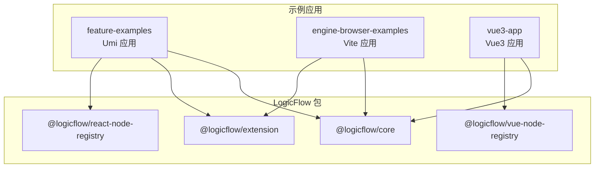
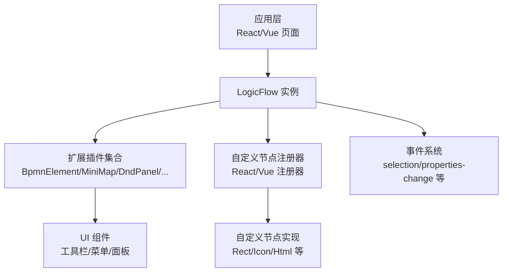
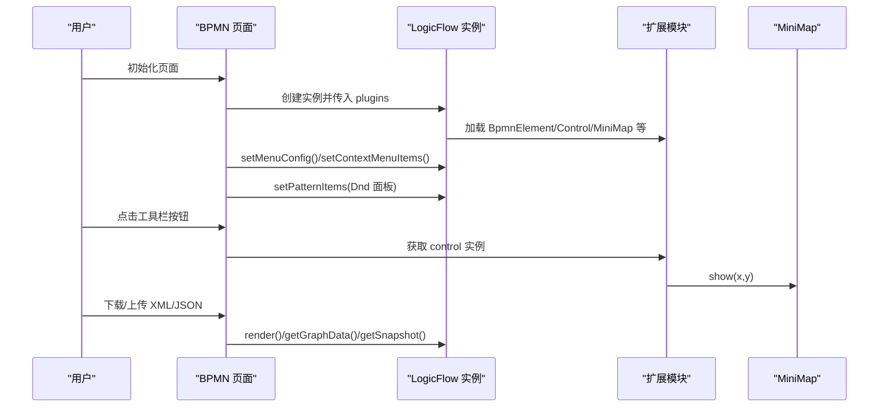
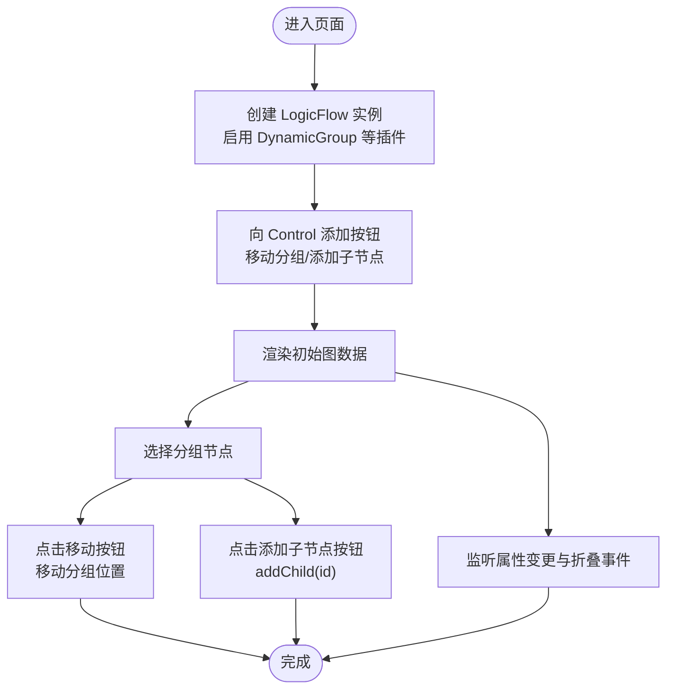
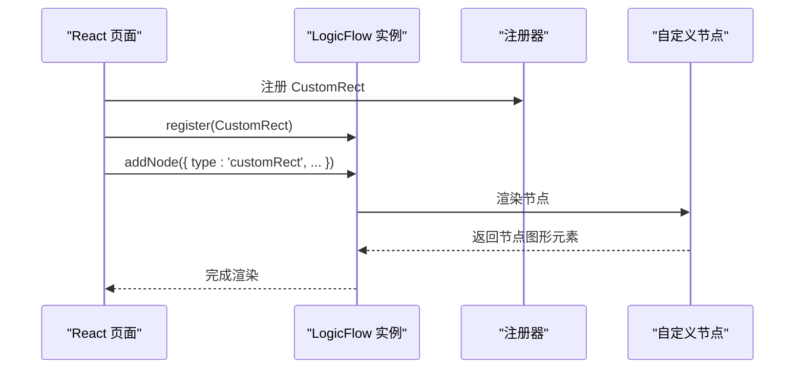
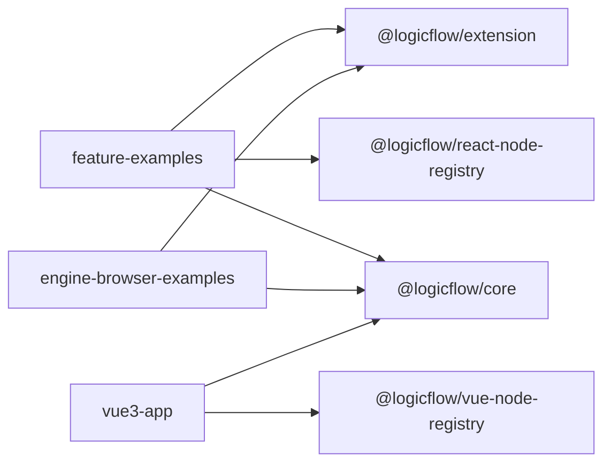

# 自定义插件开发

<cite>
**本文引用的文件**   
- [examples/feature-examples/package.json](file://examples/feature-examples/package.json)
- [examples/engine-browser-examples/package.json](file://examples/engine-browser-examples/package.json)
- [packages/core/package.json](file://packages/core/package.json)
- [packages/react-node-registry/package.json](file://packages/react-node-registry/package.json)
- [packages/vue-node-registry/package.json](file://packages/vue-node-registry/package.json)
- [examples/feature-examples/src/pages/extensions/bpmn/index.tsx](file://examples/feature-examples/src/pages/extensions/bpmn/index.tsx)
- [examples/feature-examples/src/pages/extensions/dynamic-group/index.tsx](file://examples/feature-examples/src/pages/extensions/dynamic-group/index.tsx)
- [examples/feature-examples/src/pages/extensions/control/index.tsx](file://examples/feature-examples/src/pages/extensions/control/index.tsx)
- [examples/feature-examples/src/pages/graph/nodes/index.ts](file://examples/feature-examples/src/pages/graph/nodes/index.ts)
- [examples/feature-examples/src/pages/nodes/custom/rect/index.tsx](file://examples/feature-examples/src/pages/nodes/custom/rect/index.tsx)
- [examples/feature-examples/src/pages/nodes/custom/icon/index.tsx](file://examples/feature-examples/src/pages/nodes/custom/icon/index.tsx)
- [examples/vue3-app/src/components/LFElements/nodes/index.ts](file://examples/vue3-app/src/components/LFElements/nodes/index.ts)
</cite>

## 目录
1. [简介](#简介)
2. [项目结构](#项目结构)
3. [核心组件](#核心组件)
4. [架构总览](#架构总览)
5. [详细组件分析](#详细组件分析)
6. [依赖分析](#依赖分析)
7. [性能考虑](#性能考虑)
8. [故障排查指南](#故障排查指南)
9. [结论](#结论)
10. [附录](#附录)

## 简介
本指南面向希望基于 LogicFlow 开发自定义插件（节点、边、工具）的工程师与产品团队。文档覆盖从项目初始化、插件注册与生命周期、事件与工具栏集成，到样式与主题适配、调试与发布全流程。示例同时涵盖 Vue 与 React 双框架的插件开发实践。

## 项目结构
该仓库采用多包工作区结构，核心能力由 @logicflow/core 提供，扩展能力由 @logicflow/extension 提供；同时提供 React 与 Vue 的节点注册器，便于在不同前端框架中快速接入自定义节点。

图表来源
- [examples/feature-examples/package.json](file://examples/feature-examples/package.json#L1-L29)
- [examples/engine-browser-examples/package.json](file://examples/engine-browser-examples/package.json#L1-L39)
- [packages/core/package.json](file://packages/core/package.json#L1-L57)
- [packages/react-node-registry/package.json](file://packages/react-node-registry/package.json#L1-L48)
- [packages/vue-node-registry/package.json](file://packages/vue-node-registry/package.json#L1-L56)

章节来源
- [examples/feature-examples/package.json](file://examples/feature-examples/package.json#L1-L29)
- [examples/engine-browser-examples/package.json](file://examples/engine-browser-examples/package.json#L1-L39)
- [packages/core/package.json](file://packages/core/package.json#L1-L57)
- [packages/react-node-registry/package.json](file://packages/react-node-registry/package.json#L1-L48)
- [packages/vue-node-registry/package.json](file://packages/vue-node-registry/package.json#L1-L56)

## 核心组件
- LogicFlow 核心引擎：负责画布渲染、节点/边模型管理、交互事件、历史栈、键盘与网格等基础能力。
- 扩展插件集合：提供 BPMN 元素、动态分组、迷你地图、菜单、选择框选、快照、自动布局、XML 适配等常用扩展。
- 节点注册器：React 与 Vue 的节点注册器分别用于在 React/Vue 中注册自定义节点，简化跨框架的节点复用。

章节来源
- [examples/feature-examples/src/pages/extensions/bpmn/index.tsx](file://examples/feature-examples/src/pages/extensions/bpmn/index.tsx#L1-L367)
- [examples/feature-examples/src/pages/extensions/dynamic-group/index.tsx](file://examples/feature-examples/src/pages/extensions/dynamic-group/index.tsx#L1-L393)
- [examples/feature-examples/src/pages/extensions/control/index.tsx](file://examples/feature-examples/src/pages/extensions/control/index.tsx#L1-L134)
- [examples/feature-examples/src/pages/nodes/custom/rect/index.tsx](file://examples/feature-examples/src/pages/nodes/custom/rect/index.tsx#L1-L327)
- [examples/feature-examples/src/pages/nodes/custom/icon/index.tsx](file://examples/feature-examples/src/pages/nodes/custom/icon/index.tsx#L1-L95)

## 架构总览
LogicFlow 的插件化架构围绕“核心引擎 + 扩展插件 + 节点注册器”的组合展开。应用通过 LogicFlow 实例加载插件，再通过注册器将自定义节点注入引擎，最终在画布上渲染与交互。

图表来源
- [examples/feature-examples/src/pages/extensions/bpmn/index.tsx](file://examples/feature-examples/src/pages/extensions/bpmn/index.tsx#L30-L60)
- [examples/feature-examples/src/pages/extensions/dynamic-group/index.tsx](file://examples/feature-examples/src/pages/extensions/dynamic-group/index.tsx#L19-L35)
- [examples/feature-examples/src/pages/extensions/control/index.tsx](file://examples/feature-examples/src/pages/extensions/control/index.tsx#L11-L42)
- [examples/feature-examples/src/pages/nodes/custom/rect/index.tsx](file://examples/feature-examples/src/pages/nodes/custom/rect/index.tsx#L47-L58)
- [examples/feature-examples/src/pages/nodes/custom/icon/index.tsx](file://examples/feature-examples/src/pages/nodes/custom/icon/index.tsx#L72-L82)

## 详细组件分析

### BPMN 扩展插件（节点、边、工具）
- 插件启用：在 LogicFlow 配置中通过 plugins 数组启用 BpmnElement、MiniMap、FlowPath、AutoLayout、DndPanel、Menu、ContextMenu、Group、Control、BpmnXmlAdapter、Snapshot、SelectionSelect 等。
- 工具栏集成：通过 extension.control 获取控制条实例，使用 addItem 动态添加按钮，绑定鼠标事件与 MiniMap 展示逻辑。
- 菜单配置：通过 setMenuConfig 与 setContextMenuItems 设置全局与按类型（如 bpmn:userTask）的右键菜单项。
- 拖拽面板：通过 setPatternItems 将默认图标与自定义回调注入 Dnd 面板。
- 数据导入导出：支持 XML/JSON 的互转与快照导出。

图表来源
- [examples/feature-examples/src/pages/extensions/bpmn/index.tsx](file://examples/feature-examples/src/pages/extensions/bpmn/index.tsx#L30-L60)
- [examples/feature-examples/src/pages/extensions/bpmn/index.tsx](file://examples/feature-examples/src/pages/extensions/bpmn/index.tsx#L183-L206)
- [examples/feature-examples/src/pages/extensions/bpmn/index.tsx](file://examples/feature-examples/src/pages/extensions/bpmn/index.tsx#L233-L250)
- [examples/feature-examples/src/pages/extensions/bpmn/index.tsx](file://examples/feature-examples/src/pages/extensions/bpmn/index.tsx#L282-L288)

章节来源
- [examples/feature-examples/src/pages/extensions/bpmn/index.tsx](file://examples/feature-examples/src/pages/extensions/bpmn/index.tsx#L1-L367)

### 动态分组插件（节点与属性变更）
- 插件启用：plugins 中启用 DynamicGroup、Control、DndPanel、SelectionSelect。
- 分组操作：通过 control 工具条添加移动分组与添加子节点的按钮；通过 getNodeModelById 获取分组模型并调用 addChild。
- 事件监听：监听 node:properties-change 与 dynamicGroup:collapse 事件，实现属性变更提示与分组折叠状态反馈。

图表来源
- [examples/feature-examples/src/pages/extensions/dynamic-group/index.tsx](file://examples/feature-examples/src/pages/extensions/dynamic-group/index.tsx#L102-L125)
- [examples/feature-examples/src/pages/extensions/dynamic-group/index.tsx](file://examples/feature-examples/src/pages/extensions/dynamic-group/index.tsx#L138-L139)
- [examples/feature-examples/src/pages/extensions/dynamic-group/index.tsx](file://examples/feature-examples/src/pages/extensions/dynamic-group/index.tsx#L294-L300)

章节来源
- [examples/feature-examples/src/pages/extensions/dynamic-group/index.tsx](file://examples/feature-examples/src/pages/extensions/dynamic-group/index.tsx#L1-L393)

### 控制条插件（样式与历史）
- 插件启用：plugins 中启用 Control。
- 样式配置：通过 style 配置 rect/circle/ellipse/polygon/diamond/text 等默认样式。
- 历史清空：通过 history.undos = [] 清空历史栈。

章节来源
- [examples/feature-examples/src/pages/extensions/control/index.tsx](file://examples/feature-examples/src/pages/extensions/control/index.tsx#L1-L134)

### 自定义节点（React 与 Vue）
- React 节点注册：在页面中通过 lf.register(CustomRect) 注册自定义节点，随后使用 addNode 或 render 时指定 type 为 customRect。
- Vue 节点注册：在 Vue 应用中同样通过注册器注册节点并在模板中使用。
- 示例节点类型：Rect、Icon、Html 等，均可通过 properties/style/textStyle 等参数进行样式与文本定制。

图表来源
- [examples/feature-examples/src/pages/nodes/custom/rect/index.tsx](file://examples/feature-examples/src/pages/nodes/custom/rect/index.tsx#L57-L58)
- [examples/feature-examples/src/pages/nodes/custom/rect/index.tsx](file://examples/feature-examples/src/pages/nodes/custom/rect/index.tsx#L61-L117)
- [examples/vue3-app/src/components/LFElements/nodes/index.ts](file://examples/vue3-app/src/components/LFElements/nodes/index.ts#L1-L14)

章节来源
- [examples/feature-examples/src/pages/nodes/custom/rect/index.tsx](file://examples/feature-examples/src/pages/nodes/custom/rect/index.tsx#L1-L327)
- [examples/feature-examples/src/pages/nodes/custom/icon/index.tsx](file://examples/feature-examples/src/pages/nodes/custom/icon/index.tsx#L1-L95)
- [examples/vue3-app/src/components/LFElements/nodes/index.ts](file://examples/vue3-app/src/components/LFElements/nodes/index.ts#L1-L14)

## 依赖分析
- 依赖关系概览：示例应用依赖 @logicflow/core 与 @logicflow/extension；React 场景额外依赖 @logicflow/react-node-registry；Vue 场景依赖 @logicflow/vue-node-registry。
- 版本与构建：各包均提供 ESM/CJS/UMD 多产物与类型声明，便于在不同运行环境使用。

图表来源
- [examples/feature-examples/package.json](file://examples/feature-examples/package.json#L12-L22)
- [examples/engine-browser-examples/package.json](file://examples/engine-browser-examples/package.json#L12-L23)
- [packages/react-node-registry/package.json](file://packages/react-node-registry/package.json#L34-L46)
- [packages/vue-node-registry/package.json](file://packages/vue-node-registry/package.json#L32-L45)

章节来源
- [examples/feature-examples/package.json](file://examples/feature-examples/package.json#L1-L29)
- [examples/engine-browser-examples/package.json](file://examples/engine-browser-examples/package.json#L1-L39)
- [packages/react-node-registry/package.json](file://packages/react-node-registry/package.json#L1-L48)
- [packages/vue-node-registry/package.json](file://packages/vue-node-registry/package.json#L1-L56)

## 性能考虑
- 合理使用事件监听：避免在高频事件（如拖拽过程）中执行昂贵计算，必要时使用节流/防抖。
- 分批渲染与懒加载：对大型图建议分批渲染与按需加载节点/边资源。
- 样式与主题：通过统一的主题变量与样式文件减少重复计算与重绘。
- 插件按需启用：仅启用必要的扩展插件，降低初始化与运行时开销。

## 故障排查指南
- 插件未生效
  - 检查 plugins 数组是否正确引入并传递给 LogicFlow 实例。
  - 确认 extension.control/miniMap 等对象已正确获取。
- 节点无法渲染
  - 确认已通过 register 注册自定义节点，且 type 名称一致。
  - 检查节点组件是否正确导出并被页面引用。
- 事件未触发
  - 确认事件监听在实例创建后挂载，且监听的事件名称与示例一致。
- 样式异常
  - 检查样式文件是否正确引入，主题变量是否覆盖到目标节点类型。

章节来源
- [examples/feature-examples/src/pages/extensions/bpmn/index.tsx](file://examples/feature-examples/src/pages/extensions/bpmn/index.tsx#L183-L206)
- [examples/feature-examples/src/pages/nodes/custom/rect/index.tsx](file://examples/feature-examples/src/pages/nodes/custom/rect/index.tsx#L57-L58)
- [examples/feature-examples/src/pages/extensions/dynamic-group/index.tsx](file://examples/feature-examples/src/pages/extensions/dynamic-group/index.tsx#L294-L300)

## 结论
通过 LogicFlow 的插件化架构，开发者可以快速扩展节点、边与工具能力，并在 React/Vue 生态中复用自定义节点。遵循本文的插件开发流程、事件与生命周期实践以及样式主题适配策略，可高效构建高质量的流程图编辑体验。

## 附录

### 插件开发流程（从零到一）
- 初始化项目
  - 使用示例工程的 package.json 作为参考，安装 @logicflow/core、@logicflow/extension、@logicflow/react-node-registry 或 @logicflow/vue-node-registry。
- 创建自定义节点
  - 在 React/Vue 中编写节点组件并通过注册器注册；在页面中通过 lf.register 注册并渲染。
- 集成扩展插件
  - 在 LogicFlow 配置中启用所需插件（如 BPMN、动态分组、控制条、迷你地图等），并按需配置菜单、工具栏与 Dnd 面板。
- 事件与交互
  - 监听节点属性变更、分组折叠等事件，结合 UI 给出反馈。
- 样式与主题
  - 通过 style 配置默认样式，或在主题文件中统一管理颜色、字体与尺寸。
- 调试与发布
  - 使用浏览器开发者工具定位事件与 DOM；打包前确保类型声明与多产物齐全；发布前进行跨框架兼容性测试。

章节来源
- [examples/feature-examples/package.json](file://examples/feature-examples/package.json#L12-L22)
- [examples/engine-browser-examples/package.json](file://examples/engine-browser-examples/package.json#L12-L23)
- [examples/feature-examples/src/pages/nodes/custom/rect/index.tsx](file://examples/feature-examples/src/pages/nodes/custom/rect/index.tsx#L57-L58)
- [examples/feature-examples/src/pages/extensions/bpmn/index.tsx](file://examples/feature-examples/src/pages/extensions/bpmn/index.tsx#L30-L60)
- [examples/feature-examples/src/pages/extensions/dynamic-group/index.tsx](file://examples/feature-examples/src/pages/extensions/dynamic-group/index.tsx#L19-L35)