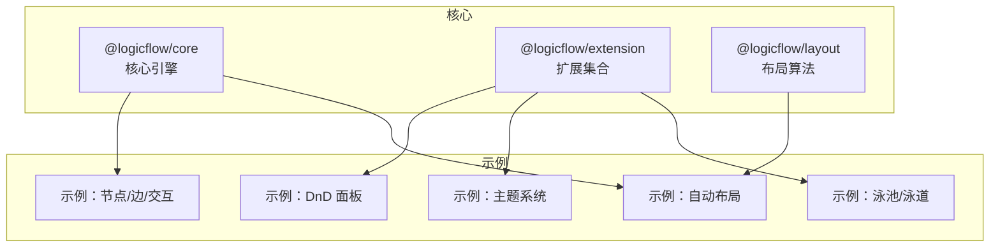
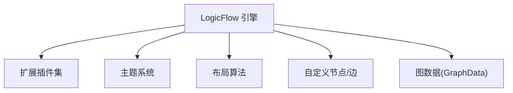
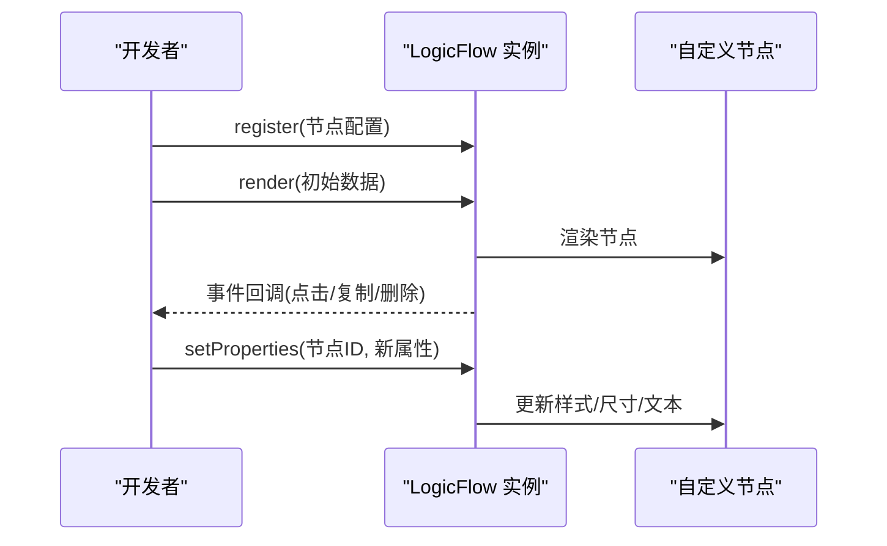
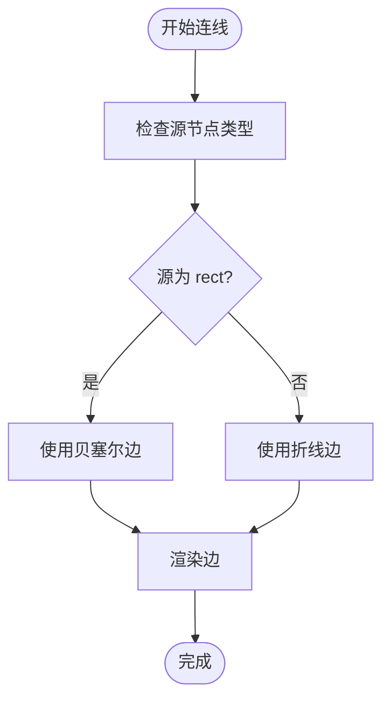
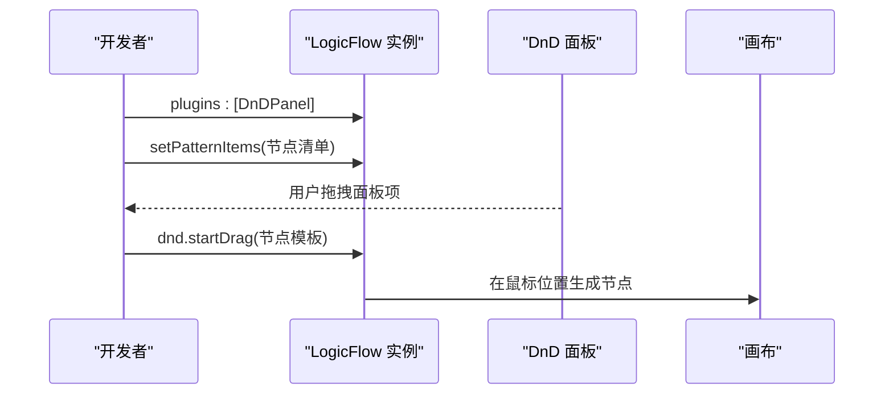
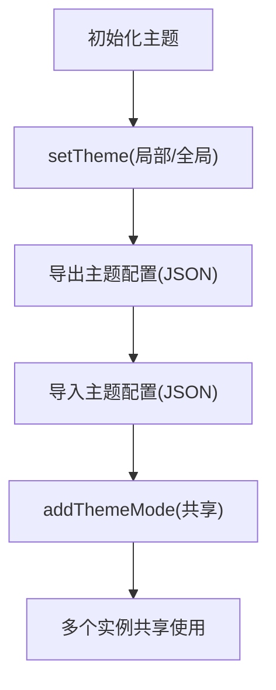
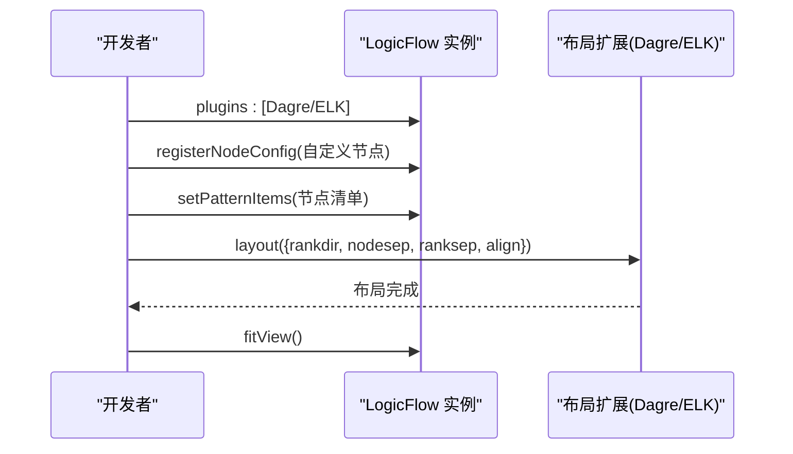
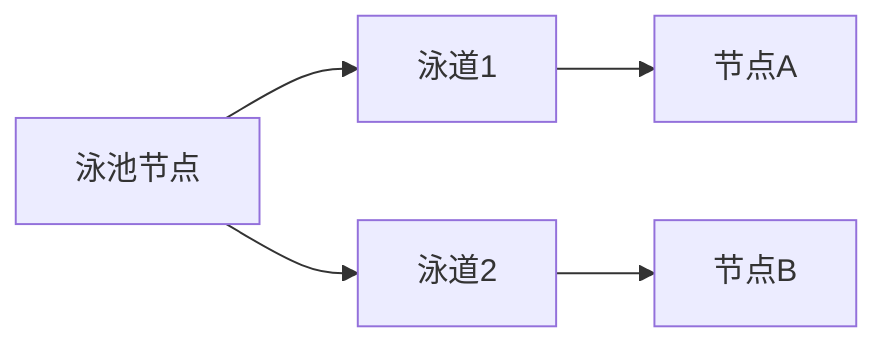
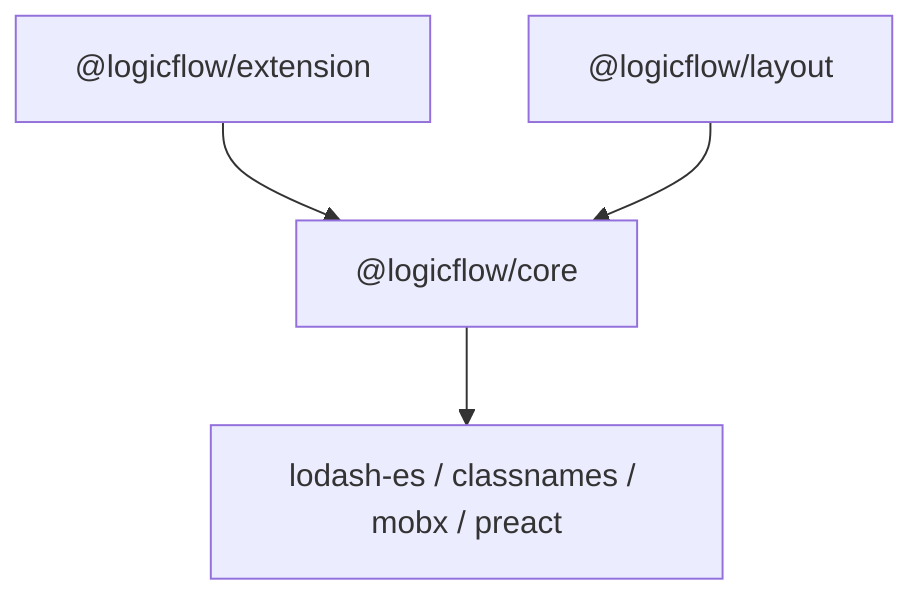

# 流程图设计系统

<cite>
**本文引用的文件**
- [packages/core/package.json](file://packages/core/package.json)
- [packages/engine/package.json](file://packages/engine/package.json)
- [packages/extension/package.json](file://packages/extension/package.json)
- [examples/feature-examples/src/pages/graph/index.tsx](file://examples/feature-examples/src/pages/graph/index.tsx)
- [examples/feature-examples/src/pages/theme/index.tsx](file://examples/feature-examples/src/pages/theme/index.tsx)
- [examples/feature-examples/src/pages/theme/config.ts](file://examples/feature-examples/src/pages/theme/config.ts)
- [examples/feature-examples/src/pages/theme/shared-theme.tsx](file://examples/feature-examples/src/pages/theme/shared-theme.tsx)
- [examples/feature-examples/src/pages/extensions/dnd-panel/index.tsx](file://examples/feature-examples/src/pages/extensions/dnd-panel/index.tsx)
- [examples/feature-examples/src/pages/layout/default/index.tsx](file://examples/feature-examples/src/pages/layout/default/index.tsx)
- [examples/feature-examples/src/pages/layout/custom/index.tsx](file://examples/feature-examples/src/pages/layout/custom/index.tsx)
- [examples/feature-examples/src/pages/nodes/custom/rect/index.tsx](file://examples/feature-examples/src/pages/nodes/custom/rect/index.tsx)
- [examples/feature-examples/src/pages/nodes/custom/icon/index.tsx](file://examples/feature-examples/src/pages/nodes/custom/icon/index.tsx)
- [examples/feature-examples/src/pages/nodes/custom/html/index.tsx](file://examples/feature-examples/src/pages/nodes/custom/html/index.tsx)
- [examples/feature-examples/src/pages/nodes/custom/pool/index.tsx](file://examples/feature-examples/src/pages/nodes/custom/pool/index.tsx)
</cite>

## 目录
1. [简介](#简介)
2. [项目结构](#项目结构)
3. [核心组件](#核心组件)
4. [架构总览](#架构总览)
5. [详细组件分析](#详细组件分析)
6. [依赖关系分析](#依赖关系分析)
7. [性能考虑](#性能考虑)
8. [故障排查指南](#故障排查指南)
9. [结论](#结论)
10. [附录](#附录)

## 简介
本项目是一个基于 LogicFlow 的流程图设计系统，提供节点与边的注册、拖拽面板集成、主题系统与样式定制、布局算法选择与配置、以及与 BPMN 标准的兼容与扩展能力。文档面向 UI/UX 开发者与前端工程师，帮助快速理解引擎核心、配置机制与最佳实践，并通过丰富的示例路径指导如何创建自定义节点、边与交互行为。

## 项目结构
系统采用多包架构，核心引擎、扩展模块与示例工程分离，便于按需引入与扩展：
- packages/core：LogicFlow 核心引擎，提供节点模型、边模型、视图渲染、事件系统等基础能力
- packages/extension：扩展能力集合，包括 DnD 面板、动态分组、菜单、迷你地图、泳池/泳道等
- packages/layout：布局算法扩展（Dagre、ELK），用于自动布局
- examples/feature-examples：功能示例，涵盖节点、边、主题、拖拽面板、布局、泳池等场景
- examples/engine-browser-examples：浏览器端引擎示例（含 BPMN 扩展）

**图表来源**
- [packages/core/package.json](file://packages/core/package.json#L1-L57)
- [packages/extension/package.json](file://packages/extension/package.json#L1-L61)
- [packages/engine/package.json](file://packages/engine/package.json#L1-L50)

**章节来源**
- [packages/core/package.json](file://packages/core/package.json#L1-L57)
- [packages/extension/package.json](file://packages/extension/package.json#L1-L61)
- [packages/engine/package.json](file://packages/engine/package.json#L1-L50)

## 核心组件
- LogicFlow 引擎：负责图数据建模、渲染、事件与交互、主题与样式系统
- 扩展模块：提供 DnD 面板、动态分组、菜单、迷你地图、泳池/泳道等增强能力
- 布局模块：提供 Dagre、ELK 等自动布局算法，支持方向与对齐配置
- 主题系统：支持内置主题模式、动态主题切换、主题导出/导入、共享主题

**章节来源**
- [examples/feature-examples/src/pages/graph/index.tsx](file://examples/feature-examples/src/pages/graph/index.tsx#L566-L732)
- [examples/feature-examples/src/pages/theme/index.tsx](file://examples/feature-examples/src/pages/theme/index.tsx#L696-L736)
- [examples/feature-examples/src/pages/extensions/dnd-panel/index.tsx](file://examples/feature-examples/src/pages/extensions/dnd-panel/index.tsx#L47-L100)
- [examples/feature-examples/src/pages/layout/custom/index.tsx](file://examples/feature-examples/src/pages/layout/custom/index.tsx#L411-L513)

## 架构总览
系统以 LogicFlow 为核心，通过插件化扩展与主题系统实现灵活的流程图编辑体验；布局算法作为独立扩展注入，支持 DAG/树形与 ELK 复杂拓扑布局。

**图表来源**
- [examples/feature-examples/src/pages/graph/index.tsx](file://examples/feature-examples/src/pages/graph/index.tsx#L682-L689)
- [examples/feature-examples/src/pages/theme/index.tsx](file://examples/feature-examples/src/pages/theme/index.tsx#L713-L727)
- [examples/feature-examples/src/pages/layout/custom/index.tsx](file://examples/feature-examples/src/pages/layout/custom/index.tsx#L429-L430)

## 详细组件分析

### 节点管理与自定义节点
- 注册与渲染：通过 register 或 batchRegister 注册自定义节点，render 渲染初始数据
- 属性与样式：节点 properties 支持尺寸、圆角、样式、文本样式等；可动态 setProperties 更新
- 交互事件：支持节点点击、复制、删除等事件回调，结合键盘快捷键实现批量操作

**图表来源**
- [examples/feature-examples/src/pages/nodes/custom/rect/index.tsx](file://examples/feature-examples/src/pages/nodes/custom/rect/index.tsx#L47-L117)
- [examples/feature-examples/src/pages/nodes/custom/icon/index.tsx](file://examples/feature-examples/src/pages/nodes/custom/icon/index.tsx#L71-L84)
- [examples/feature-examples/src/pages/nodes/custom/html/index.tsx](file://examples/feature-examples/src/pages/nodes/custom/html/index.tsx#L20-L41)

**章节来源**
- [examples/feature-examples/src/pages/nodes/custom/rect/index.tsx](file://examples/feature-examples/src/pages/nodes/custom/rect/index.tsx#L47-L319)
- [examples/feature-examples/src/pages/nodes/custom/icon/index.tsx](file://examples/feature-examples/src/pages/nodes/custom/icon/index.tsx#L71-L84)
- [examples/feature-examples/src/pages/nodes/custom/html/index.tsx](file://examples/feature-examples/src/pages/nodes/custom/html/index.tsx#L20-L41)

### 边连接处理与自定义边
- 边类型与属性：支持 polyline、bezier 等；可配置圆角半径、边距、箭头类型等
- 动态边生成：通过 edgeGenerator 在连线时根据源/目标节点类型动态选择边类型
- 文本与拖拽：支持边文本编辑、拖拽调整点、边文本拖拽

**图表来源**
- [examples/feature-examples/src/pages/graph/index.tsx](file://examples/feature-examples/src/pages/graph/index.tsx#L671-L677)
- [examples/feature-examples/src/pages/theme/index.tsx](file://examples/feature-examples/src/pages/theme/index.tsx#L721-L726)

**章节来源**
- [examples/feature-examples/src/pages/graph/index.tsx](file://examples/feature-examples/src/pages/graph/index.tsx#L671-L677)
- [examples/feature-examples/src/pages/theme/index.tsx](file://examples/feature-examples/src/pages/theme/index.tsx#L721-L726)

### 拖拽面板（DnD Panel）集成
- 插件启用：在 plugins 中注册 DndPanel，初始化后通过 setPatternItems 设置面板节点清单
- 拖拽行为：通过 lf.dnd.startDrag 或直接在面板项上触发拖拽，自动在画布上生成节点
- 自定义节点：可注册自定义节点并在面板中使用

**图表来源**
- [examples/feature-examples/src/pages/extensions/dnd-panel/index.tsx](file://examples/feature-examples/src/pages/extensions/dnd-panel/index.tsx#L52-L96)

**章节来源**
- [examples/feature-examples/src/pages/extensions/dnd-panel/index.tsx](file://examples/feature-examples/src/pages/extensions/dnd-panel/index.tsx#L47-L100)

### 主题系统与样式定制
- 内置主题模式：default、retro、colorful、dark 等
- 动态主题：通过 setTheme 动态切换主题；支持导出/导入主题配置
- 分类配置：主题字段按基础、节点、边、文本、其他元素分类，支持嵌套字段（如 hover、background、wrapPadding）
- 共享主题：通过静态方法 addThemeMode 注册共享主题，多个实例可同时应用

**图表来源**
- [examples/feature-examples/src/pages/theme/index.tsx](file://examples/feature-examples/src/pages/theme/index.tsx#L373-L390)
- [examples/feature-examples/src/pages/theme/config.ts](file://examples/feature-examples/src/pages/theme/config.ts#L174-L410)
- [examples/feature-examples/src/pages/theme/shared-theme.tsx](file://examples/feature-examples/src/pages/theme/shared-theme.tsx#L159-L180)

**章节来源**
- [examples/feature-examples/src/pages/theme/index.tsx](file://examples/feature-examples/src/pages/theme/index.tsx#L210-L736)
- [examples/feature-examples/src/pages/theme/config.ts](file://examples/feature-examples/src/pages/theme/config.ts#L174-L642)
- [examples/feature-examples/src/pages/theme/shared-theme.tsx](file://examples/feature-examples/src/pages/theme/shared-theme.tsx#L122-L303)

### 布局算法选择与配置
- 算法扩展：Dagre、ELK 作为扩展注入，支持 rankdir、nodesep、ranksep、align 等参数
- 使用方式：在初始化时 plugins 注入布局扩展，调用 layout 方法执行自动布局，fitView 适配视图
- 自定义节点：通过 registerNodeConfig 注册业务节点，配合布局算法实现复杂流程图

**图表来源**
- [examples/feature-examples/src/pages/layout/default/index.tsx](file://examples/feature-examples/src/pages/layout/default/index.tsx#L793-L800)
- [examples/feature-examples/src/pages/layout/custom/index.tsx](file://examples/feature-examples/src/pages/layout/custom/index.tsx#L429-L541)

**章节来源**
- [examples/feature-examples/src/pages/layout/default/index.tsx](file://examples/feature-examples/src/pages/layout/default/index.tsx#L793-L800)
- [examples/feature-examples/src/pages/layout/custom/index.tsx](file://examples/feature-examples/src/pages/layout/custom/index.tsx#L411-L541)

### 泳池/泳道节点与动态分组
- 动态分组：支持动态展开/折叠、子节点管理、层级控制
- 泳池/泳道：支持横向/纵向泳池，节点在泳道内层级与交互更清晰
- DnD 集成：通过 lf.dnd.startDrag 将面板项拖入泳池/泳道

**图表来源**
- [examples/feature-examples/src/pages/nodes/custom/pool/index.tsx](file://examples/feature-examples/src/pages/nodes/custom/pool/index.tsx#L44-L76)

**章节来源**
- [examples/feature-examples/src/pages/nodes/custom/pool/index.tsx](file://examples/feature-examples/src/pages/nodes/custom/pool/index.tsx#L19-L76)

### 与 BPMN 标准的兼容与扩展
- 扩展示例：engine-browser-examples 中包含 BPMN 扩展示例，展示如何扩展节点与图标
- 图标与工具：提供 BPMN 元素图标与工具，便于在流程图中复用
- 扩展方式：通过注册 BPMN 节点、边与工具，实现标准兼容与二次扩展

**章节来源**
- [examples/engine-browser-examples/src/pages/extension/bpmn/index.tsx](file://examples/engine-browser-examples/src/pages/extension/bpmn/index.tsx)

## 依赖关系分析
- @logicflow/core：核心引擎，提供基础模型与渲染
- @logicflow/extension：扩展插件集合，包含 DnD、动态分组、菜单、迷你地图等
- @logicflow/layout：布局算法扩展，支持 Dagre、ELK
- lodash-es、classnames、mobx、preact 等：通用依赖，支撑数据处理、样式合并、响应式状态与轻量虚拟 DOM

**图表来源**
- [packages/core/package.json](file://packages/core/package.json#L42-L51)
- [packages/extension/package.json](file://packages/extension/package.json#L42-L53)
- [packages/engine/package.json](file://packages/engine/package.json#L42-L44)

**章节来源**
- [packages/core/package.json](file://packages/core/package.json#L42-L51)
- [packages/extension/package.json](file://packages/extension/package.json#L42-L53)
- [packages/engine/package.json](file://packages/engine/package.json#L42-L44)

## 性能考虑
- 渲染与视图：合理使用 fitView、translateCenter 控制视口，避免频繁全量重绘
- 事件与回调：减少高频事件（如 history:change）中的重计算，必要时节流/防抖
- 主题与样式：批量 setTheme 或局部 setTheme，避免逐项更新导致的多次渲染
- 布局：布局算法参数（nodesep/ranksep/align）应与数据规模匹配，避免过度密集导致布局耗时
- 大数据量：优先使用 partial 渲染、懒加载节点与边，按需更新

## 故障排查指南
- 节点/边未渲染：确认已注册节点/边配置，render 数据结构正确
- DnD 不生效：检查 plugins 是否包含 DndPanel，setPatternItems 是否设置
- 主题不生效：确认 setTheme 参数与主题字段一致，注意嵌套字段（如 hover、background）
- 布局异常：检查布局参数（rankdir、align）与节点锚点配置，确保 isDefaultAnchor 设置
- 事件未触发：核对事件名与回调绑定，确认未被覆盖或提前销毁

**章节来源**
- [examples/feature-examples/src/pages/graph/index.tsx](file://examples/feature-examples/src/pages/graph/index.tsx#L598-L615)
- [examples/feature-examples/src/pages/theme/index.tsx](file://examples/feature-examples/src/pages/theme/index.tsx#L652-L674)
- [examples/feature-examples/src/pages/layout/custom/index.tsx](file://examples/feature-examples/src/pages/layout/custom/index.tsx#L516-L541)

## 结论
本系统以 LogicFlow 为核心，通过插件化扩展与主题系统实现了强大的流程图设计能力。DnD 面板、自动布局、泳池/泳道与主题定制为 UI/UX 开发提供了高效工具链；BPMN 扩展示例展示了标准兼容与扩展能力。遵循本文的最佳实践与性能建议，可在保证交互流畅的同时，快速构建复杂的流程图应用。

## 附录
- 快速开始示例路径
  - 基础节点与边：[examples/feature-examples/src/pages/graph/index.tsx](file://examples/feature-examples/src/pages/graph/index.tsx#L566-L732)
  - 主题系统与导出/导入：[examples/feature-examples/src/pages/theme/index.tsx](file://examples/feature-examples/src/pages/theme/index.tsx#L696-L736)
  - DnD 面板：[examples/feature-examples/src/pages/extensions/dnd-panel/index.tsx](file://examples/feature-examples/src/pages/extensions/dnd-panel/index.tsx#L47-L100)
  - 自动布局（Dagre/ELK）：[examples/feature-examples/src/pages/layout/custom/index.tsx](file://examples/feature-examples/src/pages/layout/custom/index.tsx#L411-L541)
  - 泳池/泳道：[examples/feature-examples/src/pages/nodes/custom/pool/index.tsx](file://examples/feature-examples/src/pages/nodes/custom/pool/index.tsx#L19-L76)
  - 自定义节点（矩形/图标/HTML）：[examples/feature-examples/src/pages/nodes/custom/rect/index.tsx](file://examples/feature-examples/src/pages/nodes/custom/rect/index.tsx#L47-L319)，[examples/feature-examples/src/pages/nodes/custom/icon/index.tsx](file://examples/feature-examples/src/pages/nodes/custom/icon/index.tsx#L71-L84)，[examples/feature-examples/src/pages/nodes/custom/html/index.tsx](file://examples/feature-examples/src/pages/nodes/custom/html/index.tsx#L20-L41)