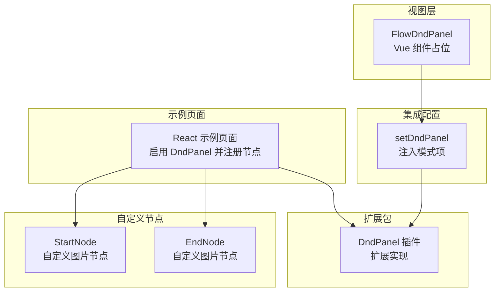
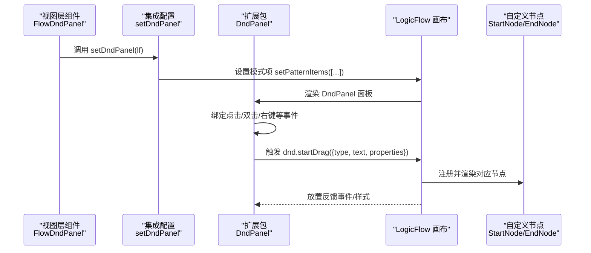
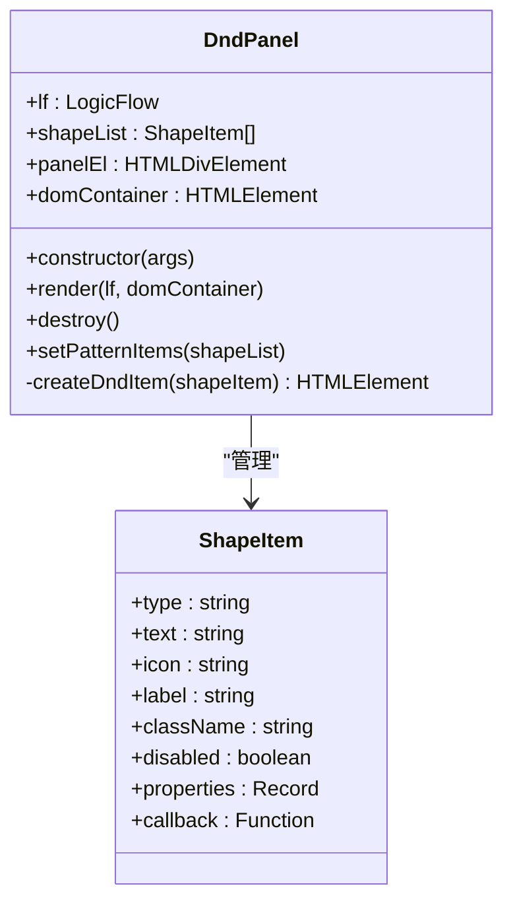
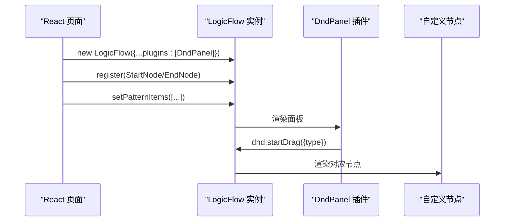
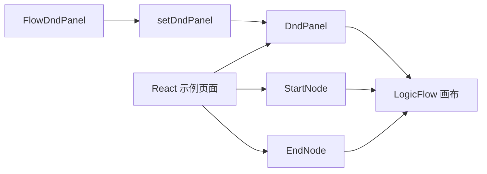

# 拖拽面板集成

<cite>
**本文引用的文件**
- [flow-dnd-panel.tsx](file://src/views/flow/design/flow-dnd-panel.tsx)
- [set-dnd-panel.ts](file://src/views/flow/design/set-dnd-panel.ts)
- [index.tsx（React 示例）](file://examples/feature-examples/src/pages/extensions/dnd-panel/index.tsx)
- [index.less（React 示例样式）](file://examples/feature-examples/src/pages/extensions/dnd-panel/index.less)
- [start.ts（自定义节点 StartNode）](file://examples/feature-examples/src/pages/extensions/dnd-panel/nodes/start.ts)
- [end.ts（自定义节点 EndNode）](file://examples/feature-examples/src/pages/extensions/dnd-panel/nodes/end.ts)
- [index.ts（扩展包 DndPanel 组件）](file://packages/extension/src/components/dnd-panel/index.ts)
- [index.ts（引擎入口）](file://packages/engine/src/index.ts)
</cite>

## 目录
1. [简介](#简介)
2. [项目结构](#项目结构)
3. [核心组件](#核心组件)
4. [架构总览](#架构总览)
5. [组件详解](#组件详解)
6. [依赖关系分析](#依赖关系分析)
7. [性能考量](#性能考量)
8. [故障排查指南](#故障排查指南)
9. [结论](#结论)
10. [附录](#附录)

## 简介
本文件面向“拖拽面板集成”的落地实践，围绕 FlowDndPanel 组件的实现原理、配置项、节点分类与布局设计、拖拽事件处理机制、节点预览与放置反馈、面板与主流程图画布的交互与数据传递进行系统性说明，并提供可操作的定制指南与最佳实践。

## 项目结构
本仓库中与拖拽面板相关的关键位置如下：
- 视图层组件：FlowDndPanel（Vue 组件占位）
- 集成配置：setDndPanel（为 LogicFlow 注入 DndPanel 模式项）
- 扩展包实现：DndPanel（LogicFlow 扩展插件）
- 示例页面：React 示例页面演示如何启用 DndPanel 并注册自定义节点
- 自定义节点：StartNode、EndNode（基于自定义图片节点）

图表来源
- [flow-dnd-panel.tsx](file://src/views/flow/design/flow-dnd-panel.tsx#L1-L23)
- [set-dnd-panel.ts](file://src/views/flow/design/set-dnd-panel.ts#L1-L55)
- [index.ts（扩展包 DndPanel 组件）](file://packages/extension/src/components/dnd-panel/index.ts#L1-L138)
- [index.tsx（React 示例）](file://examples/feature-examples/src/pages/extensions/dnd-panel/index.tsx#L1-L108)
- [start.ts（自定义节点 StartNode）](file://examples/feature-examples/src/pages/extensions/dnd-panel/nodes/start.ts#L1-L24)
- [end.ts（自定义节点 EndNode）](file://examples/feature-examples/src/pages/extensions/dnd-panel/nodes/end.ts#L1-L24)

章节来源
- [flow-dnd-panel.tsx](file://src/views/flow/design/flow-dnd-panel.tsx#L1-L23)
- [set-dnd-panel.ts](file://src/views/flow/design/set-dnd-panel.ts#L1-L55)
- [index.ts（扩展包 DndPanel 组件）](file://packages/extension/src/components/dnd-panel/index.ts#L1-L138)
- [index.tsx（React 示例）](file://examples/feature-examples/src/pages/extensions/dnd-panel/index.tsx#L1-L108)
- [start.ts（自定义节点 StartNode）](file://examples/feature-examples/src/pages/extensions/dnd-panel/nodes/start.ts#L1-L24)
- [end.ts（自定义节点 EndNode）](file://examples/feature-examples/src/pages/extensions/dnd-panel/nodes/end.ts#L1-L24)

## 核心组件
- FlowDndPanel（Vue 组件占位）：当前为占位实现，后续可在此基础上封装 DndPanel 的 Vue 版本或与现有 setDndPanel 配置对接。
- setDndPanel：向 LogicFlow 注入一组“模式项”（Pattern Items），用于在拖拽面板上展示可拖拽的节点模板。
- DndPanel（扩展包实现）：LogicFlow 扩展插件，负责渲染拖拽面板、绑定事件、触发画布的 DnD 拖拽流程。
- React 示例页面：演示如何启用 DndPanel 插件、注册自定义节点并设置模式项。
- 自定义节点：StartNode、EndNode 基于自定义图片节点，通过 lf.register 注册到画布。

章节来源
- [flow-dnd-panel.tsx](file://src/views/flow/design/flow-dnd-panel.tsx#L1-L23)
- [set-dnd-panel.ts](file://src/views/flow/design/set-dnd-panel.ts#L1-L55)
- [index.ts（扩展包 DndPanel 组件）](file://packages/extension/src/components/dnd-panel/index.ts#L1-L138)
- [index.tsx（React 示例）](file://examples/feature-examples/src/pages/extensions/dnd-panel/index.tsx#L1-L108)
- [start.ts（自定义节点 StartNode）](file://examples/feature-examples/src/pages/extensions/dnd-panel/nodes/start.ts#L1-L24)
- [end.ts（自定义节点 EndNode）](file://examples/feature-examples/src/pages/extensions/dnd-panel/nodes/end.ts#L1-L24)

## 架构总览
下图展示了从视图层到扩展包再到画布的整体交互路径：

图表来源
- [flow-dnd-panel.tsx](file://src/views/flow/design/flow-dnd-panel.tsx#L1-L23)
- [set-dnd-panel.ts](file://src/views/flow/design/set-dnd-panel.ts#L1-L55)
- [index.ts（扩展包 DndPanel 组件）](file://packages/extension/src/components/dnd-panel/index.ts#L1-L138)
- [index.tsx（React 示例）](file://examples/feature-examples/src/pages/extensions/dnd-panel/index.tsx#L1-L108)
- [start.ts（自定义节点 StartNode）](file://examples/feature-examples/src/pages/extensions/dnd-panel/nodes/start.ts#L1-L24)
- [end.ts（自定义节点 EndNode）](file://examples/feature-examples/src/pages/extensions/dnd-panel/nodes/end.ts#L1-L24)

## 组件详解

### FlowDndPanel 组件（Vue 占位）
- 当前实现为最小占位，返回一个包含标识文本的容器元素。
- 后续可在此组件内：
  - 封装 DndPanel 的 Vue 版本
  - 或通过 props 接收外部传入的模式项，再调用 setDndPanel 或直接注入扩展包

章节来源
- [flow-dnd-panel.tsx](file://src/views/flow/design/flow-dnd-panel.tsx#L1-L23)

### setDndPanel 集成配置
- 作用：为 LogicFlow 注入一组“模式项”，用于在拖拽面板上展示。
- 关键点：
  - 支持 label、className、icon、type、text、properties、disabled、callback 等字段
  - 支持通过 callback 在禁用状态下仍触发回调（如提示）
  - 支持 openSelectionSelect 等交互流程（通过 lf.openSelectionSelect/once/closeSelectionSelect）

章节来源
- [set-dnd-panel.ts](file://src/views/flow/design/set-dnd-panel.ts#L1-L55)

### DndPanel 扩展包实现
- 渲染逻辑：
  - render：根据 shapeList 创建面板 DOM，挂载到指定容器
  - destroy：移除面板 DOM
  - setPatternItems：支持运行时更新面板内容
- 事件绑定：
  - pointerdown：触发 lf.dnd.startDrag，携带 type、text、properties
  - click/dblclick/contextmenu：通过 eventCenter 发出 dnd:panel-* 事件，便于外部监听
  - disabled：禁用项仅触发回调，不发起拖拽
- 样式与图标：
  - 通过 className 和背景图设置图标
  - 支持 label 文案显示

图表来源
- [index.ts（扩展包 DndPanel 组件）](file://packages/extension/src/components/dnd-panel/index.ts#L1-L138)

章节来源
- [index.ts（扩展包 DndPanel 组件）](file://packages/extension/src/components/dnd-panel/index.ts#L1-L138)

### React 示例页面与自定义节点
- 启用 DndPanel 插件并渲染画布
- 注册自定义节点（StartNode/EndNode），并通过 lf.setPatternItems 设置模式项
- 通过样式控制图标尺寸与容器布局

图表来源
- [index.tsx（React 示例）](file://examples/feature-examples/src/pages/extensions/dnd-panel/index.tsx#L1-L108)
- [start.ts（自定义节点 StartNode）](file://examples/feature-examples/src/pages/extensions/dnd-panel/nodes/start.ts#L1-L24)
- [end.ts（自定义节点 EndNode）](file://examples/feature-examples/src/pages/extensions/dnd-panel/nodes/end.ts#L1-L24)

章节来源
- [index.tsx（React 示例）](file://examples/feature-examples/src/pages/extensions/dnd-panel/index.tsx#L1-L108)
- [index.less（React 示例样式）](file://examples/feature-examples/src/pages/extensions/dnd-panel/index.less#L1-L12)
- [start.ts（自定义节点 StartNode）](file://examples/feature-examples/src/pages/extensions/dnd-panel/nodes/start.ts#L1-L24)
- [end.ts（自定义节点 EndNode）](file://examples/feature-examples/src/pages/extensions/dnd-panel/nodes/end.ts#L1-L24)

### 节点分类与布局设计
- 分类维度：
  - 基础几何形状：circle、rect、diamond
  - 自定义图片节点：start、end
  - 自定义业务节点：可通过注册扩展节点实现
- 布局设计建议：
  - 使用 className 控制面板项样式，结合图标与 label 显示
  - 通过 disabled 字段区分不可用项，配合 callback 提示
  - 通过 properties 传递节点初始属性，减少放置后的二次编辑

章节来源
- [set-dnd-panel.ts](file://src/views/flow/design/set-dnd-panel.ts#L1-L55)
- [index.ts（扩展包 DndPanel 组件）](file://packages/extension/src/components/dnd-panel/index.ts#L1-L138)
- [start.ts（自定义节点 StartNode）](file://examples/feature-examples/src/pages/extensions/dnd-panel/nodes/start.ts#L1-L24)
- [end.ts（自定义节点 EndNode）](file://examples/feature-examples/src/pages/extensions/dnd-panel/nodes/end.ts#L1-L24)

### 拖拽事件处理机制
- 面板事件：
  - pointerdown：触发 lf.dnd.startDrag，携带 type/text/properties
  - click/dblclick/contextmenu：通过 eventCenter 发出 dnd:panel-* 事件
- 画布侧：
  - 通过 lf.dnd.startDrag 进入拖拽态
  - 放置完成后，由画布根据 type 渲染对应节点
- 回调与交互：
  - callback 可用于打开选择框、提示等交互
  - 通过 once 订阅 selection:selected 事件并在放置后关闭选择态

章节来源
- [index.ts（扩展包 DndPanel 组件）](file://packages/extension/src/components/dnd-panel/index.ts#L1-L138)
- [set-dnd-panel.ts](file://src/views/flow/design/set-dnd-panel.ts#L1-L55)

### 节点预览与放置反馈
- 预览：面板项通过 icon 与 label 提供直观预览
- 放置反馈：通过事件中心发出 dnd:panel-* 事件，可在外部监听并更新 UI 或日志
- 交互提示：禁用项通过 callback 提示用户当前不可用

章节来源
- [index.ts（扩展包 DndPanel 组件）](file://packages/extension/src/components/dnd-panel/index.ts#L1-L138)

### 面板与主流程图画布的交互与数据传递
- 数据传递：
  - setPatternItems 提供节点类型、图标、标签、样式类名、属性等
  - dnd.startDrag 传递 type/text/properties 到画布
- 交互流程：
  - 面板 -> 画布：事件触发（drag、click、dbclick、contextmenu）
  - 画布 -> 面板：渲染更新（setPatternItems 后重新渲染）

章节来源
- [set-dnd-panel.ts](file://src/views/flow/design/set-dnd-panel.ts#L1-L55)
- [index.ts（扩展包 DndPanel 组件）](file://packages/extension/src/components/dnd-panel/index.ts#L1-L138)

## 依赖关系分析
- FlowDndPanel 与 setDndPanel：视图层通过 setDndPanel 注入模式项，形成“配置-渲染”闭环
- setDndPanel 与 DndPanel：setDndPanel 负责配置，DndPanel 负责渲染与事件绑定
- React 示例页面与 DndPanel：示例页面启用插件并注册节点，驱动 DndPanel 工作
- 自定义节点与 DndPanel：通过 lf.register 注册，DndPanel 的模式项与之对应

图表来源
- [flow-dnd-panel.tsx](file://src/views/flow/design/flow-dnd-panel.tsx#L1-L23)
- [set-dnd-panel.ts](file://src/views/flow/design/set-dnd-panel.ts#L1-L55)
- [index.ts（扩展包 DndPanel 组件）](file://packages/extension/src/components/dnd-panel/index.ts#L1-L138)
- [index.tsx（React 示例）](file://examples/feature-examples/src/pages/extensions/dnd-panel/index.tsx#L1-L108)
- [start.ts（自定义节点 StartNode）](file://examples/feature-examples/src/pages/extensions/dnd-panel/nodes/start.ts#L1-L24)
- [end.ts（自定义节点 EndNode）](file://examples/feature-examples/src/pages/extensions/dnd-panel/nodes/end.ts#L1-L24)

章节来源
- [flow-dnd-panel.tsx](file://src/views/flow/design/flow-dnd-panel.tsx#L1-L23)
- [set-dnd-panel.ts](file://src/views/flow/design/set-dnd-panel.ts#L1-L55)
- [index.ts（扩展包 DndPanel 组件）](file://packages/extension/src/components/dnd-panel/index.ts#L1-L138)
- [index.tsx（React 示例）](file://examples/feature-examples/src/pages/extensions/dnd-panel/index.tsx#L1-L108)
- [start.ts（自定义节点 StartNode）](file://examples/feature-examples/src/pages/extensions/dnd-panel/nodes/start.ts#L1-L24)
- [end.ts（自定义节点 EndNode）](file://examples/feature-examples/src/pages/extensions/dnd-panel/nodes/end.ts#L1-L24)

## 性能考量
- 面板渲染：首次无数据时延迟渲染，setPatternItems 后再渲染，避免空面板占用
- 事件绑定：仅在面板项存在时绑定 pointer/click/dblclick/contextmenu，减少无效事件
- 图标加载：建议使用缓存友好的图标地址或本地 base64，降低网络抖动对体验的影响
- 大量节点：若模式项较多，建议分组或懒加载，避免一次性渲染过多 DOM

章节来源
- [index.ts（扩展包 DndPanel 组件）](file://packages/extension/src/components/dnd-panel/index.ts#L1-L138)

## 故障排查指南
- 面板不显示：
  - 检查是否调用 setPatternItems 并传入有效数组
  - 确认 DOM 容器存在且可挂载
- 拖拽无效：
  - 确认 DndPanel 插件已正确启用
  - 检查回调函数中是否调用了 lf.dnd.startDrag
- 点击无响应：
  - 确认未将该项标记为 disabled；若为禁用项，需通过 callback 提示
- 图标不显示：
  - 检查 icon 地址是否可访问，或使用 base64
- 事件未触发：
  - 检查 eventCenter 是否被正确监听 dnd:panel-* 事件

章节来源
- [index.ts（扩展包 DndPanel 组件）](file://packages/extension/src/components/dnd-panel/index.ts#L1-L138)
- [set-dnd-panel.ts](file://src/views/flow/design/set-dnd-panel.ts#L1-L55)

## 结论
通过 setDndPanel 与 DndPanel 的协同，可以在 LogicFlow 中快速构建可拖拽的节点面板，并以事件中心与回调机制实现丰富的交互与反馈。结合自定义节点注册与样式配置，可满足多样化的流程图绘制需求。后续可在 FlowDndPanel 中进一步封装 Vue 版本或与现有配置解耦，提升复用性与可维护性。

## 附录

### 配置项与字段说明
- 类型：节点类型字符串
- 文本：节点文本值
- 图标：图标 URL 或 base64
- 标签：面板项显示名称
- 样式类名：面板项样式类
- 禁用：是否禁用拖拽
- 属性：节点初始化属性对象
- 回调：点击/双击/右键等事件回调

章节来源
- [index.ts（扩展包 DndPanel 组件）](file://packages/extension/src/components/dnd-panel/index.ts#L1-L138)
- [set-dnd-panel.ts](file://src/views/flow/design/set-dnd-panel.ts#L1-L55)

### 最佳实践建议
- 使用 className 与样式隔离面板项样式，避免污染全局
- 对关键节点提供 label 与 icon，提升识别度
- 对不可用项保留 callback 提示，改善用户体验
- 通过 properties 传递默认属性，减少放置后的二次编辑
- 使用事件中心统一处理面板交互，便于扩展与维护

章节来源
- [index.ts（扩展包 DndPanel 组件）](file://packages/extension/src/components/dnd-panel/index.ts#L1-L138)
- [index.tsx（React 示例）](file://examples/feature-examples/src/pages/extensions/dnd-panel/index.tsx#L1-L108)
- [index.less（React 示例样式）](file://examples/feature-examples/src/pages/extensions/dnd-panel/index.less#L1-L12)