# 自定义节点开发

<cite>
**本文引用的文件**
- [examples/feature-examples/src/components/nodes/custom-rect/index.tsx](file://examples/feature-examples/src/components/nodes/custom-rect/index.tsx)
- [examples/feature-examples/src/components/nodes/custom-ellipse/index.tsx](file://examples/feature-examples/src/components/nodes/custom-ellipse/index.tsx)
- [examples/feature-examples/src/components/nodes/custom-diamond/index.tsx](file://examples/feature-examples/src/components/nodes/custom-diamond/index.tsx)
- [examples/feature-examples/src/components/nodes/custom-polygon/index.tsx](file://examples/feature-examples/src/components/nodes/custom-polygon/index.tsx)
- [examples/feature-examples/src/components/nodes/custom-html/index.ts](file://examples/feature-examples/src/components/nodes/custom-html/index.ts)
- [examples/feature-examples/src/components/nodes/custom-html/Html.tsx](file://examples/feature-examples/src/components/nodes/custom-html/Html.tsx)
- [examples/feature-examples/src/components/nodes/custom-html/Image.tsx](file://examples/feature-examples/src/components/nodes/custom-html/Image.tsx)
- [examples/feature-examples/src/components/nodes/custom-html/Icon.tsx](file://examples/feature-examples/src/components/nodes/custom-html/Icon.tsx)
- [examples/feature-examples/src/components/nodes/freeAnchor-rect/index.tsx](file://examples/feature-examples/src/components/nodes/freeAnchor-rect/index.tsx)
- [examples/feature-examples/src/components/nodes/freeAnchor-circle/index.tsx](file://examples/feature-examples/src/components/nodes/freeAnchor-circle/index.tsx)
- [examples/feature-examples/src/pages/nodes/custom/html/index.tsx](file://examples/feature-examples/src/pages/nodes/custom/html/index.tsx)
- [examples/feature-examples/src/pages/nodes/custom/image/index.tsx](file://examples/feature-examples/src/pages/nodes/custom/image/index.tsx)
- [examples/feature-examples/src/pages/nodes/custom/icon/index.tsx](file://examples/feature-examples/src/pages/nodes/custom/icon/index.tsx)
- [examples/engine-browser-examples/src/pages/graph/nodes/index.ts](file://examples/engine-browser-examples/src/pages/graph/nodes/index.ts)
- [examples/feature-examples/src/pages/graph/nodes/index.ts](file://examples/feature-examples/src/pages/graph/nodes/index.ts)
</cite>

## 目录
1. [简介](#简介)
2. [项目结构](#项目结构)
3. [核心组件](#核心组件)
4. [架构总览](#架构总览)
5. [详细组件分析](#详细组件分析)
6. [依赖分析](#依赖分析)
7. [性能考虑](#性能考虑)
8. [故障排查指南](#故障排查指南)
9. [结论](#结论)
10. [附录：开发模板与调试技巧](#附录开发模板与调试技巧)

## 简介
本指南面向使用 LogicFlow 的开发者，系统讲解如何从零构建自定义节点，覆盖节点模型（Model）、视图组件（View）与数据模型（Properties）的设计方法；详解节点属性定义、事件处理与交互逻辑；阐述节点样式定制、主题适配与响应式设计；说明节点锚点系统、连接规则与验证机制；并提供 HTML 节点、图片节点、图标节点、自由锚点节点等多类型示例，最后给出可复用的开发模板与调试技巧。

## 项目结构
围绕自定义节点，仓库中与“节点”相关的关键目录与文件如下：
- 组件层（自定义节点实现）
  - 矩形、椭圆、菱形、多边形等基础形状节点
  - HTML、图片、图标等复合节点
  - 自由锚点矩形与圆形节点
- 页面层（示例页面）
  - 注册与渲染自定义节点的示例页面
- 导出入口（节点注册）
  - 统一导出各节点模块，便于在页面中注册

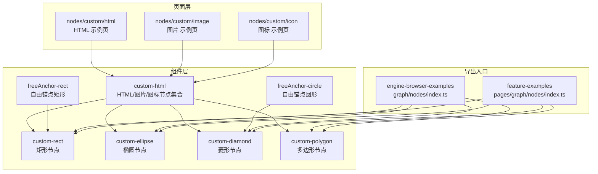

图表来源
- [examples/feature-examples/src/components/nodes/custom-rect/index.tsx](file://examples/feature-examples/src/components/nodes/custom-rect/index.tsx#L1-L81)
- [examples/feature-examples/src/components/nodes/custom-ellipse/index.tsx](file://examples/feature-examples/src/components/nodes/custom-ellipse/index.tsx#L1-L70)
- [examples/feature-examples/src/components/nodes/custom-diamond/index.tsx](file://examples/feature-examples/src/components/nodes/custom-diamond/index.tsx#L1-L28)
- [examples/feature-examples/src/components/nodes/custom-polygon/index.tsx](file://examples/feature-examples/src/components/nodes/custom-polygon/index.tsx#L1-L30)
- [examples/feature-examples/src/components/nodes/custom-html/index.ts](file://examples/feature-examples/src/components/nodes/custom-html/index.ts#L1-L7)
- [examples/feature-examples/src/components/nodes/freeAnchor-rect/index.tsx](file://examples/feature-examples/src/components/nodes/freeAnchor-rect/index.tsx#L1-L232)
- [examples/feature-examples/src/components/nodes/freeAnchor-circle/index.tsx](file://examples/feature-examples/src/components/nodes/freeAnchor-circle/index.tsx#L1-L194)
- [examples/feature-examples/src/pages/nodes/custom/html/index.tsx](file://examples/feature-examples/src/pages/nodes/custom/html/index.tsx#L1-L49)
- [examples/feature-examples/src/pages/nodes/custom/image/index.tsx](file://examples/feature-examples/src/pages/nodes/custom/image/index.tsx#L1-L92)
- [examples/feature-examples/src/pages/nodes/custom/icon/index.tsx](file://examples/feature-examples/src/pages/nodes/custom/icon/index.tsx#L1-L95)
- [examples/engine-browser-examples/src/pages/graph/nodes/index.ts](file://examples/engine-browser-examples/src/pages/graph/nodes/index.ts#L1-L16)
- [examples/feature-examples/src/pages/graph/nodes/index.ts](file://examples/feature-examples/src/pages/graph/nodes/index.ts#L1-L14)

章节来源
- [examples/engine-browser-examples/src/pages/graph/nodes/index.ts](file://examples/engine-browser-examples/src/pages/graph/nodes/index.ts#L1-L16)
- [examples/feature-examples/src/pages/graph/nodes/index.ts](file://examples/feature-examples/src/pages/graph/nodes/index.ts#L1-L14)

## 核心组件
- 节点模型（Model）
  - 负责节点的数据、样式、文本样式、锚点计算与连接规则
  - 常见基类：RectNodeModel、EllipseNodeModel、DiamondNodeModel、PolygonNodeModel、HtmlNodeModel、CircleNodeModel
- 视图组件（View）
  - 负责节点的绘制与交互渲染
  - 常见基类：RectNode、EllipseNode、DiamondNode、PolygonNode、HtmlNode、CircleNode
- 数据模型（Properties）
  - 通过节点配置中的 properties 字段传入，驱动节点尺寸、样式、文本位置等

章节来源
- [examples/feature-examples/src/components/nodes/custom-rect/index.tsx](file://examples/feature-examples/src/components/nodes/custom-rect/index.tsx#L21-L74)
- [examples/feature-examples/src/components/nodes/custom-ellipse/index.tsx](file://examples/feature-examples/src/components/nodes/custom-ellipse/index.tsx#L20-L63)
- [examples/feature-examples/src/components/nodes/custom-diamond/index.tsx](file://examples/feature-examples/src/components/nodes/custom-diamond/index.tsx#L4-L21)
- [examples/feature-examples/src/components/nodes/custom-polygon/index.tsx](file://examples/feature-examples/src/components/nodes/custom-polygon/index.tsx#L4-L23)
- [examples/feature-examples/src/components/nodes/custom-html/Html.tsx](file://examples/feature-examples/src/components/nodes/custom-html/Html.tsx#L44-L55)
- [examples/feature-examples/src/components/nodes/freeAnchor-rect/index.tsx](file://examples/feature-examples/src/components/nodes/freeAnchor-rect/index.tsx#L4-L156)
- [examples/feature-examples/src/components/nodes/freeAnchor-circle/index.tsx](file://examples/feature-examples/src/components/nodes/freeAnchor-circle/index.tsx#L4-L150)

## 架构总览
自定义节点遵循“注册-渲染-交互”的标准流程：页面创建 LogicFlow 实例，调用 register 注册节点，再 render 渲染数据。节点内部通过 Model 控制数据与样式，View 负责绘制与事件绑定。

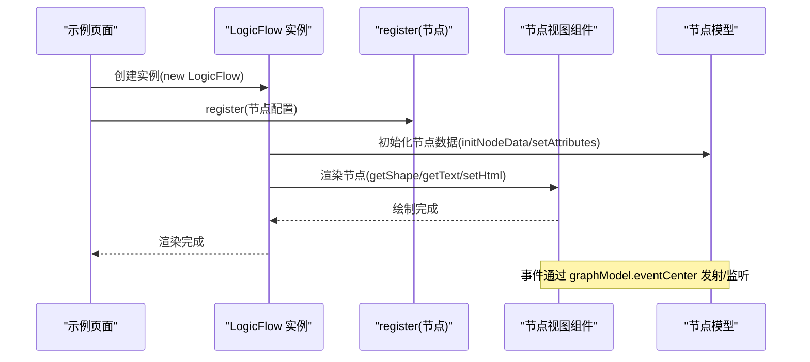

图表来源
- [examples/feature-examples/src/pages/nodes/custom/html/index.tsx](file://examples/feature-examples/src/pages/nodes/custom/html/index.tsx#L20-L41)
- [examples/feature-examples/src/components/nodes/custom-html/Html.tsx](file://examples/feature-examples/src/components/nodes/custom-html/Html.tsx#L14-L42)

## 详细组件分析

### 矩形节点（自定义属性与样式）
- 关键点
  - 通过 properties 定义 width、height、radius、textStyle、style 等
  - 在 setAttributes 中应用尺寸与圆角
  - 重写 getNodeStyle 与 getTextStyle 应用主题与文本偏移
- 适用场景
  - 需要统一尺寸与圆角的业务节点
- 开发要点
  - 使用 cloneDeep 合并样式，避免污染默认主题
  - 文本位置通过 transform 进行矩阵偏移

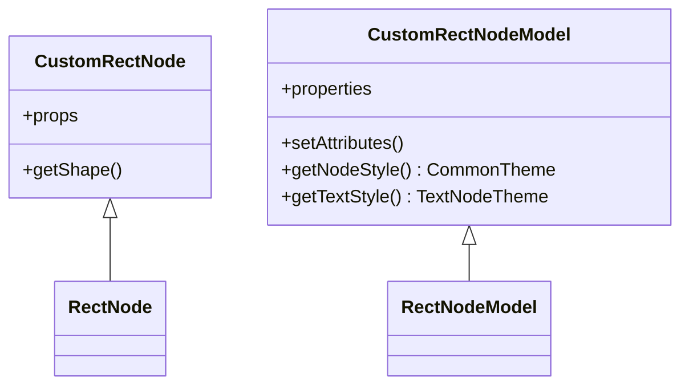

图表来源
- [examples/feature-examples/src/components/nodes/custom-rect/index.tsx](file://examples/feature-examples/src/components/nodes/custom-rect/index.tsx#L19-L74)

章节来源
- [examples/feature-examples/src/components/nodes/custom-rect/index.tsx](file://examples/feature-examples/src/components/nodes/custom-rect/index.tsx#L4-L74)

### 椭圆节点（自定义属性与样式）
- 关键点
  - 通过 properties 定义 rx、ry、refX、refY、style、textStyle
  - 在 initNodeData 或 setAttributes 中设置椭圆半径
  - 重写样式与文本样式，支持文本偏移
- 适用场景
  - 流程网关、状态节点等需要椭圆外观的节点

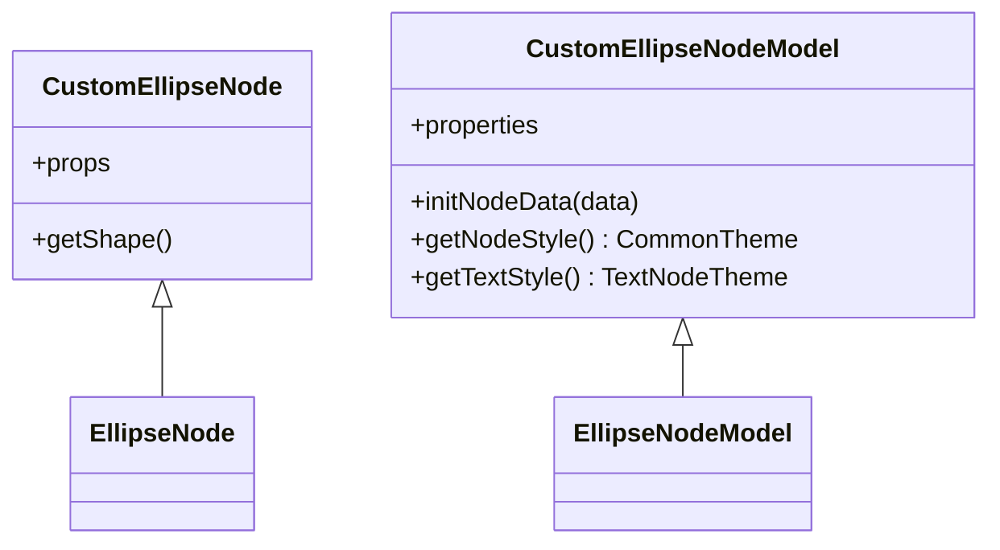

图表来源
- [examples/feature-examples/src/components/nodes/custom-ellipse/index.tsx](file://examples/feature-examples/src/components/nodes/custom-ellipse/index.tsx#L18-L63)

章节来源
- [examples/feature-examples/src/components/nodes/custom-ellipse/index.tsx](file://examples/feature-examples/src/components/nodes/custom-ellipse/index.tsx#L4-L63)

### 菱形节点（自定义属性与样式）
- 关键点
  - 通过 properties 定义 rx、ry 等
  - 在 initNodeData 中设置菱形半径
- 适用场景
  - 条件判断节点

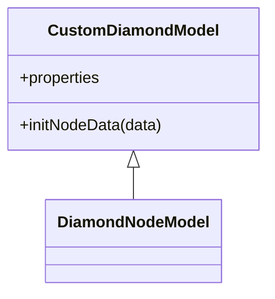

图表来源
- [examples/feature-examples/src/components/nodes/custom-diamond/index.tsx](file://examples/feature-examples/src/components/nodes/custom-diamond/index.tsx#L4-L21)

章节来源
- [examples/feature-examples/src/components/nodes/custom-diamond/index.tsx](file://examples/feature-examples/src/components/nodes/custom-diamond/index.tsx#L10-L21)

### 多边形节点（自定义顶点）
- 关键点
  - 通过 properties 或 initNodeData 设置 points
  - 支持自定义形状（如闪电）
- 适用场景
  - 特殊形状的流程节点

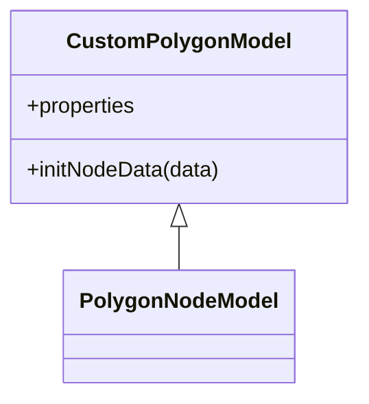

图表来源
- [examples/feature-examples/src/components/nodes/custom-polygon/index.tsx](file://examples/feature-examples/src/components/nodes/custom-polygon/index.tsx#L4-L23)

章节来源
- [examples/feature-examples/src/components/nodes/custom-polygon/index.tsx](file://examples/feature-examples/src/components/nodes/custom-polygon/index.tsx#L9-L23)

### HTML 节点（富文本/按钮/事件）
- 关键点
  - 通过 HtmlNode/HtmlNodeModel 实现
  - setHtml 中生成 DOM，绑定点击事件并通过 eventCenter 发射自定义事件
  - 页面监听 custom:button-click，动态更新节点 properties
- 适用场景
  - 需要复杂交互或富文本展示的节点

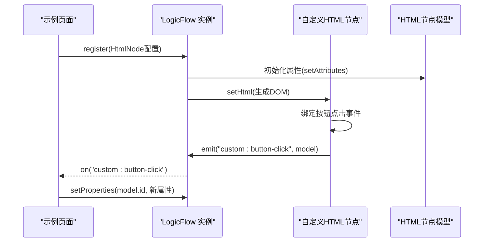

图表来源
- [examples/feature-examples/src/components/nodes/custom-html/Html.tsx](file://examples/feature-examples/src/components/nodes/custom-html/Html.tsx#L14-L42)
- [examples/feature-examples/src/pages/nodes/custom/html/index.tsx](file://examples/feature-examples/src/pages/nodes/custom/html/index.tsx#L34-L38)

章节来源
- [examples/feature-examples/src/components/nodes/custom-html/Html.tsx](file://examples/feature-examples/src/components/nodes/custom-html/Html.tsx#L14-L61)
- [examples/feature-examples/src/pages/nodes/custom/html/index.tsx](file://examples/feature-examples/src/pages/nodes/custom/html/index.tsx#L34-L38)

### 图片节点（基于 SVG image）
- 关键点
  - 通过 RectNode/RectNodeModel 自定义 getShape，使用 h('image') 渲染
  - 通过 properties.width/height/radius/style/textStyle 控制尺寸与样式
- 适用场景
  - 图标、Logo、图片占位等

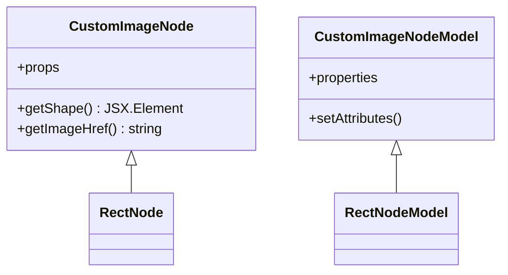

图表来源
- [examples/feature-examples/src/components/nodes/custom-html/Image.tsx](file://examples/feature-examples/src/components/nodes/custom-html/Image.tsx#L16-L59)

章节来源
- [examples/feature-examples/src/components/nodes/custom-html/Image.tsx](file://examples/feature-examples/src/components/nodes/custom-html/Image.tsx#L3-L65)

### 图标节点（SVG Path + 文本偏移）
- 关键点
  - 通过 RectNode 自定义 getShape，内部绘制 rect 与自定义 svg path
  - 通过 properties.style.path、fill、stroke 等控制图标路径与样式
  - 通过 refX/refY 与 transform 对文本进行偏移
- 适用场景
  - 带图标的复合节点

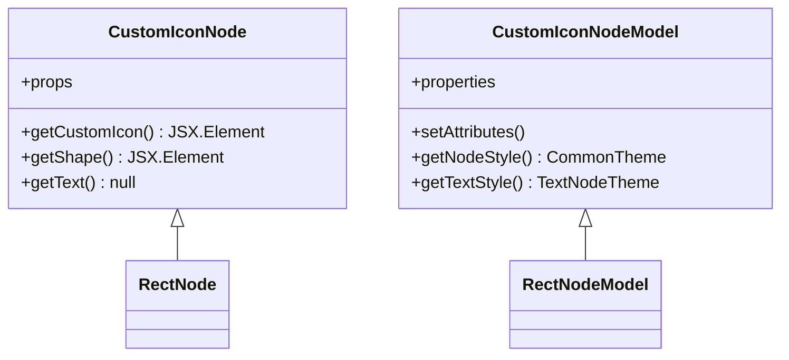

图表来源
- [examples/feature-examples/src/components/nodes/custom-html/Icon.tsx](file://examples/feature-examples/src/components/nodes/custom-html/Icon.tsx#L19-L129)

章节来源
- [examples/feature-examples/src/components/nodes/custom-html/Icon.tsx](file://examples/feature-examples/src/components/nodes/custom-html/Icon.tsx#L4-L136)

### 自由锚点节点（矩形/圆形）
- 关键点
  - 通过 eventCenter 监听 node:mouseenter/mousemove 等事件，动态计算投影点并生成锚点
  - 通过 anchorsOffset 动态维护锚点列表，拖拽时允许创建新锚点
  - 连接时根据 getTargetAnchor 返回目标锚点，支持移除未使用的锚点
- 适用场景
  - 需要灵活连接任意位置的节点

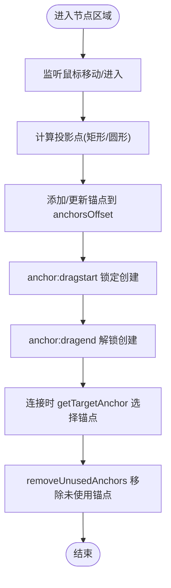

图表来源
- [examples/feature-examples/src/components/nodes/freeAnchor-rect/index.tsx](file://examples/feature-examples/src/components/nodes/freeAnchor-rect/index.tsx#L15-L156)
- [examples/feature-examples/src/components/nodes/freeAnchor-circle/index.tsx](file://examples/feature-examples/src/components/nodes/freeAnchor-circle/index.tsx#L15-L150)

章节来源
- [examples/feature-examples/src/components/nodes/freeAnchor-rect/index.tsx](file://examples/feature-examples/src/components/nodes/freeAnchor-rect/index.tsx#L4-L225)
- [examples/feature-examples/src/components/nodes/freeAnchor-circle/index.tsx](file://examples/feature-examples/src/components/nodes/freeAnchor-circle/index.tsx#L4-L187)

## 依赖分析
- 节点注册
  - 页面通过 register 注册节点配置对象（type/view/model）
  - 入口文件统一导出各节点，便于按需引入
- 事件中心
  - 节点通过 graphModel.eventCenter.emit 发射事件
  - 页面通过 lf.on 监听事件并更新节点属性

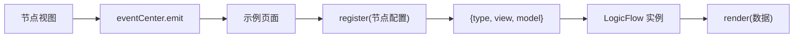

图表来源
- [examples/feature-examples/src/pages/nodes/custom/html/index.tsx](file://examples/feature-examples/src/pages/nodes/custom/html/index.tsx#L31-L41)
- [examples/feature-examples/src/components/nodes/custom-html/Html.tsx](file://examples/feature-examples/src/components/nodes/custom-html/Html.tsx#L37-L41)

章节来源
- [examples/feature-examples/src/pages/nodes/custom/html/index.tsx](file://examples/feature-examples/src/pages/nodes/custom/html/index.tsx#L31-L41)
- [examples/feature-examples/src/components/nodes/custom-html/Html.tsx](file://examples/feature-examples/src/components/nodes/custom-html/Html.tsx#L37-L41)

## 性能考虑
- 尽量使用 setAttributes 一次性读取 properties 并批量赋值，减少重复计算
- 使用 cloneDeep 合并样式时注意层级深度，避免深拷贝开销过大
- 自由锚点节点在大量节点上可能产生较多锚点，建议在连接完成后清理未使用锚点
- HTML 节点的 DOM 更新应避免频繁重排，优先复用元素或延迟更新

## 故障排查指南
- 节点不显示或样式异常
  - 检查 getNodeStyle 与 getTextStyle 是否正确合并 properties
  - 确认 width/height/radius 是否在 setAttributes 中生效
- 锚点无法连接或连接错乱
  - 检查 getTargetAnchor 逻辑与 anchorsOffset 是否一致
  - 确认是否在 anchor:dragstart/dragend 期间正确切换 allowCreateNewPoint
- HTML 节点事件未触发
  - 确认 setHtml 中已绑定事件并调用 eventCenter.emit
  - 页面是否正确监听对应事件名

章节来源
- [examples/feature-examples/src/components/nodes/custom-rect/index.tsx](file://examples/feature-examples/src/components/nodes/custom-rect/index.tsx#L29-L74)
- [examples/feature-examples/src/components/nodes/freeAnchor-rect/index.tsx](file://examples/feature-examples/src/components/nodes/freeAnchor-rect/index.tsx#L89-L108)
- [examples/feature-examples/src/components/nodes/custom-html/Html.tsx](file://examples/feature-examples/src/components/nodes/custom-html/Html.tsx#L37-L41)

## 结论
通过以上示例与实践，可以系统掌握 LogicFlow 自定义节点的开发流程：以 Model 驱动数据与样式，以 View 负责渲染与交互，以 Properties 作为参数化入口；结合事件中心实现节点间联动；利用自由锚点实现灵活连接；并以主题与样式定制满足产品需求。

## 附录：开发模板与调试技巧
- 开发模板（步骤）
  1) 定义 Properties 类型，声明 width/height/radius/style/textStyle/refX/refY 等字段
  2) 继承对应基类，编写 setAttributes 与 getNodeStyle/getTextStyle
  3) 如需 HTML/DOM，继承 HtmlNode/HtmlNodeModel，在 setHtml 中生成并绑定事件
  4) 如需自由锚点，监听 node/mouse 事件，计算投影点并维护 anchorsOffset
  5) 在页面中通过 register 注册节点，render 渲染数据
- 调试技巧
  - 在 setAttributes 与事件回调中打印 this.properties 与 this.model，确认数据流
  - 使用 eventCenter.emit 自定义事件，页面 on 监听并 setProperties 动态更新
  - 对于复杂 SVG，先固定尺寸与 viewBox，再逐步替换样式与路径
  - 自由锚点节点建议在连接完成后调用 removeUnusedAnchors 清理冗余锚点

章节来源
- [examples/feature-examples/src/components/nodes/custom-html/index.ts](file://examples/feature-examples/src/components/nodes/custom-html/index.ts#L1-L7)
- [examples/feature-examples/src/pages/nodes/custom/html/index.tsx](file://examples/feature-examples/src/pages/nodes/custom/html/index.tsx#L34-L38)
- [examples/feature-examples/src/components/nodes/freeAnchor-rect/index.tsx](file://examples/feature-examples/src/components/nodes/freeAnchor-rect/index.tsx#L138-L156)