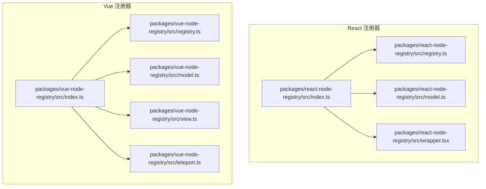
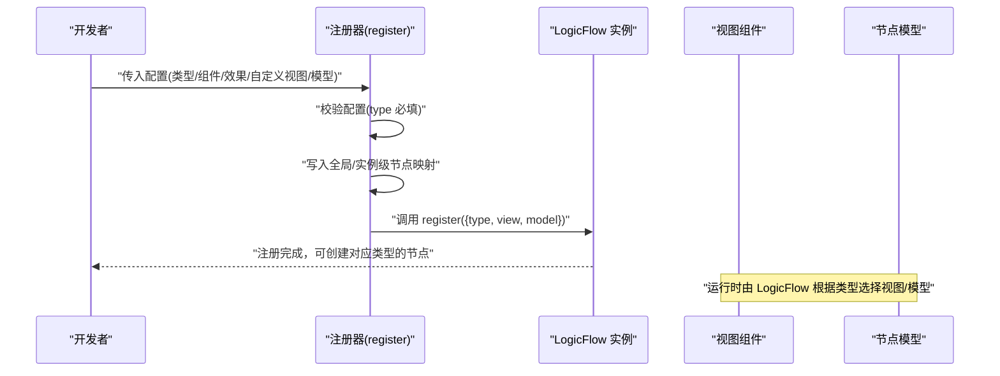
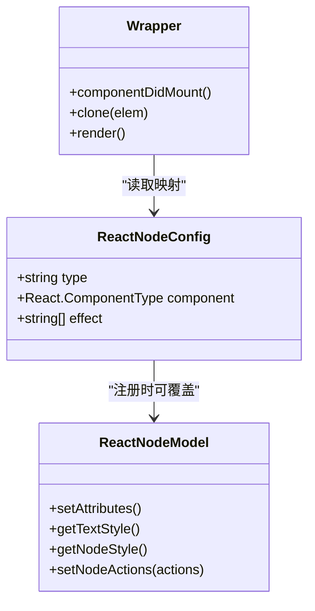
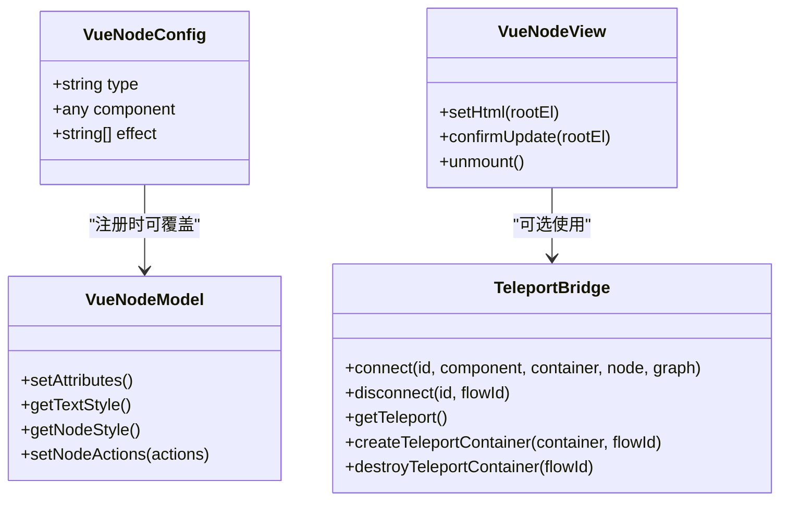
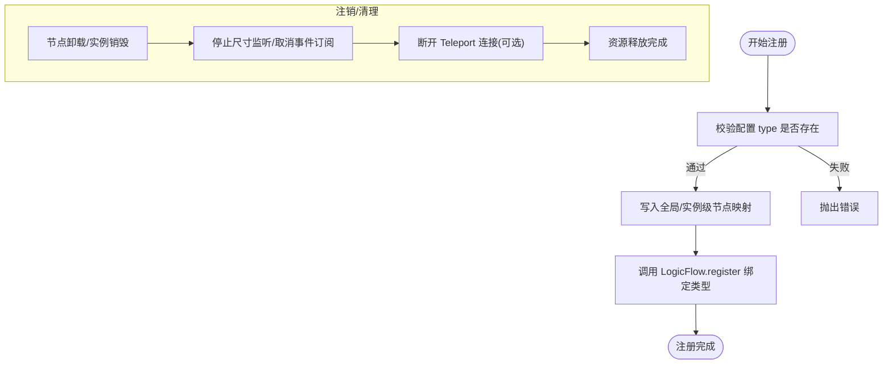
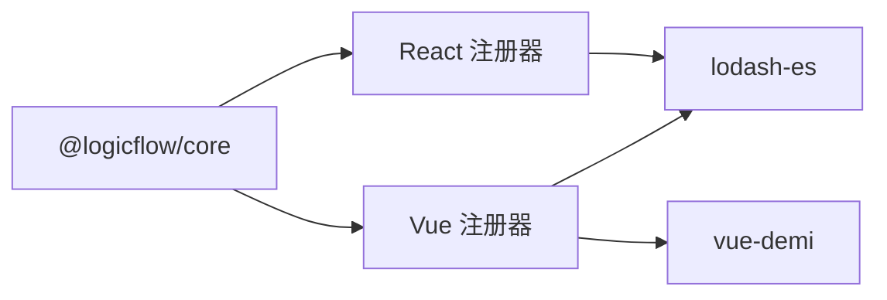

# 节点注册机制

<cite>
**本文引用的文件**
- [packages/react-node-registry/src/index.ts](file://packages/react-node-registry/src/index.ts)
- [packages/vue-node-registry/src/index.ts](file://packages/vue-node-registry/src/index.ts)
- [packages/react-node-registry/src/registry.ts](file://packages/react-node-registry/src/registry.ts)
- [packages/vue-node-registry/src/registry.ts](file://packages/vue-node-registry/src/registry.ts)
- [packages/react-node-registry/src/model.ts](file://packages/react-node-registry/src/model.ts)
- [packages/vue-node-registry/src/model.ts](file://packages/vue-node-registry/src/model.ts)
- [packages/react-node-registry/src/wrapper.tsx](file://packages/react-node-registry/src/wrapper.tsx)
- [packages/vue-node-registry/src/view.ts](file://packages/vue-node-registry/src/view.ts)
- [packages/vue-node-registry/src/teleport.ts](file://packages/vue-node-registry/src/teleport.ts)
- [examples/engine-browser-examples/src/pages/graph/nodes/ReactNode.tsx](file://examples/engine-browser-examples/src/pages/graph/nodes/ReactNode.tsx)
</cite>

## 目录
1. [引言](#引言)
2. [项目结构](#项目结构)
3. [核心组件](#核心组件)
4. [架构总览](#架构总览)
5. [详细组件分析](#详细组件分析)
6. [依赖关系分析](#依赖关系分析)
7. [性能考虑](#性能考虑)
8. [故障排查指南](#故障排查指南)
9. [结论](#结论)
10. [附录](#附录)

## 引言
本文件系统性阐述 LogicFlow 在 React 与 Vue 生态下的“节点注册机制”。重点包括：
- 注册器工作原理与 API 接口
- 节点注册流程、模型定义与视图组件映射
- 节点配置对象的结构与参数说明
- 注销与多实例隔离策略
- 最佳实践与性能优化建议
- 多类节点注册示例路径

## 项目结构
本仓库采用多包结构，React 与 Vue 的节点注册能力分别封装于独立包中，便于按需引入与版本管理。

图表来源
- [packages/react-node-registry/src/index.ts](file://packages/react-node-registry/src/index.ts#L1-L6)
- [packages/vue-node-registry/src/index.ts](file://packages/vue-node-registry/src/index.ts#L1-L5)
- [packages/react-node-registry/src/registry.ts](file://packages/react-node-registry/src/registry.ts#L1-L48)
- [packages/vue-node-registry/src/registry.ts](file://packages/vue-node-registry/src/registry.ts#L1-L75)
- [packages/react-node-registry/src/model.ts](file://packages/react-node-registry/src/model.ts#L1-L141)
- [packages/vue-node-registry/src/model.ts](file://packages/vue-node-registry/src/model.ts#L1-L142)
- [packages/react-node-registry/src/wrapper.tsx](file://packages/react-node-registry/src/wrapper.tsx#L1-L77)
- [packages/vue-node-registry/src/view.ts](file://packages/vue-node-registry/src/view.ts#L1-L254)
- [packages/vue-node-registry/src/teleport.ts](file://packages/vue-node-registry/src/teleport.ts#L1-L156)

章节来源
- [packages/react-node-registry/src/index.ts](file://packages/react-node-registry/src/index.ts#L1-L6)
- [packages/vue-node-registry/src/index.ts](file://packages/vue-node-registry/src/index.ts#L1-L5)

## 核心组件
- React 注册器
  - 注册入口：register(config, lf)
  - 配置类型：ReactNodeConfig
  - 视图模型：ReactNodeModel（基于 HtmlNodeModel）
  - 包装器：Wrapper（负责属性变更驱动的重渲染）
- Vue 注册器
  - 注册入口：register(config, lf)
  - 配置类型：VueNodeConfig
  - 视图模型：VueNodeModel（基于 HtmlNodeModel）
  - 视图：VueNodeView（基于 HtmlNode，支持 ResizeObserver/窗口尺寸回退监听）
  - 传送桥接：teleport（Vue3 Teleport 模式下的节点渲染桥）

章节来源
- [packages/react-node-registry/src/registry.ts](file://packages/react-node-registry/src/registry.ts#L11-L47)
- [packages/vue-node-registry/src/registry.ts](file://packages/vue-node-registry/src/registry.ts#L7-L74)
- [packages/react-node-registry/src/model.ts](file://packages/react-node-registry/src/model.ts#L37-L140)
- [packages/vue-node-registry/src/model.ts](file://packages/vue-node-registry/src/model.ts#L38-L139)
- [packages/react-node-registry/src/wrapper.tsx](file://packages/react-node-registry/src/wrapper.tsx#L15-L77)
- [packages/vue-node-registry/src/view.ts](file://packages/vue-node-registry/src/view.ts#L17-L254)
- [packages/vue-node-registry/src/teleport.ts](file://packages/vue-node-registry/src/teleport.ts#L18-L156)

## 架构总览
React 与 Vue 注册器均通过 LogicFlow 的 register 接口完成“类型名 -> 视图/模型”的绑定。二者差异主要体现在：
- React：以 Wrapper 作为统一渲染入口，内部维护 reactNodesMap 映射，配合属性变更事件驱动局部重渲染。
- Vue：以 VueNodeView 作为统一渲染入口，内部维护 vueNodesMaps（按 GraphModel 弱映射）实现多实例隔离；支持 Teleport 模式下的集中挂载与按 flowId 过滤渲染。

图表来源
- [packages/react-node-registry/src/registry.ts](file://packages/react-node-registry/src/registry.ts#L25-L47)
- [packages/vue-node-registry/src/registry.ts](file://packages/vue-node-registry/src/registry.ts#L43-L74)

## 详细组件分析

### React 节点注册器
- 注册配置 ReactNodeConfig
  - 字段要点：type（必填）、component（React 组件）、effect（属性变更白名单）、可选覆盖 view/model
- 注册流程
  - 校验 type
  - 写入 reactNodesMap[type] = { component, effect }
  - 调用 lf.register，使用自定义 view 或默认 ReactNodeView，使用自定义 model 或默认 ReactNodeModel
- 视图与模型
  - ReactNodeModel：扩展 HtmlNodeModel，支持宽度/高度/圆角、文字偏移、样式透传、标题模式下的最小尺寸与动作集合
  - Wrapper：监听 NODE_PROPERTIES_CHANGE 事件，按 effect 白名单决定是否触发重渲染
- 使用建议
  - effect 仅列出真正影响 UI 的属性键，减少不必要的重渲染
  - 在标题模式下，确保组件内容高度与模型高度一致，避免溢出

图表来源
- [packages/react-node-registry/src/registry.ts](file://packages/react-node-registry/src/registry.ts#L11-L15)
- [packages/react-node-registry/src/model.ts](file://packages/react-node-registry/src/model.ts#L37-L140)
- [packages/react-node-registry/src/wrapper.tsx](file://packages/react-node-registry/src/wrapper.tsx#L15-L77)

章节来源
- [packages/react-node-registry/src/registry.ts](file://packages/react-node-registry/src/registry.ts#L11-L47)
- [packages/react-node-registry/src/model.ts](file://packages/react-node-registry/src/model.ts#L16-L140)
- [packages/react-node-registry/src/wrapper.tsx](file://packages/react-node-registry/src/wrapper.tsx#L15-L77)

### Vue 节点注册器
- 注册配置 VueNodeConfig
  - 字段要点：type（必填）、component（Vue 组件）、effect（属性变更白名单）、可选覆盖 view/model
- 多实例隔离
  - vueNodesMaps：WeakMap<GraphModel, Map<string, entry>>
  - getVueNodeConfig(type, graphModel?)：按实例作用域获取配置
  - 兼容旧版全局 vueNodesMap，但不隔离多实例
- 注册流程
  - 校验 type
  - 写入实例级 Map 与全局 Map
  - 调用 lf.register，使用自定义 view 或默认 VueNodeView，使用自定义 model 或默认 VueNodeModel
- 视图与模型
  - VueNodeModel：与 React 版本等价的能力集
  - VueNodeView：基于 HtmlNode，提供 ForeignObject 容器、尺寸监听（ResizeObserver 优先，回退 window.resize）、卸载清理、Teleport 支持
- Teleport 模式
  - connect/disconnect：建立/断开节点到指定容器的 Teleport
  - getTeleport：返回 Teleport 容器组件，按 flowId 过滤渲染
  - createTeleportContainer/destroyTeleportContainer：按流程图实例创建/销毁独立挂载点

图表来源
- [packages/vue-node-registry/src/registry.ts](file://packages/vue-node-registry/src/registry.ts#L7-L74)
- [packages/vue-node-registry/src/model.ts](file://packages/vue-node-registry/src/model.ts#L38-L139)
- [packages/vue-node-registry/src/view.ts](file://packages/vue-node-registry/src/view.ts#L17-L254)
- [packages/vue-node-registry/src/teleport.ts](file://packages/vue-node-registry/src/teleport.ts#L18-L156)

章节来源
- [packages/vue-node-registry/src/registry.ts](file://packages/vue-node-registry/src/registry.ts#L7-L74)
- [packages/vue-node-registry/src/model.ts](file://packages/vue-node-registry/src/model.ts#L38-L139)
- [packages/vue-node-registry/src/view.ts](file://packages/vue-node-registry/src/view.ts#L17-L254)
- [packages/vue-node-registry/src/teleport.ts](file://packages/vue-node-registry/src/teleport.ts#L18-L156)

### 节点注册流程与注销机制
- 注册流程
  - React：register 写入 reactNodesMap，lf.register 绑定类型
  - Vue：register 写入 vueNodesMaps[graphModel] 与全局 vueNodesMap，lf.register 绑定类型
- 注销/清理
  - React：Wrapper 在卸载时停止监听；如需完全移除类型，可在应用层不再使用该类型并确保组件卸载
  - Vue：VueNodeView.componentWillUnmount 与 unmount 会停止尺寸监听并断开 Teleport；disconnect 可按节点 id 断开连接；destroyTeleportContainer 可按 flowId 卸载 Teleport 容器

图表来源
- [packages/react-node-registry/src/registry.ts](file://packages/react-node-registry/src/registry.ts#L34-L47)
- [packages/vue-node-registry/src/registry.ts](file://packages/vue-node-registry/src/registry.ts#L52-L74)
- [packages/vue-node-registry/src/view.ts](file://packages/vue-node-registry/src/view.ts#L37-L64)
- [packages/vue-node-registry/src/view.ts](file://packages/vue-node-registry/src/view.ts#L244-L250)
- [packages/vue-node-registry/src/teleport.ts](file://packages/vue-node-registry/src/teleport.ts#L44-L60)

章节来源
- [packages/react-node-registry/src/registry.ts](file://packages/react-node-registry/src/registry.ts#L34-L47)
- [packages/vue-node-registry/src/registry.ts](file://packages/vue-node-registry/src/registry.ts#L52-L74)
- [packages/vue-node-registry/src/view.ts](file://packages/vue-node-registry/src/view.ts#L37-L64)
- [packages/vue-node-registry/src/view.ts](file://packages/vue-node-registry/src/view.ts#L244-L250)
- [packages/vue-node-registry/src/teleport.ts](file://packages/vue-node-registry/src/teleport.ts#L44-L60)

### 节点配置对象结构与参数说明
- ReactNodeConfig
  - type: string（必填，节点类型标识）
  - component: React 组件类型
  - effect: string[]（可选，属性变更白名单；未设置则默认响应所有属性变更）
  - view/model: 可选，覆盖默认视图/模型
- VueNodeConfig
  - type: string（必填，节点类型标识）
  - component: Vue 组件
  - effect: string[]（可选，属性变更白名单）
  - view/model: 可选，覆盖默认视图/模型

章节来源
- [packages/react-node-registry/src/registry.ts](file://packages/react-node-registry/src/registry.ts#L11-L15)
- [packages/vue-node-registry/src/registry.ts](file://packages/vue-node-registry/src/registry.ts#L7-L11)

### API 接口与使用方法
- React
  - register(config: ReactNodeConfig, lf: LogicFlow): void
  - Wrapper：统一渲染入口，自动处理属性变更触发的重渲染
- Vue
  - register(config: VueNodeConfig, lf: LogicFlow): void
  - getVueNodeConfig(type, graphModel?): VueNodeEntry
  - VueNodeView：统一视图，支持尺寸监听与 Teleport
  - Teleport：connect/disconnect/getTeleport/createTeleportContainer/destroyTeleportContainer

章节来源
- [packages/react-node-registry/src/registry.ts](file://packages/react-node-registry/src/registry.ts#L25-L47)
- [packages/vue-node-registry/src/registry.ts](file://packages/vue-node-registry/src/registry.ts#L43-L74)
- [packages/vue-node-registry/src/view.ts](file://packages/vue-node-registry/src/view.ts#L17-L254)
- [packages/vue-node-registry/src/teleport.ts](file://packages/vue-node-registry/src/teleport.ts#L18-L156)

### 示例：不同类型节点的注册方式
- 自定义原生 HTML 节点（React）
  - 参考路径：[examples/engine-browser-examples/src/pages/graph/nodes/ReactNode.tsx](file://examples/engine-browser-examples/src/pages/graph/nodes/ReactNode.tsx#L6-L64)
  - 说明：直接继承 HtmlNode/HtmlNodeModel，setHtml 中渲染自定义 DOM 结构
- React 注册器注册
  - 参考路径：[packages/react-node-registry/src/registry.ts](file://packages/react-node-registry/src/registry.ts#L25-L47)
  - 说明：通过 register 写入 reactNodesMap 并绑定到 LogicFlow
- Vue 注册器注册
  - 参考路径：[packages/vue-node-registry/src/registry.ts](file://packages/vue-node-registry/src/registry.ts#L43-L74)
  - 说明：通过 register 写入 vueNodesMaps[graphModel] 并绑定到 LogicFlow

章节来源
- [examples/engine-browser-examples/src/pages/graph/nodes/ReactNode.tsx](file://examples/engine-browser-examples/src/pages/graph/nodes/ReactNode.tsx#L6-L64)
- [packages/react-node-registry/src/registry.ts](file://packages/react-node-registry/src/registry.ts#L25-L47)
- [packages/vue-node-registry/src/registry.ts](file://packages/vue-node-registry/src/registry.ts#L43-L74)

## 依赖关系分析
- React 注册器
  - 依赖 LogicFlow 的 BaseNodeModel/GraphModel/HtmlNodeModel
  - 依赖 lodash-es（深拷贝、判空、数组判断等）
- Vue 注册器
  - 依赖 LogicFlow 的 HtmlNode/HtmlNodeModel/GraphModel
  - 依赖 vue-demi（Vue2/3 兼容）
  - 依赖 lodash-es（工具函数）
- 两者均依赖 LogicFlow 的 register 机制完成类型绑定

图表来源
- [packages/react-node-registry/src/model.ts](file://packages/react-node-registry/src/model.ts#L1-L7)
- [packages/vue-node-registry/src/model.ts](file://packages/vue-node-registry/src/model.ts#L1-L7)
- [packages/vue-node-registry/src/view.ts](file://packages/vue-node-registry/src/view.ts#L1-L11)

章节来源
- [packages/react-node-registry/src/model.ts](file://packages/react-node-registry/src/model.ts#L1-L7)
- [packages/vue-node-registry/src/model.ts](file://packages/vue-node-registry/src/model.ts#L1-L7)
- [packages/vue-node-registry/src/view.ts](file://packages/vue-node-registry/src/view.ts#L1-L11)

## 性能考虑
- 属性变更白名单（effect）
  - React：通过 Wrapper 监听属性变更事件，仅在 effect 包含的键变化时触发重渲染
  - Vue：通过 getVueNodeConfig 与 Teleport 模式，结合 ResizeObserver 节流，降低频繁重绘
- 尺寸监听优化
  - 优先使用 ResizeObserver，回退到 window.resize
  - 使用 requestAnimationFrame 对齐帧率，配合 throttle 合并高频变更
- 多实例隔离
  - Vue 注册器使用 WeakMap 按 GraphModel 存储映射，避免跨实例污染，利于垃圾回收
- Teleport 模式
  - 按 flowId 过滤渲染，避免多页/多实例重复渲染导致的性能问题
  - 按节点销毁自动卸载 Teleport 容器，防止残留实例

章节来源
- [packages/react-node-registry/src/wrapper.tsx](file://packages/react-node-registry/src/wrapper.tsx#L21-L37)
- [packages/vue-node-registry/src/view.ts](file://packages/vue-node-registry/src/view.ts#L182-L207)
- [packages/vue-node-registry/src/teleport.ts](file://packages/vue-node-registry/src/teleport.ts#L82-L110)
- [packages/vue-node-registry/src/registry.ts](file://packages/vue-node-registry/src/registry.ts#L18-L28)

## 故障排查指南
- 注册时报错：未指定 type
  - 现象：抛出错误提示应指定 type
  - 处理：在配置中提供唯一的 type
  - 参考路径：[packages/react-node-registry/src/registry.ts](file://packages/react-node-registry/src/registry.ts#L34-L36)，[packages/vue-node-registry/src/registry.ts](file://packages/vue-node-registry/src/registry.ts#L52-L54)
- 节点不渲染或渲染异常
  - React：确认 Wrapper 已正确包裹组件，且 reactNodesMap 中存在对应 type
  - Vue：确认 getVueNodeConfig 返回有效配置，Teleport 模式下容器已创建
  - 参考路径：[packages/react-node-registry/src/wrapper.tsx](file://packages/react-node-registry/src/wrapper.tsx#L48-L55)，[packages/vue-node-registry/src/view.ts](file://packages/vue-node-registry/src/view.ts#L89-L105)，[packages/vue-node-registry/src/teleport.ts](file://packages/vue-node-registry/src/teleport.ts#L118-L142)
- 尺寸不更新或闪烁
  - 检查 ResizeObserver 是否可用，确认节流与 RAF 使用正常
  - 参考路径：[packages/vue-node-registry/src/view.ts](file://packages/vue-node-registry/src/view.ts#L155-L180)，[packages/vue-node-registry/src/view.ts](file://packages/vue-node-registry/src/view.ts#L182-L207)
- 多实例冲突或内存泄漏
  - 确保使用 getVueNodeConfig 按实例作用域获取配置
  - 卸载节点后调用 disconnect/destroyTeleportContainer
  - 参考路径：[packages/vue-node-registry/src/registry.ts](file://packages/vue-node-registry/src/registry.ts#L33-L41)，[packages/vue-node-registry/src/view.ts](file://packages/vue-node-registry/src/view.ts#L244-L250)，[packages/vue-node-registry/src/teleport.ts](file://packages/vue-node-registry/src/teleport.ts#L44-L60)

章节来源
- [packages/react-node-registry/src/registry.ts](file://packages/react-node-registry/src/registry.ts#L34-L36)
- [packages/vue-node-registry/src/registry.ts](file://packages/vue-node-registry/src/registry.ts#L52-L54)
- [packages/react-node-registry/src/wrapper.tsx](file://packages/react-node-registry/src/wrapper.tsx#L48-L55)
- [packages/vue-node-registry/src/view.ts](file://packages/vue-node-registry/src/view.ts#L89-L105)
- [packages/vue-node-registry/src/view.ts](file://packages/vue-node-registry/src/view.ts#L155-L180)
- [packages/vue-node-registry/src/view.ts](file://packages/vue-node-registry/src/view.ts#L182-L207)
- [packages/vue-node-registry/src/registry.ts](file://packages/vue-node-registry/src/registry.ts#L33-L41)
- [packages/vue-node-registry/src/view.ts](file://packages/vue-node-registry/src/view.ts#L244-L250)
- [packages/vue-node-registry/src/teleport.ts](file://packages/vue-node-registry/src/teleport.ts#L44-L60)

## 结论
- React 与 Vue 注册器均通过 LogicFlow 的 register 完成“类型 -> 视图/模型”的绑定
- React 侧重 Wrapper 的属性变更驱动重渲染；Vue 侧重多实例隔离与 Teleport 模式的集中渲染
- 通过 effect 白名单、ResizeObserver/RAF 节流、WeakMap 实例隔离与 Teleport 容器生命周期管理，实现高性能与稳定的节点渲染

## 附录
- 关键实现路径参考
  - React 注册器导出入口：[packages/react-node-registry/src/index.ts](file://packages/react-node-registry/src/index.ts#L1-L6)
  - Vue 注册器导出入口：[packages/vue-node-registry/src/index.ts](file://packages/vue-node-registry/src/index.ts#L1-L5)
  - React 注册配置与注册流程：[packages/react-node-registry/src/registry.ts](file://packages/react-node-registry/src/registry.ts#L11-L47)
  - Vue 注册配置与注册流程：[packages/vue-node-registry/src/registry.ts](file://packages/vue-node-registry/src/registry.ts#L7-L74)
  - React 模型与包装器：[packages/react-node-registry/src/model.ts](file://packages/react-node-registry/src/model.ts#L37-L140)，[packages/react-node-registry/src/wrapper.tsx](file://packages/react-node-registry/src/wrapper.tsx#L15-L77)
  - Vue 模型与视图：[packages/vue-node-registry/src/model.ts](file://packages/vue-node-registry/src/model.ts#L38-L139)，[packages/vue-node-registry/src/view.ts](file://packages/vue-node-registry/src/view.ts#L17-L254)
  - Vue Teleport 桥接：[packages/vue-node-registry/src/teleport.ts](file://packages/vue-node-registry/src/teleport.ts#L18-L156)
  - 示例：自定义 React 节点（原生 HTML）：[examples/engine-browser-examples/src/pages/graph/nodes/ReactNode.tsx](file://examples/engine-browser-examples/src/pages/graph/nodes/ReactNode.tsx#L6-L64)