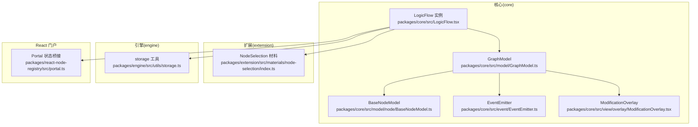
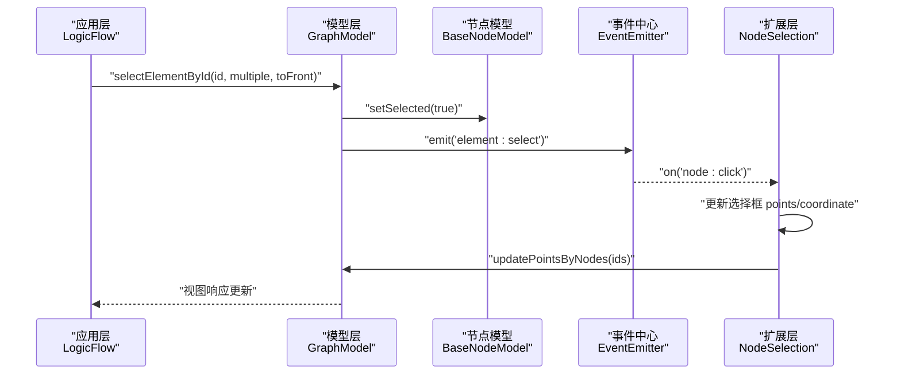
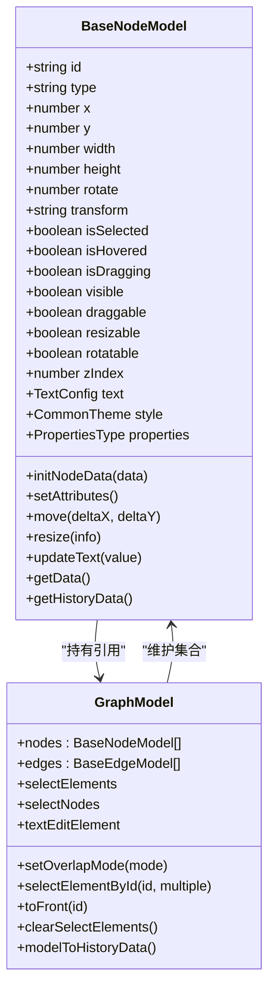
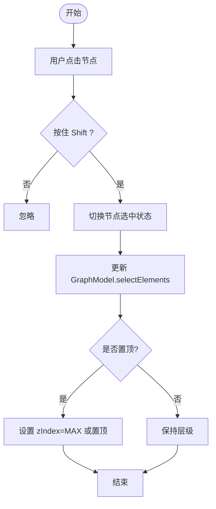
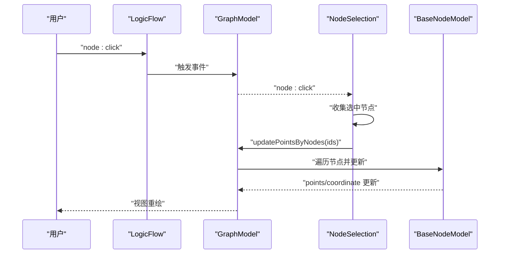
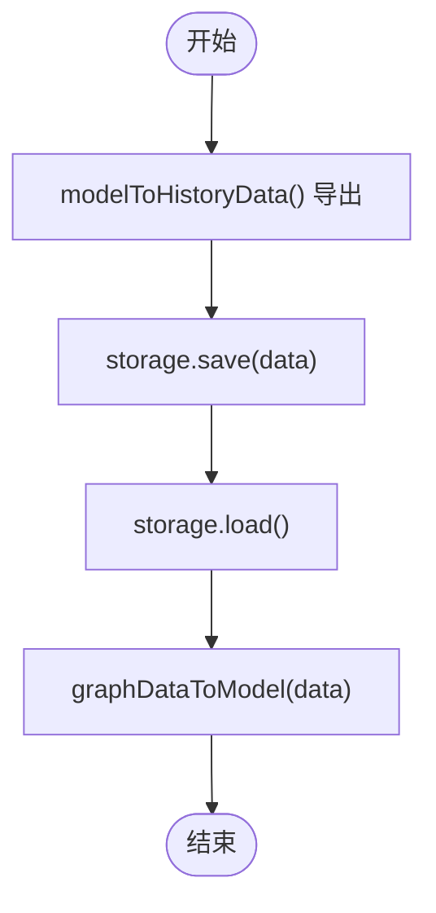
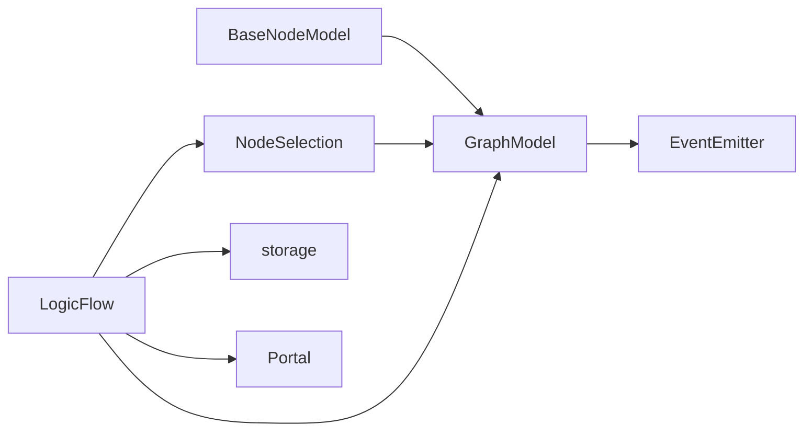

# 节点状态管理

<cite>
**本文档引用的文件**
- [packages/core/src/model/node/BaseNodeModel.ts](file://packages/core/src/model/node/BaseNodeModel.ts)
- [packages/core/src/model/GraphModel.ts](file://packages/core/src/model/GraphModel.ts)
- [packages/core/src/LogicFlow.tsx](file://packages/core/src/LogicFlow.tsx)
- [packages/core/src/event/EventEmitter.ts](file://packages/core/src/event/EventEmitter.ts)
- [packages/extension/src/materials/node-selection/index.ts](file://packages/extension/src/materials/node-selection/index.ts)
- [packages/core/src/view/overlay/ModificationOverlay.tsx](file://packages/core/src/view/overlay/ModificationOverlay.tsx)
- [packages/engine/src/utils/storage.ts](file://packages/engine/src/utils/storage.ts)
- [packages/react-node-registry/src/portal.ts](file://packages/react-node-registry/src/portal.ts)
- [packages/core/__tests__/logicflow.test.ts](file://packages/core/__tests__/logicflow.test.ts)
</cite>

## 目录
1. [简介](#简介)
2. [项目结构](#项目结构)
3. [核心组件](#核心组件)
4. [架构总览](#架构总览)
5. [详细组件分析](#详细组件分析)
6. [依赖关系分析](#依赖关系分析)
7. [性能考量](#性能考量)
8. [故障排查指南](#故障排查指南)
9. [结论](#结论)
10. [附录](#附录)

## 简介
本文件围绕 LogicFlow 的节点状态管理进行系统性梳理，重点涵盖：
- 节点状态的数据结构与生命周期
- 节点选中、编辑、高亮等状态的实现机制
- 节点状态与全局状态管理系统的集成方式
- 节点状态变更的事件处理与响应机制
- 节点状态持久化与恢复的技术方案
- 最佳实践与性能优化建议
- 实际状态管理代码示例与使用场景

## 项目结构
本项目采用多包结构，核心状态管理能力集中在 core 包，扩展能力通过 extension 包提供。关键目录与职责如下：
- packages/core：核心模型与视图、事件系统、历史记录、工具函数等
- packages/extension：扩展材料与交互，如节点选择框
- packages/engine：引擎侧工具与存储封装
- packages/react-node-registry：React 门户与状态桥接
- examples：示例工程，演示节点状态与交互

图表来源
- [packages/core/src/LogicFlow.tsx](file://packages/core/src/LogicFlow.tsx#L119-L157)
- [packages/core/src/model/GraphModel.ts](file://packages/core/src/model/GraphModel.ts#L61-L237)
- [packages/core/src/model/node/BaseNodeModel.ts](file://packages/core/src/model/node/BaseNodeModel.ts#L59-L228)
- [packages/core/src/event/EventEmitter.ts](file://packages/core/src/event/EventEmitter.ts#L25-L154)
- [packages/core/src/view/overlay/ModificationOverlay.tsx](file://packages/core/src/view/overlay/ModificationOverlay.tsx#L1-L31)
- [packages/extension/src/materials/node-selection/index.ts](file://packages/extension/src/materials/node-selection/index.ts#L1-L381)
- [packages/engine/src/utils/storage.ts](file://packages/engine/src/utils/storage.ts#L1-L5)
- [packages/react-node-registry/src/portal.ts](file://packages/react-node-registry/src/portal.ts#L1-L79)

章节来源
- [packages/core/src/LogicFlow.tsx](file://packages/core/src/LogicFlow.tsx#L119-L157)
- [packages/core/src/model/GraphModel.ts](file://packages/core/src/model/GraphModel.ts#L61-L237)

## 核心组件
- LogicFlow 实例：负责初始化容器、注册默认元素、安装插件、桥接历史与键盘等子系统，并对外暴露节点/边/元素的增删改查与选择等 API。
- GraphModel：全局画布模型，维护节点与边集合、主题、网格、背景、重叠模式、变换模型、编辑配置等，提供元素选择、区域查询、历史数据导出等能力。
- BaseNodeModel：节点模型基类，定义节点的几何属性、状态属性（选中、悬停、拖拽、可见、可拖拽、可缩放、可旋转）、文本模式、样式、锚点、移动/缩放规则、zIndex 等。
- EventEmitter：事件中心，提供 on/once/emit/off 等事件机制，供 GraphModel 与扩展模块订阅与发布状态变更。
- NodeSelection 材料：扩展组件，提供“节点选择框”能力，支持多选节点的包围盒计算、拖拽与缩放联动、与主画布节点的同步更新。

章节来源
- [packages/core/src/LogicFlow.tsx](file://packages/core/src/LogicFlow.tsx#L361-L800)
- [packages/core/src/model/GraphModel.ts](file://packages/core/src/model/GraphModel.ts#L129-L800)
- [packages/core/src/model/node/BaseNodeModel.ts](file://packages/core/src/model/node/BaseNodeModel.ts#L59-L444)
- [packages/core/src/event/EventEmitter.ts](file://packages/core/src/event/EventEmitter.ts#L25-L154)
- [packages/extension/src/materials/node-selection/index.ts](file://packages/extension/src/materials/node-selection/index.ts#L1-L381)

## 架构总览
节点状态管理贯穿于以下层次：
- 应用层：LogicFlow 实例对外提供统一 API，如选择、置顶、移动、克隆、删除等。
- 模型层：GraphModel 维护全局状态与元素集合，BaseNodeModel 维护单个节点的状态与行为。
- 视图层：基于 MobX 响应式驱动视图更新，Overlay 提供 SVG 变换包装。
- 扩展层：NodeSelection 材料通过事件与规则联动，实现多选与联动移动/缩放。
- 事件层：EventEmitter 提供跨模块解耦的事件通信。

图表来源
- [packages/core/src/LogicFlow.tsx](file://packages/core/src/LogicFlow.tsx#L743-L748)
- [packages/core/src/model/GraphModel.ts](file://packages/core/src/model/GraphModel.ts#L319-L342)
- [packages/core/src/model/node/BaseNodeModel.ts](file://packages/core/src/model/node/BaseNodeModel.ts#L108-L124)
- [packages/core/src/event/EventEmitter.ts](file://packages/core/src/event/EventEmitter.ts#L75-L103)
- [packages/extension/src/materials/node-selection/index.ts](file://packages/extension/src/materials/node-selection/index.ts#L322-L369)

## 详细组件分析

### 节点状态数据结构与生命周期
- 状态字段
  - 选中状态：isSelected（布尔）
  - 悬停状态：isHovered（布尔）
  - 拖拽状态：isDragging（布尔）
  - 可见性：visible（布尔）
  - 可拖拽/可缩放/可旋转：draggable/resizable/rotatable（布尔）
  - 文本模式：textMode（枚举）
  - 层级：zIndex（数值）
  - 几何：x/y/width/height/rotate/transform
  - 文本：text.value/x/y/draggable/editable
  - 属性：properties（任意对象，支持 setProperties/getProperties）
- 生命周期阶段
  - 初始化：构造函数中完成 id 生成、文本格式化、zIndex 初始化、事件监听注册
  - 属性变更：setAttributes 在 properties 变化时触发
  - 移动/缩放：move/moveTo/getMoveDistance/resize 等
  - 选择/置顶：GraphModel.selectElementById 与 toFront
  - 文本编辑：GraphModel.textEditElement 计算当前文本编辑元素
  - 清理：GraphModel.clearSelectElements

图表来源
- [packages/core/src/model/node/BaseNodeModel.ts](file://packages/core/src/model/node/BaseNodeModel.ts#L59-L444)
- [packages/core/src/model/GraphModel.ts](file://packages/core/src/model/GraphModel.ts#L129-L342)

章节来源
- [packages/core/src/model/node/BaseNodeModel.ts](file://packages/core/src/model/node/BaseNodeModel.ts#L59-L444)
- [packages/core/src/model/GraphModel.ts](file://packages/core/src/model/GraphModel.ts#L306-L342)

### 节点选中、编辑、高亮机制
- 选中
  - 通过 LogicFlow.selectElementById 触发 GraphModel.selectElementById
  - GraphModel 维护 selectElements 与 selectNodes 的计算属性
  - overlapMode 与 zIndex 控制置顶策略
- 编辑
  - textEditElement 计算当前处于文本编辑态的节点或边
  - GraphModel 提供 setTextMode 与 getTextMode
- 高亮
  - isHovered 由视图层在鼠标事件中设置
  - BaseNodeModel 提供 getOutlineStyle/getResizeControlStyle 等主题样式接口

图表来源
- [packages/core/src/LogicFlow.tsx](file://packages/core/src/LogicFlow.tsx#L743-L748)
- [packages/core/src/model/GraphModel.ts](file://packages/core/src/model/GraphModel.ts#L319-L342)
- [packages/core/src/model/node/BaseNodeModel.ts](file://packages/core/src/model/node/BaseNodeModel.ts#L108-L124)

章节来源
- [packages/core/src/LogicFlow.tsx](file://packages/core/src/LogicFlow.tsx#L743-L748)
- [packages/core/src/model/GraphModel.ts](file://packages/core/src/model/GraphModel.ts#L306-L342)
- [packages/core/__tests__/logicflow.test.ts](file://packages/core/__tests__/logicflow.test.ts#L473-L484)

### 节点状态与全局状态管理系统的集成
- 事件系统
  - GraphModel.eventCenter 作为全局事件源，扩展模块通过 on/once/emit 订阅与发布
  - NodeSelection 材料在 node:click 事件中收集选中节点并更新选择框
- 重叠模式与层级
  - setOverlapMode 与 overlap:change 事件驱动 zIndex 更新策略
- 文本编辑态
  - textEditElement 计算当前处于 ElementState.TEXT_EDIT 的节点或边

章节来源
- [packages/core/src/event/EventEmitter.ts](file://packages/core/src/event/EventEmitter.ts#L25-L154)
- [packages/core/src/model/GraphModel.ts](file://packages/core/src/model/GraphModel.ts#L750-L770)
- [packages/core/src/model/GraphModel.ts](file://packages/core/src/model/GraphModel.ts#L306-L314)

### 节点状态变更的事件处理与响应机制
- NodeSelection 材料
  - 监听 node:click，结合 shiftKey 实现多选
  - onNodeChange 在节点移动/缩放时联动更新选择框 points
  - addNodeSelection/updateNodeSelection 动态创建/更新选择框
- 事件链路
  - 用户交互 -> LogicFlow/GraphModel -> NodeSelection -> 选择框更新 -> 视图刷新

图表来源
- [packages/extension/src/materials/node-selection/index.ts](file://packages/extension/src/materials/node-selection/index.ts#L322-L369)
- [packages/extension/src/materials/node-selection/index.ts](file://packages/extension/src/materials/node-selection/index.ts#L148-L173)

章节来源
- [packages/extension/src/materials/node-selection/index.ts](file://packages/extension/src/materials/node-selection/index.ts#L306-L369)

### 节点状态持久化与恢复技术方案
- 历史数据导出
  - GraphModel.modelToHistoryData 仅在无节点/边拖拽时导出，避免中间态污染
- 存储工具
  - storage 工具提供通用存储封装，可用于本地缓存/同步
- 恢复策略
  - graphDataToModel 将外部数据转为模型，重建节点/边集合
  - setProperties/updateText/changeNodeId 等 API 支持增量更新

图表来源
- [packages/core/src/model/GraphModel.ts](file://packages/core/src/model/GraphModel.ts#L554-L590)
- [packages/engine/src/utils/storage.ts](file://packages/engine/src/utils/storage.ts#L1-L5)

章节来源
- [packages/core/src/model/GraphModel.ts](file://packages/core/src/model/GraphModel.ts#L491-L551)
- [packages/core/src/model/GraphModel.ts](file://packages/core/src/model/GraphModel.ts#L554-L590)
- [packages/engine/src/utils/storage.ts](file://packages/engine/src/utils/storage.ts#L1-L5)

### 实际状态管理代码示例与使用场景
- 选中与置顶
  - 通过 selectElementById 与 toFront 实现选中置顶
- 多选与联动
  - NodeSelection 材料在 node:click 中收集选中节点，updatePointsByNodes 计算包围盒并联动移动/缩放
- 文本编辑
  - 通过 textEditElement 与 setTextMode 控制文本编辑态
- 属性与样式
  - setProperties/getProperties 与 getNodeStyle/getTextStyle 结合主题系统实现动态样式

章节来源
- [packages/core/src/LogicFlow.tsx](file://packages/core/src/LogicFlow.tsx#L743-L748)
- [packages/extension/src/materials/node-selection/index.ts](file://packages/extension/src/materials/node-selection/index.ts#L148-L173)
- [packages/core/src/model/node/BaseNodeModel.ts](file://packages/core/src/model/node/BaseNodeModel.ts#L394-L413)
- [packages/core/__tests__/logicflow.test.ts](file://packages/core/__tests__/logicflow.test.ts#L473-L484)

## 依赖关系分析
- 组件耦合
  - BaseNodeModel 与 GraphModel 弱耦合：通过 graphModel 引用访问主题、事件中心、重叠模式等
  - NodeSelection 与 GraphModel 强耦合：依赖 getSelectElements、setProperties、toFront 等
- 事件耦合
  - EventEmitter 作为唯一事件源，降低模块间耦合
- 外部依赖
  - MobX 响应式（observable/computed/action）
  - lodash-es 工具库
  - Preact/compat 视图框架

图表来源
- [packages/core/src/model/node/BaseNodeModel.ts](file://packages/core/src/model/node/BaseNodeModel.ts#L121-L124)
- [packages/core/src/model/GraphModel.ts](file://packages/core/src/model/GraphModel.ts#L79-L81)
- [packages/extension/src/materials/node-selection/index.ts](file://packages/extension/src/materials/node-selection/index.ts#L238-L244)
- [packages/core/src/LogicFlow.tsx](file://packages/core/src/LogicFlow.tsx#L119-L157)
- [packages/engine/src/utils/storage.ts](file://packages/engine/src/utils/storage.ts#L1-L5)
- [packages/react-node-registry/src/portal.ts](file://packages/react-node-registry/src/portal.ts#L1-L79)

章节来源
- [packages/core/src/model/node/BaseNodeModel.ts](file://packages/core/src/model/node/BaseNodeModel.ts#L121-L124)
- [packages/core/src/model/GraphModel.ts](file://packages/core/src/model/GraphModel.ts#L79-L81)
- [packages/extension/src/materials/node-selection/index.ts](file://packages/extension/src/materials/node-selection/index.ts#L238-L244)

## 性能考量
- 局部渲染与可见区域裁剪
  - GraphModel.sortElements 对元素按 zIndex 排序，并结合 partial 与可见区域裁剪减少渲染开销
- 事件节流
  - ResizeObserver 使用防抖，避免频繁重排
- 计算属性缓存
  - nodesMap/edgesMap/modelsMap 通过计算属性缓存索引，避免重复构建
- 历史数据导出保护
  - modelToHistoryData 在节点/边拖拽中跳过导出，避免历史记录膨胀

章节来源
- [packages/core/src/model/GraphModel.ts](file://packages/core/src/model/GraphModel.ts#L269-L301)
- [packages/core/src/model/GraphModel.ts](file://packages/core/src/model/GraphModel.ts#L204-L226)
- [packages/core/src/model/GraphModel.ts](file://packages/core/src/model/GraphModel.ts#L554-L590)

## 故障排查指南
- 选中状态异常
  - 检查 LogicFlow.selectElementById 调用与 GraphModel.selectElements 计算
  - 确认 overlapMode 与 zIndex 更新逻辑
- 多选联动失效
  - 检查 NodeSelection.onNodeChange 与 updatePointsByNodes 的调用时机
  - 确认 isNodeSelectionModel 类型判断与 Promise.resolve 延迟
- 文本编辑态错乱
  - 检查 textEditElement 的计算与 ElementState.TEXT_EDIT 状态
- 事件未触发
  - 确认 EventEmitter.on/once/emit 使用正确，避免 off 误注销

章节来源
- [packages/core/src/LogicFlow.tsx](file://packages/core/src/LogicFlow.tsx#L743-L748)
- [packages/core/src/model/GraphModel.ts](file://packages/core/src/model/GraphModel.ts#L306-L314)
- [packages/extension/src/materials/node-selection/index.ts](file://packages/extension/src/materials/node-selection/index.ts#L306-L320)
- [packages/core/src/event/EventEmitter.ts](file://packages/core/src/event/EventEmitter.ts#L75-L103)

## 结论
本项目通过清晰的分层设计与事件驱动机制，实现了节点状态的完整生命周期管理。GraphModel 作为全局状态中枢，BaseNodeModel 作为节点状态载体，配合 NodeSelection 等扩展，提供了灵活的多选、联动与可视化反馈。结合历史数据导出与存储工具，可实现稳定的持久化与恢复能力。建议在复杂场景中进一步利用计算属性与事件节流，持续优化渲染性能。

## 附录
- 关键 API 路径
  - 选中与置顶：[packages/core/src/LogicFlow.tsx](file://packages/core/src/LogicFlow.tsx#L743-L748)
  - 多选联动：[packages/extension/src/materials/node-selection/index.ts](file://packages/extension/src/materials/node-selection/index.ts#L322-L369)
  - 文本编辑态：[packages/core/src/model/GraphModel.ts](file://packages/core/src/model/GraphModel.ts#L306-L314)
  - 历史数据导出：[packages/core/src/model/GraphModel.ts](file://packages/core/src/model/GraphModel.ts#L554-L590)
  - 事件中心：[packages/core/src/event/EventEmitter.ts](file://packages/core/src/event/EventEmitter.ts#L25-L154)