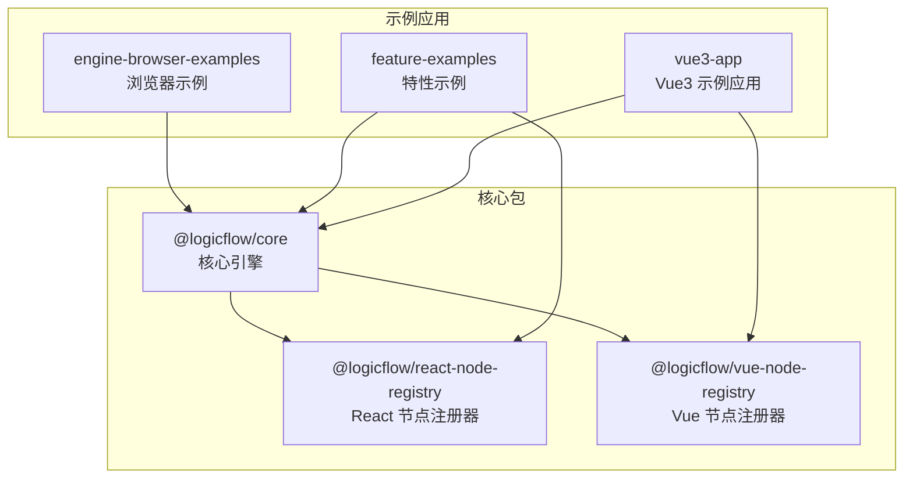
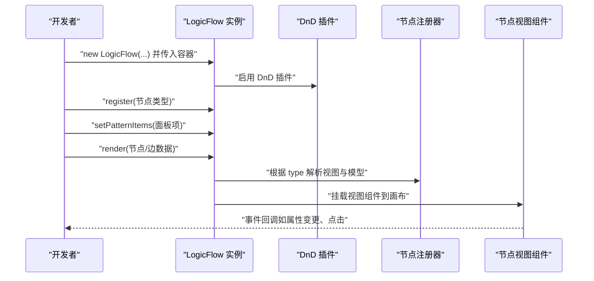
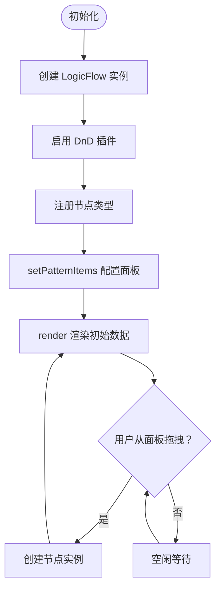
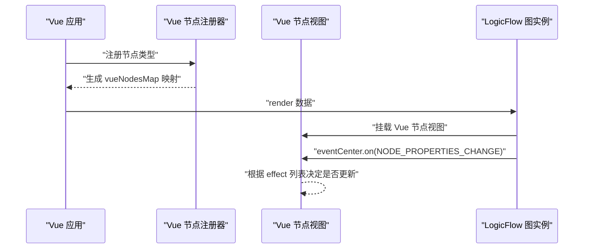
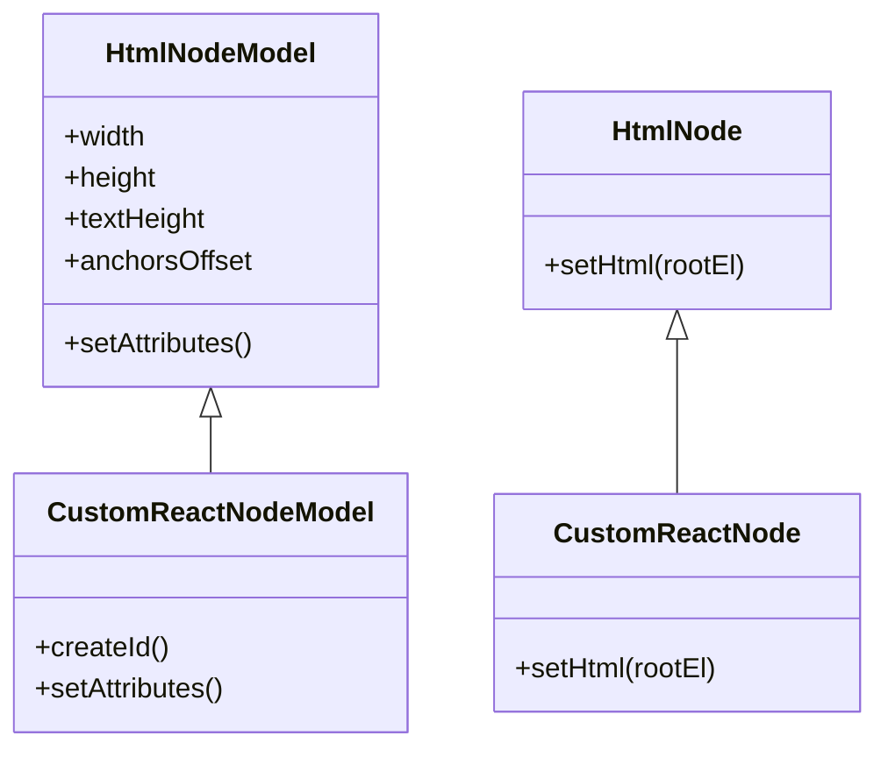
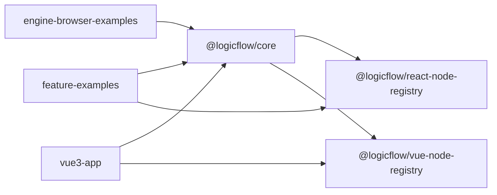

# 节点管理系统

<cite>
**本文引用的文件**
- [packages/core/package.json](file://packages/core/package.json)
- [packages/react-node-registry/package.json](file://packages/react-node-registry/package.json)
- [packages/vue-node-registry/package.json](file://packages/vue-node-registry/package.json)
- [examples/engine-browser-examples/src/pages/graph/nodes/index.ts](file://examples/engine-browser-examples/src/pages/graph/nodes/index.ts)
- [examples/engine-browser-examples/src/pages/graph/nodes/ReactNode.tsx](file://examples/engine-browser-examples/src/pages/graph/nodes/ReactNode.tsx)
- [examples/feature-examples/src/pages/extensions/dnd-panel/index.tsx](file://examples/feature-examples/src/pages/extensions/dnd-panel/index.tsx)
- [examples/feature-examples/src/pages/extensions/dnd-panel/nodes/start.ts](file://examples/feature-examples/src/pages/extensions/dnd-panel/nodes/start.ts)
- [examples/feature-examples/src/pages/extensions/dnd-panel/nodes/end.ts](file://examples/feature-examples/src/pages/extensions/dnd-panel/nodes/end.ts)
- [examples/feature-examples/src/pages/nodes/custom/html/index.tsx](file://examples/feature-examples/src/pages/nodes/custom/html/index.tsx)
- [examples/feature-examples/src/pages/nodes/native/index.tsx](file://examples/feature-examples/src/pages/nodes/native/index.tsx)
- [examples/vue3-app/src/components/LFElements/nodes/index.ts](file://examples/vue3-app/src/components/LFElements/nodes/index.ts)
- [examples/vue3-app/src/components/LFElements/ProgressNode.vue](file://examples/vue3-app/src/components/LFElements/ProgressNode.vue)
</cite>

## 目录
1. [简介](#简介)
2. [项目结构](#项目结构)
3. [核心组件](#核心组件)
4. [架构总览](#架构总览)
5. [详细组件分析](#详细组件分析)
6. [依赖关系分析](#依赖关系分析)
7. [性能考量](#性能考量)
8. [故障排查指南](#故障排查指南)
9. [结论](#结论)
10. [附录](#附录)

## 简介
本文件面向“节点管理系统”的使用者与开发者，系统性阐述节点的创建、编辑、删除与状态管理机制；解释拖拽面板（DnD Panel）的工作原理与节点注册流程；详解 Vue 与 React 节点注册器的使用与扩展方式；阐明节点模型、视图组件与数据模型之间的关系；并提供自定义节点开发指南（属性定义、事件处理、样式定制等），以及节点锚点系统、连接规则与验证机制的说明。文中所有实现细节均基于仓库中的真实示例与包配置进行归纳总结。

## 项目结构
该工程采用多包（monorepo）组织方式，核心能力由 @logicflow/core 提供，React 与 Vue 的节点注册器分别由 @logicflow/react-node-registry 与 @logicflow/vue-node-registry 提供。示例应用位于 examples 目录下，覆盖浏览器端、Vue3 应用、特性演示等多种场景。

图表来源
- [packages/core/package.json](file://packages/core/package.json#L1-L57)
- [packages/react-node-registry/package.json](file://packages/react-node-registry/package.json#L1-L48)
- [packages/vue-node-registry/package.json](file://packages/vue-node-registry/package.json#L1-L56)
- [examples/engine-browser-examples/src/pages/graph/nodes/index.ts](file://examples/engine-browser-examples/src/pages/graph/nodes/index.ts#L1-L16)
- [examples/feature-examples/src/pages/extensions/dnd-panel/index.tsx](file://examples/feature-examples/src/pages/extensions/dnd-panel/index.tsx#L1-L108)
- [examples/vue3-app/src/components/LFElements/nodes/index.ts](file://examples/vue3-app/src/components/LFElements/nodes/index.ts#L1-L14)

章节来源
- [packages/core/package.json](file://packages/core/package.json#L1-L57)
- [packages/react-node-registry/package.json](file://packages/react-node-registry/package.json#L1-L48)
- [packages/vue-node-registry/package.json](file://packages/vue-node-registry/package.json#L1-L56)

## 核心组件
- 节点注册与渲染：通过 LogicFlow 实例的 register/batchRegister 方法注册节点类型，随后 render 渲染数据。
- 拖拽面板（DnD Panel）：扩展插件，用于从面板拖拽节点到画布，支持 setPatternItems 配置面板项。
- 自定义节点：以 React 或 Vue 组件作为节点视图，配合 HtmlNode/HtmlNodeModel 或对应注册器提供的基类，实现复杂交互与样式。
- 事件系统：通过 eventCenter/on 监听节点属性变化、点击等事件，驱动视图更新或业务逻辑。

章节来源
- [examples/feature-examples/src/pages/extensions/dnd-panel/index.tsx](file://examples/feature-examples/src/pages/extensions/dnd-panel/index.tsx#L47-L100)
- [examples/feature-examples/src/pages/nodes/custom/html/index.tsx](file://examples/feature-examples/src/pages/nodes/custom/html/index.tsx#L17-L48)
- [examples/engine-browser-examples/src/pages/graph/nodes/ReactNode.tsx](file://examples/engine-browser-examples/src/pages/graph/nodes/ReactNode.tsx#L1-L64)
- [examples/vue3-app/src/components/LFElements/ProgressNode.vue](file://examples/vue3-app/src/components/LFElements/ProgressNode.vue#L1-L41)

## 架构总览
下图展示了节点注册、拖拽面板与视图渲染的整体流程：

图表来源
- [examples/feature-examples/src/pages/extensions/dnd-panel/index.tsx](file://examples/feature-examples/src/pages/extensions/dnd-panel/index.tsx#L47-L100)
- [examples/engine-browser-examples/src/pages/graph/nodes/ReactNode.tsx](file://examples/engine-browser-examples/src/pages/graph/nodes/ReactNode.tsx#L59-L64)

## 详细组件分析

### 拖拽面板（DnD Panel）工作原理与节点注册流程
- 初始化：创建 LogicFlow 实例，启用 DnD 插件，设置网格与样式。
- 注册节点：调用 register 或 batchRegister 注册自定义节点类型。
- 面板配置：setPatternItems 设置面板图标、标签与类型映射。
- 渲染：render 渲染初始数据，拖拽即生成对应类型的节点实例。

图表来源
- [examples/feature-examples/src/pages/extensions/dnd-panel/index.tsx](file://examples/feature-examples/src/pages/extensions/dnd-panel/index.tsx#L47-L100)

章节来源
- [examples/feature-examples/src/pages/extensions/dnd-panel/index.tsx](file://examples/feature-examples/src/pages/extensions/dnd-panel/index.tsx#L1-L108)
- [examples/feature-examples/src/pages/extensions/dnd-panel/nodes/start.ts](file://examples/feature-examples/src/pages/extensions/dnd-panel/nodes/start.ts#L1-L24)
- [examples/feature-examples/src/pages/extensions/dnd-panel/nodes/end.ts](file://examples/feature-examples/src/pages/extensions/dnd-panel/nodes/end.ts#L1-L24)

### Vue 节点注册器使用与扩展
- 注册器映射：通过 vueNodesMap 将节点类型与视图组件关联。
- 视图组件注入：在节点视图中通过 inject 获取 getNode/getGraph，监听属性变更事件，按需更新视图。
- 进度条节点示例：监听 NODE_PROPERTIES_CHANGE 事件，仅在指定属性变化时更新显示。

图表来源
- [examples/vue3-app/src/components/LFElements/ProgressNode.vue](file://examples/vue3-app/src/components/LFElements/ProgressNode.vue#L14-L38)

章节来源
- [examples/vue3-app/src/components/LFElements/ProgressNode.vue](file://examples/vue3-app/src/components/LFElements/ProgressNode.vue#L1-L41)
- [examples/vue3-app/src/components/LFElements/nodes/index.ts](file://examples/vue3-app/src/components/LFElements/nodes/index.ts#L1-L14)

### React 节点注册器使用与扩展
- 基类与扩展：自定义节点通常继承 HtmlNode/HtmlNodeModel，重写 setAttributes 定义尺寸、文本与锚点，重写 setHtml 渲染 React 组件。
- 类型导出：以 { type, view, model } 形式导出节点注册对象，供 LogicFlow.register 使用。
- 示例：自定义 React 节点，设置固定宽高、文本区域与锚点偏移，使用 ReactDOM 在 ForeignObject 中渲染 React 组件。

图表来源
- [examples/engine-browser-examples/src/pages/graph/nodes/ReactNode.tsx](file://examples/engine-browser-examples/src/pages/graph/nodes/ReactNode.tsx#L6-L57)

章节来源
- [examples/engine-browser-examples/src/pages/graph/nodes/ReactNode.tsx](file://examples/engine-browser-examples/src/pages/graph/nodes/ReactNode.tsx#L1-L64)
- [examples/engine-browser-examples/src/pages/graph/nodes/index.ts](file://examples/engine-browser-examples/src/pages/graph/nodes/index.ts#L1-L16)

### 节点模型、视图组件与数据模型的关系
- 模型（Model）：负责节点的几何属性、锚点、文本、属性与行为约束。通过 setAttributes 定义尺寸、文本高度、锚点偏移等。
- 视图（View）：负责节点的渲染与交互，可嵌入 React/Vue 组件，响应事件并更新属性。
- 数据模型（properties）：节点运行期属性，可通过 setProperties 动态更新，触发视图刷新与事件通知。

章节来源
- [examples/feature-examples/src/pages/nodes/custom/html/index.tsx](file://examples/feature-examples/src/pages/nodes/custom/html/index.tsx#L17-L48)
- [examples/feature-examples/src/pages/nodes/native/index.tsx](file://examples/feature-examples/src/pages/nodes/native/index.tsx#L41-L98)

### 节点锚点系统、连接规则与验证机制
- 锚点定义：通过 anchorsOffset 指定锚点位置与方向（源/目标），影响连线的起点与终点。
- 连接规则：可在注册节点时设置连接校验函数，限制边的起止节点类型与数量。
- 验证机制：结合 setPatternItems 与节点模型的属性校验，确保节点类型与面板一致，避免非法连接。

章节来源
- [examples/engine-browser-examples/src/pages/graph/nodes/ReactNode.tsx](file://examples/engine-browser-examples/src/pages/graph/nodes/ReactNode.tsx#L22-L36)
- [examples/feature-examples/src/pages/extensions/dnd-panel/index.tsx](file://examples/feature-examples/src/pages/extensions/dnd-panel/index.tsx#L72-L96)

### 自定义节点开发指南
- 属性定义：在 setAttributes 中设置 width/height/textHeight/anchorsOffset 等，保证布局与连接正确。
- 事件处理：通过 eventCenter.on 监听节点属性变化，按需更新视图或执行业务逻辑。
- 样式定制：通过 setPatternItems 的 className 与内联样式，统一面板与节点外观；在视图组件中引入样式文件或主题变量。
- 交互增强：在 setHtml 中使用 React 组件（如 ColorPicker、Tooltip）实现富交互；在 Vue 中通过 inject 获取上下文并订阅事件。

章节来源
- [examples/feature-examples/src/pages/nodes/custom/html/index.tsx](file://examples/feature-examples/src/pages/nodes/custom/html/index.tsx#L17-L48)
- [examples/engine-browser-examples/src/pages/graph/nodes/ReactNode.tsx](file://examples/engine-browser-examples/src/pages/graph/nodes/ReactNode.tsx#L40-L56)
- [examples/vue3-app/src/components/LFElements/ProgressNode.vue](file://examples/vue3-app/src/components/LFElements/ProgressNode.vue#L22-L38)

## 依赖关系分析
- @logicflow/core：提供节点模型、视图基类、事件中心与渲染管线。
- @logicflow/react-node-registry：为 React 节点提供注册与渲染支持，依赖 @logicflow/core。
- @logicflow/vue-node-registry：为 Vue 节点提供注册与渲染支持，依赖 @logicflow/core。
- 示例应用：通过 register/batchRegister 注册节点，使用 setPatternItems 配置面板，render 渲染数据。

图表来源
- [packages/core/package.json](file://packages/core/package.json#L1-L57)
- [packages/react-node-registry/package.json](file://packages/react-node-registry/package.json#L1-L48)
- [packages/vue-node-registry/package.json](file://packages/vue-node-registry/package.json#L1-L56)

章节来源
- [packages/core/package.json](file://packages/core/package.json#L1-L57)
- [packages/react-node-registry/package.json](file://packages/react-node-registry/package.json#L1-L48)
- [packages/vue-node-registry/package.json](file://packages/vue-node-registry/package.json#L1-L56)

## 性能考量
- 批量注册：使用 batchRegister 一次性注册多个节点，减少重复渲染与初始化开销。
- 事件节流：在高频属性变更场景中，对事件回调进行节流/防抖，避免频繁重绘。
- 懒加载视图：对复杂 React/Vue 组件采用懒加载策略，仅在需要时渲染。
- 锚点优化：合理设置 anchorsOffset，减少无效连接尝试与布局计算。

## 故障排查指南
- 节点未显示：检查 register 是否正确调用，type 是否与 setPatternItems 中的 type 对应。
- 样式异常：确认 setPatternItems 的 className 与样式文件已正确引入，且与主题变量一致。
- 事件不生效：核对 eventCenter.on 的事件名与监听时机，确保在 render 后注册。
- 锚点错位：检查 setAttributes 中的 anchorsOffset 与节点尺寸，确保与视图渲染一致。

章节来源
- [examples/feature-examples/src/pages/extensions/dnd-panel/index.tsx](file://examples/feature-examples/src/pages/extensions/dnd-panel/index.tsx#L67-L96)
- [examples/feature-examples/src/pages/nodes/custom/html/index.tsx](file://examples/feature-examples/src/pages/nodes/custom/html/index.tsx#L34-L38)
- [examples/engine-browser-examples/src/pages/graph/nodes/ReactNode.tsx](file://examples/engine-browser-examples/src/pages/graph/nodes/ReactNode.tsx#L22-L36)

## 结论
本节点管理系统以 @logicflow/core 为核心，通过 React 与 Vue 注册器实现跨框架的节点扩展能力。借助 DnD 插件与 setPatternItems，开发者可以快速构建可视化流程图；通过模型-视图-数据三层解耦，既能保持视图的灵活性，又能稳定地管理节点状态与连接规则。建议在实际项目中遵循批量注册、事件节流与锚点优化等最佳实践，以获得更佳的性能与体验。

## 附录
- 快速上手步骤
  1) 创建 LogicFlow 实例并启用 DnD 插件。
  2) 使用 register 注册自定义节点类型。
  3) 调用 setPatternItems 配置面板项。
  4) 调用 render 渲染初始数据。
  5) 在视图组件中监听事件并更新属性。

章节来源
- [examples/feature-examples/src/pages/extensions/dnd-panel/index.tsx](file://examples/feature-examples/src/pages/extensions/dnd-panel/index.tsx#L47-L100)