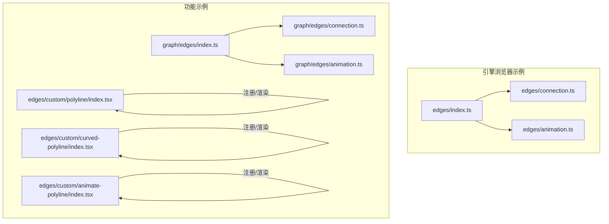
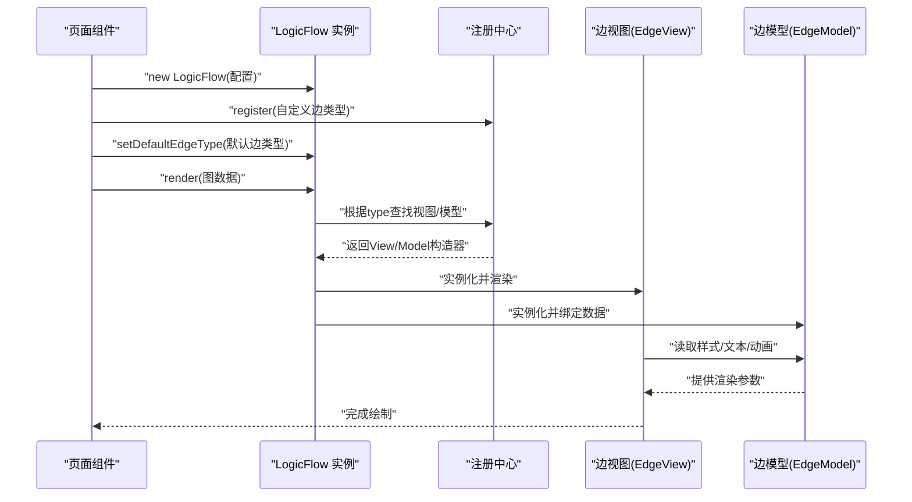
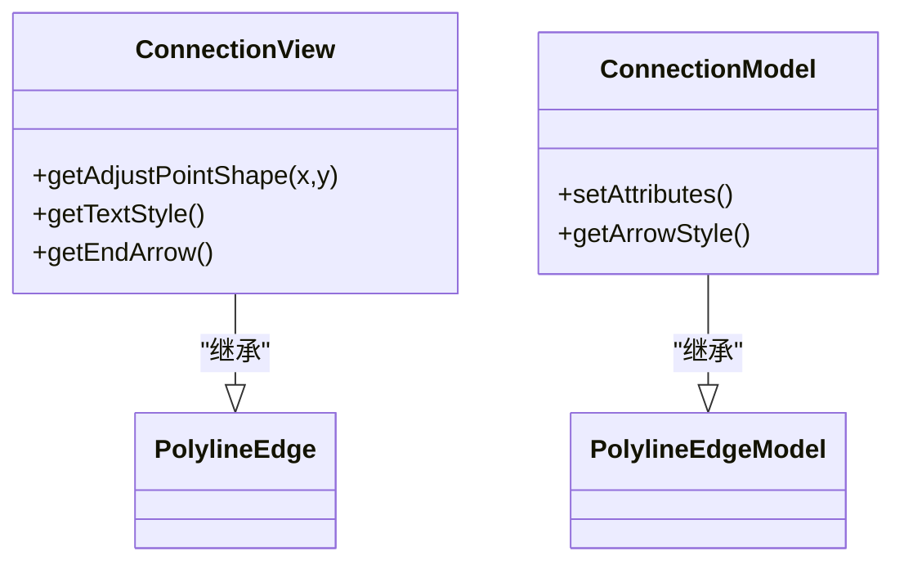
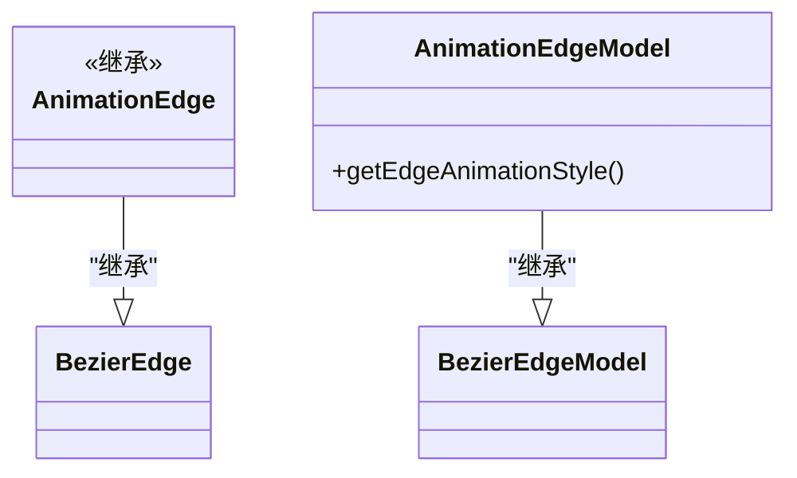
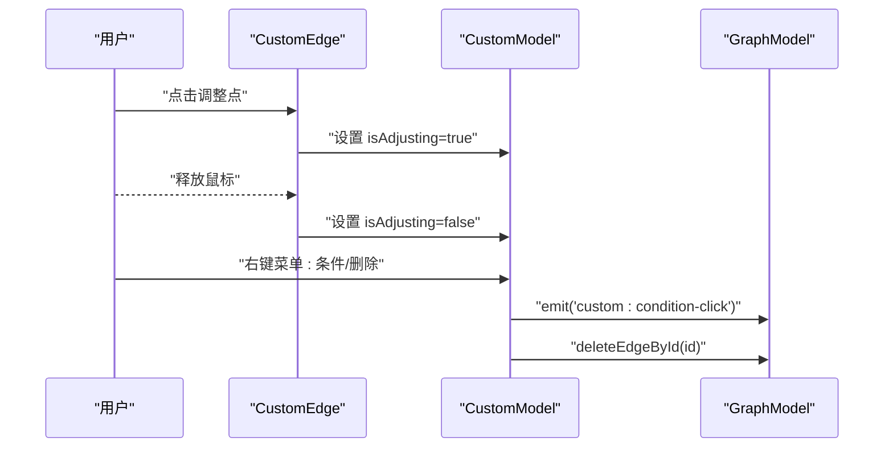
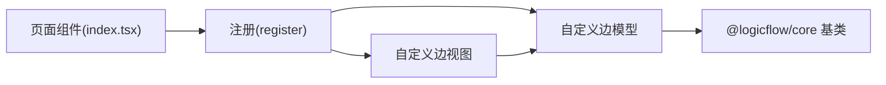

# 边连接处理

<cite>
**本文引用的文件**
- [examples/engine-browser-examples/src/pages/graph/edges/index.ts](file://examples/engine-browser-examples/src/pages/graph/edges/index.ts)
- [examples/engine-browser-examples/src/pages/graph/edges/connection.ts](file://examples/engine-browser-examples/src/pages/graph/edges/connection.ts)
- [examples/engine-browser-examples/src/pages/graph/edges/animation.ts](file://examples/engine-browser-examples/src/pages/graph/edges/animation.ts)
- [examples/feature-examples/src/pages/graph/edges/index.ts](file://examples/feature-examples/src/pages/graph/edges/index.ts)
- [examples/feature-examples/src/pages/graph/edges/connection.ts](file://examples/feature-examples/src/pages/graph/edges/connection.ts)
- [examples/feature-examples/src/pages/graph/edges/animation.ts](file://examples/feature-examples/src/pages/graph/edges/animation.ts)
- [examples/feature-examples/src/pages/edges/custom/polyline/index.tsx](file://examples/feature-examples/src/pages/edges/custom/polyline/index.tsx)
- [examples/feature-examples/src/pages/edges/custom/curved-polyline/index.tsx](file://examples/feature-examples/src/pages/edges/custom/curved-polyline/index.tsx)
- [examples/feature-examples/src/pages/edges/custom/animate-polyline/index.tsx](file://examples/feature-examples/src/pages/edges/custom/animate-polyline/index.tsx)
</cite>

## 目录
1. [引言](#引言)
2. [项目结构](#项目结构)
3. [核心组件](#核心组件)
4. [架构总览](#架构总览)
5. [详细组件分析](#详细组件分析)
6. [依赖关系分析](#依赖关系分析)
7. [性能考虑](#性能考虑)
8. [故障排查指南](#故障排查指南)
9. [结论](#结论)
10. [附录](#附录)

## 引言
本文件聚焦于 LogicFlow 图编辑引擎中的“边连接处理”，系统性阐述边的创建、编辑、删除与样式定制；详解折线、曲线与贝塞尔曲线三类边的特性与适用场景；说明锚点连接规则、连接校验与冲突处理；描述边文本编辑、标签显示与交互行为；解释动画效果、连接线样式与主题定制；并提供自定义边开发指南与实际应用示例，最后总结最佳实践与性能优化建议。

## 项目结构
围绕边连接处理的相关示例主要分布在以下路径：
- 引擎浏览器示例：examples/engine-browser-examples/src/pages/graph/edges
- 功能示例：examples/feature-examples/src/pages/graph/edges 与 examples/feature-examples/src/pages/edges/custom/*

这些目录提供了三种基础边类型（折线、曲线、贝塞尔）的自定义实现与使用方式，并展示了如何通过注册自定义边类型、设置属性与样式、控制动画与文本位置等。

**图表来源**
- [examples/engine-browser-examples/src/pages/graph/edges/index.ts](file://examples/engine-browser-examples/src/pages/graph/edges/index.ts#L1-L8)
- [examples/engine-browser-examples/src/pages/graph/edges/connection.ts](file://examples/engine-browser-examples/src/pages/graph/edges/connection.ts#L1-L85)
- [examples/engine-browser-examples/src/pages/graph/edges/animation.ts](file://examples/engine-browser-examples/src/pages/graph/edges/animation.ts#L1-L20)
- [examples/feature-examples/src/pages/graph/edges/index.ts](file://examples/feature-examples/src/pages/graph/edges/index.ts#L1-L8)
- [examples/feature-examples/src/pages/graph/edges/connection.ts](file://examples/feature-examples/src/pages/graph/edges/connection.ts#L1-L84)
- [examples/feature-examples/src/pages/graph/edges/animation.ts](file://examples/feature-examples/src/pages/graph/edges/animation.ts#L1-L20)
- [examples/feature-examples/src/pages/edges/custom/polyline/index.tsx](file://examples/feature-examples/src/pages/edges/custom/polyline/index.tsx#L1-L571)
- [examples/feature-examples/src/pages/edges/custom/curved-polyline/index.tsx](file://examples/feature-examples/src/pages/edges/custom/curved-polyline/index.tsx#L1-L234)
- [examples/feature-examples/src/pages/edges/custom/animate-polyline/index.tsx](file://examples/feature-examples/src/pages/edges/custom/animate-polyline/index.tsx#L1-L178)

**章节来源**
- [examples/engine-browser-examples/src/pages/graph/edges/index.ts](file://examples/engine-browser-examples/src/pages/graph/edges/index.ts#L1-L8)
- [examples/feature-examples/src/pages/graph/edges/index.ts](file://examples/feature-examples/src/pages/graph/edges/index.ts#L1-L8)

## 核心组件
- 折线边（PolylineEdge/PolylineEdgeModel）
  - 特点：由多个折点构成，适合清晰表达层级或流程走向。
  - 示例：connection.ts 中的 ConnectionView/ConnectionModel 展示了可调整点、文本背景、箭头类型切换与属性驱动的样式变化。
- 曲线边（CurveEdge/CurveEdgeModel）
  - 特点：通过曲线连接，视觉上更柔和，适合强调路径的连续性。
  - 示例：curved-polyline 示例展示了多段折线与曲线组合的布局与渲染。
- 贝塞尔边（BezierEdge/BezierEdgeModel）
  - 特点：基于三次贝塞尔曲线，适合需要平滑过渡与复杂路径的场景。
  - 示例：animation.ts 中的 AnimationEdge/AnimationEdgeModel 展示了动画样式的定制。

此外，自定义边示例还演示了：
- 文本位置与样式定制（getTextStyle、getTextPosition）
- 动画样式（getEdgeAnimationStyle）
- 右键菜单与交互（setAttributes、menu、事件中心）
- 锚点形状与箭头类型（getEndArrow、properties.arrowType）

**章节来源**
- [examples/engine-browser-examples/src/pages/graph/edges/connection.ts](file://examples/engine-browser-examples/src/pages/graph/edges/connection.ts#L1-L85)
- [examples/engine-browser-examples/src/pages/graph/edges/animation.ts](file://examples/engine-browser-examples/src/pages/graph/edges/animation.ts#L1-L20)
- [examples/feature-examples/src/pages/graph/edges/connection.ts](file://examples/feature-examples/src/pages/graph/edges/connection.ts#L1-L84)
- [examples/feature-examples/src/pages/graph/edges/animation.ts](file://examples/feature-examples/src/pages/graph/edges/animation.ts#L1-L20)
- [examples/feature-examples/src/pages/edges/custom/polyline/index.tsx](file://examples/feature-examples/src/pages/edges/custom/polyline/index.tsx#L1-L571)
- [examples/feature-examples/src/pages/edges/custom/curved-polyline/index.tsx](file://examples/feature-examples/src/pages/edges/custom/curved-polyline/index.tsx#L1-L234)
- [examples/feature-examples/src/pages/edges/custom/animate-polyline/index.tsx](file://examples/feature-examples/src/pages/edges/custom/animate-polyline/index.tsx#L1-L178)

## 架构总览
下图展示边的注册、渲染与交互的关键流程：页面组件初始化 LogicFlow 实例，注册自定义边类型，设置默认边类型，渲染图数据，随后通过模型与视图协同完成边的绘制、样式与动画控制。

**图表来源**
- [examples/feature-examples/src/pages/edges/custom/polyline/index.tsx](file://examples/feature-examples/src/pages/edges/custom/polyline/index.tsx#L156-L171)
- [examples/feature-examples/src/pages/edges/custom/curved-polyline/index.tsx](file://examples/feature-examples/src/pages/edges/custom/curved-polyline/index.tsx#L15-L29)
- [examples/feature-examples/src/pages/edges/custom/animate-polyline/index.tsx](file://examples/feature-examples/src/pages/edges/custom/animate-polyline/index.tsx#L15-L29)

## 详细组件分析

### 折线边：连接线与属性驱动样式
- 自定义视图（ConnectionView）
  - 调整点图形：提供可拖拽的调整点形状，用于动态修改折线路径。
  - 文本样式：通过 getTextStyle 返回背景填充、高度、边框与圆角等样式。
  - 箭头类型：根据 properties.arrowType 渲染空心箭头、半箭头或实心箭头。
- 自定义模型（ConnectionModel）
  - 属性驱动：根据 properties.isActived、properties.arrow 等设置边的描边色与箭头配置。
  - 箭头样式：重写 getArrowStyle 改变箭头主色。
- 典型用法
  - 在页面中注册该边类型并设置为默认边，即可在拖拽连线时自动应用自定义样式与交互。

**图表来源**
- [examples/engine-browser-examples/src/pages/graph/edges/connection.ts](file://examples/engine-browser-examples/src/pages/graph/edges/connection.ts#L4-L78)
- [examples/feature-examples/src/pages/graph/edges/connection.ts](file://examples/feature-examples/src/pages/graph/edges/connection.ts#L3-L77)

**章节来源**
- [examples/engine-browser-examples/src/pages/graph/edges/connection.ts](file://examples/engine-browser-examples/src/pages/graph/edges/connection.ts#L1-L85)
- [examples/feature-examples/src/pages/graph/edges/connection.ts](file://examples/feature-examples/src/pages/graph/edges/connection.ts#L1-L84)

### 贝塞尔边：动画样式定制
- 自定义视图（AnimationEdge）
  - 继承 BezierEdge，保持贝塞尔曲线的绘制能力。
- 自定义模型（AnimationEdgeModel）
  - 重写 getEdgeAnimationStyle，设置动画时长、方向与描边色，实现动态效果。
- 典型用法
  - 注册后作为默认边类型，或在特定场景下按需切换，以突出流程中的关键路径。

**图表来源**
- [examples/engine-browser-examples/src/pages/graph/edges/animation.ts](file://examples/engine-browser-examples/src/pages/graph/edges/animation.ts#L1-L20)
- [examples/feature-examples/src/pages/graph/edges/animation.ts](file://examples/feature-examples/src/pages/graph/edges/animation.ts#L1-L20)

**章节来源**
- [examples/engine-browser-examples/src/pages/graph/edges/animation.ts](file://examples/engine-browser-examples/src/pages/graph/edges/animation.ts#L1-L20)
- [examples/feature-examples/src/pages/graph/edges/animation.ts](file://examples/feature-examples/src/pages/graph/edges/animation.ts#L1-L20)

### 自定义折线边：交互、菜单与文本位置
- 自定义视图（CustomEdge）
  - 调整点交互：在调整点上绑定鼠标事件，通过 edgeModel.isAdjusting 控制调整状态。
  - 菜单与事件：在 setAttributes 中注入右键菜单项，回调中通过事件中心触发自定义事件。
- 自定义模型（CustomModel）
  - 动画与样式：getEdgeAnimationStyle 与 getEdgeStyle 分别控制动画虚线与选中态高亮。
  - 文本位置：getTextPosition 基于折点列表计算文本位置，支持在垂直段上偏移。
  - 静默模式：setHovered 在静默模式下控制悬停选中与置顶。
- 页面集成
  - 通过 lf.register 注册自定义边与默认边类型，render 渲染初始数据。

**图表来源**
- [examples/feature-examples/src/pages/edges/custom/polyline/index.tsx](file://examples/feature-examples/src/pages/edges/custom/polyline/index.tsx#L9-L36)
- [examples/feature-examples/src/pages/edges/custom/polyline/index.tsx](file://examples/feature-examples/src/pages/edges/custom/polyline/index.tsx#L39-L139)

**章节来源**
- [examples/feature-examples/src/pages/edges/custom/polyline/index.tsx](file://examples/feature-examples/src/pages/edges/custom/polyline/index.tsx#L1-L571)

### 自定义圆角折线边：曲线与折线组合
- 圆角折线示例展示了多段折线与曲线组合的布局，适用于需要在转角处增加圆润感的流程图。
- 页面通过 render 方法一次性渲染多条边，便于对比不同路径与文本位置的效果。

**章节来源**
- [examples/feature-examples/src/pages/edges/custom/curved-polyline/index.tsx](file://examples/feature-examples/src/pages/edges/custom/curved-polyline/index.tsx#L1-L234)

### 自定义带动画折线边：文本位置与样式
- 动画折线示例通过自定义边类型与样式属性（如 strokeWidth）实现统一风格的动画边。
- 提供选择器动态修改文本位置，验证 getTextPosition 的实时生效。

**章节来源**
- [examples/feature-examples/src/pages/edges/custom/animate-polyline/index.tsx](file://examples/feature-examples/src/pages/edges/custom/animate-polyline/index.tsx#L1-L178)

## 依赖关系分析
- 组件耦合
  - 视图层（EdgeView）依赖模型层（EdgeModel）提供的样式、文本与动画参数。
  - 页面组件负责注册与渲染，通过 setDefaultEdgeType 与 render 数据驱动视图与模型。
- 外部依赖
  - @logicflow/core 提供 Edge/Model 基类与 h JSX 工具，支撑视图渲染与交互。
- 潜在循环依赖
  - 当前示例中未见直接循环依赖；若在业务侧扩展事件中心或工具模块，需避免双向引用。

**图表来源**
- [examples/feature-examples/src/pages/edges/custom/polyline/index.tsx](file://examples/feature-examples/src/pages/edges/custom/polyline/index.tsx#L169-L171)
- [examples/feature-examples/src/pages/edges/custom/curved-polyline/index.tsx](file://examples/feature-examples/src/pages/edges/custom/curved-polyline/index.tsx#L28-L29)
- [examples/feature-examples/src/pages/edges/custom/animate-polyline/index.tsx](file://examples/feature-examples/src/pages/edges/custom/animate-polyline/index.tsx#L28-L29)

**章节来源**
- [examples/feature-examples/src/pages/edges/custom/polyline/index.tsx](file://examples/feature-examples/src/pages/edges/custom/polyline/index.tsx#L1-L571)
- [examples/feature-examples/src/pages/edges/custom/curved-polyline/index.tsx](file://examples/feature-examples/src/pages/edges/custom/curved-polyline/index.tsx#L1-L234)
- [examples/feature-examples/src/pages/edges/custom/animate-polyline/index.tsx](file://examples/feature-examples/src/pages/edges/custom/animate-polyline/index.tsx#L1-L178)

## 性能考虑
- 减少不必要的重绘
  - 合理使用 setProperties 更新属性，避免频繁触发全量重绘。
  - 对动画边，统一设置动画时长与方向，减少重复计算。
- 文本与路径计算
  - getTextPosition 应尽量复用已有的 pointsList，避免在高频事件中重复解析。
- 交互优化
  - 调整点交互仅在 isAdjusting 期间更新路径，结束后及时释放事件监听。
- 大规模图渲染
  - 使用分页/懒加载策略，按需渲染可见区域内的边与节点。
  - 合理设置网格大小与缩放限制，降低渲染压力。

## 故障排查指南
- 箭头不显示或样式异常
  - 检查 getArrowStyle 返回值与 properties.arrowType 是否匹配。
  - 确认 markerEnd 配置是否正确赋值到 arrowConfig。
- 文本位置不生效
  - 确认是否调用了 setProperties 并重新计算 getTextPosition。
  - 检查文本对象的 x/y 是否随位置更新同步。
- 动画无效
  - 确认 getEdgeAnimationStyle 是否被正确覆盖，且动画时长与方向设置合理。
- 调整点无法拖动
  - 检查 isAdjusting 状态是否在鼠标抬起事件中正确清除。
  - 确保事件监听在组件卸载时被清理，避免内存泄漏。

**章节来源**
- [examples/engine-browser-examples/src/pages/graph/edges/connection.ts](file://examples/engine-browser-examples/src/pages/graph/edges/connection.ts#L61-L77)
- [examples/feature-examples/src/pages/edges/custom/polyline/index.tsx](file://examples/feature-examples/src/pages/edges/custom/polyline/index.tsx#L65-L74)
- [examples/feature-examples/src/pages/edges/custom/animate-polyline/index.tsx](file://examples/feature-examples/src/pages/edges/custom/animate-polyline/index.tsx#L140-L158)

## 结论
通过自定义边类型与模型，LogicFlow 能够灵活适配多种流程图需求。折线边适合清晰路径，曲线与贝塞尔边适合平滑过渡。结合属性驱动样式、文本位置与动画，可构建出既美观又易用的可视化流程图。建议在实际项目中遵循最小必要更新原则，合理组织交互与事件，确保大规模图的流畅体验。

## 附录

### 不同类型边的特点与适用场景
- 折线边（PolylineEdge）
  - 特点：路径由折点组成，易于理解与维护。
  - 适用：流程图、决策树、步骤串联。
- 曲线边（CurveEdge）
  - 特点：路径平滑，视觉柔和。
  - 适用：强调连续性的流程或艺术化设计。
- 贝塞尔边（BezierEdge）
  - 特点：可实现复杂路径与平滑过渡。
  - 适用：需要精细路径控制的高级流程图。

### 锚点连接规则与冲突处理
- 锚点选择
  - 通过 sourceAnchorId/targetAnchorId 明确连接锚点，避免默认锚点导致的误连。
- 冲突处理
  - 在 setAttributes 中注入菜单项，提供“删除连接线”等操作，快速解决冲突边。
  - 对于多条边汇聚/发散，建议使用正交或曲线策略减少遮挡。

### 边文本编辑与标签显示
- 文本样式：通过 getTextStyle 返回背景、高度、边框与圆角等。
- 文本位置：通过 getTextPosition 计算在折线段上的最优位置，支持 start/end/center。
- 交互：在页面中提供选择器动态修改文本位置，验证实时更新。

### 动画效果与主题定制
- 动画：通过 getEdgeAnimationStyle 设置动画时长、方向与描边色。
- 主题：在 getEdgeStyle 中根据选中态、属性等切换主题色，实现统一风格。

### 自定义边开发指南
- 步骤
  - 继承对应 Edge/Model 基类，重写必要的方法（如 getAdjustPointShape、getEdgeStyle、getEdgeAnimationStyle、getTextPosition）。
  - 在页面中注册自定义边类型，并设置为默认边类型。
  - 通过 properties 传递样式与行为参数，实现属性驱动的渲染。
- 最佳实践
  - 将交互逻辑（如调整点、菜单）集中在视图与模型中，保持职责分离。
  - 对高频事件（如移动、悬停）进行节流/防抖，提升性能。
  - 在组件卸载时清理事件监听，防止内存泄漏。