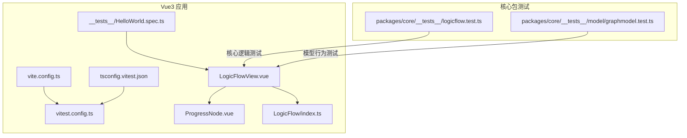
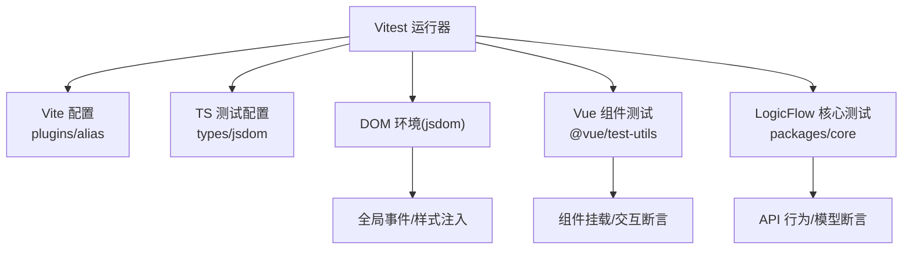
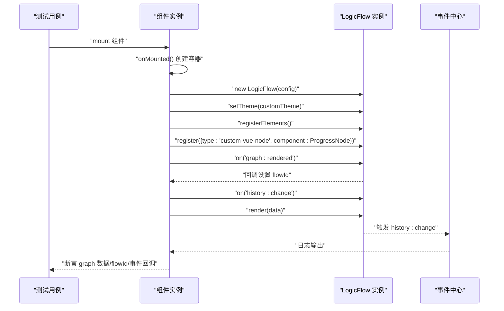
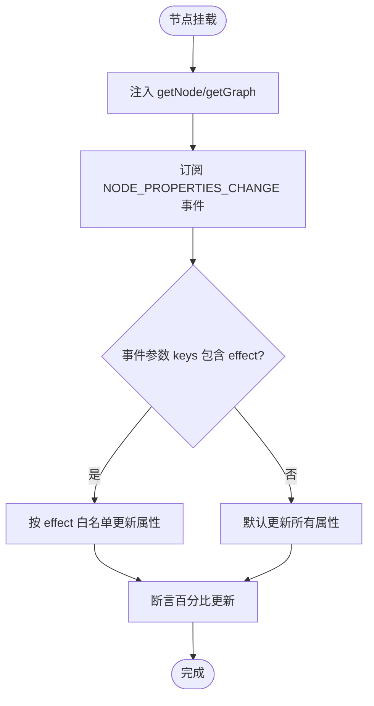
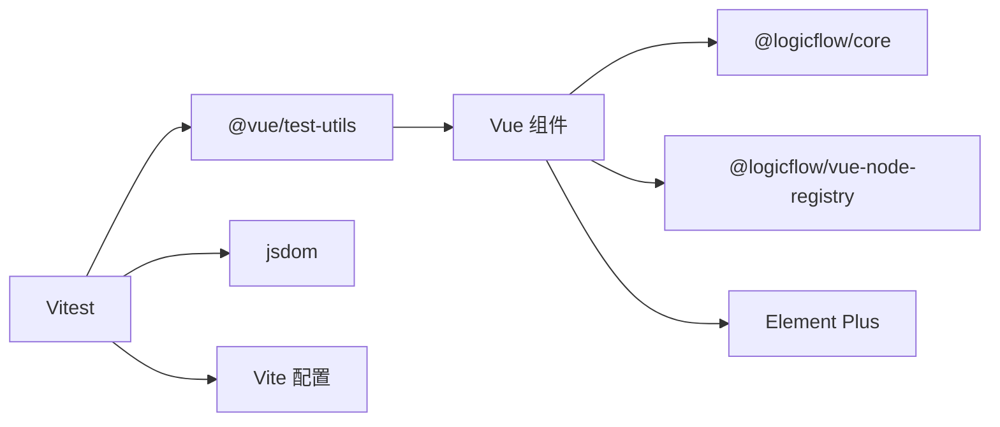

# 单元测试实践

<cite>
**本文引用的文件**
- [vitest.config.ts](file://examples/vue3-app/vitest.config.ts)
- [tsconfig.vitest.json](file://examples/vue3-app/tsconfig.vitest.json)
- [HelloWorld.spec.ts](file://examples/vue3-app/src/components/__tests__/HelloWorld.spec.ts)
- [package.json](file://examples/vue3-app/package.json)
- [vite.config.ts](file://examples/vue3-app/vite.config.ts)
- [LogicFlowView.vue](file://examples/vue3-app/src/views/LogicFlowView.vue)
- [ProgressNode.vue](file://examples/vue3-app/src/components/LFElements/ProgressNode.vue)
- [index.ts](file://examples/vue3-app/src/components/LogicFlow/index.ts)
- [logicflow.test.ts](file://packages/core/__tests__/logicflow.test.ts)
- [graphmodel.test.ts](file://packages/core/__tests__/model/graphmodel.test.ts)
</cite>

## 目录
1. [引言](#引言)
2. [项目结构](#项目结构)
3. [核心组件](#核心组件)
4. [架构总览](#架构总览)
5. [详细组件分析](#详细组件分析)
6. [依赖分析](#依赖分析)
7. [性能考虑](#性能考虑)
8. [故障排查指南](#故障排查指南)
9. [结论](#结论)
10. [附录](#附录)

## 引言
本文件面向 Vue3 + LogicFlow 的单元测试实践，系统讲解 Vitest 配置与使用、Vue 组件测试方法、LogicFlow 组件的测试策略与模拟、断言技巧与测试数据准备、覆盖率计算与提升、异步组件与事件处理测试，以及常见问题与解决方案。内容兼顾入门与进阶，帮助开发者快速建立稳定高效的测试体系。

## 项目结构
本仓库包含多端示例与核心包，其中 Vue3 示例应用位于 examples/vue3-app，包含：
- Vitest 配置与 TS 配置
- Vue 组件与视图层（含 LogicFlow 视图）
- LogicFlow 相关自定义节点与注册逻辑
- 核心包的单元测试（packages/core）

图表来源
- [vite.config.ts](file://examples/vue3-app/vite.config.ts#L1-L15)
- [tsconfig.vitest.json](file://examples/vue3-app/tsconfig.vitest.json#L1-L12)
- [vitest.config.ts](file://examples/vue3-app/vitest.config.ts#L1-L15)
- [LogicFlowView.vue](file://examples/vue3-app/src/views/LogicFlowView.vue#L1-L537)
- [ProgressNode.vue](file://examples/vue3-app/src/components/LFElements/ProgressNode.vue#L1-L41)
- [index.ts](file://examples/vue3-app/src/components/LogicFlow/index.ts#L1-L12)
- [HelloWorld.spec.ts](file://examples/vue3-app/src/components/__tests__/HelloWorld.spec.ts#L1-L12)
- [logicflow.test.ts](file://packages/core/__tests__/logicflow.test.ts#L1-L576)
- [graphmodel.test.ts](file://packages/core/__tests__/model/graphmodel.test.ts#L1-L88)

章节来源
- [vite.config.ts](file://examples/vue3-app/vite.config.ts#L1-L15)
- [tsconfig.vitest.json](file://examples/vue3-app/tsconfig.vitest.json#L1-L12)
- [vitest.config.ts](file://examples/vue3-app/vitest.config.ts#L1-L15)
- [LogicFlowView.vue](file://examples/vue3-app/src/views/LogicFlowView.vue#L1-L537)
- [ProgressNode.vue](file://examples/vue3-app/src/components/LFElements/ProgressNode.vue#L1-L41)
- [index.ts](file://examples/vue3-app/src/components/LogicFlow/index.ts#L1-L12)
- [HelloWorld.spec.ts](file://examples/vue3-app/src/components/__tests__/HelloWorld.spec.ts#L1-L12)
- [logicflow.test.ts](file://packages/core/__tests__/logicflow.test.ts#L1-L576)
- [graphmodel.test.ts](file://packages/core/__tests__/model/graphmodel.test.ts#L1-L88)

## 核心组件
- Vitest 配置：通过合并 Vite 配置启用 jsdom 环境，排除 e2e 目录，根目录定位在应用根。
- TS 测试配置：扩展应用 tsconfig，声明 jsdom 类型，支持测试编译。
- Vue 组件测试：使用 @vue/test-utils 的 mount 进行挂载，断言渲染结果。
- LogicFlow 视图：在 onMounted 中初始化 LogicFlow，注册元素、主题、事件，并渲染初始数据。
- 自定义节点：ProgressNode 通过注入机制监听属性变更事件，动态更新进度显示。
- 包级测试：核心包提供大量 LogicFlow API 行为测试，覆盖元素注册、操作、变换等。

章节来源
- [vitest.config.ts](file://examples/vue3-app/vitest.config.ts#L1-L15)
- [tsconfig.vitest.json](file://examples/vue3-app/tsconfig.vitest.json#L1-L12)
- [HelloWorld.spec.ts](file://examples/vue3-app/src/components/__tests__/HelloWorld.spec.ts#L1-L12)
- [LogicFlowView.vue](file://examples/vue3-app/src/views/LogicFlowView.vue#L1-L537)
- [ProgressNode.vue](file://examples/vue3-app/src/components/LFElements/ProgressNode.vue#L1-L41)
- [logicflow.test.ts](file://packages/core/__tests__/logicflow.test.ts#L1-L576)

## 架构总览
下图展示了测试运行时的总体关系：Vitest 读取 Vite 配置与 TS 测试配置，加载 DOM 环境，挂载 Vue 组件或实例化 LogicFlow，执行断言与覆盖率统计。

图表来源
- [vite.config.ts](file://examples/vue3-app/vite.config.ts#L1-L15)
- [tsconfig.vitest.json](file://examples/vue3-app/tsconfig.vitest.json#L1-L12)
- [vitest.config.ts](file://examples/vue3-app/vitest.config.ts#L1-L15)

## 详细组件分析

### Vitest 配置与使用
- 环境与排除：使用 jsdom 作为测试环境，排除 e2e 目录，确保仅执行单元测试。
- 根目录：root 指向应用目录，便于相对路径查找测试文件。
- TS 支持：通过 tsconfig.vitest.json 扩展应用 TS 配置，引入 jsdom 类型。
- 启动命令：package.json 中提供 test:unit 脚本，直接运行 Vitest。

章节来源
- [vitest.config.ts](file://examples/vue3-app/vitest.config.ts#L1-L15)
- [tsconfig.vitest.json](file://examples/vue3-app/tsconfig.vitest.json#L1-L12)
- [package.json](file://examples/vue3-app/package.json#L1-L52)

### Vue 组件测试：HelloWorld
- 测试目标：验证组件接收 props 并正确渲染。
- 断言方式：mount 后断言文本包含预期值。
- 建议：为复杂组件增加快照断言、事件触发断言、插槽渲染断言等。

章节来源
- [HelloWorld.spec.ts](file://examples/vue3-app/src/components/__tests__/HelloWorld.spec.ts#L1-L12)

### LogicFlow 视图组件测试策略
- 初始化时机：组件在 onMounted 中创建 LogicFlow 实例，注册元素、主题、事件与初始数据。
- 测试要点：
  - DOM 容器存在性与初始化调用链路。
  - 主题与元素注册是否生效。
  - 事件回调是否绑定，历史变更事件是否触发。
  - 初始数据渲染后节点/边数量与属性。
- 模拟建议：
  - 使用 jsdom 创建容器 div。
  - 使用 jest.spyOn 或 mock 重写 LogicFlow.prototype 方法以捕获调用。
  - 对外部依赖（如 Element Plus）使用浅层挂载或替换为无副作用的替代实现。
- 断言技巧：
  - 断言 getGraphData 返回结构、节点/边数量。
  - 断言 setProperties、changeNodeType、setEdgeId 等 API 的副作用。
  - 断言 zoom、translate、fitView 等变换 API 的状态变化。
- 异步处理：
  - onMounted 内部初始化可能涉及异步渲染，可等待 nextTick 或微任务队列稳定后再断言。
  - 对定时器或轮询场景，使用 jest.useFakeTimers 与 advanceTimers。

图表来源
- [LogicFlowView.vue](file://examples/vue3-app/src/views/LogicFlowView.vue#L119-L206)

章节来源
- [LogicFlowView.vue](file://examples/vue3-app/src/views/LogicFlowView.vue#L1-L537)

### 自定义节点 ProgressNode 测试
- 注入机制：通过 inject 获取 getNode 与 getGraph，订阅节点属性变更事件。
- 测试关注点：
  - 节点挂载后是否正确订阅事件。
  - 接收属性变更事件时，是否按 effect 白名单更新内部状态。
  - 未定义 effect 时，默认全量更新。
- 模拟建议：
  - 使用 provide/inject 的测试工具或手动注入 getNode/getGraph。
  - mock eventCenter.on，主动触发事件并断言内部状态变化。
- 断言技巧：
  - 断言 percentage 值随属性变化而更新。
  - 断言 effect 存在时仅对白名单属性生效。

图表来源
- [ProgressNode.vue](file://examples/vue3-app/src/components/LFElements/ProgressNode.vue#L1-L41)

章节来源
- [ProgressNode.vue](file://examples/vue3-app/src/components/LFElements/ProgressNode.vue#L1-L41)

### LogicFlow 核心 API 行为测试
- 覆盖范围：元素注册、插件使用、快捷键初始化、渲染、增删改查、变换、选择与层级、数据获取与清理等。
- 测试模式：通过创建 DOM 容器实例化 LogicFlow，构造原始数据，逐项断言 API 行为。
- 断言重点：
  - render 后节点/边数量与类型。
  - guards 生效时的增删行为。
  - setProperties/deleteProperty 的属性持久化。
  - zoom/translate/resize 等变换后的状态。
- 异步与计时器：部分测试包含延时断言，需注意异步稳定性。

章节来源
- [logicflow.test.ts](file://packages/core/__tests__/logicflow.test.ts#L1-L576)
- [graphmodel.test.ts](file://packages/core/__tests__/model/graphmodel.test.ts#L1-L88)

### 组件导出与安装测试
- 导出与安装：LogicFlow 组件模块导出 install 方法用于全局注册，便于在测试中统一管理组件注册。
- 测试建议：
  - 在测试前全局注册组件，避免找不到组件的错误。
  - 对于按需导入的场景，直接挂载组件并断言渲染。

章节来源
- [index.ts](file://examples/vue3-app/src/components/LogicFlow/index.ts#L1-L12)

## 依赖分析
- 测试运行时依赖：
  - Vitest：测试运行器与断言库。
  - @vue/test-utils：Vue 组件测试工具。
  - jsdom：DOM 环境模拟。
  - Vite：构建与别名解析。
- 业务依赖：
  - LogicFlow 核心库与 Vue 节点注册库。
  - Element Plus UI 组件库。
- 外部集成点：
  - 事件中心（事件派发与订阅）。
  - 主题与样式注入（CSS 文件）。

图表来源
- [package.json](file://examples/vue3-app/package.json#L1-L52)
- [LogicFlowView.vue](file://examples/vue3-app/src/views/LogicFlowView.vue#L1-L12)

章节来源
- [package.json](file://examples/vue3-app/package.json#L1-L52)

## 性能考虑
- 测试隔离：每个测试用例独立创建 DOM 容器，避免跨用例污染。
- 快照与断言：对复杂渲染使用快照，减少断言数量；对关键行为使用精确断言。
- 异步断言：合理使用 await 与微任务稳定，避免竞态条件。
- 覆盖率优先：先保证关键路径与边界条件，再逐步完善分支覆盖。
- Mock 策略：对外部副作用（网络、定时器、全局事件）进行 mock，提升稳定性与速度。

## 故障排查指南
- DOM 环境缺失：确认 vitest.config.ts 使用 jsdom 环境，且 tsconfig.vitest.json 引入 jsdom 类型。
- 组件未注册：若出现“找不到组件”错误，请在测试前调用组件 install 或在测试中显式注册。
- 事件未触发：检查 onMounted 生命周期与事件绑定顺序，必要时等待微任务稳定。
- 样式与主题：LogicFlow 样式需在测试环境中可用，确保样式文件被正确引入。
- 覆盖率不达标：补充关键分支与异常路径的测试用例，优先覆盖高风险区域。

## 结论
通过合理的 Vitest 配置、完善的组件与 LogicFlow 行为测试、清晰的断言与模拟策略，可以显著提升代码质量与交付效率。建议团队在开发早期即建立测试规范，持续完善覆盖率与回归测试，形成稳定的测试文化。

## 附录

### 测试脚本与命令
- 运行单元测试：使用应用根目录下的 test:unit 脚本启动 Vitest。
- 建议：在 CI 中开启覆盖率统计与报告生成。

章节来源
- [package.json](file://examples/vue3-app/package.json#L1-L52)