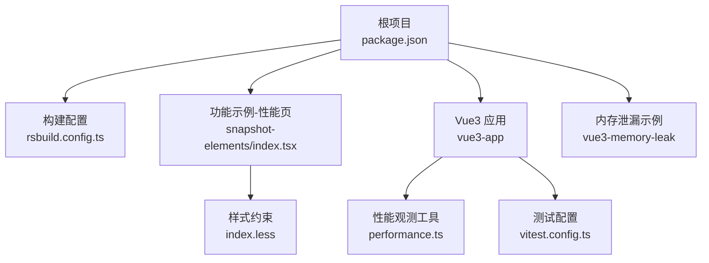
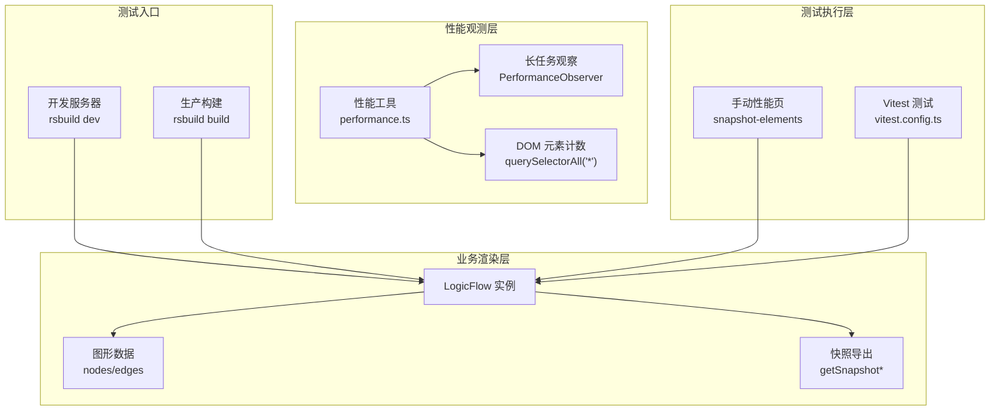
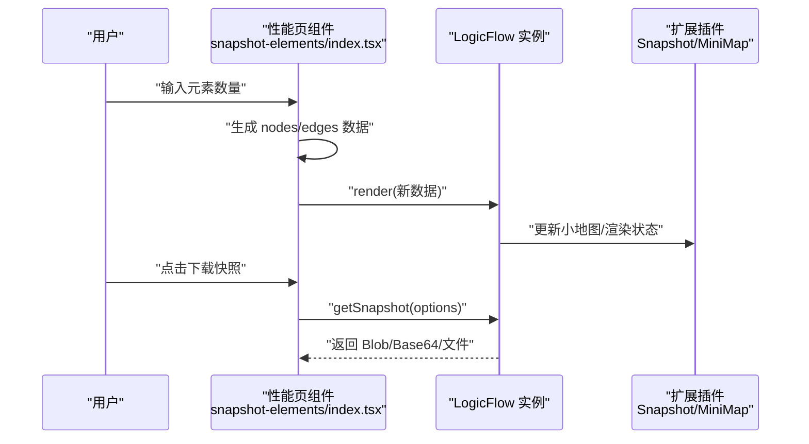
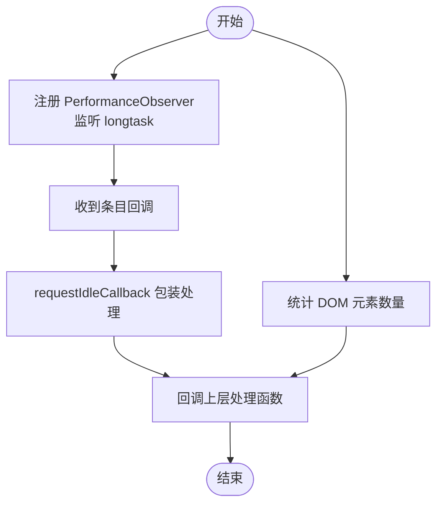
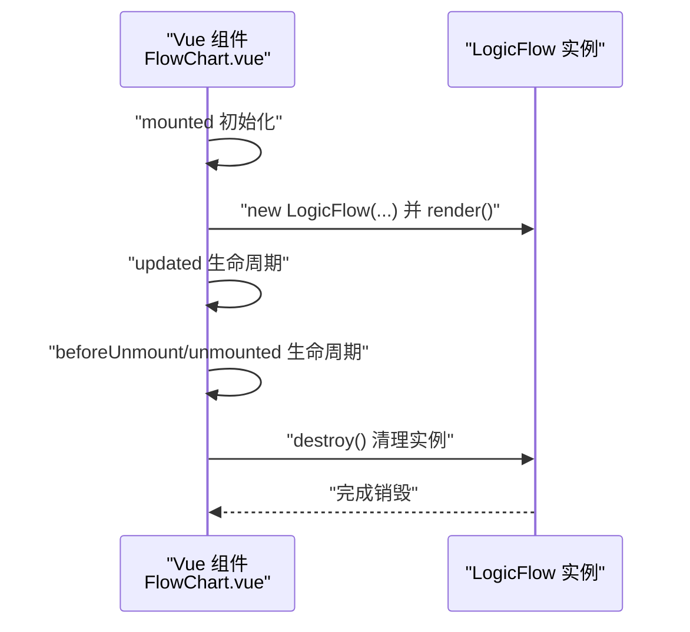
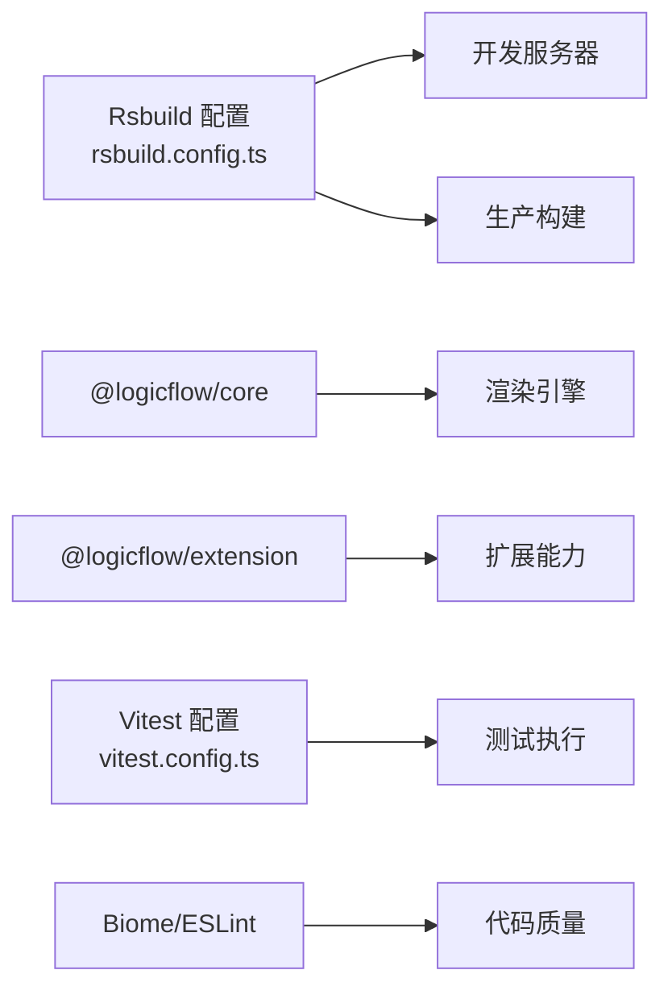

# 性能测试

<cite>
**本文引用的文件**
- [package.json](file://package.json)
- [rsbuild.config.ts](file://rsbuild.config.ts)
- [examples/feature-examples/src/pages/performance/snapshot-elements/index.tsx](file://examples/feature-examples/src/pages/performance/snapshot-elements/index.tsx)
- [examples/feature-examples/src/pages/performance/snapshot-elements/index.less](file://examples/feature-examples/src/pages/performance/snapshot-elements/index.less)
- [examples/vue3-app/src/utils/performance.ts](file://examples/vue3-app/src/utils/performance.ts)
- [examples/vue3-memory-leak/src/components/FlowChart.vue](file://examples/vue3-memory-leak/src/components/FlowChart.vue)
- [examples/vue3-app/vitest.config.ts](file://examples/vue3-app/vitest.config.ts)
- [README.md](file://README.md)
</cite>

## 目录
1. [简介](#简介)
2. [项目结构](#项目结构)
3. [核心组件](#核心组件)
4. [架构总览](#架构总览)
5. [详细组件分析](#详细组件分析)
6. [依赖分析](#依赖分析)
7. [性能考虑](#性能考虑)
8. [故障排查指南](#故障排查指南)
9. [结论](#结论)
10. [附录](#附录)

## 简介
本文件面向性能工程师，系统化梳理本仓库中的前端性能测试实践，覆盖以下主题：
- 前端性能测试方法与工具使用
- 内存泄漏检测与性能监控实施方案
- LogicFlow 大规模图形渲染的性能测试策略
- 组件渲染性能与交互响应时间的测试方法
- 浏览器兼容性测试与移动端性能测试配置
- 性能基准测试与回归测试的实施流程
- 面向工程落地的测试工具与分析方法

## 项目结构
本仓库采用多包/多示例结构，与性能测试直接相关的关键目录如下：
- examples/feature-examples：包含大规模图形渲染与快照导出的性能测试页面
- examples/vue3-app：包含性能观测工具与单元测试配置
- examples/vue3-memory-leak：包含 LogicFlow 内存泄漏示例与清理流程
- rsbuild.config.ts：构建与开发服务器配置，影响性能测试环境一致性
- package.json：依赖与脚本，支撑性能测试与基准运行

**图表来源**
- [package.json](file://package.json#L1-L45)
- [rsbuild.config.ts](file://rsbuild.config.ts#L1-L30)
- [examples/feature-examples/src/pages/performance/snapshot-elements/index.tsx](file://examples/feature-examples/src/pages/performance/snapshot-elements/index.tsx#L1-L445)
- [examples/feature-examples/src/pages/performance/snapshot-elements/index.less](file://examples/feature-examples/src/pages/performance/snapshot-elements/index.less#L1-L6)
- [examples/vue3-app/src/utils/performance.ts](file://examples/vue3-app/src/utils/performance.ts#L1-L28)
- [examples/vue3-app/vitest.config.ts](file://examples/vue3-app/vitest.config.ts#L1-L15)
- [examples/vue3-memory-leak/src/components/FlowChart.vue](file://examples/vue3-memory-leak/src/components/FlowChart.vue#L1-L225)

**章节来源**
- [package.json](file://package.json#L1-L45)
- [rsbuild.config.ts](file://rsbuild.config.ts#L1-L30)
- [README.md](file://README.md#L1-L37)

## 核心组件
- 性能观测工具：提供 DOM 元素计数与长任务观察能力，用于评估渲染与交互阻塞
- 大规模图形渲染测试页：通过动态增删节点/边数量，验证渲染与快照导出在不同规模下的表现
- 内存泄漏检测示例：在组件卸载时销毁 LogicFlow 实例，避免资源残留
- 测试配置：基于 Vitest 的 jsdom 环境，便于在无浏览器情况下进行单元与集成测试

**章节来源**
- [examples/vue3-app/src/utils/performance.ts](file://examples/vue3-app/src/utils/performance.ts#L1-L28)
- [examples/feature-examples/src/pages/performance/snapshot-elements/index.tsx](file://examples/feature-examples/src/pages/performance/snapshot-elements/index.tsx#L1-L445)
- [examples/vue3-memory-leak/src/components/FlowChart.vue](file://examples/vue3-memory-leak/src/components/FlowChart.vue#L166-L172)
- [examples/vue3-app/vitest.config.ts](file://examples/vue3-app/vitest.config.ts#L1-L15)

## 架构总览
下图展示性能测试在本项目的整体架构与数据流：

**图表来源**
- [rsbuild.config.ts](file://rsbuild.config.ts#L1-L30)
- [examples/vue3-app/src/utils/performance.ts](file://examples/vue3-app/src/utils/performance.ts#L1-L28)
- [examples/feature-examples/src/pages/performance/snapshot-elements/index.tsx](file://examples/feature-examples/src/pages/performance/snapshot-elements/index.tsx#L1-L445)
- [examples/vue3-memory-leak/src/components/FlowChart.vue](file://examples/vue3-memory-leak/src/components/FlowChart.vue#L1-L225)
- [examples/vue3-app/vitest.config.ts](file://examples/vue3-app/vitest.config.ts#L1-L15)

## 详细组件分析

### 组件一：大规模图形渲染与快照导出性能测试页
该页面用于验证 LogicFlow 在不同节点/边规模下的渲染与导出性能，支持：
- 动态调整元素数量，触发重新渲染
- 控制小地图可见性与边线显示
- 快照导出参数可调（类型、尺寸、背景色、内边距、质量、局部渲染）

**图表来源**
- [examples/feature-examples/src/pages/performance/snapshot-elements/index.tsx](file://examples/feature-examples/src/pages/performance/snapshot-elements/index.tsx#L103-L160)
- [examples/feature-examples/src/pages/performance/snapshot-elements/index.tsx](file://examples/feature-examples/src/pages/performance/snapshot-elements/index.tsx#L211-L232)

**章节来源**
- [examples/feature-examples/src/pages/performance/snapshot-elements/index.tsx](file://examples/feature-examples/src/pages/performance/snapshot-elements/index.tsx#L1-L445)
- [examples/feature-examples/src/pages/performance/snapshot-elements/index.less](file://examples/feature-examples/src/pages/performance/snapshot-elements/index.less#L1-L6)

### 组件二：性能观测工具（长任务与 DOM 计数）
该工具提供两类观测指标：
- 长任务观察：基于 PerformanceObserver 监听 longtask，结合 requestIdleCallback 回调，统计主线程阻塞
- DOM 元素计数：统计当前页面元素总数，辅助评估渲染副作用与内存占用趋势

**图表来源**
- [examples/vue3-app/src/utils/performance.ts](file://examples/vue3-app/src/utils/performance.ts#L17-L27)
- [examples/vue3-app/src/utils/performance.ts](file://examples/vue3-app/src/utils/performance.ts#L5-L5)

**章节来源**
- [examples/vue3-app/src/utils/performance.ts](file://examples/vue3-app/src/utils/performance.ts#L1-L28)

### 组件三：内存泄漏检测（组件卸载时销毁 LogicFlow）
内存泄漏检测的关键在于确保实例在组件生命周期结束时被正确销毁，避免事件监听、定时器与 DOM 引用残留。

**图表来源**
- [examples/vue3-memory-leak/src/components/FlowChart.vue](file://examples/vue3-memory-leak/src/components/FlowChart.vue#L18-L38)
- [examples/vue3-memory-leak/src/components/FlowChart.vue](file://examples/vue3-memory-leak/src/components/FlowChart.vue#L166-L172)

**章节来源**
- [examples/vue3-memory-leak/src/components/FlowChart.vue](file://examples/vue3-memory-leak/src/components/FlowChart.vue#L1-L225)

### 组件四：测试配置（Vitest + jsdom）
- 环境：jsdom，适合在终端运行 DOM 相关测试
- 排除：e2e 目录，避免与端到端测试冲突
- 根路径：指向示例应用根目录，便于定位测试文件

**章节来源**
- [examples/vue3-app/vitest.config.ts](file://examples/vue3-app/vitest.config.ts#L1-L15)

## 依赖分析
- 构建与开发：Rsbuild 提供 Vue/Vue JSX/Less 插件与开发服务器配置，保证性能测试环境的一致性
- 运行时依赖：@logicflow/core 与 @logicflow/extension 为核心渲染与扩展能力来源
- 工具链：Vitest 提供单元/集成测试能力；Biome/ESLint 等保障代码质量

**图表来源**
- [rsbuild.config.ts](file://rsbuild.config.ts#L1-L30)
- [package.json](file://package.json#L14-L27)
- [examples/vue3-app/vitest.config.ts](file://examples/vue3-app/vitest.config.ts#L1-L15)

**章节来源**
- [package.json](file://package.json#L1-L45)
- [rsbuild.config.ts](file://rsbuild.config.ts#L1-L30)

## 性能考虑
- 渲染规模控制
  - 使用“元素数量”滑杆驱动数据生成与重渲染，观察渲染耗时与帧率变化
  - 合理设置 grid、partial、小地图等参数，减少不必要的重绘与计算
- 快照导出优化
  - 选择合适的 fileType/quality/size，平衡体积与清晰度
  - 局部导出（partial）仅渲染必要区域，降低 Canvas 绘制成本
- 主线程阻塞检测
  - 利用长任务观察识别卡顿瓶颈，结合 DOM 元素计数评估副作用
- 内存管理
  - 在组件卸载时调用 destroy，避免事件监听与 DOM 引用泄漏
- 构建与缓存
  - 生产构建开启压缩与 Tree Shaking，减少首屏与交互延迟

[本节为通用指导，无需列出具体文件来源]

## 故障排查指南
- 页面卡顿/掉帧
  - 使用长任务观察定位阻塞点；检查是否存在大量同步重排/重绘
  - 减少一次性渲染元素数量，或启用分批渲染策略
- DOM 元素异常增长
  - 使用 DOM 计数工具定期采样，确认是否存在重复挂载或未清理的节点
- 快照导出失败或体积异常
  - 检查 fileType/size/padding/quality 参数组合是否合理
  - 尝试关闭小地图与边线以排除额外绘制开销
- 内存泄漏
  - 确认组件卸载路径已调用 destroy；使用浏览器内存面板观察堆栈变化
- 测试环境差异
  - 使用 jsdom 运行 Vitest，注意部分浏览器 API 不可用；如需真实浏览器测试，建议引入 Playwright/Cypress

**章节来源**
- [examples/vue3-app/src/utils/performance.ts](file://examples/vue3-app/src/utils/performance.ts#L1-L28)
- [examples/vue3-memory-leak/src/components/FlowChart.vue](file://examples/vue3-memory-leak/src/components/FlowChart.vue#L166-L172)
- [examples/vue3-app/vitest.config.ts](file://examples/vue3-app/vitest.config.ts#L1-L15)

## 结论
本仓库提供了从工具到场景的完整性能测试基线：
- 以性能观测工具与内存泄漏检测为抓手，建立日常巡检机制
- 以大规模渲染与快照导出测试页为载体，量化渲染与导出性能
- 以 Vitest/jsdom 为基础，形成可复现的自动化测试流程
- 结合构建配置与运行时参数，持续优化交互响应与资源占用

[本节为总结性内容，无需列出具体文件来源]

## 附录

### A. 前端性能测试方法与工具使用
- 浏览器性能面板：记录渲染、合成、脚本执行时间
- 自定义观测：长任务观察与 DOM 计数
- 快照导出：对比不同参数组合下的体积与生成时间
- 单元测试：利用 Vitest 在 jsdom 中验证逻辑分支与边界条件

**章节来源**
- [examples/vue3-app/src/utils/performance.ts](file://examples/vue3-app/src/utils/performance.ts#L1-L28)
- [examples/feature-examples/src/pages/performance/snapshot-elements/index.tsx](file://examples/feature-examples/src/pages/performance/snapshot-elements/index.tsx#L211-L232)
- [examples/vue3-app/vitest.config.ts](file://examples/vue3-app/vitest.config.ts#L1-L15)

### B. LogicFlow 大规模图形渲染的性能测试策略
- 规模梯度：从百级到千级节点/边，记录渲染耗时与 FPS
- 参数扰动：grid、小地图、边线、partial 等开关逐一验证
- 导出压测：PNG/JPEG/WebP/GIF/SVG 多格式对比生成耗时与体积
- 回归基线：固定数据集与参数，建立稳定的时间/空间指标

**章节来源**
- [examples/feature-examples/src/pages/performance/snapshot-elements/index.tsx](file://examples/feature-examples/src/pages/performance/snapshot-elements/index.tsx#L103-L160)
- [examples/feature-examples/src/pages/performance/snapshot-elements/index.tsx](file://examples/feature-examples/src/pages/performance/snapshot-elements/index.tsx#L211-L232)

### C. 组件渲染性能与交互响应时间测试
- 渲染性能：测量 render/new LogicFlow 的耗时，关注首次与增量渲染
- 交互响应：记录鼠标/键盘事件到回调执行的延迟，结合长任务观察定位阻塞
- DOM 变化：在渲染前后采样 DOM 元素数量，评估副作用

**章节来源**
- [examples/vue3-app/src/utils/performance.ts](file://examples/vue3-app/src/utils/performance.ts#L1-L28)
- [examples/feature-examples/src/pages/performance/snapshot-elements/index.tsx](file://examples/feature-examples/src/pages/performance/snapshot-elements/index.tsx#L73-L98)

### D. 浏览器兼容性测试与移动端性能测试配置
- 兼容性：在主流桌面浏览器中验证渲染与交互；对不支持的 API 进行降级
- 移动端：关注触摸事件、合成层与 GPU 加速；在真机或模拟器中验证滚动与缩放
- 真实环境：建议引入 Playwright/Cypress 执行端到端性能测试

[本节为通用指导，无需列出具体文件来源]

### E. 性能基准测试与回归测试实施流程
- 基准：固定数据规模与参数，采集平均/中位数/第95百分位
- 回归：每次变更后自动运行相同用例，对比指标阈值
- 报告：输出时间序列与可视化图表，标注异常波动

[本节为通用指导，无需列出具体文件来源]

### F. 开发与构建环境
- 启动开发服务器与本地预览，确保测试环境一致
- 生产构建产物用于真实性能评估

**章节来源**
- [README.md](file://README.md#L11-L29)
- [rsbuild.config.ts](file://rsbuild.config.ts#L19-L23)