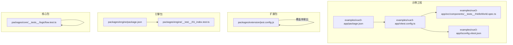
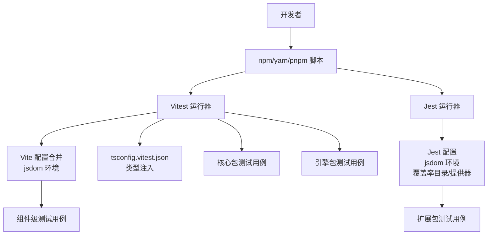
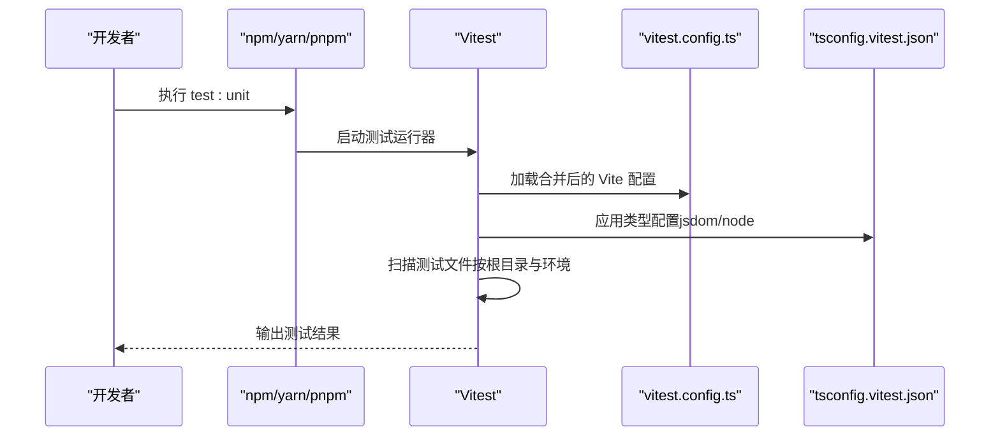
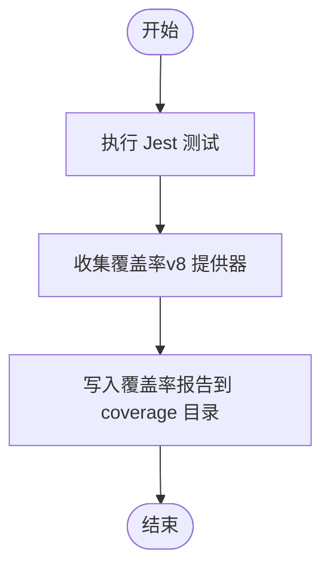
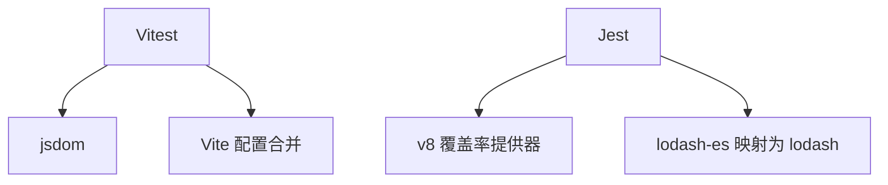

# 测试工具配置

<cite>
**本文引用的文件**
- [examples/vue3-app/vitest.config.ts](file://examples/vue3-app/vitest.config.ts)
- [examples/vue3-app/package.json](file://examples/vue3-app/package.json)
- [examples/vue3-app/tsconfig.vitest.json](file://examples/vue3-app/tsconfig.vitest.json)
- [packages/extension/jest.config.js](file://packages/extension/jest.config.js)
- [packages/engine/package.json](file://packages/engine/package.json)
- [packages/core/__tests__/logicflow.test.ts](file://packages/core/__tests__/logicflow.test.ts)
- [packages/engine/__test__/01_index.test.ts](file://packages/engine/__test__/01_index.test.ts)
- [examples/vue3-app/src/components/__tests__/HelloWorld.spec.ts](file://examples/vue3-app/src/components/__tests__/HelloWorld.spec.ts)
</cite>

## 目录
1. [简介](#简介)
2. [项目结构](#项目结构)
3. [核心组件](#核心组件)
4. [架构总览](#架构总览)
5. [详细组件分析](#详细组件分析)
6. [依赖分析](#依赖分析)
7. [性能考虑](#性能考虑)
8. [故障排除指南](#故障排除指南)
9. [结论](#结论)
10. [附录](#附录)

## 简介
本文件面向开发者，系统性梳理本仓库中单元测试与集成测试的配置与实践，覆盖以下主题：
- Vitest 配置与运行方式（含 Vite 集成、测试环境、排除规则）
- Jest 配置与覆盖率统计（含环境、模块映射、覆盖率目录与提供器）
- 测试脚本与命令（在各包与示例工程中的 scripts 定义）
- 测试数据管理与模拟服务（通过测试环境与模块映射实现）
- 并行执行与性能优化（基于测试运行器与环境配置）
- CI/CD 中的测试执行建议（结合现有脚本与配置）

本指南既适用于初学者快速上手，也便于有经验的开发者进行深度定制与优化。

## 项目结构
本仓库包含多处测试配置与用例，主要分布在：
- Vue3 示例工程：Vitest 配置、测试脚本、类型配置
- 扩展包（packages/extension）：Jest 配置与覆盖率输出
- 引擎包（packages/engine）：测试脚本定义
- 核心包（packages/core）：大量单元测试用例
- Vue3 示例工程组件层：Vue 组件级测试用例

下图给出与测试相关的关键文件与角色关系：

图表来源
- [examples/vue3-app/vitest.config.ts](file://examples/vue3-app/vitest.config.ts#L1-L15)
- [examples/vue3-app/package.json](file://examples/vue3-app/package.json#L1-L52)
- [examples/vue3-app/tsconfig.vitest.json](file://examples/vue3-app/tsconfig.vitest.json#L1-L12)
- [examples/vue3-app/src/components/__tests__/HelloWorld.spec.ts](file://examples/vue3-app/src/components/__tests__/HelloWorld.spec.ts)
- [packages/extension/jest.config.js](file://packages/extension/jest.config.js#L1-L199)
- [packages/engine/package.json](file://packages/engine/package.json#L1-L50)
- [packages/engine/__test__/01_index.test.ts](file://packages/engine/__test__/01_index.test.ts)
- [packages/core/__tests__/logicflow.test.ts](file://packages/core/__tests__/logicflow.test.ts)

章节来源
- [examples/vue3-app/vitest.config.ts](file://examples/vue3-app/vitest.config.ts#L1-L15)
- [examples/vue3-app/package.json](file://examples/vue3-app/package.json#L1-L52)
- [examples/vue3-app/tsconfig.vitest.json](file://examples/vue3-app/tsconfig.vitest.json#L1-L12)
- [packages/extension/jest.config.js](file://packages/extension/jest.config.js#L1-L199)
- [packages/engine/package.json](file://packages/engine/package.json#L1-L50)
- [packages/core/__tests__/logicflow.test.ts](file://packages/core/__tests__/logicflow.test.ts)
- [packages/engine/__test__/01_index.test.ts](file://packages/engine/__test__/01_index.test.ts)
- [examples/vue3-app/src/components/__tests__/HelloWorld.spec.ts](file://examples/vue3-app/src/components/__tests__/HelloWorld.spec.ts)

## 核心组件
- Vitest 配置与运行
  - 通过合并 Vite 配置，设置测试环境为 jsdom，排除 e2e 目录，指定测试根目录
  - 在示例工程中，测试脚本通过 npm/yarn/pnpm 的 test:unit 命令触发
  - 类型层面通过独立的 tsconfig.vitest.json 注入 jsdom 与 node 类型
- Jest 配置与覆盖率
  - 覆盖率目录与提供器明确配置，模块映射用于兼容第三方库
  - 测试环境为 jsdom，便于 DOM 相关测试
- 测试脚本与命令
  - 各包与示例工程在 package.json 中定义了 test 或 test:unit 脚本
- 测试数据与模拟
  - 通过模块映射与环境配置，可对第三方依赖进行模拟或替换
- 并行与性能
  - Vitest 默认支持并发运行；Jest 可通过 maxWorkers 控制工作进程数
- CI/CD 执行
  - 使用现有脚本即可在流水线中直接运行测试

章节来源
- [examples/vue3-app/vitest.config.ts](file://examples/vue3-app/vitest.config.ts#L1-L15)
- [examples/vue3-app/package.json](file://examples/vue3-app/package.json#L1-L52)
- [examples/vue3-app/tsconfig.vitest.json](file://examples/vue3-app/tsconfig.vitest.json#L1-L12)
- [packages/extension/jest.config.js](file://packages/extension/jest.config.js#L1-L199)
- [packages/engine/package.json](file://packages/engine/package.json#L1-L50)

## 架构总览
下图展示测试工具在本仓库中的整体布局与交互关系：

图表来源
- [examples/vue3-app/vitest.config.ts](file://examples/vue3-app/vitest.config.ts#L1-L15)
- [examples/vue3-app/tsconfig.vitest.json](file://examples/vue3-app/tsconfig.vitest.json#L1-L12)
- [packages/extension/jest.config.js](file://packages/extension/jest.config.js#L1-L199)
- [packages/engine/package.json](file://packages/engine/package.json#L1-L50)

## 详细组件分析

### Vitest 配置与运行流程
- 配置要点
  - 合并 Vite 配置，确保测试与构建共享基础能力
  - 设置测试环境为 jsdom，适配浏览器 DOM API
  - 排除 e2e 目录，避免误将端到端测试当作单元测试执行
  - 指定测试根目录，保证扫描范围清晰
- 类型配置
  - 通过独立 tsconfig.vitest.json 注入 jsdom 与 node 类型，提升测试文件的类型安全
- 运行方式
  - 在示例工程中，通过 test:unit 脚本触发 Vitest
- 典型调用序列

图表来源
- [examples/vue3-app/vitest.config.ts](file://examples/vue3-app/vitest.config.ts#L1-L15)
- [examples/vue3-app/package.json](file://examples/vue3-app/package.json#L1-L52)
- [examples/vue3-app/tsconfig.vitest.json](file://examples/vue3-app/tsconfig.vitest.json#L1-L12)

章节来源
- [examples/vue3-app/vitest.config.ts](file://examples/vue3-app/vitest.config.ts#L1-L15)
- [examples/vue3-app/package.json](file://examples/vue3-app/package.json#L1-L52)
- [examples/vue3-app/tsconfig.vitest.json](file://examples/vue3-app/tsconfig.vitest.json#L1-L12)

### Jest 配置与覆盖率统计
- 配置要点
  - 测试环境：jsdom
  - 覆盖率目录：coverage
  - 覆盖率提供器：v8
  - 模块映射：将 lodash-es 映射为 lodash，便于测试时统一依赖形态
- 覆盖率生成
  - 运行测试后，覆盖率文件会写入 coverage 目录，可进一步导出 LCOV 等格式供 CI 使用
- 典型流程

图表来源
- [packages/extension/jest.config.js](file://packages/extension/jest.config.js#L1-L199)

章节来源
- [packages/extension/jest.config.js](file://packages/extension/jest.config.js#L1-L199)

### 测试脚本与命令
- 示例工程（Vue3）
  - test:unit 脚本用于启动 Vitest
  - 依赖包括 vitest、@types/jsdom、jsdom 等
- 引擎包（packages/engine）
  - test 脚本指向 jest，用于运行引擎相关测试
- 核心包与扩展包
  - 通过各自目录下的测试文件组织测试用例

章节来源
- [examples/vue3-app/package.json](file://examples/vue3-app/package.json#L1-L52)
- [packages/engine/package.json](file://packages/engine/package.json#L1-L50)

### 测试数据管理与模拟服务
- 模拟与替换
  - 通过模块映射（如将 lodash-es 替换为 lodash）简化依赖形态，便于在测试中统一处理
- 环境隔离
  - jsdom 环境提供浏览器 API，适合 DOM 相关测试
- 数据准备
  - 建议在测试文件中集中初始化数据与上下文，减少重复逻辑

章节来源
- [packages/extension/jest.config.js](file://packages/extension/jest.config.js#L84-L88)
- [examples/vue3-app/vitest.config.ts](file://examples/vue3-app/vitest.config.ts#L9-L9)

### 并行执行与性能优化
- Vitest
  - 默认支持并发运行测试文件，提高执行效率
  - 可通过配置调整并发策略（如根目录、环境等）
- Jest
  - 可通过 maxWorkers 控制最大工作进程数，平衡 CPU 利用与内存占用
- 通用建议
  - 将大文件拆分为多个小测试文件，提升并行度
  - 使用环境缓存与依赖缓存，减少重复初始化成本

章节来源
- [packages/extension/jest.config.js](file://packages/extension/jest.config.js#L66-L67)

### CI/CD 流水线中的测试执行
- 建议步骤
  - 安装依赖（pnpm install）
  - 运行示例工程的单元测试（test:unit）
  - 运行引擎包的测试（test）
- 注意事项
  - 确保 CI 环境具备 jsdom 支持
  - 如需覆盖率报告，可在 CI 中上传 coverage 目录或导出 LCOV

章节来源
- [examples/vue3-app/package.json](file://examples/vue3-app/package.json#L10-L10)
- [packages/engine/package.json](file://packages/engine/package.json#L21-L21)

## 依赖分析
- 工具链依赖
  - Vitest 与 jsdom：提供 DOM 环境与测试运行能力
  - Jest 与 v8：提供覆盖率收集与测试运行能力
  - 模块映射：统一第三方依赖形态，降低测试复杂度
- 包间耦合
  - 示例工程依赖各包源码（workspace:*），测试时可直接引用
  - 核心包与引擎包分别维护独立测试套件

图表来源
- [examples/vue3-app/vitest.config.ts](file://examples/vue3-app/vitest.config.ts#L1-L15)
- [packages/extension/jest.config.js](file://packages/extension/jest.config.js#L34-L35)
- [packages/extension/jest.config.js](file://packages/extension/jest.config.js#L86-L88)

章节来源
- [examples/vue3-app/vitest.config.ts](file://examples/vue3-app/vitest.config.ts#L1-L15)
- [packages/extension/jest.config.js](file://packages/extension/jest.config.js#L1-L199)

## 性能考虑
- 并发策略
  - Vitest 默认并发；Jest 可通过 maxWorkers 控制
- 环境选择
  - jsdom 轻量且快速，适合大多数前端测试场景
- 缓存与复用
  - 复用 Vite/Vitest 的缓存机制，减少冷启动时间
- 文件拆分
  - 将大型测试文件拆分为多个小文件，提升并行度与可维护性

## 故障排除指南
- 症状：找不到测试文件或扫描范围异常
  - 检查 Vitest 根目录与排除规则是否正确
  - 确认测试文件命名与位置符合默认匹配规则
- 症状：DOM API 未定义或 jsdom 报错
  - 确认测试环境为 jsdom，并检查类型配置是否包含 jsdom
- 症状：覆盖率缺失或路径错误
  - 检查覆盖率目录与提供器配置，确认输出路径存在
- 症状：第三方依赖行为不一致
  - 检查模块映射配置，确保依赖形态一致

章节来源
- [examples/vue3-app/vitest.config.ts](file://examples/vue3-app/vitest.config.ts#L8-L12)
- [examples/vue3-app/tsconfig.vitest.json](file://examples/vue3-app/tsconfig.vitest.json#L8-L10)
- [packages/extension/jest.config.js](file://packages/extension/jest.config.js#L27-L35)

## 结论
本仓库在不同包与示例工程中提供了完善的测试基础设施：
- 使用 Vitest + jsdom 实现快速、稳定的单元测试
- 使用 Jest + v8 实现覆盖率统计与 DOM 相关测试
- 通过模块映射与类型配置，提升测试一致性与可维护性
- 借助现有脚本，可在 CI/CD 中直接执行测试并生成覆盖率报告

建议在团队内统一测试规范与并行策略，持续优化测试文件拆分与环境配置，以获得更佳的开发体验与质量保障。

## 附录
- 关键文件清单
  - Vitest 配置：examples/vue3-app/vitest.config.ts
  - Vitest 类型配置：examples/vue3-app/tsconfig.vitest.json
  - Jest 配置：packages/extension/jest.config.js
  - 引擎包测试脚本：packages/engine/package.json
  - 示例工程测试脚本：examples/vue3-app/package.json
  - 示例工程组件测试用例：examples/vue3-app/src/components/__tests__/HelloWorld.spec.ts
  - 核心包测试用例：packages/core/__tests__/logicflow.test.ts
  - 引擎包测试用例：packages/engine/__test__/01_index.test.ts