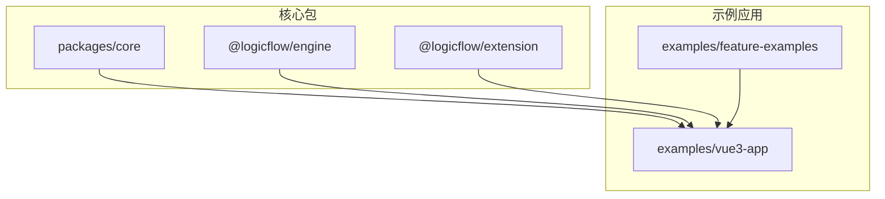
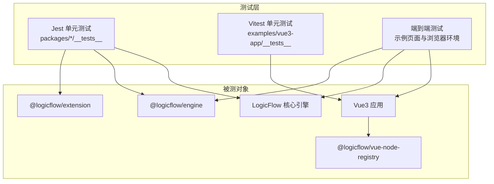
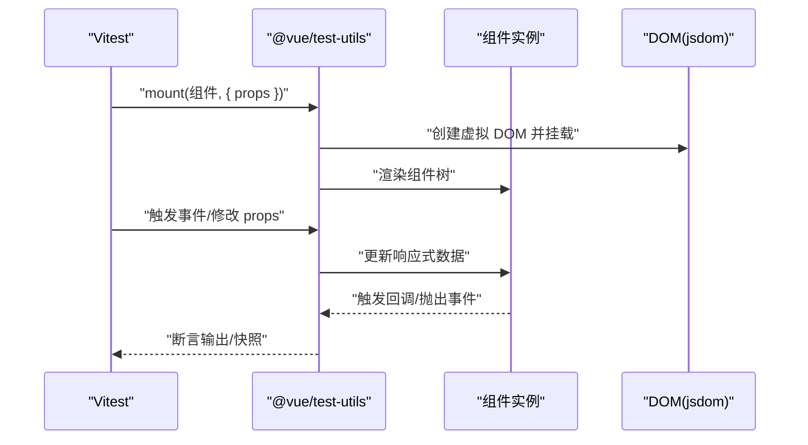
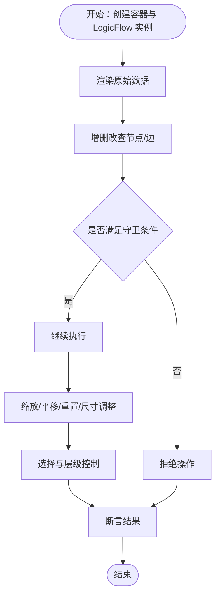
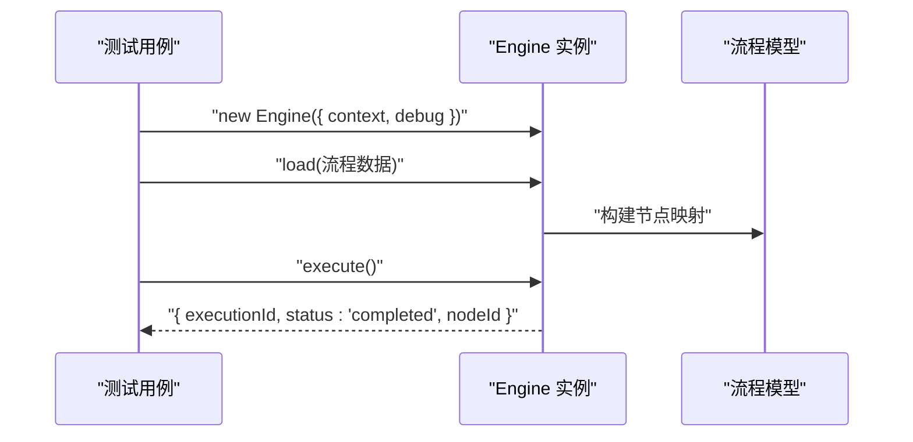
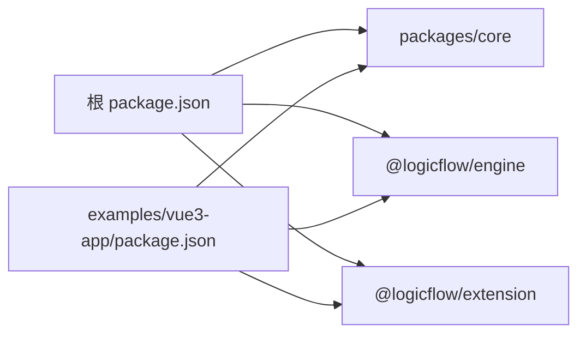

# 测试策略

<cite>
**本文引用的文件**
- [package.json](file://package.json)
- [examples/vue3-app/package.json](file://examples/vue3-app/package.json)
- [examples/vue3-app/vitest.config.ts](file://examples/vue3-app/vitest.config.ts)
- [examples/vue3-app/src/components/__tests__/HelloWorld.spec.ts](file://examples/vue3-app/src/components/__tests__/HelloWorld.spec.ts)
- [packages/extension/jest.config.js](file://packages/extension/jest.config.js)
- [packages/core/__tests__/logicflow.test.ts](file://packages/core/__tests__/logicflow.test.ts)
- [packages/core/__tests__/model/graphmodel.test.ts](file://packages/core/__tests__/model/graphmodel.test.ts)
- [packages/engine/__test__/01_index.test.ts](file://packages/engine/__test__/01_index.test.ts)
</cite>

## 目录
1. [引言](#引言)
2. [项目结构](#项目结构)
3. [核心组件](#核心组件)
4. [架构总览](#架构总览)
5. [详细组件分析](#详细组件分析)
6. [依赖关系分析](#依赖关系分析)
7. [性能与压力测试](#性能与压力测试)
8. [测试覆盖率要求与提升](#测试覆盖率要求与提升)
9. [自动化测试流水线与持续集成](#自动化测试流水线与持续集成)
10. [测试数据准备与清理策略](#测试数据准备与清理策略)
11. [故障排查指南](#故障排查指南)
12. [结论](#结论)

## 引言
本测试策略文档面向 QA 工程师与开发者，系统阐述本项目的单元测试、集成测试与端到端测试实施方法；重点覆盖 Vue3 组件测试最佳实践与工具配置、LogicFlow 引擎测试的特殊考虑与模拟策略；并给出测试覆盖率目标、自动化流水线配置建议、测试数据准备与清理策略，以及性能与压力测试实施方案，旨在保障代码质量与系统稳定性。

## 项目结构
本仓库采用多包（monorepo）结构，包含核心引擎与扩展、React/Vue 节点注册器、示例应用等模块。测试分布于核心包与示例应用中：
- 核心包（packages/core、packages/engine、packages/extension）：使用 Jest 进行单元测试，覆盖逻辑流图模型、渲染、变换、执行流程等。
- 示例应用（examples/vue3-app）：使用 Vitest + @vue/test-utils 进行 Vue3 组件测试，配置 jsdom 环境。
- 其他示例（examples/feature-examples、examples/material-ui-demo 等）：包含扩展与功能演示，便于集成测试与端到端验证。

**章节来源**
- file://package.json#L1-L45
- file://examples/vue3-app/package.json#L1-L52

## 核心组件
- LogicFlow 核心引擎：提供图模型、节点/边管理、键盘快捷键、变换（缩放/平移）、选择与层级控制等能力。
- 引擎执行器（@logicflow/engine）：加载流程图数据，驱动节点执行，返回执行结果（含 executionId、状态、当前节点）。
- 扩展包（@logicflow/extension）：提供 BPMN、动态分组、高亮、迷你地图等扩展能力。
- Vue3 节点注册器（@logicflow/vue-node-registry）：将 LogicFlow 节点映射为 Vue 组件，便于在 Vue 应用中复用。

这些组件均具备完善的单元测试覆盖，确保关键行为可验证、可回归。

**章节来源**
- file://packages/core/__tests__/logicflow.test.ts#L1-L576
- file://packages/engine/__test__/01_index.test.ts#L1-L45

## 架构总览
下图展示测试体系与被测对象的关系：核心包通过 Jest 测试，Vue3 应用通过 Vitest 测试，扩展与示例用于集成与端到端场景。

## 详细组件分析

### Vue3 组件测试（Vitest + @vue/test-utils）
- 测试工具链
  - Vitest：测试运行器与断言库，内置快照与覆盖率支持。
  - @vue/test-utils：Vue3 组件测试工具，提供 mount/shallowMount 等 API。
  - jsdom 环境：模拟浏览器 DOM API，满足组件渲染与交互测试。
- 配置要点
  - 环境：jsdom。
  - 排除：e2e 目录，避免与单元测试混淆。
  - 根目录：指向示例应用根目录，便于定位测试文件。
- 最佳实践
  - 使用 mount 渲染完整组件树，shallowMount 仅渲染当前组件。
  - 通过 props 传参、事件触发、指令模拟等方式验证行为。
  - 对异步更新使用 flush 微任务或等待机制。
  - 使用 mock 模块与全局依赖，隔离外部副作用。
- 示例参考
  - 组件测试样例：[HelloWorld.spec.ts](file://examples/vue3-app/src/components/__tests__/HelloWorld.spec.ts#L1-L12)
  - Vitest 配置：[vitest.config.ts](file://examples/vue3-app/vitest.config.ts#L1-L15)
  - 依赖与脚本：[examples/vue3-app/package.json](file://examples/vue3-app/package.json#L1-L52)

**图表来源**
- [examples/vue3-app/vitest.config.ts](file://examples/vue3-app/vitest.config.ts#L1-L15)
- [examples/vue3-app/src/components/__tests__/HelloWorld.spec.ts](file://examples/vue3-app/src/components/__tests__/HelloWorld.spec.ts#L1-L12)

**章节来源**
- file://examples/vue3-app/vitest.config.ts#L1-L15
- file://examples/vue3-app/src/components/__tests__/HelloWorld.spec.ts#L1-L12
- file://examples/vue3-app/package.json#L1-L52

### LogicFlow 核心引擎测试（Jest）
- 测试范围
  - 初始化与注册：容器初始化、节点/边视图与模型注册、插件注册。
  - 图操作：渲染、增删改查、文本更新、属性设置与删除、区域选择、层级控制。
  - 变换：缩放、平移、重置、尺寸调整。
  - 边界守卫：克隆/删除的条件判断。
- 关键策略
  - DOM 环境：使用 jsdom，手动创建容器元素。
  - Mock 与 Spy：对原型方法打桩，验证调用次数与参数。
  - 数据驱动：通过标准化的原始数据（nodes/edges）驱动测试。
- 示例参考
  - 核心 API 与变换测试：[logicflow.test.ts](file://packages/core/__tests__/logicflow.test.ts#L1-L576)
  - 网格吸附与文本偏移一致性：[graphmodel.test.ts](file://packages/core/__tests__/model/graphmodel.test.ts#L1-L88)

**图表来源**
- [packages/core/__tests__/logicflow.test.ts](file://packages/core/__tests__/logicflow.test.ts#L103-L576)

**章节来源**
- file://packages/core/__tests__/logicflow.test.ts#L1-L576
- file://packages/core/__tests__/model/graphmodel.test.ts#L1-L88

### 引擎执行器测试（Jest）
- 测试目标
  - 加载流程图数据，构建节点映射。
  - 执行流程，返回包含 executionId、状态与当前节点的结果。
- 关键策略
  - 使用最小化流程图数据（起始节点 -> 任务节点）。
  - 断言执行完成状态与节点推进。
- 示例参考
  - 执行器测试：[01_index.test.ts](file://packages/engine/__test__/01_index.test.ts#L1-L45)

**图表来源**
- [packages/engine/__test__/01_index.test.ts](file://packages/engine/__test__/01_index.test.ts#L1-L45)

**章节来源**
- file://packages/engine/__test__/01_index.test.ts#L1-L45

### 扩展包测试（Jest）
- 配置要点
  - 覆盖目录：coverage。
  - 覆盖提供者：v8。
  - 测试环境：jest-environment-jsdom。
  - 模块名映射：将 lodash-es 映射为 lodash，避免打包差异导致的测试失败。
- 建议
  - 在扩展包中补充单元测试，覆盖各扩展能力（如动态分组、BPMN 导入导出、菜单与迷你地图等）。
  - 使用模块名映射减少依赖差异带来的不确定性。

**章节来源**
- file://packages/extension/jest.config.js#L1-L199

## 依赖关系分析
- 包依赖
  - 核心包与引擎包在 monorepo 内部通过 workspace:* 引用，确保测试与开发的一致性。
  - Vue3 应用依赖核心包与引擎包，并通过 @logicflow/vue-node-registry 与 LogicFlow 交互。
- 测试依赖
  - Vitest 与 @vue/test-utils 用于 Vue3 组件测试。
  - Jest 与 jsdom 用于核心包与引擎包的单元测试。
- 耦合与内聚
  - 核心包与引擎包测试相互独立，职责清晰；扩展包测试需关注模块映射与环境配置。
  - Vue3 应用测试与核心包解耦，通过组件封装与适配器模式降低耦合。

**图表来源**
- [package.json](file://package.json#L1-L45)
- [examples/vue3-app/package.json](file://examples/vue3-app/package.json#L1-L52)

**章节来源**
- file://package.json#L1-L45
- file://examples/vue3-app/package.json#L1-L52

## 性能与压力测试
- 单元测试层面
  - 使用 Jest 的计时与内存快照，识别异常耗时与内存泄漏。
  - 对高频调用的算法（如几何计算、矩阵运算）进行基准测试。
- 集成/端到端层面
  - 在示例应用中构造大规模节点/边数据，测量渲染与交互延迟。
  - 使用浏览器性能面板（Performance）与内存快照（Memory）评估资源占用。
- 建议指标
  - 大规模渲染：单次渲染时间不超过阈值（如 500ms），内存增长可控。
  - 交互响应：拖拽、缩放、连线等操作延迟不超过 16ms（60fps）。
- 工具与方法
  - Vitest/Jest 的计时断言与堆栈分析。
  - Puppeteer/Cypress 进行端到端性能录制与回归对比。

[本节为通用指导，不直接分析具体文件，故无“章节来源”]

## 测试覆盖率要求与提升
- 覆盖率现状
  - 扩展包已启用 v8 覆盖提供者与输出目录，但未显式配置阈值。
- 目标与策略
  - 行为覆盖率：核心包与引擎包达到 80%+，Vue3 应用达到 70%+。
  - 分支与函数：优先补齐关键分支与边界条件。
  - 提升方法
    - 为每个导出函数与类添加最小可验证用例。
    - 对异步流程与错误路径进行专项测试。
    - 使用快照测试稳定 UI 输出，减少回归风险。
- 配置建议
  - 在 Jest 配置中启用覆盖率收集与阈值约束，逐步提升目标。
  - 在 Vitest 中开启覆盖率报告，统一 CI 报告格式。

**章节来源**
- file://packages/extension/jest.config.js#L27-L35

## 自动化测试流水线与持续集成
- 流水线阶段
  - 安装依赖：使用 pnpm（仓库锁文件已存在）。
  - 类型检查：vue-tsc 或 tsc。
  - 单元测试：Jest/Vitest 跑通所有测试并生成覆盖率。
  - Lint 与格式化：ESLint + Prettier/Biome。
  - 构建与预览：Rsbuild/Vite 构建产物校验。
- CI 建议
  - 并行执行：按包拆分任务，缩短总时长。
  - 缓存策略：缓存 node_modules 与构建产物。
  - 报告与门禁：覆盖率阈值作为合并门禁，失败时阻断主干。
- 脚本参考
  - 根工程脚本：构建、检查、预览、开发。
  - Vue3 应用脚本：dev、build、preview、test:unit、lint、format。

**章节来源**
- file://package.json#L6-L12
- file://examples/vue3-app/package.json#L6-L15

## 测试数据准备与清理策略
- 数据准备
  - 使用标准化的原始数据（nodes/edges）构造测试场景，覆盖常见拓扑与边界。
  - 对需要 DOM 的测试，先创建临时容器并注入到 document.body。
- 数据清理
  - 每个测试结束后清理 DOM、重置原型桩函数、释放定时器与订阅。
  - 使用 beforeEach/afterEach 管理共享状态，避免跨用例污染。
- 建议
  - 为复杂场景准备 fixtures 文件，集中维护测试数据。
  - 对异步操作使用超时与重试策略，提高稳定性。

**章节来源**
- file://packages/core/__tests__/logicflow.test.ts#L10-L21
- file://packages/core/__tests__/model/graphmodel.test.ts#L6-L20

## 故障排查指南
- 常见问题
  - 测试环境缺失：确保 jsdom 环境正确配置，避免 DOM API 未定义。
  - 模块解析差异：扩展包使用模块名映射，避免 lodash-es 与 lodash 的差异导致测试失败。
  - 覆盖率未生成：确认 Jest/Vitest 的覆盖率开关与输出目录配置。
- 排查步骤
  - 单独运行失败用例，缩小范围。
  - 查看控制台日志与断言信息，定位失败点。
  - 对比本地与 CI 环境的 Node 版本与依赖版本。
- 工具
  - Vitest/Jest 的调试模式与详细日志。
  - 浏览器 DevTools 与性能面板辅助端到端问题定位。

**章节来源**
- file://packages/extension/jest.config.js#L86-L88
- file://examples/vue3-app/vitest.config.ts#L8-L12

## 结论
本项目在核心包与引擎包层面已建立完善的 Jest 单元测试，在 Vue3 应用层面采用 Vitest + @vue/test-utils 进行组件测试。建议进一步完善扩展包与示例应用的测试覆盖，明确覆盖率目标与 CI 门禁，结合性能与压力测试，形成从单元到端到端的全链路质量保障体系，持续提升代码质量与系统稳定性。