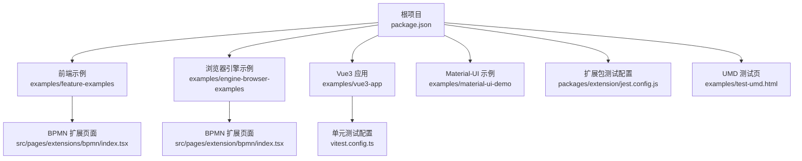
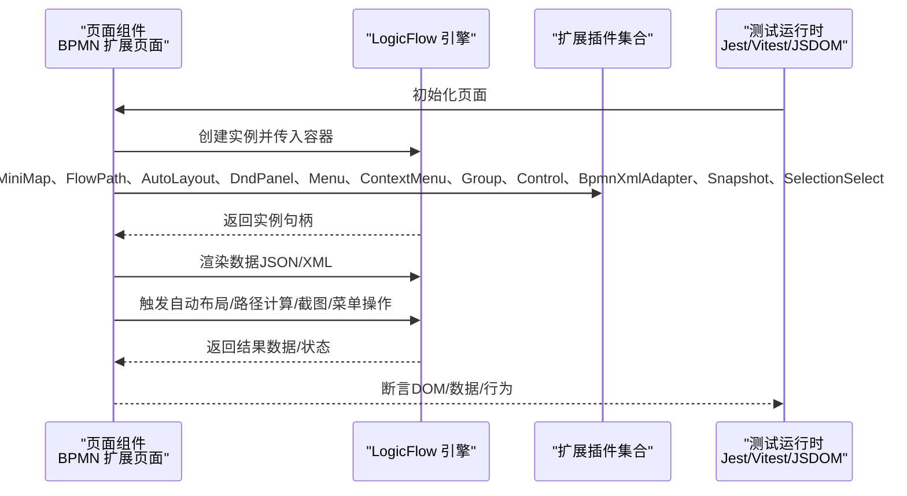
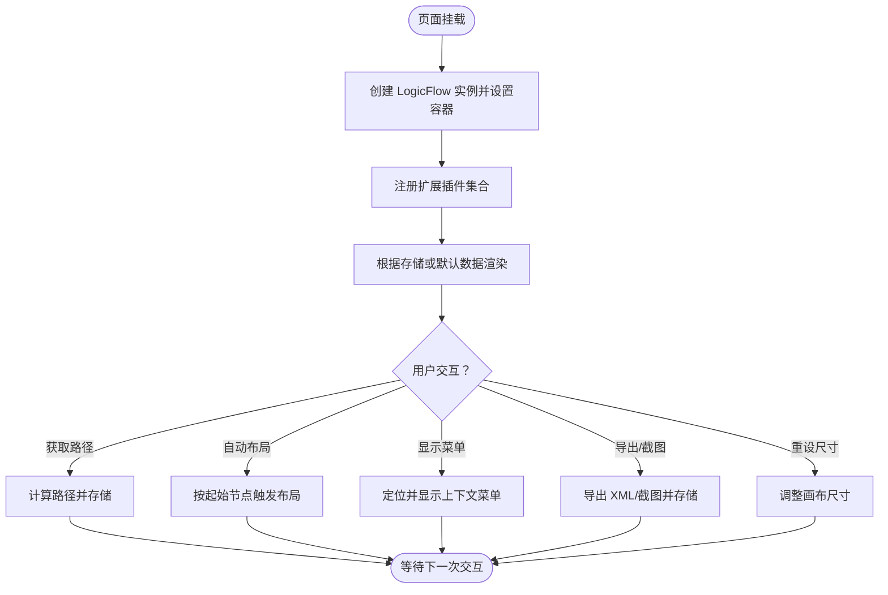
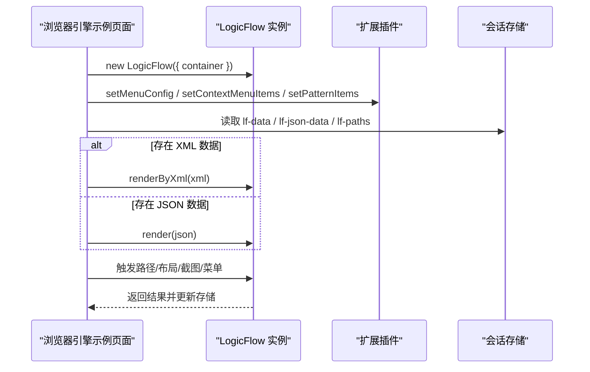
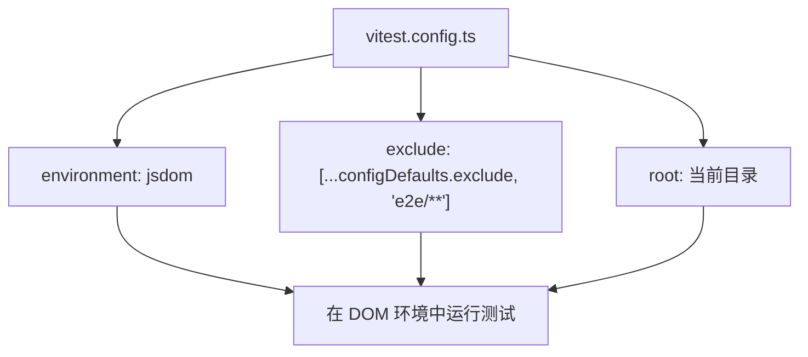
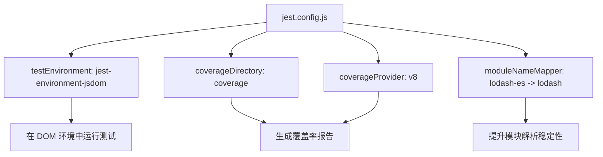
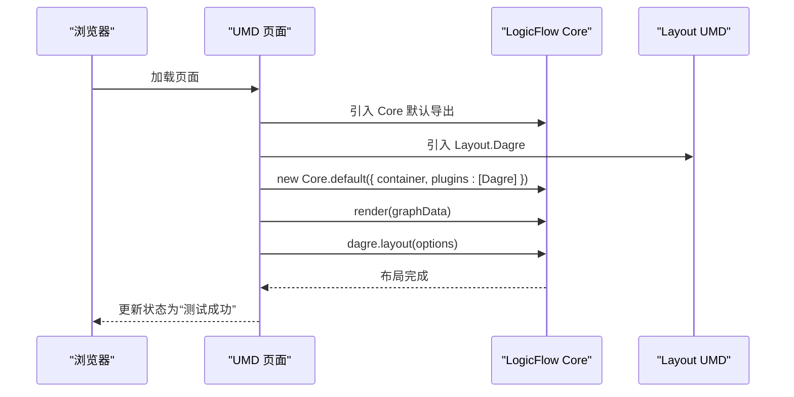
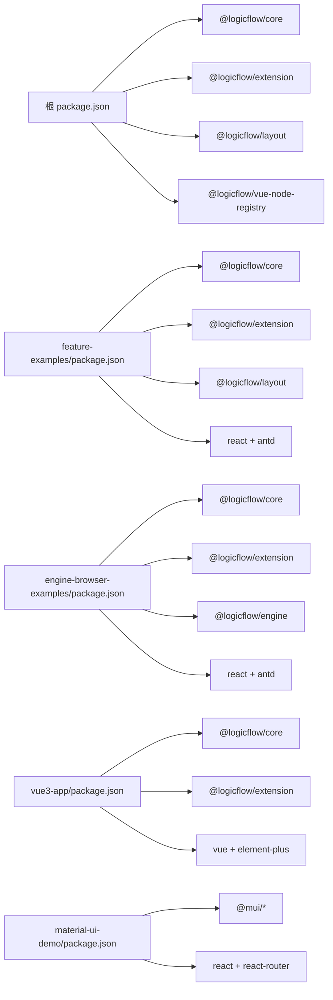

# 集成测试方案

<cite>
**本文引用的文件**
- [package.json](file://package.json)
- [examples/feature-examples/package.json](file://examples/feature-examples/package.json)
- [examples/engine-browser-examples/package.json](file://examples/engine-browser-examples/package.json)
- [examples/vue3-app/package.json](file://examples/vue3-app/package.json)
- [examples/material-ui-demo/package.json](file://examples/material-ui-demo/package.json)
- [examples/feature-examples/src/pages/extensions/bpmn/index.tsx](file://examples/feature-examples/src/pages/extensions/bpmn/index.tsx)
- [examples/engine-browser-examples/src/pages/extension/bpmn/index.tsx](file://examples/engine-browser-examples/src/pages/extension/bpmn/index.tsx)
- [examples/vue3-app/vitest.config.ts](file://examples/vue3-app/vitest.config.ts)
- [packages/extension/jest.config.js](file://packages/extension/jest.config.js)
- [examples/test-umd.html](file://examples/test-umd.html)
</cite>

## 目录
1. [引言](#引言)
2. [项目结构](#项目结构)
3. [核心组件](#核心组件)
4. [架构总览](#架构总览)
5. [详细组件分析](#详细组件分析)
6. [依赖关系分析](#依赖关系分析)
7. [性能考量](#性能考量)
8. [故障排查指南](#故障排查指南)
9. [结论](#结论)
10. [附录](#附录)

## 引言
本方案面向 LogicFlow 图形引擎在多前端框架（React、Vue 3、Next.js、Material-UI）中的集成测试，重点覆盖以下方面：
- 多组件协作测试策略：引擎与 UI 组件、扩展插件、路由与状态管理的协同验证
- LogicFlow 引擎与 UI 组件的集成测试方法：通过真实 DOM 环境与可视化断言
- BPMN 扩展模块的测试验证流程：XML/JSON 转换、路径计算、自动布局、上下文菜单等
- 跨框架集成测试的配置与执行：统一测试环境、脚本与报告
- 状态管理与路由集成测试：基于示例应用的状态持久化与路由联动
- 第三方库集成测试最佳实践：Jest、Vitest、JSDOM、UMD 包验证
- 为测试工程师提供完整参考与工具配置

## 项目结构
该项目采用多包/多示例工程组织方式，核心依赖集中在根与各示例包中，便于在不同框架中进行集成测试。

图表来源
- [package.json](file://package.json#L1-L45)
- [examples/feature-examples/package.json](file://examples/feature-examples/package.json#L1-L29)
- [examples/engine-browser-examples/package.json](file://examples/engine-browser-examples/package.json#L1-L39)
- [examples/vue3-app/package.json](file://examples/vue3-app/package.json#L1-L52)
- [examples/material-ui-demo/package.json](file://examples/material-ui-demo/package.json#L1-L76)
- [examples/feature-examples/src/pages/extensions/bpmn/index.tsx](file://examples/feature-examples/src/pages/extensions/bpmn/index.tsx#L1-L367)
- [examples/engine-browser-examples/src/pages/extension/bpmn/index.tsx](file://examples/engine-browser-examples/src/pages/extension/bpmn/index.tsx#L1-L355)
- [examples/vue3-app/vitest.config.ts](file://examples/vue3-app/vitest.config.ts#L1-L15)
- [packages/extension/jest.config.js](file://packages/extension/jest.config.js#L1-L199)
- [examples/test-umd.html](file://examples/test-umd.html#L1-L112)

章节来源
- [package.json](file://package.json#L1-L45)
- [examples/feature-examples/package.json](file://examples/feature-examples/package.json#L1-L29)
- [examples/engine-browser-examples/package.json](file://examples/engine-browser-examples/package.json#L1-L39)
- [examples/vue3-app/package.json](file://examples/vue3-app/package.json#L1-L52)
- [examples/material-ui-demo/package.json](file://examples/material-ui-demo/package.json#L1-L76)

## 核心组件
- LogicFlow 引擎与扩展：提供核心绘图能力与 BPMN/XML 支持
- UI 框架适配层：React、Vue 3、Next.js、Material-UI 示例页面
- 测试运行时：Jest（DOM 环境）、Vitest（DOM 环境）、JSDOM
- UMD 包验证：独立 HTML 页面用于验证打包产物

章节来源
- [examples/feature-examples/src/pages/extensions/bpmn/index.tsx](file://examples/feature-examples/src/pages/extensions/bpmn/index.tsx#L1-L367)
- [examples/engine-browser-examples/src/pages/extension/bpmn/index.tsx](file://examples/engine-browser-examples/src/pages/extension/bpmn/index.tsx#L1-L355)
- [examples/vue3-app/vitest.config.ts](file://examples/vue3-app/vitest.config.ts#L1-L15)
- [packages/extension/jest.config.js](file://packages/extension/jest.config.js#L1-L199)
- [examples/test-umd.html](file://examples/test-umd.html#L1-L112)

## 架构总览
下图展示从 UI 页面到 LogicFlow 引擎与扩展的调用链路，以及测试运行时对这些组件的集成验证点。

图表来源
- [examples/feature-examples/src/pages/extensions/bpmn/index.tsx](file://examples/feature-examples/src/pages/extensions/bpmn/index.tsx#L29-L60)
- [examples/engine-browser-examples/src/pages/extension/bpmn/index.tsx](file://examples/engine-browser-examples/src/pages/extension/bpmn/index.tsx#L29-L60)
- [examples/vue3-app/vitest.config.ts](file://examples/vue3-app/vitest.config.ts#L8-L12)
- [packages/extension/jest.config.js](file://packages/extension/jest.config.js#L144-L144)

## 详细组件分析

### 组件一：BPMN 扩展页面（React）
该页面演示了 LogicFlow 与扩展插件的完整集成，包括菜单、拖拽面板、迷你地图、自动布局、路径计算、XML/JSON 转换、截图与选择器等。

图表来源
- [examples/feature-examples/src/pages/extensions/bpmn/index.tsx](file://examples/feature-examples/src/pages/extensions/bpmn/index.tsx#L148-L231)
- [examples/feature-examples/src/pages/extensions/bpmn/index.tsx](file://examples/feature-examples/src/pages/extensions/bpmn/index.tsx#L252-L288)

章节来源
- [examples/feature-examples/src/pages/extensions/bpmn/index.tsx](file://examples/feature-examples/src/pages/extensions/bpmn/index.tsx#L1-L367)

### 组件二：BPMN 扩展页面（浏览器引擎示例）
该页面与上述 React 版本类似，但更侧重于浏览器端引擎示例场景下的插件组合与数据渲染。

图表来源
- [examples/engine-browser-examples/src/pages/extension/bpmn/index.tsx](file://examples/engine-browser-examples/src/pages/extension/bpmn/index.tsx#L156-L232)

章节来源
- [examples/engine-browser-examples/src/pages/extension/bpmn/index.tsx](file://examples/engine-browser-examples/src/pages/extension/bpmn/index.tsx#L1-L355)

### 组件三：Vue3 应用的单元测试配置
Vue3 应用通过 Vitest 在 JSDOM 环境中运行单元测试，排除 e2e 目录，适合集成测试中的组件级验证。

图表来源
- [examples/vue3-app/vitest.config.ts](file://examples/vue3-app/vitest.config.ts#L1-L15)

章节来源
- [examples/vue3-app/vitest.config.ts](file://examples/vue3-app/vitest.config.ts#L1-L15)

### 组件四：扩展包测试配置（Jest）
扩展包使用 Jest 并指定 jsdom 环境，同时对模块映射进行处理，确保测试运行稳定。

图表来源
- [packages/extension/jest.config.js](file://packages/extension/jest.config.js#L7-L199)

章节来源
- [packages/extension/jest.config.js](file://packages/extension/jest.config.js#L1-L199)

### 组件五：UMD 包集成测试（独立页面）
UMD 测试页通过 CDN 引入 LogicFlow Core 与自构建的 Layout UMD，创建实例并执行布局测试，验证打包产物可用性。

图表来源
- [examples/test-umd.html](file://examples/test-umd.html#L48-L99)

章节来源
- [examples/test-umd.html](file://examples/test-umd.html#L1-L112)

## 依赖关系分析
- 根项目依赖 LogicFlow 核心与扩展、布局、Vue 节点注册器等；示例项目各自声明对 LogicFlow 的 workspace:* 依赖，便于本地联调
- React 示例依赖 Ant Design；Vue3 示例依赖 Element Plus 与 @logicflow/vue-node-registry；Material-UI 示例依赖 @mui 生态
- 测试运行时统一使用 jsdom 环境，保证在无浏览器环境下也能渲染 DOM

图表来源
- [package.json](file://package.json#L14-L26)
- [examples/feature-examples/package.json](file://examples/feature-examples/package.json#L12-L21)
- [examples/engine-browser-examples/package.json](file://examples/engine-browser-examples/package.json#L12-L23)
- [examples/vue3-app/package.json](file://examples/vue3-app/package.json#L16-L28)
- [examples/material-ui-demo/package.json](file://examples/material-ui-demo/package.json#L4-L31)

章节来源
- [package.json](file://package.json#L1-L45)
- [examples/feature-examples/package.json](file://examples/feature-examples/package.json#L1-L29)
- [examples/engine-browser-examples/package.json](file://examples/engine-browser-examples/package.json#L1-L39)
- [examples/vue3-app/package.json](file://examples/vue3-app/package.json#L1-L52)
- [examples/material-ui-demo/package.json](file://examples/material-ui-demo/package.json#L1-L76)

## 性能考量
- 使用自动布局与路径计算时，建议在交互后延时触发，避免频繁重排导致卡顿
- 截图与大图渲染应限制并发数量，必要时分批处理
- 在测试环境中启用覆盖率收集时，注意忽略 node_modules 与测试文件，减少开销
- UMD 包测试建议在 CI 中缓存 CDN 资源，降低网络波动影响

## 故障排查指南
- DOM 环境缺失：确保测试配置使用 jsdom 环境，避免在 Node 环境直接操作 DOM
- 插件未生效：核对插件注册顺序与参数，确认容器已正确挂载
- XML/JSON 转换异常：检查数据结构一致性与字段映射，必要时打印中间结果
- 路径计算为空：确认起始节点类型与数据完整性
- 截图失败：检查画布尺寸与内容是否渲染完成，适当增加等待时间
- UMD 包加载失败：确认 CDN 地址与版本号一致，或切换为本地构建产物

## 结论
本方案提供了覆盖多框架、多组件、多运行时的集成测试策略与工具配置，重点围绕 LogicFlow 引擎与 BPMN 扩展的端到端验证，结合 UMD 包与测试页面，形成从页面交互到引擎行为的闭环验证体系。建议在持续集成中统一执行测试与覆盖率统计，保障多组件协作的稳定性与可维护性。

## 附录
- 测试脚本与命令参考
  - 根项目：开发、构建、预览、格式化、检查、Lint
  - Feature 示例：开发、构建、安装
  - 浏览器引擎示例：开发、构建、预览、Lint
  - Vue3 应用：开发、构建、预览、单元测试、类型检查、Lint、格式化
  - Material-UI 示例：启动、构建、测试（react-scripts）

章节来源
- [package.json](file://package.json#L6-L12)
- [examples/feature-examples/package.json](file://examples/feature-examples/package.json#L5-L11)
- [examples/engine-browser-examples/package.json](file://examples/engine-browser-examples/package.json#L6-L11)
- [examples/vue3-app/package.json](file://examples/vue3-app/package.json#L6-L15)
- [examples/material-ui-demo/package.json](file://examples/material-ui-demo/package.json#L32-L37)