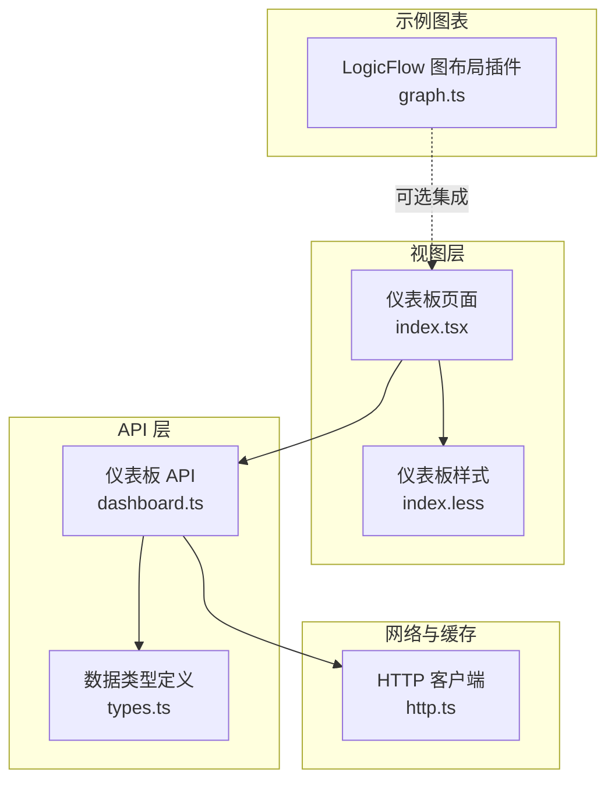
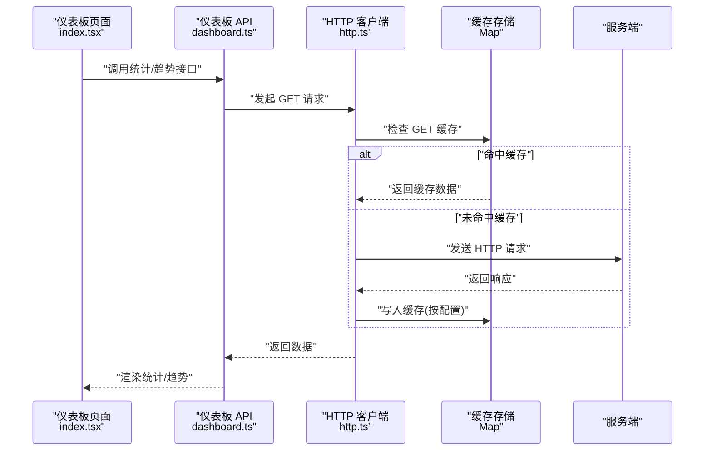
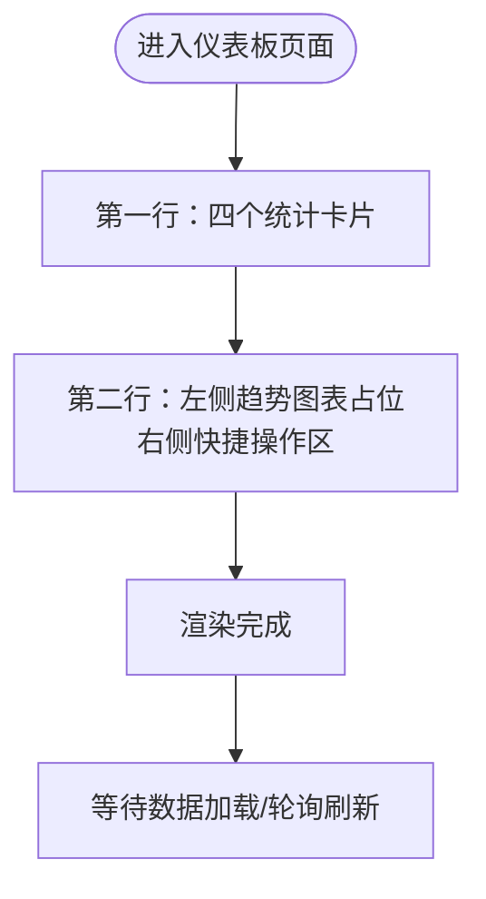
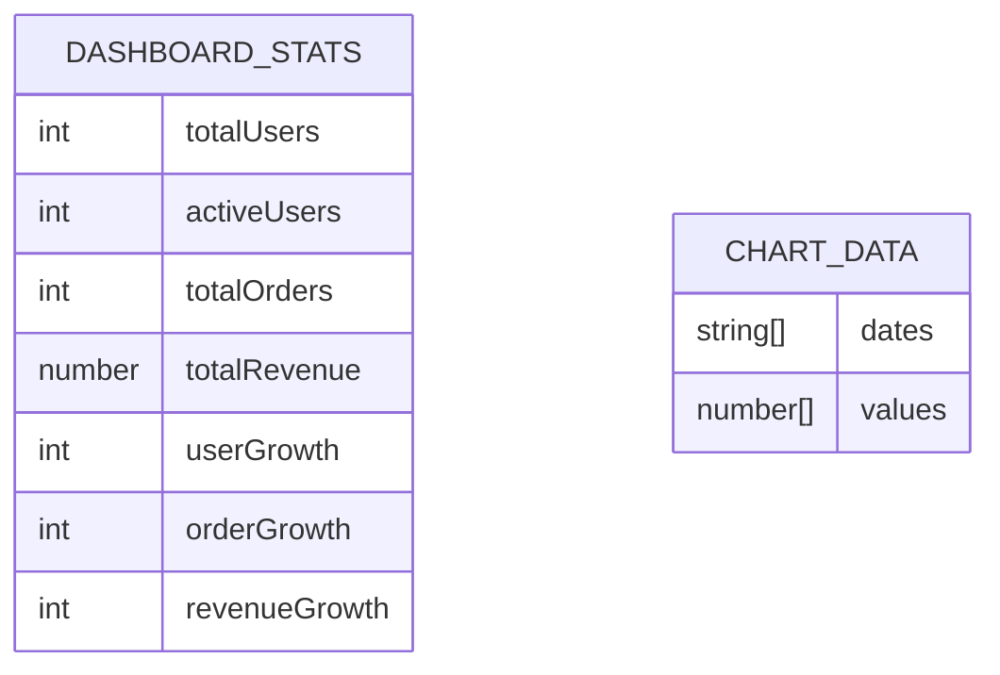
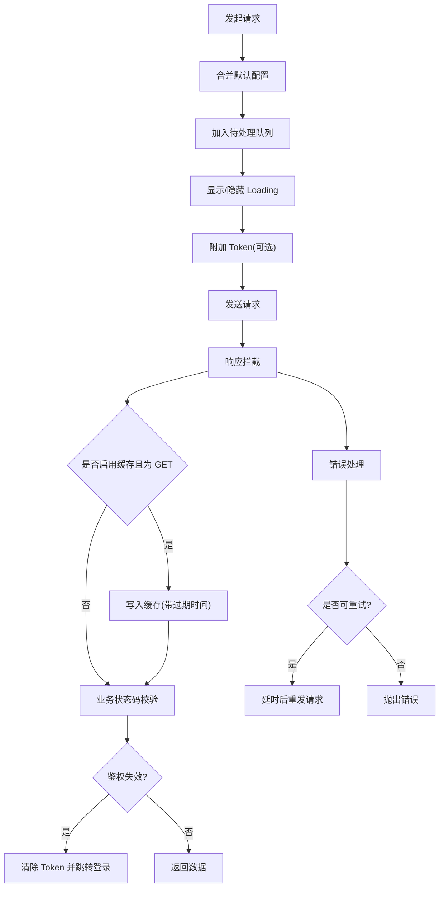
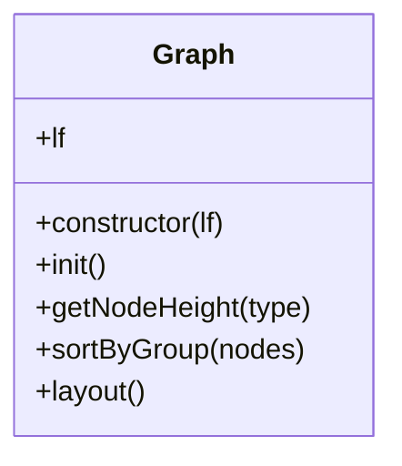
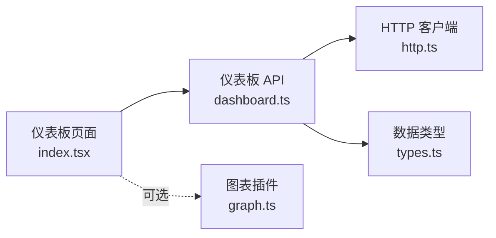

# 仪表板功能

<cite>
**本文引用的文件**
- [src/views/dashboard/index.tsx](file://src/views/dashboard/index.tsx)
- [src/views/dashboard/index.less](file://src/views/dashboard/index.less)
- [src/api/dashboard.ts](file://src/api/dashboard.ts)
- [src/api/types.ts](file://src/api/types.ts)
- [src/utils/http.ts](file://src/utils/http.ts)
- [examples/vue3-app/src/components/chart/graph.ts](file://examples/vue3-app/src/components/chart/graph.ts)
</cite>

## 目录
1. [简介](#简介)
2. [项目结构](#项目结构)
3. [核心组件](#核心组件)
4. [架构总览](#架构总览)
5. [详细组件分析](#详细组件分析)
6. [依赖关系分析](#依赖关系分析)
7. [性能考虑](#性能考虑)
8. [故障排查指南](#故障排查指南)
9. [结论](#结论)
10. [附录](#附录)

## 简介
本文件面向管理员与开发者，系统化阐述仪表板功能的设计与实现，涵盖数据统计与可视化展示、图表组件集成与配置、数据聚合与缓存机制、布局与响应式设计、数据源与接口规范、主题与定制化能力，以及实时更新与轮询机制。当前仓库中的仪表板页面已完成基础布局与占位，配套了统一的 HTTP 客户端与缓存策略，并预留了与 ECharts 等图表库的集成点。

## 项目结构
仪表板功能主要由以下模块构成：
- 页面与样式：仪表板页面组件与样式文件，负责布局与视觉呈现。
- API 层：封装仪表板相关接口，提供统计数据与趋势数据的获取。
- 数据类型：定义仪表板返回数据结构，确保前后端契约一致。
- HTTP 客户端：统一请求与响应处理、错误处理、Loading 控制、重复请求取消、缓存与重试等。
- 图表插件：示例工程中提供了基于 LogicFlow 的图布局插件，可用于复杂数据流图的可视化布局。

**图表来源**
- [src/views/dashboard/index.tsx](file://src/views/dashboard/index.tsx#L1-L99)
- [src/views/dashboard/index.less](file://src/views/dashboard/index.less#L1-L77)
- [src/api/dashboard.ts](file://src/api/dashboard.ts#L1-L43)
- [src/api/types.ts](file://src/api/types.ts#L98-L114)
- [src/utils/http.ts](file://src/utils/http.ts#L1-L534)
- [examples/vue3-app/src/components/chart/graph.ts](file://examples/vue3-app/src/components/chart/graph.ts#L1-L130)

**章节来源**
- [src/views/dashboard/index.tsx](file://src/views/dashboard/index.tsx#L1-L99)
- [src/views/dashboard/index.less](file://src/views/dashboard/index.less#L1-L77)
- [src/api/dashboard.ts](file://src/api/dashboard.ts#L1-L43)
- [src/api/types.ts](file://src/api/types.ts#L98-L114)
- [src/utils/http.ts](file://src/utils/http.ts#L1-L534)
- [examples/vue3-app/src/components/chart/graph.ts](file://examples/vue3-app/src/components/chart/graph.ts#L1-L130)

## 核心组件
- 仪表板页面组件：采用 Element Plus 的栅格与卡片组件，构建四大统计卡片与趋势图表占位区，并提供快捷操作按钮区。
- 统一 HTTP 客户端：内置请求拦截、响应拦截、Loading、错误提示、重复请求取消、缓存、重试与鉴权处理。
- 仪表板 API：提供统计数据与多类趋势数据接口，支持缓存配置。
- 数据类型定义：明确统计数据与图表数据结构，便于前后端契约一致。
- 图表插件（示例）：LogicFlow 插件用于复杂图布局，可作为仪表板中流程/关系图的布局方案之一。

**章节来源**
- [src/views/dashboard/index.tsx](file://src/views/dashboard/index.tsx#L5-L98)
- [src/views/dashboard/index.less](file://src/views/dashboard/index.less#L1-L77)
- [src/api/dashboard.ts](file://src/api/dashboard.ts#L1-L43)
- [src/api/types.ts](file://src/api/types.ts#L98-L114)
- [src/utils/http.ts](file://src/utils/http.ts#L1-L534)
- [examples/vue3-app/src/components/chart/graph.ts](file://examples/vue3-app/src/components/chart/graph.ts#L1-L130)

## 架构总览
下图展示了从页面到 API 再到 HTTP 客户端的整体调用链路，以及缓存与错误处理的关键节点。

**图表来源**
- [src/views/dashboard/index.tsx](file://src/views/dashboard/index.tsx#L1-L99)
- [src/api/dashboard.ts](file://src/api/dashboard.ts#L1-L43)
- [src/utils/http.ts](file://src/utils/http.ts#L236-L240)

## 详细组件分析

### 仪表板页面与布局
- 结构组成：四列等宽统计卡片、右侧趋势图表占位区、快捷操作区。
- 响应式与间距：使用 Element Plus 栅格系统，通过 gutter 控制列间距；卡片采用 hover 阴影增强交互。
- 样式主题：通过不同图标背景色区分状态（主色、成功、警告、危险），数值与标签排版清晰。
- 图表占位：趋势图区域以“可集成 ECharts”提示，便于后续接入具体图表库。

**图表来源**
- [src/views/dashboard/index.tsx](file://src/views/dashboard/index.tsx#L8-L96)
- [src/views/dashboard/index.less](file://src/views/dashboard/index.less#L1-L77)

**章节来源**
- [src/views/dashboard/index.tsx](file://src/views/dashboard/index.tsx#L5-L98)
- [src/views/dashboard/index.less](file://src/views/dashboard/index.less#L1-L77)

### API 接口与数据模型
- 接口清单
  - 获取仪表盘统计数据：支持缓存与缓存超时配置。
  - 获取用户增长趋势：支持天数参数，默认最近 7 天。
  - 获取订单增长趋势：支持天数参数，默认最近 7 天。
  - 获取收入增长趋势：支持天数参数，默认最近 7 天。
- 数据模型
  - 仪表盘统计数据：包含用户总量、活跃用户、订单总量、收入总量及对应增长值。
  - 图表数据：包含日期数组与对应数值数组。

**图表来源**
- [src/api/types.ts](file://src/api/types.ts#L98-L114)

**章节来源**
- [src/api/dashboard.ts](file://src/api/dashboard.ts#L1-L43)
- [src/api/types.ts](file://src/api/types.ts#L98-L114)

### HTTP 客户端与缓存机制
- 请求与响应拦截：统一注入 Token、Loading、错误提示；支持业务状态码校验与鉴权失效处理。
- 重复请求取消：基于请求键去重，避免并发重复请求造成资源浪费。
- 缓存策略：GET 请求支持缓存，缓存键由方法、URL、参数与请求体组合生成；支持自定义缓存超时。
- 错误处理：覆盖超时、网络异常、HTTP 状态码、业务错误与取消请求等场景，并提供可配置重试。
- 工具函数：支持清空缓存、取消全部请求等运维能力。

**图表来源**
- [src/utils/http.ts](file://src/utils/http.ts#L190-L361)
- [src/utils/http.ts](file://src/utils/http.ts#L127-L148)

**章节来源**
- [src/utils/http.ts](file://src/utils/http.ts#L1-L534)

### 图表插件与集成（示例）
- 功能概述：LogicFlow 插件根据节点类型分组，计算首跳、中间跳与落地节点的位置，按层级与间距进行布局，适合流程/关系图在仪表板中的展示。
- 关键点：节点高度差异、起始坐标、层级间距与目标节点映射，保证布局稳定与可扩展。

**图表来源**
- [examples/vue3-app/src/components/chart/graph.ts](file://examples/vue3-app/src/components/chart/graph.ts#L15-L129)

**章节来源**
- [examples/vue3-app/src/components/chart/graph.ts](file://examples/vue3-app/src/components/chart/graph.ts#L1-L130)

## 依赖关系分析
- 页面依赖 API：通过 API 方法拉取统计数据与趋势数据。
- API 依赖 HTTP：所有接口均通过统一 HTTP 客户端发起请求，共享缓存与错误处理。
- 类型定义：API 返回数据结构由类型文件约束，确保一致性。
- 图表插件：与页面解耦，可按需引入，用于复杂关系图的布局。

**图表来源**
- [src/views/dashboard/index.tsx](file://src/views/dashboard/index.tsx#L1-L99)
- [src/api/dashboard.ts](file://src/api/dashboard.ts#L1-L43)
- [src/utils/http.ts](file://src/utils/http.ts#L1-L534)
- [src/api/types.ts](file://src/api/types.ts#L98-L114)
- [examples/vue3-app/src/components/chart/graph.ts](file://examples/vue3-app/src/components/chart/graph.ts#L1-L130)

**章节来源**
- [src/views/dashboard/index.tsx](file://src/views/dashboard/index.tsx#L1-L99)
- [src/api/dashboard.ts](file://src/api/dashboard.ts#L1-L43)
- [src/utils/http.ts](file://src/utils/http.ts#L1-L534)
- [src/api/types.ts](file://src/api/types.ts#L98-L114)
- [examples/vue3-app/src/components/chart/graph.ts](file://examples/vue3-app/src/components/chart/graph.ts#L1-L130)

## 性能考虑
- 缓存策略：对 GET 请求启用缓存，减少重复请求与网络开销；支持自定义缓存超时，平衡实时性与性能。
- 重复请求取消：避免同一请求并发导致的资源浪费与竞态。
- Loading 与错误提示：统一 Loading 与错误提示，提升用户体验并降低无效重试。
- 响应式布局：使用栅格系统与卡片阴影，兼顾移动端与桌面端体验。
- 图表渲染：建议在趋势图区域采用虚拟滚动或懒加载策略，避免大数据量时的卡顿。

[本节为通用指导，无需列出章节来源]

## 故障排查指南
- 请求被取消：检查是否存在重复请求取消逻辑触发；确认请求键是否正确生成。
- 缓存未生效：确认请求方法为 GET 且启用了缓存；检查缓存键与过期时间。
- 鉴权失效：业务状态码指示 Token 失效时，客户端会自动清理 Token 并跳转登录页。
- 超时与网络异常：根据错误类型进行重试或提示；必要时调整重试次数与间隔。
- 权限不足：403 场景提示无权限访问，需检查角色与权限配置。

**章节来源**
- [src/utils/http.ts](file://src/utils/http.ts#L274-L361)
- [src/utils/http.ts](file://src/utils/http.ts#L119-L122)

## 结论
本仪表板功能以页面组件为核心，结合统一的 HTTP 客户端与缓存机制，提供了可扩展的数据统计与可视化入口。当前页面已完成基础布局与占位，API 与类型定义明确了数据契约，HTTP 客户端覆盖了常见网络与错误场景。后续可在趋势图区域集成 ECharts 或其他图表库，并结合轮询策略实现数据的动态更新。

[本节为总结性内容，无需列出章节来源]

## 附录

### 管理员配置与监控指南
- 数据监控
  - 使用缓存管理工具定期清理特定前缀的缓存，保障数据新鲜度。
  - 通过错误日志定位业务错误与网络异常，及时调整重试策略。
- 布局与主题
  - 通过样式文件快速切换图标背景色与主题色，满足不同场景需求。
  - 在趋势图占位区接入图表库后，统一配置主题与配色方案。
- 快捷操作
  - 在快捷操作区新增按钮时，保持图标与文案一致，遵循现有样式规范。

**章节来源**
- [src/views/dashboard/index.less](file://src/views/dashboard/index.less#L1-L77)
- [src/utils/http.ts](file://src/utils/http.ts#L153-L164)

### 开发者扩展与自定义参考
- 新增趋势图
  - 在趋势图占位区引入图表库（如 ECharts），按接口返回的日期与数值数组进行渲染。
  - 对高频请求开启缓存，合理设置缓存超时。
- 自定义图表插件
  - 可参考 LogicFlow 图布局插件的分组与层级计算方式，扩展适用于业务场景的布局算法。
- 主题与定制
  - 统一在样式文件中维护主题变量，确保卡片、图标与按钮风格一致。
- 轮询机制
  - 在页面初始化与定时器中周期性调用趋势接口，结合缓存避免频繁刷新；在路由切换或组件卸载时清理定时器与取消未完成请求。

**章节来源**
- [src/views/dashboard/index.tsx](file://src/views/dashboard/index.tsx#L65-L94)
- [src/api/dashboard.ts](file://src/api/dashboard.ts#L18-L42)
- [src/utils/http.ts](file://src/utils/http.ts#L169-L174)
- [examples/vue3-app/src/components/chart/graph.ts](file://examples/vue3-app/src/components/chart/graph.ts#L63-L98)