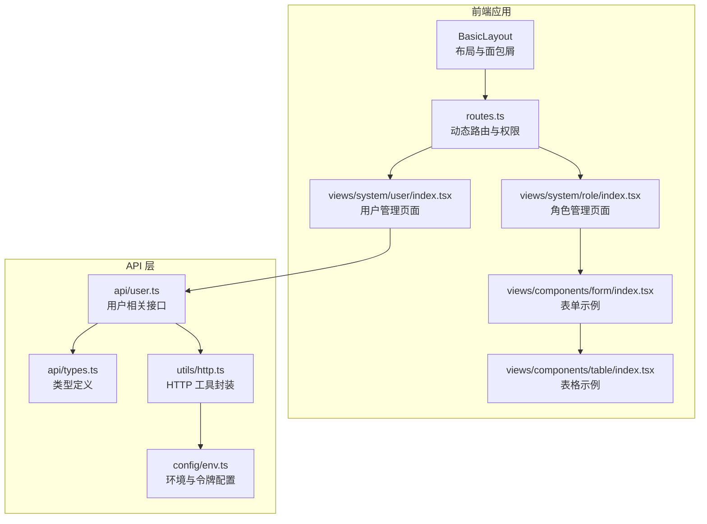
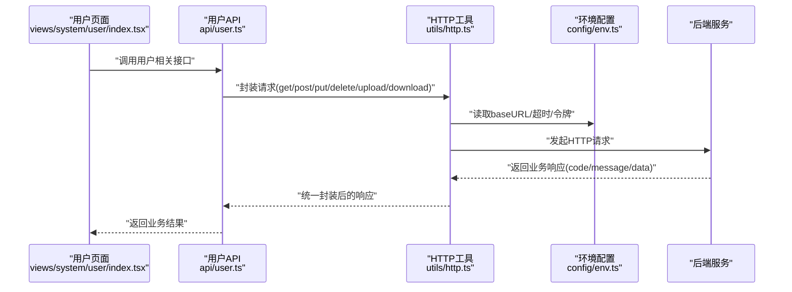
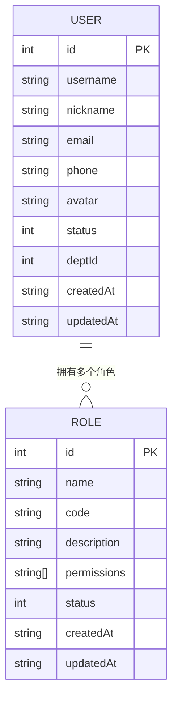
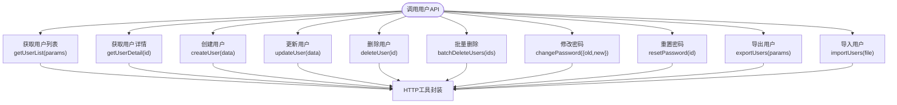
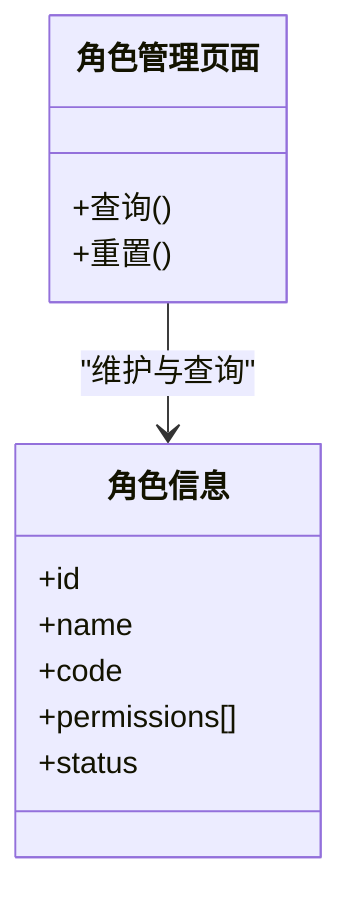
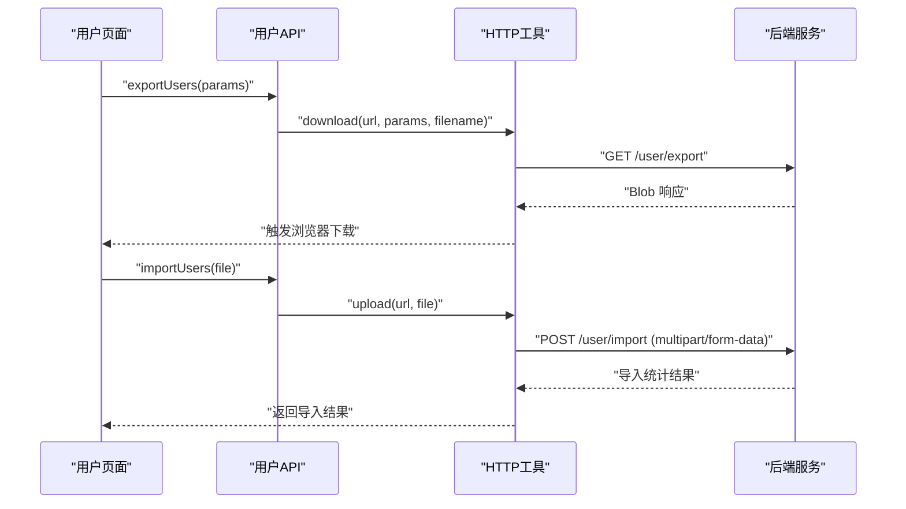
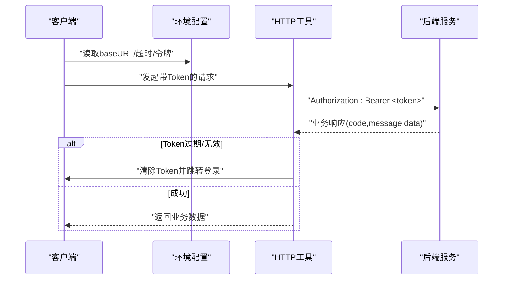
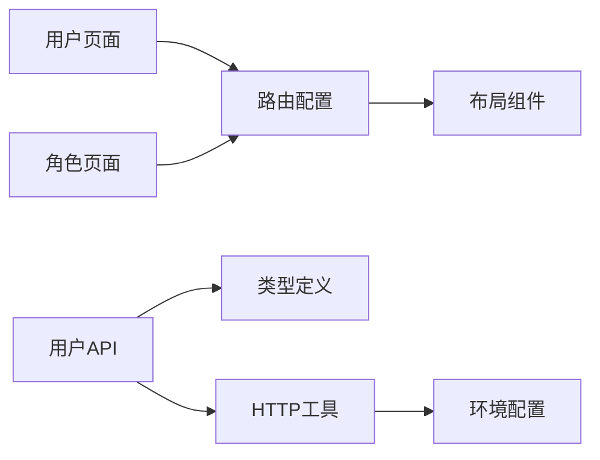

# 用户管理

<cite>
**本文引用的文件**
- [src/views/system/user/index.tsx](file://src/views/system/user/index.tsx)
- [src/api/user.ts](file://src/api/user.ts)
- [src/api/types.ts](file://src/api/types.ts)
- [src/utils/http.ts](file://src/utils/http.ts)
- [src/times/http.ts](file://src/times/http.ts)
- [src/config/env.ts](file://src/config/env.ts)
- [src/router/routes.ts](file://src/router/routes.ts)
- [src/layouts/BasicLayout.tsx](file://src/layouts/BasicLayout.tsx)
- [src/views/system/role/index.tsx](file://src/views/system/role/index.tsx)
- [src/views/components/form/index.tsx](file://src/views/components/form/index.tsx)
- [src/views/components/table/index.tsx](file://src/views/components/table/index.tsx)
</cite>

## 目录
1. [简介](#简介)
2. [项目结构](#项目结构)
3. [核心组件](#核心组件)
4. [架构总览](#架构总览)
5. [详细组件分析](#详细组件分析)
6. [依赖关系分析](#依赖关系分析)
7. [性能考虑](#性能考虑)
8. [故障排查指南](#故障排查指南)
9. [结论](#结论)
10. [附录](#附录)

## 简介
本文件面向“用户管理”功能，系统性阐述用户信息的增删改查（CRUD）、表单验证与密码管理、用户状态控制、数据模型与 API 设计、用户列表的分页/搜索/排序、权限与角色绑定、导入导出、会话与安全认证等。同时提供面向管理员的操作指南与面向开发者的扩展参考。

## 项目结构
用户管理位于系统管理模块下，采用“页面组件 + API 封装 + 类型定义 + HTTP 工具 + 路由与布局”的分层组织方式。核心入口为系统管理下的用户与角色页面，通过路由配置进行鉴权与导航。

图表来源
- [src/layouts/BasicLayout.tsx](file://src/layouts/BasicLayout.tsx#L1-L146)
- [src/router/routes.ts](file://src/router/routes.ts#L26-L113)
- [src/views/system/user/index.tsx](file://src/views/system/user/index.tsx#L1-L40)
- [src/views/system/role/index.tsx](file://src/views/system/role/index.tsx#L1-L32)
- [src/views/components/form/index.tsx](file://src/views/components/form/index.tsx#L1-L73)
- [src/views/components/table/index.tsx](file://src/views/components/table/index.tsx#L1-L43)
- [src/api/user.ts](file://src/api/user.ts#L1-L147)
- [src/api/types.ts](file://src/api/types.ts#L1-L114)
- [src/utils/http.ts](file://src/utils/http.ts#L1-L534)
- [src/config/env.ts](file://src/config/env.ts#L1-L120)

章节来源
- [src/router/routes.ts](file://src/router/routes.ts#L26-L113)
- [src/layouts/BasicLayout.tsx](file://src/layouts/BasicLayout.tsx#L1-L146)
- [src/views/system/user/index.tsx](file://src/views/system/user/index.tsx#L1-L40)
- [src/views/system/role/index.tsx](file://src/views/system/role/index.tsx#L1-L32)
- [src/views/components/form/index.tsx](file://src/views/components/form/index.tsx#L1-L73)
- [src/views/components/table/index.tsx](file://src/views/components/table/index.tsx#L1-L43)
- [src/api/user.ts](file://src/api/user.ts#L1-L147)
- [src/api/types.ts](file://src/api/types.ts#L1-L114)
- [src/utils/http.ts](file://src/utils/http.ts#L1-L534)
- [src/config/env.ts](file://src/config/env.ts#L1-L120)

## 核心组件
- 用户管理页面：提供用户列表展示、基础操作按钮占位，后续可接入分页、搜索、排序与 CRUD 行为。
- 用户 API 封装：统一暴露登录、登出、刷新 Token、获取当前用户、用户列表、详情、CRUD、批量删除、修改/重置密码、导入/导出等接口。
- 类型系统：定义用户、角色、菜单、分页等数据模型，确保前后端契约一致。
- HTTP 工具：基于 Axios 的二次封装，内置 Loading、错误提示、缓存、重复请求取消、重试、下载/上传等能力。
- 路由与布局：系统管理路由包含用户与角色页面，并在路由元信息中声明所需权限；布局负责面包屑与全局导航。

章节来源
- [src/views/system/user/index.tsx](file://src/views/system/user/index.tsx#L1-L40)
- [src/api/user.ts](file://src/api/user.ts#L1-L147)
- [src/api/types.ts](file://src/api/types.ts#L3-L75)
- [src/utils/http.ts](file://src/utils/http.ts#L1-L534)
- [src/router/routes.ts](file://src/router/routes.ts#L72-L113)
- [src/layouts/BasicLayout.tsx](file://src/layouts/BasicLayout.tsx#L1-L146)

## 架构总览
用户管理从前端页面到后端接口的调用链路如下：

图表来源
- [src/views/system/user/index.tsx](file://src/views/system/user/index.tsx#L1-L40)
- [src/api/user.ts](file://src/api/user.ts#L1-L147)
- [src/utils/http.ts](file://src/utils/http.ts#L180-L361)
- [src/config/env.ts](file://src/config/env.ts#L52-L59)

## 详细组件分析

### 数据模型与类型定义
- 用户信息模型：包含标识、账号、昵称、邮箱、电话、头像、状态、角色集合、部门、创建/更新时间等字段。
- 角色信息模型：包含标识、名称、编码、描述、权限集合、状态、创建/更新时间等字段。
- 分页参数与响应：统一的分页请求参数与分页响应结构，便于列表查询与渲染。
- 用户列表查询参数：支持按用户名、状态、部门、时间范围等条件查询。

图表来源
- [src/api/types.ts](file://src/api/types.ts#L3-L75)

章节来源
- [src/api/types.ts](file://src/api/types.ts#L3-L75)

### API 接口设计
- 认证相关：登录、登出、刷新 Token、获取当前用户。
- 用户管理：获取列表、详情、创建、更新、删除、批量删除、修改密码、重置密码。
- 导入导出：导出用户数据为 Excel、上传文件进行用户导入。
- 调用约定：统一使用 HTTP 工具封装，支持 Loading、错误提示、Token 注入、缓存、重试等。

图表来源
- [src/api/user.ts](file://src/api/user.ts#L19-L146)
- [src/utils/http.ts](file://src/utils/http.ts#L366-L515)

章节来源
- [src/api/user.ts](file://src/api/user.ts#L1-L147)

### 表单验证与密码管理
- 表单组件示例：提供基础表单结构与交互，可用于用户新增/编辑表单的输入校验与提交。
- 密码管理：提供修改密码与重置密码接口，建议在前端对旧密码/新密码长度、复杂度进行校验，并在调用接口时进行必要的参数校验。

章节来源
- [src/views/components/form/index.tsx](file://src/views/components/form/index.tsx#L1-L73)
- [src/api/user.ts](file://src/api/user.ts#L114-L124)

### 用户状态控制
- 用户状态字段：启用/禁用两种状态，可在列表与编辑时进行切换。
- 状态变更：通过更新用户接口传递状态字段，后端据此控制用户可用性。

章节来源
- [src/api/types.ts](file://src/api/types.ts#L11-L11)
- [src/api/user.ts](file://src/api/user.ts#L83-L88)

### 用户列表的分页、搜索与排序
- 分页参数：page、pageSize 统一在分页请求参数中定义。
- 搜索条件：用户列表查询参数支持用户名、状态、部门、起止时间等筛选。
- 排序：当前类型定义未显式包含排序字段，如需排序可在 params 中扩展排序字段并在后端实现。

章节来源
- [src/api/types.ts](file://src/api/types.ts#L16-L29)
- [src/api/types.ts](file://src/api/types.ts#L34-L41)

### 权限分配与角色绑定
- 角色模型：包含角色标识、名称、编码、描述、权限集合、状态等。
- 角色页面：提供角色管理页面与查询表单，可用于角色维护与权限分配。
- 路由权限：系统管理路由在元信息中声明所需权限，如用户查看、角色管理等。

图表来源
- [src/views/system/role/index.tsx](file://src/views/system/role/index.tsx#L1-L32)
- [src/api/types.ts](file://src/api/types.ts#L65-L75)

章节来源
- [src/views/system/role/index.tsx](file://src/views/system/role/index.tsx#L1-L32)
- [src/api/types.ts](file://src/api/types.ts#L65-L75)
- [src/router/routes.ts](file://src/router/routes.ts#L88-L98)

### CRUD 操作示例（代码路径）
以下为常见 CRUD 操作对应的 API 调用路径，便于直接定位实现位置：
- 新增用户
  - [src/api/user.ts](file://src/api/user.ts#L72-L77)
- 更新用户
  - [src/api/user.ts](file://src/api/user.ts#L83-L88)
- 删除用户
  - [src/api/user.ts](file://src/api/user.ts#L94-L98)
- 批量删除
  - [src/api/user.ts](file://src/api/user.ts#L104-L108)
- 获取用户列表
  - [src/api/user.ts](file://src/api/user.ts#L54-L58)
- 获取用户详情
  - [src/api/user.ts](file://src/api/user.ts#L64-L66)
- 修改密码
  - [src/api/user.ts](file://src/api/user.ts#L114-L116)
- 重置密码
  - [src/api/user.ts](file://src/api/user.ts#L122-L124)

章节来源
- [src/api/user.ts](file://src/api/user.ts#L54-L124)

### 导入导出功能
- 导出用户：支持按条件导出为 Excel 文件，使用下载方法封装。
- 导入用户：支持上传文件进行批量导入，包含上传进度回调。

图表来源
- [src/api/user.ts](file://src/api/user.ts#L129-L146)
- [src/utils/http.ts](file://src/utils/http.ts#L493-L515)
- [src/utils/http.ts](file://src/utils/http.ts#L463-L488)

章节来源
- [src/api/user.ts](file://src/api/user.ts#L129-L146)
- [src/utils/http.ts](file://src/utils/http.ts#L463-L515)

### 会话管理与安全认证流程
- Token 管理：本地存储访问令牌与刷新令牌，请求时自动注入 Authorization 头。
- 登录/登出/刷新：提供登录、登出、刷新 Token 接口；刷新 Token 用于在过期前续期。
- 权限失效处理：当业务状态码指示 Token 过期或无效时，清除本地 Token 并跳转至登录页。
- HTTP 错误处理：统一拦截 401/403/5xx 等错误，支持错误提示与自动重试。

图表来源
- [src/config/env.ts](file://src/config/env.ts#L62-L90)
- [src/utils/http.ts](file://src/utils/http.ts#L190-L273)

章节来源
- [src/config/env.ts](file://src/config/env.ts#L62-L90)
- [src/utils/http.ts](file://src/utils/http.ts#L190-L273)

## 依赖关系分析
- 页面依赖：用户管理页面依赖路由与布局；角色页面作为权限管理入口。
- API 依赖：用户 API 依赖类型定义与 HTTP 工具；HTTP 工具依赖环境配置。
- 路由依赖：系统管理路由声明用户与角色页面及其所需权限。

图表来源
- [src/views/system/user/index.tsx](file://src/views/system/user/index.tsx#L1-L40)
- [src/views/system/role/index.tsx](file://src/views/system/role/index.tsx#L1-L32)
- [src/router/routes.ts](file://src/router/routes.ts#L72-L113)
- [src/layouts/BasicLayout.tsx](file://src/layouts/BasicLayout.tsx#L1-L146)
- [src/api/user.ts](file://src/api/user.ts#L1-L147)
- [src/api/types.ts](file://src/api/types.ts#L1-L114)
- [src/utils/http.ts](file://src/utils/http.ts#L1-L534)
- [src/config/env.ts](file://src/config/env.ts#L1-L120)

章节来源
- [src/router/routes.ts](file://src/router/routes.ts#L72-L113)
- [src/layouts/BasicLayout.tsx](file://src/layouts/BasicLayout.tsx#L1-L146)
- [src/api/user.ts](file://src/api/user.ts#L1-L147)
- [src/utils/http.ts](file://src/utils/http.ts#L1-L534)
- [src/config/env.ts](file://src/config/env.ts#L1-L120)

## 性能考虑
- 请求去重：通过生成请求键与 AbortController 取消重复请求，避免重复加载。
- 缓存策略：GET 请求支持内存缓存，提升列表加载性能。
- Loading 与错误提示：统一的 Loading 与错误提示，减少重复逻辑。
- 上传/下载进度：上传支持进度回调，下载自动触发浏览器下载行为。

章节来源
- [src/utils/http.ts](file://src/utils/http.ts#L47-L75)
- [src/utils/http.ts](file://src/utils/http.ts#L237-L240)
- [src/utils/http.ts](file://src/utils/http.ts#L463-L488)
- [src/utils/http.ts](file://src/utils/http.ts#L493-L515)

## 故障排查指南
- 登录过期/未授权：业务状态码指示 Token 过期或无效时，将自动清除 Token 并跳转登录页。
- 网络错误/超时：自动提示并支持按配置重试；请求被取消时返回取消错误。
- 权限不足：403 拒绝访问时提示无权限访问该资源。
- 导入失败：上传进度回调可用于监控进度，导入完成后根据返回的统计信息进行提示。

章节来源
- [src/utils/http.ts](file://src/utils/http.ts#L247-L273)
- [src/utils/http.ts](file://src/utils/http.ts#L287-L360)
- [src/utils/http.ts](file://src/utils/http.ts#L338-L345)
- [src/api/user.ts](file://src/api/user.ts#L139-L146)

## 结论
本项目围绕“用户管理”构建了清晰的前端分层架构：页面组件负责视图与交互，API 封装提供统一接口，类型系统保障契约一致，HTTP 工具提供稳定可靠的网络层能力，路由与布局支撑权限与导航。用户 CRUD、导入导出、密码管理、状态控制与角色权限均已具备可扩展的接口与类型定义，便于进一步完善列表分页/搜索/排序与表单校验。

## 附录

### 管理员操作指南
- 用户列表：进入系统管理 → 用户管理，使用搜索框与筛选条件查询用户，支持分页浏览。
- 新增/编辑：点击“新增用户”，填写表单后提交；编辑时可修改昵称、邮箱、电话、角色与状态。
- 删除与批量删除：勾选用户后执行删除或批量删除。
- 导入/导出：使用“导出”按钮导出用户数据；使用“导入”按钮上传文件进行批量导入。
- 密码管理：支持修改密码与重置密码，重置后按后端策略处理初始密码。

### 开发者扩展参考
- 新增字段：在类型定义中扩展用户/角色模型，同步更新 API 与页面。
- 列表增强：在用户列表查询参数中增加排序字段，后端实现对应排序逻辑。
- 表单校验：在表单组件中添加必填、格式、长度等校验规则，结合接口参数进行前置校验。
- 权限细化：在路由元信息中补充更细粒度的权限点，如“用户新增/编辑/删除/导入/导出”。