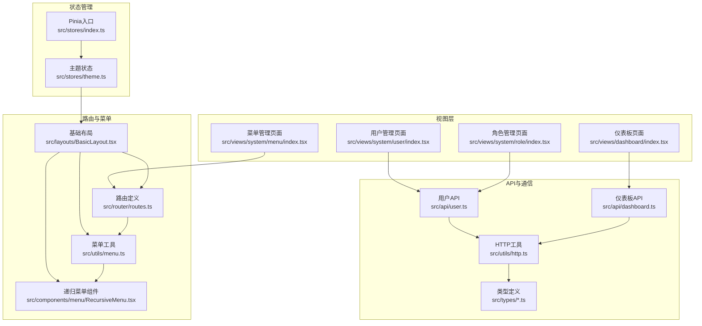
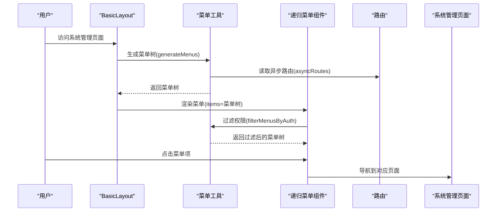
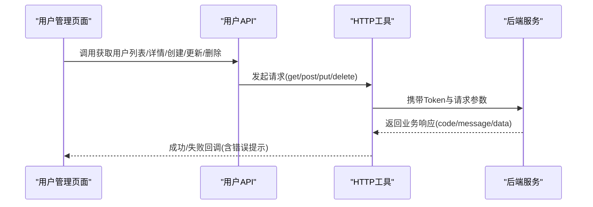
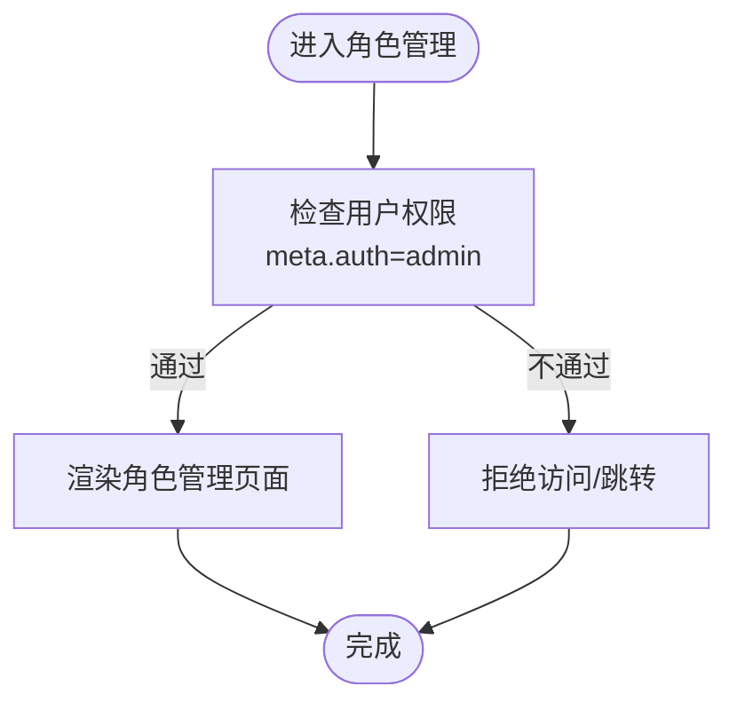
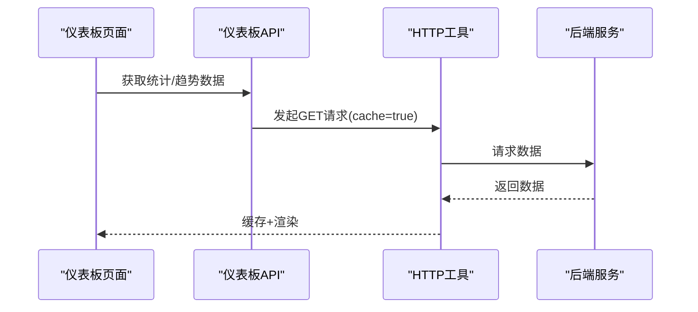
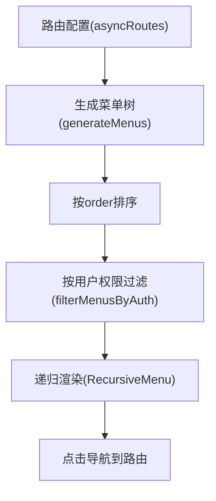
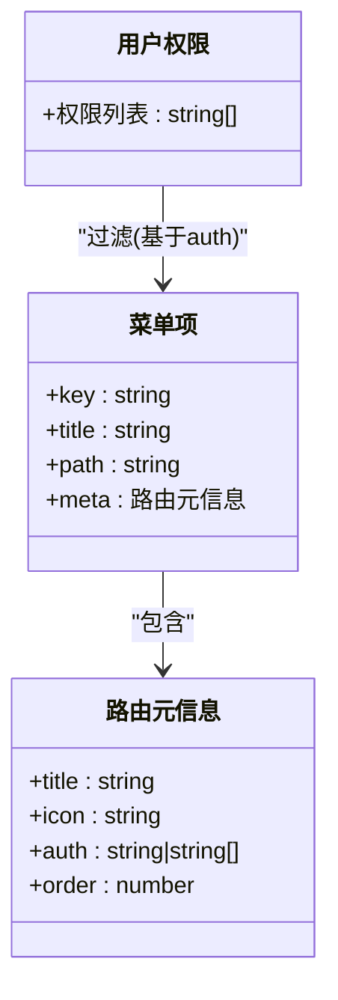
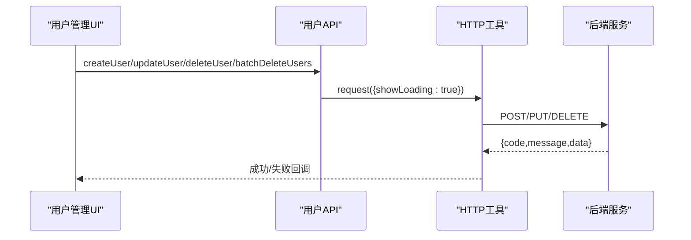
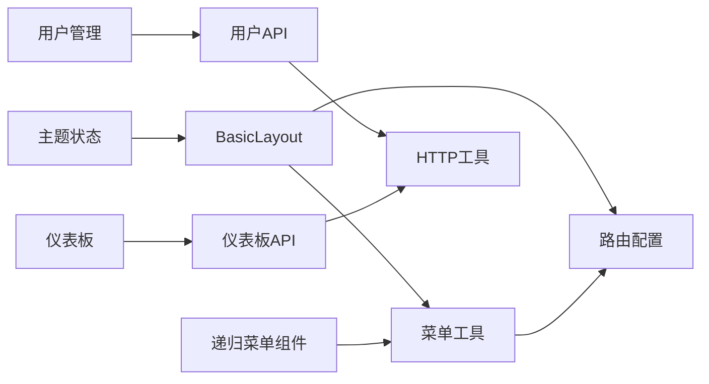

# 系统管理功能

<cite>
**本文引用的文件**
- [src/views/system/user/index.tsx](file://src/views/system/user/index.tsx)
- [src/views/system/menu/index.tsx](file://src/views/system/menu/index.tsx)
- [src/views/system/role/index.tsx](file://src/views/system/role/index.tsx)
- [src/api/user.ts](file://src/api/user.ts)
- [src/api/dashboard.ts](file://src/api/dashboard.ts)
- [src/types/menu.ts](file://src/types/menu.ts)
- [src/utils/menu.ts](file://src/utils/menu.ts)
- [src/router/routes.ts](file://src/router/routes.ts)
- [src/layouts/BasicLayout.tsx](file://src/layouts/BasicLayout.tsx)
- [src/components/menu/RecursiveMenu.tsx](file://src/components/menu/RecursiveMenu.tsx)
- [src/utils/http.ts](file://src/utils/http.ts)
- [src/types/http.ts](file://src/types/http.ts)
- [src/views/dashboard/index.tsx](file://src/views/dashboard/index.tsx)
- [src/stores/theme.ts](file://src/stores/theme.ts)
- [src/stores/index.ts](file://src/stores/index.ts)
</cite>

## 目录
1. [简介](#简介)
2. [项目结构](#项目结构)
3. [核心组件](#核心组件)
4. [架构总览](#架构总览)
5. [详细组件分析](#详细组件分析)
6. [依赖关系分析](#依赖关系分析)
7. [性能考量](#性能考量)
8. [故障排查指南](#故障排查指南)
9. [结论](#结论)
10. [附录](#附录)

## 简介
本文件面向系统管理员与开发者，系统性阐述本项目的系统管理功能，包括用户管理、菜单管理、角色权限管理与仪表板模块。文档重点解析基于角色的访问控制（RBAC）模型在前端路由与菜单中的应用与配置，说明动态菜单生成、权限过滤、CRUD 操作与与后端 API 的集成方式，以及数据验证、错误处理与安全注意事项。同时提供操作指南与扩展参考，确保系统的安全性与可维护性。

## 项目结构
系统管理相关的核心目录与文件组织如下：
- 视图层：系统管理页面位于 views/system 下，分别对应用户、角色、菜单三个页面。
- 路由层：系统管理路由定义于 router/routes.ts，并通过 meta.auth 字段声明权限标识。
- 菜单工具：菜单生成与权限过滤逻辑位于 utils/menu.ts；菜单渲染组件位于 components/menu/RecursiveMenu.tsx。
- API 层：用户管理与仪表板 API 定义于 api/user.ts 与 api/dashboard.ts。
- 通信层：统一 HTTP 工具位于 utils/http.ts，封装了拦截器、缓存、重试、取消重复请求等能力。
- 类型定义：菜单与路由类型定义位于 types/menu.ts；HTTP 类型定义位于 types/http.ts。
- 布局与主题：BasicLayout.tsx 负责布局与面包屑；theme.ts 管理主题切换与持久化。

**图表来源**
- [src/views/system/user/index.tsx](file://src/views/system/user/index.tsx#L1-L40)
- [src/views/system/role/index.tsx](file://src/views/system/role/index.tsx#L1-L32)
- [src/views/system/menu/index.tsx](file://src/views/system/menu/index.tsx#L1-L35)
- [src/views/dashboard/index.tsx](file://src/views/dashboard/index.tsx#L1-L99)
- [src/router/routes.ts](file://src/router/routes.ts#L1-L215)
- [src/utils/menu.ts](file://src/utils/menu.ts#L1-L172)
- [src/components/menu/RecursiveMenu.tsx](file://src/components/menu/RecursiveMenu.tsx#L1-L171)
- [src/layouts/BasicLayout.tsx](file://src/layouts/BasicLayout.tsx#L1-L146)
- [src/api/user.ts](file://src/api/user.ts#L1-L147)
- [src/api/dashboard.ts](file://src/api/dashboard.ts#L1-L43)
- [src/utils/http.ts](file://src/utils/http.ts#L1-L534)
- [src/types/menu.ts](file://src/types/menu.ts#L1-L122)
- [src/types/http.ts](file://src/types/http.ts#L1-L139)
- [src/stores/theme.ts](file://src/stores/theme.ts#L1-L111)
- [src/stores/index.ts](file://src/stores/index.ts#L1-L6)

**章节来源**
- [src/router/routes.ts](file://src/router/routes.ts#L1-L215)
- [src/utils/menu.ts](file://src/utils/menu.ts#L1-L172)
- [src/components/menu/RecursiveMenu.tsx](file://src/components/menu/RecursiveMenu.tsx#L1-L171)
- [src/layouts/BasicLayout.tsx](file://src/layouts/BasicLayout.tsx#L1-L146)
- [src/api/user.ts](file://src/api/user.ts#L1-L147)
- [src/api/dashboard.ts](file://src/api/dashboard.ts#L1-L43)
- [src/utils/http.ts](file://src/utils/http.ts#L1-L534)
- [src/types/menu.ts](file://src/types/menu.ts#L1-L122)
- [src/types/http.ts](file://src/types/http.ts#L1-L139)
- [src/stores/theme.ts](file://src/stores/theme.ts#L1-L111)
- [src/stores/index.ts](file://src/stores/index.ts#L1-L6)

## 核心组件
- 用户管理页面：提供用户列表、新增、编辑、删除、批量删除、密码修改/重置、导入导出等能力，具体实现通过调用用户 API 完成。
- 角色管理页面：提供角色列表查询与筛选，后续可扩展角色 CRUD 与权限分配。
- 菜单管理页面：提供菜单查询与筛选，后续可扩展菜单 CRUD 与权限配置。
- 仪表板页面：展示统计卡片与趋势图表占位，后续可接入真实数据与图表库。
- 动态菜单与权限：通过路由 meta.auth 声明权限标识，运行时根据用户权限过滤菜单树，递归渲染 Element Plus 菜单组件。
- HTTP 通信：统一请求封装，支持 Loading、错误提示、缓存、重试、取消重复请求、Token 注入与鉴权失效跳转。

**章节来源**
- [src/views/system/user/index.tsx](file://src/views/system/user/index.tsx#L1-L40)
- [src/views/system/role/index.tsx](file://src/views/system/role/index.tsx#L1-L32)
- [src/views/system/menu/index.tsx](file://src/views/system/menu/index.tsx#L1-L35)
- [src/views/dashboard/index.tsx](file://src/views/dashboard/index.tsx#L1-L99)
- [src/router/routes.ts](file://src/router/routes.ts#L73-L113)
- [src/utils/menu.ts](file://src/utils/menu.ts#L144-L172)
- [src/components/menu/RecursiveMenu.tsx](file://src/components/menu/RecursiveMenu.tsx#L1-L171)
- [src/utils/http.ts](file://src/utils/http.ts#L1-L534)

## 架构总览
系统采用“路由驱动菜单 + 权限过滤”的 RBAC 前端架构：
- 路由层定义菜单与权限：每个路由的 meta.auth 指定所需权限标识，支持字符串或数组。
- 菜单层生成与过滤：将路由转换为菜单树，按 order 排序，再按用户权限进行递归过滤。
- 视图层：系统管理页面通过 API 完成 CRUD；仪表板页面负责数据展示与交互。
- 通信层：统一 HTTP 工具处理拦截器、错误处理、缓存与重试，保障稳定与一致的用户体验。

**图表来源**
- [src/layouts/BasicLayout.tsx](file://src/layouts/BasicLayout.tsx#L29-L32)
- [src/utils/menu.ts](file://src/utils/menu.ts#L7-L35)
- [src/router/routes.ts](file://src/router/routes.ts#L26-L113)
- [src/components/menu/RecursiveMenu.tsx](file://src/components/menu/RecursiveMenu.tsx#L146-L166)

**章节来源**
- [src/layouts/BasicLayout.tsx](file://src/layouts/BasicLayout.tsx#L1-L146)
- [src/utils/menu.ts](file://src/utils/menu.ts#L1-L172)
- [src/router/routes.ts](file://src/router/routes.ts#L1-L215)
- [src/components/menu/RecursiveMenu.tsx](file://src/components/menu/RecursiveMenu.tsx#L1-L171)

## 详细组件分析

### 用户管理页面
- 功能概览：提供用户列表展示、新增、编辑、删除、批量删除、密码修改/重置、导入导出等。
- 数据流：页面通过用户 API 发起请求，HTTP 工具自动处理 Loading、错误提示与 Token 注入。
- 安全与验证：API 层定义了请求参数与响应结构，HTTP 层统一处理鉴权失效与业务错误；建议在前端补充表单校验与后端配合进行字段校验。

**图表来源**
- [src/views/system/user/index.tsx](file://src/views/system/user/index.tsx#L1-L40)
- [src/api/user.ts](file://src/api/user.ts#L54-L98)
- [src/utils/http.ts](file://src/utils/http.ts#L222-L273)

**章节来源**
- [src/views/system/user/index.tsx](file://src/views/system/user/index.tsx#L1-L40)
- [src/api/user.ts](file://src/api/user.ts#L1-L147)
- [src/utils/http.ts](file://src/utils/http.ts#L1-L534)

### 角色管理页面
- 功能概览：提供角色名称与描述的查询与筛选，后续可扩展角色 CRUD 与权限分配。
- 权限控制：路由 meta.auth 限制访问角色管理页面，确保只有具备 admin 权限的用户可见。

**图表来源**
- [src/router/routes.ts](file://src/router/routes.ts#L92-L111)

**章节来源**
- [src/views/system/role/index.tsx](file://src/views/system/role/index.tsx#L1-L32)
- [src/router/routes.ts](file://src/router/routes.ts#L92-L111)

### 菜单管理页面
- 功能概览：提供菜单名称与状态的查询与筛选，后续可扩展菜单 CRUD 与权限配置。
- 权限控制：路由 meta.auth 限制访问菜单管理页面，确保只有具备 admin 权限的用户可见。

**章节来源**
- [src/views/system/menu/index.tsx](file://src/views/system/menu/index.tsx#L1-L35)
- [src/router/routes.ts](file://src/router/routes.ts#L102-L111)

### 仪表板功能
- 数据展示：页面包含统计卡片与趋势图表占位，便于后续接入真实数据与图表库。
- 数据获取：通过仪表板 API 获取统计数据与趋势数据，HTTP 工具支持缓存与 Loading。

**图表来源**
- [src/views/dashboard/index.tsx](file://src/views/dashboard/index.tsx#L1-L99)
- [src/api/dashboard.ts](file://src/api/dashboard.ts#L7-L42)
- [src/utils/http.ts](file://src/utils/http.ts#L236-L240)

**章节来源**
- [src/views/dashboard/index.tsx](file://src/views/dashboard/index.tsx#L1-L99)
- [src/api/dashboard.ts](file://src/api/dashboard.ts#L1-L43)
- [src/utils/http.ts](file://src/utils/http.ts#L1-L534)

### 菜单系统与权限控制
- 路由到菜单：将路由配置转换为菜单树，支持外部链接、图标、排序与层级。
- 权限过滤：根据用户权限列表与菜单 meta.auth 进行递归过滤，隐藏无权限的菜单项。
- 动态渲染：递归菜单组件支持折叠、样式与点击导航，结合路由实现无侵入的权限控制。

**图表来源**
- [src/router/routes.ts](file://src/router/routes.ts#L26-L113)
- [src/utils/menu.ts](file://src/utils/menu.ts#L7-L35)
- [src/utils/menu.ts](file://src/utils/menu.ts#L144-L172)
- [src/components/menu/RecursiveMenu.tsx](file://src/components/menu/RecursiveMenu.tsx#L18-L84)

**章节来源**
- [src/router/routes.ts](file://src/router/routes.ts#L1-L215)
- [src/utils/menu.ts](file://src/utils/menu.ts#L1-L172)
- [src/components/menu/RecursiveMenu.tsx](file://src/components/menu/RecursiveMenu.tsx#L1-L171)

### RBAC 模型应用与配置
- 权限标识：在路由 meta.auth 中声明权限标识（字符串或数组），如 admin、user:view。
- 用户权限：前端通过用户信息获取权限列表，用于菜单过滤与页面访问控制。
- 路由保护：结合菜单过滤与页面访问，实现“菜单可见即能访问”的 RBAC 控制。

**图表来源**
- [src/types/menu.ts](file://src/types/menu.ts#L38-L55)
- [src/types/menu.ts](file://src/types/menu.ts#L12-L33)
- [src/utils/menu.ts](file://src/utils/menu.ts#L144-L172)
- [src/router/routes.ts](file://src/router/routes.ts#L88-L108)

**章节来源**
- [src/types/menu.ts](file://src/types/menu.ts#L1-L122)
- [src/utils/menu.ts](file://src/utils/menu.ts#L144-L172)
- [src/router/routes.ts](file://src/router/routes.ts#L73-L113)

### CRUD 操作实现示例
- 用户 CRUD：通过用户 API 的 get 列表、get 详情、post 创建、put 更新、delete 删除、post 批量删除等方法实现。
- 导入导出：提供上传与下载方法，支持进度回调与文件命名。
- 仪表板：提供统计与趋势数据接口，支持缓存与天数参数。

**图表来源**
- [src/api/user.ts](file://src/api/user.ts#L72-L108)
- [src/utils/http.ts](file://src/utils/http.ts#L366-L378)

**章节来源**
- [src/api/user.ts](file://src/api/user.ts#L1-L147)
- [src/utils/http.ts](file://src/utils/http.ts#L1-L534)

## 依赖关系分析
- 菜单依赖：BasicLayout 依赖菜单工具生成菜单树；递归菜单组件依赖菜单工具解析路径与过滤权限。
- 路由依赖：系统管理页面依赖路由配置与 meta.auth；仪表板页面依赖仪表板 API。
- 通信依赖：所有页面通过 HTTP 工具发起请求，统一处理错误与缓存。
- 状态依赖：主题状态独立于系统管理，但影响整体视觉体验。

**图表来源**
- [src/layouts/BasicLayout.tsx](file://src/layouts/BasicLayout.tsx#L29-L32)
- [src/utils/menu.ts](file://src/utils/menu.ts#L7-L35)
- [src/components/menu/RecursiveMenu.tsx](file://src/components/menu/RecursiveMenu.tsx#L146-L166)
- [src/router/routes.ts](file://src/router/routes.ts#L26-L113)
- [src/api/user.ts](file://src/api/user.ts#L1-L147)
- [src/api/dashboard.ts](file://src/api/dashboard.ts#L1-L43)
- [src/utils/http.ts](file://src/utils/http.ts#L1-L534)
- [src/stores/theme.ts](file://src/stores/theme.ts#L1-L111)

**章节来源**
- [src/layouts/BasicLayout.tsx](file://src/layouts/BasicLayout.tsx#L1-L146)
- [src/utils/menu.ts](file://src/utils/menu.ts#L1-L172)
- [src/components/menu/RecursiveMenu.tsx](file://src/components/menu/RecursiveMenu.tsx#L1-L171)
- [src/router/routes.ts](file://src/router/routes.ts#L1-L215)
- [src/api/user.ts](file://src/api/user.ts#L1-L147)
- [src/api/dashboard.ts](file://src/api/dashboard.ts#L1-L43)
- [src/utils/http.ts](file://src/utils/http.ts#L1-L534)
- [src/stores/theme.ts](file://src/stores/theme.ts#L1-L111)

## 性能考量
- 请求缓存：HTTP 工具支持 GET 请求缓存与过期时间，减少重复请求。
- 取消重复请求：通过请求键去重与 AbortController 取消重复请求，避免竞态与资源浪费。
- Loading 优化：统一 Loading 管理，避免多个并发请求导致的闪烁与重复弹窗。
- 图表懒加载：仪表板图表建议按需加载与懒渲染，降低首屏压力。

[本节为通用指导，无需列出具体文件来源]

## 故障排查指南
- 鉴权失效：当业务返回 Token 过期或无效时，HTTP 工具会清除 Token 并跳转登录页，需重新登录。
- 权限不足：HTTP 工具对 403 错误进行统一提示，确认用户权限列表与路由 meta.auth 是否匹配。
- 网络异常：对 5xx 错误支持有限次重试；网络断开或超时会提示相应错误，必要时检查网络与后端服务。
- 请求取消：重复触发相同请求会被取消，注意避免频繁刷新导致的请求中断。
- 缓存问题：可通过 clearCache 清理指定模式的缓存，或调整 cacheTimeout。

**章节来源**
- [src/utils/http.ts](file://src/utils/http.ts#L247-L273)
- [src/utils/http.ts](file://src/utils/http.ts#L331-L359)
- [src/utils/http.ts](file://src/utils/http.ts#L119-L122)
- [src/utils/http.ts](file://src/utils/http.ts#L153-L164)

## 结论
本系统以路由驱动菜单与 RBAC 权限为核心，结合统一 HTTP 工具实现了稳定的前后端交互与良好的用户体验。系统管理功能覆盖用户、角色、菜单与仪表板四大模块，具备清晰的扩展路径。通过权限标识、菜单过滤与 API 抽象，既满足系统管理员的日常运维需求，也为开发者提供了可维护的架构基础。

[本节为总结性内容，无需列出具体文件来源]

## 附录

### 操作指南（系统管理员）
- 用户管理
  - 新增用户：使用用户 API 的创建接口，填写必填字段并提交。
  - 编辑用户：使用更新接口，选择用户后修改信息并提交。
  - 删除用户：使用删除或批量删除接口，谨慎操作。
  - 导入/导出：使用导入/导出接口，支持 Excel 文件与进度反馈。
  - 密码管理：使用修改密码或重置密码接口。
- 角色管理
  - 新建角色：在角色管理页面输入角色名称与描述，保存。
  - 分配权限：在路由 meta.auth 中配置权限标识，确保菜单与页面可见。
- 菜单管理
  - 新建菜单：在菜单管理页面配置菜单名称、图标、路径与状态。
  - 权限配置：通过 meta.auth 与用户权限列表控制菜单可见性。
- 仪表板
  - 数据接入：在仪表板页面接入真实数据源与图表库，替换占位内容。

[本节为操作性内容，无需列出具体文件来源]

### 开发者参考（扩展与定制）
- 新增系统管理页面
  - 在 router/routes.ts 中新增路由，设置 meta.auth 与图标。
  - 在 views/system 下创建页面组件，调用对应 API。
  - 如需动态菜单，确保路由 meta.title/meta.icon/meta.order 完整。
- 权限扩展
  - 在用户信息中增加权限列表字段，用于菜单过滤。
  - 在路由 meta.auth 中配置权限标识，支持字符串或数组。
- API 扩展
  - 在 api/ 下新增模块，遵循现有命名与参数风格。
  - 使用 utils/http.ts 的请求方法，合理设置 showLoading/showError/cache 等配置。
- 错误与安全
  - 严格区分业务错误与网络错误，统一提示与日志记录。
  - 对敏感操作（删除、密码变更）增加二次确认与审计日志。
  - 前端补充表单校验，后端严格校验参数与权限。

[本节为扩展性内容，无需列出具体文件来源]