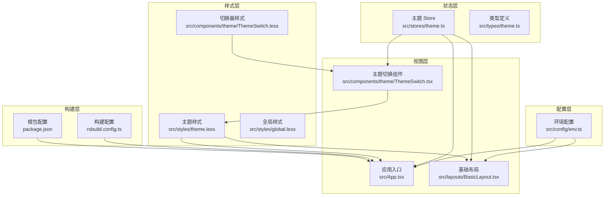
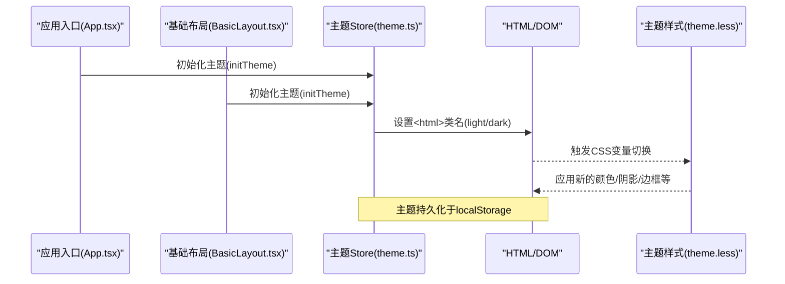
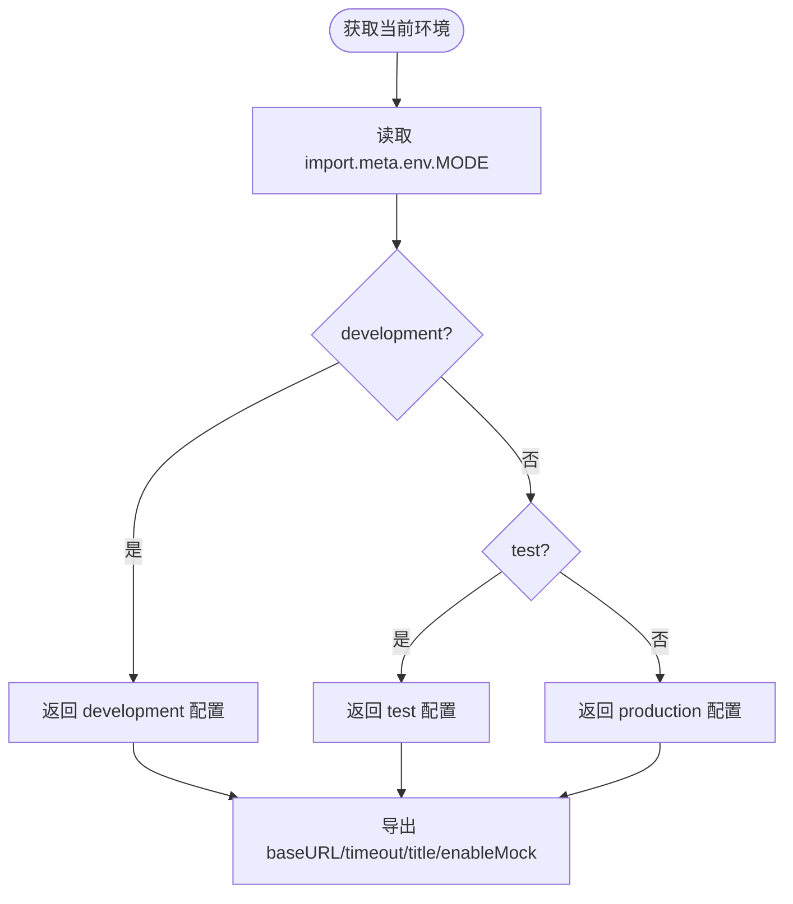
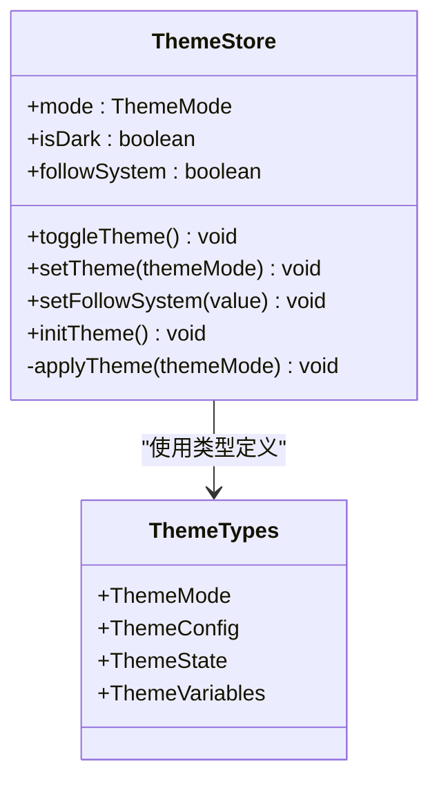
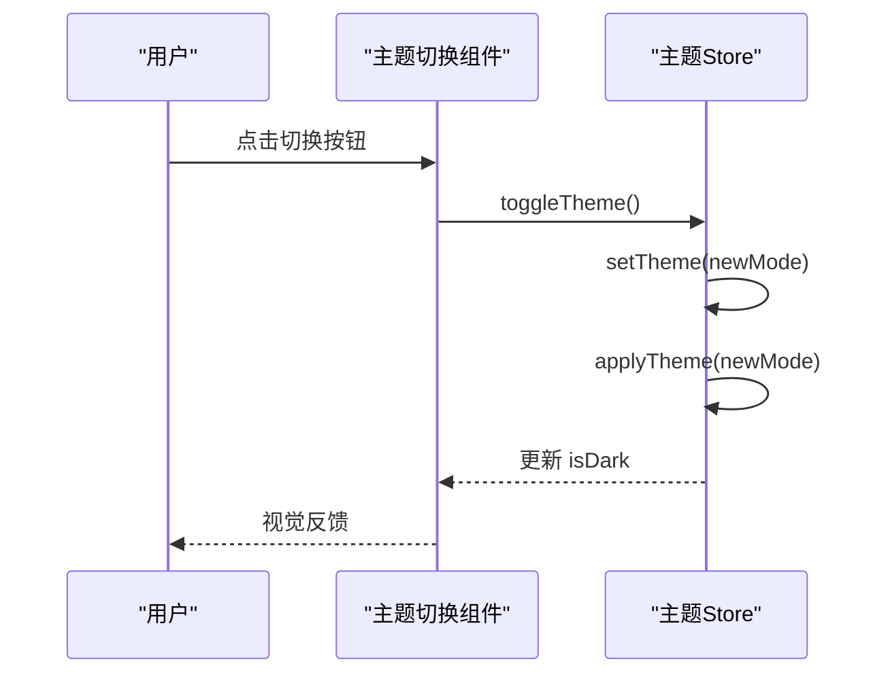
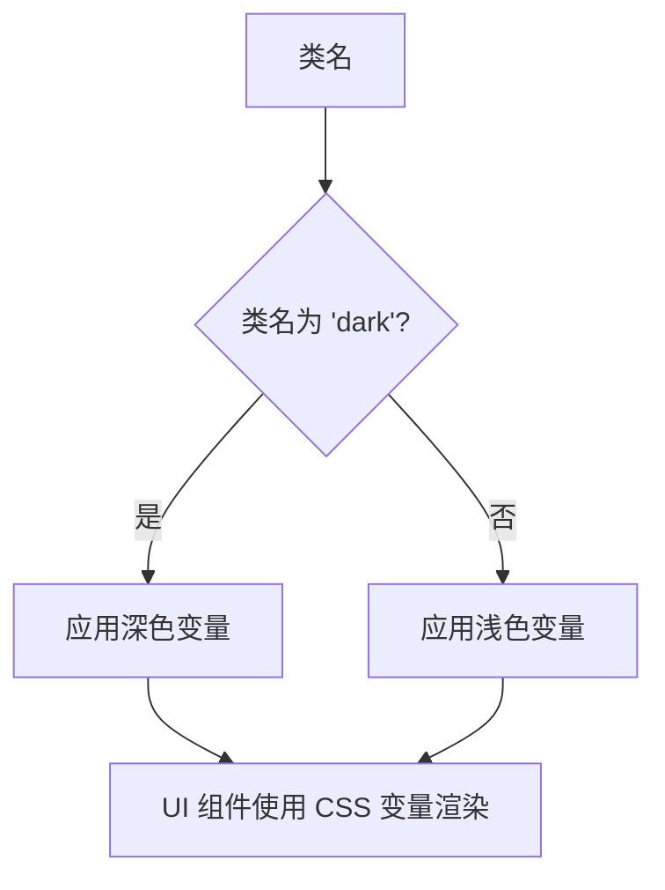
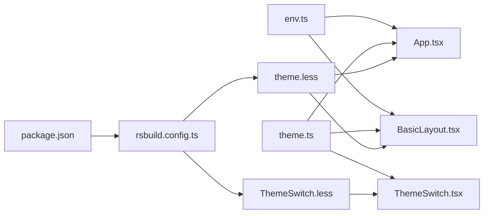

# 系统配置

<cite>
**本文引用的文件**
- [env.ts](file://src/config/env.ts)
- [theme.ts](file://src/stores/theme.ts)
- [theme.ts 类型定义](file://src/types/theme.ts)
- [主题样式 theme.less](file://src/styles/theme.less)
- [主题切换组件 ThemeSwitch.tsx](file://src/components/theme/ThemeSwitch.tsx)
- [应用入口 App.tsx](file://src/App.tsx)
- [基础布局 BasicLayout.tsx](file://src/layouts/BasicLayout.tsx)
- [主题切换样式 ThemeSwitch.less](file://src/components/theme/ThemeSwitch.less)
- [全局样式 global.less](file://src/styles/global.less)
- [构建配置 rsbuild.config.ts](file://rsbuild.config.ts)
- [根包配置 package.json](file://package.json)
- [系统用户页 index.tsx](file://src/views/system/user/index.tsx)
- [系统菜单页 index.tsx](file://src/views/system/menu/index.tsx)
</cite>

## 目录
1. [简介](#简介)
2. [项目结构](#项目结构)
3. [核心组件](#核心组件)
4. [架构总览](#架构总览)
5. [详细组件分析](#详细组件分析)
6. [依赖关系分析](#依赖关系分析)
7. [性能考量](#性能考量)
8. [故障排查指南](#故障排查指南)
9. [结论](#结论)
10. [附录](#附录)

## 简介
本文件系统性阐述本项目的“系统配置”能力，重点覆盖以下方面：
- 全局配置与环境变量处理：基于构建工具注入的运行时环境变量，自动选择不同环境的配置集，并导出通用常量供业务模块使用。
- 主题定制与切换：通过 Pinia Store 管理主题状态，结合 CSS 变量与类名切换，实现深/浅主题的即时切换与持久化。
- 配置持久化与跨页面共享：主题模式与跟随系统偏好均持久化至本地存储，确保多页面、多路由间一致的主题体验。
- 数据结构与 API 接口：明确主题状态、配置与变量的数据模型，以及对外暴露的 Store 方法。
- 验证与回滚：在主题切换中采用本地存储兜底，避免异常导致的状态丢失；对环境配置提供统一出口，便于集中校验。
- 热更新与实时生效：DOM 类名变更与 CSS 变量联动，使主题切换几乎无感知地即时生效。

## 项目结构
围绕“系统配置”的关键目录与文件如下：
- 配置层：环境配置位于 src/config/env.ts，负责根据构建模式返回 baseURL、超时、标题、Mock 开关等。
- 状态层：主题状态由 src/stores/theme.ts 的 Pinia Store 管理，包含主题模式、跟随系统、深色判断等。
- 视图层：主题切换组件 src/components/theme/ThemeSwitch.tsx 提供交互入口；基础布局 src/layouts/BasicLayout.tsx 在挂载时初始化主题。
- 样式层：主题样式 src/styles/theme.less 定义 CSS 变量与深/浅主题分支；组件样式 src/components/theme/ThemeSwitch.less 提供切换器视觉效果。
- 构建层：rsbuild.config.ts 配置了 Vue、JSX、Less 插件与路径别名，保证样式与组件正确打包。

图表来源
- [env.ts](file://src/config/env.ts#L1-L120)
- [theme.ts](file://src/stores/theme.ts#L1-L111)
- [theme.ts 类型定义](file://src/types/theme.ts#L1-L90)
- [主题样式 theme.less](file://src/styles/theme.less#L1-L176)
- [主题切换组件 ThemeSwitch.tsx](file://src/components/theme/ThemeSwitch.tsx#L1-L93)
- [应用入口 App.tsx](file://src/App.tsx#L1-L20)
- [基础布局 BasicLayout.tsx](file://src/layouts/BasicLayout.tsx#L1-L146)
- [主题切换样式 ThemeSwitch.less](file://src/components/theme/ThemeSwitch.less#L1-L147)
- [全局样式 global.less](file://src/styles/global.less#L1-L4)
- [构建配置 rsbuild.config.ts](file://rsbuild.config.ts#L1-L30)
- [根包配置 package.json](file://package.json#L1-L45)

章节来源
- [构建配置 rsbuild.config.ts](file://rsbuild.config.ts#L1-L30)
- [根包配置 package.json](file://package.json#L1-L45)

## 核心组件
- 环境配置模块
  - 职责：根据构建模式自动识别环境，提供 baseURL、timeout、title、enableMock 等配置常量。
  - 关键点：通过 import.meta.env.MODE 获取当前模式；按环境返回固定配置对象；导出常用配置常量以供业务直接使用。
- 主题 Store
  - 职责：管理主题模式、跟随系统偏好、深色判断；提供切换、设置、初始化等方法；监听状态变化并应用到 DOM。
  - 关键点：使用 localStorage 持久化主题；监听系统主题变化并在跟随模式下自动同步；通过给 <html> 添加/移除类名实现深/浅主题切换。
- 主题切换组件
  - 职责：提供可视化主题切换按钮，支持大小尺寸与提示气泡；调用 Store 的 toggleTheme 实现切换。
  - 关键点：使用 Element Plus Tooltip；内部渲染太阳/月亮图标；通过 storeToRefs 保持响应式。
- 样式体系
  - 职责：通过 CSS 变量定义主题色彩与组件风格；深/浅主题分支分别定义变量值；切换器样式提供动画与视觉反馈。
  - 关键点：:root 与 :root.dark/:root.light 组合；变量命名规范统一；与 Store 的类名切换配合。

章节来源
- [env.ts](file://src/config/env.ts#L1-L120)
- [theme.ts](file://src/stores/theme.ts#L1-L111)
- [主题切换组件 ThemeSwitch.tsx](file://src/components/theme/ThemeSwitch.tsx#L1-L93)
- [主题样式 theme.less](file://src/styles/theme.less#L1-L176)

## 架构总览
系统配置的总体流程如下：
- 应用启动时，入口组件初始化主题 Store。
- Store 从本地存储读取主题模式，若未设置则默认深色；同时监听系统主题变化（当开启跟随系统时）。
- 切换组件触发 Store 的切换逻辑，写入新主题并应用到 <html> 类名，从而驱动 CSS 变量生效。
- 环境配置模块在运行时提供 baseURL、超时、标题、Mock 开关等常量，供网络请求与业务逻辑使用。

图表来源
- [应用入口 App.tsx](file://src/App.tsx#L1-L20)
- [基础布局 BasicLayout.tsx](file://src/layouts/BasicLayout.tsx#L1-L146)
- [主题 Store](file://src/stores/theme.ts#L1-L111)
- [主题样式 theme.less](file://src/styles/theme.less#L1-L176)

## 详细组件分析

### 环境配置模块（env.ts）
- 运行时环境识别
  - 依据 import.meta.env.MODE 自动判定 development/test/production。
- 环境配置集
  - 每个环境包含 baseURL、timeout、title、enableMock 等字段，用于网络请求与界面展示。
- 常量导出
  - 直接导出 baseURL、timeout、title、enableMock，便于业务模块直接使用，减少重复读取。
- Token 与状态码
  - 提供 Token 键名、读取/设置/移除方法；定义业务状态码与 HTTP 状态消息映射，便于统一处理。

图表来源
- [env.ts](file://src/config/env.ts#L1-L120)

章节来源
- [env.ts](file://src/config/env.ts#L1-L120)

### 主题 Store（theme.ts）
- 状态与行为
  - 状态：mode（当前主题）、isDark（是否深色）、followSystem（是否跟随系统）。
  - 行为：toggleTheme、setTheme、setFollowSystem、initTheme、applyTheme。
- 初始化与监听
  - initTheme 会应用当前主题到 DOM，并监听系统 prefers-color-scheme 变化；当 followSystem 为真时自动切换。
- 持久化策略
  - setTheme 会将主题写入 localStorage；getStoredTheme 从 localStorage 读取，若无效则回退到深色。
- DOM 应用
  - 通过给 document.documentElement 添加/移除 'light'/'dark' 类名，驱动 CSS 变量切换。

图表来源
- [theme.ts](file://src/stores/theme.ts#L1-L111)
- [theme.ts 类型定义](file://src/types/theme.ts#L1-L90)

章节来源
- [theme.ts](file://src/stores/theme.ts#L1-L111)
- [theme.ts 类型定义](file://src/types/theme.ts#L1-L90)

### 主题切换组件（ThemeSwitch.tsx）
- 交互与渲染
  - 支持 small/default/large 三种尺寸；可选显示 Tooltip；渲染太阳/月亮图标。
- 响应式绑定
  - 使用 storeToRefs 访问 isDark，确保组件随 Store 变化而更新。
- 事件处理
  - 点击切换按钮时调用 Store.toggleTheme，实现主题切换。

图表来源
- [主题切换组件 ThemeSwitch.tsx](file://src/components/theme/ThemeSwitch.tsx#L1-L93)
- [主题 Store](file://src/stores/theme.ts#L1-L111)

章节来源
- [主题切换组件 ThemeSwitch.tsx](file://src/components/theme/ThemeSwitch.tsx#L1-L93)

### 样式体系（theme.less 与 ThemeSwitch.less）
- 主题变量
  - 深色主题为默认主题，定义背景、文字、边框、填充、主题色、功能色、阴影、侧边栏、头部、卡片、表格、输入框、标签页等变量。
  - 浅色主题分支提供对应变量值，通过 :root.light 切换。
- 切换器样式
  - 提供轨道、拇指、图标动画与深色模式下的轨道样式；支持小/大尺寸变体。

图表来源
- [主题样式 theme.less](file://src/styles/theme.less#L1-L176)
- [主题切换样式 ThemeSwitch.less](file://src/components/theme/ThemeSwitch.less#L1-L147)

章节来源
- [主题样式 theme.less](file://src/styles/theme.less#L1-L176)
- [主题切换样式 ThemeSwitch.less](file://src/components/theme/ThemeSwitch.less#L1-L147)

### 应用入口与布局（App.tsx、BasicLayout.tsx）
- 应用入口
  - 在 setup 中调用 themeStore.initTheme，确保应用启动即应用主题。
- 基础布局
  - 在 mounted 生命周期再次初始化主题；在头部右侧集成 ThemeSwitch 组件，提供主题切换入口。

章节来源
- [应用入口 App.tsx](file://src/App.tsx#L1-L20)
- [基础布局 BasicLayout.tsx](file://src/layouts/BasicLayout.tsx#L1-L146)

## 依赖关系分析
- 模块耦合
  - App.tsx 与 BasicLayout.tsx 依赖 theme.ts；ThemeSwitch.tsx 依赖 theme.ts；theme.less 依赖 theme.ts 的类名切换。
- 外部依赖
  - Vue 3、Element Plus、Pinia、Less 插件由 Rsbuild 管理；构建配置启用 Less、Vue、JSX 插件并设置路径别名。
- 环境变量
  - 环境配置模块依赖 import.meta.env.MODE；Rsbuild 在构建时注入该变量。

图表来源
- [env.ts](file://src/config/env.ts#L1-L120)
- [theme.ts](file://src/stores/theme.ts#L1-L111)
- [主题样式 theme.less](file://src/styles/theme.less#L1-L176)
- [主题切换组件 ThemeSwitch.tsx](file://src/components/theme/ThemeSwitch.tsx#L1-L93)
- [主题切换样式 ThemeSwitch.less](file://src/components/theme/ThemeSwitch.less#L1-L147)
- [应用入口 App.tsx](file://src/App.tsx#L1-L20)
- [基础布局 BasicLayout.tsx](file://src/layouts/BasicLayout.tsx#L1-L146)
- [构建配置 rsbuild.config.ts](file://rsbuild.config.ts#L1-L30)
- [根包配置 package.json](file://package.json#L1-L45)

章节来源
- [构建配置 rsbuild.config.ts](file://rsbuild.config.ts#L1-L30)
- [根包配置 package.json](file://package.json#L1-L45)

## 性能考量
- 主题切换开销极低：仅修改 <html> 类名与 CSS 变量，不涉及重排或重绘大量节点。
- 样式体积可控：CSS 变量集中定义，避免重复样式声明；Less 插件在构建期编译，运行时无需解析。
- 本地存储读写：主题持久化使用 localStorage，读写成本低且非阻塞。
- 建议
  - 避免在主题切换过程中进行大规模 DOM 操作；如需动态色板，建议通过 CSS 变量与主题 Store 协同实现。

## 故障排查指南
- 主题未生效
  - 检查 <html> 是否存在 'light' 或 'dark' 类名；确认 theme.less 已被引入。
- 切换后立即恢复默认
  - 检查 localStorage 中 app_theme_mode 键是否存在且值为 'light'/'dark'；若无效，Store 会回退到深色。
- 跟随系统未生效
  - 确认 followSystem 已设为 true；检查浏览器系统主题变化监听是否正常（matchMedia）。
- 环境配置不正确
  - 检查 import.meta.env.MODE 是否符合预期；确认 env.ts 返回的 baseURL/timeout/title/enableMock 符合当前环境。
- 样式冲突
  - 检查是否在组件内硬编码了颜色；建议统一使用 CSS 变量。

章节来源
- [theme.ts](file://src/stores/theme.ts#L1-L111)
- [主题样式 theme.less](file://src/styles/theme.less#L1-L176)
- [env.ts](file://src/config/env.ts#L1-L120)

## 结论
本项目通过“环境配置 + 主题 Store + CSS 变量 + 本地存储”的组合，实现了简洁、稳定、可扩展的系统配置能力。环境配置提供统一的运行时参数出口；主题系统提供即时、持久化的视觉切换；样式体系以变量为中心，易于维护与扩展。整体设计遵循单一职责与低耦合原则，适合进一步在系统管理与开发者扩展场景中演进。

## 附录

### 配置项数据结构与 API 一览
- 环境配置（env.ts）
  - 字段：baseURL、timeout、title、enableMock
  - 出口：getEnv()、getEnvConfig()、常量导出（baseURL、timeout、title、enableMock）
  - Token：TOKEN_KEY、REFRESH_TOKEN_KEY；getToken()/setToken()/removeToken()、getRefreshToken()/setRefreshToken()
  - 状态码：BIZ_CODE、HTTP_STATUS_MESSAGE
- 主题配置（theme.ts 类型定义）
  - ThemeMode：'dark' | 'light'
  - ThemeConfig：mode、primaryColor、followSystem
  - ThemeState：mode、followSystem
  - ThemeVariables：背景、文字、边框、填充、主题色、功能色、阴影、侧边栏、头部、卡片等 CSS 变量键集合
- 主题 Store API（theme.ts）
  - 状态：mode、isDark、followSystem
  - 方法：toggleTheme()、setTheme(themeMode)、setFollowSystem(value)、initTheme()、applyTheme(themeMode)
- 主题切换组件（ThemeSwitch.tsx）
  - 属性：showTooltip（布尔）、size（'small'|'default'|'large'）
  - 交互：点击切换主题

章节来源
- [env.ts](file://src/config/env.ts#L1-L120)
- [theme.ts 类型定义](file://src/types/theme.ts#L1-L90)
- [theme.ts](file://src/stores/theme.ts#L1-L111)
- [主题切换组件 ThemeSwitch.tsx](file://src/components/theme/ThemeSwitch.tsx#L1-L93)

### 系统管理员操作指南
- 环境配置
  - 通过构建模式（development/test/production）自动切换 baseURL、超时、标题与 Mock 开关；如需调整，可在 env.ts 中修改对应环境配置集。
- 主题管理
  - 用户可通过顶部工具栏的主题切换组件手动切换深/浅主题；切换结果会持久化到本地存储，跨页面共享。
  - 若需要跟随系统主题，可在前端设置中开启“跟随系统”，系统主题变化时将自动同步。
- 界面与导航
  - 系统管理页面（用户、菜单）位于 src/views/system/*，可作为配置管理的入口页面进行扩展。

章节来源
- [env.ts](file://src/config/env.ts#L1-L120)
- [theme.ts](file://src/stores/theme.ts#L1-L111)
- [系统用户页 index.tsx](file://src/views/system/user/index.tsx#L1-L40)
- [系统菜单页 index.tsx](file://src/views/system/menu/index.tsx#L1-L35)

### 开发者扩展与自定义参考
- 扩展环境配置
  - 在 env.ts 的 envConfigs 中添加新环境条目；在 getEnv() 中增加模式判断；导出新常量供业务使用。
- 自定义主题变量
  - 在 theme.less 中新增或修改 CSS 变量；在 ThemeSwitch.less 中补充相应视觉样式；在组件中通过 CSS 变量引用。
- 新增主题切换入口
  - 参考 ThemeSwitch.tsx 的实现，在布局或其他位置引入切换组件；确保在 App.tsx 或 BasicLayout.tsx 中调用 initTheme。
- 构建与样式
  - Rsbuild 已启用 Less、Vue、JSX 插件；如需新增插件或调整别名，可在 rsbuild.config.ts 中扩展。

章节来源
- [env.ts](file://src/config/env.ts#L1-L120)
- [主题样式 theme.less](file://src/styles/theme.less#L1-L176)
- [主题切换样式 ThemeSwitch.less](file://src/components/theme/ThemeSwitch.less#L1-L147)
- [主题切换组件 ThemeSwitch.tsx](file://src/components/theme/ThemeSwitch.tsx#L1-L93)
- [应用入口 App.tsx](file://src/App.tsx#L1-L20)
- [基础布局 BasicLayout.tsx](file://src/layouts/BasicLayout.tsx#L1-L146)
- [构建配置 rsbuild.config.ts](file://rsbuild.config.ts#L1-L30)