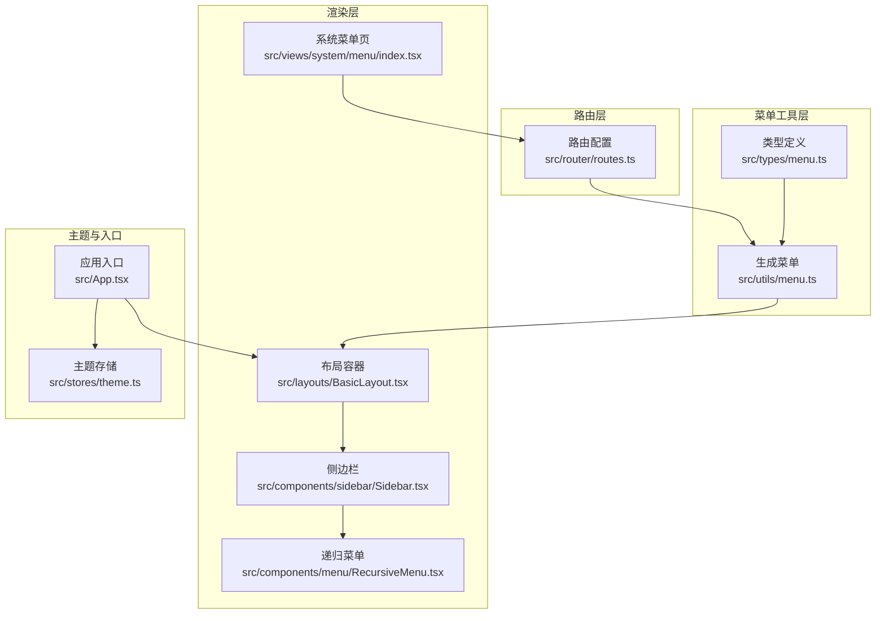
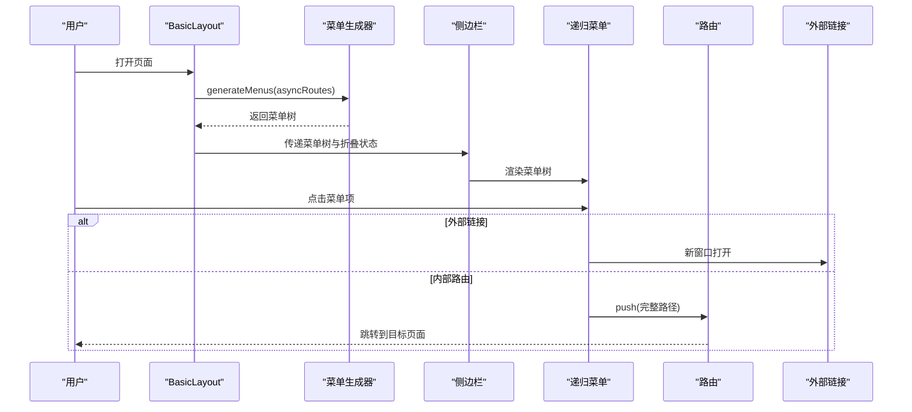
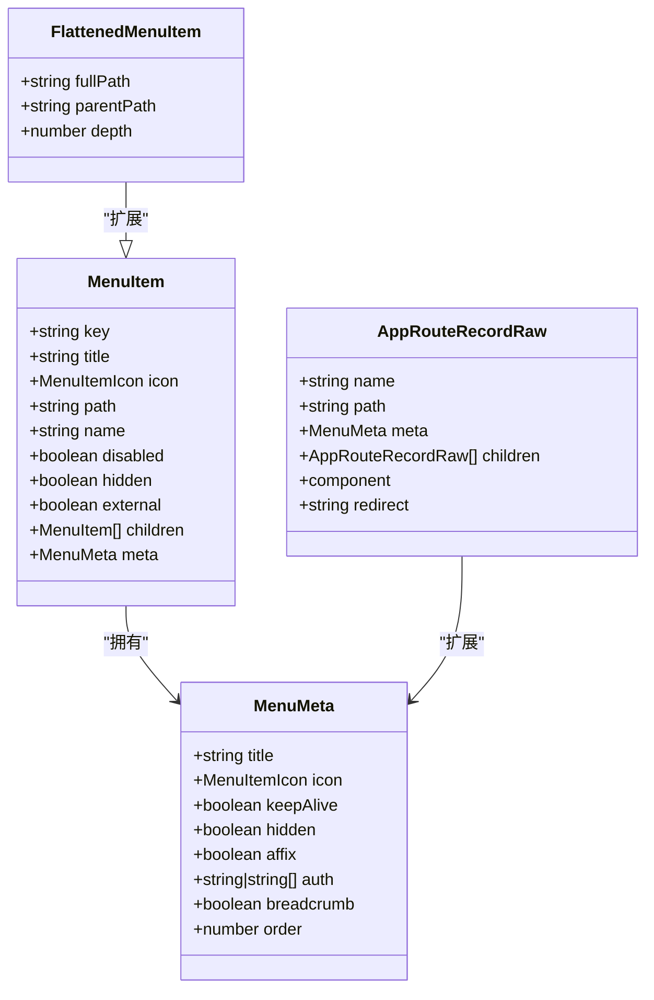
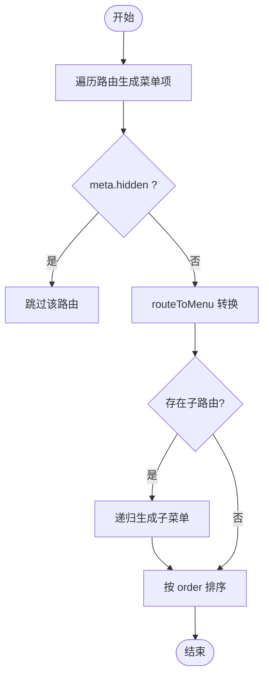
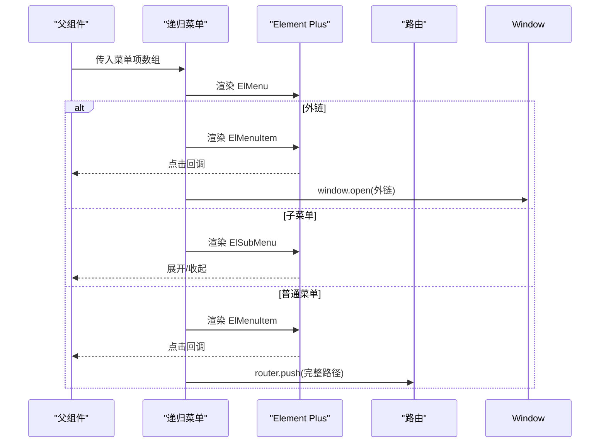
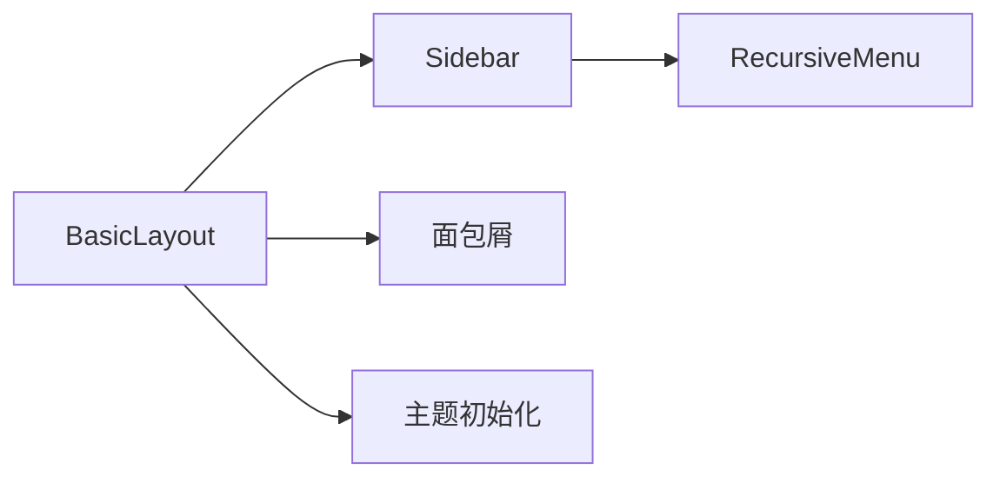
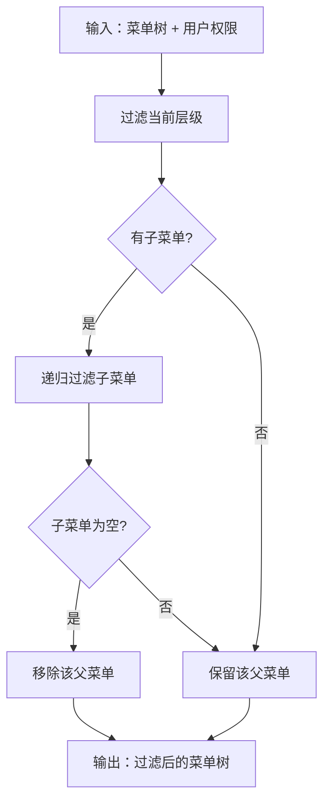
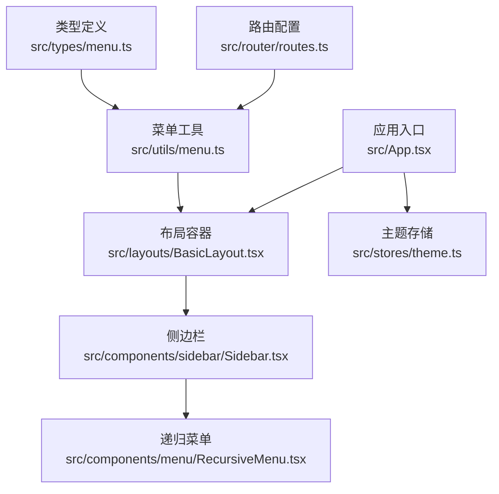

# 菜单管理

<cite>
**本文引用的文件**
- [src/types/menu.ts](file://src/types/menu.ts)
- [src/utils/menu.ts](file://src/utils/menu.ts)
- [src/components/menu/RecursiveMenu.tsx](file://src/components/menu/RecursiveMenu.tsx)
- [src/components/sidebar/Sidebar.tsx](file://src/components/sidebar/Sidebar.tsx)
- [src/components/sidebar/Sidebar.less](file://src/components/sidebar/Sidebar.less)
- [src/layouts/BasicLayout.tsx](file://src/layouts/BasicLayout.tsx)
- [src/router/routes.ts](file://src/router/routes.ts)
- [src/views/system/menu/index.tsx](file://src/views/system/menu/index.tsx)
- [src/views/system/menu/index.less](file://src/views/system/menu/index.less)
- [src/stores/theme.ts](file://src/stores/theme.ts)
- [src/App.tsx](file://src/App.tsx)
- [src/api/types.ts](file://src/api/types.ts)
</cite>

## 目录
1. [简介](#简介)
2. [项目结构](#项目结构)
3. [核心组件](#核心组件)
4. [架构总览](#架构总览)
5. [详细组件分析](#详细组件分析)
6. [依赖分析](#依赖分析)
7. [性能考虑](#性能考虑)
8. [故障排查指南](#故障排查指南)
9. [结论](#结论)
10. [附录](#附录)

## 简介
本文件系统性阐述菜单管理功能的设计与实现，涵盖菜单树形结构的创建、编辑与删除；动态菜单生成机制与权限控制；菜单层级关系与路由映射配置；递归菜单组件的实现原理与使用方法；菜单数据结构与 API 接口说明；菜单图标配置与样式定制；以及菜单缓存机制与性能优化策略。同时提供面向系统管理员的操作指南与面向开发者的扩展参考。

## 项目结构
菜单系统围绕“路由 → 菜单 → 渲染”三段式展开：路由配置定义菜单结构与权限，工具函数将路由转换为菜单树，组件负责渲染与交互；布局层整合侧边栏与面包屑，主题存储负责主题持久化与切换。

图表来源
- [src/router/routes.ts](file://src/router/routes.ts#L1-L215)
- [src/utils/menu.ts](file://src/utils/menu.ts#L1-L172)
- [src/types/menu.ts](file://src/types/menu.ts#L1-L122)
- [src/layouts/BasicLayout.tsx](file://src/layouts/BasicLayout.tsx#L1-L146)
- [src/components/sidebar/Sidebar.tsx](file://src/components/sidebar/Sidebar.tsx#L1-L87)
- [src/components/menu/RecursiveMenu.tsx](file://src/components/menu/RecursiveMenu.tsx#L1-L171)
- [src/views/system/menu/index.tsx](file://src/views/system/menu/index.tsx#L1-L35)
- [src/stores/theme.ts](file://src/stores/theme.ts#L1-L111)
- [src/App.tsx](file://src/App.tsx#L1-L20)

章节来源
- [src/router/routes.ts](file://src/router/routes.ts#L1-L215)
- [src/utils/menu.ts](file://src/utils/menu.ts#L1-L172)
- [src/types/menu.ts](file://src/types/menu.ts#L1-L122)
- [src/layouts/BasicLayout.tsx](file://src/layouts/BasicLayout.tsx#L1-L146)
- [src/components/sidebar/Sidebar.tsx](file://src/components/sidebar/Sidebar.tsx#L1-L87)
- [src/components/menu/RecursiveMenu.tsx](file://src/components/menu/RecursiveMenu.tsx#L1-L171)
- [src/views/system/menu/index.tsx](file://src/views/system/menu/index.tsx#L1-L35)
- [src/stores/theme.ts](file://src/stores/theme.ts#L1-L111)
- [src/App.tsx](file://src/App.tsx#L1-L20)

## 核心组件
- 菜单数据模型与路由模型：通过统一的类型定义描述菜单项、元信息、路由记录等，确保菜单与路由的一致性与可扩展性。
- 菜单生成器：从路由配置生成菜单树，支持排序、路径解析、外部链接识别与隐藏规则。
- 递归菜单组件：基于 Element Plus 的菜单组件，支持外链、子菜单、图标渲染与点击跳转。
- 侧边栏容器：承载菜单渲染与折叠控制，并提供样式覆盖与交互。
- 布局容器：整合面包屑、头部工具栏与主内容区，动态计算主区边距以适配侧边栏宽度。
- 主题存储：负责主题模式持久化、系统偏好监听与 DOM 应用。

章节来源
- [src/types/menu.ts](file://src/types/menu.ts#L1-L122)
- [src/utils/menu.ts](file://src/utils/menu.ts#L1-L172)
- [src/components/menu/RecursiveMenu.tsx](file://src/components/menu/RecursiveMenu.tsx#L1-L171)
- [src/components/sidebar/Sidebar.tsx](file://src/components/sidebar/Sidebar.tsx#L1-L87)
- [src/layouts/BasicLayout.tsx](file://src/layouts/BasicLayout.tsx#L1-L146)
- [src/stores/theme.ts](file://src/stores/theme.ts#L1-L111)

## 架构总览
菜单系统的关键流程如下：
- 路由配置定义菜单层级、标题、图标、权限与排序等元信息。
- 布局层在运行时调用菜单生成器，将路由转换为菜单树。
- 侧边栏容器将菜单树传入递归菜单组件进行渲染。
- 用户点击菜单项触发路由跳转或新窗口打开外链。
- 主题存储负责主题切换与持久化，影响菜单样式。

图表来源
- [src/layouts/BasicLayout.tsx](file://src/layouts/BasicLayout.tsx#L29-L32)
- [src/utils/menu.ts](file://src/utils/menu.ts#L7-L35)
- [src/components/sidebar/Sidebar.tsx](file://src/components/sidebar/Sidebar.tsx#L64-L70)
- [src/components/menu/RecursiveMenu.tsx](file://src/components/menu/RecursiveMenu.tsx#L19-L84)
- [src/router/routes.ts](file://src/router/routes.ts#L26-L215)

## 详细组件分析

### 数据模型与类型定义
- 菜单项接口：包含唯一键、标题、图标、路径、名称、禁用、隐藏、外链、子菜单与元信息。
- 菜单元数据：标题、图标、页面缓存、隐藏、固定标签、权限标识、面包屑、排序权重等。
- 扩展路由记录：在标准路由基础上增加元信息与子路由，便于菜单生成。
- 侧边栏与递归菜单 Props：定义渲染所需的样式与行为参数。
- 扁平化菜单项：用于扁平化处理后的菜单，携带完整路径、父路径与层级深度。

图表来源
- [src/types/menu.ts](file://src/types/menu.ts#L12-L122)

章节来源
- [src/types/menu.ts](file://src/types/menu.ts#L1-L122)

### 菜单生成与路由映射
- 从路由生成菜单：遍历路由，跳过隐藏项，将路由转换为菜单项，递归处理子路由，最终按排序权重排序。
- 路径解析：支持绝对路径、相对路径与外部链接，自动拼接父子路径。
- 扁平化菜单：将树形菜单扁平化，便于快速查找与面包屑生成。
- 权限过滤：根据用户权限列表过滤菜单，若子菜单全部被过滤则隐藏父菜单。

图表来源
- [src/utils/menu.ts](file://src/utils/menu.ts#L7-L35)

章节来源
- [src/utils/menu.ts](file://src/utils/menu.ts#L1-L172)
- [src/router/routes.ts](file://src/router/routes.ts#L26-L215)

### 递归菜单组件实现原理
- 图标渲染：支持字符串图标名与组件图标，字符串图标通过图标库映射为组件。
- 外链处理：识别外部链接并在新窗口打开；非外链解析为完整内部路径后进行路由跳转。
- 子菜单渲染：递归渲染子菜单，自动拼接父路径作为基础路径，保证子项路径正确。
- 事件与交互：暴露选择事件，支持默认激活项、默认展开项、唯一展开、折叠状态与样式定制。

图表来源
- [src/components/menu/RecursiveMenu.tsx](file://src/components/menu/RecursiveMenu.tsx#L19-L84)

章节来源
- [src/components/menu/RecursiveMenu.tsx](file://src/components/menu/RecursiveMenu.tsx#L1-L171)

### 侧边栏与布局集成
- 侧边栏容器：接收菜单树与折叠状态，渲染菜单组件并提供折叠按钮。
- 布局容器：在运行时生成菜单树，计算主内容区边距以适配侧边栏宽度；生成面包屑数据。
- 样式覆盖：通过 Less 覆盖 Element Plus 菜单样式，支持折叠状态与深色主题。

图表来源
- [src/layouts/BasicLayout.tsx](file://src/layouts/BasicLayout.tsx#L29-L46)
- [src/components/sidebar/Sidebar.tsx](file://src/components/sidebar/Sidebar.tsx#L44-L71)
- [src/components/sidebar/Sidebar.less](file://src/components/sidebar/Sidebar.less#L1-L223)

章节来源
- [src/layouts/BasicLayout.tsx](file://src/layouts/BasicLayout.tsx#L1-L146)
- [src/components/sidebar/Sidebar.tsx](file://src/components/sidebar/Sidebar.tsx#L1-L87)
- [src/components/sidebar/Sidebar.less](file://src/components/sidebar/Sidebar.less#L1-L223)

### 权限控制与菜单过滤
- 路由元信息：在路由 meta 中声明权限标识，支持字符串或字符串数组。
- 运行时过滤：根据用户权限列表过滤菜单树，递归处理子菜单，隐藏无可见子项的父菜单。
- 使用建议：在登录成功后，结合用户角色/权限集合调用过滤函数生成最终菜单。

图表来源
- [src/utils/menu.ts](file://src/utils/menu.ts#L146-L171)
- [src/router/routes.ts](file://src/router/routes.ts#L66-L108)

章节来源
- [src/utils/menu.ts](file://src/utils/menu.ts#L146-L171)
- [src/router/routes.ts](file://src/router/routes.ts#L26-L215)

### 菜单图标配置与样式定制
- 图标来源：支持字符串图标名（来自图标库映射）与组件图标。
- 样式覆盖：通过 Less 文件覆盖 Element Plus 菜单项、子菜单与激活状态样式，支持折叠状态与深色主题。
- 自定义建议：新增图标时，确保图标库中存在对应名称；如需自定义样式，可在侧边栏样式文件中扩展。

章节来源
- [src/components/menu/RecursiveMenu.tsx](file://src/components/menu/RecursiveMenu.tsx#L9-L16)
- [src/components/sidebar/Sidebar.less](file://src/components/sidebar/Sidebar.less#L80-L177)

### 菜单缓存机制与性能优化
- 缓存策略：在布局层生成菜单树后，可将结果缓存于计算属性或全局状态中，避免重复生成。
- 性能优化：
  - 路由到菜单转换仅在路由变更时执行。
  - 递归渲染按需展开，减少 DOM 节点数量。
  - 路径解析与过滤采用线性扫描，复杂度与节点总数成正比；可通过分页或懒加载优化深层菜单。
  - 主题切换通过类名切换，避免频繁重绘。

章节来源
- [src/layouts/BasicLayout.tsx](file://src/layouts/BasicLayout.tsx#L29-L32)
- [src/utils/menu.ts](file://src/utils/menu.ts#L63-L103)
- [src/stores/theme.ts](file://src/stores/theme.ts#L44-L70)

### 系统管理员操作指南
- 菜单管理页面：位于系统管理模块，提供查询与筛选入口（菜单名称、状态等），用于管理菜单数据。
- 路由配置：通过修改路由配置文件，增删改菜单项的标题、图标、路径、权限与排序。
- 权限分配：在路由 meta 中设置 auth 字段，支持字符串或数组；登录后根据用户权限动态过滤菜单。
- 菜单层级：通过 children 字段构建多级菜单；注意路径解析与排序权重，确保导航清晰。

章节来源
- [src/views/system/menu/index.tsx](file://src/views/system/menu/index.tsx#L1-L35)
- [src/views/system/menu/index.less](file://src/views/system/menu/index.less#L1-L4)
- [src/router/routes.ts](file://src/router/routes.ts#L26-L215)

### 开发者扩展与自定义参考
- 新增菜单项：在路由配置中添加条目，设置 meta 标识（标题、图标、权限、排序等）。
- 自定义图标：在菜单项中指定图标名或组件；确保图标库中存在对应名称。
- 自定义样式：在侧边栏样式文件中扩展 Element Plus 菜单样式，支持折叠与深色主题。
- 动态菜单：结合用户权限与业务数据，运行时生成菜单树并缓存，提升性能。
- 主题集成：通过主题存储初始化与切换主题，影响菜单整体视觉风格。

章节来源
- [src/router/routes.ts](file://src/router/routes.ts#L26-L215)
- [src/components/menu/RecursiveMenu.tsx](file://src/components/menu/RecursiveMenu.tsx#L1-L171)
- [src/components/sidebar/Sidebar.less](file://src/components/sidebar/Sidebar.less#L1-L223)
- [src/stores/theme.ts](file://src/stores/theme.ts#L1-L111)

## 依赖分析
- 类型依赖：菜单工具函数依赖类型定义；递归菜单组件依赖类型与工具函数。
- 组件依赖：布局容器依赖菜单生成器与侧边栏；侧边栏依赖递归菜单组件。
- 路由依赖：菜单生成器依赖路由配置；权限过滤依赖路由元信息。
- 主题依赖：应用入口依赖主题存储；侧边栏样式受主题影响。

图表来源
- [src/types/menu.ts](file://src/types/menu.ts#L1-L122)
- [src/utils/menu.ts](file://src/utils/menu.ts#L1-L172)
- [src/router/routes.ts](file://src/router/routes.ts#L1-L215)
- [src/layouts/BasicLayout.tsx](file://src/layouts/BasicLayout.tsx#L1-L146)
- [src/components/sidebar/Sidebar.tsx](file://src/components/sidebar/Sidebar.tsx#L1-L87)
- [src/components/menu/RecursiveMenu.tsx](file://src/components/menu/RecursiveMenu.tsx#L1-L171)
- [src/App.tsx](file://src/App.tsx#L1-L20)
- [src/stores/theme.ts](file://src/stores/theme.ts#L1-L111)

章节来源
- [src/types/menu.ts](file://src/types/menu.ts#L1-L122)
- [src/utils/menu.ts](file://src/utils/menu.ts#L1-L172)
- [src/router/routes.ts](file://src/router/routes.ts#L1-L215)
- [src/layouts/BasicLayout.tsx](file://src/layouts/BasicLayout.tsx#L1-L146)
- [src/components/sidebar/Sidebar.tsx](file://src/components/sidebar/Sidebar.tsx#L1-L87)
- [src/components/menu/RecursiveMenu.tsx](file://src/components/menu/RecursiveMenu.tsx#L1-L171)
- [src/App.tsx](file://src/App.tsx#L1-L20)
- [src/stores/theme.ts](file://src/stores/theme.ts#L1-L111)

## 性能考虑
- 菜单生成：仅在路由变更时重新生成，避免每次渲染都进行昂贵计算。
- 路径解析：使用常量时间的字符串判断与拼接，复杂度与路径长度线性相关。
- 递归渲染：按需展开子菜单，减少一次性渲染的节点数量。
- 主题切换：通过类名切换实现，避免重排与重绘。
- 缓存策略：将生成的菜单树缓存至计算属性或全局状态，降低重复计算成本。

## 故障排查指南
- 菜单不显示：
  - 检查路由 meta 中的 hidden 字段是否为真。
  - 确认菜单项的 key 与路径是否正确。
- 外链无法打开：
  - 确认路径是否符合外部链接格式（以协议开头）。
- 菜单层级错误：
  - 检查父子路径拼接逻辑，确保父路径末尾与子路径开头的斜杠处理正确。
- 权限过滤异常：
  - 确认路由 meta 中的 auth 字段类型（字符串或数组）与用户权限集合一致。
- 样式异常：
  - 检查侧边栏样式覆盖是否生效，确认深色主题开关状态。

章节来源
- [src/utils/menu.ts](file://src/utils/menu.ts#L55-L103)
- [src/utils/menu.ts](file://src/utils/menu.ts#L146-L171)
- [src/components/sidebar/Sidebar.less](file://src/components/sidebar/Sidebar.less#L1-L223)

## 结论
本菜单系统以路由为核心驱动，通过类型定义与工具函数实现菜单树的生成与过滤，借助递归菜单组件完成渲染与交互，并在布局层实现面包屑与侧边栏的整体集成。配合主题存储与样式覆盖，系统具备良好的可扩展性与可维护性。管理员可通过路由配置与权限标识灵活管理菜单，开发者可基于现有结构进行扩展与自定义。

## 附录

### 菜单数据结构与 API 接口说明
- 菜单项接口：包含唯一键、标题、图标、路径、名称、禁用、隐藏、外链、子菜单与元信息。
- 菜单元数据：标题、图标、页面缓存、隐藏、固定标签、权限标识、面包屑、排序权重。
- 扩展路由记录：在标准路由基础上增加元信息与子路由，便于菜单生成。
- 扁平化菜单项：用于扁平化处理后的菜单，携带完整路径、父路径与层级深度。
- 用户/角色/菜单 API 类型：包含用户信息、角色信息与菜单信息等，便于后端对接与前端展示。

章节来源
- [src/types/menu.ts](file://src/types/menu.ts#L12-L122)
- [src/api/types.ts](file://src/api/types.ts#L84-L96)