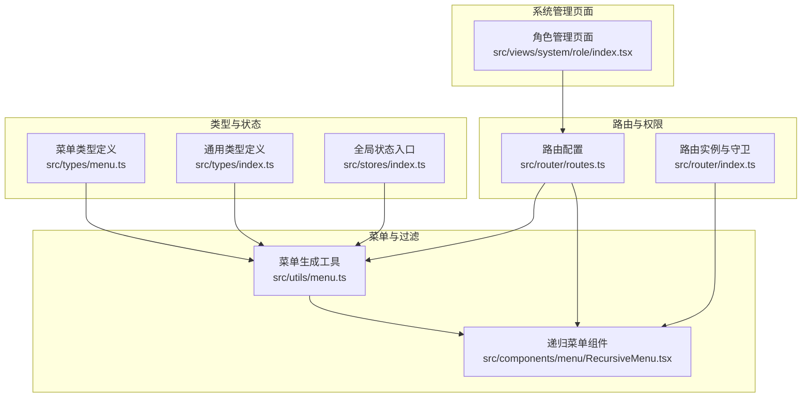
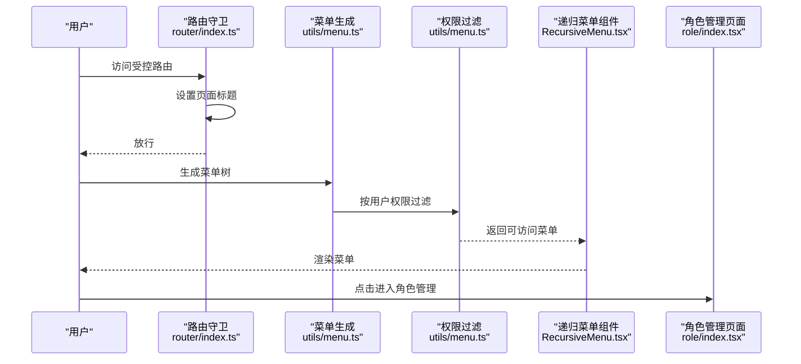
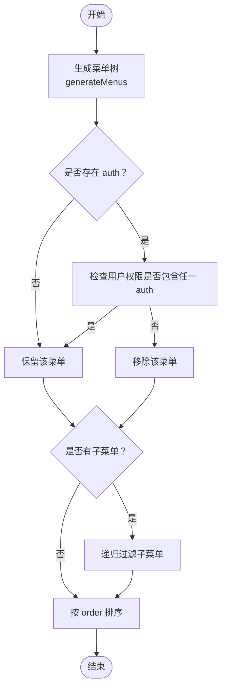
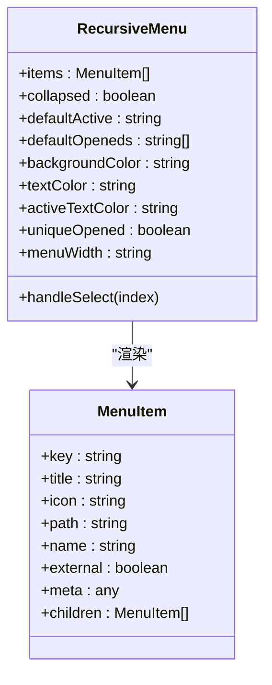
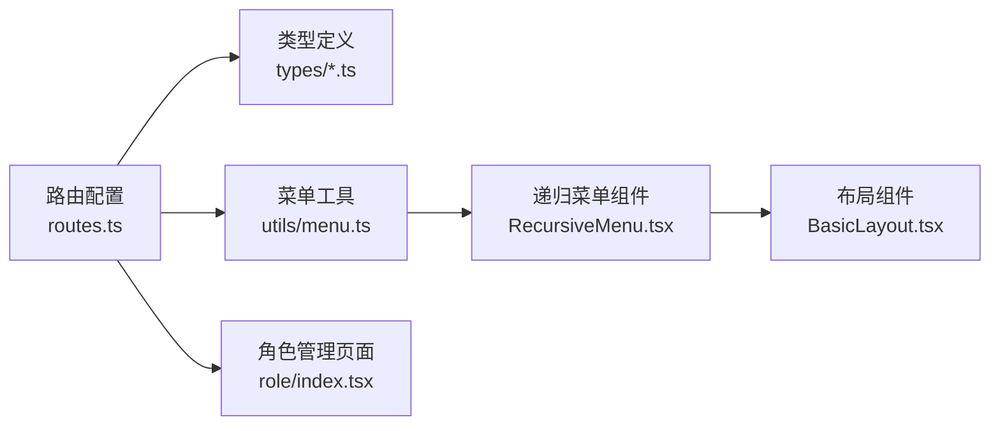

# 角色权限管理

<cite>
**本文引用的文件**
- [src/views/system/role/index.tsx](file://src/views/system/role/index.tsx)
- [src/views/system/role/index.less](file://src/views/system/role/index.less)
- [src/router/routes.ts](file://src/router/routes.ts)
- [src/router/index.ts](file://src/router/index.ts)
- [src/components/menu/RecursiveMenu.tsx](file://src/components/menu/RecursiveMenu.tsx)
- [src/utils/menu.ts](file://src/utils/menu.ts)
- [src/types/menu.ts](file://src/types/menu.ts)
- [src/types/index.ts](file://src/types/index.ts)
- [src/stores/index.ts](file://src/stores/index.ts)
- [src/layouts/BasicLayout.tsx](file://src/layouts/BasicLayout.tsx)
- [src/api/user.ts](file://src/api/user.ts)
- [src/api/types.ts](file://src/api/types.ts)
</cite>

## 目录
1. [简介](#简介)
2. [项目结构](#项目结构)
3. [核心组件](#核心组件)
4. [架构总览](#架构总览)
5. [详细组件分析](#详细组件分析)
6. [依赖关系分析](#依赖关系分析)
7. [性能考虑](#性能考虑)
8. [故障排查指南](#故障排查指南)
9. [结论](#结论)
10. [附录](#附录)

## 简介
本文件围绕角色权限管理功能进行系统性说明，重点覆盖基于角色的访问控制（RBAC）模型在前端侧的实现与配置方式。当前仓库已具备以下能力：
- 路由级权限标记与菜单过滤
- 菜单权限过滤与动态渲染
- 角色管理页面基础结构
- 用户认证与会话状态管理（通过全局状态与API）

尚未发现后端权限服务或数据库模型的实现文件，因此本文件将基于现有前端能力进行“可落地的RBAC实现建议”与“当前可用功能的使用说明”。

## 项目结构
角色权限相关的核心位置集中在路由、菜单工具函数、菜单组件以及系统管理页面中。

图表来源
- [src/router/routes.ts](file://src/router/routes.ts#L1-L215)
- [src/router/index.ts](file://src/router/index.ts#L1-L46)
- [src/utils/menu.ts](file://src/utils/menu.ts#L1-L172)
- [src/components/menu/RecursiveMenu.tsx](file://src/components/menu/RecursiveMenu.tsx#L1-L171)
- [src/views/system/role/index.tsx](file://src/views/system/role/index.tsx#L1-L32)
- [src/types/menu.ts](file://src/types/menu.ts)
- [src/types/index.ts](file://src/types/index.ts)
- [src/stores/index.ts](file://src/stores/index.ts)

章节来源
- [src/router/routes.ts](file://src/router/routes.ts#L1-L215)
- [src/router/index.ts](file://src/router/index.ts#L1-L46)
- [src/utils/menu.ts](file://src/utils/menu.ts#L1-L172)
- [src/components/menu/RecursiveMenu.tsx](file://src/components/menu/RecursiveMenu.tsx#L1-L171)
- [src/views/system/role/index.tsx](file://src/views/system/role/index.tsx#L1-L32)

## 核心组件
- 路由与权限标记：在路由元信息中使用 auth 字段声明所需权限标识，用于菜单过滤与访问控制。
- 菜单生成与过滤：从路由配置生成菜单树，支持按用户权限列表过滤不可见菜单。
- 递归菜单组件：根据菜单树渲染 Element Plus 的菜单组件，支持外链、子菜单、点击跳转等行为。
- 角色管理页面：提供角色查询与表单输入的基础界面（后续可扩展为CRUD与权限分配）。

章节来源
- [src/router/routes.ts](file://src/router/routes.ts#L26-L113)
- [src/utils/menu.ts](file://src/utils/menu.ts#L7-L35)
- [src/utils/menu.ts](file://src/utils/menu.ts#L144-L171)
- [src/components/menu/RecursiveMenu.tsx](file://src/components/menu/RecursiveMenu.tsx#L18-L84)
- [src/views/system/role/index.tsx](file://src/views/system/role/index.tsx#L4-L31)

## 架构总览
下图展示了“路由 → 菜单 → 权限过滤 → 页面渲染”的整体流程，以及角色管理页面在系统中的位置。

图表来源
- [src/router/index.ts](file://src/router/index.ts#L15-L23)
- [src/utils/menu.ts](file://src/utils/menu.ts#L7-L35)
- [src/utils/menu.ts](file://src/utils/menu.ts#L144-L171)
- [src/components/menu/RecursiveMenu.tsx](file://src/components/menu/RecursiveMenu.tsx#L146-L166)
- [src/views/system/role/index.tsx](file://src/views/system/role/index.tsx#L4-L31)

## 详细组件分析

### 路由与权限标记
- 在路由元信息中使用 auth 字段标注访问所需的权限标识。支持字符串或数组形式，数组表示“任一权限满足即可”。
- 示例：系统管理模块下的用户管理、角色管理、菜单管理均配置了 auth 权限点，其中角色管理仅允许 admin。

章节来源
- [src/router/routes.ts](file://src/router/routes.ts#L85-L111)

### 菜单生成与权限过滤
- generateMenus：遍历路由配置，跳过 hidden 的路由，递归生成菜单树，并按 meta.order 排序。
- filterMenusByAuth：根据用户权限列表对菜单树进行过滤，支持父子联动（子菜单全部过滤则父菜单也被隐藏）。
- flattenMenus/resolvePath/findMenuByPath/getMenuParentPaths：提供扁平化、路径解析、查找与父路径获取等辅助能力。

图表来源
- [src/utils/menu.ts](file://src/utils/menu.ts#L7-L35)
- [src/utils/menu.ts](file://src/utils/menu.ts#L144-L171)

章节来源
- [src/utils/menu.ts](file://src/utils/menu.ts#L7-L35)
- [src/utils/menu.ts](file://src/utils/menu.ts#L144-L171)

### 递归菜单组件
- 支持外链菜单项（external），自动识别 http/https/mailto/tel 开头的链接。
- 支持子菜单与普通菜单项，点击时计算完整路径并触发路由跳转。
- 支持折叠、默认展开、唯一展开、主题色等属性配置。

图表来源
- [src/components/menu/RecursiveMenu.tsx](file://src/components/menu/RecursiveMenu.tsx#L87-L168)
- [src/types/menu.ts](file://src/types/menu.ts)

章节来源
- [src/components/menu/RecursiveMenu.tsx](file://src/components/menu/RecursiveMenu.tsx#L18-L84)
- [src/components/menu/RecursiveMenu.tsx](file://src/components/menu/RecursiveMenu.tsx#L141-L144)

### 角色管理页面
- 当前为基础布局与表单占位，包含角色名称与描述的输入框及查询/重置按钮。
- 后续可在此页面集成角色列表、新增/编辑、权限分配、用户绑定等功能。

章节来源
- [src/views/system/role/index.tsx](file://src/views/system/role/index.tsx#L4-L31)
- [src/views/system/role/index.less](file://src/views/system/role/index.less#L1-L4)

### 类型与状态
- 菜单类型定义：包含 key、title、icon、path、name、external、meta、children 等字段。
- 通用类型：AppRouteRecordRaw、MenuItem 等。
- 全局状态入口：提供用户信息、权限列表、菜单树等状态的集中管理入口（可扩展为权限缓存与实时更新）。

章节来源
- [src/types/menu.ts](file://src/types/menu.ts)
- [src/types/index.ts](file://src/types/index.ts)
- [src/stores/index.ts](file://src/stores/index.ts)

## 依赖关系分析
- 路由配置依赖类型定义（AppRouteRecordRaw、MenuItem），并通过元信息提供权限标记。
- 菜单工具函数依赖路由配置与类型，输出菜单树供组件渲染。
- 递归菜单组件依赖菜单树与路由实例，负责最终的UI渲染与交互。
- 角色管理页面依赖路由配置与菜单工具函数，用于展示系统管理入口。

图表来源
- [src/router/routes.ts](file://src/router/routes.ts#L1-L215)
- [src/types/index.ts](file://src/types/index.ts)
- [src/utils/menu.ts](file://src/utils/menu.ts#L1-L172)
- [src/components/menu/RecursiveMenu.tsx](file://src/components/menu/RecursiveMenu.tsx#L1-L171)
- [src/views/system/role/index.tsx](file://src/views/system/role/index.tsx#L1-L32)
- [src/layouts/BasicLayout.tsx](file://src/layouts/BasicLayout.tsx)

章节来源
- [src/router/routes.ts](file://src/router/routes.ts#L1-L215)
- [src/utils/menu.ts](file://src/utils/menu.ts#L1-L172)
- [src/components/menu/RecursiveMenu.tsx](file://src/components/menu/RecursiveMenu.tsx#L1-L171)
- [src/views/system/role/index.tsx](file://src/views/system/role/index.tsx#L1-L32)

## 性能考虑
- 菜单生成与过滤：建议在用户权限变更时才重新生成与过滤菜单树，避免频繁全量计算。
- 菜单扁平化：在需要快速定位菜单项时使用 flattenMenus，注意深度与节点数量对性能的影响。
- 路由守卫：beforeEach 中仅做必要操作（如设置标题），避免阻塞导航。
- 组件渲染：递归菜单组件在大量层级时应考虑虚拟滚动或分页加载策略。

## 故障排查指南
- 菜单不显示或显示异常
  - 检查路由元信息中的 auth 配置是否正确，确认用户权限列表包含所需标识。
  - 使用 flattenMenus 与 findMenuByPath 定位具体菜单项。
- 外链无法打开
  - 确认 external 与 isExternalLink 的判断逻辑，确保链接以 http/https/mailto/tel 开头。
- 菜单层级展开问题
  - 检查 uniqueOpened 与 defaultOpeneds 的配置，确认父子菜单路径解析正确。

章节来源
- [src/utils/menu.ts](file://src/utils/menu.ts#L54-L58)
- [src/utils/menu.ts](file://src/utils/menu.ts#L108-L121)
- [src/components/menu/RecursiveMenu.tsx](file://src/components/menu/RecursiveMenu.tsx#L22-L43)

## 结论
当前代码库已具备“基于路由元信息的权限标记 + 菜单过滤 + 递归菜单渲染”的RBAC前端骨架。角色管理页面作为系统管理入口之一，可在此基础上扩展角色与权限的CRUD、权限分配与用户绑定等能力。若需完善后端权限服务与数据库模型，请参考“附录：RBAC模型与接口设计建议”。

## 附录

### RBAC模型与接口设计建议（可选扩展）
- 数据模型
  - 用户：用户ID、用户名、邮箱、状态、所属角色列表
  - 角色：角色ID、角色名、角色描述、状态、创建时间
  - 权限：权限ID、权限名、权限标识（如 user:view）、资源类型、操作类型
  - 菜单：菜单ID、菜单名、路径、图标、父级ID、排序、权限标识
- 关系
  - 用户与角色：多对多
  - 角色与权限：多对多
  - 权限与菜单：多对一（菜单可映射到一个或多个权限）
- API建议
  - 用户管理：分页查询、新增/编辑、删除、重置密码
  - 角色管理：分页查询、新增/编辑、删除、角色权限分配
  - 权限管理：权限列表、权限详情、权限更新
  - 菜单管理：菜单树查询、菜单新增/编辑/删除、菜单权限关联
- 权限验证与拦截
  - 路由守卫：在 beforeEach 中校验用户权限与路由 auth 匹配
  - 请求拦截：在请求头携带用户权限或令牌，后端校验资源与操作
- 权限缓存与实时更新
  - 前端：将用户权限与菜单树缓存至全局状态；切换角色时刷新缓存
  - 后端：权限变更时推送或拉取最新权限，清理相关缓存

### 开发者参考
- 新增权限点：在路由元信息中为新页面添加 auth 字段
- 扩展菜单过滤：在 filterMenusByAuth 中增加额外过滤条件（如资源域）
- 自定义菜单样式：通过 RecursiveMenu 的 props 调整主题与布局
- 角色页面扩展：在角色管理页面集成角色列表、权限分配、用户绑定等表单与表格

### 系统管理员操作指南
- 角色配置步骤
  - 登录系统，进入“系统管理/角色管理”
  - 新增角色并填写角色名称与描述
  - 为角色分配权限（基于权限标识）
  - 将用户绑定到对应角色
  - 刷新页面查看菜单与功能是否按预期显示