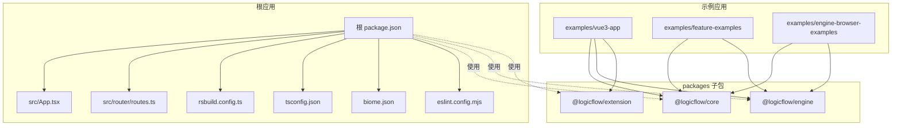
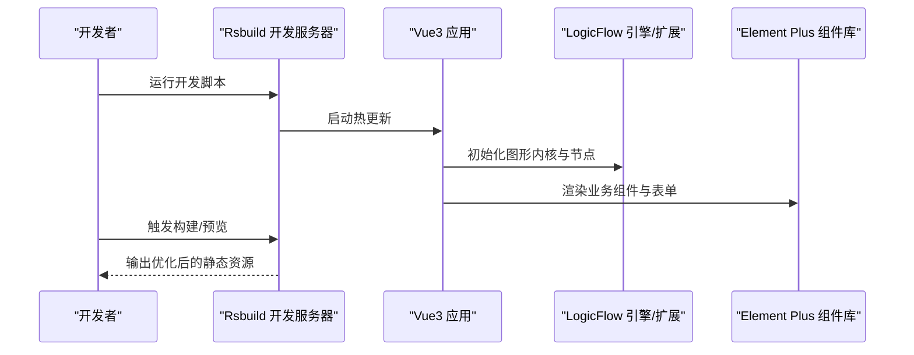
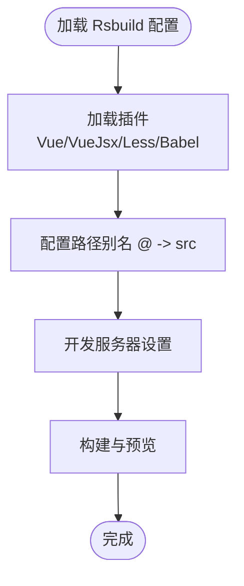
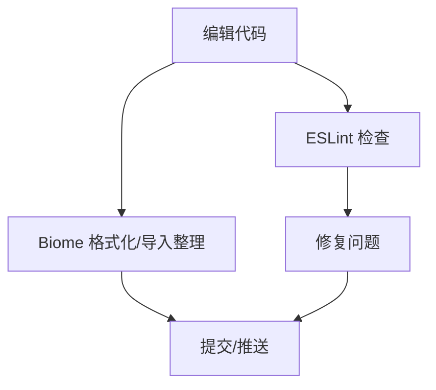
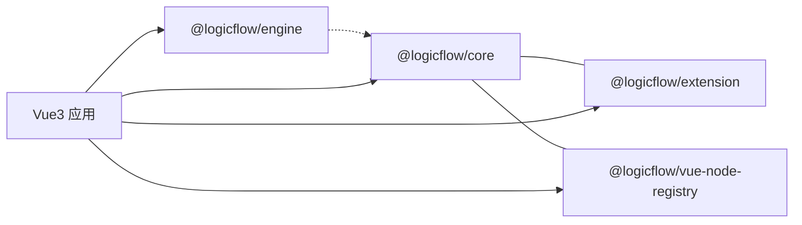
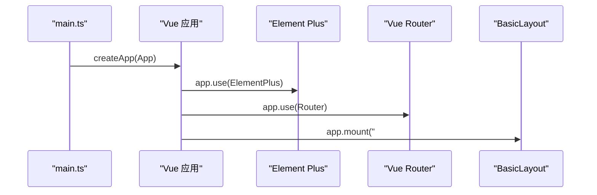
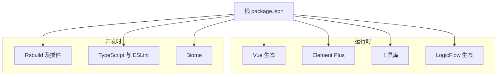

# 技术栈与依赖

<cite>
**本文引用的文件**
- [package.json](file://package.json)
- [rsbuild.config.ts](file://rsbuild.config.ts)
- [tsconfig.json](file://tsconfig.json)
- [biome.json](file://biome.json)
- [eslint.config.mjs](file://eslint.config.mjs)
- [src/App.tsx](file://src/App.tsx)
- [src/router/routes.ts](file://src/router/routes.ts)
- [examples/vue3-app/src/main.ts](file://examples/vue3-app/src/main.ts)
- [examples/vue3-app/package.json](file://examples/vue3-app/package.json)
- [examples/feature-examples/package.json](file://examples/feature-examples/package.json)
- [examples/engine-browser-examples/package.json](file://examples/engine-browser-examples/package.json)
- [packages/core/package.json](file://packages/core/package.json)
- [packages/engine/package.json](file://packages/engine/package.json)
- [packages/extension/package.json](file://packages/extension/package.json)
</cite>

## 目录
1. [引言](#引言)
2. [项目结构](#项目结构)
3. [核心组件](#核心组件)
4. [架构总览](#架构总览)
5. [详细组件分析](#详细组件分析)
6. [依赖分析](#依赖分析)
7. [性能考虑](#性能考虑)
8. [故障排查指南](#故障排查指南)
9. [结论](#结论)
10. [附录](#附录)

## 引言
本项目围绕 Rsbuild 与 LogicFlow 构建一套现代化的流程图可视化与编辑平台，技术栈以 Vue3 + TypeScript 为核心，配合 Rsbuild 高性能构建体系与 Element Plus UI 组件库，形成从开发体验到运行效率的完整闭环。本文档系统梳理技术选型理由、关键依赖与版本关系、工具链配置与最佳实践，并给出学习路径与参考资料。

## 项目结构
项目采用多包工作区组织方式，根目录包含主应用与多个子包（packages），同时提供多套示例应用（examples），覆盖 Vue3、React、Umi 等不同前端框架与场景。

图表来源
- [package.json](file://package.json#L1-L45)
- [rsbuild.config.ts](file://rsbuild.config.ts#L1-L30)
- [tsconfig.json](file://tsconfig.json#L1-L33)
- [biome.json](file://biome.json#L1-L35)
- [eslint.config.mjs](file://eslint.config.mjs#L1-L24)
- [src/App.tsx](file://src/App.tsx#L1-L20)
- [src/router/routes.ts](file://src/router/routes.ts#L1-L215)
- [examples/vue3-app/src/main.ts](file://examples/vue3-app/src/main.ts#L1-L16)
- [examples/vue3-app/package.json](file://examples/vue3-app/package.json#L1-L52)
- [examples/feature-examples/package.json](file://examples/feature-examples/package.json#L1-L29)
- [examples/engine-browser-examples/package.json](file://examples/engine-browser-examples/package.json#L1-L39)
- [packages/core/package.json](file://packages/core/package.json#L1-L57)
- [packages/engine/package.json](file://packages/engine/package.json#L1-L50)
- [packages/extension/package.json](file://packages/extension/package.json#L1-L61)

章节来源
- [package.json](file://package.json#L1-L45)
- [rsbuild.config.ts](file://rsbuild.config.ts#L1-L30)
- [tsconfig.json](file://tsconfig.json#L1-L33)
- [biome.json](file://biome.json#L1-L35)
- [eslint.config.mjs](file://eslint.config.mjs#L1-L24)
- [src/App.tsx](file://src/App.tsx#L1-L20)
- [src/router/routes.ts](file://src/router/routes.ts#L1-L215)

## 核心组件
- Vue3 与 Composition API：提供现代化响应式开发体验，结合 TSX 支持在根应用中实现声明式渲染与状态管理。
- TypeScript：严格类型检查与智能提示，贯穿源码与配置，提升可维护性与协作效率。
- Rsbuild：零配置高性能构建器，内置对 Vue、JSX、Less 的插件支持，提供快速开发与生产优化。
- Element Plus：完善的桌面端组件库，与 Vue3 生态无缝集成，满足业务界面需求。
- LogicFlow 核心生态：@logicflow/core 提供图形内核，@logicflow/extension 提供扩展能力，@logicflow/engine 提供流程执行能力，@logicflow/vue-node-registry 提供 Vue 节点注册与复用。

章节来源
- [package.json](file://package.json#L14-L27)
- [rsbuild.config.ts](file://rsbuild.config.ts#L10-L29)
- [tsconfig.json](file://tsconfig.json#L2-L29)
- [src/App.tsx](file://src/App.tsx#L1-L20)
- [examples/vue3-app/src/main.ts](file://examples/vue3-app/src/main.ts#L1-L16)

## 架构总览
下图展示从开发到构建的关键流程与工具链交互：

图表来源
- [rsbuild.config.ts](file://rsbuild.config.ts#L10-L29)
- [src/App.tsx](file://src/App.tsx#L1-L20)
- [examples/vue3-app/src/main.ts](file://examples/vue3-app/src/main.ts#L1-L16)
- [package.json](file://package.json#L6-L13)

## 详细组件分析

### Rsbuild 构建配置
- 插件体系：启用 @rsbuild/plugin-vue、@rsbuild/plugin-vue-jsx、@rsbuild/plugin-less、@rsbuild/plugin-babel，覆盖 Vue 单文件组件、JSX、Less 与通用 Babel 转换。
- 别名与服务：通过路径别名简化导入；关闭自动打开浏览器，便于多终端协作。
- 开发与生产：默认 dev server 行为与生产输出由 Rsbuild 自动优化。

图表来源
- [rsbuild.config.ts](file://rsbuild.config.ts#L10-L29)

章节来源
- [rsbuild.config.ts](file://rsbuild.config.ts#L1-L30)

### TypeScript 编译配置
- 目标与模块：ES2020 目标、ESNext 模块系统与 bundler 解析策略，确保现代浏览器与打包器兼容。
- JSX 支持：preserve 模式配合 jsxImportSource 指向 Vue，保证 TSX 正确编译。
- 路径映射：baseUrl 与 paths 配合 Rsbuild 别名，统一模块解析。
- 严格模式：开启严格类型检查，减少运行时风险。

章节来源
- [tsconfig.json](file://tsconfig.json#L1-L33)

### ESLint 与 Biome 工具链
- ESLint：基于 @vue/eslint-config-typescript 的推荐配置，覆盖 Vue、TS、TSX 文件，启用基础规则集与浏览器全局变量。
- Biome：格式化与导入排序自动化，支持 VCS 集成与忽略文件，提升一致性与效率。

图表来源
- [eslint.config.mjs](file://eslint.config.mjs#L14-L23)
- [biome.json](file://biome.json#L1-L35)

章节来源
- [eslint.config.mjs](file://eslint.config.mjs#L1-L24)
- [biome.json](file://biome.json#L1-L35)

### LogicFlow 核心生态与版本关系
- @logicflow/core：图形内核，提供节点、边、交互、事件等基础能力。
- @logicflow/extension：扩展集合，包含 BPMN、分组、高亮、快照等常用功能。
- @logicflow/engine：流程执行引擎，面向流程驱动场景。
- @logicflow/vue-node-registry：Vue 节点注册与复用，降低集成成本。
- 工作区版本：示例应用与子包均使用 workspace:*，确保版本一致与本地联调。

图表来源
- [packages/core/package.json](file://packages/core/package.json#L1-L57)
- [packages/extension/package.json](file://packages/extension/package.json#L1-L61)
- [packages/engine/package.json](file://packages/engine/package.json#L1-L50)
- [examples/vue3-app/package.json](file://examples/vue3-app/package.json#L16-L22)

章节来源
- [packages/core/package.json](file://packages/core/package.json#L1-L57)
- [packages/extension/package.json](file://packages/extension/package.json#L1-L61)
- [packages/engine/package.json](file://packages/engine/package.json#L1-L50)
- [examples/vue3-app/package.json](file://examples/vue3-app/package.json#L16-L22)

### Vue3 应用初始化与路由
- 应用入口：创建 Vue 应用实例，挂载 Element Plus 与路由，注入全局样式。
- 路由结构：常驻路由与动态路由分离，支持嵌套菜单与权限控制，流程设计页作为核心功能页面。

图表来源
- [examples/vue3-app/src/main.ts](file://examples/vue3-app/src/main.ts#L1-L16)
- [src/App.tsx](file://src/App.tsx#L1-L20)
- [src/router/routes.ts](file://src/router/routes.ts#L1-L215)

章节来源
- [examples/vue3-app/src/main.ts](file://examples/vue3-app/src/main.ts#L1-L16)
- [src/App.tsx](file://src/App.tsx#L1-L20)
- [src/router/routes.ts](file://src/router/routes.ts#L1-L215)

## 依赖分析
- 运行时依赖
  - Vue3 与生态：vue、vue-router、pinia，提供响应式与状态管理。
  - UI 组件：element-plus、@element-plus/icons-vue，提供丰富的桌面端组件与图标。
  - 工具库：axios、dayjs、lodash-es，分别用于网络请求、时间处理与工具函数。
  - LogicFlow 生态：@logicflow/core、@logicflow/extension、@logicflow/layout、@logicflow/vue-node-registry。
- 开发依赖
  - 构建：@rsbuild/core、@rsbuild/plugin-vue、@rsbuild/plugin-vue-jsx、@rsbuild/plugin-less、@rsbuild/plugin-babel。
  - 类型与检查：typescript、@types/node、@types/lodash、@vue/eslint-config-typescript、typescript-eslint、eslint、eslint-plugin-vue。
  - 格式化与质量：@biomejs/biome、globals。

图表来源
- [package.json](file://package.json#L14-L43)

章节来源
- [package.json](file://package.json#L1-L45)

## 性能考虑
- 构建性能：Rsbuild 默认优化与插件组合已覆盖常见场景，建议在 CI 中缓存依赖与构建产物，避免重复安装与编译。
- 运行性能：按需引入 Element Plus 组件与图标，减少首屏体积；合理拆分路由组件，利用异步加载降低初始包体。
- 逻辑图性能：根据数据规模选择合适的节点/边渲染策略，必要时启用虚拟滚动或分页加载。
- 类型检查：在大型项目中启用增量编译与并行检查，缩短 CI 时间。

## 故障排查指南
- 构建失败
  - 检查 Rsbuild 插件是否正确启用（Vue、JSX、Less、Babel）。
  - 确认路径别名与 tsconfig 的 baseUrl/paths 保持一致。
- 类型错误
  - 执行类型检查命令，逐项修复未使用变量/参数、严格模式相关问题。
- 代码风格不一致
  - 使用 Biome 批量格式化与导入整理，或在 IDE 中启用保存时自动格式化。
- ESLint 报错
  - 根据规则集修正语法与结构问题，必要时在文件层面禁用特定规则并添加注释说明。
- LogicFlow 相关问题
  - 确认 @logicflow/core、@logicflow/extension、@logicflow/vue-node-registry 版本与工作区一致。
  - 若出现样式冲突，优先检查全局样式引入顺序与 CSS Modules 使用情况。

章节来源
- [rsbuild.config.ts](file://rsbuild.config.ts#L10-L29)
- [tsconfig.json](file://tsconfig.json#L21-L24)
- [eslint.config.mjs](file://eslint.config.mjs#L14-L23)
- [biome.json](file://biome.json#L15-L33)
- [examples/vue3-app/package.json](file://examples/vue3-app/package.json#L16-L22)

## 结论
本项目以 Rsbuild 为构建基石，结合 Vue3 + TypeScript 的现代化开发范式与 Element Plus 的丰富组件生态，构建出高效、可维护且具备良好扩展性的流程图应用。通过 LogicFlow 生态实现图形内核与扩展能力，配合严格的工具链规范，确保从开发到上线的稳定与一致。

## 附录
- 依赖安装与更新最佳实践
  - 使用 pnpm 管理工作区，统一版本与锁定文件，避免重复安装。
  - 更新依赖前先执行类型检查与单元测试，确保兼容性。
  - 在 CI 中分阶段执行 lint、format、build、test，尽早发现问题。
- 学习路径与参考资料
  - Vue3 官方文档与 Composition API 实践
  - TypeScript 官方手册与严格模式配置
  - Rsbuild 官方文档与插件生态
  - Element Plus 组件库与主题定制
  - LogicFlow 官方文档与扩展开发指南
  - ESLint 与 Biome 的团队协作规范