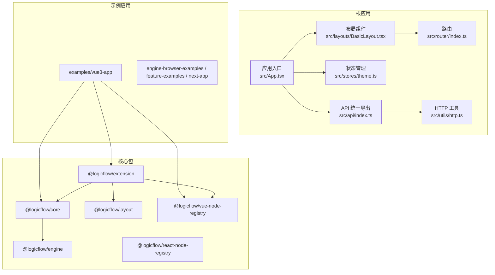
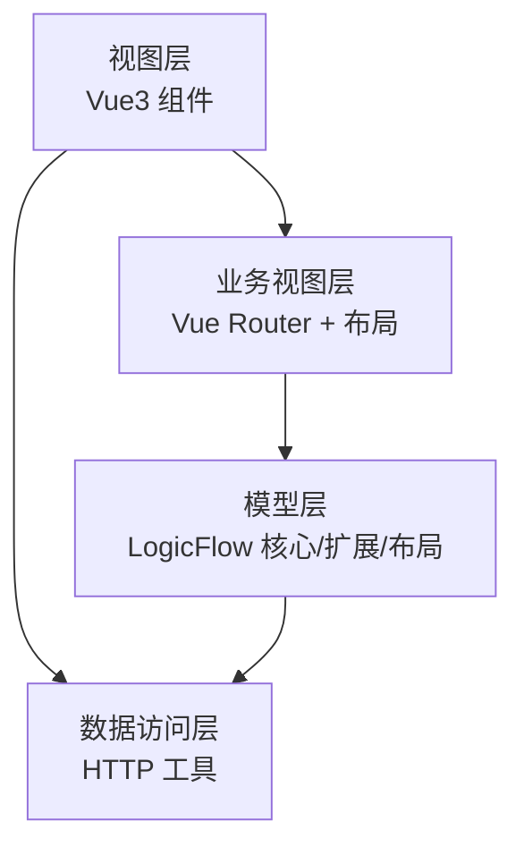
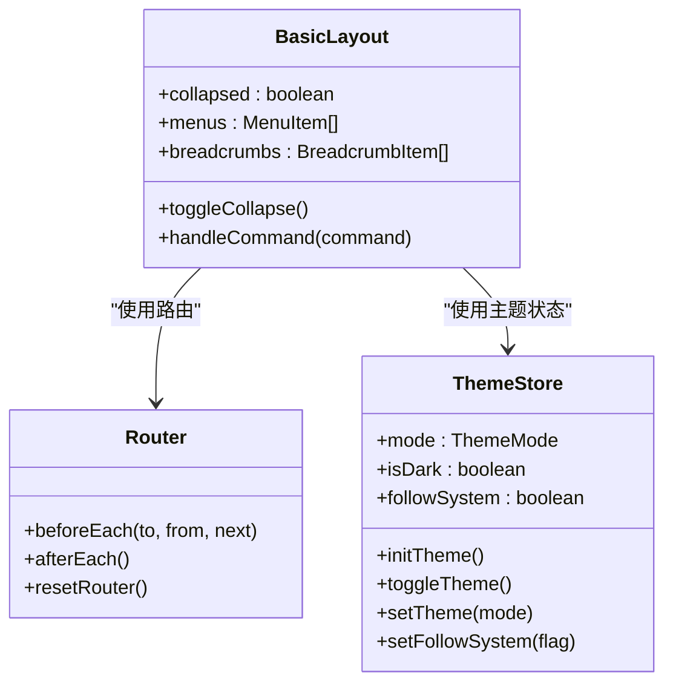
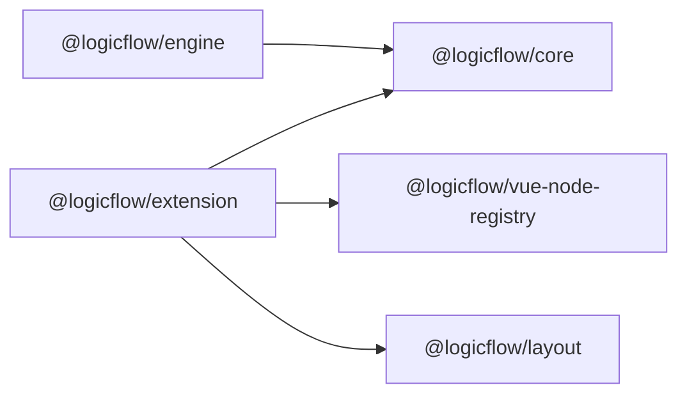
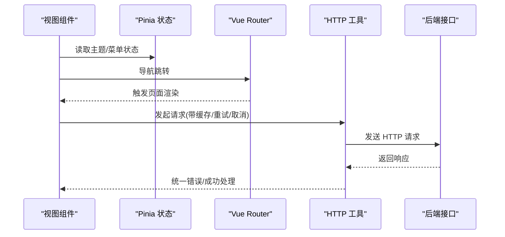
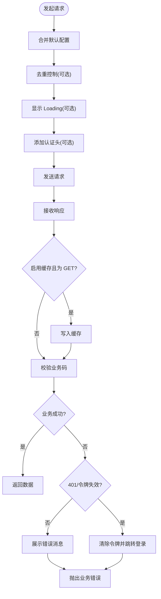
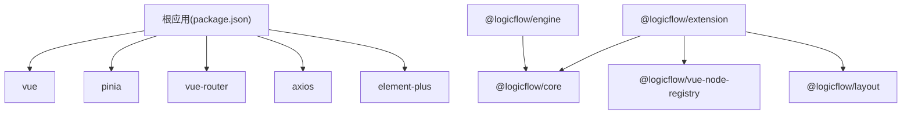

# 架构设计概览

<cite>
**本文档引用的文件**
- [package.json](file://package.json)
- [README.md](file://README.md)
- [rsbuild.config.ts](file://rsbuild.config.ts)
- [src/App.tsx](file://src/App.tsx)
- [src/layouts/BasicLayout.tsx](file://src/layouts/BasicLayout.tsx)
- [src/router/index.ts](file://src/router/index.ts)
- [src/stores/theme.ts](file://src/stores/theme.ts)
- [src/api/index.ts](file://src/api/index.ts)
- [src/utils/http.ts](file://src/utils/http.ts)
- [examples/vue3-app/src/main.ts](file://examples/vue3-app/src/main.ts)
- [packages/core/package.json](file://packages/core/package.json)
- [packages/engine/package.json](file://packages/engine/package.json)
- [packages/extension/package.json](file://packages/extension/package.json)
</cite>

## 目录
1. [引言](#引言)
2. [项目结构](#项目结构)
3. [核心组件](#核心组件)
4. [架构总览](#架构总览)
5. [详细组件分析](#详细组件分析)
6. [依赖分析](#依赖分析)
7. [性能考虑](#性能考虑)
8. [故障排查指南](#故障排查指南)
9. [结论](#结论)

## 引言
本项目基于 Rsbuild 构建工具链，采用 Vue3 + Pinia 的前端技术栈，围绕 LogicFlow 流程图引擎构建可视化流程设计与运行平台。整体架构遵循 MVVM 分层思想，结合组件化与插件化扩展理念，通过 Monorepo 组织核心库、扩展模块与示例应用，实现高内聚、低耦合与强复用的设计目标。

## 项目结构
项目采用 Monorepo 结构，根目录包含核心应用与多个子包，示例应用位于 examples 目录，便于独立演示与集成验证。

- 根应用
  - 表现层：Vue3 + Element Plus 组件库
  - 业务层：Pinia 状态管理
  - 数据层：Axios 封装的 HTTP 客户端
  - 路由层：Vue Router
- 核心包（packages）
  - @logicflow/core：流程图核心引擎
  - @logicflow/engine：流程执行引擎
  - @logicflow/extension：扩展能力集合
  - @logicflow/layout：布局算法
  - @logicflow/react-node-registry / @logicflow/vue-node-registry：节点注册表
- 示例应用（examples）
  - vue3-app：完整的 Vue3 管理后台示例
  - engine-browser-examples / feature-examples / next-app：不同场景的演示应用

**图表来源**
- [src/App.tsx](file://src/App.tsx#L1-L20)
- [src/layouts/BasicLayout.tsx](file://src/layouts/BasicLayout.tsx#L1-L146)
- [src/router/index.ts](file://src/router/index.ts#L1-L46)
- [src/stores/theme.ts](file://src/stores/theme.ts#L1-L111)
- [src/api/index.ts](file://src/api/index.ts#L1-L17)
- [src/utils/http.ts](file://src/utils/http.ts#L1-L534)
- [examples/vue3-app/src/main.ts](file://examples/vue3-app/src/main.ts#L1-L16)
- [packages/core/package.json](file://packages/core/package.json#L1-L57)
- [packages/engine/package.json](file://packages/engine/package.json#L1-L50)
- [packages/extension/package.json](file://packages/extension/package.json#L1-L61)

**章节来源**
- [package.json](file://package.json#L1-L45)
- [README.md](file://README.md#L1-L37)
- [rsbuild.config.ts](file://rsbuild.config.ts#L1-L30)

## 核心组件
- 应用入口与初始化
  - 应用入口负责挂载基础布局与初始化主题状态，确保全局样式与主题一致性。
- 布局与导航
  - 基础布局组件封装侧边栏、面包屑、头部工具栏与内容区，提供统一的页面骨架。
- 路由与导航守卫
  - 路由采用历史模式，支持前置/后置守卫，统一设置页面标题与路由重置能力。
- 状态管理（Pinia）
  - 主题状态管理包含本地持久化、系统跟随、DOM 应用与变更监听，保证主题一致性。
- HTTP 服务
  - 基于 Axios 的二次封装，提供请求/响应拦截、Loading 控制、重复请求取消、缓存、重试、错误处理与文件上传下载等能力。

**章节来源**
- [src/App.tsx](file://src/App.tsx#L1-L20)
- [src/layouts/BasicLayout.tsx](file://src/layouts/BasicLayout.tsx#L1-L146)
- [src/router/index.ts](file://src/router/index.ts#L1-L46)
- [src/stores/theme.ts](file://src/stores/theme.ts#L1-L111)
- [src/utils/http.ts](file://src/utils/http.ts#L1-L534)

## 架构总览
系统采用 MVVM 分层架构：
- 视图层（V）：Vue3 组件，负责渲染与用户交互
- 业务视图（MV）：Vue Router + 布局组件，负责页面编排与导航
- 模型层（M）：LogicFlow 核心引擎与扩展，负责数据模型与流程计算
- 插件与扩展：@logicflow/extension、@logicflow/layout、节点注册表等，提供可插拔能力
- 数据访问层：HTTP 工具封装，统一处理请求、缓存、错误与重试

**图表来源**
- [src/App.tsx](file://src/App.tsx#L1-L20)
- [src/layouts/BasicLayout.tsx](file://src/layouts/BasicLayout.tsx#L1-L146)
- [src/router/index.ts](file://src/router/index.ts#L1-L46)
- [src/utils/http.ts](file://src/utils/http.ts#L1-L534)
- [packages/core/package.json](file://packages/core/package.json#L1-L57)
- [packages/extension/package.json](file://packages/extension/package.json#L1-L61)

## 详细组件分析

### MVVM 与组件化架构
- 视图层（Vue3 组件）
  - 布局组件通过组合式 API 管理状态与生命周期，实现主题切换、菜单生成与面包屑渲染。
- 业务视图层（路由与布局）
  - 路由守卫统一设置页面标题；布局组件通过插槽与属性传递实现高度可定制。
- 模型层（LogicFlow）
  - 核心包提供节点/边/画布抽象，扩展包提供 BPMN、编辑器、高亮等能力，节点注册表支持 React/Vue 节点注册。

**图表来源**
- [src/layouts/BasicLayout.tsx](file://src/layouts/BasicLayout.tsx#L1-L146)
- [src/stores/theme.ts](file://src/stores/theme.ts#L1-L111)
- [src/router/index.ts](file://src/router/index.ts#L1-L46)

**章节来源**
- [src/layouts/BasicLayout.tsx](file://src/layouts/BasicLayout.tsx#L1-L146)
- [src/stores/theme.ts](file://src/stores/theme.ts#L1-L111)
- [src/router/index.ts](file://src/router/index.ts#L1-L46)

### 插件化扩展与模块化设计
- 插件系统
  - 扩展包通过 peerDependencies 与核心包解耦，提供节点、规则、面板等扩展能力。
- 模块化设计
  - HTTP 工具按功能拆分：请求、缓存、取消、重试、上传下载，便于按需引入与测试。
- 可复用组件
  - 布局、菜单、主题切换等组件在多页面复用，降低重复开发成本。

**图表来源**
- [packages/extension/package.json](file://packages/extension/package.json#L1-L61)
- [packages/core/package.json](file://packages/core/package.json#L1-L57)
- [packages/engine/package.json](file://packages/engine/package.json#L1-L50)

**章节来源**
- [packages/extension/package.json](file://packages/extension/package.json#L1-L61)
- [packages/core/package.json](file://packages/core/package.json#L1-L57)
- [packages/engine/package.json](file://packages/engine/package.json#L1-L50)

### 数据流向与组件通信
- 单向数据流
  - 视图通过状态管理读取主题与菜单；路由驱动页面切换；HTTP 工具统一处理请求与响应。
- 组件通信
  - 布局组件通过属性与事件向下传递（如折叠状态、菜单项），上层通过路由与状态管理进行协调。

**图表来源**
- [src/stores/theme.ts](file://src/stores/theme.ts#L1-L111)
- [src/router/index.ts](file://src/router/index.ts#L1-L46)
- [src/utils/http.ts](file://src/utils/http.ts#L1-L534)

**章节来源**
- [src/stores/theme.ts](file://src/stores/theme.ts#L1-L111)
- [src/router/index.ts](file://src/router/index.ts#L1-L46)
- [src/utils/http.ts](file://src/utils/http.ts#L1-L534)

### HTTP 请求流程与错误处理
HTTP 工具通过拦截器实现统一处理：请求阶段合并默认配置、添加 Token、去重与 Loading；响应阶段根据业务码与状态码分类处理，支持缓存、重试与错误提示，并在 401 时触发登出流程。

**图表来源**
- [src/utils/http.ts](file://src/utils/http.ts#L1-L534)

**章节来源**
- [src/utils/http.ts](file://src/utils/http.ts#L1-L534)

## 依赖分析
- 根应用依赖
  - Vue3 生态与 Element Plus 组件库，Axios 作为 HTTP 客户端，Pinia 提供状态管理，Vue Router 负责路由。
- 核心包依赖
  - @logicflow/core 为核心引擎，@logicflow/extension 为扩展集合，@logicflow/engine 提供流程执行能力，@logicflow/layout 提供布局算法，节点注册表分别面向 React 与 Vue。
- 示例应用
  - vue3-app 展示了如何在实际项目中集成 LogicFlow 与扩展能力，便于快速落地。

**图表来源**
- [package.json](file://package.json#L1-L45)
- [packages/core/package.json](file://packages/core/package.json#L1-L57)
- [packages/extension/package.json](file://packages/extension/package.json#L1-L61)
- [packages/engine/package.json](file://packages/engine/package.json#L1-L50)

**章节来源**
- [package.json](file://package.json#L1-L45)
- [packages/core/package.json](file://packages/core/package.json#L1-L57)
- [packages/extension/package.json](file://packages/extension/package.json#L1-L61)
- [packages/engine/package.json](file://packages/engine/package.json#L1-L50)

## 性能考虑
- 构建优化
  - Rsbuild 配置启用 Babel、Vue、JSX、Less 插件，路径别名指向 src，减少解析开销。
- 运行时优化
  - HTTP 工具内置请求去重、缓存与重试，降低重复请求与网络波动影响。
  - 主题状态持久化与系统跟随，减少重复计算与 DOM 操作。
- 可扩展性
  - 插件化架构允许按需加载扩展，避免不必要的包体积增长。

**章节来源**
- [rsbuild.config.ts](file://rsbuild.config.ts#L1-L30)
- [src/utils/http.ts](file://src/utils/http.ts#L1-L534)
- [src/stores/theme.ts](file://src/stores/theme.ts#L1-L111)

## 故障排查指南
- 登录态异常
  - 若出现 401 或业务码提示令牌失效，HTTP 工具会自动清除令牌并跳转登录页，需重新登录。
- 请求失败
  - 检查网络状态与后端接口可用性；若为超时或 5xx 错误，可适当增加重试次数与间隔。
- 重复请求导致的数据不一致
  - 使用去重功能避免同一请求被重复触发；必要时清理缓存或取消所有请求。
- 主题切换无效
  - 确认主题状态已持久化，DOM 类名已正确切换；若跟随系统，确认系统配色偏好设置。

**章节来源**
- [src/utils/http.ts](file://src/utils/http.ts#L1-L534)
- [src/stores/theme.ts](file://src/stores/theme.ts#L1-L111)

## 结论
本项目通过 Rsbuild 构建体系与 Vue3 技术栈，结合 LogicFlow 引擎与扩展生态，形成了清晰的 MVVM 分层与插件化架构。Monorepo 组织方式使核心能力与示例应用解耦，便于维护与复用。HTTP 工具与状态管理提供了稳健的数据访问与状态控制能力，为复杂流程场景的可视化设计与运行提供了坚实基础。