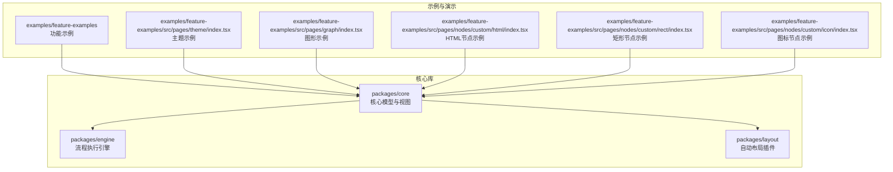
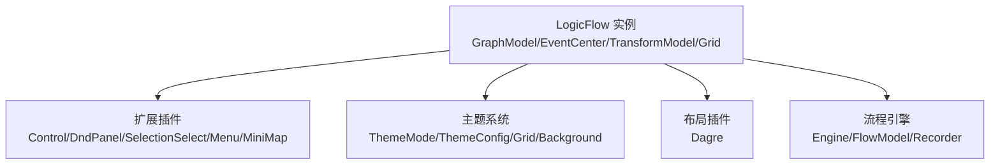
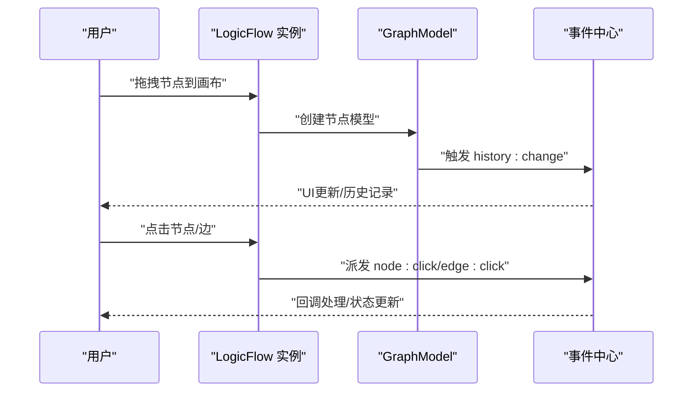
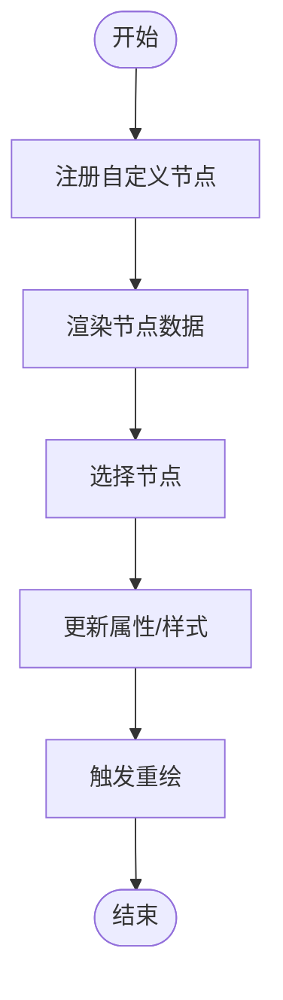
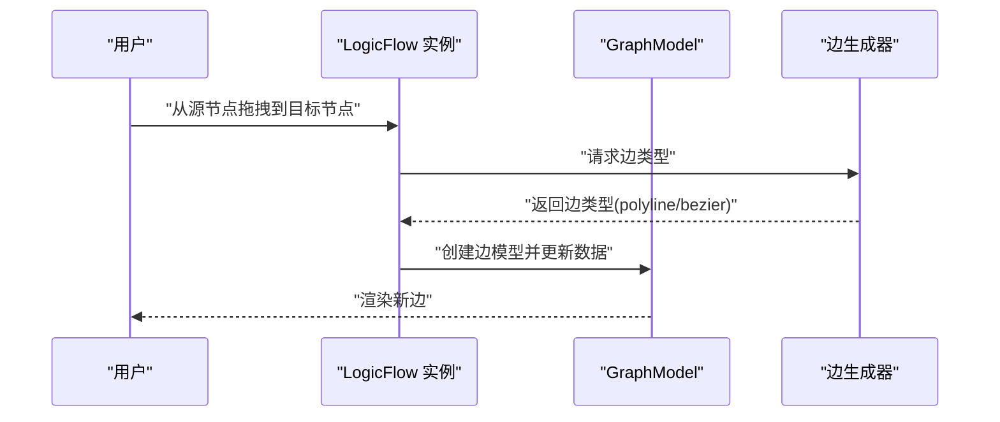
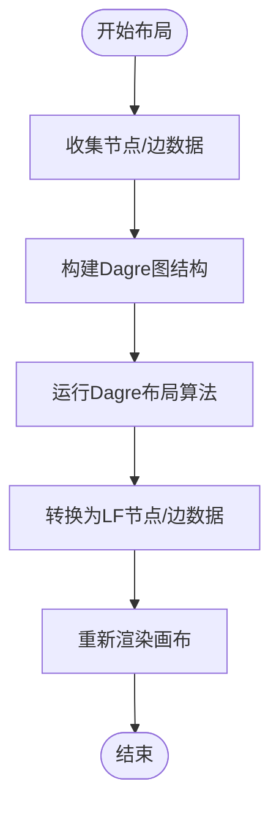
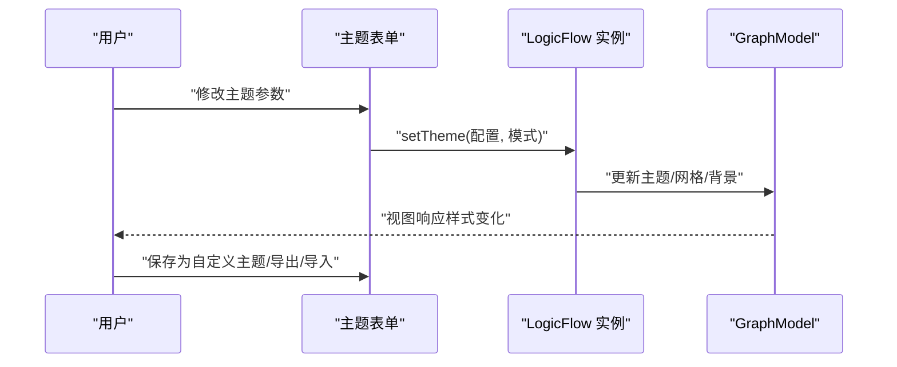
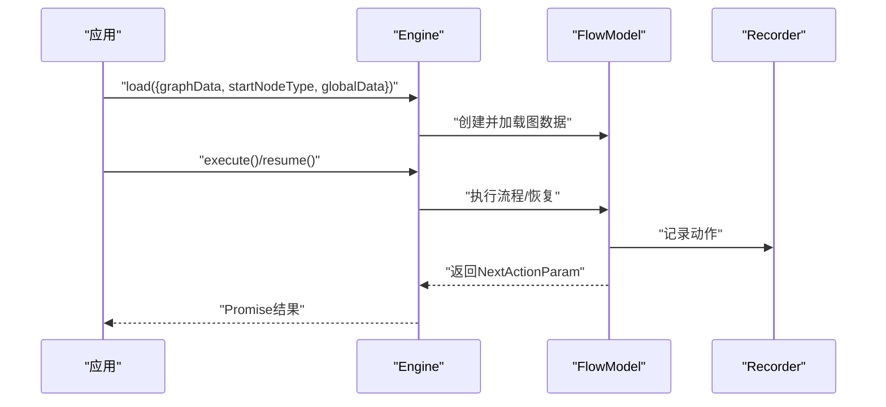
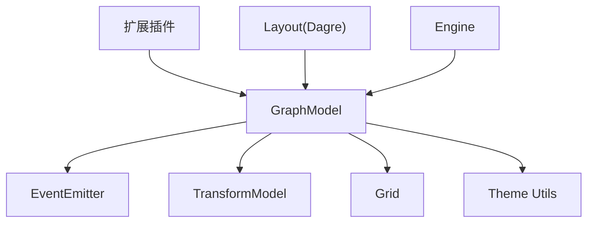

# 核心功能特性

<cite>
**本文档引用的文件**
- [packages/core/src/index.ts](file://packages/core/src/index.ts)
- [packages/engine/src/index.ts](file://packages/engine/src/index.ts)
- [packages/layout/src/index.ts](file://packages/layout/src/index.ts)
- [packages/layout/src/dagre/index.ts](file://packages/layout/src/dagre/index.ts)
- [packages/core/src/model/graphModel.ts](file://packages/core/src/model/graphModel.ts)
- [examples/feature-examples/src/pages/graph/index.tsx](file://examples/feature-examples/src/pages/graph/index.tsx)
- [examples/feature-examples/src/pages/theme/index.tsx](file://examples/feature-examples/src/pages/theme/index.tsx)
- [examples/feature-examples/src/pages/nodes/custom/html/index.tsx](file://examples/feature-examples/src/pages/nodes/custom/html/index.tsx)
- [examples/feature-examples/src/pages/nodes/custom/rect/index.tsx](file://examples/feature-examples/src/pages/nodes/custom/rect/index.tsx)
- [examples/feature-examples/src/pages/nodes/custom/icon/index.tsx](file://examples/feature-examples/src/pages/nodes/custom/icon/index.tsx)
</cite>

## 目录
1. [引言](#引言)
2. [项目结构](#项目结构)
3. [核心组件](#核心组件)
4. [架构总览](#架构总览)
5. [详细组件分析](#详细组件分析)
6. [依赖关系分析](#依赖关系分析)
7. [性能考量](#性能考量)
8. [故障排查指南](#故障排查指南)
9. [结论](#结论)
10. [附录](#附录)

## 引言
Rsbuild LogicFlow 项目是一个基于 LogicFlow 的可视化流程图引擎，提供流程图设计、节点管理、边连接、自动布局与主题系统等核心能力。本文档聚焦于项目的核心功能特性，阐述设计理念与实现原理，解释拖拽式节点创建、智能连接线绘制、自动布局计算、响应式主题切换等功能，并给出使用场景、扩展性与定制化能力说明。

## 项目结构
该项目采用多包（monorepo）结构，核心模块集中在 packages 目录，示例与演示集中在 examples 目录。核心功能围绕 LogicFlow 核心库、引擎扩展、布局插件与主题系统展开。

图表来源
- [packages/core/src/index.ts](file://packages/core/src/index.ts#L1-L27)
- [packages/engine/src/index.ts](file://packages/engine/src/index.ts#L1-L301)
- [packages/layout/src/index.ts](file://packages/layout/src/index.ts#L1-L4)
- [examples/feature-examples/src/pages/theme/index.tsx](file://examples/feature-examples/src/pages/theme/index.tsx#L1-L800)
- [examples/feature-examples/src/pages/graph/index.tsx](file://examples/feature-examples/src/pages/graph/index.tsx#L1-L800)

章节来源
- [packages/core/src/index.ts](file://packages/core/src/index.ts#L1-L27)
- [packages/engine/src/index.ts](file://packages/engine/src/index.ts#L1-L301)
- [packages/layout/src/index.ts](file://packages/layout/src/index.ts#L1-L4)

## 核心组件
- 流程图设计与交互：通过 LogicFlow 提供的画布、节点、边、工具栏、迷你地图、右键菜单、动态分组等能力，实现拖拽式节点创建、选择、编辑与历史回放。
- 节点管理：支持内置节点类型与自定义节点（HTML、矩形、图标等），统一的节点注册机制与属性更新接口。
- 边连接与智能绘制：支持折线、贝塞尔曲线等多种边类型，提供边生成规则、锚点连接、边文本编辑与动画效果。
- 自动布局：集成 Dagre 布局插件，自动计算节点位置与连线路径，支持方向、对齐与间距配置。
- 主题系统：提供主题模式切换、网格与背景配置、节点/边/文本样式定制，支持导出/导入主题配置。

章节来源
- [examples/feature-examples/src/pages/graph/index.tsx](file://examples/feature-examples/src/pages/graph/index.tsx#L1-L800)
- [examples/feature-examples/src/pages/theme/index.tsx](file://examples/feature-examples/src/pages/theme/index.tsx#L1-L800)
- [packages/layout/src/dagre/index.ts](file://packages/layout/src/dagre/index.ts#L1-L178)

## 架构总览
下图展示了核心模块之间的交互关系与数据流：

图表来源
- [packages/core/src/model/graphModel.ts](file://packages/core/src/model/graphModel.ts#L1-L800)
- [examples/feature-examples/src/pages/graph/index.tsx](file://examples/feature-examples/src/pages/graph/index.tsx#L1-L800)
- [examples/feature-examples/src/pages/theme/index.tsx](file://examples/feature-examples/src/pages/theme/index.tsx#L1-L800)
- [packages/layout/src/dagre/index.ts](file://packages/layout/src/dagre/index.ts#L1-L178)
- [packages/engine/src/index.ts](file://packages/engine/src/index.ts#L1-L301)

## 详细组件分析

### 流程图设计与交互
- 设计理念：以“所见即所得”的交互体验为核心，提供拖拽、选择、编辑、撤销/重做等常用功能，降低用户学习成本。
- 实现要点：
  - 画布容器与尺寸管理：支持容器自适应与手动设置宽高。
  - 事件中心：统一处理节点点击、边点击、空白处拖拽、历史变更等事件。
  - 工具栏与插件：控制缩放、平移、选择、菜单、迷你地图等工具。
  - 文本编辑：支持节点与边文本的双击编辑与拖拽编辑。
- 数据流：用户操作触发事件 → GraphModel 更新状态 → 视图重绘 → 历史记录写入。

图表来源
- [examples/feature-examples/src/pages/graph/index.tsx](file://examples/feature-examples/src/pages/graph/index.tsx#L598-L615)
- [packages/core/src/model/graphModel.ts](file://packages/core/src/model/graphModel.ts#L1-L800)

章节来源
- [examples/feature-examples/src/pages/graph/index.tsx](file://examples/feature-examples/src/pages/graph/index.tsx#L566-L732)
- [packages/core/src/model/graphModel.ts](file://packages/core/src/model/graphModel.ts#L160-L237)

### 节点管理
- 设计理念：统一的节点注册与生命周期管理，支持内置与自定义节点类型，灵活的属性与样式配置。
- 实现要点：
  - 节点注册：通过 register 接口注册自定义节点（HTML、矩形、图标等）。
  - 属性更新：通过 setProperties 动态更新节点样式与文本。
  - 选择与批量操作：支持多选、批量修改节点类型与尺寸。
- 数据流：节点注册 → 模型创建 → 属性更新 → 视图渲染。

图表来源
- [examples/feature-examples/src/pages/nodes/custom/html/index.tsx](file://examples/feature-examples/src/pages/nodes/custom/html/index.tsx#L17-L41)
- [examples/feature-examples/src/pages/nodes/custom/rect/index.tsx](file://examples/feature-examples/src/pages/nodes/custom/rect/index.tsx#L43-L319)
- [examples/feature-examples/src/pages/nodes/custom/icon/index.tsx](file://examples/feature-examples/src/pages/nodes/custom/icon/index.tsx#L68-L94)

章节来源
- [examples/feature-examples/src/pages/nodes/custom/html/index.tsx](file://examples/feature-examples/src/pages/nodes/custom/html/index.tsx#L17-L41)
- [examples/feature-examples/src/pages/nodes/custom/rect/index.tsx](file://examples/feature-examples/src/pages/nodes/custom/rect/index.tsx#L43-L319)
- [examples/feature-examples/src/pages/nodes/custom/icon/index.tsx](file://examples/feature-examples/src/pages/nodes/custom/icon/index.tsx#L68-L94)

### 边连接与智能绘制
- 设计理念：提供多样化的边类型与智能生成策略，支持锚点连接、边文本编辑与动画效果。
- 实现要点：
  - 边类型：折线（polyline）、贝塞尔曲线（bezier）等。
  - 边生成规则：根据起始节点类型或当前边类型动态决定边类型。
  - 锚点与连接：支持自定义目标锚点连接规则与自动对齐。
  - 文本与动画：支持边文本拖拽编辑与边动画。
- 数据流：用户开始连线 → 计算边类型 → 生成边模型 → 更新边数据 → 视图渲染。

图表来源
- [examples/feature-examples/src/pages/graph/index.tsx](file://examples/feature-examples/src/pages/graph/index.tsx#L671-L677)
- [packages/core/src/model/graphModel.ts](file://packages/core/src/model/graphModel.ts#L234-L236)

章节来源
- [examples/feature-examples/src/pages/graph/index.tsx](file://examples/feature-examples/src/pages/graph/index.tsx#L671-L677)
- [packages/core/src/model/graphModel.ts](file://packages/core/src/model/graphModel.ts#L491-L531)

### 自动布局算法（Dagre）
- 设计理念：通过自动布局减少手工调整工作量，提升复杂流程图的可读性与一致性。
- 实现要点：
  - 布局方向与对齐：支持 LR（从左到右）等方向与对齐方式。
  - 节点间距与边距：根据网格大小动态调整层间距与同层间距。
  - 路径生成：将布局结果转换为 LogicFlow 节点与边数据并重新渲染。
- 数据流：收集节点/边 → 构建图结构 → 应用 Dagre 布局 → 转换为 LF 数据 → 重新渲染。

图表来源
- [packages/layout/src/dagre/index.ts](file://packages/layout/src/dagre/index.ts#L71-L136)
- [packages/layout/src/dagre/index.ts](file://packages/layout/src/dagre/index.ts#L137-L176)

章节来源
- [packages/layout/src/dagre/index.ts](file://packages/layout/src/dagre/index.ts#L1-L178)

### 主题系统与响应式切换
- 设计理念：提供主题模式与细粒度样式配置，支持网格、背景、节点/边/文本样式以及导出/导入主题。
- 实现要点：
  - 主题模式：默认、复古、彩色、暗黑等模式切换。
  - 样式配置：通过表单映射到主题配置，支持嵌套字段与颜色值处理。
  - 网格与背景：支持网格大小、可见性、粗线配置与背景样式。
  - 导出/导入：将当前主题配置序列化为 JSON 或从文件导入。
- 数据流：用户选择主题 → 应用主题配置 → 更新 GraphModel 与视图 → 保存/导出主题。

图表来源
- [examples/feature-examples/src/pages/theme/index.tsx](file://examples/feature-examples/src/pages/theme/index.tsx#L369-L445)
- [examples/feature-examples/src/pages/theme/index.tsx](file://examples/feature-examples/src/pages/theme/index.tsx#L521-L569)
- [examples/feature-examples/src/pages/theme/index.tsx](file://examples/feature-examples/src/pages/theme/index.tsx#L572-L649)

章节来源
- [examples/feature-examples/src/pages/theme/index.tsx](file://examples/feature-examples/src/pages/theme/index.tsx#L1-L800)

### 流程执行引擎（Engine）
- 设计理念：提供流程图的执行、中断与恢复能力，支持执行记录与全局数据管理。
- 实现要点：
  - 节点注册：默认注册开始节点与任务节点，支持自定义节点模型。
  - 执行与恢复：异步执行流程，支持回调与错误处理。
  - 记录管理：可自定义执行记录存储，支持查询执行列表与动作记录。
  - 全局数据：提供全局数据的读取、设置与增量更新。
- 数据流：加载图数据 → 创建 FlowModel → 执行/恢复 → 记录动作 → 返回下一步动作。

图表来源
- [packages/engine/src/index.ts](file://packages/engine/src/index.ts#L63-L104)
- [packages/engine/src/index.ts](file://packages/engine/src/index.ts#L106-L125)
- [packages/engine/src/index.ts](file://packages/engine/src/index.ts#L127-L176)

章节来源
- [packages/engine/src/index.ts](file://packages/engine/src/index.ts#L1-L301)

## 依赖关系分析
- 核心库依赖：GraphModel 作为状态中心，依赖事件中心、变换模型、网格与主题工具。
- 插件依赖：扩展插件通过 LogicFlow 实例注册与使用，与核心库解耦。
- 示例依赖：示例页面依赖核心库与插件，演示具体功能与配置。

图表来源
- [packages/core/src/model/graphModel.ts](file://packages/core/src/model/graphModel.ts#L1-L800)
- [packages/layout/src/dagre/index.ts](file://packages/layout/src/dagre/index.ts#L1-L178)
- [packages/engine/src/index.ts](file://packages/engine/src/index.ts#L1-L301)

章节来源
- [packages/core/src/model/graphModel.ts](file://packages/core/src/model/graphModel.ts#L1-L800)

## 性能考量
- 局部渲染：GraphModel 支持局部渲染模式，仅渲染可见区域元素，减少重绘开销。
- 可见性与层级：通过可见区域裁剪与 z-index 排序，避免不必要的元素绘制。
- 事件节流：容器尺寸监听使用防抖，降低频繁 resize 带来的性能压力。
- 布局计算：Dagre 布局在大规模图上可能成为瓶颈，建议合理设置节点间距与层级。

章节来源
- [packages/core/src/model/graphModel.ts](file://packages/core/src/model/graphModel.ts#L266-L301)
- [packages/core/src/model/graphModel.ts](file://packages/core/src/model/graphModel.ts#L204-L226)
- [packages/layout/src/dagre/index.ts](file://packages/layout/src/dagre/index.ts#L74-L80)

## 故障排查指南
- 节点/边无法渲染：检查节点/边类型是否正确注册，确认 GraphModel 中的模型映射是否存在。
- 连线异常：核对边生成规则与锚点连接配置，确保起止节点存在且类型匹配。
- 主题不生效：确认主题模式与配置项是否正确传递至 setTheme，注意颜色值格式与嵌套字段处理。
- 布局错乱：检查 Dagre 配置（方向、对齐、间距）与节点尺寸，确保节点数据包含宽高信息。
- 执行报错：查看 Engine 的错误回调，确认执行上下文与全局数据是否正确设置。

章节来源
- [packages/core/src/model/graphModel.ts](file://packages/core/src/model/graphModel.ts#L514-L531)
- [examples/feature-examples/src/pages/theme/index.tsx](file://examples/feature-examples/src/pages/theme/index.tsx#L242-L260)
- [packages/layout/src/dagre/index.ts](file://packages/layout/src/dagre/index.ts#L129-L136)
- [packages/engine/src/index.ts](file://packages/engine/src/index.ts#L99-L103)

## 结论
Rsbuild LogicFlow 项目通过核心库、扩展插件与示例的协同，提供了完善的流程图设计与执行能力。其模块化架构便于扩展与定制，自动布局与主题系统提升了用户体验与可维护性。结合本文档的功能说明与最佳实践，用户可在不同业务场景中快速落地可视化流程图解决方案。

## 附录
- 使用场景举例：
  - 业务流程建模：使用拖拽创建节点与边，配合自动布局生成清晰的流程图。
  - 可视化工作流：结合引擎执行，实现流程的可视化编排与运行监控。
  - 主题定制：通过主题系统快速适配企业品牌风格与暗色模式需求。
- 扩展与定制：
  - 新增节点类型：遵循注册规范，提供节点组件与模型。
  - 自定义边类型：实现边模型与渲染逻辑，配置边生成规则。
  - 自定义布局：基于 Dagre 或其他布局算法扩展布局策略。
  - 主题扩展：新增主题模式与样式字段，支持导出/导入主题配置。