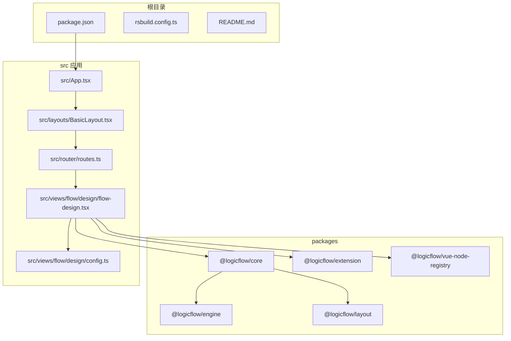
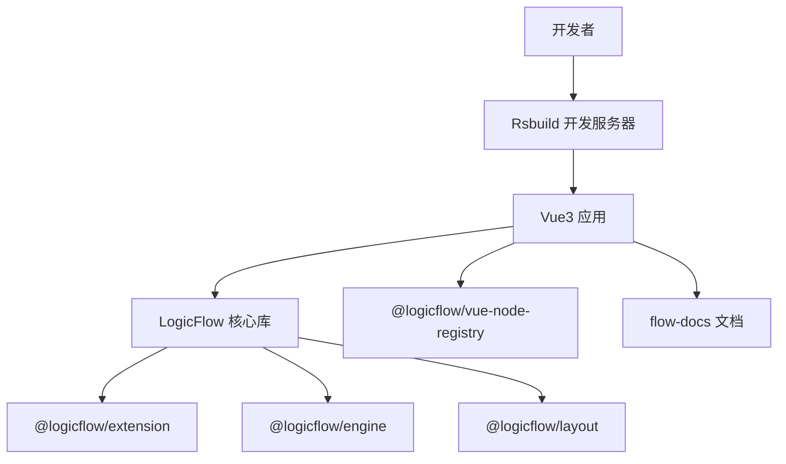
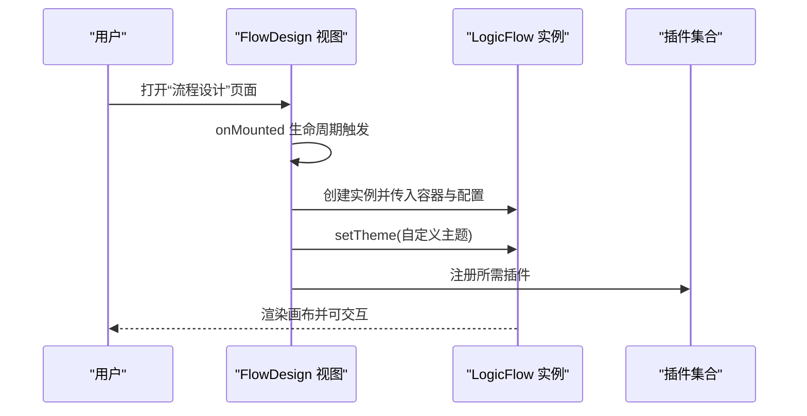
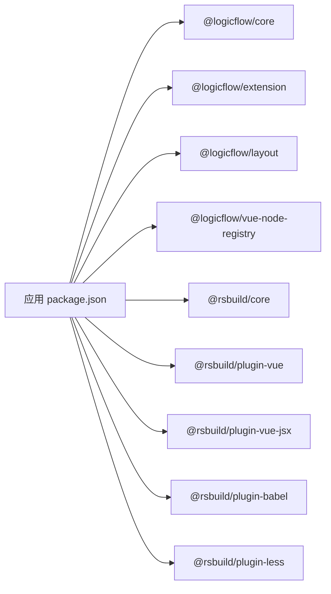

# 项目介绍与背景

<cite>
**本文引用的文件**
- [README.md](file://README.md)
- [package.json](file://package.json)
- [rsbuild.config.ts](file://rsbuild.config.ts)
- [src/App.tsx](file://src/App.tsx)
- [src/views/flow/design/flow-design.tsx](file://src/views/flow/design/flow-design.tsx)
- [src/views/flow/design/config.ts](file://src/views/flow/design/config.ts)
- [src/layouts/BasicLayout.tsx](file://src/layouts/BasicLayout.tsx)
- [src/router/routes.ts](file://src/router/routes.ts)
- [flow-docs/logicflow-workflow-projects.md](file://flow-docs/logicflow-workflow-projects.md)
- [packages/core/package.json](file://packages/core/package.json)
- [packages/engine/package.json](file://packages/engine/package.json)
- [AGENTS.md](file://AGENTS.md)
</cite>

## 目录
1. [引言](#引言)
2. [项目结构](#项目结构)
3. [核心组件](#核心组件)
4. [架构总览](#架构总览)
5. [详细组件分析](#详细组件分析)
6. [依赖关系分析](#依赖关系分析)
7. [性能考量](#性能考量)
8. [故障排查指南](#故障排查指南)
9. [结论](#结论)
10. [附录](#附录)

## 引言
本项目以 Rsbuild 为构建与开发工具链，围绕 LogicFlow 流程图引擎搭建一套“流程设计与可视化”的前端应用，旨在帮助用户在浏览器中快速完成流程图的设计、配置与导出，并为后续接入工作流引擎或服务端执行提供基础能力。项目强调：
- 易用性：通过拖拽面板与丰富的内置扩展，降低流程图设计门槛
- 可扩展性：支持自定义节点、边与主题，满足企业级定制需求
- 生态协同：与 LogicFlow 官方核心库、扩展库、引擎库形成完整闭环
- 开发效率：Rsbuild 提供高性能的开发体验与产物优化

## 项目结构
项目采用多包（monorepo）组织方式，核心目录与职责如下：
- 根目录：构建配置、脚本与顶层依赖
- packages：LogicFlow 相关子包（core、engine、extension、layout、node-registry）
- src：主应用源码（布局、路由、视图、组件、样式等）
- examples：多种运行环境与框架的示例（React/Vue/Next/Vite/Umi 等）
- flow-docs：流程图与工作流相关的知识文档与集成方案

图表来源
- [package.json](file://package.json#L1-L45)
- [rsbuild.config.ts](file://rsbuild.config.ts#L1-L30)
- [src/App.tsx](file://src/App.tsx#L1-L20)
- [src/layouts/BasicLayout.tsx](file://src/layouts/BasicLayout.tsx#L1-L146)
- [src/router/routes.ts](file://src/router/routes.ts#L1-L215)
- [src/views/flow/design/flow-design.tsx](file://src/views/flow/design/flow-design.tsx#L1-L129)
- [src/views/flow/design/config.ts](file://src/views/flow/design/config.ts#L1-L98)
- [packages/core/package.json](file://packages/core/package.json#L1-L57)
- [packages/engine/package.json](file://packages/engine/package.json#L1-L50)

章节来源
- [README.md](file://README.md#L1-L37)
- [package.json](file://package.json#L1-L45)
- [rsbuild.config.ts](file://rsbuild.config.ts#L1-L30)

## 核心组件
- Rsbuild 构建体系：负责开发服务器、打包与预览，启用 Vue、JSX、Babel、Less 插件，提供 alias 路径映射，提升开发效率与产物质量
- LogicFlow 流程引擎：提供图形化编辑、交互控制、主题与插件扩展能力；结合扩展库实现 BPMN、自动布局、缩略图、快照、右键菜单等功能
- 应用层视图：流程设计页承载 LogicFlow 实例初始化、主题设置、插件注册与容器挂载
- 布局与路由：基础布局包含侧边栏、面包屑、主题切换与用户下拉菜单；路由定义了“流程设计”等页面入口

章节来源
- [rsbuild.config.ts](file://rsbuild.config.ts#L1-L30)
- [src/views/flow/design/flow-design.tsx](file://src/views/flow/design/flow-design.tsx#L1-L129)
- [src/views/flow/design/config.ts](file://src/views/flow/design/config.ts#L1-L98)
- [src/layouts/BasicLayout.tsx](file://src/layouts/BasicLayout.tsx#L1-L146)
- [src/router/routes.ts](file://src/router/routes.ts#L1-L215)

## 架构总览
整体架构由“构建工具层（Rsbuild）—应用层（Vue3）—流程引擎层（LogicFlow）—生态扩展（Extension/Engine/Layout）”构成，形成从开发到生产的完整链路。

图表来源
- [rsbuild.config.ts](file://rsbuild.config.ts#L1-L30)
- [src/App.tsx](file://src/App.tsx#L1-L20)
- [src/views/flow/design/flow-design.tsx](file://src/views/flow/design/flow-design.tsx#L1-L129)
- [packages/core/package.json](file://packages/core/package.json#L1-L57)
- [packages/engine/package.json](file://packages/engine/package.json#L1-L50)
- [flow-docs/logicflow-workflow-projects.md](file://flow-docs/logicflow-workflow-projects.md#L1-L316)

## 详细组件分析

### Rsbuild 配置与开发体验
- 插件组合：Babel（处理 JSX/TSX）、Vue、Vue JSX、Less，覆盖现代前端开发常见场景
- 别名与服务器：通过 alias 将 @ 映射至 src，简化导入；默认不自动打开浏览器，便于多终端协作
- 开发/预览：配合 package.json 中的 scripts，一键 dev/build/preview

章节来源
- [rsbuild.config.ts](file://rsbuild.config.ts#L1-L30)
- [package.json](file://package.json#L6-L12)
- [AGENTS.md](file://AGENTS.md#L7-L9)

### LogicFlow 流程设计页（FlowDesign）
- 初始化：在挂载时创建 LogicFlow 实例，设置容器、尺寸、交互开关、键盘快捷键、网格与背景等
- 主题与样式：通过 setTheme 注入自定义主题，统一节点/边文本样式与箭头参数
- 插件注册：按需启用 BPMN 元素、自动布局、迷你地图、快照、右键菜单、分组、控制面板、XML 适配器、选择框等
- 容器与面板：左侧拖拽面板与右侧画布容器，形成“设计区+素材区”的经典布局

图表来源
- [src/views/flow/design/flow-design.tsx](file://src/views/flow/design/flow-design.tsx#L1-L129)
- [src/views/flow/design/config.ts](file://src/views/flow/design/config.ts#L1-L98)

章节来源
- [src/views/flow/design/flow-design.tsx](file://src/views/flow/design/flow-design.tsx#L1-L129)
- [src/views/flow/design/config.ts](file://src/views/flow/design/config.ts#L1-L98)

### 应用布局与路由
- 基础布局：包含侧边栏、面包屑导航、主题切换与用户下拉菜单，支持折叠与展开
- 路由定义：包含“流程设计”在内的多个页面，其中“流程设计”作为核心入口，具备权限标识与图标
- 页面渲染：BasicLayout 作为容器，router-view 占位渲染当前路由对应的视图

章节来源
- [src/layouts/BasicLayout.tsx](file://src/layouts/BasicLayout.tsx#L1-L146)
- [src/router/routes.ts](file://src/router/routes.ts#L1-L215)

### LogicFlow 生态与工作流集成
- 核心库与引擎：@logicflow/core 提供编辑能力，@logicflow/engine 提供流程执行能力，二者可独立使用或组合
- 集成方案：官方文档提供了与 Flowable、Camunda 等引擎的集成思路，涵盖 BPMN XML 导出/导入、REST 接口对接、自定义引擎扩展等
- 适用场景：审批流、业务流程建模、工作流可视化与执行跟踪

章节来源
- [packages/core/package.json](file://packages/core/package.json#L1-L57)
- [packages/engine/package.json](file://packages/engine/package.json#L1-L50)
- [flow-docs/logicflow-workflow-projects.md](file://flow-docs/logicflow-workflow-projects.md#L1-L316)

## 依赖关系分析
- 应用对 LogicFlow 的依赖：@logicflow/core、@logicflow/extension、@logicflow/layout、@logicflow/vue-node-registry
- Rsbuild 生态：@rsbuild/core 及其 Vue、JSX、Babel、Less 插件
- 开发工具：Biome、ESLint、TypeScript 等

图表来源
- [package.json](file://package.json#L1-L45)
- [rsbuild.config.ts](file://rsbuild.config.ts#L1-L30)

章节来源
- [package.json](file://package.json#L1-L45)
- [rsbuild.config.ts](file://rsbuild.config.ts#L1-L30)

## 性能考量
- 构建性能：Rsbuild 作为现代化构建工具，具备快速冷启动与热更新能力，建议在本地开发时开启 watch 模式
- 运行时性能：LogicFlow 通过插件化与按需加载减少初始体积；在大数据量场景下，建议关闭不必要的插件与网格，合理设置画布尺寸与渲染策略
- 资源优化：利用 Rsbuild 的产物压缩与 Tree Shaking，确保生产环境体积最小化

## 故障排查指南
- 开发服务器无法启动
  - 检查 Rsbuild 插件是否正确安装与启用
  - 确认别名映射与端口占用情况
- 流程图不显示或报错
  - 确认容器元素存在且尺寸有效
  - 检查插件注册顺序与主题配置是否冲突
- 构建失败或预览异常
  - 查看 Rsbuild 输出日志，确认插件版本兼容性
  - 使用脚本命令进行清理与重装依赖后再试

章节来源
- [AGENTS.md](file://AGENTS.md#L7-L26)
- [rsbuild.config.ts](file://rsbuild.config.ts#L1-L30)
- [src/views/flow/design/flow-design.tsx](file://src/views/flow/design/flow-design.tsx#L1-L129)

## 结论
本项目以 Rsbuild 为开发与构建基石，结合 LogicFlow 的强大编辑与扩展能力，构建了一个面向企业级流程设计与可视化的前端解决方案。通过清晰的目录结构、完善的插件体系与可扩展的主题机制，既能满足快速上手的需求，也能支撑复杂场景下的二次开发。配合官方与社区的工作流引擎集成方案，可进一步实现从“设计—部署—执行—监控”的全链路闭环。

## 附录
- 快速开始
  - 安装依赖与启动开发服务器
  - 访问本地地址进行流程设计
- 常用命令
  - 开发：pnpm run dev
  - 构建：pnpm run build
  - 预览：pnpm run preview
- 学习路径
  - 先掌握 LogicFlow 基础与 BPMN 规范
  - 再尝试与工作流引擎集成
  - 最后探索自定义引擎与高级特性

章节来源
- [README.md](file://README.md#L3-L29)
- [AGENTS.md](file://AGENTS.md#L7-L26)