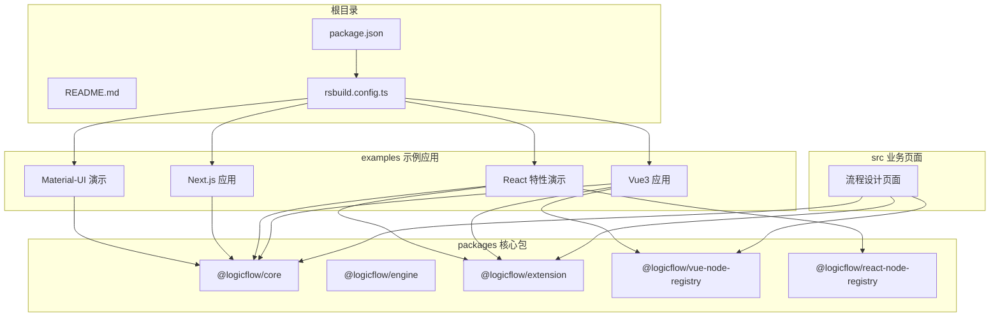
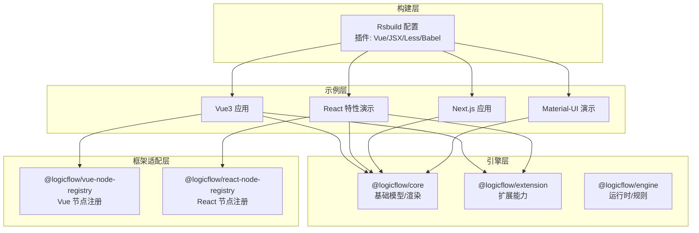
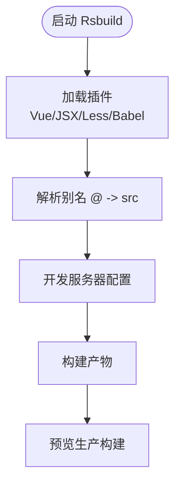
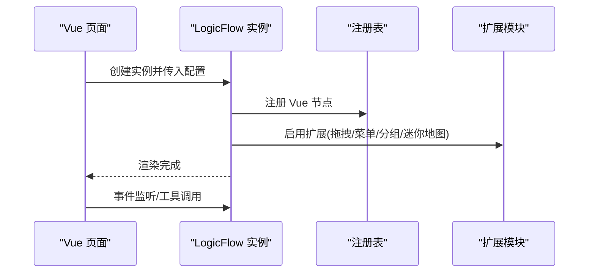
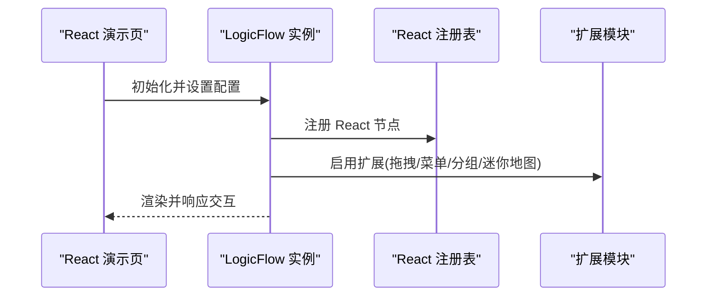
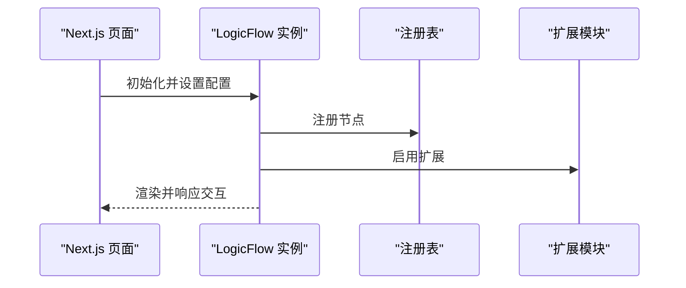
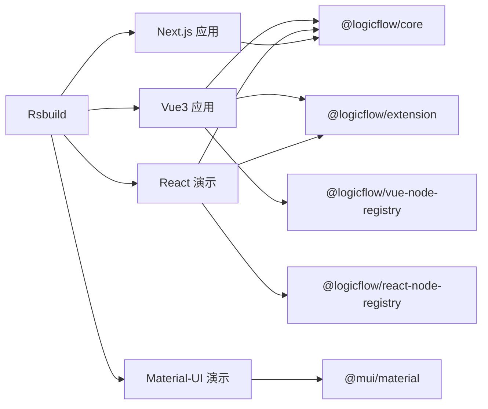

# 项目概述

<cite>
**本文引用的文件**
- [README.md](file://README.md)
- [package.json](file://package.json)
- [rsbuild.config.ts](file://rsbuild.config.ts)
- [examples/vue3-app/src/main.ts](file://examples/vue3-app/src/main.ts)
- [examples/vue3-app/src/App.vue](file://examples/vue3-app/src/App.vue)
- [examples/feature-examples/src/pages/graph/index.tsx](file://examples/feature-examples/src/pages/graph/index.tsx)
- [examples/next-app/src/app/page.tsx](file://examples/next-app/src/app/page.tsx)
- [examples/material-ui-demo/src/App.js](file://examples/material-ui-demo/src/App.js)
- [src/views/flow/design/flow-design.tsx](file://src/views/flow/design/flow-design.tsx)
- [packages/core/package.json](file://packages/core/package.json)
- [packages/engine/package.json](file://packages/engine/package.json)
- [packages/extension/package.json](file://packages/extension/package.json)
- [packages/vue-node-registry/package.json](file://packages/vue-node-registry/package.json)
- [packages/react-node-registry/package.json](file://packages/react-node-registry/package.json)
</cite>

## 目录
1. [引言](#引言)
2. [项目结构](#项目结构)
3. [核心组件](#核心组件)
4. [架构总览](#架构总览)
5. [详细组件分析](#详细组件分析)
6. [依赖关系分析](#依赖关系分析)
7. [性能考量](#性能考量)
8. [故障排查指南](#故障排查指南)
9. [结论](#结论)
10. [附录](#附录)

## 引言
Rsbuild LogicFlow 项目是一个以 LogicFlow 流程图引擎为核心，结合 Rsbuild 构建工具的现代化可视化流程设计平台。项目通过统一的构建体系与多框架适配能力，提供跨 Vue3、React、Next.js、Material-UI 的一致开发体验，并以 Monorepo 组织方式管理核心引擎、扩展模块与示例应用，便于维护与演进。

项目目标与价值：
- 以 LogicFlow 为核心，提供强大的流程图绘制、编辑与扩展能力。
- 以 Rsbuild 作为统一构建入口，提升开发效率与构建性能。
- 通过多框架示例与注册表，降低在不同前端框架中接入流程图的成本。
- 采用 Monorepo 结构，实现核心包、扩展与示例的解耦与协同。

## 项目结构
项目采用 Monorepo 架构，根目录包含统一的构建配置与脚本，核心包位于 packages 目录，示例应用位于 examples 目录，文档与通用资源位于 docs 与 flow-docs 目录。

- 根目录
  - 构建与脚本：rsbuild.config.ts、package.json、README.md
  - 通用资源：public、docs、flow-docs
- packages 核心包
  - @logicflow/core、@logicflow/engine、@logicflow/extension、@logicflow/vue-node-registry、@logicflow/react-node-registry
- examples 示例应用
  - Vue3 应用、React 特性演示、Next.js 应用、Material-UI 演示
- src 业务页面与通用组件
  - 基于 LogicFlow 的流程设计页面与通用 UI 组件

**图表来源**
- [rsbuild.config.ts](file://rsbuild.config.ts#L1-L30)
- [package.json](file://package.json#L1-L45)
- [packages/core/package.json](file://packages/core/package.json#L1-L57)
- [packages/extension/package.json](file://packages/extension/package.json#L1-L61)
- [packages/vue-node-registry/package.json](file://packages/vue-node-registry/package.json#L1-L56)
- [packages/react-node-registry/package.json](file://packages/react-node-registry/package.json#L1-L48)

**章节来源**
- [README.md](file://README.md#L1-L37)
- [package.json](file://package.json#L1-L45)
- [rsbuild.config.ts](file://rsbuild.config.ts#L1-L30)

## 核心组件
- Rsbuild 构建系统
  - 通过插件化配置启用 Vue、JSX、Less 与 Babel 支持，统一开发与生产构建体验。
- LogicFlow 核心引擎与扩展
  - @logicflow/core 提供基础流程图模型与渲染；@logicflow/extension 提供拖拽、菜单、动态分组等增强能力；@logicflow/engine 提供运行时与规则执行能力。
- Vue/React 注册表
  - @logicflow/vue-node-registry 与 @logicflow/react-node-registry 将 Vue/React 组件注册为 LogicFlow 节点，实现跨框架复用。
- 多框架示例
  - Vue3 应用、React 特性演示、Next.js 应用、Material-UI 演示，验证在不同生态中的可用性与一致性。

**章节来源**
- [packages/core/package.json](file://packages/core/package.json#L1-L57)
- [packages/engine/package.json](file://packages/engine/package.json#L1-L50)
- [packages/extension/package.json](file://packages/extension/package.json#L1-L61)
- [packages/vue-node-registry/package.json](file://packages/vue-node-registry/package.json#L1-L56)
- [packages/react-node-registry/package.json](file://packages/react-node-registry/package.json#L1-L48)

## 架构总览
项目采用“构建层 + 引擎层 + 框架适配层 + 示例层”的分层架构。Rsbuild 作为统一入口，负责编译与打包；LogicFlow 作为核心渲染与交互引擎；Vue/React 注册表将组件映射为节点；示例应用验证多框架集成效果。

**图表来源**
- [rsbuild.config.ts](file://rsbuild.config.ts#L1-L30)
- [packages/core/package.json](file://packages/core/package.json#L1-L57)
- [packages/extension/package.json](file://packages/extension/package.json#L1-L61)
- [packages/engine/package.json](file://packages/engine/package.json#L1-L50)
- [packages/vue-node-registry/package.json](file://packages/vue-node-registry/package.json#L1-L56)
- [packages/react-node-registry/package.json](file://packages/react-node-registry/package.json#L1-L48)

## 详细组件分析

### Rsbuild 构建配置
- 插件策略
  - Vue 与 JSX 插件确保单文件组件与 TSX 的正确处理。
  - Less 插件支持样式预处理。
  - Babel 插件用于 JSX 转译与语法兼容。
- 别名与开发服务器
  - 通过别名 @ 指向 src，简化导入路径。
  - 开发服务器可控制自动打开浏览器行为。
- 脚本与工作流
  - dev/build/preview/lint/format/check 等脚本统一由 Rsbuild 执行，保证开发与生产的稳定性。

**图表来源**
- [rsbuild.config.ts](file://rsbuild.config.ts#L1-L30)

**章节来源**
- [rsbuild.config.ts](file://rsbuild.config.ts#L1-L30)
- [package.json](file://package.json#L6-L12)

### LogicFlow 流程设计页面（Vue）
- 初始化与挂载
  - 在页面组件中初始化 LogicFlow 实例并挂载容器，设置主题、网格、键盘快捷键等参数。
- 节点与边注册
  - 通过注册表将自定义节点与边注册到引擎，支持多种图形与交互。
- 事件与工具
  - 监听历史变更、空白处释放等事件；提供缩放、居中、动画等工具方法。

**图表来源**
- [src/views/flow/design/flow-design.tsx](file://src/views/flow/design/flow-design.tsx#L1-L129)
- [packages/vue-node-registry/package.json](file://packages/vue-node-registry/package.json#L1-L56)
- [packages/extension/package.json](file://packages/extension/package.json#L1-L61)

**章节来源**
- [src/views/flow/design/flow-design.tsx](file://src/views/flow/design/flow-design.tsx#L1-L129)

### React 特性演示（多框架对比）
- 功能覆盖
  - 节点/边注册、主题设置、键盘快捷键、历史记录、边动画、拖拽面板等。
- 与 Vue 示例的差异
  - 使用 React 组件注册为节点，扩展模块与核心引擎保持一致。
- 适用场景
  - 验证 LogicFlow 在 React 生态下的完整能力边界与最佳实践。

**图表来源**
- [examples/feature-examples/src/pages/graph/index.tsx](file://examples/feature-examples/src/pages/graph/index.tsx#L1-L800)
- [packages/react-node-registry/package.json](file://packages/react-node-registry/package.json#L1-L48)
- [packages/extension/package.json](file://packages/extension/package.json#L1-L61)

**章节来源**
- [examples/feature-examples/src/pages/graph/index.tsx](file://examples/feature-examples/src/pages/graph/index.tsx#L1-L800)

### Next.js 应用（App Router）
- 服务端与客户端分离
  - 使用客户端指令确保交互逻辑在客户端执行。
- 集成方式
  - 与 React 演示类似，通过注册表与扩展模块实现节点与边的自定义。
- 适用场景
  - 验证 LogicFlow 在现代 SSR/APP Router 场景下的可用性。

**图表来源**
- [examples/next-app/src/app/page.tsx](file://examples/next-app/src/app/page.tsx#L1-L476)

**章节来源**
- [examples/next-app/src/app/page.tsx](file://examples/next-app/src/app/page.tsx#L1-L476)

### Material-UI 演示（UI 库集成）
- UI 库适配
  - 通过 Material-UI 主题与布局组件，构建统一的界面风格。
- 与 LogicFlow 的结合
  - 保持 LogicFlow 的核心交互不变，仅替换 UI 组件库，验证跨 UI 生态的可移植性。

**章节来源**
- [examples/material-ui-demo/src/App.js](file://examples/material-ui-demo/src/App.js#L1-L33)

### Vue3 应用（主应用）
- 应用入口
  - 在入口文件中引入 Element Plus 与路由，挂载应用。
- 菜单与视图
  - 通过菜单导航切换到不同的流程设计或特性演示视图。
- 与 LogicFlow 的集成
  - 通过注册表与扩展模块，实现节点与边的自定义与交互。

**章节来源**
- [examples/vue3-app/src/main.ts](file://examples/vue3-app/src/main.ts#L1-L16)
- [examples/vue3-app/src/App.vue](file://examples/vue3-app/src/App.vue#L1-L121)

## 依赖关系分析
- 核心依赖
  - @logicflow/core：流程图核心模型与渲染。
  - @logicflow/extension：扩展能力集合。
  - @logicflow/engine：运行时与规则执行。
  - @logicflow/vue-node-registry / @logicflow/react-node-registry：跨框架节点注册。
- 开发依赖
  - Rsbuild 及其插件：Vue/JSX/Less/Babel。
  - TypeScript、ESLint、Biome：类型检查与代码规范。
- 示例应用
  - Vue3 应用依赖 @logicflow/core、@logicflow/extension、@logicflow/vue-node-registry 与 Element Plus。
  - React 特性演示依赖 @logicflow/core、@logicflow/extension、@logicflow/react-node-registry 与 Ant Design。
  - Next.js 应用依赖 @logicflow/core。
  - Material-UI 演示依赖 @mui/material 与相关布局组件。

**图表来源**
- [package.json](file://package.json#L14-L26)
- [packages/core/package.json](file://packages/core/package.json#L1-L57)
- [packages/extension/package.json](file://packages/extension/package.json#L1-L61)
- [packages/vue-node-registry/package.json](file://packages/vue-node-registry/package.json#L1-L56)
- [packages/react-node-registry/package.json](file://packages/react-node-registry/package.json#L1-L48)
- [examples/vue3-app/src/main.ts](file://examples/vue3-app/src/main.ts#L1-L16)
- [examples/feature-examples/src/pages/graph/index.tsx](file://examples/feature-examples/src/pages/graph/index.tsx#L1-L800)
- [examples/next-app/src/app/page.tsx](file://examples/next-app/src/app/page.tsx#L1-L476)
- [examples/material-ui-demo/src/App.js](file://examples/material-ui-demo/src/App.js#L1-L33)

**章节来源**
- [package.json](file://package.json#L14-L26)
- [packages/core/package.json](file://packages/core/package.json#L1-L57)
- [packages/extension/package.json](file://packages/extension/package.json#L1-L61)
- [packages/vue-node-registry/package.json](file://packages/vue-node-registry/package.json#L1-L56)
- [packages/react-node-registry/package.json](file://packages/react-node-registry/package.json#L1-L48)

## 性能考量
- 构建性能
  - Rsbuild 插件化配置减少不必要的转译与打包开销，提升增量构建速度。
- 运行时性能
  - LogicFlow 通过局部渲染与事件节流优化交互流畅度；扩展模块按需启用，避免冗余功能。
- 资源体积
  - 通过注册表与扩展模块的按需注册，减少未使用代码的打包体积。
- 适用场景
  - 中大型流程设计系统、低代码平台、工作流可视化与协作编辑。

## 故障排查指南
- 构建失败
  - 检查 Rsbuild 插件是否正确安装与启用；确认别名与开发服务器配置。
- 运行时错误
  - 确认 LogicFlow 实例已正确初始化并传入容器；检查注册表与扩展模块版本匹配。
- 跨框架问题
  - 确保 Vue/React 注册表与核心引擎版本兼容；检查组件生命周期与状态同步。

**章节来源**
- [rsbuild.config.ts](file://rsbuild.config.ts#L1-L30)
- [src/views/flow/design/flow-design.tsx](file://src/views/flow/design/flow-design.tsx#L1-L129)
- [packages/vue-node-registry/package.json](file://packages/vue-node-registry/package.json#L1-L56)
- [packages/react-node-registry/package.json](file://packages/react-node-registry/package.json#L1-L48)

## 结论
Rsbuild LogicFlow 项目通过统一的构建体系与多框架适配，实现了 LogicFlow 在 Vue3、React、Next.js、Material-UI 等生态中的无缝集成。Monorepo 的组织方式使核心引擎、扩展模块与示例应用协同演进，既满足初学者快速上手，也为资深开发者提供了清晰的架构与扩展路径。

## 附录
- 快速开始
  - 安装依赖后，使用 Rsbuild 启动开发服务器，访问本地预览地址。
- 常用命令
  - dev：启动开发服务器
  - build：构建生产包
  - preview：本地预览生产包
  - lint/format/check：代码质量与格式化

**章节来源**
- [README.md](file://README.md#L1-L37)
- [package.json](file://package.json#L6-L12)