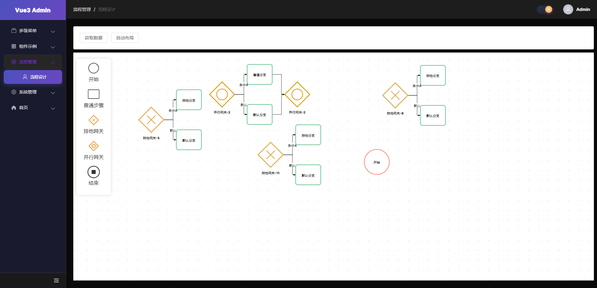

# Rsbuild + LogicFlow 流程设计器

基于 Rsbuild 和 LogicFlow 构建的可视化流程设计器，支持 BPMN 风格的流程图编辑。





## 项目概述

本项目是一个功能完整的流程设计器，支持拖拽式流程图创建、节点配置、网关分支管理等功能。采用 Vue 3 + TypeScript 技术栈，使用 Rsbuild 作为构建工具。

## 技术栈

- **Vue 3** - 前端框架
- **TypeScript** - 类型安全
- **Rsbuild** - 构建工具
- **LogicFlow** - 流程图渲染引擎
- **Element Plus** - UI 组件库
- **Dagre** - 自动布局算法

## 功能特性

### 1. 自定义节点类型

| 节点类型 | 类型标识 | 描述 | 可配置 |
|---------|---------|------|--------|
| 开始事件 | `start` | 流程开始节点，绿色圆圈 | 否 |
| 结束事件 | `end` | 流程结束节点，红色圆圈带内部矩形 | 否 |
| 排他网关 | `exclusiveGateway` | 互斥网关，用于条件分支 | 否 |
| 包容网关 | `inclusiveGateway` | 并行网关，支持多分支处理 | 否 |
| 用户任务 | `userTask` | 用户审批节点 | 是 |
| 服务任务 | `serviceTask` | 系统自动执行的任务节点 | 是 |
| 数据对象 | `dataObject` | 数据存储节点 | 是 |

### 2. 网关分支管理

- **自动创建成对网关**：拖拽网关节点时自动创建分流和聚合网关
- **分支自动连接**：自动创建默认分支连线
- **配对信息管理**：维护网关配对关系，支持查询和删除
- **分支标签**：支持为分支添加条件标签

### 3. 节点配置功能

- **节点名称修改**：通过配置抽屉修改节点显示名称
- **审批人设置**：为用户任务节点配置审批人员
- **属性持久化**：节点配置自动保存到节点属性中
- **配置抽屉**：右侧抽屉式配置面板

### 4. 交互功能

- **拖拽面板**：左侧面板支持拖拽节点到画布
- **节点点击**：单击打开配置抽屉（开始/结束/网关节点除外）
- **双击编辑**：双击节点进入文本编辑模式（开始/结束节点除外）
- **右键菜单**：支持节点右键菜单（开始/结束节点禁用）
- **自动布局**：支持一键自动布局，支持横向和纵向布局
- **缩放平移**：支持画布缩放和平移

### 5. Hooks 架构

项目采用自定义 Hooks 架构，将核心功能模块化：

| Hook | 文件 | 功能描述 |
|------|------|---------|
| `useFlowMenu` | `use-flow-menu.ts` | 管理节点右键菜单配置，禁用特定节点的菜单 |
| `useFlowEvents` | `use-flow-events.ts` | 处理节点点击/双击事件，区分单击和双击 |
| `useFlowLayout` | `use-flow-layout.ts` | 提供自动布局功能，支持横向和纵向布局 |

## 目录结构

```
src/views/flow/design/
├── common/                       # 公共模块
│   ├── lf-element/               # 自定义节点实现
│   │   ├── start-event-model.ts  # 开始节点模型
│   │   ├── start-event-node.tsx  # 开始节点视图
│   │   ├── end-event-model.ts    # 结束节点模型
│   │   ├── end-event-node.tsx    # 结束节点视图
│   │   ├── exclusive-gateway-model.ts  # 排他网关模型
│   │   ├── exclusive-gateway-node.tsx  # 排他网关视图
│   │   ├── inclusive-gateway-model.ts  # 包容网关模型
│   │   ├── inclusive-gateway-node.tsx  # 包容网关视图
│   │   ├── gateway-pair-manager.ts     # 网关配对管理器
│   │   ├── types.ts              # 节点类型定义
│   │   └── index.ts              # 统一导出
│   ├── register-flow-model.ts    # 注册所有自定义节点
│   ├── register-gateway-branch/  # 网关分支注册
│   │   ├── index.ts
│   │   ├── types.ts
│   │   └── README.md
│   ├── icons/                    # 节点图标
│   ├── config.ts                 # LogicFlow 配置
│   └-- hooks/                    # 公共 Hooks
│       ├── use-flow-menu.ts
│       ├── use-flow-events.ts
│       ├── use-flow-layout.ts
│       └── index.ts
├── components/
│   └── node-config-drawer.tsx    # 节点配置抽屉
├── styles/
│   └── flow-design.less          # 样式文件
├── flow-design.tsx               # 主组件
└── flow-dnd-panel.tsx            # 拖拽面板组件
```

## 开发指南

### 安装依赖

```bash
pnpm install
```

### 启动开发服务器

```bash
pnpm run dev
```

访问 [http://localhost:3000](http://localhost:3000) 查看应用。

### 构建生产版本

```bash
pnpm run build
```

### 预览生产构建

```bash
pnpm run preview
```

### 代码检查

```bash
# 代码检查
pnpm run lint

# 代码格式化
pnpm run format
```

## 核心API

### useFlowMenu

```typescript
const { setupNodeMenu, MENU_EXCLUDED_TYPES } = useFlowMenu(lf);
setupNodeMenu(); // 为 start、end 节点禁用右键菜单
```

### useFlowEvents

```typescript
const { setupNodeClick, clearClickTimer, DRAWER_EXCLUDED_TYPES, EDIT_EXCLUDED_TYPES } = useFlowEvents(lf, {
  onOpenDrawer: (data) => {
    // 打开配置抽屉
  },
});
setupNodeClick(); // 设置事件监听
clearClickTimer(); // 组件卸载时清理
```

### useFlowLayout

```typescript
const { autoLayout, layoutLeftToRight, layoutTopToBottom } = useFlowLayout(lf);
autoLayout(); // 使用默认配置布局
layoutLeftToRight(); // 横向布局
layoutTopToBottom(); // 纵向布局
```

## 扩展开发

### 添加新的节点类型

1. 在 `common/lf-element/` 目录下创建模型和视图文件
2. 在 `types.ts` 中添加类型定义
3. 在 `index.ts` 中导出
4. 在 `register-flow-model.ts` 中注册

### 添加新的 Hook

1. 在 `common/hooks/` 目录下创建 Hook 文件
2. 在 `index.ts` 中导出

## 相关资源

- [Rsbuild 文档](https://rsbuild.rs)
- [LogicFlow 文档](https://site.logic-flow.cn)
- [Vue 3 文档](https://vuejs.org)
- [Element Plus 文档](https://element-plus.org)
- [Dagre 布局算法](https://github.com/dagrejs/dagre)

## License

MIT
